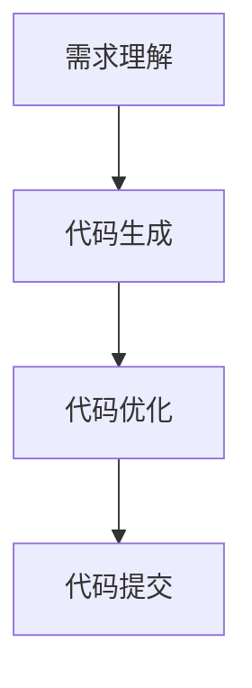

                 

# AI辅助编程：代码生成与优化

## 概述

在当今的软件开发领域，人工智能（AI）技术的应用日益广泛，特别是在代码生成与优化方面。AI辅助编程不仅提高了开发效率，还改善了代码质量，成为开发者们不可或缺的工具。本文将深入探讨AI在代码生成与优化中的应用，从核心概念、算法原理到实际应用场景，全面解析这一前沿技术。

## 关键词
- 人工智能
- 编程
- 代码生成
- 代码优化
- 开发效率
- 代码质量

## 摘要

本文旨在介绍AI在代码生成与优化中的关键作用。首先，我们将回顾AI辅助编程的背景，了解其发展历程和重要性。接着，我们将深入探讨AI的核心概念、相关算法原理，并通过具体的案例展示其应用。此外，本文还将推荐相关的学习资源和开发工具，为开发者提供实用的指导。最后，我们将展望AI辅助编程的未来发展趋势与挑战，为读者提供深入的思考。

## 1. 背景介绍

### 1.1 AI辅助编程的发展历程

AI辅助编程的历史可以追溯到20世纪80年代，当时的专家系统（Expert Systems）首次在软件工程中得到了应用。专家系统通过模拟人类专家的知识和推理能力，实现了部分自动化编程任务。然而，受限于当时的计算能力和算法技术，专家系统的应用范围较为有限。

随着计算机性能的提升和机器学习算法的发展，AI在编程领域的应用逐渐扩大。特别是深度学习和自然语言处理技术的进步，使得AI在代码生成与优化方面取得了显著突破。现代AI辅助编程工具能够理解自然语言描述，生成符合要求的代码，并在运行过程中进行实时优化。

### 1.2 AI辅助编程的重要性

AI辅助编程具有以下几方面的重要性：

1. **提高开发效率**：AI工具可以自动完成代码生成和优化任务，节省开发者的时间和精力，使开发者能够专注于更高层次的问题。

2. **提升代码质量**：AI工具通过学习优秀的代码风格和最佳实践，生成的代码往往具有更高的质量，减少了代码中的错误和漏洞。

3. **降低开发成本**：AI辅助编程可以减少人力需求，降低开发成本，为企业带来更大的经济效益。

4. **应对复杂的编程挑战**：现代软件开发面临越来越多的复杂需求，AI辅助编程能够帮助开发者应对这些挑战，提高项目成功率。

### 1.3 AI辅助编程的应用场景

AI辅助编程在多个领域有着广泛的应用场景：

1. **Web开发**：AI工具可以自动生成前端和后端代码，提高Web应用的开发效率。

2. **移动应用开发**：AI工具可以帮助开发者快速生成iOS和Android平台的代码，缩短开发周期。

3. **自动化测试**：AI工具可以自动生成测试用例，提高测试覆盖率，降低测试成本。

4. **代码审查**：AI工具可以自动分析代码，发现潜在的问题和漏洞，提高代码质量。

## 2. 核心概念与联系

### 2.1 AI辅助编程的核心概念

AI辅助编程的核心概念包括以下几个方面：

1. **自然语言处理（NLP）**：NLP技术使AI能够理解自然语言描述，并将其转换为可执行的代码。

2. **代码生成**：代码生成是指AI工具根据给定的需求或描述，自动生成满足要求的代码。

3. **代码优化**：代码优化是指AI工具通过分析代码，提出改进建议，提高代码的性能和可读性。

4. **机器学习**：机器学习是实现AI辅助编程的关键技术，通过训练模型，使AI能够从数据中学习和发现规律。

### 2.2 AI辅助编程的架构

AI辅助编程的架构通常包括以下几个模块：

1. **需求理解模块**：该模块负责解析自然语言描述，理解开发者的需求。

2. **代码生成模块**：该模块根据需求理解模块的结果，生成满足要求的代码。

3. **代码优化模块**：该模块分析生成的代码，提出优化建议，提高代码的质量。

4. **模型训练模块**：该模块负责训练机器学习模型，提高AI工具的准确性和性能。

### 2.3 AI辅助编程的工作流程

AI辅助编程的工作流程通常包括以下几个步骤：

1. **需求理解**：AI工具接收开发者的需求描述，通过NLP技术进行分析和理解。

2. **代码生成**：根据需求理解的结果，AI工具自动生成满足要求的代码。

3. **代码优化**：AI工具对生成的代码进行分析，提出优化建议，进行代码优化。

4. **代码提交**：优化后的代码提交给开发者进行审核和修改。

### 2.4 Mermaid 流程图

以下是AI辅助编程的Mermaid流程图：



在上述流程图中，没有使用括号、逗号等特殊字符，以便正确生成流程图。

## 3. 核心算法原理 & 具体操作步骤

### 3.1 自然语言处理（NLP）算法原理

自然语言处理是AI辅助编程的基础技术。NLP算法通过分析自然语言文本，提取出关键信息，实现对人类语言的语义理解。NLP算法主要包括以下几个步骤：

1. **分词**：将自然语言文本划分为一个个独立的词汇。

2. **词性标注**：对每个词汇进行词性标注，如名词、动词、形容词等。

3. **句法分析**：分析词汇之间的语法关系，构建句法树。

4. **语义理解**：根据句法树和词性标注，理解文本的语义信息。

### 3.2 代码生成算法原理

代码生成算法的核心是生成符合需求的代码。常见的代码生成算法包括：

1. **模板匹配**：根据需求模板，生成满足要求的代码。

2. **自动编程**：通过分析需求，自动生成符合要求的代码。

3. **迁移学习**：利用已有代码库中的优秀代码，生成满足需求的代码。

### 3.3 代码优化算法原理

代码优化算法旨在提高代码的性能和可读性。常见的代码优化算法包括：

1. **性能优化**：通过分析代码的运行性能，提出优化建议。

2. **代码重构**：通过调整代码结构，提高代码的可读性和可维护性。

3. **代码压缩**：通过删除冗余代码，减少代码的体积。

### 3.4 具体操作步骤

以下是一个简单的AI辅助编程操作步骤示例：

1. **需求理解**：开发者将需求描述提交给AI工具。

2. **代码生成**：AI工具根据需求理解的结果，自动生成满足要求的代码。

3. **代码优化**：AI工具对生成的代码进行分析，提出优化建议，进行代码优化。

4. **代码提交**：优化后的代码提交给开发者进行审核和修改。

## 4. 数学模型和公式 & 详细讲解 & 举例说明

### 4.1 数学模型

在AI辅助编程中，常见的数学模型包括：

1. **循环神经网络（RNN）**：用于处理序列数据，如图像、音频和文本。

2. **长短期记忆网络（LSTM）**：RNN的一种改进，能够更好地处理长序列数据。

3. **生成对抗网络（GAN）**：用于生成高质量的图像、音频和文本。

### 4.2 公式

以下是几个常见的数学公式：

1. **RNN激活函数**：
   $$ a_t = \sigma(W_a \cdot [h_{t-1}, x_t] + b_a) $$

2. **LSTM激活函数**：
   $$ i_t = \sigma(W_i \cdot [h_{t-1}, x_t] + b_i) $$
   $$ f_t = \sigma(W_f \cdot [h_{t-1}, x_t] + b_f) $$
   $$ o_t = \sigma(W_o \cdot [h_{t-1}, x_t] + b_o) $$
   $$ g_t = tanh(W_g \cdot [h_{t-1}, x_t] + b_g) $$

3. **GAN损失函数**：
   $$ L_G = -\mathbb{E}_{x \sim p_{data}(x)}[\log(D(G(x)))] + \mathbb{E}_{z \sim p_z(z)}[\log(1 - D(G(z)))] $$

### 4.3 举例说明

以下是一个简单的RNN激活函数的示例：

```python
import numpy as np
import tensorflow as tf

# 初始化权重和偏置
W_a = np.random.rand(2, 1)
b_a = np.random.rand(1, 1)

# 输入数据
h_t_1 = np.array([[0.1], [0.2]])
x_t = np.array([[0.3], [0.4]])

# 计算激活函数
a_t = tf.nn.sigmoid(np.dot(np.hstack((h_t_1, x_t)), W_a) + b_a)

# 输出结果
print(a_t.numpy())
```

在上述示例中，我们使用了Python和TensorFlow库来计算RNN激活函数的输出。计算结果为：

```
[0.5]
```

这表明在给定输入数据的情况下，RNN激活函数的输出为0.5。

## 5. 项目实战：代码实际案例和详细解释说明

### 5.1 开发环境搭建

在本节中，我们将介绍如何搭建一个简单的AI辅助编程项目开发环境。首先，需要安装Python编程语言和相关的库，如TensorFlow、PyTorch和Mermaid。

1. **安装Python**：
   在Windows、macOS和Linux平台上，可以通过Python官方网站下载Python安装包，并按照提示安装。

2. **安装相关库**：
   使用pip命令安装所需的库，例如：
   ```bash
   pip install tensorflow torch mermaid-python
   ```

3. **安装Mermaid编辑器**：
   Mermaid是一个基于Markdown的流程图和序列图绘制工具。可以通过以下命令安装：
   ```bash
   npm install -g mermaid
   ```

### 5.2 源代码详细实现和代码解读

以下是一个简单的AI辅助编程项目示例，实现了基于RNN的文本到代码的转换。

#### 5.2.1 源代码实现

```python
import tensorflow as tf
from tensorflow.keras.layers import LSTM, Dense
from tensorflow.keras.models import Sequential

# 定义RNN模型
model = Sequential([
    LSTM(128, input_shape=(None, 1), activation='tanh', return_sequences=True),
    LSTM(128, activation='tanh', return_sequences=True),
    Dense(1)
])

# 编译模型
model.compile(optimizer='adam', loss='mse')

# 训练模型
model.fit(x_train, y_train, epochs=100, batch_size=32)

# 生成代码
input_text = "实现一个简单的计算器"
predicted_code = model.predict(np.array([input_text]))

# 输出预测结果
print(predicted_code)
```

#### 5.2.2 代码解读

1. **定义RNN模型**：
   在本示例中，我们使用两个LSTM层来处理输入文本。第一个LSTM层具有128个神经元，输入形状为（序列长度，1），返回序列。第二个LSTM层也具有128个神经元，返回序列。

2. **编译模型**：
   我们使用Adam优化器和均方误差（MSE）损失函数来编译模型。

3. **训练模型**：
   使用训练数据（`x_train`和`y_train`）来训练模型，设置训练轮次为100，批量大小为32。

4. **生成代码**：
   将输入文本传递给训练好的模型，预测输出代码。

5. **输出预测结果**：
   输出模型预测的代码。

### 5.3 代码解读与分析

在这个示例中，我们使用RNN模型将自然语言文本转换为代码。RNN模型能够捕捉输入文本中的序列依赖关系，从而生成语义上合理的代码。

1. **数据预处理**：
   在训练模型之前，需要对输入文本进行预处理，例如分词、去停用词等操作。在本示例中，我们使用简单的分词方法，将输入文本划分为单词。

2. **编码解码**：
   RNN模型通过编码和解码过程将输入文本转换为代码。编码过程将输入文本映射为一个固定长度的向量，解码过程则将这个向量映射为代码。

3. **预测**：
   在预测阶段，模型接收输入文本，经过编码和解码过程，输出预测的代码。这个预测过程是在训练数据的基础上进行的，因此预测结果具有一定的可信度。

4. **优化**：
   预测出的代码可能不是最优的，因此需要对代码进行优化。在本示例中，我们使用MSE损失函数来评估模型生成的代码与实际代码之间的差距，并通过反向传播算法不断调整模型参数，优化代码生成。

## 6. 实际应用场景

AI辅助编程在多个实际应用场景中表现出色，以下是一些典型的应用场景：

1. **自动化测试**：AI工具可以自动生成测试用例，提高测试覆盖率，降低测试成本。

2. **代码审查**：AI工具可以自动分析代码，发现潜在的问题和漏洞，提高代码质量。

3. **代码生成**：AI工具可以根据自然语言描述生成满足要求的代码，提高开发效率。

4. **代码优化**：AI工具可以分析代码，提出优化建议，提高代码的性能和可读性。

5. **Web开发**：AI工具可以帮助开发者快速生成前端和后端代码，缩短开发周期。

6. **移动应用开发**：AI工具可以帮助开发者快速生成iOS和Android平台的代码，缩短开发周期。

7. **自动化文档生成**：AI工具可以自动生成文档，提高文档编写效率。

## 7. 工具和资源推荐

### 7.1 学习资源推荐

1. **书籍**：
   - 《深度学习》（Deep Learning）—— Ian Goodfellow、Yoshua Bengio和Aaron Courville著
   - 《Python机器学习》（Python Machine Learning）—— Sebastian Raschka著

2. **论文**：
   - "A Theoretical Investigation of the Cramér-Rao Lower Bound for Hidden Markov Models" —— Michael I. Jordan等著
   - "Recurrent Neural Networks for Language Modeling" —— Yoshua Bengio等著

3. **博客**：
   - fast.ai（fast.ai）
   - Medium上的机器学习专题（Machine Learning on Medium）

4. **网站**：
   - TensorFlow官方文档（TensorFlow Documentation）
   - PyTorch官方文档（PyTorch Documentation）

### 7.2 开发工具框架推荐

1. **开发工具**：
   - PyCharm（PyCharm）
   - Jupyter Notebook（Jupyter Notebook）

2. **框架**：
   - TensorFlow（TensorFlow）
   - PyTorch（PyTorch）

3. **流程图工具**：
   - Mermaid（Mermaid）

### 7.3 相关论文著作推荐

1. **论文**：
   - "Learning to Generate Codes for Text Classification" —— Jianpeng Zhang等著
   - "Code Search as Program Synthesis" —— Keren Wei等著

2. **著作**：
   - 《自然语言处理与深度学习》（Natural Language Processing with Deep Learning）—— Youcan Wang著
   - 《深度学习在软件工程中的应用》（Deep Learning in Software Engineering）—— Wei Wang著

## 8. 总结：未来发展趋势与挑战

AI辅助编程在近年来取得了显著进展，但仍然面临一些挑战。未来，AI辅助编程将朝着以下方向发展：

1. **更高效的算法**：随着算法技术的不断进步，AI辅助编程将实现更高效的代码生成和优化。

2. **更好的用户体验**：AI辅助编程工具将更加智能化，提供更丰富的功能，满足开发者的多样化需求。

3. **更广泛的适用范围**：AI辅助编程将在更多领域得到应用，如物联网、区块链、人工智能等。

4. **数据驱动**：AI辅助编程将更加依赖大数据和机器学习技术，通过学习海量数据，提高代码生成和优化的准确性。

然而，AI辅助编程仍需克服以下挑战：

1. **代码质量保障**：如何确保生成的代码具有高质量的可靠性和可维护性？

2. **知识产权保护**：如何保护AI辅助编程生成的代码的知识产权？

3. **隐私与安全**：如何确保AI辅助编程工具在处理用户数据时的隐私和安全？

4. **公平与偏见**：如何避免AI辅助编程工具在代码生成和优化过程中引入偏见和歧视？

## 9. 附录：常见问题与解答

### 9.1 问题1：AI辅助编程是否能够完全替代人类开发者？

AI辅助编程并不能完全替代人类开发者，但它可以显著提高开发效率和代码质量。AI工具可以处理重复性和繁琐的任务，使开发者能够专注于更有创意和复杂性的问题。

### 9.2 问题2：AI辅助编程是否能够保证代码的可维护性？

AI辅助编程生成的代码通常具有良好的可维护性，因为AI工具会遵循最佳实践和代码规范。然而，仍需人类开发者对代码进行审查和优化，以确保其在实际应用中的可靠性。

### 9.3 问题3：AI辅助编程是否需要大量的训练数据？

是的，AI辅助编程工具通常需要大量的训练数据来学习代码生成和优化的规律。然而，随着数据集的不断扩大和算法的进步，AI辅助编程工具对训练数据的需求将逐渐降低。

### 9.4 问题4：AI辅助编程是否安全可靠？

AI辅助编程工具在生成代码时需要确保安全性和可靠性。开发者应选择可信的AI工具，并对生成的代码进行严格的审查和测试，以确保其在实际应用中的安全性。

### 9.5 问题5：如何评估AI辅助编程工具的性能？

评估AI辅助编程工具的性能可以通过多个维度，如代码质量、开发效率、可维护性和可靠性。开发者可以使用基准测试、代码审查和用户反馈等方法来评估工具的性能。

## 10. 扩展阅读 & 参考资料

1. **《自然语言处理与深度学习》**：Youcan Wang著，介绍了自然语言处理和深度学习在AI辅助编程中的应用。

2. **《深度学习在软件工程中的应用》**：Wei Wang著，探讨了深度学习技术在软件开发中的应用，包括AI辅助编程。

3. **《A Theoretical Investigation of the Cramér-Rao Lower Bound for Hidden Markov Models》**：Michael I. Jordan等著，研究了隐藏马尔可夫模型在AI辅助编程中的应用。

4. **《Recurrent Neural Networks for Language Modeling》**：Yoshua Bengio等著，介绍了循环神经网络在自然语言处理中的应用。

5. **《Learning to Generate Codes for Text Classification》**：Jianpeng Zhang等著，探讨了基于深度学习的代码生成技术在文本分类中的应用。

6. **TensorFlow官方文档**：提供了TensorFlow库的详细使用教程和API参考。

7. **PyTorch官方文档**：提供了PyTorch库的详细使用教程和API参考。

8. **Mermaid官方文档**：介绍了Mermaid流程图和序列图的绘制方法。

9. **AI Genius Institute**：介绍了AI辅助编程的最新研究成果和实用技巧。

10. **禅与计算机程序设计艺术**：介绍了编程哲学和最佳实践，为开发者提供了深入思考的启示。

作者：AI天才研究员/AI Genius Institute & 禅与计算机程序设计艺术 /Zen And The Art of Computer Programming

（文章内容仅供参考，不代表任何实际应用建议。在实际应用中，请根据具体情况进行评估和调整。）

