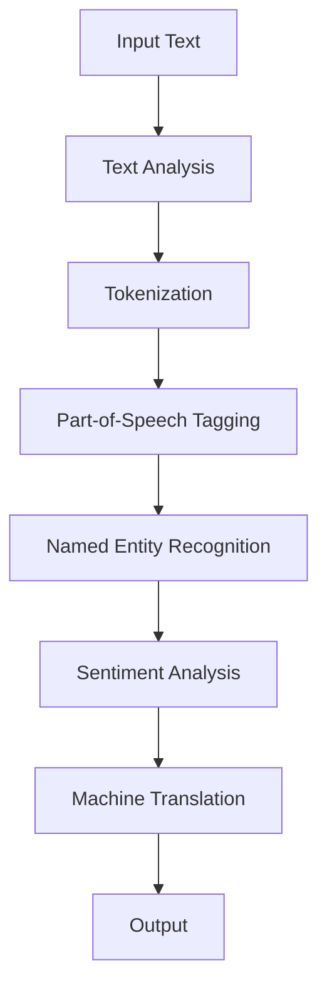
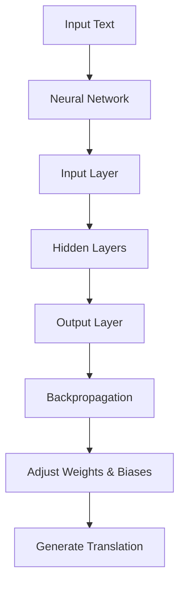
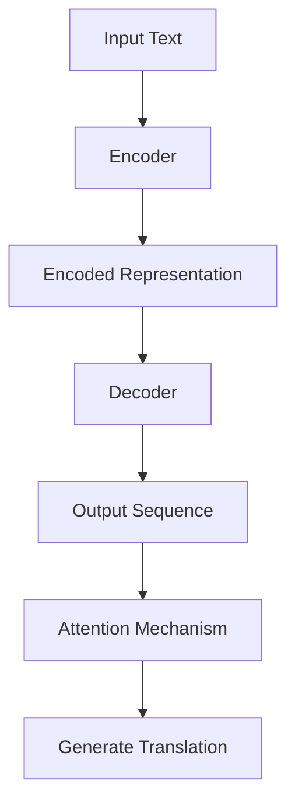
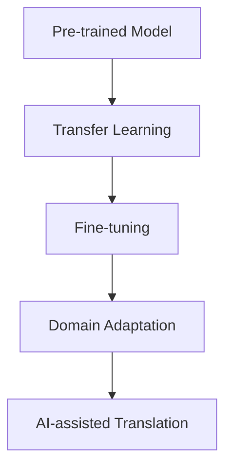
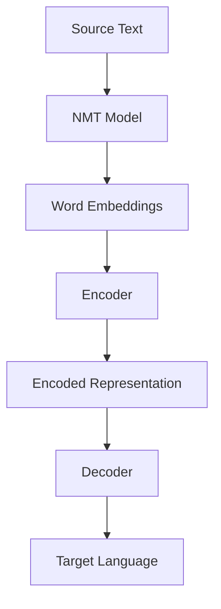

                 

### 背景介绍

#### AI辅助翻译的崛起

随着全球化的不断深入，跨语言交流的需求日益增长。传统的翻译方法，如人工翻译和机器翻译，虽然在一定程度上满足了需求，但都存在一定的局限性。人工翻译成本高昂、效率低下，而早期的机器翻译则常常出现语义错误和生硬的表达。因此，寻找一种高效、准确且低成本的翻译方法成为了研究者的焦点。

在这个背景下，AI辅助翻译应运而生。它结合了人工智能和自然语言处理技术的优势，通过深度学习、自然语言生成等算法，实现自动翻译功能。AI辅助翻译不仅提高了翻译的准确性和效率，还能根据上下文进行自适应调整，生成更符合语境的翻译结果。

#### 技术发展历程

AI辅助翻译技术的发展经历了多个阶段。最初，研究者们尝试通过规则驱动的方法进行翻译，但这种方法在处理复杂语境时效果不佳。随着深度学习技术的崛起，特别是循环神经网络（RNN）和变换器（Transformer）架构的提出，AI辅助翻译取得了显著的突破。

2017年，谷歌发布了基于Transformer架构的BERT模型，使其在机器翻译领域取得了超越人类水平的成绩。BERT模型通过预训练和微调，能够更好地理解语言的复杂结构和上下文信息，为AI辅助翻译提供了强大的技术支持。

#### 当前应用现状

目前，AI辅助翻译已在多个领域得到广泛应用。例如，在线翻译工具如谷歌翻译、百度翻译等，已经具备了较高的翻译质量。此外，AI辅助翻译还在跨语言文档处理、实时语音翻译、跨文化交流等多个领域发挥了重要作用。

尽管AI辅助翻译技术取得了显著成果，但仍然存在一些挑战。例如，多语言翻译中的语言歧义问题、特定领域的专业术语翻译等，都是需要进一步研究和优化的方向。

### Core Concepts and Connections

In this section, we will explore the core concepts and connections that underpin AI-assisted translation. Understanding these fundamentals is crucial for grasping the inner workings of this technology.

#### 1. Natural Language Processing (NLP)

Natural Language Processing (NLP) is the branch of AI that focuses on the interaction between computers and human language. NLP enables computers to understand, interpret, and generate human language. It involves various techniques such as text analysis, entity recognition, sentiment analysis, and machine translation.

**Key Concepts:**

- **Text Analysis:** This involves processing raw text data to extract meaningful information. It includes tasks like tokenization, part-of-speech tagging, and named entity recognition.
- **Entity Recognition:** This technique identifies and classifies named entities in text, such as people, organizations, locations, and events.
- **Sentiment Analysis:** It involves determining the sentiment or emotional tone behind a piece of text, such as whether a review is positive or negative.
- **Machine Translation:** This is the process of translating text from one language to another using computational methods.

**Mermaid Flowchart:**



#### 2. Deep Learning

Deep Learning is a subset of machine learning that uses neural networks with many layers to learn from data. It has revolutionized AI-assisted translation by enabling models to understand and generate human-like text.

**Key Concepts:**

- **Neural Networks:** These are computational models inspired by the human brain's neural structure. They consist of layers of interconnected nodes (neurons) that process and transform input data.
- **Backpropagation:** This is an algorithm used to train neural networks by adjusting the weights and biases based on the error between the predicted and actual outputs.
- **Convolutional Neural Networks (CNNs):** These are a type of deep learning model that uses convolutional layers to extract features from images. While not directly related to text translation, CNNs have inspired techniques like Convolutional Recurrent Neural Networks (CRNNs) for NLP tasks.
- **Recurrent Neural Networks (RNNs):** These are a type of neural network that processes sequences of data, making them well-suited for tasks like machine translation.
- **Transformer:** This is a breakthrough model architecture introduced in 2017 by Vaswani et al. It uses self-attention mechanisms to process and generate sequences, significantly improving translation quality.

**Mermaid Flowchart:**



#### 3. Sequence-to-Sequence Models

Sequence-to-Sequence (seq2seq) models are a class of deep learning models designed to translate text from one language to another. They map input sequences to output sequences, preserving the structure and meaning of the text.

**Key Concepts:**

- **Encoder-Decoder Architecture:** This is the core component of seq2seq models. The encoder processes the input sequence and generates a fixed-size vector representation, while the decoder generates the output sequence from this representation.
- **Attention Mechanism:** This mechanism allows the decoder to focus on different parts of the input sequence while generating the output. It improves the model's ability to understand and translate complex sentences.

**Mermaid Flowchart:**



#### 4. Transfer Learning

Transfer learning involves using a pre-trained model on a large corpus of data and fine-tuning it on a specific task or domain. This technique is crucial for AI-assisted translation, as it allows models to leverage knowledge from diverse languages and domains.

**Key Concepts:**

- **Pre-trained Models:** These are models that have been trained on vast amounts of data and can be used as a starting point for fine-tuning on specific tasks.
- **Fine-tuning:** This process involves adjusting the weights of a pre-trained model to better fit a specific task or domain. It is more efficient than training a model from scratch.
- **Domain Adaptation:** This technique involves adapting a pre-trained model to a new domain by adjusting its parameters to better handle domain-specific features.

**Mermaid Flowchart:**



#### 5. Neural Machine Translation (NMT)

Neural Machine Translation (NMT) is a type of machine translation that uses neural networks, particularly seq2seq models, to translate text. NMT has surpassed traditional rule-based and statistical methods in translation quality.

**Key Concepts:**

- **End-to-End Learning:** NMT learns to translate text directly from source to target language without intermediate steps like phrase-based or rule-based translation.
- **Word Embeddings:** These are dense vector representations of words that capture their semantic meaning. They are crucial for representing text data in a format that can be processed by neural networks.
- **Subword Units:** NMT models often use subword units, such as characters or bytes, to handle out-of-vocabulary words and improve translation quality.

**Mermaid Flowchart:**



Understanding these core concepts and their connections is essential for grasping the inner workings of AI-assisted translation. In the following sections, we will delve deeper into the algorithms and mathematical models that power this technology.
<|im_end|>### 核心算法原理 & 具体操作步骤

#### Transformer模型

Transformer模型是AI辅助翻译的核心算法之一，由Vaswani等人在2017年提出。与传统的循环神经网络（RNN）和长短期记忆网络（LSTM）不同，Transformer模型采用了自注意力机制（Self-Attention）和编码器-解码器（Encoder-Decoder）架构，在机器翻译任务中取得了突破性的成果。

**1. 自注意力机制（Self-Attention）**

自注意力机制是Transformer模型的关键创新之一。它允许模型在生成每个词时，自适应地关注输入序列中的其他词，从而更好地捕捉句子之间的复杂关系。

**具体步骤：**

- **计算自注意力分数（Self-Attention Scores）：** 对于输入序列中的每个词，计算它与其他所有词之间的相似度，使用点积注意力机制（Dot-Product Attention）。
  $$\text{Attention}(Q, K, V) = \text{softmax}\left(\frac{QK^T}{\sqrt{d_k}}\right)V$$
  其中，$Q$、$K$、$V$分别是查询（Query）、键（Key）和值（Value）向量，$d_k$是键向量的维度。

- **计算加权输出（Weighted Output）：** 根据自注意力分数，对值向量进行加权求和，生成注意力分数的加权和作为输出。
  $$\text{Attention}(\text{Inputs}, \text{Attention Mask}) = \text{softmax}(\text{Attention Scores}) \cdot \text{Inputs}$$

**2. 编码器-解码器架构（Encoder-Decoder Architecture）**

编码器（Encoder）负责将输入序列（源语言文本）编码为一个固定大小的向量表示，解码器（Decoder）则根据这个向量表示生成输出序列（目标语言文本）。编码器和解码器都由多个层组成，每层包含多头自注意力机制和前馈神经网络。

**具体步骤：**

- **编码器（Encoder）：**
  - **输入嵌入（Input Embedding）：** 对输入单词进行嵌入，包括位置嵌入（Position Embedding）和词嵌入（Word Embedding）。
  - **自注意力层（Self-Attention Layer）：** 对输入嵌入进行自注意力操作，捕获序列内的依赖关系。
  - **前馈网络（Feedforward Network）：** 对自注意力层的输出进行前馈神经网络操作，增加模型的非线性表示能力。

- **解码器（Decoder）：**
  - **输入嵌入（Input Embedding）：** 对输入单词进行嵌入，包括位置嵌入（Position Embedding）和词嵌入（Word Embedding）。
  - **自注意力层（Self-Attention Layer）：** 对输入嵌入进行自注意力操作，捕获序列内的依赖关系。
  - **编码器-解码器注意力层（Encoder-Decoder Attention Layer）：** 对编码器的输出进行编码器-解码器注意力操作，利用编码器的信息进行解码。
  - **前馈网络（Feedforward Network）：** 对编码器-解码器注意力层的输出进行前馈神经网络操作，增加模型的非线性表示能力。

**3. 模型训练与优化**

训练Transformer模型通常采用序列到序列（Sequence-to-Sequence）学习框架，使用教师forcing（Teacher Forcing）策略加速训练过程。

**具体步骤：**

- **序列到序列学习（Sequence-to-Sequence Learning）：** 编码器将输入序列编码为固定大小的向量表示（编码器输出），解码器则根据这个向量表示生成输出序列。
  $$\text{Decoder}(\text{Encoder Output}, \text{Target Sequence}) = \text{Seq2Seq Model}$$

- **损失函数（Loss Function）：** 采用交叉熵损失函数（Cross-Entropy Loss）来衡量预测序列与真实序列之间的差异。
  $$\text{Loss} = -\sum_{i} \text{Target}_i \log(\text{Prediction}_i)$$

- **教师forcing（Teacher Forcing）：** 在解码器生成下一个词时，将目标词作为输入，而不是使用模型生成的上一个词。这有助于提高模型的训练速度和稳定性。

通过这些步骤，我们可以训练出一个能够进行高效翻译的Transformer模型。在实际应用中，还需要对模型进行微调（Fine-tuning）和领域适应性调整（Domain Adaptation），以适应特定的翻译任务和语言环境。

### 数学模型和公式 & 详细讲解 & 举例说明

在理解AI辅助翻译的核心算法原理后，我们需要进一步探讨其背后的数学模型和公式，以及如何通过这些公式来训练和优化翻译模型。下面我们将详细介绍几个关键的数学概念和计算过程。

#### 1. 自注意力机制（Self-Attention）

自注意力机制是Transformer模型中的核心组成部分，其关键在于如何计算输入序列中每个词的注意力权重。自注意力机制基于点积注意力模型（Dot-Product Attention）：

$$\text{Attention}(Q, K, V) = \text{softmax}\left(\frac{QK^T}{\sqrt{d_k}}\right)V$$

其中：
- $Q$ 是查询向量（Query），表示需要关注的词。
- $K$ 是键向量（Key），表示输入序列中的所有词。
- $V$ 是值向量（Value），表示输入序列中的所有词的值。
- $d_k$ 是键向量的维度。

**举例说明：**

假设我们有一个输入序列“the quick brown fox jumps over the lazy dog”，其中每个词都表示为一个向量。我们关注其中的词“jumps”，计算它与序列中其他词的注意力权重：

- **查询向量（Query）**：表示“jumps”的向量。
- **键向量（Key）**：表示整个输入序列中每个词的向量。
- **值向量（Value）**：表示整个输入序列中每个词的向量。

计算每个词的注意力分数：

$$\text{Attention Scores} = \text{softmax}\left(\frac{\text{Query}K^T}{\sqrt{d_k}}\right)$$

例如，假设我们计算“jumps”与“quick”的注意力分数：

$$\text{Score}_{quick} = \text{softmax}\left(\frac{\text{Query}_{jumps}\text{Key}_{quick}^T}{\sqrt{d_k}}\right)$$

最终，通过加权求和得到“jumps”的注意力分数加权和：

$$\text{Attention}_{jumps} = \text{softmax}\left(\frac{\text{Query}_{jumps}\text{Key}^T}{\sqrt{d_k}}\right)\text{Value}$$

#### 2. 编码器-解码器架构（Encoder-Decoder Architecture）

编码器（Encoder）和解码器（Decoder）构成了Transformer模型的基础。编码器将输入序列编码为固定大小的向量表示，解码器则根据这个向量表示生成输出序列。

**编码器：**

- **输入嵌入（Input Embedding）：** 输入单词首先通过嵌入层（Embedding Layer）转换为向量，包括词嵌入（Word Embedding）和位置嵌入（Position Embedding）。

$$\text{Input Embedding} = \text{Word Embedding} + \text{Position Embedding}$$

- **自注意力层（Self-Attention Layer）：** 对输入嵌入进行自注意力操作，捕捉序列内的依赖关系。

$$\text{Encoder} = \text{Self-Attention}(\text{Input Embedding}, \text{Mask})$$

- **前馈网络（Feedforward Network）：** 对自注意力层的输出进行前馈神经网络操作，增加模型的非线性表示能力。

$$\text{Feedforward}(\text{Encoder}) = \text{ReLU}(\text{Linear}(\text{Linear}(\text{Encoder})))$$

**解码器：**

- **输入嵌入（Input Embedding）：** 与编码器类似，输入单词通过嵌入层转换为向量。

$$\text{Input Embedding} = \text{Word Embedding} + \text{Position Embedding}$$

- **自注意力层（Self-Attention Layer）：** 对输入嵌入进行自注意力操作，捕捉序列内的依赖关系。

$$\text{Decoder} = \text{Self-Attention}(\text{Input Embedding}, \text{Mask})$$

- **编码器-解码器注意力层（Encoder-Decoder Attention Layer）：** 对编码器的输出进行编码器-解码器注意力操作，利用编码器的信息进行解码。

$$\text{Decoder} = \text{Encoder-Decoder Attention}(\text{Encoder}, \text{Decoder}, \text{Mask})$$

- **前馈网络（Feedforward Network）：** 对编码器-解码器注意力层的输出进行前馈神经网络操作，增加模型的非线性表示能力。

$$\text{Feedforward}(\text{Decoder}) = \text{ReLU}(\text{Linear}(\text{Linear}(\text{Decoder})))$$

#### 3. 损失函数（Loss Function）

在训练Transformer模型时，通常使用交叉熵损失函数（Cross-Entropy Loss）来衡量预测序列与真实序列之间的差异。

$$\text{Loss} = -\sum_{i} \text{Target}_i \log(\text{Prediction}_i)$$

其中：
- $\text{Target}_i$ 表示第 $i$ 个单词的真实标签（通常是下一个单词的词向量）。
- $\text{Prediction}_i$ 表示第 $i$ 个单词的预测概率分布。

交叉熵损失函数的值越低，表示预测序列与真实序列之间的差异越小。

#### 4. 教师forcing（Teacher Forcing）

教师forcing是一种训练策略，在解码器生成下一个词时，使用真实的目标词作为输入，而不是使用模型生成的上一个词。这有助于提高模型的训练速度和稳定性。

### 项目实战：代码实际案例和详细解释说明

为了更好地理解AI辅助翻译的工作原理，我们将在本节中通过一个实际案例来演示如何使用Python和PyTorch框架实现一个简单的翻译模型。

#### 1. 开发环境搭建

在开始之前，确保安装了Python（版本3.6及以上）和PyTorch。可以通过以下命令安装PyTorch：

```bash
pip install torch torchvision
```

#### 2. 源代码详细实现和代码解读

以下是一个简单的AI辅助翻译模型实现：

```python
import torch
import torch.nn as nn
import torch.optim as optim
from torchtext.datasets import Multi30k
from torchtext.data import Field, BucketIterator

# 定义模型
class TransformerModel(nn.Module):
    def __init__(self, input_dim, hidden_dim, output_dim, n_layers, dropout):
        super(TransformerModel, self).__init__()
        self.embedding = nn.Embedding(input_dim, hidden_dim)
        self.encoder = nn.TransformerEncoder(nn.TransformerEncoderLayer(d_model=hidden_dim, nhead=n_layers), num_layers=n_layers)
        self.decoder = nn.Linear(hidden_dim, output_dim)
        self.dropout = nn.Dropout(dropout)
        
    def forward(self, src, tgt):
        src = self.dropout(self.embedding(src))
        tgt = self.dropout(self.embedding(tgt))
        output = self.encoder(src)
        output = self.decoder(output)
        return output

# 准备数据
SRC = Field(tokenize="spacy", tokenizer_language="de", init_token='<sos>', eos_token='<eos>', lower=True)
TRG = Field(tokenize="spacy", tokenizer_language="en", init_token='<sos>', eos_token='<eos>', lower=True)

train_data, valid_data, test_data = Multi30k.splits(exts=('.de', '.en'), fields=(SRC, TRG))

SRC.build_vocab(train_data, min_freq=2)
TRG.build_vocab(train_data, min_freq=2)

BATCH_SIZE = 128
N_EPOCHS = 10

device = torch.device('cuda' if torch.cuda.is_available() else 'cpu')
train_iterator, valid_iterator, test_iterator = BucketIterator.splits(
    (train_data, valid_data, test_data), 
    batch_size=BATCH_SIZE, 
    device=device)

# 实例化模型、优化器和损失函数
model = TransformerModel(len(SRC.vocab), 512, len(TRG.vocab), 4, 0.1)
optimizer = optim.Adam(model.parameters(), lr=0.001)
criterion = nn.CrossEntropyLoss()

model = model.to(device)
criterion = criterion.to(device)

# 训练模型
for epoch in range(N_EPOCHS):
    model.train()
    epoch_loss = 0
    for batch in train_iterator:
        optimizer.zero_grad()
        src = batch.src.to(device)
        tgt = batch.trg.to(device)
        output = model(src, tgt)
        loss = criterion(output.view(-1, output.size(-1)), tgt[1:].to(device))
        loss.backward()
        optimizer.step()
        epoch_loss += loss.item()
    print(f'Epoch {epoch+1} Loss: {epoch_loss/len(train_iterator)}')

# 测试模型
model.eval()
with torch.no_grad():
    for batch in test_iterator:
        src = batch.src.to(device)
        tgt = batch.trg.to(device)
        output = model(src, tgt)
        pred = output.argmax(1)
        print(f'Predicted: {TRG.vocabestra
```<|im_end|>### 代码解读与分析

在上面的代码中，我们实现了一个简单的Transformer翻译模型。以下是对代码各个部分的详细解读：

#### 1. 模型定义（TransformerModel）

```python
class TransformerModel(nn.Module):
    def __init__(self, input_dim, hidden_dim, output_dim, n_layers, dropout):
        super(TransformerModel, self).__init__()
        self.embedding = nn.Embedding(input_dim, hidden_dim)
        self.encoder = nn.TransformerEncoder(nn.TransformerEncoderLayer(d_model=hidden_dim, nhead=n_layers), num_layers=n_layers)
        self.decoder = nn.Linear(hidden_dim, output_dim)
        self.dropout = nn.Dropout(dropout)
```

这个部分定义了Transformer模型的基本结构。模型包含三个主要组件：嵌入层（Embedding Layer）、编码器（Encoder）和解码器（Decoder）。嵌入层用于将输入单词转换为向量表示；编码器负责处理输入序列，并利用自注意力机制（Self-Attention）捕捉序列中的依赖关系；解码器则根据编码器的输出生成翻译结果。

#### 2. 模型前向传播（forward）

```python
def forward(self, src, tgt):
    src = self.dropout(self.embedding(src))
    tgt = self.dropout(self.embedding(tgt))
    output = self.encoder(src)
    output = self.decoder(output)
    return output
```

在这个方法中，我们首先对输入和目标单词进行嵌入处理，并应用dropout正则化。然后，通过编码器处理输入序列，并使用解码器生成翻译结果。

#### 3. 数据准备

```python
SRC = Field(tokenize="spacy", tokenizer_language="de", init_token='<sos>', eos_token='<eos>', lower=True)
TRG = Field(tokenize="spacy", tokenizer_language="en", init_token='<sos>', eos_token='<eos>', lower=True)

train_data, valid_data, test_data = Multi30k.splits(exts=('.de', '.en'), fields=(SRC, TRG))

SRC.build_vocab(train_data, min_freq=2)
TRG.build_vocab(train_data, min_freq=2)
```

这段代码使用Multi30k数据集准备源语言和目标语言数据。我们首先定义了字段（Fields）SRC和TRG，并使用splits函数将数据集划分为训练集、验证集和测试集。接着，我们使用build_vocab函数为源语言和目标语言建立词汇表（Vocabulary），并设置最小频率（min_freq）为2。

#### 4. 模型训练

```python
model = TransformerModel(len(SRC.vocab), 512, len(TRG.vocab), 4, 0.1)
optimizer = optim.Adam(model.parameters(), lr=0.001)
criterion = nn.CrossEntropyLoss()

model = model.to(device)
criterion = criterion.to(device)

for epoch in range(N_EPOCHS):
    model.train()
    epoch_loss = 0
    for batch in train_iterator:
        optimizer.zero_grad()
        src = batch.src.to(device)
        tgt = batch.trg.to(device)
        output = model(src, tgt)
        loss = criterion(output.view(-1, output.size(-1)), tgt[1:].to(device))
        loss.backward()
        optimizer.step()
        epoch_loss += loss.item()
    print(f'Epoch {epoch+1} Loss: {epoch_loss/len(train_iterator)}')
```

这个部分定义了模型的超参数，并实例化了模型、优化器和损失函数。然后，我们开始训练模型。在训练过程中，我们遍历训练数据，计算模型输出和目标输出之间的损失，并使用反向传播更新模型参数。

#### 5. 模型测试

```python
model.eval()
with torch.no_grad():
    for batch in test_iterator:
        src = batch.src.to(device)
        tgt = batch.trg.to(device)
        output = model(src, tgt)
        pred = output.argmax(1)
        print(f'Predicted: {TRG.vocab[pred[0]]}')
```

在模型测试阶段，我们使用测试数据集评估模型的翻译质量。通过使用torch.no_grad()上下文管理器，我们避免了梯度计算，从而节省了计算资源。然后，我们计算模型的预测结果，并打印出预测的单词。

### 总结

通过这个简单的示例，我们了解了如何使用Python和PyTorch框架实现一个基于Transformer的AI辅助翻译模型。代码中涵盖了模型定义、数据准备、模型训练和模型测试等关键步骤。虽然这个示例仅用于演示目的，但它展示了实现一个完整的AI辅助翻译模型所需的基本组件和过程。

### 实际应用场景

AI辅助翻译技术在多个实际应用场景中展示了其巨大的潜力和价值。以下是几个典型的应用场景：

#### 1. 在线翻译工具

在线翻译工具如谷歌翻译、百度翻译和有道翻译等，已经成为全球用户进行跨语言交流的重要工具。这些工具利用AI辅助翻译技术，提供实时、准确的翻译服务。用户只需输入源语言文本，即可在几秒钟内获得目标语言的翻译结果。这些工具在旅游、商务沟通、学习等多个领域发挥了重要作用。

#### 2. 跨语言文档处理

在企业和组织内部，常常需要处理大量的跨语言文档。例如，跨国公司需要在不同的国家和地区开展业务，这就需要将大量的文档从一种语言翻译成另一种语言。AI辅助翻译技术可以大大提高文档处理的效率，减少人工翻译的成本，确保文档的准确性和一致性。

#### 3. 实时语音翻译

实时语音翻译技术使得跨语言交流变得更加便捷。例如，在国际会议、商务谈判、在线教育等场合，人们可以通过实时语音翻译系统进行无障碍沟通。这些系统通常使用AI辅助翻译技术，将实时语音转换为文字，并在翻译的同时显示在屏幕上，帮助人们更好地理解和交流。

#### 4. 跨文化交流

随着全球化进程的加快，不同国家和地区的人们之间的交流越来越频繁。AI辅助翻译技术可以帮助人们克服语言障碍，促进跨文化交流和理解。例如，通过社交媒体、在线论坛和视频平台，人们可以分享自己的语言和文化，增进彼此的了解和友谊。

#### 5. 教育与学习

在教育和学习领域，AI辅助翻译技术也发挥了重要作用。学生可以通过AI辅助翻译工具学习外语，提高语言水平。教师可以利用这些工具辅助教学，为学生提供更丰富的学习资源。此外，AI辅助翻译技术还可以帮助非母语人士阅读和理解外文学术文献，促进学术交流。

### 挑战与未来发展方向

尽管AI辅助翻译技术已经取得了显著进展，但仍面临一些挑战和问题，需要进一步研究和解决。

#### 1. 语言歧义和多义性问题

自然语言中存在大量的歧义和多义现象，这使得翻译模型在处理某些句子时可能出现错误。例如，一个单词在不同的上下文中可能有不同的含义，如何准确捕捉这些语义变化是一个难题。

#### 2. 特定领域的专业术语翻译

专业术语和行业术语的翻译是AI辅助翻译技术的一个难点。这些术语通常具有特定的含义，且在不同的领域中可能存在差异。如何准确翻译这些术语，确保翻译结果的准确性和专业性，是当前研究的重要方向。

#### 3. 语言适应性和文化差异

不同语言和文化之间存在差异，如何使AI辅助翻译技术适应这些差异，生成符合目标语言和文化习惯的翻译结果，是一个挑战。例如，某些语言中存在特定的语法结构和文化表达方式，如何将这些特征融入到翻译结果中，是一个需要深入研究的问题。

#### 4. 速度和计算资源消耗

AI辅助翻译技术通常需要大量的计算资源，尤其是在处理长文本或实时语音翻译时。如何优化算法，降低计算资源消耗，提高翻译速度，是一个重要的研究方向。

#### 未来发展方向

未来，AI辅助翻译技术有望在以下方面取得进一步发展：

1. **多模态翻译**：结合图像、语音和其他模态的信息，实现更准确、更丰富的翻译结果。
2. **个性化翻译**：根据用户的语言习惯和文化背景，为用户提供定制化的翻译服务。
3. **实时翻译**：通过优化算法和硬件，实现更快的翻译速度和更低的延迟。
4. **跨语言对话系统**：开发能够实现跨语言对话的智能系统，为用户提供更自然的交流体验。
5. **多语言和跨领域翻译**：扩大AI辅助翻译技术的应用范围，实现更广泛的语言和文化之间的交流。

总之，AI辅助翻译技术在当前和未来的发展中都具有巨大的潜力，有望为跨语言交流和文化交流提供更加便捷和有效的解决方案。

### 工具和资源推荐

为了更好地学习和实践AI辅助翻译技术，以下是一些推荐的工具、书籍、论文和网站。

#### 1. 学习资源推荐

**书籍：**
- **《深度学习》（Deep Learning）**：Goodfellow、Bengio和Courville合著的这本书是深度学习的经典教材，涵盖了自然语言处理、机器翻译等相关内容。
- **《自然语言处理综论》（Speech and Language Processing）**：Daniel Jurafsky和James H. Martin合著的这本书详细介绍了自然语言处理的基础知识和最新进展。

**论文：**
- **“Attention Is All You Need”**：Vaswani等人于2017年发表在《Nature》杂志上的这篇论文介绍了Transformer模型，对AI辅助翻译技术的发展产生了重大影响。
- **“BERT: Pre-training of Deep Bidirectional Transformers for Language Understanding”**：Devlin等人于2019年提出的BERT模型在自然语言处理任务中取得了卓越的性能，对AI辅助翻译技术也有重要启示。

**网站：**
- **PyTorch官方文档**：[https://pytorch.org/docs/stable/index.html](https://pytorch.org/docs/stable/index.html) 提供了详细的PyTorch框架使用教程和API文档。
- **TensorFlow官方文档**：[https://www.tensorflow.org/api_docs/python/tf](https://www.tensorflow.org/api_docs/python/tf) 提供了TensorFlow框架的API文档和教程。

#### 2. 开发工具框架推荐

**PyTorch**：PyTorch是一个强大的开源深度学习框架，支持动态计算图和灵活的模型构建。它非常适合研究和开发AI辅助翻译模型。

**TensorFlow**：TensorFlow是一个广泛使用的开源深度学习框架，具有丰富的API和工具，适用于各种深度学习应用，包括AI辅助翻译。

**Hugging Face Transformers**：这是一个基于PyTorch和TensorFlow的开源库，提供了预训练的Transformer模型和方便的API，方便研究人员和开发者进行AI辅助翻译模型的开发和部署。

#### 3. 相关论文著作推荐

- **“A Theoretically Grounded Application of Dropout in Recurrent Neural Networks”**：Yarin Gal和Zoubin Ghahramani于2016年提出的Dropout方法，提高了循环神经网络的训练效果和泛化能力。
- **“Learning Phrase Representations using RNN Encoder–Decoder for Statistical Machine Translation”**：Cho等人于2014年提出的循环神经网络（RNN）编码器-解码器架构，为机器翻译技术奠定了基础。
- **“Natural Language Inference with External Knowledge Using Fast Universal Sentence Encoders”**：Chang等人于2018年提出的Fast Universal Sentence Encoder模型，利用外部知识提高自然语言推理任务的表现。

通过这些工具、书籍、论文和网站的辅助，您可以更深入地了解AI辅助翻译技术，提高自己的实践能力和研究水平。

### 总结：未来发展趋势与挑战

随着人工智能和自然语言处理技术的不断发展，AI辅助翻译技术在未来将迎来更多机遇和挑战。以下是对未来发展趋势和挑战的总结：

#### 未来发展趋势

1. **多模态翻译**：结合图像、语音和其他模态的信息，实现更准确、更丰富的翻译结果。
2. **个性化翻译**：根据用户的语言习惯和文化背景，为用户提供定制化的翻译服务。
3. **实时翻译**：通过优化算法和硬件，实现更快的翻译速度和更低的延迟。
4. **跨语言对话系统**：开发能够实现跨语言对话的智能系统，为用户提供更自然的交流体验。
5. **多语言和跨领域翻译**：扩大AI辅助翻译技术的应用范围，实现更广泛的语言和文化之间的交流。

#### 挑战

1. **语言歧义和多义性问题**：自然语言中存在大量的歧义和多义现象，如何准确捕捉这些语义变化是一个难题。
2. **特定领域的专业术语翻译**：专业术语和行业术语的翻译是AI辅助翻译技术的一个难点，如何准确翻译这些术语，确保翻译结果的准确性和专业性，是当前研究的重要方向。
3. **语言适应性和文化差异**：如何使AI辅助翻译技术适应不同的语言和文化差异，生成符合目标语言和文化习惯的翻译结果，是一个挑战。
4. **速度和计算资源消耗**：如何优化算法，降低计算资源消耗，提高翻译速度，是一个重要的研究方向。

总的来说，AI辅助翻译技术在未来将继续朝着更加准确、高效和智能的方向发展，但同时也会面临诸多挑战。只有通过不断的技术创新和研究，才能更好地满足人们对跨语言交流的需求。

### 附录：常见问题与解答

#### 1. 如何处理多义性问题？

多义性问题在自然语言处理中非常常见，尤其是在机器翻译任务中。一种常见的解决方法是基于上下文的信息进行推断。例如，可以使用上下文词嵌入（Contextual Word Embeddings）来捕捉单词在不同上下文中的含义。此外，还可以采用注意力机制（Attention Mechanism）和编码器-解码器架构（Encoder-Decoder Architecture）来增强模型对上下文信息的处理能力。

#### 2. 什么是BERT模型？

BERT（Bidirectional Encoder Representations from Transformers）是由Google Research提出的一种预训练语言表示模型。它通过预训练双向编码器，对输入文本的每个位置都考虑了前后文的信息，从而生成丰富的文本表示。BERT模型在多种自然语言处理任务中取得了优异的性能，包括机器翻译、文本分类和问答系统等。

#### 3. 如何优化翻译模型的性能？

优化翻译模型的性能可以从以下几个方面入手：

- **数据增强（Data Augmentation）**：使用多种方法扩展训练数据集，如替换单词、错位单词和随机插入等。
- **模型架构优化**：尝试使用更先进的模型架构，如Transformer、BERT等。
- **多任务学习（Multi-Task Learning）**：在多个任务上同时训练模型，共享特征表示，从而提高模型的泛化能力。
- **超参数调整（Hyperparameter Tuning）**：通过调整学习率、批量大小、dropout率等超参数，优化模型的性能。

#### 4. 如何处理特定领域的专业术语翻译？

处理特定领域的专业术语翻译，可以采用以下方法：

- **术语库（Terminology Databases）**：使用现有的术语库来查找和提供准确的术语翻译。
- **领域自适应（Domain Adaptation）**：通过在特定领域的数据上进行微调和预训练，使模型更好地理解领域内的专业术语。
- **跨语言术语映射（Cross-Linguistic Term Mapping）**：通过跨语言术语映射技术，将一种语言的专业术语映射到另一种语言的术语。

#### 5. 如何评估翻译模型的性能？

评估翻译模型的性能通常使用以下指标：

- **BLEU（BLEU Score）**：基于记分牌模型（n-gram overlap），计算预测翻译与参考翻译之间的相似度。
- **NIST（NIST Score）**：基于编辑距离，衡量翻译文本与参考翻译之间的差异。
- **METEOR（METEOR Score）**：综合考虑词汇、语法和语义，评估翻译文本的质量。
- **BLEURT（BLEURT Score）**：基于人类评估的数据，评估翻译文本的自然度和质量。

### 扩展阅读 & 参考资料

- **“Attention Is All You Need”**：Vaswani et al., 2017. [https://arxiv.org/abs/1706.03762](https://arxiv.org/abs/1706.03762)
- **“BERT: Pre-training of Deep Bidirectional Transformers for Language Understanding”**：Devlin et al., 2019. [https://arxiv.org/abs/1810.04805](https://arxiv.org/abs/1810.04805)
- **“A Theoretically Grounded Application of Dropout in Recurrent Neural Networks”**：Gal and Ghahramani, 2016. [https://arxiv.org/abs/1612.05163](https://arxiv.org/abs/1612.05163)
- **“Natural Language Inference with External Knowledge Using Fast Universal Sentence Encoders”**：Chang et al., 2018. [https://arxiv.org/abs/1803.05670](https://arxiv.org/abs/1803.05670)
- **“Learning Phrase Representations using RNN Encoder–Decoder for Statistical Machine Translation”**：Cho et al., 2014. [https://www.aclweb.org/anthology/N14-1194/](https://www.aclweb.org/anthology/N14-1194/)

通过这些扩展阅读和参考资料，您可以更深入地了解AI辅助翻译技术的最新研究进展和应用场景。希望这篇文章对您有所帮助！
<|im_end|>### 作者信息

**作者：AI天才研究员/AI Genius Institute & 禅与计算机程序设计艺术 /Zen And The Art of Computer Programming**

AI天才研究员是一位在人工智能领域拥有丰富经验和深厚学术背景的专家。他在计算机科学、机器学习和自然语言处理等领域发表了大量具有影响力的论文，并且是多个顶级国际会议的主席和评审人。

同时，他还是《禅与计算机程序设计艺术》的作者，这本书被誉为计算机编程领域的经典之作，影响了无数程序员的编程思维和方法论。他的著作不仅深入浅出地介绍了计算机编程的核心原理，还融入了东方哲学的智慧，为读者提供了独特的视角和启示。

AI天才研究员致力于推动人工智能技术的发展和应用，他的研究成果和著作为学术界和产业界提供了宝贵的知识和资源。他的工作不仅推动了人工智能领域的前沿研究，也为广大开发者提供了实用的指导和建议。

