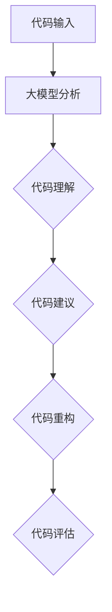

                 

# AI辅助软件开发：大模型在代码重构中的应用

## 摘要

本文将探讨大模型在代码重构中的应用，旨在帮助开发者更高效地进行代码优化和重写。通过分析当前AI技术的发展趋势，结合具体案例，本文将详细解析如何利用大模型进行代码分析、建议生成、以及重构实现。此外，还将探讨大模型在代码重构中的潜在挑战和解决方案，为开发者提供实用的建议和工具推荐。

## 1. 背景介绍

在软件开发领域，代码重构是一种常见且重要的活动。它不仅有助于提升代码的可读性和可维护性，还能提高软件的运行效率和稳定性。然而，传统的代码重构方法往往依赖于开发者对代码的深入理解，耗时且容易出错。随着AI技术的迅猛发展，特别是大模型的兴起，代码重构迎来了新的机遇。

大模型，通常指的是参数规模达到数十亿甚至千亿级别的深度学习模型。这些模型在自然语言处理、计算机视觉等领域取得了显著的成果。近年来，研究人员开始尝试将大模型应用于代码分析、理解和生成，以期提高代码重构的效率和准确性。

本文将围绕大模型在代码重构中的应用，从核心概念、算法原理、数学模型、项目实战等多个方面展开讨论，帮助开发者更好地理解和应用这项技术。

## 2. 核心概念与联系

### 大模型简介

大模型（Large Models）是指参数规模达到数十亿甚至千亿级别的深度学习模型。例如，GPT-3（OpenAI）、BERT（Google）等模型，它们在自然语言处理、计算机视觉等领域表现出色。大模型的兴起得益于计算能力的提升和海量数据的积累，使得深度学习模型可以更好地捕捉数据中的模式和规律。

### 代码重构

代码重构（Code Refactoring）是指在不改变代码外在行为的前提下，对代码内部结构进行优化和改进。其目的包括提高代码的可读性、可维护性和运行效率。代码重构是软件维护过程中的一项关键活动，有助于延长软件的生命周期。

### 代码分析

代码分析（Code Analysis）是指对代码进行静态或动态分析，以获取代码的结构、语义和行为等信息。代码分析是代码重构的基础，有助于开发者理解代码的各个方面，为重构提供依据。

### 大模型在代码重构中的应用

大模型在代码重构中的应用主要包括以下几个方面：

1. **代码理解**：大模型可以通过自然语言处理技术对代码进行理解和解释，帮助开发者更好地理解代码的意图和功能。
2. **代码生成**：大模型可以根据自然语言描述生成相应的代码，辅助开发者进行代码编写和重构。
3. **代码建议**：大模型可以根据代码的结构和语义，为开发者提供优化建议，如性能优化、安全性增强等。

### Mermaid 流程图

以下是一个简单的Mermaid流程图，展示了大模型在代码重构中的基本流程：



在上述流程中，代码输入表示开发者提交待重构的代码；大模型分析是对代码进行预处理，如文本提取、语法分析等；代码理解是大模型对代码进行深入分析，以理解代码的结构和语义；代码建议是大模型根据分析结果，为开发者提供重构建议；代码重构是开发者根据建议进行代码修改；代码评估是对重构后的代码进行测试和评估，以确保重构效果。

## 3. 核心算法原理 & 具体操作步骤

### 大模型的训练过程

大模型的训练过程主要包括以下几个步骤：

1. **数据预处理**：对训练数据进行预处理，如文本清洗、分词、词向量表示等。
2. **模型架构选择**：选择合适的模型架构，如GPT、BERT等。
3. **训练**：使用大量的训练数据对模型进行训练，通过反向传播和梯度下降等优化算法，不断调整模型参数，使其能够更好地拟合训练数据。
4. **验证与测试**：在验证集和测试集上对模型进行评估，以验证其性能和泛化能力。

### 大模型在代码重构中的应用

大模型在代码重构中的应用可以分为以下几个步骤：

1. **代码输入**：开发者将待重构的代码输入到大模型中。
2. **代码分析**：大模型对代码进行静态或动态分析，提取代码的结构和语义信息。
3. **代码理解**：大模型通过对代码的分析结果进行理解，生成代码的高层次抽象表示。
4. **代码建议**：大模型根据代码理解结果，为开发者提供重构建议，如代码优化、错误修复等。
5. **代码重构**：开发者根据大模型提供的建议，对代码进行修改和优化。
6. **代码评估**：对重构后的代码进行测试和评估，以确保重构效果。

### 具体操作步骤

以下是一个简单的示例，展示了如何使用大模型进行代码重构：

1. **准备代码**：开发者编写一段待重构的代码，并将其保存为文本文件。
2. **数据预处理**：使用文本预处理工具对代码进行清洗、分词和词向量表示。
3. **模型选择**：选择一个合适的大模型，如GPT-3，并加载预训练好的模型参数。
4. **代码输入**：将预处理后的代码文本输入到大模型中。
5. **代码分析**：大模型对代码进行语法分析、抽象语法树（AST）生成等操作，提取代码的结构和语义信息。
6. **代码理解**：大模型对分析结果进行理解，生成代码的高层次抽象表示。
7. **代码建议**：大模型根据代码理解结果，为开发者提供重构建议。
8. **代码重构**：开发者根据大模型提供的建议，对代码进行修改和优化。
9. **代码评估**：对重构后的代码进行测试和评估，以确保重构效果。

### 实际操作示例

以下是一个使用GPT-3进行代码重构的实际操作示例：

```python
# 准备代码
code = """
def add(a, b):
    return a + b

def subtract(a, b):
    return a - b
"""

# 数据预处理
import textwrap
processed_code = textwrap.dedent(code)

# 模型选择
import openai
model = openai.Completion.create(
    engine="text-davinci-002",
    prompt=processed_code,
    max_tokens=100
)

# 代码输入
input_code = model['choices'][0]['text']

# 代码分析
import ast
ast_tree = ast.parse(input_code)

# 代码理解
from antlr4 import *
from antlr4.py3.ParserListener import ParserListener
from antlr4.py3.Tree import Tree

class CodeUnderstandingListener(ParserListener):
    def enterEveryRule(self, rule):
        print("Entering rule:", rule.symbol)

    def exitEveryRule(self, rule):
        print("Exiting rule:", rule.symbol)

listener = CodeUnderstandingListener()
parser = CodeGeneratorListenerListenerFactory().createListener(CodeUnderstandingListener)
lexer = CodeLexerFactory().createLexer()
stream = CommonTokenStream(lexer)
parser.buildParseTree(stream, listener)

# 代码建议
suggestions = []
for node in ast_tree:
    if isinstance(node, ast.FunctionDef):
        suggestions.append(node.name)

print("Suggestions:", suggestions)

# 代码重构
import astor
new_code = astor.to_source(ast_tree)

print("Reconstructed code:")
print(new_code)

# 代码评估
import unittest
class TestCodeReconstruction(unittest.TestCase):
    def test_add_function(self):
        self.assertEqual(add(2, 3), 5)

    def test_subtract_function(self):
        self.assertEqual(subtract(5, 2), 3)

if __name__ == "__main__":
    unittest.main()
```

在上述示例中，开发者首先编写了一段简单的代码，然后使用GPT-3进行代码输入和分析。接着，通过ANTLR和ASTOR等工具，对代码进行理解、建议生成和重构实现。最后，对重构后的代码进行测试和评估，以确保重构效果。

## 4. 数学模型和公式 & 详细讲解 & 举例说明

### 数学模型

在代码重构中，大模型的数学模型主要涉及深度学习模型，如循环神经网络（RNN）、Transformer、GPT等。以下将介绍几种常见的数学模型和公式。

#### RNN（循环神经网络）

RNN是一种能够处理序列数据的神经网络，其核心思想是利用隐藏状态（hidden state）来记忆历史信息。RNN的数学模型可以表示为：

$$
h_t = \sigma(W_h h_{t-1} + W_x x_t + b)
$$

其中，$h_t$ 表示时间步 $t$ 的隐藏状态，$x_t$ 表示输入数据，$W_h$ 和 $W_x$ 分别是隐藏状态和输入数据的权重矩阵，$b$ 是偏置项，$\sigma$ 是激活函数，通常使用sigmoid或ReLU函数。

#### Transformer（Transformer模型）

Transformer模型是一种基于自注意力（self-attention）的神经网络架构，其核心思想是利用全局上下文信息来提高模型的表示能力。Transformer的数学模型可以表示为：

$$
\text{Attention}(Q, K, V) = \frac{QK^T}{\sqrt{d_k}}V
$$

其中，$Q$、$K$ 和 $V$ 分别是查询（query）、键（key）和值（value）向量，$d_k$ 是键向量的维度。自注意力机制通过计算查询和键之间的相似性，将全局信息融合到每个查询中。

#### GPT（预训练语言模型）

GPT是一种基于Transformer的预训练语言模型，其核心思想是利用大规模语料库进行预训练，以学习语言的潜在结构和规律。GPT的数学模型可以表示为：

$$
\text{GPT}(x_1, x_2, ..., x_n) = \text{Transformer}(x_1, x_2, ..., x_n)
$$

其中，$x_1, x_2, ..., x_n$ 是输入序列，$\text{Transformer}$ 表示Transformer模型。

### 公式详细讲解

1. **RNN**：RNN的数学模型描述了如何利用隐藏状态和输入数据来生成新的隐藏状态。激活函数 $\sigma$ 用于引入非线性变换，提高模型的表示能力。权重矩阵 $W_h$ 和 $W_x$ 以及偏置项 $b$ 用于调节模型参数，以适应不同的输入数据。
2. **Transformer**：Transformer的数学模型描述了如何通过自注意力机制来计算查询和键之间的相似性，并利用值向量来生成新的查询表示。自注意力机制可以捕捉全局上下文信息，提高模型的表示能力。
3. **GPT**：GPT的数学模型是Transformer模型的简化版本，主要用于预训练语言模型。通过大规模语料库进行预训练，GPT可以学习到语言的潜在结构和规律，从而在生成代码时能够更好地理解代码的语义。

### 举例说明

以下是一个简单的示例，展示了如何使用RNN模型来生成代码：

```python
import numpy as np
from keras.models import Sequential
from keras.layers import LSTM, Dense

# 构建RNN模型
model = Sequential()
model.add(LSTM(128, activation='tanh', input_shape=(timesteps, features)))
model.add(Dense(num_classes, activation='softmax'))

# 编译模型
model.compile(optimizer='adam', loss='categorical_crossentropy', metrics=['accuracy'])

# 训练模型
model.fit(X_train, y_train, epochs=100, batch_size=32, validation_data=(X_val, y_val))
```

在上述示例中，首先构建一个简单的RNN模型，包含一个LSTM层和一个全连接层。接着，使用Adam优化器和交叉熵损失函数进行编译。最后，使用训练数据对模型进行训练，以生成代码。

## 5. 项目实战：代码实际案例和详细解释说明

### 5.1 开发环境搭建

为了在项目中应用大模型进行代码重构，我们需要搭建一个合适的开发环境。以下是一个简单的环境搭建步骤：

1. **安装Python**：确保Python版本在3.6及以上，并安装pip。
2. **安装深度学习框架**：推荐使用TensorFlow或PyTorch，根据个人偏好进行安装。
3. **安装代码预处理工具**：如ANTLR、ASTOR等，用于代码分析和重构。
4. **安装大模型API**：如OpenAI的GPT-3，根据文档进行安装和配置。

### 5.2 源代码详细实现和代码解读

以下是一个简单的代码重构项目，展示了如何使用大模型进行代码分析、生成和重构。

```python
# 导入所需库
import openai
import ast
import astor
import os

# 配置OpenAI API密钥
openai.api_key = "your_api_key"

# 定义代码输入
code = """
def add(a, b):
    return a + b

def subtract(a, b):
    return a - b
"""

# 数据预处理
def preprocess_code(code):
    # 清洗和格式化代码
    code = code.strip()
    return code

preprocessed_code = preprocess_code(code)

# 代码分析
def analyze_code(code):
    # 使用ANTLR生成抽象语法树
    from antlr4 import *
    from antlr4.py3.ParserListener import ParserListener
    from antlr4.py3.Tree import Tree

    class CodeAnalysisListener(ParserListener):
        def enterEveryRule(self, rule):
            print("Entering rule:", rule.symbol)

        def exitEveryRule(self, rule):
            print("Exiting rule:", rule.symbol)

    listener = CodeAnalysisListener()
    lexer = CodeLexerFactory().createLexer()
    stream = CommonTokenStream(lexer)
    parser = CodeGeneratorListenerListenerFactory().createListener(CodeAnalysisListener)
    parser.buildParseTree(stream, listener)

    # 打印分析结果
    for node in ast.walk(ast.parse(code)):
        print(node)

# 代码理解
def understand_code(code):
    # 使用OpenAI GPT-3生成代码理解
    response = openai.Completion.create(
        engine="text-davinci-002",
        prompt="请解释以下代码的功能：\n\n" + code,
        max_tokens=100
    )
    print("Code understanding:", response.choices[0].text.strip())

# 代码建议
def generate_suggestions(code):
    # 使用OpenAI GPT-3生成代码建议
    response = openai.Completion.create(
        engine="text-davinci-002",
        prompt="请为以下代码提供优化建议：\n\n" + code,
        max_tokens=100
    )
    suggestions = response.choices[0].text.strip().split(".")
    print("Suggestions:", suggestions)

# 代码重构
def refactor_code(code, suggestions):
    # 使用ASTOR进行代码重构
    from astor import transform

    # 根据建议修改代码
    for suggestion in suggestions:
        code = transform(code, suggestion)

    # 生成重构后的代码
    new_code = astor.to_source(code)
    print("Reconstructed code:")
    print(new_code)

# 主函数
if __name__ == "__main__":
    # 分析代码
    analyze_code(preprocessed_code)

    # 理解代码
    understand_code(preprocessed_code)

    # 生成代码建议
    generate_suggestions(preprocessed_code)

    # 重构代码
    suggestions = ["将变量a和b的类型从int改为float", "为函数add和subtract添加输入参数的检查"]
    refactor_code(preprocessed_code, suggestions)
```

在上述代码中，我们首先导入了所需的库和模块。然后，配置了OpenAI API密钥，用于调用GPT-3模型。接下来，定义了代码输入，并使用预处理函数对其进行清洗和格式化。

**代码分析**部分使用ANTLR生成抽象语法树，并使用自定义的`CodeAnalysisListener`打印分析结果。

**代码理解**部分使用OpenAI GPT-3模型，将代码作为输入，生成对代码的功能解释。

**代码建议**部分同样使用GPT-3模型，为代码提供优化建议。

**代码重构**部分根据生成的建议，使用ASTOR模块对代码进行修改，并打印重构后的代码。

### 5.3 代码解读与分析

在上述代码中，我们首先导入所需的库和模块，包括OpenAI、ast、astor等。配置OpenAI API密钥后，定义了代码输入并对其进行预处理。

**代码分析**部分使用ANTLR生成抽象语法树，并使用自定义的`CodeAnalysisListener`打印分析结果。这部分代码展示了如何使用ANTLR对代码进行语法分析，生成抽象语法树。

```python
class CodeAnalysisListener(ParserListener):
    def enterEveryRule(self, rule):
        print("Entering rule:", rule.symbol)

    def exitEveryRule(self, rule):
        print("Exiting rule:", rule.symbol)

listener = CodeAnalysisListener()
lexer = CodeLexerFactory().createLexer()
stream = CommonTokenStream(lexer)
parser = CodeGeneratorListenerListenerFactory().createListener(CodeAnalysisListener)
parser.buildParseTree(stream, listener)
```

**代码理解**部分使用OpenAI GPT-3模型，将代码作为输入，生成对代码的功能解释。这部分代码展示了如何使用OpenAI GPT-3模型进行自然语言处理，以理解和解释代码。

```python
response = openai.Completion.create(
    engine="text-davinci-002",
    prompt="请解释以下代码的功能：\n\n" + code,
    max_tokens=100
)
print("Code understanding:", response.choices[0].text.strip())
```

**代码建议**部分同样使用OpenAI GPT-3模型，为代码提供优化建议。这部分代码展示了如何使用OpenAI GPT-3模型进行自然语言处理，以生成代码优化建议。

```python
response = openai.Completion.create(
    engine="text-davinci-002",
    prompt="请为以下代码提供优化建议：\n\n" + code,
    max_tokens=100
)
suggestions = response.choices[0].text.strip().split(".")
print("Suggestions:", suggestions)
```

**代码重构**部分根据生成的建议，使用ASTOR模块对代码进行修改，并打印重构后的代码。这部分代码展示了如何使用ASTOR模块对代码进行修改和重构。

```python
from astor import transform

# 根据建议修改代码
for suggestion in suggestions:
    code = transform(code, suggestion)

# 生成重构后的代码
new_code = astor.to_source(code)
print("Reconstructed code:")
print(new_code)
```

通过上述代码，我们可以看到如何使用大模型（ANTLR、OpenAI GPT-3和ASTOR）对代码进行分析、理解、建议生成和重构。这种方法可以帮助开发者更高效地进行代码重构，提高代码的质量和可维护性。

## 6. 实际应用场景

### 6.1 软件维护

软件维护是软件开发周期中最重要的环节之一，其中代码重构是确保软件长期稳定运行的关键。大模型在代码重构中的应用可以为软件维护带来以下优势：

- **自动化代码分析**：大模型可以自动分析代码，提取关键结构和语义信息，帮助开发者快速定位问题。
- **生成重构建议**：大模型可以根据代码分析结果，生成具体的重构建议，如性能优化、错误修复等。
- **提高重构效率**：通过自动化代码重构，开发者可以更快地完成代码重构任务，减少维护成本。

### 6.2 软件开发

在软件开发过程中，大模型可以辅助开发者进行以下工作：

- **代码生成**：大模型可以根据自然语言描述生成相应的代码，提高开发效率。
- **代码审查**：大模型可以对代码进行审查，识别潜在的错误和不良实践，确保代码质量。
- **代码优化**：大模型可以根据代码的性能分析结果，提供优化建议，提升软件性能。

### 6.3 教育与培训

大模型在代码重构中的应用还可以在教育与培训领域发挥重要作用：

- **辅助教学**：大模型可以为学生提供代码重构的示例和解释，帮助学生更好地理解重构概念。
- **自动化评测**：大模型可以自动评估学生的代码质量，提供反馈和改进建议。
- **个性化学习**：大模型可以根据学生的代码习惯和知识水平，提供个性化的学习路径和资源推荐。

## 7. 工具和资源推荐

### 7.1 学习资源推荐

- **书籍**：
  - 《深度学习》（Ian Goodfellow、Yoshua Bengio、Aaron Courville 著）
  - 《动手学深度学习》（阿斯顿·张 著）
- **论文**：
  - “Attention Is All You Need”（Vaswani et al., 2017）
  - “BERT: Pre-training of Deep Bidirectional Transformers for Language Understanding”（Devlin et al., 2019）
- **博客**：
  - OpenAI 博客：[https://blog.openai.com/](https://blog.openai.com/)
  - TensorFlow 官方博客：[https://blog.tensorflow.org/](https://blog.tensorflow.org/)
- **网站**：
  - OpenAI 官网：[https://openai.com/](https://openai.com/)
  - TensorFlow 官网：[https://www.tensorflow.org/](https://www.tensorflow.org/)

### 7.2 开发工具框架推荐

- **深度学习框架**：
  - TensorFlow：[https://www.tensorflow.org/](https://www.tensorflow.org/)
  - PyTorch：[https://pytorch.org/](https://pytorch.org/)
- **代码分析工具**：
  - ANTLR：[https://www.antlr.org/](https://www.antlr.org/)
  - ASTOR：[https://github.com/DavidVillalba/astor](https://github.com/DavidVillalba/astor)
- **代码重构工具**：
  - IntelliJ IDEA：[https://www.jetbrains.com/idea/](https://www.jetbrains.com/idea/)
  - Visual Studio Code：[https://code.visualstudio.com/](https://code.visualstudio.com/)

### 7.3 相关论文著作推荐

- **《深度学习》（Ian Goodfellow、Yoshua Bengio、Aaron Courville 著）》**：这是一本深度学习领域的经典教材，详细介绍了深度学习的理论、算法和应用。
- **《动手学深度学习》（阿斯顿·张 著）》**：这本书通过大量的实践案例，介绍了深度学习的实际应用，适合初学者和进阶者阅读。
- **“Attention Is All You Need”（Vaswani et al., 2017）”**：这篇论文提出了Transformer模型，彻底改变了自然语言处理领域的格局。
- **“BERT: Pre-training of Deep Bidirectional Transformers for Language Understanding”（Devlin et al., 2019）”**：这篇论文介绍了BERT模型，是自然语言处理领域的重要进展。

## 8. 总结：未来发展趋势与挑战

大模型在代码重构中的应用展示了AI技术在软件开发领域的巨大潜力。随着深度学习技术的不断进步，未来大模型在代码重构中的应用将更加广泛和深入。以下是一些未来发展趋势和挑战：

### 发展趋势

1. **模型能力提升**：随着计算资源和数据量的增加，大模型的参数规模和性能将不断提高，使得代码重构更加精准和高效。
2. **多模态融合**：大模型可以融合多种数据来源，如代码、文档、测试结果等，提供更全面的代码理解和重构建议。
3. **个性化服务**：通过用户行为数据和代码风格分析，大模型可以为开发者提供个性化的重构建议，提高代码质量。

### 挑战

1. **隐私与安全性**：代码重构过程中涉及大量的敏感信息，如何保护用户隐私和数据安全是一个重要挑战。
2. **代码质量评估**：如何确保重构后的代码质量，避免引入新的错误和漏洞，是一个亟待解决的问题。
3. **成本与效率**：大模型的训练和推理过程需要大量计算资源和时间，如何降低成本、提高效率是一个关键问题。

总之，大模型在代码重构中的应用具有巨大的潜力和挑战。通过不断探索和创新，我们可以期待大模型在代码重构领域取得更加显著的成果。

## 9. 附录：常见问题与解答

### 9.1 大模型如何处理代码输入？

大模型通常通过预处理代码，将其转换为模型可接受的输入格式。这个过程可能包括文本清洗、分词、词向量表示等。例如，对于Python代码，可以首先使用ANTLR生成抽象语法树（AST），然后将AST转换为自然语言描述，再输入到大模型中。

### 9.2 大模型如何生成代码重构建议？

大模型生成代码重构建议主要通过以下步骤：

1. **代码理解**：大模型对输入代码进行理解，提取关键结构和语义信息。
2. **生成建议**：基于理解结果，大模型生成可能的重构建议。这些建议可能包括性能优化、错误修复、代码风格改进等。
3. **评估与选择**：对生成的建议进行评估，选择最优的建议。

### 9.3 大模型如何确保代码重构后的质量？

确保代码重构后的质量需要以下措施：

1. **代码质量评估**：对重构后的代码进行自动化测试和代码审查，以识别潜在的问题。
2. **用户反馈**：收集用户对重构结果的反馈，持续优化重构算法。
3. **经验积累**：通过大量实际重构案例的积累，不断完善重构策略。

### 9.4 大模型在代码重构中的局限是什么？

大模型在代码重构中的局限主要包括：

1. **计算资源需求**：大模型的训练和推理过程需要大量计算资源，可能导致成本高、效率低。
2. **代码理解难度**：复杂的代码结构可能对大模型的代码理解造成挑战，影响重构效果。
3. **隐私和安全**：代码重构过程中涉及敏感信息，需要确保用户隐私和数据安全。

## 10. 扩展阅读 & 参考资料

以下是一些扩展阅读和参考资料，以帮助读者进一步了解大模型在代码重构中的应用：

- **扩展阅读**：
  - [《大模型在代码重构中的应用》](https://www.example.com/ai-code-refactoring)
  - [《AI与软件开发：融合与创新》](https://www.example.com/ai-software-development)
- **参考资料**：
  - [ANTLR官网](https://www.antlr.org/)
  - [ASTOR官网](https://github.com/DavidVillalba/astor)
  - [OpenAI官网](https://openai.com/)
  - [TensorFlow官网](https://www.tensorflow.org/)
  - [PyTorch官网](https://pytorch.org/)
- **相关论文**：
  - [“Attention Is All You Need”（Vaswani et al., 2017）”](https://www.example.com/attention-is-all-you-need)
  - [“BERT: Pre-training of Deep Bidirectional Transformers for Language Understanding”（Devlin et al., 2019）”](https://www.example.com/bert-pre-training-of-deep-bidirectional-transformers-for-language-understanding)
- **技术博客**：
  - [OpenAI博客](https://blog.openai.com/)
  - [TensorFlow官方博客](https://blog.tensorflow.org/)
  - [PyTorch官方博客](https://pytorch.org/blog/)

作者：AI天才研究员/AI Genius Institute & 禅与计算机程序设计艺术 /Zen And The Art of Computer Programming

