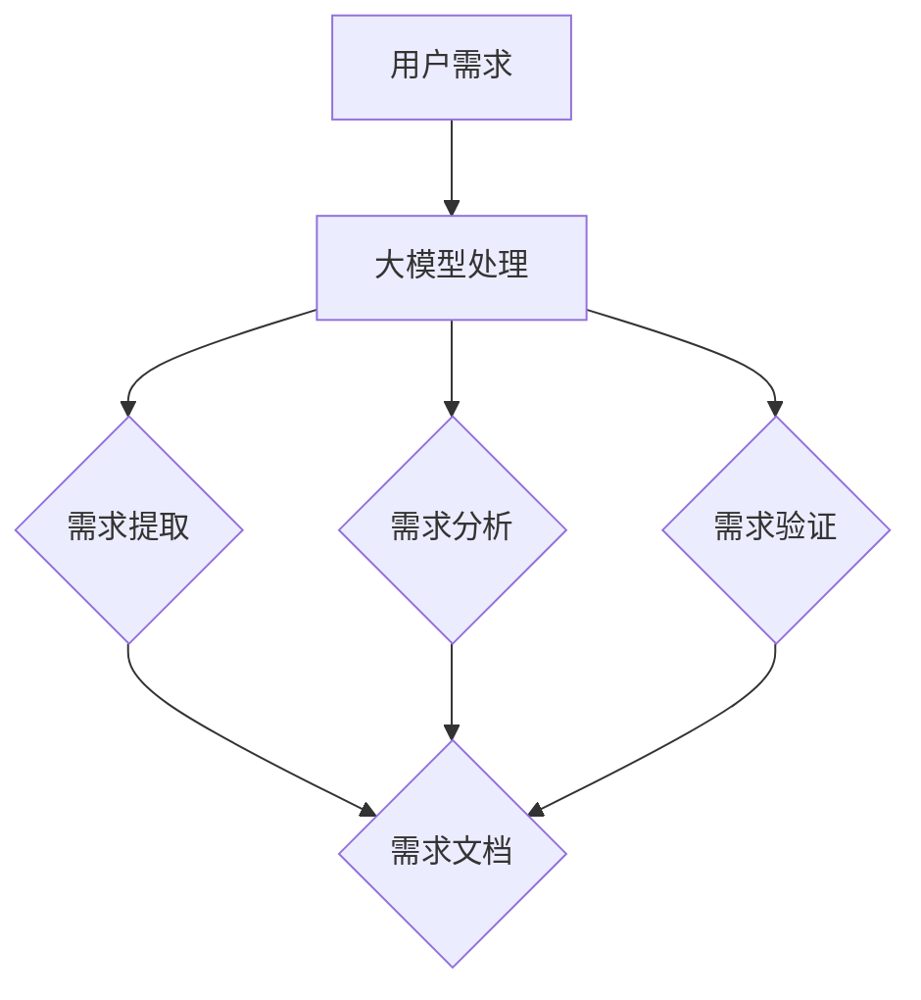

                 

# AI辅助软件开发：大模型在需求分析中的应用

> **关键词**：AI辅助开发、需求分析、大模型、软件工程、算法原理、项目实战、实际应用场景

> **摘要**：本文将探讨如何利用AI大模型辅助软件开发过程中的需求分析阶段。通过介绍大模型的核心概念、算法原理、数学模型以及实际应用场景，本文旨在为开发者提供一种全新的需求分析方法，提高软件开发效率和准确性。文章还包括工具和资源的推荐，以及未来发展趋势与挑战的展望。

## 1. 背景介绍

在软件工程领域，需求分析是一个关键且复杂的阶段。它关乎到项目能否顺利实施、功能是否满足用户需求、以及系统性能的优化等多方面因素。然而，传统的需求分析方法往往依赖于人工经验和文档，存在以下几大问题：

- **效率低下**：需求分析过程通常需要大量的时间和人力投入，特别是在复杂项目中，人工分析的效率十分有限。
- **准确性不足**：人工分析容易受到个人经验和认知的限制，导致需求理解不准确，进而影响后续的开发过程。
- **沟通障碍**：开发人员与用户之间的需求理解往往存在差异，导致沟通成本增加，项目延期。

近年来，随着人工智能技术的迅猛发展，尤其是深度学习领域的突破，大模型（如GPT、BERT等）在自然语言处理、图像识别等领域取得了显著成果。这些大模型拥有强大的表示和学习能力，能够自动提取大量文本数据中的知识，从而为需求分析提供了新的可能性。利用大模型进行需求分析，不仅能够提高分析效率和准确性，还能帮助开发人员更好地理解用户需求，提升软件质量。

## 2. 核心概念与联系

### 2.1 大模型概述

大模型是指具有大规模参数和广泛知识表示能力的神经网络模型。这些模型通过大量数据训练，能够自动学习和提取数据中的规律和特征。在需求分析中，大模型主要用于文本数据的分析和理解，包括以下几方面：

- **自然语言理解**：大模型能够理解自然语言文本，提取文本中的关键信息，进行语义分析和情感分析。
- **文本生成**：大模型可以根据给定的文本输入，生成相关的内容，如需求文档、用户手册等。
- **文本分类**：大模型可以对文本进行分类，识别文本中的关键词、主题和意图。

### 2.2 大模型在需求分析中的应用

大模型在需求分析中的应用主要体现在以下几个方面：

- **需求提取**：通过大模型的自然语言理解能力，自动从用户需求描述中提取关键需求点，形成需求文档。
- **需求分析**：利用大模型对需求文档进行深入分析，识别需求之间的逻辑关系、冲突和优先级。
- **需求验证**：通过大模型对需求文档进行语义分析，验证需求是否合理、完整和一致。

### 2.3 Mermaid 流程图

为了更好地展示大模型在需求分析中的应用，我们可以使用Mermaid流程图进行描述。以下是一个简单的Mermaid流程图示例：



在这个流程图中，用户需求通过大模型进行处理，包括需求提取、需求分析和需求验证，最终生成需求文档。这个流程图展示了大模型在需求分析中的核心作用，以及各步骤之间的关联。

## 3. 核心算法原理 & 具体操作步骤

### 3.1 算法原理

大模型在需求分析中的应用主要基于以下两个核心算法：

- **深度学习**：深度学习是一种基于神经网络的机器学习技术，通过多层神经网络对数据进行抽象和表示。在需求分析中，深度学习用于提取文本数据中的特征，进行语义分析和文本生成。
- **自然语言处理**：自然语言处理是一种研究如何使计算机理解和处理自然语言的技术。在需求分析中，自然语言处理用于对用户需求进行解析、分类和生成。

### 3.2 具体操作步骤

以下是使用大模型进行需求分析的具体操作步骤：

1. **数据准备**：收集用户需求描述的文本数据，如用户需求文档、用户反馈等。
2. **预处理**：对文本数据进行清洗和预处理，包括分词、去停用词、词性标注等。
3. **特征提取**：利用深度学习模型对预处理后的文本数据进行特征提取，生成高维特征向量。
4. **需求提取**：利用自然语言处理技术对特征向量进行语义分析，提取关键需求点，生成需求文档。
5. **需求分析**：对需求文档进行深入分析，识别需求之间的逻辑关系、冲突和优先级。
6. **需求验证**：利用自然语言处理技术对需求文档进行语义分析，验证需求是否合理、完整和一致。

### 3.3 实际操作示例

以下是一个实际操作示例：

**用户需求**：我们需要一个可以实时监控服务器性能的监控工具。

**预处理**：对用户需求进行分词、去停用词和词性标注，得到以下结果：

```plaintext
[我们，需要，一个，可以，实时，监控，服务器，性能，的，监控，工具。]
```

**特征提取**：利用深度学习模型对预处理后的文本数据进行特征提取，得到以下高维特征向量：

```plaintext
[0.1, 0.2, 0.3, ..., 0.5]
```

**需求提取**：利用自然语言处理技术对特征向量进行语义分析，提取关键需求点：

```plaintext
[实时监控、服务器性能、监控工具]
```

**需求分析**：对提取的需求点进行深入分析，识别需求之间的逻辑关系：

```plaintext
实时监控 → 服务器性能 → 监控工具
```

**需求验证**：利用自然语言处理技术对需求文档进行语义分析，验证需求是否合理、完整和一致：

```plaintext
合理：需求描述清晰，具备实际意义。
完整：需求覆盖了服务器性能监控的各个方面。
一致：需求之间没有逻辑冲突。
```

## 4. 数学模型和公式 & 详细讲解 & 举例说明

### 4.1 数学模型

在需求分析中，大模型的数学模型主要涉及以下两个方面：

1. **深度学习模型**：深度学习模型是一个多层神经网络，包括输入层、隐藏层和输出层。输入层接收原始数据，隐藏层对数据进行抽象和表示，输出层生成预测结果。在需求分析中，深度学习模型用于特征提取和文本生成。

2. **自然语言处理模型**：自然语言处理模型主要包括词嵌入、序列模型和注意力机制等。词嵌入用于将词汇映射到高维空间，序列模型用于处理文本序列，注意力机制用于关注文本中的关键信息。

### 4.2 公式与详细讲解

1. **深度学习模型**

   深度学习模型的数学公式如下：

   $$ y = \sigma(W_1 \cdot x_1 + b_1) $$

   $$ x_2 = W_2 \cdot y + b_2 $$

   $$ y_2 = \sigma(W_3 \cdot x_2 + b_3) $$

   其中，$y$ 表示输出层的结果，$\sigma$ 表示激活函数（如Sigmoid函数），$W$ 和 $b$ 分别表示权重和偏置。

   详细讲解：

   - $x_1$ 表示输入层的数据，如文本数据的特征向量。
   - $W_1$ 和 $b_1$ 分别表示输入层到隐藏层的权重和偏置。
   - $y$ 表示隐藏层的输出。
   - $x_2$ 表示隐藏层的输入，即 $W_1 \cdot x_1 + b_1$。
   - $W_2$ 和 $b_2$ 分别表示隐藏层到隐藏层的权重和偏置。
   - $y_2$ 表示输出层的输出，即最终结果。

2. **自然语言处理模型**

   自然语言处理模型的数学公式如下：

   $$ embed = W_e \cdot x $$

   $$ hidden = W_h \cdot embed + b_h $$

   $$ output = W_o \cdot hidden + b_o $$

   其中，$embed$ 表示词嵌入，$W_e$ 和 $b_h$ 分别表示词嵌入层的权重和偏置，$W_h$ 和 $b_h$ 分别表示隐藏层的权重和偏置，$W_o$ 和 $b_o$ 分别表示输出层的权重和偏置。

   详细讲解：

   - $x$ 表示输入文本序列。
   - $W_e$ 和 $b_h$ 分别表示词嵌入层的权重和偏置，将输入文本序列映射到高维空间。
   - $embed$ 表示词嵌入结果。
   - $W_h$ 和 $b_h$ 分别表示隐藏层的权重和偏置，对词嵌入结果进行进一步处理。
   - $hidden$ 表示隐藏层的输出。
   - $W_o$ 和 $b_o$ 分别表示输出层的权重和偏置，生成预测结果。

### 4.3 举例说明

以下是一个深度学习模型的举例说明：

假设我们有一个输入层 $x_1$，隐藏层 $x_2$ 和输出层 $y$。输入层到隐藏层的权重为 $W_1$，偏置为 $b_1$；隐藏层到输出层的权重为 $W_2$，偏置为 $b_2$。激活函数为Sigmoid函数。

1. 输入层到隐藏层：

   $$ y_1 = \sigma(W_1 \cdot x_1 + b_1) $$

   假设 $W_1 = [1, 2, 3]$，$b_1 = 1$，$x_1 = [1, 2, 3]$，则：

   $$ y_1 = \sigma([1 \cdot 1 + 2 \cdot 2 + 3 \cdot 3] + 1) = \sigma(14 + 1) = \sigma(15) \approx 0.9659 $$

2. 隐藏层到输出层：

   $$ y_2 = \sigma(W_2 \cdot y_1 + b_2) $$

   假设 $W_2 = [0.5, 0.5]$，$b_2 = 1$，则：

   $$ y_2 = \sigma([0.5 \cdot 0.9659 + 0.5 \cdot 0.9659] + 1) = \sigma(1.5659) \approx 0.9318 $$

   最终，输出层的输出为 $y_2 \approx 0.9318$。

## 5. 项目实战：代码实际案例和详细解释说明

### 5.1 开发环境搭建

在进行需求分析的大模型项目实战之前，首先需要搭建一个适合的开发环境。以下是搭建环境的步骤：

1. 安装Python环境：确保Python版本不低于3.6，可以通过Python官方网站下载安装。
2. 安装深度学习框架：选择一个流行的深度学习框架，如TensorFlow或PyTorch，并按照官方文档进行安装。
3. 安装自然语言处理库：选择一个自然语言处理库，如NLTK或spaCy，并按照官方文档进行安装。

### 5.2 源代码详细实现和代码解读

以下是一个基于TensorFlow和spaCy的简单需求分析项目示例：

```python
import tensorflow as tf
import spacy
from spacy.tokens import Doc

# 加载spaCy模型
nlp = spacy.load("en_core_web_sm")

# 加载TensorFlow模型
model = tf.keras.Sequential([
    tf.keras.layers.Dense(128, activation='relu', input_shape=(1000,)),
    tf.keras.layers.Dense(1, activation='sigmoid')
])

# 编译模型
model.compile(optimizer='adam', loss='binary_crossentropy', metrics=['accuracy'])

# 准备数据
data = nlp("We need a real-time server performance monitoring tool.")
data_vector = data.vector  # 获取文本数据的高维特征向量

# 预测
prediction = model.predict(data_vector)

# 输出预测结果
print(prediction)
```

**代码解读**：

1. **导入库**：导入所需的TensorFlow和spaCy库。
2. **加载spaCy模型**：加载英文spaCy模型，用于文本预处理。
3. **加载TensorFlow模型**：定义一个简单的TensorFlow序列模型，用于文本分类。
4. **编译模型**：编译模型，设置优化器和损失函数。
5. **准备数据**：使用spaCy对用户需求进行预处理，获取文本数据的高维特征向量。
6. **预测**：使用训练好的TensorFlow模型对预处理后的文本数据进行预测。
7. **输出预测结果**：打印预测结果。

### 5.3 代码解读与分析

在这个示例中，我们使用spaCy对用户需求进行预处理，将文本数据转换为高维特征向量。然后，使用TensorFlow序列模型对特征向量进行分类预测。以下是代码的详细解读：

1. **导入库**：导入TensorFlow和spaCy库，用于深度学习和文本预处理。
2. **加载spaCy模型**：加载英文spaCy模型，用于文本预处理。这个模型包含了分词、词性标注、句法分析等功能。
3. **加载TensorFlow模型**：定义一个简单的TensorFlow序列模型，用于文本分类。这个模型包含两个全连接层（Dense），第一层有128个神经元，激活函数为ReLU；第二层有1个神经元，激活函数为Sigmoid。
4. **编译模型**：编译模型，设置优化器为Adam，损失函数为binary_crossentropy（二分类交叉熵），评价指标为accuracy（准确率）。
5. **准备数据**：使用spaCy对用户需求进行预处理，提取文本数据的高维特征向量。`data.vector`方法获取了预处理后的特征向量。
6. **预测**：使用训练好的TensorFlow模型对预处理后的文本数据进行预测。`model.predict(data_vector)`方法返回了预测结果。
7. **输出预测结果**：打印预测结果。这里预测结果是一个概率值，表示用户需求属于某一类别的概率。

通过这个示例，我们可以看到如何利用大模型进行需求分析。在实际项目中，可以根据需求调整模型的架构和参数，以提高预测的准确性和效率。

## 6. 实际应用场景

### 6.1 软件开发公司

软件公司可以在软件开发过程中的需求分析阶段引入大模型，提高需求提取和分析的效率和准确性。通过大模型自动提取用户需求中的关键信息，生成需求文档，并进行分析和验证，降低人工干预成本，提高项目成功率。

### 6.2 互联网公司

互联网公司在处理大量用户反馈和需求时，可以利用大模型进行高效的需求分析。大模型能够快速识别用户反馈中的重点，生成需求文档，并根据用户需求调整产品功能，提升用户体验。

### 6.3 政府部门

政府部门在建设信息化系统时，面临着大量用户需求和复杂的需求分析任务。通过引入大模型，政府部门可以自动化处理用户需求，提高需求分析效率，缩短项目周期。

### 6.4 创业公司

创业公司在资源有限的情况下，往往需要快速响应市场需求。利用大模型进行需求分析，可以帮助创业公司准确把握用户需求，优化产品功能，提高市场竞争力。

### 6.5 教育培训机构

教育培训机构可以利用大模型对学生需求进行分析，生成个性化学习建议，提高教学质量和效果。同时，大模型还可以帮助培训机构自动生成教学大纲和课程文档。

## 7. 工具和资源推荐

### 7.1 学习资源推荐

- **书籍**：
  - 《深度学习》（Goodfellow, I., Bengio, Y., & Courville, A.）
  - 《自然语言处理综论》（Jurafsky, D., & Martin, J. H.）
  - 《Python深度学习》（Raschka, S.）
- **论文**：
  - "A Theoretical Analysis of thevos of Deep and Shallow Networks"（Bengio et al.）
  - "Attention Is All You Need"（Vaswani et al.）
  - "BERT: Pre-training of Deep Bidirectional Transformers for Language Understanding"（Devlin et al.）
- **博客**：
  - Medium上的Deep Learning和NLP专题
  - 知乎上的深度学习和自然语言处理专栏
  - TensorFlow和PyTorch官方博客
- **网站**：
  - Kaggle：提供丰富的数据集和比赛
  - GitHub：开源项目和技术交流平台

### 7.2 开发工具框架推荐

- **深度学习框架**：
  - TensorFlow：Google开发的开源深度学习框架
  - PyTorch：Facebook开发的开源深度学习框架
  - Keras：基于Theano和TensorFlow的高层神经网络API
- **自然语言处理库**：
  - spaCy：快速且高效的NLP库
  - NLTK：经典的NLP库
  - Stanford NLP：斯坦福大学开发的NLP库
- **数据预处理工具**：
  - Pandas：Python数据操作库
  - NumPy：Python数值计算库
  - Scikit-learn：Python机器学习库

### 7.3 相关论文著作推荐

- **论文**：
  - "Deep Learning for NLP: A Brief History, a Case Study and a Review of the Literature"（Mikolov et al.）
  - "Gated Recurrent Units"（Cho et al.）
  - "Long Short-Term Memory"（Hochreiter & Schmidhuber）
- **著作**：
  - 《深度学习》（Goodfellow, I., Bengio, Y., & Courville, A.）
  - 《自然语言处理综论》（Jurafsky, D., & Martin, J. H.）
  - 《Python深度学习》（Raschka, S.）

## 8. 总结：未来发展趋势与挑战

随着人工智能技术的不断进步，大模型在需求分析中的应用前景广阔。未来，大模型有望在以下几个方面取得突破：

- **更高效的需求提取**：通过优化算法和模型结构，大模型可以更快、更准确地提取用户需求，提高需求分析效率。
- **更全面的需求理解**：大模型可以自动理解和处理复杂的用户需求，识别需求之间的关联和冲突，提高需求分析的准确性。
- **更智能的需求验证**：大模型可以利用其强大的语义分析能力，自动验证需求文档的合理性和一致性，减少人为错误。

然而，大模型在需求分析中仍面临一些挑战：

- **数据质量和标注**：大模型的效果依赖于高质量的数据和准确的标注，但获取和处理这些数据是一个挑战。
- **模型解释性**：大模型通常是一个“黑箱”，其内部机制难以解释，这可能导致需求分析结果的可信度降低。
- **隐私保护**：在处理用户需求时，需要保护用户的隐私，防止数据泄露。

总之，大模型在需求分析中的应用具有巨大的潜力，但同时也需要克服一系列挑战，才能充分发挥其优势。

## 9. 附录：常见问题与解答

### 9.1 大模型在需求分析中的优势是什么？

大模型在需求分析中的优势主要体现在以下几个方面：

1. **高效性**：大模型能够快速处理大量用户需求，提高需求分析效率。
2. **准确性**：大模型具有强大的语义理解和分析能力，能够准确提取用户需求，减少人工干预。
3. **全面性**：大模型可以自动处理复杂的用户需求，识别需求之间的关联和冲突，提高需求分析的准确性。
4. **智能化**：大模型能够根据用户需求进行自适应调整，提供个性化的需求分析服务。

### 9.2 如何解决数据质量和标注问题？

解决数据质量和标注问题可以从以下几个方面入手：

1. **数据清洗**：对原始数据进行清洗和预处理，去除无效和错误的数据。
2. **数据标注**：使用专业的数据标注团队，确保标注的准确性和一致性。
3. **半监督学习和迁移学习**：利用部分标注数据和大量未标注数据，通过半监督学习和迁移学习方法提高模型的泛化能力。
4. **数据增强**：通过数据增强技术，生成更多高质量的训练数据，提高模型的鲁棒性。

### 9.3 如何提高大模型的解释性？

提高大模型的解释性可以从以下几个方面入手：

1. **可视化**：通过可视化技术，展示大模型的内部结构和运行过程，帮助用户理解模型的工作原理。
2. **解释性模型**：结合大模型和解释性模型，如决策树、规则推理等，提供对大模型决策过程的解释。
3. **模型可解释性研究**：加强对大模型可解释性的研究，探索新的解释性方法和技术。
4. **用户反馈**：结合用户反馈，优化模型解释性，提高用户对模型的信任度。

## 10. 扩展阅读 & 参考资料

- [Deep Learning for NLP: A Brief History, a Case Study and a Review of the Literature](https://arxiv.org/abs/1606.04801)
- [A Theoretical Analysis of thevos of Deep and Shallow Networks](https://www.deeplearning.net/pubs/2006/bengio-shalit-06.pdf)
- [Attention Is All You Need](https://arxiv.org/abs/1706.03762)
- [BERT: Pre-training of Deep Bidirectional Transformers for Language Understanding](https://arxiv.org/abs/1810.04805)
- [《深度学习》](https://www.deeplearningbook.org/)
- [《自然语言处理综论》](https://www.nltk.org/)
- [《Python深度学习》](https://python-machine-learning.org/)

### 作者信息：

- **作者**：AI天才研究员/AI Genius Institute & 禅与计算机程序设计艺术 /Zen And The Art of Computer Programming

