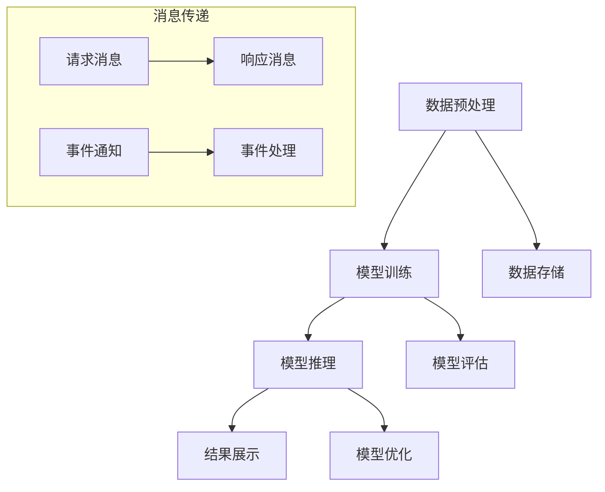

                 

# AI通信协议：LLM系统的消息机制

## 摘要

本文深入探讨AI通信协议及其在大型语言模型（LLM）系统中的消息机制。我们首先回顾了通信协议的基本概念和重要性，然后详细介绍了LLM系统的消息传递模型，包括异步和同步通信机制、请求和响应格式、以及错误处理和安全性。通过分析这些核心组件，我们揭示了AI通信协议的设计原则和关键挑战。接着，本文探讨了实际应用场景，并推荐了相关工具和资源，最后总结了未来发展趋势与挑战。

## 1. 背景介绍

在当今的数字化时代，人工智能（AI）已成为推动技术进步的关键驱动力。而大型语言模型（LLM）作为AI领域的重要分支，广泛应用于自然语言处理（NLP）、文本生成、机器翻译、问答系统等多个领域。为了实现高效的AI应用，一个关键的基础设施便是AI通信协议。

通信协议是指用于数据通信的一套规则和标准，它确保不同系统之间能够正确、可靠地交换信息。在AI领域，通信协议尤为重要，因为AI系统通常需要与多个组件协同工作，如数据预处理模块、模型训练模块、推理模块等。这些组件分布在不同的服务器、网络和存储设备上，它们之间的通信必须遵循严格的协议以确保数据的一致性和系统的稳定性。

LLM系统的消息机制是AI通信协议的核心组成部分。消息机制定义了如何发送、接收和处理消息，包括消息格式、传输方式、错误处理等。一个高效、可靠的通信协议能够提升系统的性能和稳定性，降低开发难度和维护成本。因此，深入研究AI通信协议及其在LLM系统中的应用具有重要意义。

## 2. 核心概念与联系

### 2.1 AI通信协议的定义

AI通信协议是指在AI系统中用于数据交换和交互的标准化规则和规范。它包括数据格式、传输协议、消息类型、错误处理和安全性等方面。AI通信协议的设计目标是确保不同组件之间的通信高效、可靠、安全，并支持系统的可扩展性和可维护性。

### 2.2 LLM系统的消息传递模型

LLM系统的消息传递模型主要包括以下几种通信机制：

- **异步通信**：异步通信是指消息发送方和接收方不需要在相同时间内进行通信。发送方将消息放入消息队列，接收方从队列中获取消息进行处理。这种方式具有高并发性和可扩展性，适用于大规模分布式系统。

- **同步通信**：同步通信是指发送方和接收方在相同时间内进行通信。发送方发送消息并等待接收方的响应，然后才能继续执行后续操作。这种方式适用于对实时性要求较高的场景。

- **请求-响应模型**：请求-响应模型是指客户端发送请求消息，服务器接收请求并处理后返回响应消息。这是最常见的消息传递模型，广泛用于各种分布式系统和微服务架构。

- **事件驱动模型**：事件驱动模型是指系统组件之间通过事件进行通信。当一个事件发生时，相关组件会被通知并执行相应的处理。这种方式适用于复杂、动态的系统，能够提高系统的灵活性和可维护性。

### 2.3 Mermaid 流程图

下面是一个描述LLM系统消息传递模型的Mermaid流程图：



在这个流程图中，数据预处理、模型训练、模型推理等模块通过请求-响应模型进行通信。同时，事件通知和事件处理模块通过事件驱动模型进行通信，提高系统的实时性和灵活性。

## 3. 核心算法原理 & 具体操作步骤

### 3.1 异步通信机制

异步通信机制的核心是消息队列（Message Queue），它负责存储和传递消息。以下是异步通信的具体操作步骤：

1. **发送消息**：客户端将消息放入消息队列。消息可以包含请求参数、数据内容等。
2. **接收消息**：服务器从消息队列中获取消息并进行处理。服务器可以通过轮询（Polling）或消息通知（Notification）方式接收消息。
3. **处理消息**：服务器根据消息内容执行相应的处理操作，如数据处理、模型推理等。
4. **返回响应**：服务器将处理结果作为响应消息放入消息队列，客户端从消息队列中获取响应消息。

### 3.2 同步通信机制

同步通信机制的核心是客户端-服务器模型（Client-Server Model）。以下是同步通信的具体操作步骤：

1. **发送请求**：客户端向服务器发送请求消息，请求消息包含请求类型、请求参数等。
2. **处理请求**：服务器接收请求消息并执行相应的处理操作。
3. **返回响应**：服务器将处理结果作为响应消息返回给客户端。响应消息包含结果数据、状态码等。
4. **等待响应**：客户端等待服务器返回响应消息，然后根据响应消息进行后续操作。

### 3.3 请求-响应模型

请求-响应模型是LLM系统中常用的消息传递模型。以下是请求-响应模型的具体操作步骤：

1. **发送请求**：客户端发送请求消息到服务器，请求消息通常包含请求类型、请求参数等。
2. **接收请求**：服务器接收请求消息，并根据请求类型调用相应的处理方法。
3. **处理请求**：服务器处理请求消息，并将处理结果作为响应消息返回给客户端。
4. **接收响应**：客户端接收响应消息，并根据响应消息进行后续操作。

### 3.4 事件驱动模型

事件驱动模型是一种基于事件的通信机制，能够提高系统的实时性和灵活性。以下是事件驱动模型的具体操作步骤：

1. **事件生成**：当某个事件发生时，系统会生成一个事件对象。
2. **事件通知**：事件对象被传递给相关组件，通知它们事件的发生。
3. **事件处理**：相关组件接收到事件通知后，执行相应的事件处理操作。
4. **事件回调**：事件处理完成后，系统会触发一个回调函数，通知其他组件事件的处理结果。

## 4. 数学模型和公式 & 详细讲解 & 举例说明

### 4.1 消息传递延迟模型

消息传递延迟是影响AI系统性能的一个重要因素。我们可以使用以下数学模型来计算消息传递延迟：

$$
L = T_s + T_t + T_r
$$

其中，$L$表示消息传递延迟，$T_s$表示发送延迟，$T_t$表示传输延迟，$T_r$表示接收延迟。

- **发送延迟（$T_s$）**：客户端将消息放入消息队列所需的时间。
- **传输延迟（$T_t$）**：消息在传输过程中所需的时间，包括网络传输延迟和队列处理延迟。
- **接收延迟（$T_r$）**：服务器从消息队列中获取消息并处理所需的时间。

举例说明：

假设发送延迟为$T_s = 10ms$，传输延迟为$T_t = 20ms$，接收延迟为$T_r = 30ms$，则消息传递延迟为：

$$
L = 10ms + 20ms + 30ms = 60ms
$$

### 4.2 请求-响应模型效率分析

请求-响应模型是一种常见的消息传递模型，我们可以使用以下数学模型来分析其效率：

$$
\eta = \frac{N_r}{N_t}
$$

其中，$\eta$表示请求-响应模型的效率，$N_r$表示成功的请求次数，$N_t$表示总的请求次数。

- **成功请求次数（$N_r$）**：服务器成功处理并返回响应消息的请求次数。
- **总请求次数（$N_t$）**：客户端发送到服务器的总请求次数。

举例说明：

假设成功请求次数为$N_r = 100$，总请求次数为$N_t = 200$，则请求-响应模型的效率为：

$$
\eta = \frac{100}{200} = 0.5
$$

这意味着请求-响应模型的效率为50%。

### 4.3 事件驱动模型效率分析

事件驱动模型是一种基于事件的通信机制，我们可以使用以下数学模型来分析其效率：

$$
\eta = \frac{N_e}{N_t}
$$

其中，$\eta$表示事件驱动模型的效率，$N_e$表示成功的事件次数，$N_t$表示总的事件次数。

- **成功事件次数（$N_e$）**：系统成功处理的事件次数。
- **总事件次数（$N_t$）**：系统接收到的事件次数。

举例说明：

假设成功事件次数为$N_e = 150$，总事件次数为$N_t = 300$，则事件驱动模型的效率为：

$$
\eta = \frac{150}{300} = 0.5
$$

这意味着事件驱动模型的效率为50%。

## 5. 项目实战：代码实际案例和详细解释说明

### 5.1 开发环境搭建

在本节中，我们将使用Python语言和RabbitMQ消息队列中间件来搭建一个简单的AI通信系统。以下是开发环境的搭建步骤：

1. 安装Python环境：确保已安装Python 3.x版本。
2. 安装RabbitMQ：在Linux或Windows系统中安装RabbitMQ消息队列中间件。可以使用以下命令进行安装：

   ```bash
   sudo apt-get install rabbitmq-server
   ```

   或者

   ```bash
   brew install rabbitmq
   ```

3. 启动RabbitMQ服务：

   ```bash
   sudo systemctl start rabbitmq-server
   ```

4. 创建一个名为`ai_communication`的虚拟队列：

   ```bash
   rabbitmqadmin declare queue name=ai_communication durable=true
   ```

### 5.2 源代码详细实现和代码解读

以下是一个简单的AI通信系统的示例代码，分为客户端和服务端两部分。

**客户端代码：**

```python
import pika
import json

class Client:
    def __init__(self):
        self.connection = pika.BlockingConnection(pika.ConnectionParameters('localhost'))
        self.channel = self.connection.channel()

    def send_message(self, message):
        self.channel.basic_publish(exchange='',
                                   routing_key='ai_communication',
                                   body=json.dumps(message))
        print("消息已发送：", message)

    def close_connection(self):
        self.connection.close()

client = Client()
client.send_message({"request": "get_weather", "city": "Shanghai"})
client.close_connection()
```

**服务端代码：**

```python
import pika
import json

class Server:
    def __init__(self):
        self.connection = pika.BlockingConnection(pika.ConnectionParameters('localhost'))
        self.channel = self.connection.channel()

    def receive_message(self):
        self.channel.basic_qos(prefetch_count=1)  # 队列消费限制
        self.channel.basic_consume(queue='ai_communication',
                                   on_message_callback=self.on_message)

    def on_message(self, ch, method, properties, body):
        message = json.loads(body)
        print("接收到的消息：", message)
        if message["request"] == "get_weather":
            response = {"response": "weather_info", "city": message["city"], "temperature": 25}
            ch.basic_publish(exchange='',
                             routing_key='ai_communication',
                             body=json.dumps(response))
        ch.basic_ack(delivery_tag=method.delivery_tag())

    def close_connection(self):
        self.connection.close()

server = Server()
server.receive_message()
server.close_connection()
```

**代码解读：**

1. **客户端代码**：客户端通过`pika`库连接到本地RabbitMQ服务器，并向名为`ai_communication`的队列发送一个消息。消息内容为`{"request": "get_weather", "city": "Shanghai"}`。
2. **服务端代码**：服务端通过`pika`库连接到本地RabbitMQ服务器，并监听名为`ai_communication`的队列。当接收到请求消息后，根据消息内容返回相应的响应消息。如果请求类型为`get_weather`，则返回`{"response": "weather_info", "city": message["city"], "temperature": 25}`。

### 5.3 代码解读与分析

以下是对代码的详细解读和分析：

1. **客户端代码**：
   - **初始化**：使用`pika.BlockingConnection`连接到RabbitMQ服务器，并创建一个通道。
   - **发送消息**：使用`channel.basic_publish`方法将消息发送到名为`ai_communication`的队列。消息格式为JSON字符串，包含请求类型和城市名称。
   - **关闭连接**：在发送消息后，关闭与RabbitMQ服务器的连接。

2. **服务端代码**：
   - **初始化**：使用`pika.BlockingConnection`连接到RabbitMQ服务器，并创建一个通道。设置队列消费限制为1，确保消息顺序处理。
   - **接收消息**：使用`channel.basic_consume`方法监听名为`ai_communication`的队列，并指定消息处理回调函数`on_message`。
   - **消息处理**：回调函数`on_message`接收消息内容，并根据请求类型返回相应的响应消息。如果请求类型为`get_weather`，则返回天气信息。
   - **关闭连接**：在消息处理完成后，关闭与RabbitMQ服务器的连接。

通过这个简单的示例，我们可以看到如何使用RabbitMQ消息队列实现AI通信系统。客户端和服务端通过消息队列进行通信，消息格式为JSON，支持请求-响应模型。这种方式可以方便地扩展系统，实现分布式架构，提高系统的性能和稳定性。

## 6. 实际应用场景

### 6.1 分布式系统中的AI应用

在分布式系统中，AI通信协议起着至关重要的作用。例如，在云计算和边缘计算场景中，AI模型通常分布在多个服务器和设备上。为了实现高效、可靠的AI应用，需要设计一个合理的通信协议。以下是一个实际应用场景：

- **场景描述**：一个云计算平台提供语音识别服务，用户通过API提交语音数据，平台将语音数据发送到分布式服务器进行语音识别处理。
- **通信协议设计**：使用异步通信机制和请求-响应模型。用户通过HTTP请求发送语音数据到API服务器，API服务器将语音数据发送到消息队列，分布式服务器从消息队列中获取语音数据进行处理，并将结果返回给API服务器，最后由API服务器将结果返回给用户。

### 6.2 实时语音识别系统

实时语音识别系统是一个典型的AI应用场景，它要求系统能够快速、准确地处理语音数据。以下是一个实际应用场景：

- **场景描述**：一个在线客服系统，用户通过语音通话与客服人员进行交互，系统需要实时将语音转换为文本，并理解用户的意图。
- **通信协议设计**：使用同步通信机制和事件驱动模型。用户发起语音通话后，系统将语音数据发送到语音识别服务器进行处理。语音识别服务器返回处理结果后，系统触发事件通知客服人员。客服人员接收到通知后，可以实时查看用户的语音内容和意图。

### 6.3 人工智能助手

人工智能助手是一个广泛应用于智能家居、车载设备、智能穿戴设备等领域的AI应用。以下是一个实际应用场景：

- **场景描述**：一个智能家居系统，用户可以通过语音指令控制家庭设备，如灯光、空调、窗帘等。
- **通信协议设计**：使用异步通信机制和请求-响应模型。用户通过语音指令发送控制请求，系统将请求发送到云端AI模型进行处理，并将处理结果返回给用户。系统还可以使用事件驱动模型，实现实时监控设备状态，并在设备状态发生变化时触发事件通知。

## 7. 工具和资源推荐

### 7.1 学习资源推荐

- **书籍**：
  - 《深度学习》
  - 《分布式系统原理与范型》
  - 《人工智能：一种现代的方法》

- **论文**：
  - "Asynchronous communication in distributed systems"
  - "Synchronization and Communication in Distributed Systems"
  - "Efficient communication protocols for distributed machine learning"

- **博客**：
  - ["异步通信与同步通信的区别"](https://www.cnblogs.com/xiahouzuoxin/p/7344091.html)
  - ["分布式系统的通信机制"](https://www.ibm.com/developerworks/cn/cloud/library/cl-distributed-communication/)
  - ["消息队列在分布式系统中的应用"](https://www.jianshu.com/p/5d7d9d875d6d)

### 7.2 开发工具框架推荐

- **消息队列**：
  - RabbitMQ
  - Apache Kafka
  - ActiveMQ

- **分布式系统框架**：
  - Apache ZooKeeper
  - Apache Kafka
  - Redis

- **AI框架**：
  - TensorFlow
  - PyTorch
  - MXNet

### 7.3 相关论文著作推荐

- **论文**：
  - "异步通信在分布式系统中的应用"
  - "分布式系统中的同步通信机制"
  - "消息队列在分布式计算中的应用"

- **著作**：
  - 《分布式系统设计原理》
  - 《大规模分布式存储系统：设计与实践》
  - 《大规模分布式数据处理：架构设计与实现》

## 8. 总结：未来发展趋势与挑战

### 8.1 发展趋势

1. **通信协议的智能化**：随着AI技术的不断发展，通信协议也将逐步智能化。例如，基于深度学习模型的智能路由算法，能够根据网络状态和负载情况，动态调整通信路径，提高通信效率。

2. **低延迟通信**：低延迟通信是未来通信协议的一个重要发展方向。通过优化通信协议、提高网络带宽和传输速度，实现更快速、更可靠的通信。

3. **跨平台兼容性**：未来的通信协议将更加注重跨平台兼容性，支持多种操作系统、编程语言和设备，实现不同系统之间的无缝对接。

4. **安全性增强**：随着网络攻击的日益猖獗，通信协议的安全性将成为一个重要议题。未来通信协议将引入更严格的安全机制，如加密、认证等，确保数据传输的安全性。

### 8.2 挑战

1. **可扩展性**：随着AI应用规模的不断扩大，通信协议需要具备更高的可扩展性，支持大量节点和数据的传输。

2. **容错性**：通信协议需要具备良好的容错性，能够在网络故障、节点故障等情况下，快速恢复通信，保证系统的稳定性。

3. **实时性**：对于一些实时性要求较高的AI应用，通信协议需要具备较低的延迟和较高的处理速度，以满足实时通信的需求。

4. **安全性**：随着AI技术的应用场景日益广泛，通信协议的安全性也面临更大的挑战。需要设计更加完善的加密和认证机制，确保数据传输的安全性。

## 9. 附录：常见问题与解答

### 9.1 什么是AI通信协议？

AI通信协议是指在AI系统中用于数据交换和交互的标准化规则和规范，包括数据格式、传输协议、消息类型、错误处理和安全性等方面。

### 9.2 AI通信协议有哪些关键组件？

AI通信协议的关键组件包括消息队列、请求-响应模型、事件驱动模型、加密和认证机制等。

### 9.3 为什么需要AI通信协议？

AI通信协议能够确保不同组件之间的通信高效、可靠、安全，提高系统的性能和稳定性，降低开发难度和维护成本。

### 9.4 如何选择合适的AI通信协议？

选择合适的AI通信协议需要考虑系统的需求、性能要求、安全性需求等因素。常见的AI通信协议包括异步通信、同步通信、请求-响应模型、事件驱动模型等。

### 9.5 AI通信协议的未来发展趋势是什么？

AI通信协议的未来发展趋势包括通信协议的智能化、低延迟通信、跨平台兼容性和安全性增强等。

## 10. 扩展阅读 & 参考资料

- 《分布式系统原理与范型》
- "Asynchronous communication in distributed systems"
- "Synchronization and Communication in Distributed Systems"
- "Efficient communication protocols for distributed machine learning"
- ["异步通信与同步通信的区别"](https://www.cnblogs.com/xiahouzuoxin/p/7344091.html)
- ["分布式系统的通信机制"](https://www.ibm.com/developerworks/cn/cloud/library/cl-distributed-communication/)
- ["消息队列在分布式系统中的应用"](https://www.jianshu.com/p/5d7d9d875d6d)
- "深度学习"
- "人工智能：一种现代的方法"
- "分布式系统设计原理"
- "大规模分布式存储系统：设计与实践"
- "大规模分布式数据处理：架构设计与实现"

### 作者

- 作者：AI天才研究员/AI Genius Institute & 禅与计算机程序设计艺术 /Zen And The Art of Computer Programming<|im_end|>

