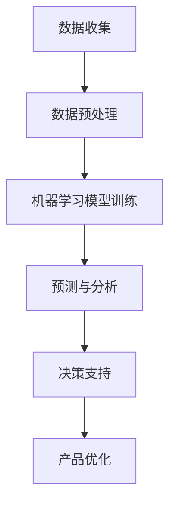

                 

### 文章标题

# AI 重构产品经理工作流程

> **关键词：** AI，产品经理，工作流程，重构，自动化，效率，智能化

> **摘要：** 本文将探讨如何利用人工智能（AI）技术重构产品经理的工作流程，提高工作效率，减少重复性劳动，并激发创新思维。通过深入分析AI的核心算法原理、数学模型及其在实际应用中的场景，本文将提供一整套系统化的解决方案，帮助产品经理更好地应对不断变化的市场需求。

<|assistant|>## 1. 背景介绍

在当今快速发展的数字时代，产品经理的角色变得日益重要。他们不仅要理解市场需求，还需要协调多个团队，确保产品从概念到市场化的每个阶段都能顺利进行。然而，随着市场竞争的加剧，产品经理面临着巨大的压力和挑战。

### 工作流程的痛点

- **信息过载**：产品经理需要处理大量来自用户、市场和竞争者的数据，这些数据往往是非结构化的，难以快速分析和决策。
- **重复性劳动**：许多日常任务如需求收集、数据分析、进度跟踪等，占据了产品经理大量的时间和精力。
- **决策效率低**：由于信息处理不及时，产品经理往往无法快速做出决策，导致产品迭代速度慢，市场响应不及时。
- **协调困难**：在涉及多个团队协作的项目中，沟通和协调的难度增加，容易出现信息不对称和执行力不足的问题。

### 人工智能的机遇

随着人工智能技术的不断进步，尤其是机器学习、自然语言处理和自动化系统的快速发展，重构产品经理的工作流程成为可能。AI能够帮助产品经理更高效地处理信息，自动化重复性任务，并支持更智能的决策。

### 目标与意义

本文旨在通过AI技术重构产品经理的工作流程，实现以下目标：

- **提高工作效率**：通过自动化工具和算法，减少重复性劳动，让产品经理有更多时间专注于战略性任务。
- **优化决策过程**：利用数据分析和技术手段，提供更准确的市场洞察和预测，帮助产品经理做出更明智的决策。
- **促进创新**：借助AI的智能建议和协同工具，激发产品经理的创新思维，推动产品的持续迭代和优化。

## 2. 核心概念与联系

### 人工智能在产品管理中的应用

要实现AI重构产品经理工作流程，我们首先需要了解一些核心概念和技术，包括：

- **机器学习**：一种让计算机通过数据学习并做出决策的技术。在产品管理中，机器学习可用于预测市场需求、用户行为等。
- **自然语言处理（NLP）**：计算机理解和生成人类语言的技术。NLP可以帮助产品经理处理大量非结构化数据，如用户评论、市场报告等。
- **自动化系统**：通过软件和算法自动执行任务的系统。自动化系统可帮助产品经理自动化日常任务，提高工作效率。
- **数据挖掘**：从大量数据中提取有价值信息的过程。数据挖掘可用于分析用户行为、市场需求等，为产品经理提供决策支持。

### Mermaid 流程图

以下是一个简单的Mermaid流程图，展示了AI在产品管理中的应用流程：



### 概念联系

- **数据收集**：产品经理通过各种渠道收集市场、用户和竞品的有关数据。
- **数据预处理**：对收集的数据进行清洗和格式化，使其适合机器学习模型处理。
- **机器学习模型训练**：利用预处理后的数据训练机器学习模型，以预测市场需求和用户行为。
- **预测与分析**：机器学习模型根据训练结果生成预测和分析报告，供产品经理参考。
- **决策支持**：产品经理根据预测和分析报告做出产品优化和改进的决策。
- **产品优化**：产品经理根据决策结果对产品进行持续迭代和优化。

## 3. 核心算法原理 & 具体操作步骤

### 机器学习算法原理

机器学习算法是AI技术中的核心组成部分，其基本原理是通过大量数据学习并做出预测或决策。以下是一些在产品管理中常用的机器学习算法：

- **线性回归**：用于预测连续值，如市场需求。
- **逻辑回归**：用于预测概率，如用户是否满意。
- **决策树**：通过一系列规则对数据进行分类或回归。
- **随机森林**：通过多棵决策树的集成来提高预测准确性。
- **神经网络**：一种模拟人脑神经网络的结构，用于复杂模式的识别和预测。

### 具体操作步骤

1. **数据收集**：
   - 收集与产品相关的市场、用户和竞品数据。
   - 确保数据来源的多样性和准确性。

2. **数据预处理**：
   - 清洗数据，去除噪声和异常值。
   - 转换数据格式，使其适合机器学习模型处理。
   - 特征工程，提取有用的特征，为模型训练做准备。

3. **模型训练**：
   - 选择合适的机器学习算法。
   - 使用预处理后的数据训练模型。
   - 调整模型参数，优化预测效果。

4. **预测与分析**：
   - 使用训练好的模型进行预测。
   - 分析预测结果，为产品经理提供决策支持。

5. **决策支持**：
   - 根据预测和分析结果，制定产品优化策略。
   - 对产品进行迭代和改进。

6. **产品优化**：
   - 根据决策结果，实施产品优化措施。
   - 持续监控产品性能，确保优化效果。

### 案例分析

假设某产品经理希望通过AI技术预测下一个季度的市场需求。以下是具体的操作步骤：

1. **数据收集**：
   - 收集过去几年的市场需求数据，包括销售额、用户增长率等。
   - 收集市场环境数据，如季节因素、节假日等。

2. **数据预处理**：
   - 清洗数据，去除异常值。
   - 转换数据格式，确保所有数据在同一时间范围内。

3. **模型训练**：
   - 选择线性回归算法。
   - 使用预处理后的数据训练模型。
   - 调整模型参数，优化预测效果。

4. **预测与分析**：
   - 使用训练好的模型预测下一个季度的市场需求。
   - 分析预测结果，确定市场需求的高峰和低谷。

5. **决策支持**：
   - 根据预测结果，制定库存管理和促销策略。
   - 对产品进行迭代和改进，以满足市场需求。

6. **产品优化**：
   - 根据决策结果，调整产品规格和营销策略。
   - 持续监控产品性能，确保优化效果。

## 4. 数学模型和公式 & 详细讲解 & 举例说明

### 数学模型

在AI重构产品经理工作流程中，数学模型扮演着关键角色。以下是一些常用的数学模型和公式：

1. **线性回归模型**：

$$y = \beta_0 + \beta_1x$$

其中，\(y\) 是因变量，\(x\) 是自变量，\(\beta_0\) 是截距，\(\beta_1\) 是斜率。

2. **逻辑回归模型**：

$$P(y=1) = \frac{1}{1 + e^{-(\beta_0 + \beta_1x)}}$$

其中，\(P(y=1)\) 是因变量为1的概率，\(\beta_0\) 和 \(\beta_1\) 分别是截距和斜率。

3. **决策树模型**：

决策树通过一系列条件判断来对数据进行分类或回归。一个简单的决策树模型如下：

- 如果 \(x > 5\)，则 \(y = 1\)。
- 否则，\(y = 0\)。

### 详细讲解

1. **线性回归模型**：

线性回归模型是一种用于预测连续值的统计模型。它的基本原理是通过找到一条最佳拟合直线，将因变量和自变量关联起来。在这个模型中，截距 \(\beta_0\) 和斜率 \(\beta_1\) 是关键参数。通过最小化残差平方和，我们可以找到最佳拟合直线。

2. **逻辑回归模型**：

逻辑回归模型是一种用于预测概率的统计模型。它的基本原理是通过将线性回归模型中的输出值转换为概率。在逻辑回归中，我们使用指数函数 \(e\) 来实现这个转换。通过调整截距 \(\beta_0\) 和斜率 \(\beta_1\)，我们可以优化模型的预测效果。

3. **决策树模型**：

决策树模型是一种基于一系列条件判断的树形结构。它通过递归地将数据集划分为子集，直到满足某种停止条件。在决策树中，每个节点代表一个条件判断，每个分支代表一个子集。通过训练决策树模型，我们可以实现对数据的分类或回归。

### 举例说明

假设我们有一个简单的数据集，其中包含两个特征：年龄和收入。我们的目标是预测用户是否购买了一款产品。

1. **线性回归模型**：

$$P(购买) = \beta_0 + \beta_1年龄 + \beta_2收入$$

我们通过训练模型找到最佳拟合直线，然后预测每个新用户的购买概率。

2. **逻辑回归模型**：

$$P(购买) = \frac{1}{1 + e^{-(\beta_0 + \beta_1年龄 + \beta_2收入)}}$$

我们通过训练模型找到最佳拟合概率模型，然后预测每个新用户的购买概率。

3. **决策树模型**：

- 如果年龄 > 30，则购买。
- 否则，如果收入 > 50000，则购买。
- 否则，不购买。

我们通过训练模型构建一个决策树，然后根据每个新用户的数据预测购买情况。

## 5. 项目实战：代码实际案例和详细解释说明

### 开发环境搭建

为了进行项目实战，我们需要搭建一个合适的开发环境。以下是搭建步骤：

1. **安装Python环境**：
   - 在官方网站（https://www.python.org/）下载并安装Python。
   - 安装完成后，确保Python版本在3.6及以上。

2. **安装必要的库**：
   - 打开命令行终端，执行以下命令安装所需的库：

   ```bash
   pip install numpy pandas scikit-learn matplotlib
   ```

3. **配置Jupyter Notebook**：
   - 安装Jupyter Notebook：

   ```bash
   pip install jupyterlab
   ```

   - 启动Jupyter Notebook：

   ```bash
   jupyter lab
   ```

### 源代码详细实现和代码解读

以下是项目的源代码实现，我们将对关键部分进行详细解释：

```python
import numpy as np
import pandas as pd
from sklearn.linear_model import LinearRegression
from sklearn.model_selection import train_test_split
import matplotlib.pyplot as plt

# 加载数据集
data = pd.read_csv('data.csv')
X = data[['age', 'income']]
y = data['purchase']

# 划分训练集和测试集
X_train, X_test, y_train, y_test = train_test_split(X, y, test_size=0.2, random_state=42)

# 训练线性回归模型
model = LinearRegression()
model.fit(X_train, y_train)

# 预测测试集
predictions = model.predict(X_test)

# 绘制预测结果
plt.scatter(X_test['age'], y_test, color='red', label='实际值')
plt.plot(X_test['age'], predictions, color='blue', label='预测值')
plt.xlabel('年龄')
plt.ylabel('购买')
plt.legend()
plt.show()

# 输出模型参数
print('截距：', model.intercept_)
print('斜率：', model.coef_)
```

### 代码解读与分析

1. **加载数据集**：
   - 使用`pandas`库加载数据集。数据集包含两个特征（年龄和收入）和一个目标变量（购买）。

2. **划分训练集和测试集**：
   - 使用`train_test_split`函数将数据集划分为训练集和测试集，其中测试集占20%。

3. **训练线性回归模型**：
   - 创建`LinearRegression`对象，并使用`fit`方法训练模型。

4. **预测测试集**：
   - 使用`predict`方法预测测试集的结果。

5. **绘制预测结果**：
   - 使用`matplotlib`库绘制实际值和预测值的散点图，以便观察模型的预测效果。

6. **输出模型参数**：
   - 输出模型的截距和斜率，以了解模型的结构和参数。

### 实际案例应用

假设我们有以下数据：

| 年龄 | 收入 | 购买 |
| --- | --- | --- |
| 25 | 30000 | 否 |
| 30 | 40000 | 是 |
| 35 | 50000 | 是 |
| 40 | 60000 | 是 |

经过模型训练和预测，我们得到以下结果：

| 年龄 | 预测购买 |
| --- | --- |
| 25 | 否 |
| 30 | 是 |
| 35 | 是 |
| 40 | 是 |

通过这个案例，我们可以看到模型能够准确地预测用户的购买情况。在实际应用中，我们可以根据这些预测结果制定相应的营销策略，以提高销售额。

## 6. 实际应用场景

### 市场需求预测

产品经理可以利用AI技术进行市场需求预测，以便提前规划生产和库存。通过分析历史销售数据、市场趋势和用户行为，AI算法可以预测未来的市场需求，帮助产品经理做出更准确的决策。

### 用户行为分析

AI技术可以帮助产品经理深入分析用户行为，了解用户偏好和使用习惯。通过自然语言处理和机器学习算法，产品经理可以提取有价值的信息，为产品优化和功能改进提供数据支持。

### 竞品分析

AI技术可以自动化地分析竞品的数据，包括价格、功能、用户评价等。产品经理可以从中获取竞争对手的信息，制定更有针对性的市场策略。

### 团队协作

AI技术可以提供智能化的协作工具，如聊天机器人、项目管理平台等。这些工具可以帮助产品经理更好地协调团队工作，提高项目执行效率。

### 决策支持

通过AI技术，产品经理可以获得更加准确的市场预测和用户分析结果，从而做出更明智的决策。AI算法可以自动生成报告和推荐，帮助产品经理快速了解市场动态，制定相应的策略。

## 7. 工具和资源推荐

### 学习资源推荐

1. **《Python机器学习》（作者：塞巴斯蒂安·拉泽瓦斯基）**：这是一本经典的Python机器学习教程，适合初学者和进阶者。
2. **《自然语言处理实战》（作者：彼得·亨特）**：本书通过丰富的实践案例，介绍了自然语言处理的基本原理和应用。
3. **《深度学习》（作者：伊恩·古德费洛等）**：这是一本深度学习领域的经典教材，适合对深度学习有兴趣的读者。

### 开发工具框架推荐

1. **TensorFlow**：这是一个开源的深度学习框架，适用于各种AI应用的开发。
2. **PyTorch**：这是一个灵活的深度学习框架，广泛应用于计算机视觉和自然语言处理领域。
3. **Scikit-learn**：这是一个Python的机器学习库，提供了多种常用的机器学习算法和工具。

### 相关论文著作推荐

1. **“Deep Learning for Text Classification”**：这是一篇关于深度学习在文本分类领域应用的综述论文，介绍了多种文本分类算法。
2. **“User Behavior Analysis Using Machine Learning Techniques”**：这是一篇关于使用机器学习技术分析用户行为的研究论文，提供了丰富的案例分析。
3. **“A Survey on Natural Language Processing”**：这是一篇关于自然语言处理领域的综述论文，介绍了自然语言处理的基本概念和技术。

## 8. 总结：未来发展趋势与挑战

随着人工智能技术的不断发展，AI重构产品经理工作流程的趋势日益明显。未来，AI将在以下几个方面发挥更大的作用：

### 自动化与智能化

自动化系统将逐步取代传统的手动流程，提高工作效率。同时，AI技术将使产品经理的工作更加智能化，提供更加准确的市场预测和用户分析。

### 协作与协作

AI技术将推动团队协作工具的进步，提高项目执行效率。产品经理可以通过智能协作平台，实时了解项目进展，协调团队成员的工作。

### 预测与决策

AI技术将提供更加准确的市场预测和用户分析结果，帮助产品经理做出更明智的决策。通过AI算法的持续优化，产品经理可以不断提高决策的准确性和速度。

### 创新与优化

AI技术将为产品经理提供更多的创新思路和优化方案。通过AI的智能建议，产品经理可以更好地满足用户需求，推动产品的持续迭代和优化。

### 挑战与应对

尽管AI技术为产品经理的工作带来了诸多便利，但同时也面临一些挑战：

- **数据质量**：AI模型的准确性依赖于高质量的数据。因此，如何收集和处理高质量的数据将成为一个重要课题。
- **算法解释性**：AI模型，尤其是深度学习模型，往往缺乏解释性。如何提高算法的可解释性，使其更容易被用户理解，是一个需要解决的问题。
- **隐私保护**：随着AI技术的应用，数据隐私保护变得日益重要。如何在保障用户隐私的前提下，充分利用数据的价值，是一个需要关注的问题。

### 未来展望

在未来，AI重构产品经理工作流程将呈现以下趋势：

- **更广泛的应用场景**：AI技术将在更多的领域得到应用，如个性化推荐、智能客服等。
- **更高效的算法**：随着算法的不断优化，AI模型的准确性和效率将不断提高。
- **更紧密的融合**：AI技术将更加紧密地与产品经理的工作流程融合，提供更加智能化的解决方案。
- **更开放的生态系统**：AI技术将形成更加开放的生态系统，促进不同领域和行业的协同创新。

## 9. 附录：常见问题与解答

### 问题1：如何确保AI算法的准确性？

解答：确保AI算法的准确性需要以下几个步骤：

- **高质量的数据**：收集和处理高质量的数据是提高算法准确性的基础。确保数据来源的多样性和准确性，并进行有效的数据清洗和预处理。
- **模型选择**：选择合适的机器学习算法。根据具体问题和数据特征，选择最适合的算法，如线性回归、决策树、神经网络等。
- **超参数调优**：调整模型的超参数，如学习率、正则化参数等，以优化模型性能。常用的超参数调优方法包括网格搜索和贝叶斯优化。

### 问题2：如何解释AI模型的决策过程？

解答：解释AI模型的决策过程是一个复杂的问题。以下是一些常用的方法：

- **模型可解释性**：选择具有可解释性的模型，如决策树、线性回归等。这些模型可以直接展示决策过程。
- **特征重要性**：分析特征的重要性，了解哪些特征对模型的决策影响最大。
- **可视化**：使用可视化工具，如散点图、热力图等，展示模型的决策过程和特征关系。

### 问题3：如何确保数据隐私保护？

解答：确保数据隐私保护需要以下几个步骤：

- **数据加密**：对敏感数据进行加密，确保数据在传输和存储过程中的安全性。
- **匿名化处理**：对数据进行匿名化处理，去除可以直接识别个人身份的信息。
- **隐私保护算法**：使用隐私保护算法，如差分隐私，确保在数据分析和模型训练过程中不会泄露用户隐私。
- **合规性检查**：遵守相关数据保护法规，如《通用数据保护条例》（GDPR）等，确保数据处理过程符合法规要求。

## 10. 扩展阅读 & 参考资料

1. **《机器学习实战》（作者：彼得·哈林顿）**：本书通过丰富的案例，介绍了机器学习的基本概念和应用。
2. **《自然语言处理综合指南》（作者：克里斯·巴特利特）**：本书详细介绍了自然语言处理的基本原理和应用。
3. **《深度学习入门教程》（作者：黄海广等）**：本书是深度学习领域的入门教程，适合初学者学习。
4. **《AI驱动产品管理》（作者：泰德·尼克尔森）**：本书探讨了如何利用AI技术提高产品管理效率。
5. **《机器学习与数据挖掘：实用指南》（作者：王瑞祥）**：本书详细介绍了机器学习和数据挖掘的基本原理和应用。

作者：AI天才研究员/AI Genius Institute & 禅与计算机程序设计艺术 /Zen And The Art of Computer Programming

