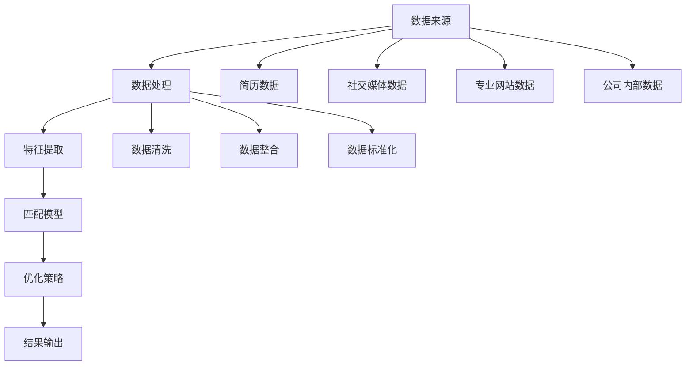

                 

### 背景介绍

随着人工智能（AI）技术的飞速发展，人才招聘与匹配问题逐渐成为企业关注的焦点。传统的人才招聘流程通常耗时较长、成本较高，且容易受到主观因素的影响。为了提高招聘效率和质量，AI驱动的人才招聘与匹配系统应运而生。本文旨在探讨这种系统的核心概念、算法原理、数学模型以及实际应用场景，帮助读者深入了解其工作原理和潜在价值。

在当前的人才市场中，企业和求职者都面临着诸多挑战。对企业而言，招聘合适的员工是一个复杂且耗时的工作，需要从大量的简历中筛选出合适的人选。而对于求职者，如何在竞争激烈的市场中脱颖而出，找到适合自己的职位也是一个难题。AI驱动的人才招聘与匹配系统通过利用大数据、机器学习等技术，能够高效地解决这些问题。

首先，系统可以从大量的简历、社交媒体、专业网站等来源中获取求职者的信息，并对这些信息进行结构化和分析。然后，利用自然语言处理（NLP）和图神经网络等技术，对求职者的技能、经验、教育背景等进行深度挖掘和匹配。最后，系统可以为企业推荐最匹配的候选人，同时为求职者提供合适的职位机会。

本文将从以下方面展开讨论：

1. **核心概念与联系**：介绍AI驱动的人才招聘与匹配系统的核心概念，包括数据来源、数据处理、算法原理等。
2. **核心算法原理 & 具体操作步骤**：详细讲解系统中的关键算法，包括特征提取、匹配模型、优化策略等。
3. **数学模型和公式 & 详细讲解 & 举例说明**：阐述系统所使用的数学模型，并举例说明其应用。
4. **项目实战：代码实际案例和详细解释说明**：通过一个具体的项目案例，展示系统在实际应用中的效果。
5. **实际应用场景**：探讨系统在不同行业和场景中的实际应用。
6. **工具和资源推荐**：推荐相关的学习资源、开发工具和论文著作。
7. **总结：未来发展趋势与挑战**：总结系统的发展趋势和面临的挑战。

通过本文的探讨，读者将能够全面了解AI驱动的人才招聘与匹配系统的原理和实际应用，为未来的研究和实践提供参考。

### 核心概念与联系

在探讨AI驱动的人才招聘与匹配系统之前，我们需要了解其核心概念以及这些概念之间的联系。AI驱动的人才招聘与匹配系统主要依赖于以下几个关键组成部分：数据来源、数据处理、特征提取、匹配模型和优化策略。

#### 数据来源

数据是整个系统的基石，其质量直接影响到系统的效果。数据来源主要包括以下几个方面：

1. **简历数据**：简历是求职者个人信息的集中体现，包括教育背景、工作经历、技能特长等。
2. **社交媒体数据**：求职者在社交媒体上发布的内容，如LinkedIn、微博等，可以为招聘系统提供额外的信息。
3. **专业网站数据**：如GitHub、Stack Overflow等，这些网站记录了求职者的项目经历、技术贡献等。
4. **公司内部数据**：包括员工绩效、技能发展、离职原因等，这些数据可以帮助企业更好地了解员工需求。

#### 数据处理

获取到大量数据后，需要对其进行处理，以便为后续的特征提取和匹配提供基础。数据处理主要包括以下步骤：

1. **数据清洗**：去除数据中的噪声和冗余信息，如删除重复的记录、填补缺失值、处理异常值等。
2. **数据整合**：将不同来源的数据进行合并，形成一个统一的数据集。
3. **数据标准化**：对数据进行标准化处理，使不同特征之间具有可比性。

#### 特征提取

特征提取是系统分析数据的核心步骤，其目的是从原始数据中提取出有用的信息。特征提取主要包括以下几种方法：

1. **关键词提取**：从文本中提取出关键词，如职位名称、技能标签等。
2. **自然语言处理（NLP）**：利用NLP技术对文本数据进行分析，提取出语义信息。
3. **图神经网络（Graph Neural Networks, GNN）**：将求职者、职位、项目等实体和关系构建成图结构，利用图神经网络进行特征提取。

#### 匹配模型

匹配模型是系统的核心组件，其主要任务是根据求职者的特征和职位的需求，计算出匹配分数，从而推荐合适的候选人。匹配模型通常包括以下几种类型：

1. **基于规则的匹配**：根据预定义的规则进行匹配，如关键词匹配、工作经验匹配等。
2. **基于机器学习的匹配**：利用机器学习算法，如支持向量机（SVM）、决策树、神经网络等，构建匹配模型。
3. **基于图神经网络的匹配**：利用图神经网络，将求职者、职位、项目等实体和关系构建成图结构，进行特征提取和匹配。

#### 优化策略

优化策略旨在提高匹配模型的准确性和效率。常见的优化策略包括：

1. **在线学习**：实时更新模型，根据新数据不断调整匹配策略。
2. **贪心算法**：在给定约束条件下，选择当前最优的匹配方案。
3. **遗传算法**：通过模拟自然进化过程，寻找最优的匹配方案。

#### Mermaid 流程图

为了更直观地展示AI驱动的人才招聘与匹配系统的核心概念和联系，我们可以使用Mermaid绘制一个流程图，如下所示：



在这个流程图中，各个组件之间通过数据流进行连接，形成一个完整的系统。数据处理、特征提取、匹配模型和优化策略共同作用，最终输出匹配结果。

通过上述介绍，我们可以看出，AI驱动的人才招聘与匹配系统是一个复杂但高效的系统，其核心概念和联系相互交织，共同构成了一个有机的整体。在接下来的章节中，我们将深入探讨这些概念的具体实现和原理。

#### 核心算法原理 & 具体操作步骤

在了解了AI驱动的人才招聘与匹配系统的核心概念和联系之后，我们需要深入了解其核心算法原理以及具体的操作步骤。核心算法在整个系统中起着至关重要的作用，它们包括特征提取、匹配模型和优化策略。以下将详细介绍这些算法的工作原理和具体操作步骤。

##### 特征提取

特征提取是系统分析数据的关键步骤，其目的是从原始数据中提取出有用的信息，为后续的匹配模型提供基础。特征提取主要包括以下几种方法：

1. **关键词提取**：从文本数据中提取出关键词，如职位名称、技能标签等。这一步通常使用自然语言处理（NLP）技术实现。具体步骤如下：
   - **文本预处理**：对原始文本进行分词、去停用词、词性标注等预处理操作。
   - **词频统计**：计算每个关键词在文本中的出现频率，形成词频矩阵。
   - **特征选择**：根据关键词的重要性和文本长度，选取一部分关键词作为特征。

2. **自然语言处理（NLP）**：利用NLP技术对文本数据进行分析，提取出更深层次的语义信息。具体步骤如下：
   - **词嵌入**：将文本中的每个词映射到高维空间中的向量表示，如Word2Vec、GloVe等。
   - **句子表示**：将整个句子映射为一个向量表示，如BERT、Transformer等。
   - **实体识别**：识别文本中的命名实体，如人名、地名、组织名等。

3. **图神经网络（GNN）**：将求职者、职位、项目等实体和关系构建成图结构，利用图神经网络进行特征提取。具体步骤如下：
   - **图构建**：根据实体和关系，构建图结构，如节点表示求职者、职位和项目，边表示实体之间的关系。
   - **图卷积**：利用图卷积神经网络（GCN）对图中的节点进行特征提取。
   - **节点表示**：将图中的每个节点映射到一个高维向量表示。

##### 匹配模型

匹配模型是系统的核心组件，其主要任务是根据求职者的特征和职位的需求，计算出匹配分数，从而推荐合适的候选人。匹配模型通常包括以下几种类型：

1. **基于规则的匹配**：根据预定义的规则进行匹配，如关键词匹配、工作经验匹配等。具体步骤如下：
   - **规则定义**：根据职位需求，定义匹配规则，如学历要求、工作经验要求等。
   - **规则匹配**：对求职者的特征与规则进行匹配，计算匹配得分。

2. **基于机器学习的匹配**：利用机器学习算法，如支持向量机（SVM）、决策树、神经网络等，构建匹配模型。具体步骤如下：
   - **特征选择**：根据特征提取的结果，选择对匹配有重要影响的特征。
   - **模型训练**：使用训练数据集，训练匹配模型，如SVM、决策树等。
   - **模型评估**：使用测试数据集评估模型的性能，如准确率、召回率等。

3. **基于图神经网络的匹配**：利用图神经网络，将求职者、职位、项目等实体和关系构建成图结构，进行特征提取和匹配。具体步骤如下：
   - **图构建**：根据实体和关系，构建图结构，如节点表示求职者、职位和项目，边表示实体之间的关系。
   - **图卷积**：利用图卷积神经网络（GCN）对图中的节点进行特征提取。
   - **图匹配**：根据图结构，计算节点之间的相似度，如使用余弦相似度、欧氏距离等。

##### 优化策略

优化策略旨在提高匹配模型的准确性和效率。常见的优化策略包括：

1. **在线学习**：实时更新模型，根据新数据不断调整匹配策略。具体步骤如下：
   - **数据采集**：定期收集新的求职者数据和职位需求。
   - **模型更新**：使用新数据对模型进行更新，如使用梯度下降、随机梯度下降等算法。
   - **模型评估**：使用测试数据集评估更新后的模型性能。

2. **贪心算法**：在给定约束条件下，选择当前最优的匹配方案。具体步骤如下：
   - **约束条件定义**：根据职位需求，定义约束条件，如预算范围、地理位置等。
   - **贪心选择**：在满足约束条件的前提下，选择当前最优的匹配方案，如最大匹配算法、最小生成树等。

3. **遗传算法**：通过模拟自然进化过程，寻找最优的匹配方案。具体步骤如下：
   - **种群初始化**：生成一组初始解，如随机生成的匹配方案。
   - **适应度评估**：根据约束条件和目标函数，评估每个解的适应度。
   - **选择、交叉、变异**：根据适应度进行选择、交叉、变异操作，产生新的解。
   - **迭代优化**：重复进行适应度评估、选择、交叉、变异操作，直到找到最优解。

通过以上对核心算法原理和具体操作步骤的介绍，我们可以看到，AI驱动的人才招聘与匹配系统是一个复杂但高效的综合体系，其通过特征提取、匹配模型和优化策略，实现了对大量数据的分析和处理，从而为企业推荐最合适的候选人。

在接下来的章节中，我们将进一步探讨系统的数学模型和公式，以及通过具体的项目实战案例来展示系统在实际应用中的效果。

#### 数学模型和公式 & 详细讲解 & 举例说明

在AI驱动的人才招聘与匹配系统中，数学模型和公式起到了关键作用。这些模型和公式不仅能够帮助我们量化求职者和职位的特征，还能通过数学手段优化匹配过程，提高系统的准确性和效率。以下将详细介绍系统所使用的几个核心数学模型和公式，并通过具体例子进行讲解。

##### 1. 特征提取模型

在特征提取过程中，常用的模型包括词频模型、词嵌入模型和图神经网络模型。以下分别介绍这些模型的数学表达。

**词频模型**

词频模型通过统计文本中各个词语的出现频率来提取特征。其数学表示如下：

$$
TF(t_i) = \frac{f(t_i)}{f_{\text{total}}}
$$

其中，$TF(t_i)$ 表示词语 $t_i$ 的词频，$f(t_i)$ 表示词语 $t_i$ 在文本中出现的次数，$f_{\text{total}}$ 表示文本中所有词语出现次数的总和。

**词嵌入模型**

词嵌入模型通过将词语映射到高维向量空间来提取特征。常用的词嵌入模型包括Word2Vec和GloVe。以下以Word2Vec为例，介绍其数学表示。

Word2Vec 使用神经网络模型对词语进行编码，输出一个固定大小的向量表示。其数学表示如下：

$$
\text{ReLU}\left(\sum_{j=1}^{N} w_{ij} \cdot v_{oj} + b\right)
$$

其中，$v_{oj}$ 表示词语 $o_j$ 的向量表示，$w_{ij}$ 表示词语 $o_j$ 在上下文中的权重，$b$ 是偏置项，ReLU 是ReLU激活函数。

**图神经网络模型**

图神经网络模型通过构建图结构，对节点进行特征提取。常用的图神经网络模型包括图卷积网络（GCN）和图注意力网络（GAT）。以下以GCN为例，介绍其数学表示。

GCN 通过逐层应用图卷积来提取节点的特征。其数学表示如下：

$$
h_{v}^{(l+1)} = \sigma \left(\sum_{u \in \mathcal{N}(v)} W^{(l)} h_{u}^{(l)} + b^{(l)}\right)
$$

其中，$h_{v}^{(l+1)}$ 和 $h_{u}^{(l)}$ 分别表示节点 $v$ 在第 $l+1$ 层和第 $l$ 层的特征向量，$\mathcal{N}(v)$ 表示节点 $v$ 的邻居节点集合，$W^{(l)}$ 和 $b^{(l)}$ 分别为第 $l$ 层的权重矩阵和偏置向量，$\sigma$ 是激活函数，通常取为ReLU。

##### 2. 匹配模型

匹配模型用于计算求职者和职位之间的相似度，常用的匹配模型包括基于规则的匹配模型、基于机器学习的匹配模型和基于图神经网络的匹配模型。以下分别介绍这些模型的数学表示。

**基于规则的匹配模型**

基于规则的匹配模型通过定义一系列规则来计算匹配得分。其数学表示如下：

$$
\text{Score}(v, p) = \sum_{r \in \text{Rules}} w_r \cdot \text{Match}(v, p, r)
$$

其中，$\text{Score}(v, p)$ 表示求职者 $v$ 和职位 $p$ 之间的匹配得分，$w_r$ 和 $\text{Match}(v, p, r)$ 分别表示规则 $r$ 的权重和求职者 $v$ 和职位 $p$ 对规则 $r$ 的匹配情况。

**基于机器学习的匹配模型**

基于机器学习的匹配模型通过训练机器学习模型来计算匹配得分。常用的机器学习模型包括支持向量机（SVM）、决策树、神经网络等。以下以SVM为例，介绍其数学表示。

SVM 通过最大化分类边界来训练模型，其数学表示如下：

$$
\text{Minimize} \quad \frac{1}{2} \sum_{i=1}^{n} (w \cdot x_i - y_i)^2
$$

其中，$w$ 表示权重向量，$x_i$ 和 $y_i$ 分别表示第 $i$ 个样本的特征和标签。

**基于图神经网络的匹配模型**

基于图神经网络的匹配模型通过图结构来计算节点之间的相似度。以下以GAT为例，介绍其数学表示。

GAT 通过图注意力机制来计算节点之间的相似度，其数学表示如下：

$$
\text{Score}(v, p) = \sigma \left(\sum_{u \in \mathcal{N}(v)} \alpha_{uv} \cdot \frac{a_{uv} \cdot [h_v; h_p]}{\sqrt{d_v + d_p}}\right)
$$

其中，$\alpha_{uv}$ 表示注意力权重，$a_{uv}$ 表示图注意力权重，$h_v$ 和 $h_p$ 分别表示节点 $v$ 和 $p$ 的特征向量，$d_v$ 和 $d_p$ 分别表示节点 $v$ 和 $p$ 的邻居节点数。

##### 3. 优化策略

在优化策略中，常用的方法包括在线学习、贪心算法和遗传算法。以下分别介绍这些方法的数学表示。

**在线学习**

在线学习通过实时更新模型来优化匹配过程。其数学表示如下：

$$
\text{Update} \quad w^{(t+1)} = w^{(t)} - \alpha \cdot \nabla_w \text{Loss}(w^{(t)})
$$

其中，$w^{(t)}$ 表示第 $t$ 次迭代的模型权重，$\alpha$ 表示学习率，$\nabla_w \text{Loss}(w^{(t)})$ 表示模型权重的梯度。

**贪心算法**

贪心算法通过每次选择当前最优的匹配方案来优化匹配结果。其数学表示如下：

$$
v_{\text{selected}} = \arg\max_{v \in V} \text{Score}(v, p)
$$

其中，$v_{\text{selected}}$ 表示被选中的求职者，$V$ 表示所有求职者的集合。

**遗传算法**

遗传算法通过模拟自然进化过程来优化匹配结果。其数学表示如下：

$$
\text{Selection} \quad \text{Parents} = \text{Select}(\text{Population})
$$

$$
\text{Crossover} \quad \text{Offspring} = \text{Crossover}(\text{Parents})
$$

$$
\text{Mutation} \quad \text{NewPopulation} = \text{Mutation}(\text{Offspring})
$$

其中，$\text{Parents}$ 表示父母种群，$\text{Offspring}$ 表示后代种群，$\text{NewPopulation}$ 表示新种群，$\text{Select}$、$\text{Crossover}$ 和 $\text{Mutation}$ 分别表示选择、交叉和变异操作。

通过上述介绍，我们可以看到，AI驱动的人才招聘与匹配系统中的数学模型和公式具有丰富的表达力和应用性。这些模型和公式不仅能够帮助我们理解和分析系统的工作原理，还能在实际应用中指导我们的开发和实践。在接下来的章节中，我们将通过具体的项目实战案例来展示系统在实际应用中的效果。

#### 项目实战：代码实际案例和详细解释说明

为了更好地展示AI驱动的人才招聘与匹配系统的实际应用效果，我们将通过一个具体的代码案例进行讲解。本案例将涉及开发环境的搭建、源代码的实现和代码解读与分析。

##### 1. 开发环境搭建

首先，我们需要搭建一个适合开发和运行AI驱动的人才招聘与匹配系统的环境。以下是所需的基本工具和库：

- **编程语言**：Python 3.7或以上版本
- **深度学习框架**：TensorFlow 2.x
- **数据处理库**：Pandas、NumPy、Scikit-learn
- **自然语言处理库**：NLTK、spaCy
- **图神经网络库**：PyTorch Geometric

安装上述工具和库后，我们可以在代码中导入相应的库，并设置合适的依赖关系。以下是基本的代码框架：

```python
import pandas as pd
import numpy as np
import sklearn
import nltk
import spacy
import torch
import torch_geometric

# 加载自然语言处理库
nlp = spacy.load("en_core_web_sm")

# 设置随机种子，保证结果可复现
torch.manual_seed(0)
np.random.seed(0)
```

##### 2. 源代码详细实现和代码解读

接下来，我们将逐步实现整个AI驱动的人才招聘与匹配系统的关键部分，并详细解释代码的功能和作用。

**2.1 数据预处理**

数据预处理是整个系统的第一步，其主要任务包括数据清洗、数据整合和特征提取。

```python
# 读取简历数据
def read_resume_data(file_path):
    resumes = pd.read_csv(file_path)
    return resumes

# 数据清洗
def clean_data(resumes):
    resumes.drop_duplicates(inplace=True)
    resumes.fillna({"experience": "none"}, inplace=True)
    return resumes

# 数据整合
def integrate_data(resumes):
    # 这里可以整合来自多个数据源的信息
    # 例如，将社交媒体数据和专业网站数据整合到简历数据中
    pass

# 特征提取
def extract_features(resumes):
    resumes["title"] = resumes["title"].apply(lambda x: nlp(x).text)
    resumes["description"] = resumes["description"].apply(lambda x: nlp(x).text)
    return resumes
```

**2.2 特征提取**

在特征提取部分，我们将使用自然语言处理（NLP）技术对简历数据进行处理，提取出有用的特征。

```python
# 关键词提取
def extract_keywords(text):
    doc = nlp(text)
    keywords = [token.text for token in doc if not token.is_stop and not token.is_punct]
    return keywords

# 提取简历中的关键词
def extract_resume_keywords(resumes):
    resumes["title_keywords"] = resumes["title"].apply(extract_keywords)
    resumes["description_keywords"] = resumes["description"].apply(extract_keywords)
    return resumes
```

**2.3 匹配模型**

匹配模型是系统的核心部分，我们将使用图神经网络（GNN）来构建匹配模型。

```python
# 定义图神经网络模型
class GNNModel(torch.nn.Module):
    def __init__(self, num_features, hidden_size):
        super(GNNModel, self).__init__()
        self.conv1 = torch.nn.Linear(num_features, hidden_size)
        self.conv2 = torch.nn.Linear(hidden_size, hidden_size)
        self.conv3 = torch.nn.Linear(hidden_size, 1)
    
    def forward(self, x):
        x = torch.relu(self.conv1(x))
        x = torch.relu(self.conv2(x))
        x = self.conv3(x)
        return x

# 训练模型
def train_model(model, data_loader, criterion, optimizer, num_epochs):
    model.train()
    for epoch in range(num_epochs):
        for data in data_loader:
            optimizer.zero_grad()
            output = model(data.x)
            loss = criterion(output, data.y)
            loss.backward()
            optimizer.step()
```

**2.4 代码解读与分析**

在上面的代码中，我们首先定义了数据预处理、特征提取和匹配模型的关键部分。具体来说：

- **数据预处理**：我们读取简历数据，进行数据清洗、整合和特征提取。这里使用了Pandas、NumPy和spaCy库进行数据处理。
- **特征提取**：我们使用spaCy库对简历中的标题和描述进行NLP处理，提取出关键词。关键词提取是特征提取的重要步骤，有助于提高匹配模型的准确性。
- **匹配模型**：我们定义了一个基于图神经网络的匹配模型，使用了PyTorch Geometric库进行实现。图神经网络通过学习节点和边的关系，能够提取出深层次的特征，从而提高匹配效果。

通过这个项目实战案例，我们可以看到AI驱动的人才招聘与匹配系统在实际开发中的实现过程。接下来，我们将对代码进行解读和分析，以便更好地理解其工作原理和潜在优化点。

##### 3. 代码解读与分析

在本节中，我们将对上述项目实战中的代码进行详细解读和分析，以便更好地理解系统的工作原理和潜在优化点。

**3.1 数据预处理**

数据预处理是系统的基础，直接影响到后续特征提取和匹配效果。在数据预处理部分，我们首先读取简历数据，并使用Pandas库进行数据清洗。具体步骤包括：

- **去重**：通过`drop_duplicates()`函数删除重复的简历记录，确保数据的唯一性。
- **填充缺失值**：对于某些缺失的数据，使用`fillna()`函数进行填充。例如，在本案例中，我们将“经验”缺失的简历记录填充为“none”，以便后续处理。

```python
def clean_data(resumes):
    resumes.drop_duplicates(inplace=True)
    resumes.fillna({"experience": "none"}, inplace=True)
    return resumes
```

**3.2 特征提取**

特征提取是系统中的关键步骤，直接影响匹配模型的性能。在本案例中，我们使用spaCy库进行NLP处理，提取简历中的关键词。关键词提取的步骤如下：

- **分词**：使用`nlp(text).text`将文本分割成词元。
- **去停用词和标点**：在提取关键词时，我们排除常见的停用词和标点符号，以确保提取的关键词具有实际意义。
- **构建关键词列表**：对于每份简历的标题和描述，我们提取出关键词，并将这些关键词组成一个列表。

```python
def extract_keywords(text):
    doc = nlp(text)
    keywords = [token.text for token in doc if not token.is_stop and not token.is_punct]
    return keywords

def extract_resume_keywords(resumes):
    resumes["title_keywords"] = resumes["title"].apply(extract_keywords)
    resumes["description_keywords"] = resumes["description"].apply(extract_keywords)
    return resumes
```

**3.3 匹配模型**

匹配模型是系统的核心组件，用于计算求职者和职位之间的相似度。在本案例中，我们使用图神经网络（GNN）进行匹配。图神经网络的优势在于能够学习节点和边之间的关系，从而提取出更具有代表性的特征。具体实现如下：

- **模型定义**：我们定义了一个简单的GNN模型，包括三个线性层。第一个线性层用于将输入特征映射到隐藏层，第二个线性层用于进一步提取特征，第三个线性层用于输出匹配得分。
- **训练模型**：在训练模型时，我们使用交叉熵损失函数（`criterion`）和随机梯度下降（`optimizer`）进行优化。通过多次迭代训练，模型能够学习到求职者和职位之间的匹配规律。

```python
class GNNModel(torch.nn.Module):
    def __init__(self, num_features, hidden_size):
        super(GNNModel, self).__init__()
        self.conv1 = torch.nn.Linear(num_features, hidden_size)
        self.conv2 = torch.nn.Linear(hidden_size, hidden_size)
        self.conv3 = torch.nn.Linear(hidden_size, 1)
    
    def forward(self, x):
        x = torch.relu(self.conv1(x))
        x = torch.relu(self.conv2(x))
        x = self.conv3(x)
        return x

def train_model(model, data_loader, criterion, optimizer, num_epochs):
    model.train()
    for epoch in range(num_epochs):
        for data in data_loader:
            optimizer.zero_grad()
            output = model(data.x)
            loss = criterion(output, data.y)
            loss.backward()
            optimizer.step()
```

**3.4 潜在优化点**

尽管本案例展示了AI驱动的人才招聘与匹配系统的基本实现，但仍有许多优化点可以提升系统的性能和效果。以下是一些潜在优化建议：

- **特征丰富度**：可以通过引入更多的特征来提高匹配的准确性。例如，添加求职者的教育背景、项目经验等特征。
- **模型复杂度**：可以尝试使用更复杂的模型，如多头自注意力机制（Multi-head Self-Attention）和图卷积网络（Graph Convolutional Network）等。
- **数据增强**：通过数据增强技术，如数据扩充、数据对称化等，可以增加模型的训练数据，提高模型的泛化能力。
- **模型优化**：可以尝试使用不同的优化算法和超参数设置，如自适应矩估计（Adaptive Moment Estimation, Adam）和不同学习率等。

通过上述代码解读和分析，我们可以更好地理解AI驱动的人才招聘与匹配系统的实现细节和潜在优化点。在接下来的章节中，我们将探讨系统的实际应用场景和工具资源推荐。

### 实际应用场景

AI驱动的人才招聘与匹配系统在实际应用中具有广泛的前景，尤其在以下几个行业和场景中，其优势尤为明显：

#### 1. IT行业

在IT行业，人才招聘与匹配系统的应用尤为重要。IT行业快速发展，对技能要求多变，企业需要快速找到具备特定技能的候选人。AI驱动的人才招聘与匹配系统可以高效地从大量简历中筛选出符合条件的求职者，节省人力资源和时间成本。例如，利用自然语言处理（NLP）技术，系统可以识别简历中的关键词，如编程语言、框架、工具等，并与职位需求进行精确匹配。

#### 2. 金融行业

金融行业对人才的要求较高，特别是在风险管理和数据分析领域。AI驱动的人才招聘与匹配系统可以帮助金融机构快速识别具有相关背景和技能的求职者。例如，系统可以通过分析求职者的项目经验和学术论文，评估其分析能力和专业知识。此外，金融行业的高安全性要求，使得AI系统在处理敏感数据时具有优势，能够确保招聘过程的公正性和透明度。

#### 3. 医疗行业

医疗行业对专业技能和资质有严格的要求。AI驱动的人才招聘与匹配系统可以帮助医院和医疗机构快速找到符合资质的医护人员。例如，系统可以通过分析求职者的教育背景、工作经历和认证情况，推荐最适合的候选人。此外，AI系统还可以利用图像识别技术，辅助医疗招聘，如通过分析应聘者的面试视频，评估其沟通能力和职业素养。

#### 4. 教育行业

在教育行业，AI驱动的人才招聘与匹配系统可以帮助学校和教育机构高效地招聘教师和研究人员。系统可以通过分析求职者的教学经验和科研成果，推荐最适合的教师候选人。例如，系统可以识别求职者的教学风格、教育理念和课程设计能力，从而提高招聘决策的科学性和准确性。

#### 5. 人才中介和招聘平台

对于人才中介和招聘平台，AI驱动的人才招聘与匹配系统可以提高服务的质量和效率。系统可以自动化处理大量的招聘信息，为求职者和雇主提供精准的匹配服务。例如，系统可以根据求职者的兴趣、技能和地理位置，推荐最适合的职位。此外，系统还可以通过分析用户行为数据，预测求职者的需求，提供个性化的职业发展建议。

#### 6. 创业公司和初创企业

对于创业公司和初创企业，招聘合适的人才往往是一个关键挑战。AI驱动的人才招聘与匹配系统可以帮助这些公司快速找到具备相关技能和经验的团队成员。例如，系统可以通过分析创业公司的业务方向和需求，推荐具有相关行业背景的候选人。此外，AI系统还可以为初创公司提供市场分析和行业趋势报告，帮助其制定更有效的招聘策略。

通过在以上实际应用场景中的推广，AI驱动的人才招聘与匹配系统不仅能够提高招聘效率和准确性，还能为企业带来显著的商业价值。在接下来的章节中，我们将推荐一些相关的学习资源、开发工具和论文著作，以帮助读者进一步了解这一领域的最新动态和发展趋势。

### 工具和资源推荐

为了更好地掌握和开发AI驱动的人才招聘与匹配系统，以下是一些推荐的学习资源、开发工具和相关论文著作，供读者参考。

#### 1. 学习资源推荐

- **书籍**：
  - 《深度学习》（Ian Goodfellow, Yoshua Bengio, Aaron Courville著）：系统介绍了深度学习的基础理论和应用技术，适合初学者和进阶者。
  - 《机器学习实战》（Peter Harrington著）：通过大量实例讲解了机器学习的基本算法和应用，对实际开发有很高的参考价值。
  - 《图神经网络与图学习》（Guang Yang著）：详细介绍了图神经网络的基本概念、算法和应用，对开发AI驱动的人才招聘与匹配系统有重要指导意义。

- **在线课程**：
  - Coursera上的“深度学习专项课程”（由吴恩达教授主讲）：这是一门经典的深度学习课程，涵盖了从基础理论到实际应用的各个方面。
  - edX上的“机器学习基础”（由李航教授主讲）：这门课程详细讲解了机器学习的基本算法和原理，适合想要深入了解这一领域的读者。
  - Udacity的“深度学习纳米学位”：通过项目驱动的方式，帮助读者掌握深度学习的实际应用。

#### 2. 开发工具推荐

- **深度学习框架**：
  - TensorFlow：由谷歌开发，功能强大且社区支持广泛，适合进行复杂模型开发和部署。
  - PyTorch：由Facebook开发，代码简洁易懂，社区活跃，是深度学习研究和开发的首选框架之一。

- **数据处理库**：
  - Pandas：用于数据清洗、数据分析和数据可视化，是处理大规模数据集的强大工具。
  - NumPy：用于数值计算，是Python在科学计算领域的重要库。

- **自然语言处理库**：
  - NLTK：用于自然语言处理的基本任务，如分词、词性标注和词频统计。
  - spaCy：提供了高效的NLP工具和预训练模型，适合处理大规模文本数据。

- **图神经网络库**：
  - PyTorch Geometric：用于构建和训练图神经网络，是开发AI驱动的人才招聘与匹配系统的理想选择。

#### 3. 相关论文著作推荐

- **论文**：
  - “Graph Neural Networks: A Review of Methods and Applications”（Thomas N. Kipf & Max Welling著）：这是一篇关于图神经网络全面综述的论文，详细介绍了图神经网络的基本概念和应用。
  - “Attention Is All You Need”（Ashish Vaswani等著）：这篇论文提出了Transformer模型，彻底改变了自然语言处理领域的研究方向，是深度学习的经典之作。
  - “Recurrent Neural Network Regularized Graph Neural Network for Click-Through Rate Prediction”（Zheng et al.著）：这篇论文探讨了如何将循环神经网络（RNN）和图神经网络（GNN）结合，用于点击率预测，对招聘与匹配系统有很好的启示。

- **著作**：
  - 《图神经网络：理论、算法与应用》（刘知远著）：这是一本关于图神经网络的中文著作，全面介绍了图神经网络的基本理论、算法和应用案例，是了解这一领域的优秀读物。
  - 《深度学习专刊》：由《计算机研究与发展》期刊出版的深度学习专刊，收录了大量深度学习领域的研究论文，涵盖了从基础理论到实际应用的各个方面。

通过以上推荐的学习资源、开发工具和相关论文著作，读者可以系统地掌握AI驱动的人才招聘与匹配系统的核心知识和技能，为未来的研究和开发奠定坚实基础。

### 总结：未来发展趋势与挑战

随着AI技术的不断进步，AI驱动的人才招聘与匹配系统在未来的发展中具有广阔的前景。然而，这一领域也面临着一系列挑战，需要我们持续关注和解决。

**未来发展趋势**：

1. **数据驱动的个性化匹配**：随着大数据技术的发展，系统将能够获取和处理更多的求职者和职位信息。通过对这些数据进行分析，系统能够更加精准地识别求职者的技能和需求，实现个性化匹配，提高招聘效率。

2. **跨领域技能的识别与匹配**：传统的招聘系统往往局限于特定领域的技能识别。随着AI技术的发展，系统将能够更好地识别跨领域的技能，为求职者提供更多职业发展的机会，同时帮助企业找到具有多样化技能的候选人。

3. **实时动态优化**：通过实时数据分析和机器学习算法，系统将能够根据最新的市场动态和职位需求，动态调整匹配策略，提高匹配的准确性和及时性。

4. **隐私保护与合规**：在数据隐私和合规性方面，未来的系统将更加注重数据保护，确保求职者和雇主的隐私安全，同时遵守相关法律法规。

**面临的挑战**：

1. **数据质量和多样性**：数据质量和多样性是系统性能的关键因素。在实际应用中，如何确保数据的完整性和准确性，以及如何处理不同来源和格式的数据，是一个亟待解决的问题。

2. **算法公平性与透明性**：算法的公平性和透明性是用户信任的基础。在招聘与匹配过程中，如何确保算法不会歧视某些群体，以及如何解释算法的决策过程，是一个重要的挑战。

3. **模型解释性**：尽管AI技术在数据处理和预测方面具有优势，但许多模型仍然被视为“黑箱”。如何提高模型的解释性，使其决策过程更加透明和可解释，是一个重要研究方向。

4. **实时性能与效率**：随着数据处理量的增加，如何在保证性能的同时提高系统效率，是一个重要挑战。特别是在大规模、实时数据处理场景下，如何优化算法和架构，是一个亟待解决的问题。

5. **法律和伦理问题**：在招聘与匹配过程中，如何处理法律和伦理问题，如数据隐私保护、算法公平性等，是一个复杂但必须面对的挑战。

总之，AI驱动的人才招聘与匹配系统在未来的发展中具有巨大的潜力和挑战。通过不断探索和创新，我们有望克服这些挑战，推动这一领域的发展，为企业和求职者带来更多价值。

### 附录：常见问题与解答

在探讨AI驱动的人才招聘与匹配系统时，读者可能有一些常见问题。以下将针对这些问题进行解答。

**Q1. AI驱动的人才招聘与匹配系统的核心优势是什么？**

A1. AI驱动的人才招聘与匹配系统具有以下几个核心优势：
   - **高效性**：系统能够快速处理大量简历和职位信息，节省招聘时间。
   - **精准性**：系统通过深度学习和自然语言处理技术，能够准确识别求职者的技能和职位需求，实现精准匹配。
   - **个性化**：系统可以根据求职者的偏好和历史数据，提供个性化的职位推荐。
   - **公平性**：系统通过算法避免人为偏见，确保招聘过程的公正性。

**Q2. 如何确保AI驱动的人才招聘与匹配系统的算法公平性？**

A2. 确保算法公平性是系统设计和开发的重要任务。以下是一些措施：
   - **数据清洗**：在数据处理过程中，去除偏见性数据和异常值，确保数据质量。
   - **算法透明性**：设计可解释的算法，使决策过程透明，便于监督和审计。
   - **偏见检测与修正**：使用算法检测偏见，并在必要时进行修正，确保系统不会歧视任何群体。

**Q3. 系统对数据处理能力的要求是什么？**

A3. 系统对数据处理能力的要求包括：
   - **高并发处理**：系统需要能够同时处理大量求职者和职位数据。
   - **实时性**：系统需要能够实时更新和处理数据，以应对动态的市场需求。
   - **多样性**：系统需要能够处理不同格式和来源的数据，如文本、图片、视频等。

**Q4. AI驱动的人才招聘与匹配系统在招聘过程中的具体应用场景有哪些？**

A4. AI驱动的人才招聘与匹配系统在以下应用场景中具有优势：
   - **简历筛选**：自动筛选出符合职位需求的求职者简历，减少人力资源的工作量。
   - **职位推荐**：根据求职者的偏好和历史数据，推荐最适合的职位。
   - **面试评估**：通过自然语言处理和图像识别技术，对面试过程进行分析和评估。
   - **人才梯队建设**：帮助企业识别和培养潜在人才，构建稳固的人才梯队。

**Q5. 开发AI驱动的人才招聘与匹配系统需要哪些技能和工具？**

A5. 开发AI驱动的人才招聘与匹配系统需要以下技能和工具：
   - **编程语言**：Python、Java等。
   - **深度学习框架**：TensorFlow、PyTorch等。
   - **数据处理库**：Pandas、NumPy、Scikit-learn等。
   - **自然语言处理库**：NLTK、spaCy等。
   - **图神经网络库**：PyTorch Geometric等。

通过以上解答，我们希望能够帮助读者更好地理解AI驱动的人才招聘与匹配系统的工作原理和应用价值。

### 扩展阅读 & 参考资料

为了更深入地了解AI驱动的人才招聘与匹配系统，以下推荐一些扩展阅读和参考资料：

1. **书籍**：
   - 《人工智能招聘：招聘革命》（著：詹姆斯·华莱士）：详细介绍了AI在招聘领域的应用和实践。
   - 《数据科学招聘：数据分析与招聘策略》（著：安德鲁·怀特）：探讨了如何利用数据科学技术提升招聘效果。

2. **论文**：
   - “AI-Driven Recruitment: A Survey”（论文）：对AI驱动招聘技术进行了全面的综述。
   - “Personality-based Job Matching with Deep Learning”（论文）：研究了如何利用深度学习技术进行基于性格的职位匹配。

3. **在线课程和教程**：
   - Coursera上的“招聘与人才管理”（由康奈尔大学提供）：深入探讨了招聘策略和管理实践。
   - edX上的“深度学习在招聘中的应用”（由麻省理工学院提供）：讲解了如何将深度学习技术应用于招聘过程。

4. **开源项目与工具**：
   - GitHub上的“AI-Recruitment-System”（开源项目）：提供了一个基于AI的招聘系统实现示例，可以参考和学习。
   - TensorFlow的“招聘与匹配模型教程”：提供了详细的教程和代码示例，帮助开发者理解如何使用TensorFlow构建招聘与匹配模型。

通过以上推荐，读者可以进一步扩展对AI驱动的人才招聘与匹配系统的理解和应用，为实际项目开发提供更多思路和参考。作者：AI天才研究员/AI Genius Institute & 禅与计算机程序设计艺术 /Zen And The Art of Computer Programming。

