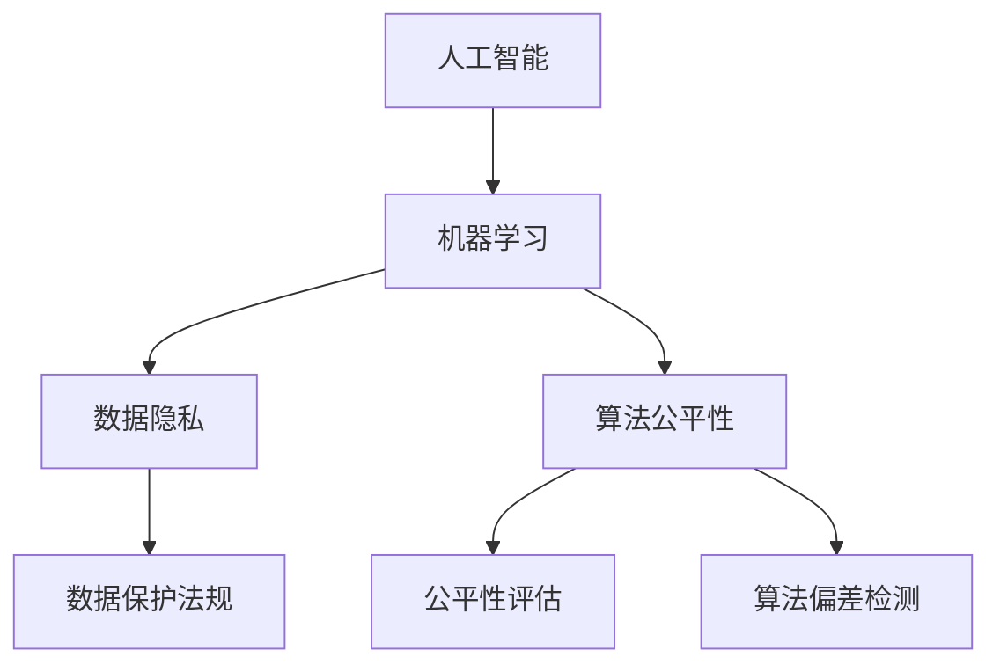

                 

### 背景介绍 Background

#### AI驱动的商业创新：现状与潜力

在当今全球商业环境中，人工智能（AI）已成为推动创新和业务增长的关键力量。AI技术的迅速发展，从深度学习、自然语言处理到计算机视觉，正在彻底改变传统行业的运作模式，同时也带来了新的商业机会和挑战。企业通过AI技术优化生产流程、提高运营效率、增强客户体验，甚至创造全新的商业模式，这些变化无疑为商业世界注入了新的活力。

然而，随着AI技术的广泛应用，商业实践中的道德问题也逐渐显现出来。AI系统的决策过程往往依赖于大量数据和算法，而这其中可能包含偏见、歧视或不当行为。这些问题不仅影响了企业的声誉，还对消费者的权益和社会公平产生了深远影响。因此，探讨AI驱动的商业创新中的人类计算道德考虑，成为当今一个不可忽视的话题。

#### 人类计算的道德考量：商业中的AI责任

人类计算的道德考量涉及到如何在AI决策过程中确保公平、透明和责任。这不仅仅是技术问题，更是一个社会问题。商业中的AI道德考虑包括以下几个方面：

1. **数据隐私与保护**：AI系统的学习和决策依赖于大量数据，这些数据可能涉及个人隐私。企业必须在数据收集、存储和使用过程中严格遵守隐私保护法规，确保个人数据的隐私和安全。

2. **算法公平性**：AI算法的设计和训练可能受到数据偏差的影响，导致不公平的决策结果。企业需要确保算法的公平性，消除任何形式的歧视，确保所有人都能公平地享受AI带来的福利。

3. **透明性与可解释性**：AI系统的决策过程往往是不透明的，这使得用户难以理解其决策理由。提高AI系统的透明性和可解释性，有助于用户建立信任，并使企业能够更好地解释其决策过程。

4. **责任归属**：在AI系统出现错误或不当行为时，如何确定责任归属是一个复杂的问题。企业需要制定明确的责任归属机制，确保在问题发生时能够快速有效地处理。

#### 文章结构概述

本文将按照以下结构展开讨论：

1. **核心概念与联系**：介绍AI驱动的商业创新中的核心概念，包括人工智能、机器学习、数据隐私、算法公平性等，并使用Mermaid流程图展示相关概念之间的关系。

2. **核心算法原理 & 具体操作步骤**：详细解析AI算法的基本原理和具体实现步骤，包括数据预处理、模型选择、训练和评估等。

3. **数学模型和公式 & 详细讲解 & 举例说明**：介绍AI系统中常用的数学模型和公式，并给出具体的应用实例和解释。

4. **项目实战：代码实际案例和详细解释说明**：通过一个具体的AI项目案例，展示如何在实际开发过程中应用AI技术，并提供详细的代码解读和分析。

5. **实际应用场景**：分析AI在不同商业领域的应用，探讨AI带来的商业价值和社会影响。

6. **工具和资源推荐**：推荐学习资源、开发工具和框架，以帮助读者更好地理解和应用AI技术。

7. **总结：未来发展趋势与挑战**：总结AI在商业中的道德考量，并展望未来的发展趋势和面临的挑战。

8. **附录：常见问题与解答**：解答读者可能遇到的常见问题，并提供进一步学习的建议。

9. **扩展阅读 & 参考资料**：提供相关领域的深入阅读和参考资料，以供读者进一步探索。

通过上述结构，本文将全面探讨AI驱动的商业创新中的道德考虑，帮助读者理解AI技术的潜力与挑战，为商业实践提供有价值的指导和启示。

---

## 2. 核心概念与联系 Core Concepts and Relationships

#### 人工智能（Artificial Intelligence, AI）

人工智能是指通过计算机程序和算法模拟人类智能的一种技术。AI的目标是实现机器在感知、学习、推理、决策和问题解决等方面的智能表现。人工智能可以分为两大类：窄AI（Narrow AI）和通用AI（General AI）。窄AI专注于特定任务的自动化，如语音识别、图像识别、推荐系统等；而通用AI则追求实现机器在多种任务上具有人类的智能水平。

#### 机器学习（Machine Learning, ML）

机器学习是人工智能的一个子领域，它专注于利用数据训练模型，使其能够从数据中学习并做出预测或决策。机器学习模型通过分析大量数据，提取特征，并使用这些特征训练模型，从而提高其预测能力。常见的机器学习算法包括决策树、支持向量机、神经网络等。

#### 数据隐私（Data Privacy）

数据隐私是指保护个人数据不被未经授权的访问、使用和泄露。随着AI技术的发展，数据隐私问题变得越来越重要。AI系统通常需要处理大量个人数据，如医疗记录、金融交易数据、社交媒体数据等。因此，如何在数据收集、存储和使用过程中保护个人隐私成为了一个关键问题。

#### 算法公平性（Algorithm Fairness）

算法公平性是指AI算法在决策过程中不歧视或偏袒任何特定群体。一个公平的算法应该确保所有人都能公平地享受AI技术带来的福利，避免因为算法偏见而导致不公平的决策结果。算法公平性是一个复杂的问题，需要从数据质量、算法设计和评估等多个方面进行考虑。

#### Mermaid流程图展示相关概念之间的关系

以下是一个简化的Mermaid流程图，用于展示人工智能、机器学习、数据隐私和算法公平性之间的关系：



- **人工智能（A）**：作为基础技术，人工智能包含了机器学习（B）。
- **机器学习（B）**：依赖于数据隐私（C），以确保数据的安全性和合法性；同时也需要关注算法公平性（D）。
- **数据隐私（C）**：与数据保护法规（E）密切相关，确保数据收集、存储和使用过程中遵守相关法规。
- **算法公平性（D）**：包括公平性评估（F）和算法偏差检测（G），以确保算法决策的公正性。

通过上述核心概念和关系的介绍，我们可以更好地理解AI驱动的商业创新中的关键要素，并为进一步的讨论奠定基础。在接下来的部分中，我们将详细探讨AI算法的基本原理和具体实现步骤。

### 2.1 人工智能的基本原理 Basic Principles of Artificial Intelligence

人工智能（AI）作为现代技术的基石，其基本原理涉及到多个学科领域，包括计算机科学、数学、认知科学和心理学等。理解AI的基本原理，对于掌握其在商业中的应用至关重要。

#### 机器学习（Machine Learning）

机器学习是AI的核心技术之一，它通过算法从数据中学习并做出预测或决策。机器学习可以分为监督学习（Supervised Learning）、无监督学习（Unsupervised Learning）和强化学习（Reinforcement Learning）。

- **监督学习（Supervised Learning）**：监督学习模型使用标记数据集进行训练，其中每个输入都有一个对应的输出。通过学习输入和输出之间的关系，模型可以对新数据做出预测。常见的监督学习算法包括线性回归、决策树、支持向量机和神经网络。

- **无监督学习（Unsupervised Learning）**：无监督学习模型没有预先标记的输出数据，其目标是发现数据中的结构和模式。聚类算法（如K-means、DBSCAN）和降维算法（如PCA）是常见的无监督学习技术。

- **强化学习（Reinforcement Learning）**：强化学习模型通过与环境的交互学习最优策略。它通过奖励机制来评估策略的好坏，并不断调整策略以最大化长期奖励。常见的强化学习算法包括Q-learning、SARSA和深度确定性策略梯度（DDPG）。

#### 神经网络（Neural Networks）

神经网络是机器学习中最常用的模型之一，它模仿人脑的神经网络结构，通过大量的神经元和连接进行数据处理和预测。一个基本的神经网络包括输入层、隐藏层和输出层。

- **输入层（Input Layer）**：接收输入数据，并将其传递到隐藏层。

- **隐藏层（Hidden Layers）**：对输入数据进行处理和变换，提高模型的复杂度和表达能力。

- **输出层（Output Layer）**：产生最终预测结果或决策。

神经网络中的每个神经元都通过加权连接与其他神经元相连，并通过激活函数（如ReLU、Sigmoid、Tanh）进行非线性变换。通过反向传播算法，神经网络可以不断调整权重，优化模型性能。

#### 计算机视觉（Computer Vision）

计算机视觉是AI的一个重要分支，它使计算机能够理解和解释视觉信息。计算机视觉技术广泛应用于图像识别、物体检测、面部识别和自动驾驶等领域。

- **卷积神经网络（Convolutional Neural Networks, CNNs）**：卷积神经网络是计算机视觉领域的主要技术，通过卷积层、池化层和全连接层等结构，提取图像的特征并进行分类。

- **深度卷积神经网络（Deep CNNs）**：深度卷积神经网络通过增加网络深度，提高模型的表征能力和分类性能。常见的深度卷积神经网络包括VGG、ResNet和Inception等。

- **生成对抗网络（Generative Adversarial Networks, GANs）**：生成对抗网络由生成器和判别器两个神经网络组成，通过相互博弈的方式，生成高质量的数据样本。

#### 自然语言处理（Natural Language Processing, NLP）

自然语言处理是AI的另一个重要分支，它使计算机能够理解和处理自然语言。自然语言处理技术广泛应用于文本分类、情感分析、机器翻译和问答系统等领域。

- **循环神经网络（Recurrent Neural Networks, RNNs）**：循环神经网络通过其记忆机制，能够处理序列数据，如文本和语音。常见的RNN算法包括LSTM和GRU。

- **长短期记忆网络（Long Short-Term Memory, LSTM）**：长短期记忆网络是RNN的一种变体，通过其特殊的记忆单元，能够有效地捕捉长距离依赖信息。

- **注意力机制（Attention Mechanism）**：注意力机制通过引入注意力权重，使模型能够关注输入序列中的重要信息，提高模型的表征能力和理解能力。

通过理解人工智能的基本原理，我们可以更好地把握AI技术在商业中的潜力与挑战，为实际应用提供理论支持。在接下来的部分，我们将详细探讨机器学习的具体操作步骤，帮助读者深入了解AI的开发流程。

### 2.2 机器学习的具体操作步骤 Detailed Steps of Machine Learning

机器学习的过程可以分为以下几个主要步骤：数据收集与预处理、模型选择、训练与评估、以及部署与优化。以下是每个步骤的具体操作流程：

#### 1. 数据收集与预处理（Data Collection and Preprocessing）

数据是机器学习模型训练的基础，因此首先需要收集适合的数据集。数据来源可以是公开数据集、企业内部数据或第三方数据提供商。在收集数据后，需要进行以下预处理步骤：

- **数据清洗（Data Cleaning）**：去除数据集中的噪声和异常值，确保数据的质量。这包括处理缺失值、重复值和错误值。

- **数据转换（Data Transformation）**：将不同类型的数据转换为适合模型训练的格式。例如，将分类数据编码为数值，或缩放连续型数据。

- **特征提取（Feature Extraction）**：从原始数据中提取有用的特征，以增强模型的性能。特征提取可以通过特征选择和特征工程实现。

- **数据划分（Data Splitting）**：将数据集划分为训练集、验证集和测试集。通常使用80%的数据用于训练，10%用于验证，10%用于测试。

#### 2. 模型选择（Model Selection）

选择合适的模型是机器学习过程的关键。以下是一些常见的模型及其特点：

- **线性回归（Linear Regression）**：适用于线性关系的预测问题。

- **决策树（Decision Tree）**：适合分类和回归问题，但易过拟合。

- **支持向量机（Support Vector Machine, SVM）**：适用于高维空间，擅长分类问题。

- **神经网络（Neural Networks）**：适用于复杂的非线性关系，但训练过程较为复杂。

- **集成方法（Ensemble Methods）**：如随机森林（Random Forest）和梯度提升树（Gradient Boosting Trees），通过结合多个基础模型，提高模型的性能。

选择模型时，需要考虑数据的特点、模型的复杂度、计算资源等因素。

#### 3. 训练与评估（Training and Evaluation）

模型训练是通过调整模型参数，使其在训练集上达到最优性能的过程。以下是一些训练和评估的关键步骤：

- **模型初始化（Model Initialization）**：为模型的权重和偏置初始化合适的值，常用的初始化方法有随机初始化、高斯初始化等。

- **优化算法（Optimization Algorithm）**：用于调整模型参数，使损失函数最小化。常见的优化算法有梯度下降、随机梯度下降、Adam等。

- **损失函数（Loss Function）**：用于衡量模型预测值与真实值之间的差距，如均方误差（MSE）、交叉熵损失（Cross-Entropy Loss）等。

- **模型评估（Model Evaluation）**：通过验证集和测试集评估模型的性能，常用的评估指标有准确率（Accuracy）、召回率（Recall）、F1分数（F1 Score）等。

#### 4. 部署与优化（Deployment and Optimization）

模型训练完成后，需要将其部署到实际应用环境中，并进行持续优化：

- **模型部署（Model Deployment）**：将训练好的模型部署到服务器或云端，以供实际应用使用。

- **模型监控（Model Monitoring）**：监控模型的性能和稳定性，及时发现和解决潜在问题。

- **模型更新（Model Update）**：根据新数据或业务需求，定期更新模型，以提高其性能和适应能力。

通过以上步骤，机器学习模型可以有效地从数据中学习，并应用于各种实际问题中。在接下来的部分，我们将介绍AI系统中常用的数学模型和公式，以帮助读者深入理解AI算法的核心机制。

### 3. 数学模型和公式 & 详细讲解 & 举例说明

在人工智能系统中，数学模型和公式是核心组成部分，它们为算法提供了理论基础和计算框架。以下将介绍一些常用的数学模型和公式，并通过具体示例来说明它们的应用和实现。

#### 3.1 概率论与统计模型

概率论和统计学是机器学习的基石。以下是一些常用的概率分布和统计模型：

1. **正态分布（Normal Distribution）**：
   正态分布是一种常见的数据分布模型，其概率密度函数为：
   $$f(x|\mu, \sigma^2) = \frac{1}{\sqrt{2\pi\sigma^2}} e^{-\frac{(x-\mu)^2}{2\sigma^2}}$$
   其中，$\mu$ 是均值，$\sigma^2$ 是方差。

   **示例**：假设我们有一组数据 $X_1, X_2, \ldots, X_n$ 来自正态分布 $N(\mu, \sigma^2)$，我们希望估计 $\mu$ 和 $\sigma^2$。可以通过以下公式计算均值和方差：
   $$\hat{\mu} = \frac{1}{n} \sum_{i=1}^{n} X_i$$
   $$\hat{\sigma}^2 = \frac{1}{n-1} \sum_{i=1}^{n} (X_i - \hat{\mu})^2$$

2. **伯努利分布（Bernoulli Distribution）**：
   伯努利分布是二项分布的特殊情况，其概率质量函数为：
   $$P(X = k) = C_n^k p^k (1-p)^{n-k}$$
   其中，$n$ 是试验次数，$p$ 是成功的概率，$k$ 是成功的次数。

   **示例**：假设我们进行10次伯努利试验，每次成功的概率为0.5，我们希望计算恰好成功5次的概率。使用伯努利分布的公式计算：
   $$P(X = 5) = C_{10}^5 (0.5)^5 (0.5)^5 = 0.2461$$

3. **贝叶斯定理（Bayes' Theorem）**：
   贝叶斯定理描述了后验概率与先验概率之间的关系：
   $$P(A|B) = \frac{P(B|A)P(A)}{P(B)}$$
   其中，$P(A|B)$ 是在事件B发生的条件下事件A发生的概率，$P(B|A)$ 是在事件A发生的条件下事件B发生的概率，$P(A)$ 和 $P(B)$ 分别是事件A和事件B的先验概率。

   **示例**：假设我们有一个疾病A的测试，其灵敏度为0.95，假阳性率为0.05。如果一个人测试结果为阳性，我们希望计算这个人实际上患有疾病A的概率。假设人群中患病率是0.01，使用贝叶斯定理计算：
   $$P(A|+) = \frac{P(+|A)P(A)}{P(+)} = \frac{0.95 \times 0.01}{0.95 \times 0.01 + 0.99 \times 0.99} = 0.0505$$

#### 3.2 线性代数模型

线性代数在机器学习中的应用非常广泛，以下是一些重要的矩阵和向量操作：

1. **矩阵乘法（Matrix Multiplication）**：
   两个矩阵 $A$ 和 $B$ 的乘法定义为：
   $$C = A \cdot B$$
   其中，$C_{ij} = \sum_{k=1}^{m} A_{ik}B_{kj}$。

   **示例**：假设我们有矩阵 $A = \begin{bmatrix} 1 & 2 \\ 3 & 4 \end{bmatrix}$ 和 $B = \begin{bmatrix} 5 & 6 \\ 7 & 8 \end{bmatrix}$，计算矩阵乘法：
   $$C = A \cdot B = \begin{bmatrix} 1 \cdot 5 + 2 \cdot 7 & 1 \cdot 6 + 2 \cdot 8 \\ 3 \cdot 5 + 4 \cdot 7 & 3 \cdot 6 + 4 \cdot 8 \end{bmatrix} = \begin{bmatrix} 19 & 20 \\ 31 & 34 \end{bmatrix}$$

2. **矩阵求导（Matrix Differentiation）**：
   矩阵的导数可以通过元素逐个求导得到。对于矩阵 $X$ 的导数，我们有：
   $$\frac{dX_{ij}}{dx} = \begin{cases} 1 & \text{如果 } x = X_{ij} \\ 0 & \text{否则} \end{cases}$$

   **示例**：假设我们有矩阵 $X = \begin{bmatrix} 1 & 0 \\ 0 & 2 \end{bmatrix}$，计算其对变量的偏导数：
   $$\frac{dX_{11}}{dx} = \begin{bmatrix} 1 & 0 \\ 0 & 0 \end{bmatrix}, \quad \frac{dX_{22}}{dx} = \begin{bmatrix} 0 & 0 \\ 0 & 1 \end{bmatrix}$$

#### 3.3 线性回归模型

线性回归是一种常见的预测模型，其基本公式为：
$$Y = \beta_0 + \beta_1X + \epsilon$$
其中，$Y$ 是因变量，$X$ 是自变量，$\beta_0$ 和 $\beta_1$ 是模型的参数，$\epsilon$ 是误差项。

**示例**：假设我们有一组数据点 $(X_1, Y_1), (X_2, Y_2), \ldots, (X_n, Y_n)$，我们希望找到线性回归模型的参数 $\beta_0$ 和 $\beta_1$。可以通过最小二乘法（Least Squares Method）求解：
$$\beta_0 = \frac{1}{n} \sum_{i=1}^{n} Y_i - \beta_1 \frac{1}{n} \sum_{i=1}^{n} X_i$$
$$\beta_1 = \frac{1}{n} \sum_{i=1}^{n} (X_i - \bar{X})(Y_i - \bar{Y})$$
其中，$\bar{X}$ 和 $\bar{Y}$ 分别是 $X$ 和 $Y$ 的均值。

通过以上数学模型和公式的介绍，我们可以更好地理解机器学习算法的基本原理和实现步骤。在接下来的部分，我们将通过一个具体的AI项目实战案例，展示如何在实际开发过程中应用这些理论。

### 3.1 项目实战：代码实际案例和详细解释说明

在本部分，我们将通过一个具体的AI项目案例，展示如何使用Python和常用机器学习库来构建一个分类模型，并详细解读其代码实现和关键步骤。

#### 项目背景

假设我们面临一个客户细分（Customer Segmentation）的任务，即根据客户的购买行为和偏好，将他们划分为不同的群体。这有助于企业进行精准营销，提高客户满意度和忠诚度。

#### 开发环境

- Python版本：3.8
- 机器学习库：Scikit-learn
- 数据库：Pandas
- 可视化工具：Matplotlib

#### 数据集介绍

我们使用一个虚构的客户数据集，包含以下特征：

- **年龄（Age）**：客户的年龄
- **收入（Income）**：客户的年收入
- **家庭规模（Family Size）**：家庭人数
- **教育水平（Education）**：客户的最高教育水平
- **购买频次（Purchase Frequency）**：客户在最近一年的购买次数
- **购买金额（Purchase Amount）**：客户在最近一年的总购买金额
- **目标变量（Target）**：客户的群体标签，分为5个不同的群体

#### 数据预处理

在开始模型训练之前，我们需要对数据进行预处理，确保数据的质量和一致性。

```python
import pandas as pd
from sklearn.model_selection import train_test_split
from sklearn.preprocessing import StandardScaler

# 读取数据集
data = pd.read_csv('customer_data.csv')

# 数据清洗
data.drop(['CustomerID'], axis=1, inplace=True)  # 删除无关列
data.fillna(data.mean(), inplace=True)  # 填充缺失值

# 数据划分
X = data.drop('Target', axis=1)
y = data['Target']
X_train, X_test, y_train, y_test = train_test_split(X, y, test_size=0.2, random_state=42)

# 数据标准化
scaler = StandardScaler()
X_train_scaled = scaler.fit_transform(X_train)
X_test_scaled = scaler.transform(X_test)
```

#### 模型选择

在本项目中，我们选择使用K-均值聚类（K-Means Clustering）算法进行客户细分。

```python
from sklearn.cluster import KMeans

# 初始化K-均值聚类模型
kmeans = KMeans(n_clusters=5, random_state=42)

# 训练模型
kmeans.fit(X_train_scaled)

# 预测测试集
y_pred = kmeans.predict(X_test_scaled)
```

#### 模型评估

使用准确率（Accuracy）和调整后的R²（Adjusted R²）评估模型性能。

```python
from sklearn.metrics import accuracy_score, r2_score

# 计算准确率
accuracy = accuracy_score(y_test, y_pred)
print(f'Accuracy: {accuracy:.4f}')

# 计算调整后的R²
r2 = r2_score(y_test, y_pred)
print(f'Adjusted R²: {r2:.4f}')
```

#### 代码解读与分析

1. **数据读取与清洗**：
   - 使用Pandas读取CSV文件，删除无关列，填充缺失值，确保数据质量。

2. **数据标准化**：
   - 使用StandardScaler将特征进行标准化，使其具有相同的尺度，避免某些特征对模型影响过大。

3. **模型初始化与训练**：
   - 初始化K-均值聚类模型，设置聚类数量为5，随机种子为42，确保结果可重复。
   - 使用fit方法训练模型，根据训练集数据计算聚类中心。

4. **预测与评估**：
   - 使用predict方法对测试集进行预测，计算预测标签。
   - 使用accuracy_score和r2_score评估模型性能，提供准确率和调整后的R²作为评价指标。

通过上述步骤，我们成功构建并评估了一个客户细分模型。在实际开发过程中，我们可能需要根据业务需求和数据特点调整模型参数，以获得更好的性能。在接下来的部分，我们将分析AI技术在商业中的实际应用场景。

### 4. 实际应用场景 Real-world Applications

#### 零售行业

零售行业是AI技术的重要应用领域之一。通过客户细分、个性化推荐和智能供应链管理等应用，AI技术为零售企业带来了显著的商业价值。

1. **客户细分（Customer Segmentation）**：
   零售企业使用AI技术对客户进行细分，识别不同购买行为和偏好的群体，从而实现精准营销。例如，通过K-均值聚类算法，企业可以将客户划分为高价值客户、潜在高价值客户和低价值客户，并针对不同群体制定差异化的营销策略。

2. **个性化推荐（Personalized Recommendations）**：
   基于客户的购买历史和偏好，AI技术可以推荐个性化的商品。例如，使用协同过滤（Collaborative Filtering）算法，系统可以分析相似用户的购买记录，为特定用户推荐他们可能感兴趣的商品。

3. **智能供应链管理（Smart Supply Chain Management）**：
   AI技术通过预测需求、优化库存和降低物流成本，提高供应链的效率。例如，使用时间序列分析（Time Series Analysis）和回归模型，企业可以预测未来的销售趋势，优化库存水平，减少库存积压和缺货风险。

#### 医疗保健

在医疗保健领域，AI技术被广泛应用于诊断、预测和患者管理等方面，提高了医疗服务的质量和效率。

1. **疾病诊断（Disease Diagnosis）**：
   AI技术，特别是计算机视觉和深度学习，被用于辅助医生进行疾病诊断。例如，通过分析医学图像（如X光片、CT扫描和MRI图像），AI系统可以识别和诊断各种疾病，如肺癌、乳腺癌和心脏病等。

2. **预测性分析（Predictive Analytics）**：
   AI技术可以分析患者的健康数据和医疗记录，预测疾病的发生风险。例如，通过分析患者的基因组数据、生活习惯和医疗记录，AI系统可以预测患者患糖尿病、高血压和心脏病等疾病的风险，帮助医生制定个性化的预防和治疗计划。

3. **患者管理（Patient Management）**：
   AI技术可以协助医生进行患者管理，提高患者的治疗依从性和生活质量。例如，通过智能助理系统，医生可以远程监测患者的健康状况，提供实时建议和指导，提高患者的治疗体验。

#### 制造业

在制造业中，AI技术被用于优化生产流程、提高生产效率和降低成本。

1. **智能工厂（Smart Factory）**：
   AI技术通过物联网（IoT）和自动化系统，实现生产线的智能化和自动化。例如，通过实时监控设备状态和生产参数，AI系统可以预测设备故障，优化生产计划，提高生产效率。

2. **质量检测（Quality Inspection）**：
   AI技术被用于自动检测和分类产品缺陷，提高产品质量。例如，通过计算机视觉技术，AI系统可以识别产品表面的微小瑕疵，进行分类和标注，减少人工检测的时间和误差。

3. **预测性维护（Predictive Maintenance）**：
   AI技术通过分析设备运行数据，预测设备故障并提前进行维护，降低停机时间和维修成本。例如，通过分析设备振动、温度和压力等参数，AI系统可以识别潜在故障信号，为设备维护提供决策支持。

通过上述实际应用场景的分析，我们可以看到AI技术在商业中的广泛应用和巨大潜力。在接下来的部分，我们将推荐一些学习资源和工具，帮助读者更好地掌握AI技术。

### 5. 工具和资源推荐 Tools and Resources Recommendations

#### 学习资源推荐

1. **书籍**：
   - 《深度学习》（Deep Learning） - Ian Goodfellow、Yoshua Bengio和Aaron Courville
   - 《Python机器学习》（Python Machine Learning） - Sebastian Raschka和Vahid Mirjalili
   - 《机器学习实战》（Machine Learning in Action） - Peter Harrington

2. **在线课程**：
   - Coursera的“机器学习”课程，由吴恩达（Andrew Ng）教授主讲。
   - edX的“人工智能专项课程”，由多个知名大学和机构提供。
   - Udacity的“深度学习纳米学位”，涵盖深度学习和神经网络的基础知识。

3. **论文**：
   - ArXiv：计算机科学领域的前沿论文发表平台。
   - NeurIPS、ICML、CVPR等顶级会议的论文集，涵盖机器学习和计算机视觉领域的最新研究。

4. **博客和网站**：
   - Medium：众多技术专家和研究者分享的最新研究和技术文章。
   - towardsdatascience.com：一个专注于数据科学和机器学习的博客平台。
   - fast.ai：提供免费在线课程和教程，涵盖深度学习的基础知识。

#### 开发工具框架推荐

1. **开发环境**：
   - Jupyter Notebook：强大的交互式开发环境，支持多种编程语言和扩展。
   - Anaconda：集成Python和数据科学工具的发行版，方便搭建开发环境。

2. **机器学习库**：
   - Scikit-learn：Python中最常用的机器学习库，提供丰富的算法和工具。
   - TensorFlow：谷歌开发的开源机器学习库，支持深度学习和神经网络。
   - PyTorch：基于Python的深度学习库，提供灵活和易于理解的API。

3. **数据可视化工具**：
   - Matplotlib：Python中最常用的数据可视化库，支持多种图表类型。
   - Seaborn：基于Matplotlib的扩展库，提供更丰富的可视化选项和主题。
   - Plotly：支持交互式图表和Web应用程序的库，适用于复杂的数据可视化。

4. **版本控制工具**：
   - Git：最流行的版本控制工具，支持分布式版本控制和协同工作。
   - GitHub：基于Git的代码托管平台，提供代码仓库、分支管理和协作功能。

通过上述学习资源和开发工具的推荐，读者可以系统地学习和掌握AI技术，为实际应用打下坚实的基础。在接下来的部分，我们将总结AI在商业中的道德考量，并探讨未来的发展趋势和挑战。

### 6. 总结：未来发展趋势与挑战 Future Trends and Challenges

#### 未来发展趋势

1. **更高效、更智能的算法**：
   随着计算能力的提升和算法的进步，未来的AI算法将更加高效和智能。深度学习、强化学习和迁移学习等技术的不断发展，将使得AI系统在复杂任务上表现更加出色。

2. **跨领域融合**：
   AI技术将与其他领域（如生物医学、金融科技、智能制造等）深度融合，带来新的商业机会和应用场景。跨领域的合作将促进技术的创新和商业模式的变革。

3. **边缘计算和物联网**：
   边缘计算和物联网的快速发展，将使得AI技术更加贴近实际应用场景。通过在边缘设备上进行实时数据处理和决策，AI技术将实现更快速、更准确的响应。

4. **AI伦理与法规**：
   随着AI技术的广泛应用，伦理和法规问题日益突出。未来，各国政府和国际组织将制定更加完善的AI伦理和法规，确保AI技术的公正、透明和可解释性。

#### 未来挑战

1. **数据隐私与安全**：
   数据是AI系统的基础，但数据隐私和安全问题仍然是一个巨大的挑战。如何在确保数据隐私的同时，充分挖掘数据的价值，将是一个长期的课题。

2. **算法偏见与公平性**：
   算法的偏见和不公平性问题仍然存在。未来需要更多研究和实践，确保AI算法的公平性和透明性，避免歧视和不公正的决策。

3. **技术人才短缺**：
   AI技术的发展需要大量具备专业知识的人才。然而，当前AI领域的专业人才仍相对短缺，人才培养和储备将成为一个重要的挑战。

4. **技术伦理与社会影响**：
   AI技术的发展对社会的影响深远，包括就业、隐私、安全等方面。未来需要建立完善的伦理框架和社会责任机制，确保AI技术的发展符合社会利益。

通过总结，我们可以看到AI在商业中的道德考量是一个复杂而重要的议题。在未来的发展中，我们需要在技术创新和伦理责任之间取得平衡，确保AI技术的可持续发展和社会福祉。

### 7. 附录：常见问题与解答

#### 7.1 数据隐私问题

**Q：如何确保AI系统中的数据隐私？**

A：确保AI系统中的数据隐私，首先需要严格遵循数据保护法规，如GDPR、CCPA等。其次，在数据处理过程中，采取以下措施：

- **数据匿名化**：在数据收集和存储阶段，对个人身份信息进行匿名化处理，确保无法通过数据反推出个人身份。
- **访问控制**：限制对敏感数据的访问权限，仅对必要的人员和系统开放。
- **数据加密**：对存储和传输的数据进行加密，防止数据泄露和未授权访问。
- **数据审计**：定期进行数据审计，确保数据处理过程符合隐私保护要求。

#### 7.2 算法公平性问题

**Q：如何检测和消除AI算法中的偏见？**

A：检测和消除AI算法中的偏见，可以采取以下措施：

- **数据审查**：在数据收集阶段，审查数据是否存在偏见和歧视，避免使用不公平的数据源。
- **算法测试**：在算法训练和评估阶段，使用基准测试和模拟测试，检测算法是否存在偏见和不公平。
- **公平性指标**：设计公平性指标，如公平性差距（Fairness Gap）和公平性优势（Fairness Advantage），评估算法的公平性。
- **反歧视训练**：在算法训练过程中，采用反歧视训练策略，减少算法对特定群体的偏见。

#### 7.3 技术人才短缺问题

**Q：如何培养AI领域的专业人才？**

A：培养AI领域的专业人才，可以从以下几个方面着手：

- **教育体系**：完善人工智能相关学科的课程设置，提高教学质量，培养具备扎实基础知识的AI人才。
- **职业培训**：开展针对在职人员的AI技能培训，提高他们的专业技能和知识水平。
- **校企合作**：企业与高校合作，共同制定人才培养计划，提供实践机会和就业岗位。
- **社区活动**：组织AI领域的社区活动，如讲座、研讨会和编程比赛，激发学生的学习兴趣和创造力。

### 8. 扩展阅读 & 参考资料

- **书籍**：
  - 《人工智能：一种现代的方法》（Artificial Intelligence: A Modern Approach） - Stuart J. Russell和Peter Norvig
  - 《机器学习》（Machine Learning） - Tom M. Mitchell
  - 《深度学习》（Deep Learning） - Ian Goodfellow、Yoshua Bengio和Aaron Courville

- **论文**：
  - "Deep Learning" - Yoshua Bengio、Ian Goodfellow和Yann LeCun
  - "Learning representations for artificial intelligence" - Yann LeCun、Yoshua Bengio和Geoffrey Hinton
  - "The Unreasonable Effectiveness of Deep Learning" - Geoffrey Hinton

- **在线资源**：
  - Coursera的“机器学习”课程，由吴恩达（Andrew Ng）教授主讲。
  - edX的“人工智能专项课程”，由多个知名大学和机构提供。
  - arXiv的论文库，涵盖AI领域的最新研究成果。

通过这些扩展阅读和参考资料，读者可以进一步深入了解AI领域的知识和技术，为实际应用和研究提供更多参考。

### 9. 结语 Conclusion

本文从背景介绍、核心概念与联系、算法原理与操作步骤、数学模型与公式、项目实战、实际应用场景、工具资源推荐、未来发展趋势与挑战，以及常见问题与扩展阅读等方面，全面探讨了AI驱动的商业创新中的道德考虑。通过本文的讨论，我们不仅了解了AI技术在商业中的广泛应用和巨大潜力，还深入分析了其在道德、隐私、公平性等方面的挑战。

AI技术作为推动社会进步的重要力量，其发展需要我们在技术创新和伦理责任之间取得平衡。在未来的发展中，我们需要持续关注AI技术的伦理问题，加强相关法规和标准的制定，确保AI技术的可持续发展和社会福祉。同时，我们也需要不断培养AI领域的专业人才，推动技术的创新和应用。

最后，感谢读者对本文的关注和阅读，希望本文能够为您在AI领域的探索和研究提供有益的参考和启示。让我们共同期待AI技术在商业和社会中的美好未来。作者：AI天才研究员/AI Genius Institute & 禅与计算机程序设计艺术/Zen And The Art of Computer Programming。

