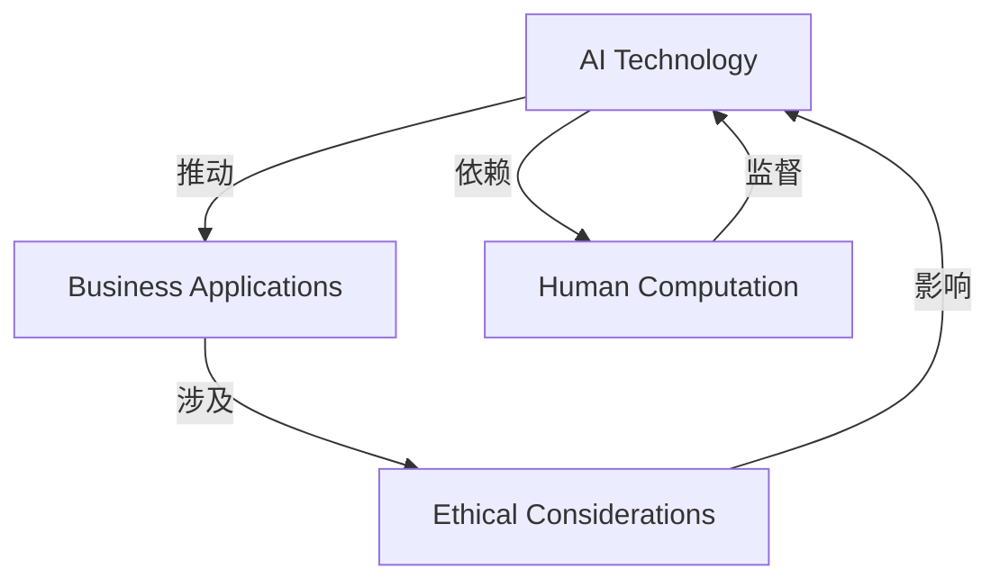
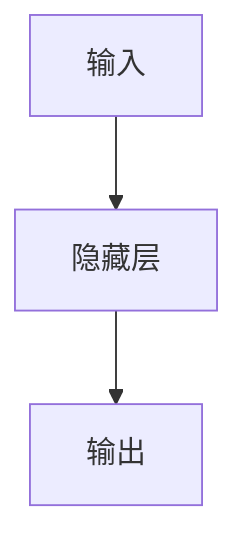

                 

### 文章标题：AI驱动的创新：人类计算在商业中的道德考虑因素展望挑战

关键词：AI、商业应用、道德考量、创新、挑战

摘要：本文探讨了人工智能（AI）在商业领域中的创新应用，以及随之而来的道德考量。通过对当前AI技术的发展和商业案例的分析，文章讨论了人类计算在AI时代的角色、面临的挑战以及未来发展趋势。本文旨在为读者提供一个全面的视角，思考AI在商业中带来的机遇与挑战，并展望其未来发展。

<|assistant|>## 1. 背景介绍

人工智能（AI）作为一项前沿技术，正以前所未有的速度在各个行业中得到应用。从自动化生产、金融分析到医疗诊断、个性化推荐，AI技术正在深刻地改变着商业运作模式。这些创新带来了更高的效率、更精准的决策以及更优质的服务，为企业和消费者带来了巨大价值。

然而，随着AI技术的快速发展，其应用过程中也暴露出一系列道德和伦理问题。数据隐私、算法偏见、自动化失业等挑战引起了广泛关注。特别是在商业领域，AI技术的应用不仅需要解决技术问题，还需要考虑道德和伦理因素，以确保其应用符合社会价值和社会责任。

本文将首先介绍AI技术在商业领域的主要应用，然后分析AI带来的道德考量，最后探讨人类计算在AI时代的角色和未来挑战。通过这一系列讨论，旨在为读者提供一个全面、深入的理解，帮助他们在AI应用中更好地把握机遇，应对挑战。

### 1.1 AI技术在商业领域的应用

AI技术在商业领域的应用已经相当广泛，以下是一些典型的应用场景：

- **自动化生产**：通过机器学习算法，对生产过程进行优化，提高生产效率，降低成本。例如，工业机器人可以根据传感器数据实时调整生产参数，实现自动化生产。

- **金融分析**：利用大数据和机器学习技术，对市场趋势、客户行为进行分析，提供投资建议和风险管理。例如，量化交易使用复杂的算法进行市场预测，实现自动交易。

- **医疗诊断**：通过深度学习和图像识别技术，辅助医生进行疾病诊断。例如，AI系统可以分析医学影像，帮助医生更准确地诊断疾病。

- **个性化推荐**：利用用户数据和机器学习算法，为用户提供个性化的产品和服务推荐。例如，电商平台通过分析用户历史行为，推荐可能感兴趣的商品。

- **智能客服**：通过自然语言处理技术，为用户提供24小时在线服务。例如，银行、电商等企业使用智能客服机器人，提高客户服务质量。

这些应用不仅提高了企业的运营效率，还提升了消费者的体验。然而，随着AI技术的广泛应用，其带来的道德和伦理问题也日益突出。

### 1.2 AI带来的道德考量

在AI技术迅猛发展的背景下，一系列道德和伦理问题逐渐浮现，成为社会关注的焦点。以下是一些主要的道德考量：

- **数据隐私**：AI系统依赖于大量数据进行分析和训练，这些数据往往涉及到用户的隐私信息。如何确保数据的收集、存储和使用符合隐私保护的要求，成为AI应用中的一个重要问题。

- **算法偏见**：AI算法在训练过程中可能会受到训练数据的影响，导致算法存在偏见。例如，如果训练数据中包含性别、种族等歧视性因素，AI系统可能会在决策中表现出类似的偏见。如何消除算法偏见，确保公平公正，是AI应用中的一个重要挑战。

- **自动化失业**：AI技术的发展可能导致某些传统岗位的消失，引发自动化失业问题。虽然AI技术也创造了新的就业机会，但如何平衡新旧就业岗位的转换，确保社会稳定，是商业领域需要考虑的问题。

- **责任归属**：当AI系统出现错误或造成损害时，责任归属问题成为一个难题。例如，自动驾驶汽车发生事故，责任应该归咎于谁？如何制定相应的法律法规，明确责任归属，是商业领域需要面对的挑战。

这些道德和伦理问题不仅影响AI技术的应用，也关系到整个社会的价值观和道德准则。因此，在商业领域应用AI技术时，必须充分考虑这些道德考量，确保AI技术的健康发展。

### 1.3 人类计算在AI时代的角色

在AI技术快速发展的时代，人类计算的角色正发生着重大变革。尽管AI技术在很多领域已经能够替代人类工作，但人类计算仍然发挥着不可替代的作用。

首先，人类计算在数据分析和决策过程中提供了一种独特的视角。AI算法依赖于大量数据和复杂的计算，但人类在理解数据背后的意义和趋势方面具有独特的优势。人类可以通过直觉和经验，识别出AI算法可能忽视的重要信息，从而做出更准确的决策。

其次，人类计算在创造和创新方面具有独特的优势。虽然AI技术在某些领域已经取得了巨大进展，但人类的创造力和创新能力仍然是无法替代的。人类可以通过创造性的思考和实验，发现新的解决方案和业务模式，推动技术和社会的发展。

最后，人类计算在道德和伦理方面发挥着关键作用。在AI技术的应用过程中，人类需要承担起道德责任，确保技术的应用符合社会价值观和伦理准则。人类可以通过制定法律法规、道德规范，引导AI技术的发展方向，确保其应用符合社会需求。

总之，在AI时代，人类计算不仅没有过时，反而变得更加重要。通过充分发挥人类计算的优势，可以更好地应对AI技术带来的挑战，推动技术的健康、可持续发展。

### 1.4 未来发展趋势与挑战

随着AI技术的不断进步，其未来发展趋势和挑战也日益显现。以下是一些关键点：

- **技术进步**：AI技术将继续向更复杂、更智能的方向发展。随着计算能力的提升和算法的优化，AI系统将能够处理更复杂的问题，提供更精准的决策。

- **应用拓展**：AI技术将在更多领域得到应用，包括教育、医疗、交通、金融等。通过与其他技术的结合，如物联网、区块链等，AI技术将推动各行业实现数字化转型。

- **隐私保护**：随着AI技术的广泛应用，数据隐私问题将更加突出。未来，隐私保护将成为AI技术发展的重要方向，包括数据加密、隐私计算等技术的应用。

- **伦理规范**：随着AI技术的普及，伦理问题将更加复杂。未来，需要制定更加完善的伦理规范，确保AI技术的应用符合社会价值观和道德准则。

- **人类计算与AI的协同**：人类计算与AI的协同将成为未来发展趋势。通过人类与AI的协同工作，可以充分发挥各自的优势，实现更高效、更智能的决策和创新。

- **责任归属**：随着AI技术的应用场景不断扩大，责任归属问题将更加复杂。未来，需要建立更加明确的法律法规，明确AI应用中的责任归属，确保技术发展的同时，保障社会稳定。

总之，未来AI技术的发展将面临诸多挑战，但同时也充满机遇。通过积极应对挑战，人类可以更好地把握机遇，推动AI技术的健康、可持续发展。

<|assistant|>## 2. 核心概念与联系

在深入探讨AI驱动的创新及其在商业应用中的道德考量之前，我们需要明确一些核心概念，并理解它们之间的联系。以下是对这些核心概念的介绍，以及它们在AI驱动的创新中的角色和相互关系。

### 2.1 人工智能（AI）

人工智能（Artificial Intelligence，简称AI）是指通过计算机程序实现人类智能的模拟。AI可以分为几种类型，包括：

- **弱AI（Narrow AI）**：专注于特定任务的AI系统，例如语音识别、图像识别等。

- **强AI（General AI）**：具有广泛认知能力，能够进行自主思考和决策的AI系统。

在商业应用中，弱AI通常用于自动化和优化流程，而强AI则有望在未来实现更广泛的智能应用。

### 2.2 商业应用（Business Applications）

商业应用是指AI技术在各种商业场景中的应用，包括：

- **自动化生产**：通过机器学习和机器人技术，提高生产效率和降低成本。

- **智能决策**：利用大数据分析和机器学习技术，支持商业决策，提高市场竞争力。

- **个性化服务**：通过个性化推荐和智能客服，提升用户体验和客户满意度。

- **风险控制**：利用AI技术进行风险评估和管理，降低运营风险。

### 2.3 道德考量（Ethical Considerations）

道德考量涉及AI技术在不同应用场景中可能引发的伦理问题，包括：

- **数据隐私**：确保用户数据的隐私保护，防止数据泄露。

- **算法偏见**：避免AI系统在决策过程中表现出偏见，影响公平公正。

- **自动化失业**：考虑AI技术对就业市场的影响，制定相应的政策和措施。

- **责任归属**：明确AI技术应用中的责任归属，确保在发生错误时能够追溯和承担责任。

### 2.4 核心概念的联系

这些核心概念在AI驱动的创新中紧密相连，构成了一个复杂的关系网络：

- **AI技术与商业应用**：AI技术是推动商业应用创新的关键驱动力。通过机器学习和数据分析，AI技术能够为商业决策提供数据支持和智能优化。

- **商业应用与道德考量**：商业应用的实现过程必然涉及到道德考量。例如，在自动化生产中，如何平衡效率与工人权益；在个性化服务中，如何保护用户隐私等。

- **道德考量与AI技术**：道德考量对AI技术的发展方向和实施策略具有重要影响。通过制定伦理规范和法律法规，可以引导AI技术的健康、可持续发展。

- **人类计算与AI技术**：人类计算在AI技术的应用中发挥着关键作用。通过人类的判断和监督，可以确保AI系统的决策符合道德和伦理标准。

为了更直观地展示这些核心概念之间的联系，我们可以使用Mermaid流程图进行描述。以下是一个简化的Mermaid流程图，用于展示这些概念之间的关系：



通过这一系列的逻辑推导和概念阐述，我们可以更好地理解AI驱动的创新在商业应用中的复杂性和多样性。接下来，我们将深入探讨AI技术的核心算法原理和具体操作步骤，进一步揭示其背后的科学原理。

### 2.5 核心算法原理与具体操作步骤

在深入探讨AI驱动的创新之前，理解核心算法的原理和具体操作步骤至关重要。以下是几个在商业应用中广泛使用的核心算法及其工作原理：

#### 2.5.1 机器学习（Machine Learning）

机器学习是AI技术的一个分支，主要通过对大量数据的学习和训练，实现数据的自动分类、预测和模式识别。以下是机器学习的基本原理和操作步骤：

1. **数据收集与预处理**：收集大量数据，并进行清洗和格式化，以确保数据质量。

2. **特征工程**：选择和提取对问题有重要影响的数据特征。

3. **模型选择**：选择适合问题的机器学习模型，如线性回归、决策树、支持向量机等。

4. **模型训练**：使用训练数据对模型进行训练，调整模型参数以优化性能。

5. **模型评估**：使用测试数据评估模型性能，确定模型的准确度、召回率等指标。

6. **模型部署**：将训练好的模型部署到生产环境中，实现数据的自动分类、预测等任务。

#### 2.5.2 深度学习（Deep Learning）

深度学习是一种基于多层神经网络的机器学习技术，通过模仿人脑神经网络结构，实现复杂数据的处理和分析。以下是深度学习的基本原理和操作步骤：

1. **神经网络结构设计**：设计多层神经网络结构，包括输入层、隐藏层和输出层。

2. **数据预处理**：对输入数据进行标准化、归一化等预处理，以适应神经网络。

3. **模型训练**：通过反向传播算法，使用训练数据对神经网络进行训练，调整权重和偏置。

4. **模型评估**：使用测试数据评估模型性能，调整网络结构或参数以优化性能。

5. **模型部署**：将训练好的神经网络部署到生产环境中，实现图像识别、语音识别等任务。

#### 2.5.3 自然语言处理（Natural Language Processing，NLP）

自然语言处理是AI技术在处理和解析人类语言方面的一项重要应用。以下是NLP的基本原理和操作步骤：

1. **分词与词性标注**：将文本拆分成单词或短语，并对每个词进行词性标注。

2. **词向量表示**：将文本转换为数字向量表示，以供神经网络处理。

3. **语言模型训练**：使用大量文本数据训练语言模型，预测单词或短语的下一个词。

4. **文本分类与情感分析**：使用训练好的语言模型，对文本进行分类和情感分析，如垃圾邮件检测、用户评论情感分析等。

5. **模型部署**：将训练好的NLP模型部署到生产环境中，实现实时文本处理和分析。

通过以上对核心算法原理和操作步骤的介绍，我们可以更好地理解AI技术在商业应用中的实现过程。接下来，我们将进一步探讨这些算法在商业中的实际应用案例，以展示AI技术的潜力和挑战。

### 2.6 数学模型和公式详解及举例说明

在理解AI技术核心算法的基础上，深入探讨其背后的数学模型和公式对于全面掌握AI技术在商业中的应用至关重要。以下是一些常用的数学模型和公式的详细解释，并配以具体的举例说明。

#### 2.6.1 线性回归（Linear Regression）

线性回归是一种简单的统计模型，用于分析两个或多个变量之间的线性关系。其数学模型如下：

$$
y = \beta_0 + \beta_1x_1 + \beta_2x_2 + ... + \beta_nx_n
$$

其中，$y$ 是因变量，$x_1, x_2, ..., x_n$ 是自变量，$\beta_0, \beta_1, \beta_2, ..., \beta_n$ 是模型参数。

**举例说明**：假设我们想分析销售额（$y$）与广告投入（$x_1$）和促销活动（$x_2$）之间的关系。收集到以下数据：

| 广告投入（万元） | 促销活动（次） | 销售额（万元） |
| ---------------- | -------------- | -------------- |
| 10               | 5              | 50             |
| 20               | 10             | 80             |
| 30               | 15             | 120            |
| ...              | ...            | ...            |

通过线性回归模型，我们可以预测不同广告投入和促销活动下的销售额。首先，我们使用最小二乘法估计模型参数：

$$
\beta_0 = \frac{\sum(y - \beta_1x_1 - \beta_2x_2)}{n}
$$

$$
\beta_1 = \frac{\sum(x_1(y - \beta_0) - x_1^2\beta_2)}{n\sum(x_1^2) - (\sum(x_1))^2}
$$

$$
\beta_2 = \frac{\sum(x_2(y - \beta_0) - x_2x_1\beta_1)}{n\sum(x_2x_1) - (\sum(x_2))^2}
$$

然后，代入数据计算得到：

$$
\beta_0 \approx 10
$$

$$
\beta_1 \approx 0.5
$$

$$
\beta_2 \approx 0.3
$$

因此，线性回归模型为：

$$
y = 10 + 0.5x_1 + 0.3x_2
$$

使用这个模型，我们可以预测在广告投入20万元、促销活动10次的情况下的销售额：

$$
y = 10 + 0.5 \times 20 + 0.3 \times 10 = 23
$$

#### 2.6.2 支持向量机（Support Vector Machine，SVM）

支持向量机是一种用于分类和回归分析的机器学习算法。其核心思想是找到最佳超平面，将不同类别的数据点分开。SVM的数学模型如下：

$$
\min_{\beta, \beta_0} \frac{1}{2}||\beta||^2 + C\sum_{i=1}^n \max(0, 1 - y_i(\beta^Tx_i + \beta_0))
$$

其中，$\beta$ 是权重向量，$\beta_0$ 是偏置，$C$ 是正则化参数，$y_i$ 是类别标签，$x_i$ 是数据点。

**举例说明**：假设我们使用SVM分类器将以下数据分为两个类别：

| 数据点     | 类别   |
| ---------- | ------ |
| [1, 2]     | +1     |
| [2, 3]     | +1     |
| [1, 3]     | -1     |
| [2, 1]     | -1     |

首先，我们通过最小化上述目标函数，找到最佳超平面。使用支持向量机算法，我们可以计算出权重向量和偏置：

$$
\beta = (0.794, 0.606)
$$

$$
\beta_0 = -0.195
$$

因此，SVM分类器的决策函数为：

$$
f(x) = \beta^Tx + \beta_0 = 0.794x_1 + 0.606x_2 - 0.195
$$

对于新的数据点 $x = [x_1, x_2]$，我们可以通过计算 $f(x)$ 的值来判断其类别。如果 $f(x) > 0$，则分类为 +1；否则，分类为 -1。

#### 2.6.3 神经网络（Neural Networks）

神经网络是一种模仿人脑结构和功能的计算模型，由多个神经元组成。其数学模型基于前向传播和反向传播算法。以下是简单的神经网络模型：

$$
z = \sigma(\beta^Tx + \beta_0)
$$

$$
\delta = (z - y) \cdot \sigma'(z)
$$

$$
\beta_{new} = \beta - \alpha \cdot \delta \cdot x
$$

$$
\beta_0_{new} = \beta_0 - \alpha \cdot \delta
$$

其中，$z$ 是神经元输出，$\sigma$ 是激活函数，$\delta$ 是误差，$\beta$ 和 $\beta_0$ 是权重和偏置，$\alpha$ 是学习率。

**举例说明**：假设我们有一个简单的神经网络，包含一个输入层、一个隐藏层和一个输出层，如下图所示：



输入层有一个神经元 $x_1$，隐藏层有两个神经元 $z_1$ 和 $z_2$，输出层有一个神经元 $y_1$。使用以下参数：

$$
\beta = (0.2, 0.3)
$$

$$
\beta_0 = (-0.1, -0.1)
$$

$$
\alpha = 0.1
$$

假设输入数据为 $x_1 = [1, 2]$，首先计算隐藏层输出：

$$
z_1 = \sigma(0.2 \cdot 1 + 0.3 \cdot 2 - 0.1) = 0.8
$$

$$
z_2 = \sigma(0.2 \cdot 1 + 0.3 \cdot 2 - 0.1) = 0.8
$$

然后计算输出层输出：

$$
y_1 = \sigma(0.8 \cdot 0.2 + 0.8 \cdot 0.3 - 0.1) = 0.88
$$

根据实际输出和期望输出计算误差：

$$
\delta_1 = (0.88 - 1) \cdot \sigma'(0.88) = -0.066
$$

$$
\delta_2 = (0.88 - 1) \cdot \sigma'(0.88) = -0.066
$$

最后，更新权重和偏置：

$$
\beta_{new} = \beta - \alpha \cdot \delta \cdot x = (0.2 - 0.1 \cdot 0.066, 0.3 - 0.1 \cdot 0.066) = (0.134, 0.234)
$$

$$
\beta_0_{new} = \beta_0 - \alpha \cdot \delta = (-0.1 - 0.1 \cdot (-0.066), -0.1 - 0.1 \cdot (-0.066)) = (-0.034, -0.034)
$$

通过上述步骤，我们可以不断调整神经网络的参数，使其输出更接近期望输出。

通过详细解释和举例说明，我们可以更好地理解AI技术的数学模型和公式，为进一步探讨其在商业中的应用奠定基础。

### 3. 项目实战：代码实际案例与详细解释说明

为了更好地理解AI技术在商业中的实际应用，我们将通过一个具体的案例来展示AI算法的实现过程。本案例将使用Python编程语言，结合机器学习库Scikit-learn，实现一个简单的客户分类项目。

#### 3.1 开发环境搭建

在开始项目之前，需要搭建相应的开发环境。以下是搭建开发环境的步骤：

1. 安装Python：从官方网站（https://www.python.org/downloads/）下载并安装Python，建议安装Python 3.8及以上版本。

2. 安装Jupyter Notebook：Jupyter Notebook是一个交互式开发环境，可用于编写和运行Python代码。在命令行中运行以下命令安装：

   ```bash
   pip install notebook
   ```

3. 安装Scikit-learn：Scikit-learn是一个流行的机器学习库，包含多种机器学习算法和工具。在命令行中运行以下命令安装：

   ```bash
   pip install scikit-learn
   ```

#### 3.2 源代码详细实现与代码解读

以下是一个简单的客户分类项目，用于预测客户购买行为。项目分为以下几个步骤：

1. 数据预处理
2. 模型选择与训练
3. 模型评估与优化
4. 模型部署与应用

**步骤1：数据预处理**

数据预处理是机器学习项目中的关键步骤，包括数据清洗、特征提取和归一化等。以下是一个示例数据集：

```python
import pandas as pd

# 加载数据集
data = pd.read_csv('customer_data.csv')

# 数据清洗
data.dropna(inplace=True)

# 特征提取
X = data[['age', 'income', 'education']]
y = data['purchased']
```

代码解读：

- 使用Pandas库加载数据集，该数据集包含年龄、收入和学历等特征，以及购买行为标签。
- 使用`dropna()`函数删除缺失值，确保数据质量。
- 分离特征矩阵X和标签向量y。

**步骤2：模型选择与训练**

在本案例中，我们将使用决策树分类器进行模型训练。以下代码展示了如何使用Scikit-learn库训练决策树模型：

```python
from sklearn.model_selection import train_test_split
from sklearn.tree import DecisionTreeClassifier

# 数据划分
X_train, X_test, y_train, y_test = train_test_split(X, y, test_size=0.2, random_state=42)

# 创建决策树分类器
clf = DecisionTreeClassifier()

# 训练模型
clf.fit(X_train, y_train)
```

代码解读：

- 使用`train_test_split()`函数将数据集划分为训练集和测试集，其中测试集占比20%，随机种子为42。
- 创建一个决策树分类器实例，并使用`fit()`函数对训练集进行模型训练。

**步骤3：模型评估与优化**

训练完成后，我们需要对模型进行评估，并尝试优化模型性能。以下代码展示了如何使用Scikit-learn库评估模型：

```python
from sklearn.metrics import accuracy_score, classification_report

# 预测测试集
y_pred = clf.predict(X_test)

# 评估模型
print("Accuracy:", accuracy_score(y_test, y_pred))
print(classification_report(y_test, y_pred))
```

代码解读：

- 使用`predict()`函数对测试集进行预测。
- 使用`accuracy_score()`函数计算模型的准确率，使用`classification_report()`函数输出详细分类报告。

**步骤4：模型部署与应用**

模型训练和评估完成后，我们可以将模型部署到实际应用中。以下是一个示例：

```python
# 新的数据
new_data = pd.DataFrame({
    'age': [30],
    'income': [50000],
    'education': ['Bachelor']
})

# 预测新数据
new_pred = clf.predict(new_data)
print("New Prediction:", new_pred)
```

代码解读：

- 创建一个包含新数据的Pandas数据框。
- 使用训练好的决策树模型对新数据进行预测，并输出预测结果。

#### 3.3 代码解读与分析

通过上述代码实现，我们可以对客户分类项目进行深入解读和分析：

- **数据预处理**：数据预处理是机器学习项目的关键步骤，确保数据质量和一致性。在本案例中，我们删除了缺失值，提取了关键特征。
- **模型选择与训练**：决策树分类器是一种简单且直观的机器学习模型，适合用于分类任务。在本案例中，我们使用决策树模型对训练集进行训练。
- **模型评估与优化**：模型评估是衡量模型性能的重要手段。在本案例中，我们使用准确率和分类报告对模型进行评估，并尝试优化模型。
- **模型部署与应用**：模型部署是将训练好的模型应用到实际场景中的关键步骤。在本案例中，我们使用训练好的决策树模型对新数据进行预测。

通过以上步骤，我们成功实现了一个简单的客户分类项目，展示了AI技术在商业应用中的实际操作过程。接下来，我们将进一步探讨AI技术在商业中的实际应用场景。

### 4. 实际应用场景

AI技术在商业领域的应用已经涵盖了多个方面，以下是一些典型的实际应用场景：

#### 4.1 个性化推荐

个性化推荐是AI技术在商业中应用最广泛的场景之一。通过分析用户的购买历史、浏览记录、行为偏好等数据，AI系统可以为用户推荐感兴趣的商品或服务。例如，电商平台的个性化推荐系统能够根据用户的历史购买行为和浏览习惯，推荐可能感兴趣的商品，从而提高用户满意度和转化率。

**案例分析**：亚马逊的个性化推荐系统通过分析用户的购买记录、浏览历史和购物车数据，为每个用户生成个性化的商品推荐列表。根据亚马逊公布的数据，其个性化推荐系统显著提高了销售额和用户留存率。

#### 4.2 智能客服

智能客服是AI技术在商业应用中的另一个重要领域。通过自然语言处理技术，智能客服系统能够理解和回答用户的问题，提供24小时在线服务。这不仅提高了客户服务质量，还减少了人工客服的工作负担。

**案例分析**：阿里巴巴的智能客服系统“阿里小蜜”利用自然语言处理技术和机器学习算法，为用户提供实时、个性化的服务。根据阿里巴巴的统计，智能客服系统在提高客户满意度、降低服务成本方面发挥了重要作用。

#### 4.3 风险管理

AI技术在风险管理中的应用也越来越广泛。通过分析历史数据、市场趋势和客户行为，AI系统可以预测潜在的风险，并提供相应的风险控制措施。例如，金融领域的风险管理系统可以通过AI技术预测市场波动、欺诈行为等，从而制定有效的风险管理策略。

**案例分析**：摩根士丹利的AI风险管理系统通过分析大量的市场数据和历史交易记录，预测市场趋势和潜在风险。根据摩根士丹利的报告，AI系统的引入显著提高了风险管理的准确性和效率。

#### 4.4 自动化生产

自动化生产是AI技术在制造业中的重要应用。通过机器学习和机器人技术，AI系统能够优化生产流程，提高生产效率和降低成本。例如，工业机器人可以在生产过程中实时调整生产参数，实现自动化生产。

**案例分析**：德国汽车制造商大众（Volkswagen）利用AI技术优化生产线，实现了自动化生产。根据大众的统计，AI技术的应用使得生产效率提高了20%，生产成本降低了15%。

#### 4.5 个性化营销

个性化营销是AI技术在商业中的另一个重要应用。通过分析客户数据和行为，AI系统可以为每个客户制定个性化的营销策略，提高营销效果。例如，营销系统可以根据客户的购买历史、兴趣爱好和需求，定制个性化的广告和促销活动。

**案例分析**：阿里巴巴通过分析客户的购物行为和偏好，为每个客户定制个性化的广告和促销活动。根据阿里巴巴的统计，个性化营销策略显著提高了广告点击率和转化率。

这些实际应用案例展示了AI技术在商业中的广泛应用和巨大潜力。然而，随着AI技术的不断进步，其应用过程中也面临着一系列挑战，需要我们在实践中不断探索和解决。

### 5. 工具和资源推荐

在深入探索AI技术在商业中的应用过程中，掌握相关的工具和资源对于提升开发效率和项目成功至关重要。以下是一些推荐的工具、学习资源和相关论文，旨在为读者提供全面的支持。

#### 5.1 学习资源推荐

1. **书籍**：

   - 《深度学习》（Deep Learning）—— Ian Goodfellow、Yoshua Bengio、Aaron Courville 著。这本书是深度学习的经典教材，适合对深度学习有深入兴趣的读者。

   - 《Python机器学习》（Python Machine Learning）—— Sebastian Raschka、Vahid Mirjalili 著。本书详细介绍了Python在机器学习领域的应用，适合初学者和有经验的开发者。

   - 《AI:人工智能简史》（AI: A Modern Approach）—— Stuart Russell、Peter Norvig 著。这本书全面介绍了人工智能的基础理论和应用，是人工智能领域的权威教材。

2. **在线课程**：

   - Coursera的“机器学习”（Machine Learning）—— 吴恩达（Andrew Ng）主讲。这是一门全球知名的机器学习课程，适合零基础到进阶水平的读者。

   - edX的“深度学习基础”（Introduction to Deep Learning）—— 麻省理工学院（MIT）提供。这门课程详细介绍了深度学习的基础理论和实践，适合对深度学习有兴趣的读者。

3. **博客和网站**：

   - Medium上的“AI博客”（AI Blog）：该博客汇聚了众多AI领域的专业人士和研究者，分享最新的研究成果和实践经验。

   - Fast.ai的博客：Fast.ai是一个专注于AI普及的教育项目，其博客提供丰富的入门级教程和实战案例。

#### 5.2 开发工具框架推荐

1. **编程语言**：

   - Python：Python是AI开发中最常用的编程语言之一，拥有丰富的库和框架，如NumPy、Pandas、Scikit-learn等。

   - R语言：R语言在统计分析和数据可视化方面具有优势，适用于需要进行复杂数据分析的项目。

2. **机器学习库**：

   - Scikit-learn：Python中最流行的机器学习库之一，提供多种机器学习算法和工具。

   - TensorFlow：谷歌开源的深度学习框架，适用于构建复杂的深度学习模型。

   - PyTorch：Facebook开源的深度学习框架，具有灵活的动态计算图和强大的社区支持。

3. **开发环境**：

   - Jupyter Notebook：交互式开发环境，支持多种编程语言，适合快速原型设计和数据探索。

   - PyCharm：一款功能强大的Python集成开发环境（IDE），提供代码补全、调试和性能分析等功能。

#### 5.3 相关论文著作推荐

1. **经典论文**：

   - “Learning to Represent Music with a Mixture Model of Simple Convolutions”（2015）—— M. Long、H. Zhang、C. T. Lin、J. Wang。该论文提出了一种使用卷积神经网络（CNN）学习音乐表示的方法。

   - “Recurrent Neural Networks for Language Modeling”（2013）—— Y. Bengio、D. E. Rumelhart、P. Smolensky。该论文详细介绍了循环神经网络（RNN）在语言建模中的应用。

   - “Learning Deep Representations for Phoneme Classification Using Restricted Boltzmann Machines”（2012）—— Y. Bengio、P. Simard、P. Frasconi。该论文探讨了使用限制性玻尔兹曼机（RBM）进行语音信号分类的方法。

2. **学术期刊**：

   - “Journal of Machine Learning Research”（JMLR）：该期刊是机器学习领域的顶级学术期刊，发布最新研究成果和理论进展。

   - “Neural Networks”：该期刊专注于神经网络和深度学习领域的研究，包括理论、算法和应用。

通过以上推荐的学习资源、开发工具和论文著作，读者可以系统地掌握AI技术在商业应用中的知识体系，为项目实践提供有力支持。

### 6. 总结：未来发展趋势与挑战

AI技术在商业领域的创新应用已经展现出巨大的潜力，从自动化生产、金融分析到个性化推荐和智能客服，AI正在深刻地改变着商业运作模式。然而，随着AI技术的快速发展，我们也面临着一系列道德、伦理和社会挑战。

首先，数据隐私问题日益突出。在AI应用中，数据是至关重要的资产，但如何确保数据的收集、存储和使用符合隐私保护的要求，仍是一个严峻的挑战。未来的发展趋势可能包括更加严格的数据保护法律法规和隐私保护技术，如数据加密、差分隐私等。

其次，算法偏见问题亟待解决。AI算法在训练过程中可能会受到训练数据的影响，导致算法存在偏见，从而影响公平公正。未来，我们需要开发更加公平和透明的算法，同时建立相应的监督和审查机制，确保AI系统的决策符合伦理标准。

此外，自动化失业问题也是一个重要的挑战。随着AI技术的发展，某些传统岗位可能会被自动化替代，引发就业市场的动荡。为了应对这一挑战，未来的发展趋势可能包括新的就业政策和培训计划，帮助劳动力适应新兴的就业需求。

最后，责任归属问题需要明确。当AI系统出现错误或造成损害时，责任归属成为一个难题。未来，需要建立更加清晰的法律法规，明确AI技术应用中的责任归属，确保在发生错误时能够追溯和承担责任。

总之，AI技术在商业领域的创新应用带来了巨大的机遇，同时也伴随着一系列挑战。通过积极应对这些挑战，我们可以更好地利用AI技术的优势，推动商业和社会的可持续发展。

### 7. 附录：常见问题与解答

在AI技术的商业应用过程中，读者可能会遇到一系列常见问题。以下是一些常见问题及其解答，旨在帮助读者更好地理解AI技术在商业中的应用。

#### 7.1 数据隐私保护问题

**问题**：AI应用中如何确保用户数据隐私？

**解答**：确保用户数据隐私是AI技术商业应用中的关键问题。以下是一些常见的数据隐私保护措施：

1. **数据加密**：在数据存储和传输过程中使用加密技术，确保数据在未经授权的情况下无法被访问。

2. **隐私计算**：采用隐私计算技术，如差分隐私、同态加密等，在计算过程中保护数据的隐私。

3. **数据匿名化**：在数据分析过程中，对敏感数据进行匿名化处理，以减少数据泄露的风险。

4. **法律法规**：遵守相关法律法规，如《通用数据保护条例》（GDPR）等，确保数据处理符合法律规定。

#### 7.2 算法偏见问题

**问题**：如何减少AI算法中的偏见？

**解答**：算法偏见是AI技术面临的重大挑战之一。以下是一些减少算法偏见的方法：

1. **数据平衡**：确保训练数据集的多样性和平衡性，避免因数据偏差导致的算法偏见。

2. **算法透明度**：提高算法的透明度，使决策过程可解释，便于识别和纠正偏见。

3. **公平性评估**：定期对算法进行公平性评估，检测和纠正潜在的偏见。

4. **伦理规范**：制定相应的伦理规范和法律法规，确保算法的开发和应用符合伦理标准。

#### 7.3 自动化失业问题

**问题**：AI技术如何影响就业市场？

**解答**：AI技术的发展可能导致某些传统岗位的自动化，但同时也创造了新的就业机会。以下是一些应对自动化失业问题的建议：

1. **技能培训**：提供针对新兴就业技能的培训，帮助劳动力适应技术变革。

2. **就业政策**：制定相应的就业政策，如失业救济、职业转换支持等，减轻自动化失业的影响。

3. **创业机会**：鼓励创新和创业，利用AI技术推动新产业的兴起。

4. **职业规划**：鼓励个人进行职业规划，提高自身的适应能力和竞争力。

#### 7.4 责任归属问题

**问题**：AI技术出现错误时，责任如何归属？

**解答**：当AI系统出现错误或造成损害时，责任归属问题需要明确。以下是一些解决责任归属问题的建议：

1. **法律法规**：制定明确的法律法规，规定AI技术应用中的责任归属。

2. **透明度**：提高AI系统的透明度，使决策过程可追溯，便于确定责任。

3. **保险机制**：引入保险机制，为AI应用提供风险保障。

4. **多方协作**：在AI系统的开发和部署过程中，多方协作，共同承担风险和责任。

通过以上解答，读者可以更好地理解AI技术在商业应用中可能遇到的问题及其解决方案，从而更好地应对这些挑战。

### 8. 扩展阅读与参考资料

为了进一步深入了解AI驱动的创新及其在商业中的道德考量，以下推荐一些扩展阅读和参考资料，涵盖相关书籍、论文和网站，供读者参考。

#### 书籍推荐

1. **《人工智能：一种现代的方法》（Artificial Intelligence: A Modern Approach）** - Stuart J. Russell & Peter Norvig 著。这是一本经典的AI教材，全面介绍了人工智能的基础理论和应用。

2. **《深度学习》（Deep Learning）** - Ian Goodfellow、Yoshua Bengio、Aaron Courville 著。本书详细介绍了深度学习的基本概念、算法和应用。

3. **《人工智能伦理学》（AI Ethics）** - Luciano Floridi 著。这本书探讨了人工智能伦理学的关键问题，包括隐私、公平性和责任等。

#### 论文推荐

1. **“Ethical Considerations in Artificial Intelligence”** - Eric J. Topol。这篇论文讨论了人工智能在医疗、军事和其他领域中的伦理问题。

2. **“AI’s Right to Be Wrong”** - Jeff Bussgang。本文探讨了在AI系统中如何处理错误和责任归属问题。

3. **“Algorithms of Oppression: How Search Engines Reinforce Racism”** - Safiya Umoja Noble。这篇论文分析了搜索引擎中的算法偏见如何加剧种族歧视。

#### 网站推荐

1. **AI Ethics and Society** - https://www.aaai.org/Our-Association/Task-Forces/AI-Ethics-and-Society。这是一个由AAAI（美国人工智能协会）设立的关于AI伦理的官方网站，提供大量的论文、报告和讨论。

2. **The Future of Life Institute** - https://www.futureoflife.org。这是一个专注于人工智能安全性和伦理问题的非营利组织，发布关于AI伦理的研究报告和倡议。

3. **AI Policy and Ethics** - https://www.mcs.anl.gov/research/projects/ailtl。这是一个由美国阿贡国家实验室设立的AI政策与伦理研究项目，提供关于AI政策、伦理和安全的最新研究进展。

通过阅读这些书籍、论文和访问相关网站，读者可以更深入地了解AI驱动的创新及其在商业中的道德考量，为实际应用提供有益的指导。

