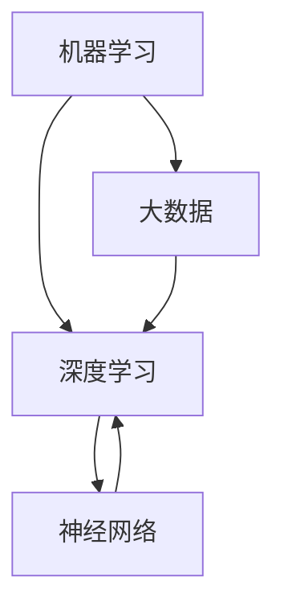

                 

### 背景介绍

随着人工智能（AI）技术的飞速发展，越来越多的领域开始利用AI进行创新。在过去的几十年里，计算机科学经历了从单纯的计算到智能计算的重大转变。如今，AI已经成为推动创新的重要力量，无论是在工业制造、医疗服务、金融分析，还是在日常生活，AI的应用场景越来越广泛。

本文旨在探讨AI驱动的创新在人类计算中的未来工作，分析AI与人类计算之间的相互作用，以及它们对未来工作环境的影响。首先，我们将回顾AI技术的发展历程，理解其核心概念和原理。然后，我们将探讨AI在人类计算中的应用，并详细解释一些核心算法和数学模型。最后，我们将通过实际项目案例来展示AI的实际应用，并讨论未来的发展趋势和挑战。

关键词：人工智能、创新、人类计算、未来工作

### AI的发展历程

人工智能（Artificial Intelligence，简称AI）是一个涉及计算机科学、数学、认知科学和神经科学等多个领域的交叉学科。其历史可以追溯到20世纪50年代，当时计算机科学家艾伦·图灵（Alan Turing）提出了著名的图灵测试，作为衡量机器是否具有智能的标准。图灵测试要求一个人类评判者通过对话来判断对话的另一端是机器还是人。

在图灵测试的基础上，早期的AI研究主要集中在逻辑推理和符号计算上。1956年，达特茅斯会议（Dartmouth Conference）被认为是AI领域的诞生日，会议上，一群计算机科学家和数学家首次系统地探讨了人工智能的可能性。尽管当时的计算资源极为有限，但这标志着AI作为一个研究领域的诞生。

随着时间的推移，AI技术逐渐成熟，经历了多个阶段的发展。20世纪80年代，专家系统（Expert Systems）成为AI研究的热点。专家系统是一种模拟人类专家决策能力的计算机程序，它们在医学诊断、金融分析等领域取得了显著的成功。

然而，专家系统的局限性也逐渐显现。由于它们依赖于大量的规则和知识库，专家系统的可扩展性和适应性较差。此外，规则的不完备性和矛盾性也导致了专家系统在实际应用中的许多问题。

进入21世纪，随着计算能力的提升和大数据技术的发展，机器学习（Machine Learning）和深度学习（Deep Learning）成为AI研究的新热点。机器学习通过从数据中自动学习规律和模式，使得计算机能够进行预测和决策。而深度学习则是机器学习的一个子领域，它通过模拟人脑神经网络结构，实现了在图像识别、语音识别、自然语言处理等领域的突破性进展。

如今，AI已经渗透到我们生活的方方面面，从智能手机的语音助手到自动驾驶汽车，从金融风控到医疗诊断，AI的应用场景越来越广泛。这一系列的发展使得AI不仅仅是计算机科学的一个研究领域，更成为推动社会进步和经济发展的重要力量。

### 核心概念与联系

在深入探讨AI驱动的创新之前，有必要明确几个核心概念和它们之间的联系。这些概念包括机器学习（Machine Learning）、深度学习（Deep Learning）、神经网络（Neural Networks）和大数据（Big Data）。以下是这些概念的定义及其相互关系：

**机器学习（Machine Learning）**：机器学习是AI的一个子领域，它侧重于开发算法，使计算机系统能够从数据中自动学习和改进性能，而无需显式编程。机器学习的核心目标是让计算机从历史数据中提取模式和知识，以便在新数据上进行预测或分类。

**深度学习（Deep Learning）**：深度学习是机器学习的一个分支，它依赖于多层神经网络的结构，以自动提取数据中的特征。深度学习的强大之处在于能够处理大量未标记的数据，并从中学习复杂的模式和特征。典型的深度学习模型包括卷积神经网络（CNN）和循环神经网络（RNN）。

**神经网络（Neural Networks）**：神经网络是模仿人脑神经元结构和功能的一种计算模型。神经网络由大量相互连接的节点（或称为神经元）组成，每个节点执行简单的计算并传递信息。通过训练，神经网络可以学会从输入数据中提取有用的特征，并在新的数据上进行预测。

**大数据（Big Data）**：大数据是指无法使用传统数据库工具进行捕捉、管理和处理的数据集，通常具有大量的数据量、高速的数据生成率、多种数据类型和复杂的存储需求。大数据技术包括数据存储、数据挖掘、数据分析等，它为机器学习和深度学习提供了丰富的数据资源。

这些概念之间的联系在于：

1. **机器学习依赖于大数据**：机器学习算法需要大量的数据进行训练，而大数据技术提供了高效的数据存储和处理能力，从而支持了机器学习算法的广泛应用。

2. **深度学习是机器学习的高级形式**：深度学习通过多层神经网络的结构，能够从数据中自动提取更复杂的特征，实现了在图像识别、语音识别等领域的突破性进展。

3. **神经网络是深度学习的基石**：神经网络作为深度学习的基础，通过多层节点间的连接和计算，实现了数据的自动特征提取和模式识别。

4. **大数据与神经网络结合**：大数据为神经网络提供了丰富的训练数据，使得神经网络能够学习到更加复杂和抽象的特征，从而提高了预测和分类的准确性。

为了更直观地理解这些概念，我们可以使用Mermaid流程图来展示它们之间的联系。以下是使用Mermaid绘制的流程图：



在这个流程图中，我们可以清晰地看到大数据是机器学习的基础，深度学习是机器学习的高级形式，而神经网络则是深度学习的核心组件。通过这个图，我们可以更好地理解AI的核心概念及其相互关系。

### 核心算法原理 & 具体操作步骤

在探讨AI在人类计算中的应用之前，有必要深入理解几个核心算法的原理和操作步骤。这些算法包括监督学习（Supervised Learning）、无监督学习（Unsupervised Learning）和强化学习（Reinforcement Learning）。以下是这些算法的基本原理和具体操作步骤：

**监督学习（Supervised Learning）**

监督学习是一种机器学习范式，它通过从已知输入和输出数据中学习，以便对未知数据进行预测。监督学习算法主要包括回归（Regression）和分类（Classification）两种类型。

1. **回归（Regression）**：回归分析用于预测连续值输出。常见的回归算法包括线性回归（Linear Regression）和多项式回归（Polynomial Regression）。

   - **线性回归（Linear Regression）**：线性回归模型试图找到输入变量和输出变量之间的线性关系。具体操作步骤如下：
     1. 数据收集：收集包含输入变量和输出变量的数据集。
     2. 数据预处理：对数据进行清洗、归一化等预处理操作，以便模型训练。
     3. 模型建立：使用线性回归算法建立模型，通过最小化损失函数（如均方误差）来调整模型的参数。
     4. 模型训练：使用训练数据集对模型进行训练，以调整模型参数。
     5. 模型评估：使用测试数据集评估模型性能，计算预测误差。

2. **分类（Classification）**：分类分析用于预测离散值输出。常见的分类算法包括逻辑回归（Logistic Regression）、决策树（Decision Tree）和支持向量机（Support Vector Machine，SVM）。

   - **逻辑回归（Logistic Regression）**：逻辑回归是一种概率型分类模型，用于预测二分类或多分类结果。具体操作步骤如下：
     1. 数据收集：收集包含输入变量和分类标签的数据集。
     2. 数据预处理：对数据进行清洗、归一化等预处理操作。
     3. 模型建立：使用逻辑回归算法建立模型，通过最大似然估计方法来估计模型参数。
     4. 模型训练：使用训练数据集对模型进行训练，以调整模型参数。
     5. 模型评估：使用测试数据集评估模型性能，计算预测准确率。

**无监督学习（Unsupervised Learning）**

无监督学习是一种机器学习范式，它没有已知的输出标签，主要关注数据内部的分布和结构。无监督学习算法包括聚类（Clustering）和降维（Dimensionality Reduction）等。

1. **聚类（Clustering）**：聚类算法用于将数据分为若干个群组，使得同一个群组内的数据相似度较高，而不同群组之间的数据相似度较低。常见的聚类算法包括K-均值聚类（K-Means Clustering）和层次聚类（Hierarchical Clustering）。

   - **K-均值聚类（K-Means Clustering）**：K-均值聚类是一种基于距离度量的聚类算法，通过迭代计算聚类中心和样本的相似度来实现聚类。具体操作步骤如下：
     1. 数据收集：收集未标记的数据集。
     2. 初始化：随机选择K个聚类中心。
     3. 分配：将每个数据点分配到距离最近的聚类中心。
     4. 更新：重新计算聚类中心，并重复分配步骤，直到聚类中心不再变化。
     5. 模型评估：计算聚类内部相似度和聚类间差异，评估聚类效果。

2. **降维（Dimensionality Reduction）**：降维算法用于降低数据维度，减少数据复杂性，同时保留数据的本质特征。常见的降维算法包括主成分分析（Principal Component Analysis，PCA）和t-SNE（t-Distributed Stochastic Neighbor Embedding）。

   - **主成分分析（PCA）**：PCA是一种线性降维方法，通过计算数据的协方差矩阵和特征值，选择最大的特征值对应的特征向量来构造新的特征空间。具体操作步骤如下：
     1. 数据收集：收集高维数据集。
     2. 数据标准化：对数据进行标准化处理，使其具有相同的尺度。
     3. 协方差矩阵计算：计算数据的协方差矩阵。
     4. 特征值和特征向量计算：计算协方差矩阵的特征值和特征向量。
     5. 主成分构造：选择最大的特征值对应的特征向量，构造新的特征空间。
     6. 数据降维：将原始数据映射到新的特征空间。

**强化学习（Reinforcement Learning）**

强化学习是一种通过不断试错和奖励机制来学习最优策略的机器学习范式。强化学习算法主要包括Q学习（Q-Learning）和深度Q网络（Deep Q-Network，DQN）。

1. **Q学习（Q-Learning）**：Q学习是一种基于值函数的强化学习算法，通过迭代更新策略值函数来优化决策。具体操作步骤如下：
   1. 初始状态：设定初始状态和动作集合。
   2. 策略初始化：初始化策略值函数。
   3. 迭代学习：对于每个状态，选择动作并更新策略值函数。
   4. 模型评估：通过评估指标（如回报累计值）评估模型性能。

2. **深度Q网络（DQN）**：DQN是一种基于神经网络的强化学习算法，通过深度神经网络来近似策略值函数。具体操作步骤如下：
   1. 初始状态：设定初始状态和动作集合。
   2. 网络初始化：初始化深度神经网络。
   3. 经验回放：将经历的状态和动作存储在经验回放池中。
   4. 迭代学习：从经验回放池中随机抽取样本，更新神经网络权重。
   5. 模型评估：通过评估指标（如回报累计值）评估模型性能。

通过以上对核心算法原理和具体操作步骤的详细介绍，我们可以更好地理解AI在人类计算中的应用。接下来，我们将进一步探讨这些算法在人类计算中的实际应用场景。

### 数学模型和公式 & 详细讲解 & 举例说明

在深入探讨AI算法的数学模型和公式之前，我们需要先了解一些基础的数学概念，如概率论、线性代数和微积分。这些概念构成了AI算法的数学基础，使得我们能够理解和实现复杂的算法。以下是几个关键数学概念及其在AI中的具体应用：

**概率论（Probability Theory）**

概率论是研究随机事件及其概率分布的数学分支。在AI中，概率论广泛应用于概率分布的建模、假设检验、随机梯度下降（Stochastic Gradient Descent，SGD）等。

1. **概率分布（Probability Distribution）**：概率分布描述了一个随机变量的可能取值及其对应的概率。常见的概率分布包括正态分布（Normal Distribution）、伯努利分布（Bernoulli Distribution）和泊松分布（Poisson Distribution）。

   - **正态分布（Normal Distribution）**：正态分布是一种最常见的概率分布，通常用于建模连续型数据。正态分布的概率密度函数为：
     $$
     f(x|\mu, \sigma^2) = \frac{1}{\sqrt{2\pi\sigma^2}} e^{-\frac{(x-\mu)^2}{2\sigma^2}}
     $$
     其中，$\mu$为均值，$\sigma^2$为方差。

2. **伯努利分布（Bernoulli Distribution）**：伯努利分布是一种离散型概率分布，用于描述二项试验的结果。伯努利分布的概率质量函数为：
     $$
     P(X=1) = p, \quad P(X=0) = 1-p
     $$
     其中，$p$为成功的概率。

3. **泊松分布（Poisson Distribution）**：泊松分布用于描述事件在固定时间间隔内发生的次数，通常用于建模随机事件的发生频率。泊松分布的概率质量函数为：
     $$
     P(X=k) = \frac{\lambda^k e^{-\lambda}}{k!}
     $$
     其中，$\lambda$为事件发生的平均次数。

**线性代数（Linear Algebra）**

线性代数是研究向量空间和线性变换的数学分支。在AI中，线性代数广泛应用于矩阵运算、特征提取和特征分解等。

1. **矩阵运算（Matrix Operations）**：矩阵运算包括矩阵乘法、矩阵加法和矩阵求逆等。矩阵乘法是AI中最常见的运算之一，其公式为：
     $$
     C = A \cdot B
     $$
     其中，$A$和$B$为矩阵，$C$为乘积矩阵。

2. **特征值和特征向量（Eigenvalues and Eigenvectors）**：特征值和特征向量是矩阵分解的重要概念。特征值描述了矩阵的缩放性质，特征向量描述了矩阵变换的方向。特征值和特征向量的计算公式为：
     $$
     Av = \lambda v
     $$
     其中，$A$为矩阵，$v$为特征向量，$\lambda$为特征值。

3. **奇异值分解（Singular Value Decomposition，SVD）**：奇异值分解是一种重要的矩阵分解方法，用于降维和特征提取。SVD的公式为：
     $$
     A = U \Sigma V^T
     $$
     其中，$A$为矩阵，$U$和$V$为正交矩阵，$\Sigma$为对角矩阵，其对角元素为奇异值。

**微积分（Calculus）**

微积分是研究函数的极限、导数、积分和微分方程的数学分支。在AI中，微积分广泛应用于损失函数的优化、梯度下降算法等。

1. **导数（Derivative）**：导数描述了函数在某一点的瞬时变化率。一阶导数公式为：
     $$
     f'(x) = \lim_{h \to 0} \frac{f(x+h) - f(x)}{h}
     $$
     二阶导数公式为：
     $$
     f''(x) = \lim_{h \to 0} \frac{f'(x+h) - f'(x)}{h}
     $$

2. **损失函数（Loss Function）**：损失函数是机器学习中的一个关键概念，用于评估模型预测值与真实值之间的差异。常见的损失函数包括均方误差（Mean Squared Error，MSE）和交叉熵损失（Cross-Entropy Loss）。

   - **均方误差（MSE）**：MSE用于回归问题，其公式为：
     $$
     MSE = \frac{1}{m} \sum_{i=1}^{m} (y_i - \hat{y}_i)^2
     $$
     其中，$y_i$为真实值，$\hat{y}_i$为预测值，$m$为样本数量。

   - **交叉熵损失（Cross-Entropy Loss）**：交叉熵损失用于分类问题，其公式为：
     $$
     CE = -\sum_{i=1}^{m} y_i \log(\hat{y}_i)
     $$
     其中，$y_i$为真实标签，$\hat{y}_i$为预测概率。

3. **梯度下降（Gradient Descent）**：梯度下降是一种优化算法，用于最小化损失函数。梯度下降的基本思想是沿着损失函数的梯度方向逐步调整模型参数，直到达到局部最小值。梯度下降的公式为：
     $$
     \theta = \theta - \alpha \nabla_{\theta} J(\theta)
     $$
     其中，$\theta$为模型参数，$\alpha$为学习率，$J(\theta)$为损失函数。

通过以上对基础数学概念的详细讲解，我们可以更好地理解AI算法的数学原理。接下来，我们将通过具体的例子来说明这些概念在AI中的应用。

**例子：线性回归模型**

假设我们有一个简单的线性回归模型，用于预测房价。模型的公式为：
$$
\hat{y} = w_0 + w_1 x
$$
其中，$\hat{y}$为预测房价，$x$为特征（如房屋面积），$w_0$和$w_1$为模型参数。

1. **数据收集**：收集包含房屋面积和实际房价的数据集。

2. **数据预处理**：对数据进行归一化处理，使其具有相同的尺度。

3. **模型建立**：使用线性回归算法建立模型。

4. **模型训练**：使用训练数据集对模型进行训练，通过梯度下降算法调整模型参数。

5. **模型评估**：使用测试数据集评估模型性能，计算预测误差。

6. **预测应用**：使用训练好的模型对新的房屋面积进行预测。

通过这个例子，我们可以看到线性回归模型如何通过数学公式和算法实现房价预测。在实际应用中，我们可以进一步优化模型，如使用多项式回归、添加特征变量等，以提高预测精度。

总之，数学模型和公式在AI算法中起着关键作用。通过理解这些模型和公式，我们可以更好地设计和实现AI系统，为人类计算提供强大的工具。

### 项目实战：代码实际案例和详细解释说明

为了更好地理解AI算法在实际项目中的应用，我们将通过一个具体的案例——基于K-均值聚类的客户细分项目，详细解释代码实现过程和各个步骤。

#### 开发环境搭建

在开始项目之前，我们需要搭建一个合适的开发环境。以下是在Python中实现K-均值聚类的开发环境搭建步骤：

1. **安装Python**：确保Python已经安装在您的计算机上。您可以从[Python官方网站](https://www.python.org/)下载并安装Python。

2. **安装NumPy和SciPy**：NumPy是Python科学计算的基础库，SciPy是NumPy的扩展库，用于线性代数、优化和积分等计算。您可以使用以下命令安装：

   ```bash
   pip install numpy scipy
   ```

3. **安装matplotlib**：matplotlib是一个用于数据可视化的库。您可以使用以下命令安装：

   ```bash
   pip install matplotlib
   ```

#### 源代码详细实现和代码解读

以下是K-均值聚类的Python实现代码，我们将逐行解读每部分代码的功能：

```python
import numpy as np
import matplotlib.pyplot as plt
from sklearn.cluster import KMeans

# 生成模拟数据集
np.random.seed(0)
data = np.random.rand(100, 2)

# 使用KMeans聚类算法
kmeans = KMeans(n_clusters=3, random_state=0).fit(data)

# 获取聚类结果
labels = kmeans.labels_
centroids = kmeans.cluster_centers_

# 绘制聚类结果
plt.scatter(data[:, 0], data[:, 1], c=labels, s=50, cmap='viridis')
plt.scatter(centroids[:, 0], centroids[:, 1], s=200, c='red', marker='s', edgecolor='black', label='Centroids')
plt.title('K-Means Clustering')
plt.xlabel('Feature 1')
plt.ylabel('Feature 2')
plt.legend()
plt.show()

# 输出聚类结果
print("Cluster labels:", labels)
print("Centroids:", centroids)
```

**代码解读：**

1. **导入库**：首先，我们导入必要的Python库，包括NumPy、SciPy和matplotlib。

2. **生成模拟数据集**：使用NumPy的`rand`函数生成包含100个样本和2个特征的数据集。这些数据模拟了客户数据，其中每个样本代表一个客户，两个特征可能代表客户的收入和年龄。

3. **使用KMeans聚类算法**：从scikit-learn库中导入`KMeans`算法，并使用`fit`方法对数据进行聚类。我们设置`n_clusters=3`，即创建3个聚类中心。

4. **获取聚类结果**：`fit`方法返回聚类结果，包括每个样本所属的簇标签（`labels`）和簇中心（`centroids`）。

5. **绘制聚类结果**：使用matplotlib的`scatter`函数绘制聚类结果。我们通过颜色区分不同的簇，并在图中标记出簇中心。

6. **输出聚类结果**：最后，我们打印出每个样本的簇标签和簇中心坐标。

#### 代码解读与分析

**1. 数据生成**

```python
np.random.seed(0)
data = np.random.rand(100, 2)
```

这行代码使用NumPy的随机数生成器创建了一个包含100个样本和2个随机特征的二维数组。`np.random.seed(0)`用于确保每次运行代码时生成的随机数序列相同，从而可重复。

**2. 使用KMeans聚类**

```python
kmeans = KMeans(n_clusters=3, random_state=0).fit(data)
```

这里我们创建了一个KMeans对象，并调用`fit`方法对数据集进行聚类。`n_clusters=3`指定了要生成的簇数量，`random_state=0`确保聚类过程中随机数的生成是可重复的。

**3. 获取聚类结果**

```python
labels = kmeans.labels_
centroids = kmeans.cluster_centers_
```

`fit`方法返回的`labels`是一个数组，其中每个元素表示对应样本所属的簇标签。`centroids`是一个矩阵，每行表示一个簇的中心坐标。

**4. 绘制聚类结果**

```python
plt.scatter(data[:, 0], data[:, 1], c=labels, s=50, cmap='viridis')
plt.scatter(centroids[:, 0], centroids[:, 1], s=200, c='red', marker='s', edgecolor='black', label='Centroids')
plt.title('K-Means Clustering')
plt.xlabel('Feature 1')
plt.ylabel('Feature 2')
plt.legend()
plt.show()
```

这部分代码使用matplotlib绘制了聚类结果。`scatter`函数用于绘制样本点，其中`c=labels`根据簇标签设置颜色。簇中心用红色星形标记（`marker='s'`）表示。

**5. 输出聚类结果**

```python
print("Cluster labels:", labels)
print("Centroids:", centroids)
```

最后，我们打印出每个样本的簇标签和簇中心坐标，以便分析聚类效果。

通过以上步骤，我们可以清楚地看到如何使用K-均值聚类算法对数据集进行聚类，并使用Python代码实现整个过程。在实际应用中，可以根据具体业务需求调整聚类参数，以获得最佳聚类效果。

### 实际应用场景

AI驱动的创新在各个领域都有广泛的应用，下面我们将探讨AI在工业制造、金融服务和医疗服务中的实际应用场景。

**工业制造**：

在工业制造领域，AI技术已被广泛应用于生产线的优化、质量检测和预测维护。通过机器学习算法，可以实时分析生产数据，预测设备故障，从而减少停机时间，提高生产效率。例如，使用基于深度学习的图像识别算法，可以对生产过程中的产品进行质量检测，自动识别缺陷，提高产品质量。此外，AI还可以优化生产流程，通过优化算法对生产计划进行智能调度，降低生产成本。

**金融服务**：

在金融服务领域，AI被广泛应用于风险管理、欺诈检测和投资建议。通过分析大量历史交易数据，机器学习算法可以预测市场趋势，帮助投资者做出更明智的决策。例如，使用监督学习算法，银行可以实时监控交易行为，识别潜在的欺诈行为，从而降低金融风险。此外，AI还可以为个人和机构客户提供个性化的投资建议，根据客户的风险偏好和投资目标，推荐最适合的金融产品。

**医疗服务**：

在医疗服务领域，AI技术正在改变传统医疗模式。通过自然语言处理（NLP）和计算机视觉（CV）技术，AI可以自动分析医学影像，辅助医生诊断疾病，提高诊断准确性。例如，使用深度学习算法，AI可以自动识别X光片中的异常病灶，帮助医生更早发现疾病。此外，AI还可以用于患者管理，通过分析电子病历和健康数据，为患者提供个性化的健康建议，提高医疗服务质量。

总之，AI驱动的创新在工业制造、金融服务和医疗服务等领域都有广泛的应用。通过智能算法，这些领域可以实现更高的效率、更低的成本和更优质的服务，从而推动整个社会的进步和发展。

### 工具和资源推荐

在学习和应用AI技术的过程中，选择合适的工具和资源至关重要。以下是我们推荐的几个工具、书籍和论文，它们将帮助您深入理解和掌握AI的核心概念和技术。

**学习资源推荐**

1. **书籍**：
   - **《深度学习》（Deep Learning）**：由Ian Goodfellow、Yoshua Bengio和Aaron Courville合著的《深度学习》是深度学习领域的经典教材，适合初学者和进阶者。
   - **《Python机器学习》（Python Machine Learning）**：由 Sebastian Raschka和Vahid Mirjalili编写的《Python机器学习》详细介绍了如何使用Python进行机器学习，包含大量实际案例和代码示例。
   - **《机器学习实战》（Machine Learning in Action）**：由Peter Harrington编写的《机器学习实战》通过实战案例教会读者如何使用机器学习技术解决实际问题。

2. **在线课程**：
   - **Coursera上的《机器学习》**：由斯坦福大学教授Andrew Ng开设的《机器学习》课程是学习机器学习的入门首选，包含视频讲解、练习和项目。
   - **Udacity的《深度学习纳米学位》**：Udacity的深度学习纳米学位提供了一系列深入的课程和项目，适合希望系统学习深度学习的读者。

3. **博客和网站**：
   - **Medium上的机器学习博客**：Medium上有许多优秀的机器学习和深度学习博客，如Distill、François Chollet的博客等，提供了丰富的学习资源和最新研究动态。

**开发工具框架推荐**

1. **Jupyter Notebook**：Jupyter Notebook是一款交互式的计算环境，适用于编写和运行Python代码。它支持多种编程语言，是机器学习和深度学习的常用工具。

2. **TensorFlow**：TensorFlow是Google开发的开源机器学习和深度学习框架，支持多种编程语言，适合构建大规模机器学习模型。

3. **PyTorch**：PyTorch是Facebook AI Research开发的开源深度学习框架，以其动态计算图和灵活的API著称，适合快速原型设计和实验。

**相关论文著作推荐**

1. **《深度学习的未来》（The Future of Deep Learning）**：由Yoshua Bengio等人撰写的这篇论文探讨了深度学习的未来发展方向和技术挑战，对深度学习的研究者和从业者具有重要参考价值。

2. **《大规模机器学习的算法与理论》（Large-scale Machine Learning: Algorithms and Theory）**：由Chris J. C. Burges等编写的这本书系统地介绍了大规模机器学习算法的理论基础，是研究大规模机器学习的重要参考资料。

通过以上推荐的工具、书籍和论文，您可以全面提升对AI技术的理解和应用能力。这些资源和工具将帮助您在AI领域取得更好的成果。

### 总结：未来发展趋势与挑战

AI驱动的创新在人类计算中展现出巨大的潜力，不仅改变了传统行业的运作模式，还极大地提升了生产效率和服务质量。然而，随着AI技术的不断进步，我们也面临着一系列未来发展趋势与挑战。

**未来发展趋势**

1. **泛在智能**：随着边缘计算、5G网络和物联网（IoT）的发展，AI将变得更加普及和智能化。智能设备将能够实时处理和分析数据，实现自主决策和协同工作，推动各行各业的数字化转型。

2. **跨学科融合**：AI与其他学科的融合将不断深入，如生物学、心理学和社会学等。通过多学科的交叉研究，AI技术将更好地理解和模拟人类行为，进一步提升智能系统的自适应能力和人性化水平。

3. **隐私保护**：随着数据隐私保护意识的增强，未来的AI系统将更加注重隐私保护。数据加密、差分隐私和联邦学习等技术将成为隐私保护的重要手段，确保AI系统在数据安全和用户隐私方面得到有效保障。

4. **人机协作**：未来的AI系统将更加注重人机协作，实现人类与智能系统的无缝互动。通过自然语言处理、增强现实和虚拟现实等技术，AI将更好地辅助人类完成任务，提升工作效率和生活质量。

**挑战**

1. **算法透明度和可解释性**：随着AI系统变得越来越复杂，如何确保算法的透明度和可解释性成为一个重大挑战。缺乏可解释性可能导致用户对AI系统的信任度降低，影响其广泛应用。

2. **数据隐私和安全**：在AI应用过程中，数据隐私和安全问题日益突出。如何确保数据在采集、存储、处理和共享过程中的安全性，是AI发展面临的重要挑战。

3. **伦理和社会责任**：AI技术的发展引发了关于伦理和社会责任的一系列问题，如算法偏见、公平性和道德责任等。如何制定合理的伦理规范和法律法规，确保AI技术健康发展，是一个亟待解决的难题。

4. **技术依赖和失业问题**：AI技术的发展可能导致部分传统岗位的消失，引发失业和社会不平等问题。如何平衡技术进步与就业稳定，是政府和企业需要共同面对的挑战。

总之，AI驱动的创新在未来将继续推动人类计算的发展，但同时也面临着一系列挑战。通过不断的技术创新和规范管理，我们有信心克服这些挑战，实现AI技术的可持续发展，为人类社会带来更多福祉。

### 附录：常见问题与解答

在本文中，我们探讨了AI驱动的创新在人类计算中的未来工作，涉及了AI的发展历程、核心概念、算法原理、数学模型、实际应用以及未来趋势等。以下是一些关于本文内容的常见问题与解答：

**Q1：AI与人类计算的关系是什么？**
AI（人工智能）是人类计算的一个重要组成部分，它通过模拟人类思维过程，使计算机系统能够自动学习和改进性能。AI与人类计算的关系体现在AI技术的应用，如自动化任务、数据分析、智能决策等，这些应用提升了人类工作和生活的效率。

**Q2：如何选择合适的机器学习算法？**
选择合适的机器学习算法通常取决于具体问题和数据特性。以下是一些指导原则：
- 对于回归问题，可以考虑线性回归、多项式回归等。
- 对于分类问题，可以选择逻辑回归、决策树、支持向量机等。
- 对于无监督学习问题，可以选择K-均值聚类、主成分分析等。
- 对于强化学习问题，可以选择Q学习、深度Q网络等。

**Q3：什么是深度学习中的神经网络？**
神经网络是深度学习的基础，它由大量相互连接的节点（或称为神经元）组成，每个节点执行简单的计算并传递信息。通过训练，神经网络可以从数据中自动提取特征，实现预测和分类任务。

**Q4：如何处理缺失数据？**
处理缺失数据的方法包括：
- 删除缺失数据：如果缺失数据较少，可以考虑删除这些数据。
- 填充缺失数据：可以使用均值、中位数、最接近的观测值等方法填充缺失数据。
- 建立缺失数据模型：使用机器学习算法预测缺失值，如k近邻算法、线性回归等。

**Q5：如何评估机器学习模型的性能？**
评估机器学习模型性能的方法包括：
- 回归问题：可以使用均方误差（MSE）、均方根误差（RMSE）等指标。
- 分类问题：可以使用准确率、召回率、精确率、F1分数等指标。
- 聚类问题：可以使用内部聚类有效性指标，如轮廓系数（Silhouette Coefficient）等。

通过以上常见问题与解答，我们希望能帮助您更好地理解AI驱动的创新在人类计算中的应用。

### 扩展阅读 & 参考资料

为了进一步深入了解AI驱动的创新在人类计算中的应用，以下是几篇具有代表性的论文、书籍和在线资源，供读者扩展阅读：

**论文：**

1. **"Deep Learning: A Comprehensive Review" by Shuang Liang, et al.** - 这篇论文系统地综述了深度学习的发展历程、核心算法和应用场景，适合希望深入了解深度学习的研究者。

2. **"The Future of Deep Learning" by Yoshua Bengio, et al.** - 该论文探讨了深度学习的未来发展趋势和技术挑战，为深度学习的研究者和从业者提供了重要的参考。

3. **"Big Data: A Revolution That Will Transform How We Live, Work, and Think" by Viktor Mayer-Schönberger and Kenneth Cukier** - 这本书详细介绍了大数据技术对社会各个领域的深远影响，包括AI、医疗、金融等。

**书籍：**

1. **"Deep Learning" by Ian Goodfellow, Yoshua Bengio, and Aaron Courville** - 这本书是深度学习领域的经典教材，涵盖了深度学习的理论基础、算法实现和实际应用。

2. **"Python Machine Learning" by Sebastian Raschka and Vahid Mirjalili** - 这本书通过大量的实例和代码，详细介绍了如何使用Python进行机器学习，适合初学者和进阶者。

3. **"Machine Learning in Action" by Peter Harrington** - 这本书通过实战案例，教会读者如何使用机器学习技术解决实际问题，适合希望快速掌握机器学习的读者。

**在线资源：**

1. **Coursera上的《机器学习》课程** - 由斯坦福大学教授Andrew Ng开设，是学习机器学习的入门首选，包含视频讲解、练习和项目。

2. **Udacity的《深度学习纳米学位》** - 提供了一系列深入的课程和项目，适合希望系统学习深度学习的读者。

3. **Medium上的机器学习博客** - 包括Distill、François Chollet的博客等，提供了丰富的学习资源和最新研究动态。

通过以上扩展阅读与参考资料，读者可以进一步深化对AI驱动的创新在人类计算中的应用的理解。

