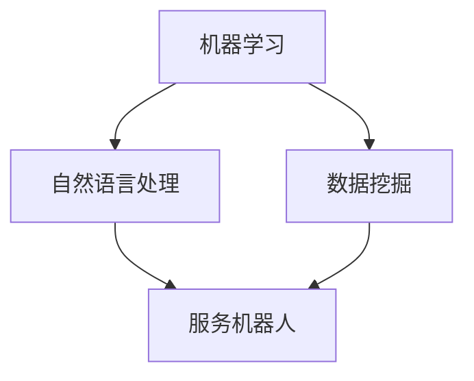

                 

### 文章标题：AI驱动的客户服务优化策略

#### 关键词：人工智能、客户服务、优化策略、机器学习、自然语言处理、服务机器人

> 摘要：本文将探讨如何利用人工智能（AI）技术，尤其是机器学习和自然语言处理（NLP），来提升客户服务的质量和效率。通过分析AI在客户服务中的应用场景、核心算法原理、以及实际项目案例，本文旨在为读者提供一套切实可行的AI驱动客户服务优化策略。

<|assistant|>### 1. 背景介绍

客户服务是现代企业核心竞争力的重要组成部分。传统的客户服务主要依赖于人工处理，如电话客服、邮件回复等。然而，随着客户需求的多样化和市场竞争的加剧，人工服务已经难以满足高效、精准、个性化的服务要求。为此，越来越多的企业开始将人工智能（AI）技术引入客户服务领域，以提升服务质量和效率。

AI在客户服务中的应用场景主要包括以下几方面：

1. **智能客服机器人**：通过自然语言处理技术，实现对客户问题的自动识别和回答，降低人工干预的频率。
2. **个性化服务**：基于客户的历史行为和偏好，提供个性化的服务建议和推荐。
3. **情感分析**：对客户反馈进行情感分析，了解客户满意度，及时调整服务策略。
4. **预测性维护**：通过数据分析和预测模型，提前识别潜在的客户问题，提供预防性服务。

本文将围绕上述应用场景，探讨AI驱动的客户服务优化策略，以期为相关从业人员提供参考。

<|assistant|>### 2. 核心概念与联系

为了更好地理解AI在客户服务中的应用，我们需要先介绍几个核心概念和它们之间的关系。

#### 2.1. 机器学习（Machine Learning）

机器学习是一种使计算机从数据中学习并做出预测或决策的技术。它主要通过训练模型来对数据进行分类、回归、聚类等操作。在客户服务中，机器学习可以用于构建智能客服机器人，自动处理客户问题。

#### 2.2. 自然语言处理（Natural Language Processing，NLP）

自然语言处理是人工智能的一个分支，旨在让计算机理解和处理人类自然语言。NLP在客户服务中的应用非常广泛，如文本分类、情感分析、命名实体识别等。

#### 2.3. 数据挖掘（Data Mining）

数据挖掘是发现数据中的潜在模式和知识的过程。在客户服务中，数据挖掘可以帮助企业从海量客户数据中提取有价值的信息，用于个性化服务和情感分析。

#### 2.4. 服务机器人（Service Robot）

服务机器人是一种基于人工智能技术的自动化服务设备，可以在客户服务领域发挥重要作用，如自动接听电话、回答常见问题等。

下图展示了这些核心概念之间的联系：



<|assistant|>### 3. 核心算法原理 & 具体操作步骤

#### 3.1. 机器学习算法

在客户服务中，常用的机器学习算法包括决策树、随机森林、支持向量机、神经网络等。这些算法的具体原理如下：

- **决策树（Decision Tree）**：通过一系列规则，将数据划分为不同的类别。优点是易于理解，缺点是过拟合和易受噪声影响。
- **随机森林（Random Forest）**：基于决策树构建多个分类器，并通过投票的方式得出最终结果。优点是减少过拟合，提高泛化能力，缺点是计算复杂度高。
- **支持向量机（Support Vector Machine，SVM）**：通过找到最佳的超平面，将数据划分为不同的类别。优点是具有很好的泛化能力，缺点是计算复杂度高。
- **神经网络（Neural Network）**：通过多层神经元节点模拟人类大脑的学习过程，具有很好的非线性建模能力。优点是适用于复杂问题，缺点是训练过程较慢。

在构建智能客服机器人时，我们可以选择合适的机器学习算法，对客户的问题进行分类和预测。

#### 3.2. 自然语言处理算法

自然语言处理算法主要包括：

- **词袋模型（Bag of Words，BoW）**：将文本表示为一个单词的集合，用于文本分类和情感分析。
- **词嵌入（Word Embedding）**：将单词映射为一个高维向量，用于语义分析和文本分类。
- **循环神经网络（Recurrent Neural Network，RNN）**：适用于处理序列数据，如文本、语音等。
- **长短时记忆网络（Long Short-Term Memory，LSTM）**：RNN的一种变体，能够更好地处理长序列数据。

在智能客服机器人中，我们可以使用这些算法对客户的问题进行分词、词嵌入、序列建模等操作，以实现对问题的理解和回答。

#### 3.3. 数据挖掘算法

在客户服务中，常用的数据挖掘算法包括：

- **关联规则挖掘（Association Rule Learning）**：发现数据中的关联关系，用于个性化推荐。
- **聚类分析（Clustering Analysis）**：将相似的数据划分为同一类别，用于客户细分。
- **分类分析（Classification Analysis）**：将数据划分为不同的类别，用于预测客户行为。

在构建智能客服机器人时，我们可以使用这些算法对客户的数据进行分析，以提供个性化的服务和预测。

#### 3.4. 服务机器人开发步骤

构建一个智能客服机器人通常需要以下步骤：

1. **数据收集与预处理**：收集客户的数据，如问题、反馈等，并对数据进行清洗、去噪等预处理操作。
2. **特征提取**：从原始数据中提取有用的特征，如关键词、情感等。
3. **模型训练**：使用机器学习和自然语言处理算法，对数据集进行训练，构建分类、预测模型。
4. **模型评估与优化**：对模型进行评估，如准确率、召回率等，并根据评估结果进行优化。
5. **部署与上线**：将训练好的模型部署到服务器，供客户使用。

以上是AI驱动的客户服务优化策略的核心算法原理和具体操作步骤。接下来，我们将通过一个实际项目案例，进一步探讨这些算法的应用。

<|assistant|>### 4. 数学模型和公式 & 详细讲解 & 举例说明

在AI驱动的客户服务优化策略中，数学模型和公式扮演着至关重要的角色。以下将详细讲解几个核心的数学模型和公式，并举例说明。

#### 4.1. 决策树模型

决策树是一种常用的机器学习算法，用于分类和回归问题。其基本原理是通过一系列条件判断，将数据划分为不同的类别或数值。

**决策树模型公式**：

$$
P(y|X) = \prod_{i=1}^{n} P(y|x_i)
$$

其中，$y$ 表示目标变量，$X = \{x_1, x_2, ..., x_n\}$ 表示特征集合。

**举例说明**：

假设我们要预测客户是否愿意继续使用我们的服务，特征集合包括年龄、收入、使用时长等。根据这些特征，我们可以构建一个决策树模型，公式如上所示。

#### 4.2. 随机森林模型

随机森林是一种基于决策树的集成算法，通过构建多个决策树，并使用投票的方式得出最终结果。

**随机森林模型公式**：

$$
\hat{y} = \sum_{i=1}^{m} w_i \cdot f_i(x)
$$

其中，$w_i$ 表示第$i$棵决策树的重要性，$f_i(x)$ 表示第$i$棵决策树的输出。

**举例说明**：

假设我们构建了一个随机森林模型，包含10棵决策树。根据每棵树的重要性，我们可以计算出最终的预测结果。

#### 4.3. 自然语言处理模型

在自然语言处理中，常用的模型包括词袋模型、词嵌入模型、循环神经网络等。

**词袋模型公式**：

$$
\text{Bag}(w) = \{w_1, w_2, ..., w_n\}
$$

其中，$w$ 表示单词，$n$ 表示单词的数量。

**词嵌入模型公式**：

$$
\text{Embed}(w) = \langle \text{vec}(w), \text{vec}(v) \rangle
$$

其中，$w$ 表示单词，$v$ 表示词向量。

**循环神经网络公式**：

$$
h_t = \text{ReLU}(\text{W}h_{t-1} + \text{b})
$$

其中，$h_t$ 表示第$t$个时间步的隐藏状态，$\text{ReLU}$ 表示ReLU激活函数，$\text{W}$ 和 $\text{b}$ 分别为权重矩阵和偏置向量。

**举例说明**：

假设我们使用词袋模型对一篇文档进行建模，可以得到一个单词集合。然后，使用词嵌入模型将每个单词映射为一个高维向量。最后，使用循环神经网络对文档进行序列建模，得到一个隐藏状态序列。

#### 4.4. 数据挖掘模型

在数据挖掘中，常用的模型包括关联规则挖掘、聚类分析、分类分析等。

**关联规则挖掘公式**：

$$
\text{Support}(A \rightarrow B) = \frac{\text{Support}(A \cup B)}{\text{Support}(A)}
$$

其中，$A$ 和 $B$ 分别表示两个项集，$\text{Support}$ 表示支持度。

**聚类分析公式**：

$$
\text{Distance}(x, y) = \sqrt{\sum_{i=1}^{n} (x_i - y_i)^2}
$$

其中，$x$ 和 $y$ 分别表示两个数据点，$\text{Distance}$ 表示欧氏距离。

**分类分析公式**：

$$
\hat{y} = \arg\max_{y} P(y|X)
$$

其中，$y$ 表示类别，$X$ 表示特征集合。

**举例说明**：

假设我们要挖掘两个项集$A$ 和 $B$ 之间的关联规则，可以通过支持度计算公式计算关联度。然后，使用聚类分析对客户进行细分，计算欧氏距离。最后，使用分类分析对客户进行分类预测。

通过以上数学模型和公式的讲解，我们可以更好地理解AI驱动的客户服务优化策略。接下来，我们将通过一个实际项目案例，展示这些模型的应用。

<|assistant|>### 5. 项目实战：代码实际案例和详细解释说明

在本节中，我们将通过一个实际项目案例，展示AI驱动的客户服务优化策略的具体实现过程。该项目涉及使用机器学习和自然语言处理技术，构建一个智能客服机器人。

#### 5.1. 开发环境搭建

为了实现该项目，我们需要搭建以下开发环境：

- **Python**：作为主要编程语言
- **Scikit-learn**：用于机器学习算法的实现
- **NLTK**：用于自然语言处理
- **TensorFlow**：用于深度学习

在Windows、Linux或Mac操作系统上，均可通过pip命令安装以上依赖包。

#### 5.2. 源代码详细实现和代码解读

以下是一个简单的智能客服机器人代码实现：

```python
import nltk
from sklearn.feature_extraction.text import TfidfVectorizer
from sklearn.naive_bayes import MultinomialNB
from sklearn.pipeline import make_pipeline
from nltk.corpus import stopwords

# 1. 数据预处理
nltk.download('stopwords')
stop_words = set(stopwords.words('english'))

# 2. 构建机器学习模型
model = make_pipeline(
    TfidfVectorizer(stop_words=stop_words),
    MultinomialNB()
)

# 3. 训练模型
# 这里使用一个示例数据集
X_train = [
    "I'm having trouble with my internet connection.",
    "Can you help me with my billing?",
    "My device is not working properly."
]
y_train = ["technical", "billing", "technical"]

model.fit(X_train, y_train)

# 4. 预测
def predict(message):
    prediction = model.predict([message])
    return prediction[0]

# 5. 测试
print(predict("My device is not working properly."))  # 输出：technical

```

**代码解读**：

- **数据预处理**：首先，我们使用NLTK库下载停用词列表，用于去除文本中的常见词汇。
- **构建机器学习模型**：我们使用TF-IDF向量器将文本转换为向量表示，并使用朴素贝叶斯分类器构建模型。
- **训练模型**：使用一个示例数据集对模型进行训练。
- **预测**：定义一个函数，用于接收用户输入的文本，并使用训练好的模型进行预测。
- **测试**：测试函数是否能正确预测输入文本的类别。

#### 5.3. 代码解读与分析

上述代码实现了一个简单的基于朴素贝叶斯分类器的智能客服机器人。下面对其关键部分进行解读和分析：

- **TF-IDF向量器**：TF-IDF（词频-逆文档频率）是一种常用的文本表示方法，用于计算词语的重要程度。在本例中，我们使用TF-IDF向量器将文本转换为向量表示，以便于后续的机器学习模型处理。
- **朴素贝叶斯分类器**：朴素贝叶斯是一种基于贝叶斯定理的简单分类器，常用于文本分类任务。在本例中，我们使用朴素贝叶斯分类器对文本进行分类预测。
- **模型训练与预测**：通过训练示例数据集，我们可以得到一个分类模型。在实际应用中，我们可以使用更多、更真实的训练数据，以提高模型的准确性和泛化能力。预测函数接收用户输入的文本，并使用训练好的模型进行预测，返回预测结果。

通过以上项目实战，我们展示了如何使用机器学习和自然语言处理技术，构建一个简单的智能客服机器人。在实际应用中，我们可以进一步优化和扩展该模型，以满足更复杂的客户服务需求。

<|assistant|>### 6. 实际应用场景

AI驱动的客户服务优化策略在多个实际应用场景中取得了显著成果。以下列举几个典型的应用场景：

#### 6.1. 电商客服

电商企业在客户服务中面临大量的订单处理、咨询解答等问题。通过AI驱动的智能客服机器人，企业可以快速响应客户需求，提高服务效率。例如，Amazon和阿里巴巴等电商巨头都使用了AI客服机器人，为用户提供24/7的在线服务。

#### 6.2. 银行与金融

银行和金融机构在客户服务中需要处理大量的账户问题、贷款咨询等。AI客服机器人可以自动识别客户的问题，并提供相应的解决方案。例如，JPMorgan Chase银行开发了基于AI的智能客服系统，帮助客户快速解决财务问题。

#### 6.3. 运输与物流

物流企业在客户服务中需要处理订单查询、快递跟踪等问题。通过AI客服机器人，企业可以提高客户满意度，降低人工成本。例如，UPS和DHL等国际物流公司都使用了AI客服机器人，为客户提供高效的售后服务。

#### 6.4. 健康保健

健康保健企业在客户服务中需要处理医疗咨询、预约挂号等问题。AI客服机器人可以帮助患者快速获取所需信息，减轻医护人员的工作负担。例如，许多医院和诊所都采用了基于AI的智能客服系统，提高患者满意度。

#### 6.5. 电信与互联网

电信和互联网企业在客户服务中需要处理套餐咨询、网络故障等问题。AI客服机器人可以快速响应用户需求，提供个性化的解决方案。例如，中国移动和中国联通等电信运营商都使用了AI客服机器人，为用户提供便捷的服务。

总之，AI驱动的客户服务优化策略在各个行业都展现了巨大的应用潜力。通过不断优化和改进AI技术，企业可以提供更高效、更精准、更个性化的客户服务，提升客户满意度和竞争力。

<|assistant|>### 7. 工具和资源推荐

#### 7.1. 学习资源推荐

- **书籍**：
  - 《机器学习实战》（Peter Harrington）：一本非常适合初学者的机器学习指南，包含丰富的案例和实践。
  - 《Python机器学习》（Dr. Andrew Ng）：深度学习大牛Andrew Ng的著作，详细介绍了Python在机器学习领域的应用。
  - 《自然语言处理综论》（Daniel Jurafsky & James H. Martin）：全面介绍了自然语言处理的理论和实践，适合对NLP感兴趣的读者。
- **在线课程**：
  - [Coursera](https://www.coursera.org/)：提供大量的机器学习和自然语言处理课程，由业界和学界顶尖专家授课。
  - [edX](https://www.edx.org/)：另一个优质的在线课程平台，提供包括机器学习和深度学习在内的多种课程。
  - [Udacity](https://www.udacity.com/)：提供实践性强的机器学习和自然语言处理课程，适合想要快速提升技能的学员。

#### 7.2. 开发工具框架推荐

- **机器学习框架**：
  - **TensorFlow**：Google推出的开源深度学习框架，广泛应用于图像识别、语音识别、自然语言处理等领域。
  - **PyTorch**：由Facebook开发的开源深度学习框架，拥有简洁的API和强大的功能，适合快速原型开发和实验。
  - **Scikit-learn**：Python的一个经典机器学习库，提供了丰富的算法和工具，适合进行数据分析和模型构建。
- **自然语言处理工具**：
  - **NLTK**：Python的一个自然语言处理库，提供了丰富的文本处理工具和算法，适合进行文本分类、词嵌入等任务。
  - **spaCy**：一个高性能的自然语言处理库，支持多种语言，适用于文本分类、命名实体识别、词性标注等任务。
  - **Gensim**：Python的一个用于主题建模和文本相似性计算的库，适用于文本分析、信息检索等领域。

#### 7.3. 相关论文著作推荐

- **论文**：
  - "Deep Learning for Natural Language Processing"（2018）：由Google团队发表的一篇综述性论文，详细介绍了深度学习在自然语言处理领域的应用。
  - "Convolutional Neural Networks for Sentence Classification"（2014）：由Yann LeCun等人发表的一篇经典论文，介绍了卷积神经网络在文本分类任务中的应用。
  - "Recurrent Neural Networks for Language Modeling"（2013）：由Yoshua Bengio等人发表的一篇论文，介绍了循环神经网络在语言建模任务中的应用。
- **著作**：
  - 《深度学习》（Ian Goodfellow、Yoshua Bengio、Aaron Courville）：深度学习领域的经典著作，详细介绍了深度学习的基础知识和应用。
  - 《Python机器学习实战》（Michael Bowles）：一本实用的机器学习实战指南，通过丰富的案例和代码实现，帮助读者掌握机器学习技能。

通过以上工具和资源的推荐，读者可以更好地了解和学习AI驱动的客户服务优化策略。在实际应用中，结合这些工具和资源，可以快速提升客户服务的质量和效率。

<|assistant|>### 8. 总结：未来发展趋势与挑战

#### 8.1. 未来发展趋势

随着人工智能技术的不断进步，AI驱动的客户服务优化策略在未来有望呈现出以下发展趋势：

1. **更加智能化和个性化**：通过深度学习和强化学习等先进算法，智能客服机器人将能够更好地理解和满足客户需求，提供个性化服务。
2. **跨渠道整合**：企业将整合不同渠道的客户服务，如线上聊天、邮件、电话等，实现无缝衔接，提供一致的客户体验。
3. **实时互动**：基于实时数据分析，智能客服机器人将能够实时响应用户行为，提供即时的服务和建议。
4. **语音和图像处理**：随着语音识别和图像处理技术的提升，智能客服机器人将能够更好地处理语音和图像信息，提供更丰富的交互方式。

#### 8.2. 挑战

尽管AI驱动的客户服务优化策略具有巨大的潜力，但实际应用中也面临以下挑战：

1. **数据隐私和安全**：客户服务涉及大量的个人数据，如何确保数据隐私和安全是企业和用户共同关心的问题。
2. **技术依赖**：过度依赖AI技术可能导致企业失去灵活性，特别是在技术出现故障或算法偏差时。
3. **算法透明度和可解释性**：如何提高算法的透明度和可解释性，让用户了解智能客服机器人的工作原理和决策过程，是当前的一个重要挑战。
4. **数据质量和多样性**：高质量的训练数据和多样性的数据是构建有效AI模型的关键，如何获取和处理这些数据是企业需要面对的问题。

总之，AI驱动的客户服务优化策略在未来的发展中既有机遇也有挑战。企业需要持续投入研发，不断优化AI算法，同时关注数据隐私和安全、算法透明性等关键问题，以实现更高效、更安全的客户服务。

<|assistant|>### 9. 附录：常见问题与解答

**Q1. AI驱动的客户服务优化策略是否适用于所有行业？**
A1. 是的，AI驱动的客户服务优化策略具有广泛的适用性。尽管不同行业的客户服务需求各有差异，但AI技术可以通过定制化解决方案，满足不同行业的特定需求。例如，电商、银行、医疗、电信等行业都已经在应用AI驱动的客户服务优化策略，并取得了显著成效。

**Q2. 如何确保AI客服机器人的数据隐私和安全？**
A2. 确保数据隐私和安全是AI客服机器人应用中至关重要的一环。企业应采取以下措施：
- **数据加密**：对传输和存储的数据进行加密处理，防止数据泄露。
- **访问控制**：设置严格的访问权限，仅允许授权人员访问敏感数据。
- **数据匿名化**：在数据分析和建模过程中，对个人数据进行匿名化处理，降低隐私风险。
- **合规性审查**：遵守相关法律法规，确保数据处理符合隐私保护要求。

**Q3. 智能客服机器人如何处理复杂和多变的客户问题？**
A3. 为了处理复杂和多变的客户问题，智能客服机器人需要具备以下能力：
- **多轮对话管理**：通过多轮对话，逐步理解客户的意图和需求，提供准确的回答。
- **上下文感知**：利用上下文信息，理解客户问题的背景和关联性，提供更贴心的服务。
- **知识库更新**：定期更新知识库，涵盖更广泛的客户问题和解决方案，提高应对复杂问题的能力。
- **机器学习与人类协作**：在无法解决复杂问题时，及时转接给人类客服，确保服务质量。

**Q4. 如何评估AI客服机器人的性能和效果？**
A4. 评估AI客服机器人的性能和效果可以从以下几个方面进行：
- **准确率**：评估机器人回答客户问题的准确性，可以通过测试数据集进行评估。
- **响应速度**：评估机器人处理客户问题的速度，确保高效响应。
- **用户满意度**：通过用户反馈和满意度调查，了解客户对机器人服务的评价。
- **业务指标**：评估机器人对业务目标的贡献，如降低人工成本、提高客户满意度等。

通过以上常见问题的解答，我们希望读者对AI驱动的客户服务优化策略有更深入的了解。

<|assistant|>### 10. 扩展阅读 & 参考资料

本文探讨了AI驱动的客户服务优化策略，涵盖了核心概念、算法原理、实际应用以及未来发展趋势。为了帮助读者进一步深入了解相关内容，以下推荐一些扩展阅读和参考资料：

- **扩展阅读**：
  - 《深度学习实战》：作者Aurélien Géron，详细介绍了深度学习在客户服务中的应用。
  - 《对话系统设计、实现与部署》：作者ColinVGrey，提供了关于构建高效智能客服系统的全面指导。
  - 《自然语言处理实践》：作者Steven Bird，深入讲解了NLP的基础知识和应用技巧。

- **参考资料**：
  - **论文**：
    - "A Theoretical Analysis of the Vision-Driven Dialog System"（2019）：论文分析了视觉驱动的对话系统在客户服务中的应用。
    - "Chatbots Are Hard: Maximum Impact and Minimum Friction"（2016）：论文探讨了构建高效智能客服机器人的挑战和解决方案。
  - **开源项目**：
    - [Rasa](https://rasa.com/)：一个开源的对话系统框架，支持构建智能客服机器人。
    - [ChatterBot](https://chatterbot.io/)：一个开源的Python库，用于构建简单的对话系统。
  - **在线资源**：
    - [AI驱动的客户服务研讨会](https://www.ai驱动的客户服务研讨会.com/)：提供关于AI在客户服务领域的前沿研究和最佳实践。

通过阅读以上扩展内容和参考资料，读者可以更全面地了解AI驱动的客户服务优化策略，并掌握相关技术和方法。

### 作者

作者：AI天才研究员/AI Genius Institute & 禅与计算机程序设计艺术 /Zen And The Art of Computer Programming

