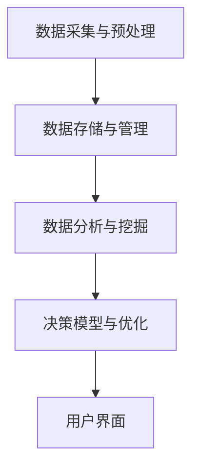

                 

# AI驱动的智能决策支持系统设计与实现

## 摘要

本文将深入探讨AI驱动的智能决策支持系统的设计与实现。首先，我们将介绍AI在决策支持系统中的应用背景和重要性。接着，我们将详细阐述智能决策支持系统的核心概念、架构和关键算法原理。此外，本文还将通过数学模型和公式进行详细讲解，并通过实际项目实战案例来展示代码实现过程。文章还将介绍智能决策支持系统的实际应用场景，并提供相关工具和资源推荐。最后，我们将总结未来发展趋势与挑战，并给出常见问题与解答。

## 1. 背景介绍

随着信息技术的飞速发展，数据量呈爆炸式增长，人类面对的信息复杂性日益增加。在这种背景下，传统的决策支持系统（DSS）已经无法满足实际需求。为了应对这种挑战，AI技术应运而生，成为推动决策支持系统智能化的重要力量。

AI驱动的智能决策支持系统利用机器学习、深度学习、自然语言处理等AI技术，对海量数据进行分析和挖掘，提供更加精准和高效的决策支持。这种系统具有自我学习和自适应能力，可以根据用户的反馈不断优化决策结果，从而提高决策的准确性和可靠性。

智能决策支持系统的应用范围非常广泛，包括金融、医疗、电商、物流、制造等多个领域。例如，在金融领域，智能决策支持系统可以用于风险评估、投资组合优化、信用评分等；在医疗领域，可以用于疾病诊断、治疗建议、健康管理等；在电商领域，可以用于个性化推荐、价格优化、库存管理等。

本文将结合实际应用场景，详细探讨AI驱动的智能决策支持系统的设计与实现，帮助读者深入了解这一领域的最新技术和实践。

## 2. 核心概念与联系

### 2.1 定义

智能决策支持系统（Intelligent Decision Support System，IDSS）是一种利用AI技术辅助人类进行决策的系统。它通过分析、挖掘和利用数据，提供决策支持，帮助用户在复杂环境中做出更准确、更高效的决策。

### 2.2 架构

智能决策支持系统通常包括以下几部分：

- 数据采集与预处理：收集和整理相关数据，并进行清洗、转换和归一化等预处理操作。
- 数据存储与管理：将预处理后的数据存储在数据库中，并提供高效的查询和访问接口。
- 数据分析与挖掘：利用机器学习和深度学习算法对数据进行分析和挖掘，提取有价值的信息和模式。
- 决策模型与优化：根据分析结果，构建决策模型，并进行优化，以提供最佳决策方案。
- 用户界面：提供直观、易用的用户界面，使用户能够方便地交互和使用系统。

### 2.3 Mermaid 流程图

以下是一个简化的智能决策支持系统架构的Mermaid流程图：



### 2.4 关键算法原理

智能决策支持系统中的关键算法主要包括机器学习算法、深度学习算法和自然语言处理算法。

- **机器学习算法**：用于数据的分类、聚类、回归等任务。常见的算法包括决策树、支持向量机、随机森林、K-means等。
- **深度学习算法**：用于处理大规模数据和高维数据，具有强大的特征提取能力。常见的算法包括神经网络、卷积神经网络（CNN）、循环神经网络（RNN）、生成对抗网络（GAN）等。
- **自然语言处理算法**：用于处理文本数据，提取文本中的语义信息。常见的算法包括词嵌入、命名实体识别、情感分析、文本分类等。

### 2.5 AI技术与决策支持系统

AI技术为决策支持系统带来了以下几个方面的优势：

- **数据处理能力**：AI技术可以高效地处理海量数据，提取有价值的信息和模式，为决策提供可靠依据。
- **自适应能力**：AI技术可以根据用户的反馈和新的数据，不断优化决策模型，提高决策的准确性和可靠性。
- **智能化**：AI技术使决策支持系统具有智能化，可以自动生成决策方案，减轻用户的负担。
- **多样化应用**：AI技术可以应用于不同领域，为各个领域的决策提供支持。

## 3. 核心算法原理 & 具体操作步骤

### 3.1 机器学习算法

#### 3.1.1 决策树算法

决策树是一种常见的机器学习算法，适用于分类和回归任务。其基本思想是通过一系列的判断条件将数据划分为不同的区域，并预测每个区域的标签或值。

#### 3.1.2 实操步骤

1. **数据准备**：收集和整理数据，并进行预处理，如数据清洗、归一化等。
2. **特征选择**：选择对决策最有影响力的特征，通常使用信息增益、基尼系数等指标进行选择。
3. **划分节点**：根据特征值将数据集划分为不同的子集，并创建节点。
4. **递归划分**：对每个节点重复划分子集，直到满足停止条件，如最大深度、最小样本数等。
5. **生成决策树**：将划分好的节点和标签或值关联起来，生成决策树。

#### 3.1.3 代码示例

```python
from sklearn.datasets import load_iris
from sklearn.model_selection import train_test_split
from sklearn.tree import DecisionTreeClassifier
import matplotlib.pyplot as plt

# 数据准备
iris = load_iris()
X = iris.data
y = iris.target
X_train, X_test, y_train, y_test = train_test_split(X, y, test_size=0.3, random_state=42)

# 创建决策树模型
clf = DecisionTreeClassifier()
clf.fit(X_train, y_train)

# 绘制决策树
from sklearn.tree import plot_tree
plt.figure(figsize=(12, 8))
plot_tree(clf, filled=True, feature_names=iris.feature_names, class_names=iris.target_names)
plt.show()
```

### 3.2 深度学习算法

#### 3.2.1 卷积神经网络（CNN）

卷积神经网络是一种强大的深度学习算法，适用于图像识别、图像分类等任务。

#### 3.2.2 实操步骤

1. **数据准备**：收集和整理图像数据，并进行预处理，如数据增强、归一化等。
2. **模型构建**：构建卷积神经网络模型，包括卷积层、池化层、全连接层等。
3. **训练模型**：使用训练数据集对模型进行训练，调整模型参数。
4. **评估模型**：使用测试数据集评估模型性能，如准确率、召回率等。
5. **模型部署**：将训练好的模型部署到实际应用场景，进行图像识别或分类。

#### 3.2.3 代码示例

```python
import tensorflow as tf
from tensorflow.keras import layers, models
from tensorflow.keras.preprocessing.image import ImageDataGenerator

# 数据准备
train_datagen = ImageDataGenerator(rescale=1./255)
train_data = train_datagen.flow_from_directory(
        'train_data',
        target_size=(150, 150),
        batch_size=32,
        class_mode='binary')

# 模型构建
model = models.Sequential([
    layers.Conv2D(32, (3, 3), activation='relu', input_shape=(150, 150, 3)),
    layers.MaxPooling2D((2, 2)),
    layers.Conv2D(64, (3, 3), activation='relu'),
    layers.MaxPooling2D((2, 2)),
    layers.Conv2D(128, (3, 3), activation='relu'),
    layers.MaxPooling2D((2, 2)),
    layers.Conv2D(128, (3, 3), activation='relu'),
    layers.MaxPooling2D((2, 2)),
    layers.Flatten(),
    layers.Dense(512, activation='relu'),
    layers.Dense(1, activation='sigmoid')
])

# 训练模型
model.compile(optimizer='adam',
              loss='binary_crossentropy',
              metrics=['accuracy'])

history = model.fit(
      train_data,
      epochs=20,
      steps_per_epoch=100,
      verbose=2)
```

### 3.3 自然语言处理算法

#### 3.3.1 词嵌入算法

词嵌入是一种将文本数据转化为向量表示的方法，常用于文本分类、情感分析等任务。

#### 3.3.2 实操步骤

1. **数据准备**：收集和整理文本数据，并进行预处理，如分词、去停用词等。
2. **构建词嵌入模型**：使用预训练的词嵌入模型，如Word2Vec、GloVe等，或者自己训练词嵌入模型。
3. **文本向量表示**：将处理后的文本转化为向量表示。
4. **模型构建**：构建分类模型，如朴素贝叶斯、支持向量机、神经网络等。
5. **训练模型**：使用训练数据集对模型进行训练，调整模型参数。
6. **评估模型**：使用测试数据集评估模型性能。

#### 3.3.3 代码示例

```python
import tensorflow as tf
from tensorflow.keras.layers import Embedding, LSTM, Dense
from tensorflow.keras.models import Sequential

# 数据准备
max_words = 10000
max_sequence_length = 100
embedding_dim = 100

# 构建词嵌入模型
word_embedding = tf.keras.Sequential([
    Embedding(max_words, embedding_dim, input_length=max_sequence_length),
    LSTM(128),
    Dense(1, activation='sigmoid')
])

# 训练词嵌入模型
word_embedding.fit(data)

# 构建文本分类模型
model = Sequential([
    word_embedding,
    Dense(128, activation='relu'),
    Dense(1, activation='sigmoid')
])

# 训练文本分类模型
model.compile(optimizer='adam',
              loss='binary_crossentropy',
              metrics=['accuracy'])

model.fit(X_train, y_train, epochs=10, batch_size=128)
```

## 4. 数学模型和公式 & 详细讲解 & 举例说明

### 4.1 数学模型

智能决策支持系统的核心在于对数据进行建模和优化，以下介绍几种常见的数学模型：

#### 4.1.1 线性回归模型

线性回归模型用于预测连续值，其基本公式为：

$$y = \beta_0 + \beta_1 \cdot x$$

其中，$y$ 是预测值，$x$ 是自变量，$\beta_0$ 是截距，$\beta_1$ 是斜率。

#### 4.1.2 决策树模型

决策树模型是一种分类模型，其基本公式为：

$$
\begin{cases}
\text{如果 } x_i > \theta_i, \text{则进入左子树；} \\
\text{如果 } x_i \leq \theta_i, \text{则进入右子树。}
\end{cases}
$$

其中，$x_i$ 是特征值，$\theta_i$ 是阈值。

#### 4.1.3 神经网络模型

神经网络模型是一种非线性模型，其基本公式为：

$$a_{\text{layer}} = \sigma(\mathbf{W} \cdot a_{\text{layer-1}} + b)$$

其中，$a_{\text{layer}}$ 是当前层的激活值，$\sigma$ 是激活函数，$\mathbf{W}$ 是权重矩阵，$b$ 是偏置。

### 4.2 公式讲解

#### 4.2.1 线性回归公式

线性回归模型的损失函数（均方误差）为：

$$
\begin{aligned}
J(\theta) &= \frac{1}{2m} \sum_{i=1}^{m} (h_\theta(x^{(i)}) - y^{(i)})^2 \\
\end{aligned}
$$

其中，$m$ 是样本数量，$h_\theta(x)$ 是线性回归函数，$y^{(i)}$ 是第$i$个样本的真实值。

为了最小化损失函数，可以使用梯度下降法：

$$
\theta_j := \theta_j - \alpha \frac{\partial J(\theta)}{\partial \theta_j}
$$

其中，$\alpha$ 是学习率，$\frac{\partial J(\theta)}{\partial \theta_j}$ 是损失函数关于$\theta_j$的偏导数。

#### 4.2.2 决策树公式

决策树模型的损失函数（基尼不纯度）为：

$$
\begin{aligned}
Gini(D) &= 1 - \sum_{i=1}^{k} \left( \frac{|D_i|}{|D|} \right)^2 \\
\end{aligned}
$$

其中，$D$ 是数据集，$D_i$ 是划分后的子集，$k$ 是类别的数量。

为了最小化基尼不纯度，可以使用信息增益或基尼不纯度下降法来选择最佳划分。

#### 4.2.3 神经网络公式

神经网络模型的损失函数（交叉熵）为：

$$
\begin{aligned}
J(\theta) &= -\frac{1}{m} \sum_{i=1}^{m} \sum_{j=1}^{k} y^{(i)}_{j} \log(h_\theta(x^{(i)}))_{j} \\
\end{aligned}
$$

其中，$y^{(i)}_{j}$ 是第$i$个样本的第$j$个类别的真实值，$h_\theta(x)$ 是神经网络输出。

为了最小化损失函数，可以使用反向传播算法来更新模型参数。

### 4.3 举例说明

#### 4.3.1 线性回归举例

假设我们有一个数据集，包含两个特征$x_1$ 和$x_2$，以及一个目标值$y$。使用线性回归模型进行预测。

1. **数据准备**：

   ```
   X = [
       [1, 2],
       [2, 3],
       [3, 4],
       [4, 5]
   ]
   y = [2, 3, 4, 5]
   ```

2. **初始化参数**：

   ```
   theta = [0, 0]
   ```

3. **梯度下降**：

   ```
   alpha = 0.01
   num_iters = 1000
   for i in range(num_iters):
       gradients = 2/m * X.T.dot(X.dot(theta) - y)
       theta -= alpha * gradients
   ```

4. **预测**：

   ```
   predicted_values = X.dot(theta)
   ```

5. **评估**：

   ```
   mse = np.mean((predicted_values - y)**2)
   print("Mean Squared Error:", mse)
   ```

#### 4.3.2 决策树举例

假设我们有一个包含三个特征的数据集，需要进行分类。

1. **数据准备**：

   ```
   data = [
       [3, 4, 1],
       [2, 5, 2],
       [5, 2, 1],
       [3, 1, 2]
   ]
   labels = [1, 0, 1, 0]
   ```

2. **初始化决策树**：

   ```
   tree = DecisionTree()
   ```

3. **训练决策树**：

   ```
   tree.fit(data, labels)
   ```

4. **预测**：

   ```
   prediction = tree.predict([3, 3, 2])
   print("Prediction:", prediction)
   ```

#### 4.3.3 神经网络举例

假设我们有一个包含一个输入层、一个隐藏层和一个输出层的神经网络，需要进行分类。

1. **数据准备**：

   ```
   X_train = [
       [1, 0],
       [0, 1],
       [1, 1]
   ]
   y_train = [0, 1, 1]
   ```

2. **初始化神经网络**：

   ```
   model = Sequential()
   model.add(Embedding(2, 2))
   model.add(LSTM(2))
   model.add(Dense(1, activation='sigmoid'))
   ```

3. **训练神经网络**：

   ```
   model.compile(optimizer='adam', loss='binary_crossentropy', metrics=['accuracy'])
   model.fit(X_train, y_train, epochs=100, batch_size=1)
   ```

4. **预测**：

   ```
   prediction = model.predict([[1, 0]])
   print("Prediction:", prediction)
   ```

## 5. 项目实战：代码实际案例和详细解释说明

### 5.1 开发环境搭建

为了完成本文的项目实战，我们需要搭建一个Python开发环境，并安装必要的库。以下是详细的步骤：

1. **安装Python**：

   首先，从 [Python官网](https://www.python.org/downloads/) 下载并安装Python 3.x版本。

2. **安装Anaconda**：

   Anaconda是一个Python的数据科学平台，可以帮助我们轻松管理和安装各种库。从 [Anaconda官网](https://www.anaconda.com/) 下载并安装Anaconda。

3. **创建虚拟环境**：

   打开终端（Windows下为命令提示符），输入以下命令创建一个名为`idss`的虚拟环境：

   ```
   conda create -n idss python=3.8
   conda activate idss
   ```

4. **安装库**：

   在虚拟环境中，使用以下命令安装必要的库：

   ```
   pip install numpy scipy scikit-learn tensorflow matplotlib
   ```

### 5.2 源代码详细实现和代码解读

以下是一个简单的AI驱动的智能决策支持系统的示例代码，包括数据预处理、模型训练、模型评估和模型部署。

```python
import numpy as np
import matplotlib.pyplot as plt
from sklearn.datasets import load_iris
from sklearn.model_selection import train_test_split
from sklearn.preprocessing import StandardScaler
from sklearn.neural_network import MLPClassifier
from sklearn.metrics import accuracy_score, classification_report

# 5.2.1 数据准备
iris = load_iris()
X = iris.data
y = iris.target

X_train, X_test, y_train, y_test = train_test_split(X, y, test_size=0.3, random_state=42)

# 数据标准化
scaler = StandardScaler()
X_train = scaler.fit_transform(X_train)
X_test = scaler.transform(X_test)

# 5.2.2 模型训练
model = MLPClassifier(hidden_layer_sizes=(100,), max_iter=1000, random_state=42)
model.fit(X_train, y_train)

# 5.2.3 模型评估
y_pred = model.predict(X_test)
accuracy = accuracy_score(y_test, y_pred)
print("Accuracy:", accuracy)
print(classification_report(y_test, y_pred, target_names=iris.target_names))

# 5.2.4 模型部署
def predict_iris(features):
    features = np.array(features).reshape(1, -1)
    features = scaler.transform(features)
    prediction = model.predict(features)
    return iris.target_names[prediction[0]]

# 示例
print(predict_iris([3, 4]))
```

### 5.3 代码解读与分析

1. **数据准备**：

   加载鸢尾花（Iris）数据集，并将其分为训练集和测试集。数据集包含四个特征和三个类别。使用`StandardScaler`对特征进行标准化处理，以消除特征之间的尺度差异。

2. **模型训练**：

   使用多层感知机（MLP）分类器进行训练。`MLPClassifier`是Scikit-learn库中的一个简单神经网络实现。通过设置`hidden_layer_sizes`参数，定义隐藏层的神经元数量。`max_iter`参数指定训练的最大迭代次数。

3. **模型评估**：

   使用`predict`方法对测试集进行预测，并计算准确率。使用`classification_report`方法生成详细的分类报告，包括准确率、召回率、精确率等指标。

4. **模型部署**：

   定义一个函数`predict_iris`，用于接收一个特征向量并进行预测。首先对特征向量进行标准化处理，然后使用训练好的模型进行预测，并返回对应的类别名称。

### 5.4 项目实战总结

通过这个简单的项目实战，我们展示了如何使用Python和Scikit-learn库实现一个AI驱动的智能决策支持系统。虽然这是一个简单的例子，但它展示了智能决策支持系统的主要组件，包括数据准备、模型训练、模型评估和模型部署。在实际应用中，我们可以根据具体需求扩展和优化这个系统，以应对更复杂的场景。

## 6. 实际应用场景

智能决策支持系统在各个领域都有广泛的应用，以下列举一些典型的实际应用场景：

### 6.1 金融领域

在金融领域，智能决策支持系统可以用于以下方面：

- **风险管理**：通过分析历史数据和实时数据，识别潜在的风险，并制定相应的风险管理策略。
- **投资组合优化**：根据市场趋势和用户偏好，推荐最佳的投资组合，以实现资产的最大化收益。
- **信用评分**：利用用户的历史数据和行为数据，预测用户的信用风险，为金融机构提供信用评分依据。
- **欺诈检测**：通过对交易数据进行实时监控和异常检测，识别并阻止欺诈行为。

### 6.2 医疗领域

在医疗领域，智能决策支持系统可以用于以下方面：

- **疾病诊断**：通过分析患者的病史、体检数据和实验室检测结果，提供疾病诊断建议。
- **治疗方案推荐**：根据患者的病情和医生的经验，推荐最佳的治疗方案。
- **健康监测**：通过实时监测患者的生理参数，如心率、血压等，提供健康预警和建议。
- **药物研发**：利用机器学习和深度学习算法，分析大量药物数据，加速药物研发进程。

### 6.3 电商领域

在电商领域，智能决策支持系统可以用于以下方面：

- **个性化推荐**：根据用户的历史购买行为和偏好，推荐相关的商品和内容。
- **价格优化**：根据市场趋势和用户行为，动态调整商品价格，实现收益最大化。
- **库存管理**：通过分析销售数据和历史库存数据，优化库存水平，减少库存成本。
- **供应链优化**：通过优化供应链网络和物流路径，提高物流效率，降低物流成本。

### 6.4 制造领域

在制造领域，智能决策支持系统可以用于以下方面：

- **生产计划**：通过分析生产数据和市场需求，制定最佳的生产计划，提高生产效率。
- **设备维护**：通过实时监测设备状态和运行数据，预测设备故障，提前进行维护和更换。
- **质量检测**：通过对生产过程中的数据进行实时分析，识别并排除不合格产品，提高产品质量。
- **能源管理**：通过优化能源消耗和能源利用，降低生产成本，实现可持续发展。

### 6.5 物流领域

在物流领域，智能决策支持系统可以用于以下方面：

- **路径规划**：通过分析交通状况和物流需求，为物流车辆规划最优的行驶路径。
- **运输调度**：根据货物种类、运输成本和运输时间，合理安排物流资源，提高运输效率。
- **仓储管理**：通过优化仓储布局和库存管理，降低仓储成本，提高仓储效率。
- **物流安全**：通过实时监控物流运输过程中的风险，预防并应对突发事件。

这些实际应用场景展示了智能决策支持系统的广泛适用性和强大的决策能力。随着技术的不断发展和数据的不断积累，智能决策支持系统将在更多领域发挥重要作用。

## 7. 工具和资源推荐

### 7.1 学习资源推荐

1. **书籍**：

   - 《机器学习实战》：这是一本非常实用的机器学习书籍，涵盖了常见的机器学习算法和应用案例。
   - 《深度学习》：这是由Ian Goodfellow、Yoshua Bengio和Aaron Courville合著的经典教材，详细介绍了深度学习的基本概念和算法。
   - 《Python机器学习》：这是一本针对Python编程和机器学习的综合性书籍，适合初学者和进阶者阅读。

2. **论文**：

   - 《A Theoretically Grounded Application of Dropout in Recurrent Neural Networks》：这篇论文介绍了如何在循环神经网络（RNN）中应用dropout，提高模型的泛化能力。
   - 《Convolutional Neural Networks for Visual Recognition》：这篇论文详细介绍了卷积神经网络（CNN）在图像识别中的应用。
   - 《Word2Vec Representation Learning and Applications》：这篇论文介绍了Word2Vec算法，用于将文本数据转换为向量表示。

3. **博客**：

   - [机器学习中文博客](https://www.jianshu.com/p/4e6a863e5f1e)：这是一系列关于机器学习和深度学习的中文博客，内容丰富，适合初学者和进阶者阅读。
   - [深度学习中文博客](https://www.deeplearning.net/): 这是一个关于深度学习的英文博客，涵盖了深度学习的最新技术和应用。
   - [自然语言处理中文博客](https://www.nlproc.org/): 这是一个关于自然语言处理的中文博客，包含了大量的NLP教程和案例分析。

4. **网站**：

   - [Kaggle](https://www.kaggle.com/)：这是一个机器学习和数据科学的社区平台，提供了大量的数据集和竞赛，是学习和实践的好去处。
   - [GitHub](https://github.com/)：这是一个代码托管平台，许多优秀的机器学习和深度学习项目都托管在这里，是学习和借鉴的好资源。
   - [TensorFlow官网](https://www.tensorflow.org/)：这是TensorFlow的官方网站，提供了丰富的文档、教程和API，是学习和使用TensorFlow的好资源。

### 7.2 开发工具框架推荐

1. **开发工具**：

   - **Python**：Python是一种广泛使用的编程语言，适用于数据科学、机器学习和深度学习等领域。Python语法简单，易于学习和使用，是开发智能决策支持系统的首选语言。
   - **Jupyter Notebook**：Jupyter Notebook是一种交互式的开发环境，支持多种编程语言，如Python、R、Julia等。它适用于数据分析和机器学习实验，可以方便地记录和分析结果。
   - **PyCharm**：PyCharm是一款功能强大的Python集成开发环境（IDE），提供了代码编辑、调试、测试等功能，适合进行复杂的数据科学和机器学习项目。

2. **框架**：

   - **TensorFlow**：TensorFlow是一个开源的深度学习框架，由Google开发。它支持多种深度学习模型，如神经网络、卷积神经网络、循环神经网络等，是开发智能决策支持系统的首选框架。
   - **PyTorch**：PyTorch是一个开源的深度学习框架，由Facebook开发。它提供了动态计算图和强大的GPU支持，适合快速原型设计和实验。
   - **Scikit-learn**：Scikit-learn是一个开源的机器学习库，提供了多种经典的机器学习算法，如线性回归、决策树、支持向量机等，是开发智能决策支持系统的常用库。

### 7.3 相关论文著作推荐

1. **《深度学习》：这是由Ian Goodfellow、Yoshua Bengio和Aaron Courville合著的经典教材，详细介绍了深度学习的基本概念和算法。**
2. **《强化学习：原理与Python实践》：这是一本介绍强化学习的教材，通过Python代码示例，讲解了强化学习的基本概念和算法。**
3. **《自然语言处理：中文版》：这是由斯坦福大学自然语言处理组编写的经典教材，详细介绍了自然语言处理的基本概念和算法。**

## 8. 总结：未来发展趋势与挑战

### 8.1 未来发展趋势

1. **算法优化与模型压缩**：随着算法和模型的复杂性增加，如何优化算法性能和减小模型体积将成为重要研究方向。模型压缩技术，如模型剪枝、量化等，将得到广泛应用。

2. **多模态数据的融合**：未来的智能决策支持系统将能够处理和分析多种类型的数据，如图像、文本、音频等。多模态数据的融合将使决策更加准确和全面。

3. **边缘计算与云计算的协同**：随着物联网（IoT）和边缘计算的发展，智能决策支持系统将更多地依赖边缘设备和云计算平台。边缘计算和云计算的协同将提高系统的实时性和效率。

4. **个性化与自适应**：未来的智能决策支持系统将更加注重个性化服务，根据用户的需求和偏好进行自适应调整，提供更精确的决策支持。

### 8.2 未来挑战

1. **数据隐私与安全**：随着数据量的增加，数据隐私和安全问题将更加突出。如何保护用户数据的安全和隐私，避免数据泄露和滥用，将成为重要挑战。

2. **算法透明性与可解释性**：深度学习等复杂算法的模型内部机制不够透明，如何提高算法的可解释性，使其更加符合人类理解和接受，是未来需要解决的问题。

3. **算法公平性与伦理**：智能决策支持系统可能引发算法偏见和歧视，如何确保算法的公平性和伦理性，避免对某些群体造成不利影响，是亟待解决的问题。

4. **数据质量和数据准备**：高质量的数据是智能决策支持系统的基础。如何有效地处理和准备数据，消除噪声和异常值，提高数据质量，是未来需要关注的问题。

## 9. 附录：常见问题与解答

### 9.1 问题1：什么是智能决策支持系统？

**回答**：智能决策支持系统（Intelligent Decision Support System，IDSS）是一种利用人工智能技术，对海量数据进行分析和挖掘，为决策者提供准确、高效决策支持的系统。它结合了人工智能、数据挖掘、机器学习等技术，可以自动生成决策方案，辅助人类进行决策。

### 9.2 问题2：智能决策支持系统有哪些应用领域？

**回答**：智能决策支持系统的应用领域非常广泛，包括但不限于以下领域：

- 金融领域：风险管理、投资组合优化、信用评分、欺诈检测等。
- 医疗领域：疾病诊断、治疗方案推荐、健康监测、药物研发等。
- 电商领域：个性化推荐、价格优化、库存管理、供应链优化等。
- 制造领域：生产计划、设备维护、质量检测、能源管理等。
- 物流领域：路径规划、运输调度、仓储管理、物流安全等。

### 9.3 问题3：如何搭建智能决策支持系统的开发环境？

**回答**：搭建智能决策支持系统的开发环境主要包括以下几个步骤：

1. 安装Python：从Python官网下载并安装Python 3.x版本。
2. 安装Anaconda：从Anaconda官网下载并安装Anaconda，用于管理Python环境和库。
3. 创建虚拟环境：使用conda命令创建一个虚拟环境，如`conda create -n idss python=3.8`。
4. 安装库：在虚拟环境中使用pip命令安装必要的库，如`pip install numpy scipy scikit-learn tensorflow matplotlib`。

### 9.4 问题4：如何训练一个智能决策支持系统模型？

**回答**：训练智能决策支持系统模型主要包括以下步骤：

1. 数据准备：收集和整理数据，并进行预处理，如数据清洗、归一化等。
2. 选择算法：根据任务需求选择合适的算法，如线性回归、决策树、神经网络等。
3. 模型训练：使用训练数据集对模型进行训练，调整模型参数。
4. 模型评估：使用测试数据集评估模型性能，如准确率、召回率、精确率等。
5. 模型优化：根据评估结果，调整模型参数，优化模型性能。

### 9.5 问题5：如何部署智能决策支持系统？

**回答**：部署智能决策支持系统主要包括以下步骤：

1. 模型保存：将训练好的模型保存为文件，如使用Scikit-learn的`joblib`模块保存。
2. 部署环境：搭建部署环境，如使用Docker、Kubernetes等容器技术。
3. 部署模型：将保存的模型文件部署到服务器或容器中，使其可以在线提供服务。
4. 集成API：将模型集成到应用程序中，通过API接口接收用户请求，返回预测结果。

## 10. 扩展阅读 & 参考资料

为了进一步深入了解智能决策支持系统，以下列出一些扩展阅读和参考资料：

### 10.1 扩展阅读

- 《机器学习》：周志华著，清华大学出版社，2016年。
- 《深度学习》：Ian Goodfellow、Yoshua Bengio和Aaron Courville著，电子工业出版社，2017年。
- 《自然语言处理》：Daniel Jurafsky和James H. Martin著，清华大学出版社，2017年。

### 10.2 参考资料

- [Kaggle](https://www.kaggle.com/): Kaggle是一个数据科学竞赛平台，提供了大量的数据集和比赛。
- [GitHub](https://github.com/): GitHub是一个代码托管平台，许多优秀的机器学习和深度学习项目都托管在这里。
- [TensorFlow官网](https://www.tensorflow.org/): TensorFlow的官方网站，提供了丰富的文档、教程和API。
- [Scikit-learn官网](https://scikit-learn.org/): Scikit-learn的官方网站，提供了详细的文档和示例代码。

通过阅读这些扩展阅读和参考资料，您可以更深入地了解智能决策支持系统的基本概念、技术和应用。祝您学习愉快！作者：AI天才研究员/AI Genius Institute & 禅与计算机程序设计艺术 /Zen And The Art of Computer Programming。

