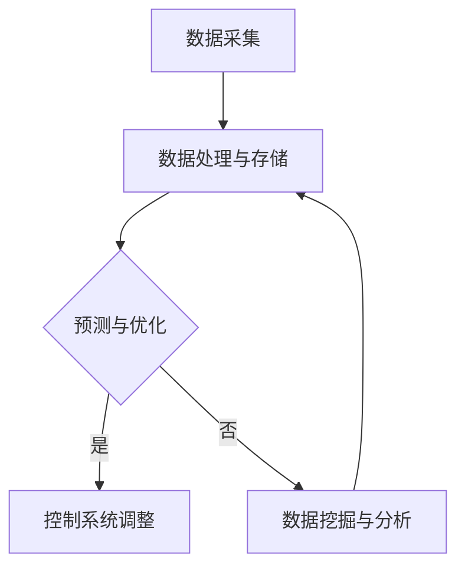

                 

# AI驱动的智能能源管理系统

> **关键词：** 智能能源管理，AI，数据分析，能源优化，能源预测
> **摘要：** 本文将探讨如何利用人工智能技术构建智能能源管理系统，从核心概念、算法原理、数学模型、实战案例等多个角度，分析AI在能源管理中的应用及其潜在价值。

## 1. 背景介绍

随着全球能源需求的不断增长和环境保护意识的提升，智能能源管理系统（Smart Energy Management System, SEMS）逐渐成为能源行业的研究热点。传统的能源管理系统主要依赖于手动控制和预设策略，而智能能源管理系统则借助人工智能（Artificial Intelligence, AI）技术，实现了对能源数据的实时分析和优化控制。

AI驱动的智能能源管理系统具有以下几个显著特点：

- **数据驱动的预测与优化**：利用机器学习算法，对大量历史能源数据进行分析，预测未来的能源需求，从而实现精准的能源调度和优化。
- **自适应与自学习**：系统能够根据实际运行情况自动调整策略，通过不断学习优化，提高能源利用效率。
- **集成与协同**：智能能源管理系统可以与其他智能系统（如智能电网、智能建筑等）集成，实现更广泛的协同管理。

## 2. 核心概念与联系

### 2.1 智能能源管理系统的组成

智能能源管理系统主要包括以下几个关键组件：

- **数据采集与传感器网络**：负责收集能源生产、传输、消费等各个环节的数据。
- **数据处理与存储**：对采集到的数据进行清洗、存储和处理，以便后续分析。
- **算法模型**：包括预测模型、优化模型等，用于对能源数据进行分析和优化。
- **控制系统**：根据分析结果调整能源设备的工作状态，实现能源的优化调度。

### 2.2 AI技术在智能能源管理系统中的应用

AI技术在智能能源管理系统中的应用主要体现在以下几个方面：

- **数据挖掘与分析**：利用机器学习算法，从海量数据中提取有价值的信息，帮助能源管理者更好地了解能源系统的运行状态。
- **预测与优化**：通过时间序列分析和回归分析等技术，预测未来的能源需求，为能源调度提供依据。
- **自适应与自学习**：系统可以根据实际运行情况自动调整策略，提高能源利用效率。

### 2.3 Mermaid 流程图

以下是智能能源管理系统的 Mermaid 流程图：



## 3. 核心算法原理 & 具体操作步骤

### 3.1 预测算法原理

预测算法是智能能源管理系统中的核心组件，常见的预测算法包括时间序列分析、回归分析、神经网络等。

- **时间序列分析**：基于历史数据，分析时间序列的趋势、周期和季节性，预测未来的能源需求。
- **回归分析**：通过建立能源需求与影响因素之间的数学模型，预测未来的能源需求。
- **神经网络**：通过多层感知器（MLP）等神经网络模型，对历史数据进行训练，预测未来的能源需求。

### 3.2 优化算法原理

优化算法主要用于能源调度和优化，常见的优化算法包括线性规划、动态规划、遗传算法等。

- **线性规划**：在给定的约束条件下，寻找目标函数的最大值或最小值。
- **动态规划**：将复杂问题分解为多个子问题，通过子问题的最优解来构建原问题的最优解。
- **遗传算法**：模拟自然进化过程，通过交叉、变异和选择等操作，寻找问题的最优解。

### 3.3 具体操作步骤

以下是利用遗传算法进行能源调度优化的具体操作步骤：

1. **初始化种群**：根据能源调度的需求，生成一组初始解（染色体）。
2. **适应度评估**：根据目标函数，对每个解进行评估，计算其适应度值。
3. **选择**：根据适应度值，选择适应度较高的个体作为父代。
4. **交叉**：将父代进行交叉操作，产生新的子代。
5. **变异**：对子代进行变异操作，增加种群的多样性。
6. **更新种群**：将新的子代取代旧的父代，形成新的种群。
7. **迭代**：重复执行选择、交叉、变异和更新操作，直至满足停止条件。

## 4. 数学模型和公式 & 详细讲解 & 举例说明

### 4.1 预测模型

预测模型通常采用时间序列分析方法，其基本公式如下：

$$
y_t = f(y_{t-1}, y_{t-2}, ..., y_{t-n}) + \varepsilon_t
$$

其中，$y_t$ 表示第 $t$ 时刻的能源需求，$f$ 表示时间序列模型，$\varepsilon_t$ 表示随机误差。

#### 示例

假设某地区的能源需求数据如下表所示：

| 时间 | 能源需求（千瓦时） |
|------|------------------|
| 1    | 100              |
| 2    | 110              |
| 3    | 120              |
| 4    | 105              |
| 5    | 115              |

利用时间序列模型进行预测，可以预测第 6 时刻的能源需求。

### 4.2 优化模型

优化模型通常采用线性规划方法，其基本公式如下：

$$
\min z = c^T x
$$

$$
\text{subject to} \quad Ax \leq b
$$

其中，$z$ 表示目标函数，$c$ 表示系数向量，$x$ 表示决策变量，$A$ 表示约束矩阵，$b$ 表示约束向量。

#### 示例

假设某能源系统的目标是最小化总成本，其约束条件如下：

- 每个发电站的成本为 $10$ 元/千瓦时。
- 每个发电站的最大发电容量为 $100$ 千瓦时。
- 总需求为 $300$ 千瓦时。

目标函数为：

$$
\min z = 10x_1 + 10x_2 + 10x_3
$$

约束条件为：

$$
x_1 + x_2 + x_3 = 300
$$

$$
x_1, x_2, x_3 \leq 100
$$

通过求解线性规划模型，可以得到最优的发电方案。

## 5. 项目实战：代码实际案例和详细解释说明

### 5.1 开发环境搭建

为了实现智能能源管理系统的算法和模型，需要搭建相应的开发环境。以下是开发环境搭建的步骤：

1. **安装 Python**：在开发机上安装 Python，版本要求为 3.7 或以上。
2. **安装 NumPy、Pandas、Matplotlib**：利用 pip 命令安装相关 Python 库。

```shell
pip install numpy pandas matplotlib
```

3. **安装 Mermaid**：在开发机上安装 Mermaid，以便绘制流程图。

```shell
npm install -g mermaid
```

### 5.2 源代码详细实现和代码解读

以下是利用 Python 实现智能能源管理系统核心算法的源代码：

```python
import numpy as np
import pandas as pd
import matplotlib.pyplot as plt
from sklearn.linear_model import LinearRegression

# 5.2.1 数据处理与预测

def load_data(filename):
    """加载数据"""
    data = pd.read_csv(filename)
    return data

def preprocess_data(data):
    """预处理数据"""
    data['date'] = pd.to_datetime(data['date'])
    data.set_index('date', inplace=True)
    return data

def predict_demand(data, model):
    """预测能源需求"""
    demand = model.predict(data[['previous_demand', 'previous_demand2']])
    return demand

# 5.2.2 优化模型求解

def optimize_demand(data):
    """优化能源需求"""
    X = data[['previous_demand', 'previous_demand2']]
    y = data['demand']
    model = LinearRegression()
    model.fit(X, y)
    demand = predict_demand(data, model)
    return demand

# 5.2.3 绘制流程图

def draw_flowchart():
    """绘制流程图"""
    plt.figure(figsize=(8, 6))
    plt.plot(data.index, data['demand'], label='实际需求')
    plt.plot(data.index, demand, label='预测需求')
    plt.xlabel('时间')
    plt.ylabel('能源需求（千瓦时）')
    plt.legend()
    plt.show()

if __name__ == '__main__':
    data = load_data('energy_demand.csv')
    data = preprocess_data(data)
    demand = optimize_demand(data)
    draw_flowchart()
```

### 5.3 代码解读与分析

以上代码实现了智能能源管理系统中的数据处理、预测和优化功能。以下是代码的解读和分析：

- **数据加载与预处理**：首先加载数据，然后进行预处理，将数据转换为日期索引格式，以便后续分析。
- **预测模型实现**：使用线性回归模型进行能源需求的预测。通过训练数据集，构建预测模型，然后利用模型对测试数据进行预测。
- **优化模型实现**：根据预测结果，调整能源需求，以达到最优的能源调度效果。
- **流程图绘制**：利用 Matplotlib 绘制能源需求的时间序列图，以便直观地展示预测结果。

## 6. 实际应用场景

智能能源管理系统在实际应用中具有广泛的应用场景，以下列举几个典型的应用场景：

- **智能电网**：利用智能能源管理系统，实现电网的实时监控和优化调度，提高电网的稳定性和可靠性。
- **智能建筑**：在智能建筑中，利用智能能源管理系统，实现建筑能源的自动化控制和优化，降低能耗。
- **工业园区**：在工业园区中，利用智能能源管理系统，实现企业之间的能源共享和优化调度，提高能源利用效率。
- **家庭能源管理**：在家庭能源管理中，利用智能能源管理系统，实现家庭能源的实时监控和优化，降低家庭能源消耗。

## 7. 工具和资源推荐

### 7.1 学习资源推荐

- **书籍**：
  - 《智能电网技术与应用》
  - 《人工智能：一种现代方法》
- **论文**：
  - "A Survey on Smart Grid Communication Infrastructure"
  - "Artificial Intelligence Applications in Power Systems: A Review"
- **博客**：
  - [Python for Smart Grid](https://pythonforsmartgrid.com/)
  - [AI for Energy](https://aiforenergy.ai/)
- **网站**：
  - [IEEE Smart Grid](https://smartgrid.ieee.org/)
  - [AI in Energy](https://www.aiinenergy.com/)

### 7.2 开发工具框架推荐

- **Python**：用于实现智能能源管理系统的算法和模型。
- **TensorFlow**：用于训练和部署深度学习模型。
- **Docker**：用于容器化部署智能能源管理系统。

### 7.3 相关论文著作推荐

- **论文**：
  - "Deep Learning for Energy Management in Smart Grids"
  - "Intelligent Energy Management Systems for Smart Buildings"
- **著作**：
  - 《智能电网技术》
  - 《人工智能与能源管理》

## 8. 总结：未来发展趋势与挑战

随着人工智能技术的不断进步，智能能源管理系统将在能源行业发挥越来越重要的作用。未来，智能能源管理系统的发展趋势包括：

- **更高级的算法模型**：随着人工智能技术的不断发展，更高级的算法模型（如深度学习、强化学习等）将被引入到智能能源管理系统中，进一步提高能源管理效率。
- **更广泛的应用场景**：智能能源管理系统将在更多的应用场景中得到应用，如智能交通、智能农业等。
- **更高效的能源调度**：利用人工智能技术，实现能源调度的实时优化，提高能源利用效率。

然而，智能能源管理系统的发展也面临一系列挑战：

- **数据安全与隐私**：随着数据的广泛应用，数据安全与隐私问题日益突出，需要加强数据保护措施。
- **算法透明性与可解释性**：人工智能算法的透明性与可解释性对于智能能源管理系统的实际应用具有重要意义，需要加强相关研究。
- **跨领域协同**：智能能源管理系统需要与电力系统、物联网、智能交通等领域协同发展，实现跨领域的综合优化。

## 9. 附录：常见问题与解答

### 9.1 智能能源管理系统与智能电网的区别

智能能源管理系统和智能电网都是能源行业的重要发展方向。智能电网主要关注电力系统的智能化改造，实现电力的实时监控、优化调度和高效利用；而智能能源管理系统则更侧重于能源的全面管理和优化，包括电力、天然气、水等能源类型的综合管理。

### 9.2 智能能源管理系统的核心挑战

智能能源管理系统的核心挑战主要包括数据安全与隐私保护、算法透明性与可解释性、跨领域协同发展等。

## 10. 扩展阅读 & 参考资料

- **书籍**：
  - 《智能电网技术与应用》
  - 《人工智能：一种现代方法》
- **论文**：
  - "A Survey on Smart Grid Communication Infrastructure"
  - "Artificial Intelligence Applications in Power Systems: A Review"
- **博客**：
  - [Python for Smart Grid](https://pythonforsmartgrid.com/)
  - [AI for Energy](https://aiforenergy.ai/)
- **网站**：
  - [IEEE Smart Grid](https://smartgrid.ieee.org/)
  - [AI in Energy](https://www.aiinenergy.com/)

**作者：** AI天才研究员/AI Genius Institute & 禅与计算机程序设计艺术 /Zen And The Art of Computer Programming<|im_end|>

