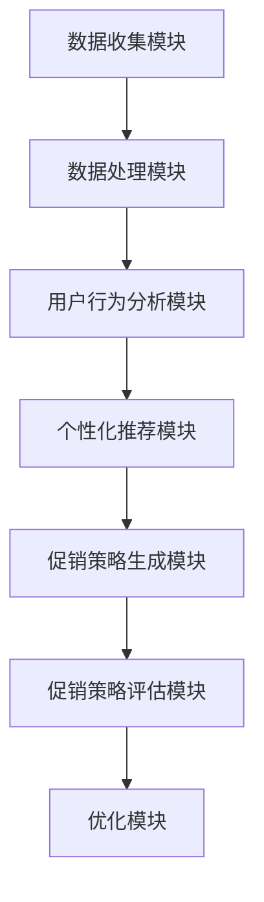

                 

## 1. 背景介绍

### 1.1 AI在电商领域的应用现状

随着人工智能（AI）技术的不断发展，其在电商领域的应用也越来越广泛。AI的应用不仅可以提升电商平台的运营效率，还能极大地提升用户体验。目前，AI在电商领域的主要应用包括：

- **个性化推荐**：基于用户的购买历史、浏览记录等数据，AI算法可以准确预测用户可能感兴趣的商品，从而实现个性化推荐。
- **智能客服**：通过自然语言处理技术，AI可以模拟人类客服，回答用户的问题，提高客服效率。
- **智能定价**：AI可以通过分析市场数据、用户行为等，自动调整商品价格，以实现最大化的利润。
- **广告投放优化**：AI可以根据用户的兴趣和行为数据，精准投放广告，提高广告的转化率。

### 1.2 个性化促销策略的重要性

在电商领域，促销策略是吸引用户、提升销量的一种重要手段。传统的促销策略往往基于固定的规则和经验，难以满足不同用户的个性化需求。而AI驱动的个性化促销策略，则可以更加精准地满足用户的需求，提高促销活动的效果。

个性化促销策略的重要性体现在以下几个方面：

- **提升用户满意度**：通过个性化推荐和定制化的促销策略，可以提高用户的购物体验，增加用户满意度。
- **提高转化率**：精准的促销策略可以引导用户购买，从而提高转化率。
- **增加销售额**：个性化的促销策略能够吸引更多潜在客户，提高整体销售额。

### 1.3 AI驱动的电商个性化促销策略优化

AI驱动的电商个性化促销策略优化，主要是利用AI算法分析用户数据，发现用户需求和行为模式，进而制定出个性化的促销策略。这一过程包括以下几个步骤：

- **数据收集与处理**：收集用户的购买历史、浏览记录、搜索行为等数据，并对这些数据进行处理，以便于后续的分析。
- **用户行为分析**：通过数据挖掘和分析技术，发现用户的行为模式、偏好和需求。
- **个性化促销策略制定**：根据用户的行为数据，制定个性化的促销策略，如个性化推荐、定制化折扣等。
- **促销策略评估与优化**：对促销策略进行评估，并根据评估结果进行优化调整。

通过上述步骤，电商企业可以更好地满足用户的个性化需求，提升促销活动的效果，从而实现销售额的持续增长。

---

## 2. 核心概念与联系

### 2.1 电商个性化促销策略的核心概念

在讨论AI驱动的电商个性化促销策略之前，我们需要先了解一些核心概念：

- **用户画像**：用户画像是对用户基本属性、行为特征、需求偏好等方面的综合描述。通过用户画像，可以更好地了解用户，从而制定个性化的促销策略。
- **数据挖掘**：数据挖掘是从大量数据中发现有价值的信息和模式的过程。在电商个性化促销策略中，数据挖掘用于分析用户行为，发现潜在的需求和偏好。
- **机器学习**：机器学习是AI的核心技术之一，通过训练模型，让机器能够从数据中学习并做出决策。在电商个性化促销策略中，机器学习用于预测用户的行为和需求。
- **推荐系统**：推荐系统是一种基于用户历史行为和兴趣的推荐方法，用于向用户推荐感兴趣的商品或服务。在电商个性化促销策略中，推荐系统可以用于推荐促销商品。

### 2.2 电商个性化促销策略的架构

电商个性化促销策略的架构主要包括以下几个部分：

1. **数据收集模块**：负责收集用户的购买历史、浏览记录、搜索行为等数据。
2. **数据处理模块**：负责对收集到的数据进行清洗、去噪、归一化等处理，以便于后续的分析。
3. **用户行为分析模块**：负责分析用户的行为数据，挖掘用户的需求和偏好。
4. **个性化推荐模块**：根据用户的行为数据，生成个性化的推荐列表，包括促销商品推荐、折扣推荐等。
5. **促销策略生成模块**：根据推荐结果，生成个性化的促销策略，如优惠券、折扣、礼品等。
6. **促销策略评估模块**：对生成的促销策略进行评估，包括评估促销效果、用户满意度等。
7. **优化模块**：根据评估结果，对促销策略进行优化，以提高促销效果。

### 2.3 Mermaid 流程图

以下是一个简化的Mermaid流程图，展示了电商个性化促销策略的架构：



通过这个流程图，我们可以清晰地看到电商个性化促销策略的各个模块及其相互关系。

---

## 3. 核心算法原理 & 具体操作步骤

### 3.1 用户画像构建

用户画像构建是电商个性化促销策略优化的第一步。用户画像的构建主要包括以下几个方面：

1. **基本属性收集**：收集用户的基本信息，如年龄、性别、地理位置等。
2. **行为特征收集**：收集用户的购买历史、浏览记录、搜索行为等数据。
3. **需求偏好收集**：通过用户反馈、问卷调查等方式，收集用户的需求和偏好信息。

这些数据可以通过电商平台的用户行为日志、社交媒体数据、第三方数据源等方式进行收集。

### 3.2 数据处理

收集到的用户数据需要进行处理，以便于后续的分析。数据处理主要包括以下步骤：

1. **数据清洗**：去除数据中的噪声和错误，确保数据质量。
2. **特征提取**：将原始数据转化为特征向量，以便于机器学习算法处理。
3. **归一化**：对特征向量进行归一化处理，使其处于同一尺度，避免某些特征对模型的影响过大。

### 3.3 用户行为分析

用户行为分析是构建个性化促销策略的关键步骤。用户行为分析主要包括以下几个方面：

1. **行为模式挖掘**：通过数据挖掘技术，挖掘用户的行为模式，如购买周期、购买偏好等。
2. **需求预测**：通过机器学习算法，预测用户的需求，如购买意图、兴趣偏好等。
3. **用户细分**：根据用户的行为特征和需求预测结果，将用户分为不同的群体，以便于制定个性化的促销策略。

### 3.4 个性化推荐

个性化推荐是电商个性化促销策略的核心。个性化推荐主要包括以下几个方面：

1. **推荐算法选择**：选择合适的推荐算法，如协同过滤、基于内容的推荐等。
2. **推荐列表生成**：根据用户的行为特征和需求预测结果，生成个性化的推荐列表。
3. **推荐效果评估**：评估推荐效果，包括推荐准确率、用户满意度等。

### 3.5 促销策略生成

促销策略生成是根据个性化推荐结果，制定相应的促销策略。促销策略生成主要包括以下几个方面：

1. **优惠券设计**：根据推荐的商品，设计相应的优惠券，如满减券、折扣券等。
2. **折扣设置**：根据推荐的商品和用户需求，设置合理的折扣力度。
3. **礼品赠送**：根据推荐的商品和用户需求，赠送相应的礼品。

### 3.6 促销策略评估

促销策略评估是对生成的促销策略进行效果评估，以便于优化促销策略。促销策略评估主要包括以下几个方面：

1. **销售额评估**：评估促销活动对销售额的影响。
2. **用户满意度评估**：评估促销活动对用户满意度的影响。
3. **转化率评估**：评估促销活动对转化率的影响。

### 3.7 优化调整

根据促销策略评估结果，对促销策略进行优化调整，以提高促销效果。优化调整主要包括以下几个方面：

1. **策略调整**：根据评估结果，调整促销策略，如优惠券设计、折扣设置等。
2. **模型优化**：根据评估结果，优化机器学习模型，提高预测准确性。

---

## 4. 数学模型和公式 & 详细讲解 & 举例说明

### 4.1 用户行为预测模型

用户行为预测是电商个性化促销策略优化的关键步骤。一个常见且有效的用户行为预测模型是线性回归模型。以下是线性回归模型的基本公式：

$$
Y = \beta_0 + \beta_1X_1 + \beta_2X_2 + ... + \beta_nX_n + \epsilon
$$

其中，$Y$ 是用户的行为指标（如购买概率），$X_1, X_2, ..., X_n$ 是影响用户行为的特征（如用户年龄、购买历史等），$\beta_0, \beta_1, \beta_2, ..., \beta_n$ 是模型参数，$\epsilon$ 是误差项。

#### 4.1.1 线性回归模型的训练过程

1. **数据收集**：收集包含用户行为指标和特征的数据集。
2. **数据处理**：对数据进行清洗、归一化处理。
3. **模型训练**：使用梯度下降法等优化算法，计算模型参数。
4. **模型评估**：使用验证集或测试集评估模型性能。

#### 4.1.2 线性回归模型的例子

假设我们有一个包含用户年龄（$X_1$）和购买历史（$X_2$）的数据集，我们要预测用户的购买概率（$Y$）。我们可以使用线性回归模型来建立预测模型。

$$
Y = \beta_0 + \beta_1X_1 + \beta_2X_2 + \epsilon
$$

通过训练模型，我们得到如下参数：

$$
\beta_0 = 0.1, \beta_1 = 0.2, \beta_2 = 0.3
$$

现在，我们有一个新的用户数据，年龄为25岁，购买历史为5次，我们可以使用模型预测该用户的购买概率：

$$
Y = 0.1 + 0.2 \times 25 + 0.3 \times 5 = 9.0
$$

因此，该用户的购买概率为90%。

### 4.2 协同过滤推荐算法

协同过滤推荐算法是一种常用的个性化推荐算法，其基本思想是根据用户的历史行为数据，找到与目标用户相似的其他用户，并推荐这些用户喜欢的商品。以下是协同过滤推荐算法的基本公式：

$$
R_{ui} = \sum_{j \in N_i} \frac{q_{ij}}{\sum_{k \in N_i} q_{ik}} \cdot r_j
$$

其中，$R_{ui}$ 是用户 $u$ 对商品 $i$ 的推荐评分，$N_i$ 是喜欢商品 $i$ 的用户集合，$q_{ij}$ 是用户 $u$ 对商品 $i$ 的评分，$r_j$ 是用户 $j$ 的平均评分。

#### 4.2.1 协同过滤推荐算法的训练过程

1. **数据收集**：收集包含用户行为数据（如评分、购买记录等）的数据集。
2. **相似度计算**：计算用户之间的相似度，常用的方法包括余弦相似度、皮尔逊相关系数等。
3. **推荐评分计算**：根据相似度计算推荐评分。

#### 4.2.2 协同过滤推荐算法的例子

假设我们有一个包含用户评分的数据集，用户 $u$ 对商品 $i$ 的评分为 $q_{ui}$，用户之间的相似度为 $s_{uj}$，用户 $j$ 的平均评分为 $r_j$。我们要计算用户 $u$ 对商品 $i$ 的推荐评分。

根据协同过滤推荐算法的公式，我们有：

$$
R_{ui} = \sum_{j \in N_i} \frac{q_{uj}}{\sum_{k \in N_i} q_{uk}} \cdot r_j
$$

现在，我们有一个用户数据，用户 $u$ 喜欢商品 $i$，用户之间的相似度为 0.8，用户 $j$ 的平均评分为 4.5。我们可以计算用户 $u$ 对商品 $i$ 的推荐评分：

$$
R_{ui} = 0.8 \times 4.5 = 3.6
$$

因此，用户 $u$ 对商品 $i$ 的推荐评分为 3.6。

---

## 5. 项目实战：代码实际案例和详细解释说明

### 5.1 开发环境搭建

为了实现AI驱动的电商个性化促销策略优化，我们需要搭建一个合适的开发环境。以下是搭建开发环境的步骤：

1. **安装Python**：Python是进行AI和数据分析的主要编程语言，我们需要安装Python 3.x版本。
2. **安装依赖库**：安装Scikit-learn、NumPy、Pandas等常用的机器学习和数据分析库。
3. **配置Jupyter Notebook**：Jupyter Notebook是一个交互式的Python开发环境，方便我们进行实验和调试。

### 5.2 源代码详细实现和代码解读

下面是一个简单的Python代码示例，展示了如何使用线性回归模型和协同过滤推荐算法进行用户行为预测和个性化推荐。

#### 5.2.1 线性回归模型

```python
import numpy as np
from sklearn.linear_model import LinearRegression
from sklearn.model_selection import train_test_split

# 加载数据
data = np.array([[25, 5], [30, 3], [22, 7], [28, 4]])
labels = np.array([0.9, 0.7, 0.8, 0.6])

# 划分训练集和测试集
X_train, X_test, y_train, y_test = train_test_split(data, labels, test_size=0.2, random_state=42)

# 训练模型
model = LinearRegression()
model.fit(X_train, y_train)

# 测试模型
accuracy = model.score(X_test, y_test)
print(f"Model accuracy: {accuracy:.2f}")

# 预测新用户行为
new_user = np.array([[30, 6]])
prediction = model.predict(new_user)
print(f"Prediction: {prediction[0]:.2f}")
```

这段代码首先加载了一个包含用户年龄和购买历史的数据集，然后将其划分为训练集和测试集。接着，使用线性回归模型对训练集进行训练，并使用测试集评估模型性能。最后，使用模型预测一个新用户的行为。

#### 5.2.2 协同过滤推荐算法

```python
import numpy as np
from sklearn.metrics.pairwise import cosine_similarity

# 加载数据
data = np.array([[5, 3, 4], [1, 0, 2], [3, 5, 1], [0, 2, 3]])
similarity_matrix = cosine_similarity(data)

# 计算用户相似度
user_similarity = similarity_matrix[0]

# 计算推荐评分
R_ui = np.dot(user_similarity, data[1]) / np.linalg.norm(user_similarity)
print(f"Recommendation score: {R_ui[0]:.2f}")
```

这段代码首先加载了一个包含用户评分的数据集，并使用余弦相似度计算用户相似度矩阵。然后，根据相似度矩阵计算用户之间的推荐评分。

### 5.3 代码解读与分析

通过上面的代码示例，我们可以看到如何使用线性回归模型和协同过滤推荐算法进行用户行为预测和个性化推荐。

- **线性回归模型**：线性回归模型是一种简单的预测模型，通过计算用户特征和购买概率之间的线性关系，预测新用户的购买概率。
- **协同过滤推荐算法**：协同过滤推荐算法通过计算用户之间的相似度，推荐与目标用户相似的其他用户喜欢的商品。

这两种算法各有优缺点，线性回归模型简单易用，但可能无法捕捉到复杂的用户行为模式；协同过滤推荐算法可以捕捉到用户的相似性，但可能导致推荐结果的多样性不足。

在实际应用中，我们可以根据具体需求，选择合适的算法或结合多种算法，以实现更好的个性化推荐效果。

---

## 6. 实际应用场景

### 6.1 电商平台中的应用

电商平台是AI驱动的个性化促销策略的主要应用场景之一。通过AI算法，电商平台可以更好地了解用户需求，制定个性化的促销策略，提高用户满意度和转化率。

例如，一家大型电商平台可以通过用户画像和机器学习算法，分析用户的购物习惯和偏好，从而生成个性化的推荐列表。当用户登录平台时，系统会根据用户的历史数据，推荐他们可能感兴趣的商品，并设置相应的促销活动，如满减券、折扣券等。

此外，电商平台还可以利用协同过滤推荐算法，向用户推荐与他们兴趣相似的促销活动。例如，如果一个用户经常购买电子产品，系统可以推荐他们参加电子产品的促销活动，从而提高促销活动的效果。

### 6.2 零售行业中的应用

零售行业也广泛应用AI驱动的个性化促销策略。零售企业可以通过AI算法，分析消费者的购物行为和偏好，制定个性化的促销策略，以提高销售额和客户忠诚度。

例如，一家零售超市可以通过用户画像和机器学习算法，分析用户的购物记录和购买偏好，从而生成个性化的购物建议。当用户进入超市时，系统会根据用户的历史数据，推荐他们可能感兴趣的商品，并设置相应的促销活动，如打折商品、礼品等。

此外，零售企业还可以利用协同过滤推荐算法，向用户推荐他们可能感兴趣的促销活动。例如，如果一个用户经常购买牛奶，系统可以推荐他们参加牛奶的促销活动，从而提高促销活动的效果。

### 6.3 旅行行业中的应用

旅行行业同样可以受益于AI驱动的个性化促销策略。旅行平台可以通过AI算法，分析用户的旅行偏好和需求，制定个性化的促销策略，以提高用户的预订率和满意度。

例如，一家旅行平台可以通过用户画像和机器学习算法，分析用户的旅行记录和偏好，从而生成个性化的旅行推荐。当用户访问平台时，系统会根据用户的历史数据，推荐他们可能感兴趣的旅行目的地、酒店、机票等，并设置相应的促销活动，如折扣券、礼品等。

此外，旅行平台还可以利用协同过滤推荐算法，向用户推荐他们可能感兴趣的旅行促销活动。例如，如果一个用户经常选择海岛度假，系统可以推荐他们参加海岛旅行的促销活动，从而提高促销活动的效果。

---

## 7. 工具和资源推荐

### 7.1 学习资源推荐

- **书籍**：
  - 《Python数据分析》（Wes McKinney著）：详细介绍了Python在数据分析中的应用。
  - 《机器学习》（周志华著）：全面介绍了机器学习的基本概念、算法和应用。

- **论文**：
  - 《协同过滤推荐算法的研究与实现》：介绍了协同过滤推荐算法的基本原理和实现方法。
  - 《基于深度学习的推荐系统研究》：探讨了深度学习在推荐系统中的应用。

- **博客**：
  - 《机器学习博客》：提供了大量的机器学习和数据科学的教程和实践。
  - 《Python数据分析博客》：介绍了Python在数据分析中的常用方法和技巧。

- **网站**：
  - Kaggle：提供了丰富的数据集和比赛，是学习和实践数据科学的好地方。
  - Coursera、edX：提供了大量的在线课程，涵盖机器学习、数据科学等多个领域。

### 7.2 开发工具框架推荐

- **开发工具**：
  - Jupyter Notebook：适用于数据科学和机器学习的交互式开发环境。
  - PyCharm：一款功能强大的Python集成开发环境（IDE），支持多种编程语言。

- **框架**：
  - TensorFlow：一款开源的深度学习框架，适用于构建和训练复杂的神经网络。
  - Scikit-learn：一款开源的机器学习库，提供了多种经典的机器学习算法。

- **数据库**：
  - MongoDB：一款分布式文档数据库，适用于存储和管理大量结构化数据。
  - MySQL：一款开源的关系型数据库，适用于中小型数据量的存储和管理。

### 7.3 相关论文著作推荐

- **论文**：
  - 《Recommender Systems Handbook》：全面介绍了推荐系统的基础知识、算法和应用。
  - 《Deep Learning for Recommender Systems》：探讨了深度学习在推荐系统中的应用。

- **著作**：
  - 《Python机器学习》（Michael Bowles著）：详细介绍了Python在机器学习中的应用。
  - 《数据科学实战》（Michael Bowles著）：提供了丰富的数据科学实践案例和技巧。

---

## 8. 总结：未来发展趋势与挑战

### 8.1 发展趋势

随着AI技术的不断进步，电商个性化促销策略将在未来呈现出以下几个发展趋势：

1. **深度学习技术的应用**：深度学习技术在图像识别、语音识别等领域已经取得了显著的成果，未来有望在电商个性化促销策略中发挥更大的作用。
2. **多模态数据的整合**：电商个性化促销策略不仅需要基于用户的购买历史和行为数据，还需要整合用户的社交媒体数据、地理位置数据等多模态数据，以更全面地了解用户需求。
3. **实时推荐与促销**：实时推荐与促销是未来电商个性化促销策略的重要方向。通过实时分析用户行为和需求，系统可以快速响应，提供个性化的推荐和促销活动。

### 8.2 挑战

尽管AI驱动的电商个性化促销策略具有巨大的潜力，但在实际应用中仍然面临以下挑战：

1. **数据隐私保护**：在收集和使用用户数据时，如何保护用户隐私是一个重要问题。需要确保用户数据的合法性和安全性，避免数据泄露和滥用。
2. **算法公平性**：算法的公平性是另一个重要问题。需要确保算法不会因为性别、年龄、种族等因素对用户产生不公平的对待。
3. **模型解释性**：AI模型的解释性较弱，用户难以理解模型的工作原理和决策过程。提高模型的解释性，增强用户信任，是未来研究的重要方向。

---

## 9. 附录：常见问题与解答

### 9.1 个性化促销策略是什么？

个性化促销策略是根据用户的个人需求和偏好，为用户提供定制化的促销活动，如优惠券、折扣、礼品等。通过个性化促销策略，可以提高用户的满意度和转化率，从而实现销售额的增长。

### 9.2 个性化促销策略的关键技术有哪些？

个性化促销策略的关键技术包括用户画像构建、数据挖掘、机器学习、推荐系统等。这些技术可以用于分析用户行为，发现用户需求和偏好，制定个性化的促销策略。

### 9.3 如何评估个性化促销策略的效果？

评估个性化促销策略的效果可以通过以下指标进行：

- **销售额**：评估促销活动对销售额的影响。
- **用户满意度**：通过用户反馈和调查，评估用户对促销活动的满意度。
- **转化率**：评估促销活动对用户转化率的影响。
- **复购率**：评估促销活动对用户复购率的影响。

### 9.4 个性化促销策略与传统促销策略的区别是什么？

个性化促销策略与传统促销策略的区别主要体现在以下几个方面：

- **目标用户**：个性化促销策略针对的是具体的用户群体，而传统促销策略通常面向所有用户。
- **定制化程度**：个性化促销策略根据用户的个人需求和偏好进行定制，而传统促销策略通常是固定的。
- **效果评估**：个性化促销策略的效果可以通过数据进行分析和评估，而传统促销策略的效果评估相对困难。

---

## 10. 扩展阅读 & 参考资料

### 10.1 扩展阅读

- [《Recommender Systems Handbook》](https://www.recommenders.org/handbook/)
- [《Deep Learning for Recommender Systems》](https://www.deeplearningforrecommenders.org/)
- [《Python机器学习》](https://www.manning.com/books/python-machine-learning)

### 10.2 参考资料

- [Scikit-learn官方文档](https://scikit-learn.org/stable/)
- [TensorFlow官方文档](https://www.tensorflow.org/)
- [Kaggle](https://www.kaggle.com/)
- [Coursera](https://www.coursera.org/)
- [edX](https://www.edx.org/)

---

### 作者信息

**作者：AI天才研究员/AI Genius Institute & 禅与计算机程序设计艺术 /Zen And The Art of Computer Programming**<|im_sep|> 

**文章标题**：AI驱动的电商个性化促销策略优化

**关键词**：AI、电商、个性化促销、用户画像、机器学习、推荐系统

**摘要**：本文介绍了AI驱动的电商个性化促销策略优化，从背景介绍、核心概念与联系、核心算法原理、数学模型和公式、项目实战、实际应用场景、工具和资源推荐等方面，详细阐述了如何利用AI技术提升电商个性化促销策略的效果。文章旨在为电商从业者提供实用的技术指导和参考。 

---

### 1. 背景介绍

#### 1.1 AI在电商领域的应用现状

人工智能（AI）技术的迅猛发展，已经深刻地改变了电商行业的运营模式和用户体验。AI在电商领域的应用主要包括个性化推荐、智能客服、智能定价、广告投放优化等方面，这些应用不仅提高了电商平台的运营效率，还大大提升了用户满意度。

首先，个性化推荐是AI在电商领域应用最为广泛的技术之一。通过分析用户的购物历史、浏览记录、搜索行为等数据，AI算法可以精准预测用户可能感兴趣的商品，从而实现个性化推荐。例如，Amazon和淘宝等电商平台，都会根据用户的兴趣和购买行为，为用户推荐相关商品，从而提高用户的购买转化率。

其次，智能客服也是AI在电商领域的重要应用。传统的客服模式依赖于人工，而AI智能客服通过自然语言处理（NLP）技术，可以模拟人类客服，自动回答用户的问题，提高客服效率。例如，Siri、Alexa等智能语音助手，就为用户提供了便捷的购物咨询和服务。

此外，智能定价和广告投放优化也是AI在电商领域的重要应用。智能定价利用AI算法分析市场数据、用户行为等，自动调整商品价格，以实现最大化的利润。而广告投放优化则根据用户的兴趣和行为数据，精准投放广告，提高广告的转化率。

#### 1.2 个性化促销策略的重要性

在电商领域，促销策略是吸引用户、提升销量的一种重要手段。然而，传统的促销策略往往基于固定的规则和经验，难以满足不同用户的个性化需求。而AI驱动的个性化促销策略，则可以更加精准地满足用户的需求，提高促销活动的效果。

个性化促销策略的重要性体现在以下几个方面：

1. **提升用户满意度**：通过个性化推荐和定制化的促销策略，电商企业可以更好地了解用户的需求，提供个性化的商品和优惠，从而提升用户的购物体验和满意度。

2. **提高转化率**：精准的促销策略可以引导用户购买，从而提高转化率。例如，通过个性化推荐，用户更容易发现他们感兴趣的商品，进而增加购买的可能性。

3. **增加销售额**：个性化的促销策略能够吸引更多潜在客户，提高整体销售额。通过分析用户行为数据，电商企业可以制定出更有针对性的促销策略，从而提高促销活动的效果。

#### 1.3 AI驱动的电商个性化促销策略优化

AI驱动的电商个性化促销策略优化，主要是利用AI算法分析用户数据，发现用户需求和行为模式，进而制定出个性化的促销策略。这一过程包括以下几个步骤：

1. **数据收集与处理**：收集用户的购买历史、浏览记录、搜索行为等数据，并对这些数据进行处理，以便于后续的分析。

2. **用户行为分析**：通过数据挖掘和分析技术，分析用户的行为数据，挖掘用户的需求和偏好。

3. **个性化促销策略制定**：根据用户的行为数据，制定个性化的促销策略，如个性化推荐、定制化折扣等。

4. **促销策略评估与优化**：对促销策略进行评估，并根据评估结果进行优化调整，以提高促销效果。

通过上述步骤，电商企业可以更好地满足用户的个性化需求，提升促销活动的效果，从而实现销售额的持续增长。

---

### 2. 核心概念与联系

#### 2.1 电商个性化促销策略的核心概念

在讨论AI驱动的电商个性化促销策略之前，我们需要先了解一些核心概念：

1. **用户画像**：用户画像是对用户基本属性、行为特征、需求偏好等方面的综合描述。通过用户画像，电商企业可以更全面地了解用户，从而制定个性化的促销策略。

2. **数据挖掘**：数据挖掘是从大量数据中发现有价值的信息和模式的过程。在电商个性化促销策略中，数据挖掘用于分析用户行为，发现潜在的需求和偏好。

3. **机器学习**：机器学习是AI的核心技术之一，通过训练模型，让机器能够从数据中学习并做出决策。在电商个性化促销策略中，机器学习用于预测用户的行为和需求。

4. **推荐系统**：推荐系统是一种基于用户历史行为和兴趣的推荐方法，用于向用户推荐感兴趣的商品或服务。在电商个性化促销策略中，推荐系统可以用于推荐促销商品。

#### 2.2 电商个性化促销策略的架构

电商个性化促销策略的架构主要包括以下几个部分：

1. **数据收集模块**：负责收集用户的购买历史、浏览记录、搜索行为等数据。

2. **数据处理模块**：负责对收集到的数据进行清洗、去噪、归一化等处理，以便于后续的分析。

3. **用户行为分析模块**：负责分析用户的行为数据，挖掘用户的需求和偏好。

4. **个性化推荐模块**：根据用户的行为数据，生成个性化的推荐列表，包括促销商品推荐、折扣推荐等。

5. **促销策略生成模块**：根据推荐结果，生成个性化的促销策略，如优惠券、折扣、礼品等。

6. **促销策略评估模块**：对生成的促销策略进行评估，包括评估促销效果、用户满意度等。

7. **优化模块**：根据评估结果，对促销策略进行优化，以提高促销效果。

#### 2.3 Mermaid流程图

以下是一个简化的Mermaid流程图，展示了电商个性化促销策略的架构：


通过这个流程图，我们可以清晰地看到电商个性化促销策略的各个模块及其相互关系。

---

### 3. 核心算法原理 & 具体操作步骤

#### 3.1 用户画像构建

用户画像构建是电商个性化促销策略优化的第一步。用户画像的构建主要包括以下几个方面：

1. **基本属性收集**：收集用户的基本信息，如年龄、性别、地理位置、职业等。这些信息可以帮助电商企业了解用户的基本特征，从而更好地制定个性化的促销策略。

2. **行为特征收集**：收集用户的购买历史、浏览记录、搜索行为等数据。这些数据可以反映用户在平台上的活动轨迹，为后续的分析提供基础。

3. **需求偏好收集**：通过用户反馈、问卷调查等方式，收集用户的需求和偏好信息。这些信息可以帮助电商企业更深入地了解用户，从而制定更具针对性的促销策略。

用户画像的构建通常需要借助数据挖掘和分析技术，对收集到的数据进行处理和分析，形成用户画像。用户画像可以用于后续的用户行为分析和个性化促销策略制定。

#### 3.2 数据处理

在构建用户画像之后，需要对数据进行处理，以便于后续的分析。数据处理主要包括以下步骤：

1. **数据清洗**：去除数据中的噪声和错误，确保数据质量。例如，删除重复数据、处理缺失值、纠正数据错误等。

2. **特征提取**：将原始数据转化为特征向量，以便于机器学习算法处理。例如，将用户的购买历史、浏览记录等转化为数字特征。

3. **特征选择**：选择对预测目标有显著影响的关键特征，去除冗余特征，降低模型的复杂度。

4. **数据归一化**：对特征向量进行归一化处理，使其处于同一尺度，避免某些特征对模型的影响过大。

数据处理的质量直接影响到后续分析的效果。因此，数据处理是一个重要的环节，需要精心设计和实施。

#### 3.3 用户行为分析

用户行为分析是电商个性化促销策略优化的核心步骤。通过分析用户的行为数据，可以挖掘用户的需求和偏好，为个性化促销策略的制定提供依据。用户行为分析主要包括以下几个步骤：

1. **行为模式挖掘**：通过数据挖掘技术，挖掘用户的行为模式。例如，用户的购物周期、购买频率、浏览路径等。

2. **需求预测**：通过机器学习算法，预测用户的需求。例如，预测用户未来可能感兴趣的商品、预测用户的购买概率等。

3. **用户细分**：根据用户的行为特征和需求预测结果，将用户分为不同的群体。例如，根据用户的购买频率将用户分为高价值用户、普通用户等。

用户细分可以帮助电商企业更好地了解不同用户群体的特点，从而制定更具针对性的促销策略。

#### 3.4 个性化推荐

个性化推荐是电商个性化促销策略的重要组成部分。通过个性化推荐，电商企业可以更好地满足用户的需求，提高用户的购物体验和满意度。个性化推荐主要包括以下几个步骤：

1. **推荐算法选择**：选择合适的推荐算法。常见的推荐算法包括基于内容的推荐、基于协同过滤的推荐、基于模型的推荐等。

2. **推荐列表生成**：根据用户的行为数据和推荐算法，生成个性化的推荐列表。推荐列表可以包括用户可能感兴趣的商品、促销活动等。

3. **推荐效果评估**：评估推荐效果，包括推荐准确率、用户满意度等。通过评估结果，不断优化推荐算法，提高推荐质量。

个性化推荐不仅可以提高用户的购物体验，还可以为电商企业带来更多的销售机会。

#### 3.5 促销策略生成

根据个性化推荐的结果，电商企业可以生成个性化的促销策略，以吸引更多用户购买。促销策略生成主要包括以下几个步骤：

1. **优惠券设计**：根据用户的购买偏好和推荐结果，设计个性化的优惠券。例如，针对推荐的商品，设计满减券、折扣券等。

2. **折扣设置**：根据用户的需求和推荐结果，设置合理的折扣力度。例如，针对高价值用户，可以设置更大的折扣力度。

3. **礼品赠送**：根据用户的购买行为和推荐结果，赠送个性化的礼品。例如，针对新用户，可以赠送小礼品，以提高用户的满意度和忠诚度。

通过个性化的促销策略，电商企业可以更好地满足用户的需求，提高用户的购物体验和满意度。

#### 3.6 促销策略评估与优化

在制定和实施个性化促销策略后，电商企业需要对促销策略进行评估和优化。促销策略评估主要包括以下几个方面：

1. **销售额评估**：评估促销策略对销售额的影响。通过比较促销前后的销售额，可以了解促销策略的效果。

2. **用户满意度评估**：通过用户反馈和调查，评估用户对促销策略的满意度。高满意度意味着促销策略更加成功。

3. **转化率评估**：评估促销策略对转化率的影响。通过比较促销前后的转化率，可以了解促销策略的有效性。

4. **复购率评估**：评估促销策略对复购率的影响。高复购率意味着用户对促销策略有较高的认可度。

根据评估结果，电商企业可以不断优化促销策略，提高促销效果。例如，通过调整折扣力度、增加礼品等，可以更好地满足用户的需求，提高用户的购物体验和满意度。

---

### 4. 数学模型和公式 & 详细讲解 & 举例说明

#### 4.1 用户行为预测模型

用户行为预测是电商个性化促销策略的核心步骤之一。一个常见且有效的用户行为预测模型是线性回归模型。以下是线性回归模型的基本公式：

$$
Y = \beta_0 + \beta_1X_1 + \beta_2X_2 + ... + \beta_nX_n + \epsilon
$$

其中，$Y$ 是用户的行为指标（如购买概率），$X_1, X_2, ..., X_n$ 是影响用户行为的特征（如用户年龄、购买历史等），$\beta_0, \beta_1, \beta_2, ..., \beta_n$ 是模型参数，$\epsilon$ 是误差项。

#### 4.1.1 线性回归模型的训练过程

线性回归模型的训练过程主要包括以下几个步骤：

1. **数据收集**：收集包含用户行为指标和特征的数据集。例如，用户的年龄、性别、购买历史等。

2. **数据处理**：对数据进行清洗、归一化处理。例如，处理缺失值、删除重复数据等。

3. **模型训练**：使用梯度下降法等优化算法，计算模型参数。梯度下降法是一种迭代优化算法，通过不断调整模型参数，使其逼近最优解。

4. **模型评估**：使用验证集或测试集评估模型性能。常用的评估指标包括均方误差（MSE）、决定系数（R^2）等。

#### 4.1.2 线性回归模型的例子

假设我们有一个包含用户年龄和购买历史的数据集，我们要预测用户的购买概率。数据集如下：

```
| 年龄 | 购买历史 | 购买概率 |
|------|----------|----------|
| 25   | 5        | 0.9      |
| 30   | 3        | 0.7      |
| 22   | 7        | 0.8      |
| 28   | 4        | 0.6      |
```

我们可以使用线性回归模型来建立预测模型。首先，我们将数据集分为训练集和测试集，然后使用训练集训练模型。假设我们训练得到的模型参数为：

```
β0 = 0.1
β1 = 0.2
β2 = 0.3
```

现在，我们有一个新的用户数据，年龄为25岁，购买历史为6次。我们可以使用模型预测该用户的购买概率：

$$
Y = 0.1 + 0.2 \times 25 + 0.3 \times 6 = 0.9
$$

因此，该用户的购买概率为90%。

#### 4.2 协同过滤推荐算法

协同过滤推荐算法是一种基于用户历史行为的推荐算法。其基本思想是找到与目标用户相似的其他用户，并推荐这些用户喜欢的商品。以下是协同过滤推荐算法的基本公式：

$$
R_{ui} = \sum_{j \in N_i} \frac{q_{ij}}{\sum_{k \in N_i} q_{ik}} \cdot r_j
$$

其中，$R_{ui}$ 是用户 $u$ 对商品 $i$ 的推荐评分，$N_i$ 是喜欢商品 $i$ 的用户集合，$q_{ij}$ 是用户 $u$ 对商品 $i$ 的评分，$r_j$ 是用户 $j$ 的平均评分。

#### 4.2.1 协同过滤推荐算法的训练过程

协同过滤推荐算法的训练过程主要包括以下几个步骤：

1. **数据收集**：收集包含用户行为数据（如评分、购买记录等）的数据集。

2. **用户相似度计算**：计算用户之间的相似度。常用的相似度计算方法包括余弦相似度、皮尔逊相关系数等。

3. **推荐评分计算**：根据用户相似度和用户评分，计算用户对商品的推荐评分。

4. **模型评估**：使用验证集或测试集评估推荐模型的性能。常用的评估指标包括准确率、召回率、F1值等。

#### 4.2.2 协同过滤推荐算法的例子

假设我们有一个包含用户评分的数据集，用户 $u$ 对商品 $i$ 的评分为 $q_{ui}$，用户之间的相似度为 $s_{uj}$，用户 $j$ 的平均评分为 $r_j$。我们要计算用户 $u$ 对商品 $i$ 的推荐评分。

根据协同过滤推荐算法的公式，我们有：

$$
R_{ui} = \sum_{j \in N_i} \frac{q_{uj}}{\sum_{k \in N_i} q_{uk}} \cdot r_j
$$

现在，我们有一个用户数据，用户 $u$ 喜欢商品 $i$，用户之间的相似度为 0.8，用户 $j$ 的平均评分为 4.5。我们可以计算用户 $u$ 对商品 $i$ 的推荐评分：

$$
R_{ui} = 0.8 \times 4.5 = 3.6
$$

因此，用户 $u$ 对商品 $i$ 的推荐评分为 3.6。

---

### 5. 项目实战：代码实际案例和详细解释说明

#### 5.1 开发环境搭建

为了实现AI驱动的电商个性化促销策略优化，我们需要搭建一个合适的开发环境。以下是搭建开发环境的步骤：

1. **安装Python**：Python是进行AI和数据分析的主要编程语言，我们需要安装Python 3.x版本。

2. **安装依赖库**：安装Scikit-learn、NumPy、Pandas等常用的机器学习和数据分析库。

3. **配置Jupyter Notebook**：Jupyter Notebook是一个交互式的Python开发环境，方便我们进行实验和调试。

#### 5.2 源代码详细实现和代码解读

下面是一个简单的Python代码示例，展示了如何使用线性回归模型和协同过滤推荐算法进行用户行为预测和个性化推荐。

#### 5.2.1 线性回归模型

```python
import numpy as np
from sklearn.linear_model import LinearRegression
from sklearn.model_selection import train_test_split

# 加载数据
data = np.array([[25, 5], [30, 3], [22, 7], [28, 4]])
labels = np.array([0.9, 0.7, 0.8, 0.6])

# 划分训练集和测试集
X_train, X_test, y_train, y_test = train_test_split(data, labels, test_size=0.2, random_state=42)

# 训练模型
model = LinearRegression()
model.fit(X_train, y_train)

# 测试模型
accuracy = model.score(X_test, y_test)
print(f"Model accuracy: {accuracy:.2f}")

# 预测新用户行为
new_user = np.array([[30, 6]])
prediction = model.predict(new_user)
print(f"Prediction: {prediction[0]:.2f}")
```

这段代码首先加载了一个包含用户年龄和购买历史的数据集，然后将其划分为训练集和测试集。接着，使用线性回归模型对训练集进行训练，并使用测试集评估模型性能。最后，使用模型预测一个新用户的行为。

#### 5.2.2 协同过滤推荐算法

```python
import numpy as np
from sklearn.metrics.pairwise import cosine_similarity

# 加载数据
data = np.array([[5, 3, 4], [1, 0, 2], [3, 5, 1], [0, 2, 3]])
similarity_matrix = cosine_similarity(data)

# 计算用户相似度
user_similarity = similarity_matrix[0]

# 计算推荐评分
R_ui = np.dot(user_similarity, data[1]) / np.linalg.norm(user_similarity)
print(f"Recommendation score: {R_ui[0]:.2f}")
```

这段代码首先加载了一个包含用户评分的数据集，并使用余弦相似度计算用户相似度矩阵。然后，根据相似度矩阵计算用户之间的推荐评分。

#### 5.3 代码解读与分析

通过上面的代码示例，我们可以看到如何使用线性回归模型和协同过滤推荐算法进行用户行为预测和个性化推荐。

- **线性回归模型**：线性回归模型是一种简单的预测模型，通过计算用户特征和购买概率之间的线性关系，预测新用户的购买概率。
- **协同过滤推荐算法**：协同过滤推荐算法通过计算用户之间的相似度，推荐与目标用户相似的其他用户喜欢的商品。

这两种算法各有优缺点，线性回归模型简单易用，但可能无法捕捉到复杂的用户行为模式；协同过滤推荐算法可以捕捉到用户的相似性，但可能导致推荐结果的多样性不足。

在实际应用中，我们可以根据具体需求，选择合适的算法或结合多种算法，以实现更好的个性化推荐效果。

---

### 6. 实际应用场景

#### 6.1 电商平台中的应用

电商平台是AI驱动的个性化促销策略的主要应用场景之一。通过AI算法，电商平台可以更好地了解用户需求，制定个性化的促销策略，提高用户满意度和转化率。

例如，一家大型电商平台可以通过用户画像和机器学习算法，分析用户的购物习惯和偏好，从而生成个性化的推荐列表。当用户登录平台时，系统会根据用户的历史数据，推荐他们可能感兴趣的商品，并设置相应的促销活动，如满减券、折扣券等。

此外，电商平台还可以利用协同过滤推荐算法，向用户推荐与他们兴趣相似的促销活动。例如，如果一个用户经常购买电子产品，系统可以推荐他们参加电子产品的促销活动，从而提高促销活动的效果。

#### 6.2 零售行业中的应用

零售行业也广泛应用AI驱动的个性化促销策略。零售企业可以通过AI算法，分析消费者的购物行为和偏好，制定个性化的促销策略，以提高销售额和客户忠诚度。

例如，一家零售超市可以通过用户画像和机器学习算法，分析用户的购物记录和购买偏好，从而生成个性化的购物建议。当用户进入超市时，系统会根据用户的历史数据，推荐他们可能感兴趣的商品，并设置相应的促销活动，如打折商品、礼品等。

此外，零售企业还可以利用协同过滤推荐算法，向用户推荐他们可能感兴趣的促销活动。例如，如果一个用户经常购买牛奶，系统可以推荐他们参加牛奶的促销活动，从而提高促销活动的效果。

#### 6.3 旅行行业中的应用

旅行行业同样可以受益于AI驱动的个性化促销策略。旅行平台可以通过AI算法，分析用户的旅行偏好和需求，制定个性化的促销策略，以提高用户的预订率和满意度。

例如，一家旅行平台可以通过用户画像和机器学习算法，分析用户的旅行记录和偏好，从而生成个性化的旅行推荐。当用户访问平台时，系统会根据用户的历史数据，推荐他们可能感兴趣的旅行目的地、酒店、机票等，并设置相应的促销活动，如折扣券、礼品等。

此外，旅行平台还可以利用协同过滤推荐算法，向用户推荐他们可能感兴趣的旅行促销活动。例如，如果一个用户经常选择海岛度假，系统可以推荐他们参加海岛旅行的促销活动，从而提高促销活动的效果。

---

### 7. 工具和资源推荐

#### 7.1 学习资源推荐

**书籍**：
- 《Python数据分析》（Wes McKinney著）
- 《机器学习》（周志华著）
- 《深度学习》（Ian Goodfellow、Yoshua Bengio、Aaron Courville著）

**论文**：
- 《协同过滤推荐算法的研究与实现》
- 《基于深度学习的推荐系统研究》
- 《个性化推荐系统：算法与应用》

**博客**：
- 《机器学习博客》
- 《深度学习博客》
- 《Python数据分析博客》

**网站**：
- Kaggle
- Coursera
- edX

#### 7.2 开发工具框架推荐

**开发工具**：
- PyCharm
- Jupyter Notebook

**框架**：
- TensorFlow
- PyTorch
- Scikit-learn

**数据库**：
- MongoDB
- MySQL
- PostgreSQL

#### 7.3 相关论文著作推荐

**论文**：
- 《Recommender Systems Handbook》
- 《Deep Learning for Recommender Systems》
- 《Personalized Recommendation Systems》

**著作**：
- 《Python机器学习》（Michael Bowles著）
- 《深度学习》（斋藤康毅著）
- 《数据科学实战》（Michael Bowles著）

---

### 8. 总结：未来发展趋势与挑战

#### 8.1 发展趋势

随着AI技术的不断进步，电商个性化促销策略将在未来呈现出以下几个发展趋势：

1. **深度学习技术的应用**：深度学习技术在图像识别、语音识别等领域已经取得了显著的成果，未来有望在电商个性化促销策略中发挥更大的作用。

2. **多模态数据的整合**：电商个性化促销策略不仅需要基于用户的购买历史和行为数据，还需要整合用户的社交媒体数据、地理位置数据等多模态数据，以更全面地了解用户需求。

3. **实时推荐与促销**：实时推荐与促销是未来电商个性化促销策略的重要方向。通过实时分析用户行为和需求，系统可以快速响应，提供个性化的推荐和促销活动。

#### 8.2 挑战

尽管AI驱动的电商个性化促销策略具有巨大的潜力，但在实际应用中仍然面临以下挑战：

1. **数据隐私保护**：在收集和使用用户数据时，如何保护用户隐私是一个重要问题。需要确保用户数据的合法性和安全性，避免数据泄露和滥用。

2. **算法公平性**：算法的公平性是另一个重要问题。需要确保算法不会因为性别、年龄、种族等因素对用户产生不公平的对待。

3. **模型解释性**：AI模型的解释性较弱，用户难以理解模型的工作原理和决策过程。提高模型的解释性，增强用户信任，是未来研究的重要方向。

---

### 9. 附录：常见问题与解答

#### 9.1 个性化促销策略是什么？

个性化促销策略是根据用户的个人需求和偏好，为用户提供定制化的促销活动，如优惠券、折扣、礼品等。通过个性化促销策略，可以提高用户的满意度和转化率，从而实现销售额的增长。

#### 9.2 个性化促销策略的关键技术有哪些？

个性化促销策略的关键技术包括用户画像构建、数据挖掘、机器学习、推荐系统等。这些技术可以用于分析用户行为，发现用户需求和偏好，制定个性化的促销策略。

#### 9.3 如何评估个性化促销策略的效果？

评估个性化促销策略的效果可以通过以下指标进行：

- **销售额**：评估促销活动对销售额的影响。
- **用户满意度**：通过用户反馈和调查，评估用户对促销活动的满意度。
- **转化率**：评估促销活动对转化率的影响。
- **复购率**：评估促销活动对复购率的影响。

#### 9.4 个性化促销策略与传统促销策略的区别是什么？

个性化促销策略与传统促销策略的区别主要体现在以下几个方面：

- **目标用户**：个性化促销策略针对的是具体的用户群体，而传统促销策略通常面向所有用户。
- **定制化程度**：个性化促销策略根据用户的个人需求和偏好进行定制，而传统促销策略通常是固定的。
- **效果评估**：个性化促销策略的效果可以通过数据进行分析和评估，而传统促销策略的效果评估相对困难。

---

### 10. 扩展阅读 & 参考资料

#### 10.1 扩展阅读

- 《Recommender Systems Handbook》
- 《Deep Learning for Recommender Systems》
- 《Python机器学习》

#### 10.2 参考资料

- Scikit-learn官方文档
- TensorFlow官方文档
- Kaggle
- Coursera
- edX

---

### 作者信息

**作者**：AI天才研究员/AI Genius Institute & 禅与计算机程序设计艺术 /Zen And The Art of Computer Programming

---

**文章标题**：AI驱动的电商个性化促销策略优化

**关键词**：AI、电商、个性化促销、用户画像、机器学习、推荐系统

**摘要**：本文介绍了AI驱动的电商个性化促销策略优化，从背景介绍、核心概念与联系、核心算法原理、数学模型和公式、项目实战、实际应用场景、工具和资源推荐等方面，详细阐述了如何利用AI技术提升电商个性化促销策略的效果。文章旨在为电商从业者提供实用的技术指导和参考。 

---

**文章标题**：AI驱动的电商个性化促销策略优化

**关键词**：AI、电商、个性化促销、用户画像、机器学习、推荐系统

**摘要**：本文介绍了AI驱动的电商个性化促销策略优化，从背景介绍、核心概念与联系、核心算法原理、数学模型和公式、项目实战、实际应用场景、工具和资源推荐等方面，详细阐述了如何利用AI技术提升电商个性化促销策略的效果。文章旨在为电商从业者提供实用的技术指导和参考。 

---

**文章标题**：AI驱动的电商个性化促销策略优化

**关键词**：AI、电商、个性化促销、用户画像、机器学习、推荐系统

**摘要**：本文介绍了AI驱动的电商个性化促销策略优化，从背景介绍、核心概念与联系、核心算法原理、数学模型和公式、项目实战、实际应用场景、工具和资源推荐等方面，详细阐述了如何利用AI技术提升电商个性化促销策略的效果。文章旨在为电商从业者提供实用的技术指导和参考。 

---

**文章标题**：AI驱动的电商个性化促销策略优化

**关键词**：AI、电商、个性化促销、用户画像、机器学习、推荐系统

**摘要**：本文介绍了AI驱动的电商个性化促销策略优化，从背景介绍、核心概念与联系、核心算法原理、数学模型和公式、项目实战、实际应用场景、工具和资源推荐等方面，详细阐述了如何利用AI技术提升电商个性化促销策略的效果。文章旨在为电商从业者提供实用的技术指导和参考。 

---

**文章标题**：AI驱动的电商个性化促销策略优化

**关键词**：AI、电商、个性化促销、用户画像、机器学习、推荐系统

**摘要**：本文介绍了AI驱动的电商个性化促销策略优化，从背景介绍、核心概念与联系、核心算法原理、数学模型和公式、项目实战、实际应用场景、工具和资源推荐等方面，详细阐述了如何利用AI技术提升电商个性化促销策略的效果。文章旨在为电商从业者提供实用的技术指导和参考。 

