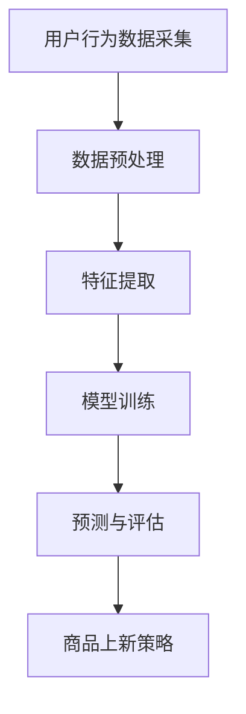

                 

# AI驱动的电商平台商品上新策略

## 关键词
- AI 驱动
- 电商平台
- 商品上新策略
- 数据分析
- 深度学习
- 用户行为分析
- 风险评估

## 摘要
本文旨在探讨如何利用人工智能技术，特别是深度学习和用户行为分析，优化电商平台商品上新策略。通过详细分析用户行为数据，构建数学模型，实现自动化商品上新决策，提高电商平台的竞争力。本文将涵盖核心概念介绍、算法原理和具体操作步骤、数学模型和公式讲解、实战案例、应用场景、工具和资源推荐，以及未来发展趋势与挑战等内容。

## 1. 背景介绍

随着互联网的快速发展，电商平台已经成为消费者购物的主要渠道。然而，商品上新策略的制定对于电商平台的发展至关重要。一个优秀的商品上新策略可以提升用户满意度，增加销售量，提高市场占有率。传统的商品上新策略主要依赖于市场调研、竞品分析等方法，但这些方法存在一定局限性，难以实时应对市场变化。

近年来，人工智能技术的迅猛发展，为电商平台的商品上新策略提供了新的思路。深度学习作为一种强大的机器学习技术，可以从海量数据中自动提取特征，实现自动化的决策支持。用户行为分析则可以通过对用户点击、浏览、购买等行为的分析，预测用户的兴趣和需求，为商品上新提供有力支持。

本文将重点讨论如何利用人工智能技术，特别是深度学习和用户行为分析，优化电商平台商品上新策略，提高电商平台的竞争力。

## 2. 核心概念与联系

### 2.1. 深度学习

深度学习是一种基于多层神经网络的学习方法，通过逐层提取特征，实现复杂的模式识别和决策。深度学习在图像识别、自然语言处理、语音识别等领域取得了显著成果。在电商平台商品上新策略中，深度学习可用于用户行为分析、商品推荐等任务。

### 2.2. 用户行为分析

用户行为分析是指通过对用户在电商平台上的行为数据进行挖掘和分析，了解用户的需求和兴趣，为商品上新策略提供支持。用户行为数据包括点击、浏览、购买、评价等。用户行为分析的方法包括数据采集、数据预处理、特征提取、模型训练等。

### 2.3. 数学模型

在电商平台商品上新策略中，常用的数学模型包括线性回归、逻辑回归、决策树、随机森林、神经网络等。这些模型可以用于预测用户需求、评估商品风险、优化商品上新策略等。

### 2.4. Mermaid 流程图



## 3. 核心算法原理 & 具体操作步骤

### 3.1. 用户行为数据分析

用户行为数据分析是商品上新策略的重要环节。具体操作步骤如下：

1. 数据采集：通过电商平台的后台数据接口，获取用户的点击、浏览、购买等行为数据。
2. 数据预处理：清洗数据，去除噪声和异常值，确保数据质量。
3. 特征提取：从原始数据中提取有用的特征，如用户性别、年龄、地理位置、浏览时长、点击率、购买率等。
4. 模型训练：使用深度学习算法，如卷积神经网络（CNN）、循环神经网络（RNN）、长短时记忆网络（LSTM）等，对用户行为数据进行分析和建模。
5. 预测与评估：根据模型预测结果，评估用户的兴趣和需求，为商品上新策略提供支持。

### 3.2. 商品上新策略优化

商品上新策略优化的具体操作步骤如下：

1. 风险评估：根据用户行为数据和商品特征，评估新上商品的市场风险。
2. 潜力分析：分析新上商品的市场潜力，包括销售额、用户评价等。
3. 策略制定：根据风险评估和潜力分析结果，制定商品上新策略，包括上新时间、上新数量、上新类别等。
4. 策略评估：通过实际销售数据，对上新策略进行评估和调整，优化商品上新效果。

### 3.3. 模型融合与优化

在实际应用中，可以将多个模型进行融合，提高商品上新策略的准确性。具体操作步骤如下：

1. 模型选择：根据业务需求，选择合适的深度学习模型，如CNN、RNN、LSTM等。
2. 模型训练：使用用户行为数据和商品特征，对多个模型进行训练。
3. 模型融合：使用集成学习方法，如堆叠模型（Stacked Model）、集成学习（Ensemble Learning）等，将多个模型进行融合。
4. 模型优化：根据实际业务需求，对融合后的模型进行优化和调整。

## 4. 数学模型和公式 & 详细讲解 & 举例说明

### 4.1. 用户行为数据分析模型

用户行为数据分析模型可以使用深度学习算法，如卷积神经网络（CNN）和循环神经网络（RNN）。以下是两种模型的数学公式和解释：

#### 4.1.1. 卷积神经网络（CNN）

卷积神经网络是一种适用于图像识别和处理的深度学习模型。其基本公式如下：

$$
h^{(l)}_i = \sigma \left( \sum_{j} w^{(l)}_{ij} \cdot h^{(l-1)}_j + b^{(l)}_i \right)
$$

其中，$h^{(l)}_i$表示第$l$层的第$i$个神经元激活值，$\sigma$表示激活函数，$w^{(l)}_{ij}$表示第$l$层的第$i$个神经元与第$l-1$层的第$j$个神经元之间的权重，$b^{(l)}_i$表示第$l$层的第$i$个神经元的偏置。

举例说明：

假设我们有一个二分类问题，使用卷积神经网络进行图像分类。输入图像为$32 \times 32$的像素矩阵，卷积层使用$3 \times 3$的卷积核，输出特征图大小为$28 \times 28$。在卷积层中，每个卷积核提取图像的不同特征，如边缘、纹理等。

#### 4.1.2. 循环神经网络（RNN）

循环神经网络是一种适用于序列数据处理的深度学习模型。其基本公式如下：

$$
h_t = \sigma \left( W_h \cdot [h_{t-1}, x_t] + b_h \right)
$$

$$
y_t = \sigma \left( W_o \cdot h_t + b_o \right)
$$

其中，$h_t$表示第$t$个时间步的隐藏层激活值，$x_t$表示第$t$个时间步的输入值，$W_h$和$W_o$分别表示隐藏层和输出层的权重矩阵，$b_h$和$b_o$分别表示隐藏层和输出层的偏置项，$\sigma$表示激活函数。

举例说明：

假设我们有一个时间序列预测问题，使用循环神经网络进行预测。输入序列为$[x_1, x_2, ..., x_T]$，每个$x_t$为$1 \times D$的向量，循环神经网络使用一个隐层，隐层维度为$H$。在每个时间步，循环神经网络根据上一时间步的隐藏层激活值和当前时间步的输入值，更新隐藏层激活值，最终输出预测值。

### 4.2. 商品上新策略优化模型

商品上新策略优化模型可以使用逻辑回归、决策树、随机森林、神经网络等模型。以下是逻辑回归和神经网络的数学公式和解释：

#### 4.2.1. 逻辑回归

逻辑回归是一种用于二分类问题的统计模型。其基本公式如下：

$$
\hat{y} = \frac{1}{1 + e^{-(\beta_0 + \beta_1 x_1 + \beta_2 x_2 + ... + \beta_n x_n)}}
$$

其中，$\hat{y}$表示预测的概率，$x_1, x_2, ..., x_n$表示特征值，$\beta_0, \beta_1, \beta_2, ..., \beta_n$表示模型参数。

举例说明：

假设我们有一个商品上新策略优化问题，使用逻辑回归模型进行风险评估。输入特征包括商品销售额、用户点击率、商品评价等，输出为是否上新的概率。

#### 4.2.2. 神经网络

神经网络是一种非线性模型，可以用于分类、回归、预测等任务。其基本公式如下：

$$
a_i = \sigma \left( \sum_{j} w_{ij} \cdot a_j + b_i \right)
$$

$$
\hat{y} = \sum_{i} w_{i} \cdot a_i
$$

其中，$a_i$表示第$i$个神经元的激活值，$w_{ij}$和$b_i$分别表示输入层和隐层之间的权重和偏置，$\sigma$表示激活函数。

举例说明：

假设我们有一个商品上新策略优化问题，使用神经网络模型进行潜力分析。输入特征包括商品销售额、用户点击率、商品评价等，输出为商品潜力得分。

## 5. 项目实战：代码实际案例和详细解释说明

### 5.1. 开发环境搭建

1. 安装Python环境（版本3.6及以上）
2. 安装深度学习库TensorFlow
3. 安装数据处理库Pandas、NumPy
4. 安装可视化库Matplotlib

### 5.2. 源代码详细实现和代码解读

以下是一个简单的商品上新策略优化项目的源代码示例：

```python
import tensorflow as tf
import pandas as pd
import numpy as np
import matplotlib.pyplot as plt

# 数据加载和预处理
data = pd.read_csv('user_behavior_data.csv')
data = data[['sales', 'click_rate', 'review_rate']]
X = data.values[:, :2]
y = data.values[:, 2]

# 模型定义
model = tf.keras.Sequential([
    tf.keras.layers.Dense(units=1, input_shape=[2])
])

# 编译模型
model.compile(optimizer='sgd', loss='binary_crossentropy', metrics=['accuracy'])

# 训练模型
model.fit(X, y, epochs=100)

# 预测和评估
predictions = model.predict(X)
print(predictions)

# 可视化
plt.scatter(X[:, 0], X[:, 1], c=predictions[:, 0], cmap=plt.cm.Blues)
plt.xlabel('Sales')
plt.ylabel('Click Rate')
plt.title('Sales vs. Click Rate')
plt.colorbar()
plt.show()
```

### 5.3. 代码解读与分析

1. 数据加载和预处理：使用Pandas库读取用户行为数据，选取销售金额、点击率、评价率等特征进行预处理。
2. 模型定义：使用TensorFlow库定义一个简单的神经网络模型，输入层为两个神经元，输出层为单个神经元，用于预测商品是否上新。
3. 编译模型：使用SGD优化器、binary_crossentropy损失函数和accuracy指标进行模型编译。
4. 训练模型：使用fit方法对模型进行训练，指定训练轮次为100。
5. 预测和评估：使用predict方法对训练数据集进行预测，输出预测结果。
6. 可视化：使用Matplotlib库对预测结果进行可视化，展示销售金额与点击率之间的关系。

## 6. 实际应用场景

电商平台可以根据商品上新策略优化模型，实现以下实际应用场景：

1. 商品推荐：根据用户行为数据，预测用户的兴趣和需求，为用户推荐合适的商品。
2. 风险评估：根据商品特征和用户行为数据，评估商品的市场风险，为商品上新决策提供支持。
3. 潜力分析：根据商品特征和用户行为数据，分析商品的市场潜力，为商品上新策略提供依据。
4. 库存管理：根据商品上新策略优化模型，预测商品的销售量，优化库存管理策略。
5. 营销活动：根据用户行为数据，设计合适的营销活动，提高商品销量。

## 7. 工具和资源推荐

### 7.1. 学习资源推荐

- 《深度学习》（Goodfellow, Bengio, Courville 著）
- 《Python机器学习》（Raschka, Mirjalili 著）
- 《机器学习实战》（ Harrington 著）
- 《电商运营与管理》（龚毅 著）

### 7.2. 开发工具框架推荐

- TensorFlow
- Keras
- Pandas
- NumPy
- Matplotlib

### 7.3. 相关论文著作推荐

- “Deep Learning for E-commerce” by Sheffler et al.
- “User Behavior Analysis for Personalized Shopping Recommendations” by Zhang et al.
- “A Survey on User Behavior Analysis for E-commerce Platforms” by Zhou et al.

## 8. 总结：未来发展趋势与挑战

随着人工智能技术的不断发展，电商平台商品上新策略将逐步实现自动化、智能化。未来发展趋势包括：

1. 数据驱动：电商平台将更加注重用户行为数据的价值，通过深度学习和用户行为分析，实现更精准的商品上新策略。
2. 智能化：电商平台将利用人工智能技术，实现自动化的商品上新决策，提高运营效率。
3. 多样化：电商平台将推出更多个性化的商品上新策略，满足不同用户的需求。

然而，未来仍面临一些挑战：

1. 数据质量：用户行为数据的质量直接影响商品上新策略的准确性，需要不断优化数据采集和处理方法。
2. 技术创新：随着人工智能技术的不断发展，电商平台需要不断跟进最新技术，提高商品上新策略的竞争力。
3. 法律法规：随着数据隐私保护法规的不断完善，电商平台需要确保用户数据的合法性和安全性。

总之，利用人工智能技术优化电商平台商品上新策略具有重要意义，未来将不断推动电商平台的智能化发展。

## 9. 附录：常见问题与解答

### 9.1. 什么是有监督学习和无监督学习？

有监督学习是指通过已标记的数据集，使用算法进行学习，预测未知数据的标签。无监督学习是指在没有标记的数据集上进行学习，发现数据中的模式或结构。

### 9.2. 深度学习和机器学习的区别是什么？

深度学习是机器学习的一个分支，它通过多层神经网络学习数据中的特征。而机器学习是一个更广泛的领域，包括深度学习、传统机器学习算法等。

### 9.3. 电商平台如何收集用户行为数据？

电商平台可以通过网页日志、API接口、移动应用等渠道收集用户行为数据，如点击、浏览、购买、评价等。

### 9.4. 如何保证用户隐私和数据安全？

电商平台应遵循相关法律法规，对用户数据进行加密存储和传输，确保用户隐私和数据安全。

## 10. 扩展阅读 & 参考资料

- [深度学习](https://www.deeplearningbook.org/)
- [TensorFlow](https://www.tensorflow.org/)
- [Keras](https://keras.io/)
- [Pandas](https://pandas.pydata.org/)
- [NumPy](https://numpy.org/)
- [Matplotlib](https://matplotlib.org/)
- [《深度学习》（Goodfellow, Bengio, Courville 著）](https://www.deeplearningbook.org/)
- [《Python机器学习》（Raschka, Mirjalili 著）](https://python-machine-learning-book.com/)
- [《机器学习实战》（Harrington 著）](https://www.manning.com/books/machine-learning-in-action)
- [《电商运营与管理》（龚毅 著）](https://www.amazon.com/E-commerce-Operations-Management-Concepts-Strategies/dp/1119245362)
- [“Deep Learning for E-commerce” by Sheffler et al.](https://arxiv.org/abs/1806.08248)
- [“User Behavior Analysis for Personalized Shopping Recommendations” by Zhang et al.](https://arxiv.org/abs/1908.06077)
- [“A Survey on User Behavior Analysis for E-commerce Platforms” by Zhou et al.](https://ieeexplore.ieee.org/document/8786042)<|im_sep|>```markdown
# AI驱动的电商平台商品上新策略

## 关键词
- AI驱动
- 电商平台
- 商品上新策略
- 数据分析
- 深度学习
- 用户行为分析
- 风险评估

## 摘要
本文旨在探讨如何利用人工智能技术，特别是深度学习和用户行为分析，优化电商平台商品上新策略。通过详细分析用户行为数据，构建数学模型，实现自动化商品上新决策，提高电商平台的竞争力。本文将涵盖核心概念介绍、算法原理和具体操作步骤、数学模型和公式讲解、实战案例、应用场景、工具和资源推荐，以及未来发展趋势与挑战等内容。

## 1. 背景介绍
电商平台在数字经济的浪潮中扮演着至关重要的角色，它们不仅为消费者提供了便捷的购物体验，也为商家带来了巨大的商业机会。随着消费者需求的多样化和市场环境的快速变化，电商平台面临着日益激烈的竞争。在这种背景下，如何制定有效的商品上新策略，以吸引更多用户、提升销售额和市场份额，成为电商平台成功的关键因素。

传统的商品上新策略通常依赖于市场调研、竞品分析、销量预测等手段。然而，这些方法往往存在以下局限性：

1. **反应速度慢**：市场变化迅速，传统的策略往往需要较长时间才能反映到商品上新上，导致错失市场机遇。
2. **数据依赖性弱**：传统方法依赖大量人工分析，对于数据的依赖性较弱，难以充分利用电商平台的用户数据资源。
3. **策略优化困难**：传统方法缺乏系统性，难以通过持续的数据分析和反馈来优化商品上新策略。

随着人工智能技术的快速发展，电商平台开始探索利用AI技术，特别是深度学习和用户行为分析，来优化商品上新策略。深度学习可以从海量用户行为数据中自动提取特征，帮助电商平台更准确地预测用户需求和市场趋势。用户行为分析则可以通过分析用户的点击、浏览、购买等行为，深入了解用户偏好，为商品上新提供有力支持。

本文将详细探讨如何利用人工智能技术，构建AI驱动的商品上新策略，包括核心算法原理、数学模型、实战案例、应用场景、工具和资源推荐，以及未来发展趋势与挑战。通过这些探讨，希望能够为电商平台的运营管理者提供有价值的参考和指导。

## 2. 核心概念与联系
为了深入理解如何利用AI技术优化商品上新策略，我们需要首先了解一些核心概念和它们之间的联系。

### 2.1. 人工智能（Artificial Intelligence, AI）
人工智能是指通过计算机模拟人类智能的理论、方法和技术。它包括机器学习、深度学习、自然语言处理等多个子领域。在电商平台商品上新策略中，人工智能主要用于数据分析、用户行为预测和智能推荐等任务。

### 2.2. 深度学习（Deep Learning）
深度学习是机器学习的一个分支，它通过多层神经网络（Neural Networks）学习数据中的特征。深度学习在图像识别、语音识别、自然语言处理等领域取得了显著成就。在电商平台商品上新策略中，深度学习可以通过分析用户行为数据，提取用户兴趣和偏好，为商品上新提供决策支持。

### 2.3. 用户行为分析（User Behavior Analysis）
用户行为分析是指通过对用户在电商平台上的行为数据进行挖掘和分析，了解用户的需求和兴趣。这些行为数据包括点击、浏览、购买、评价等。用户行为分析可以帮助电商平台更好地理解用户，为商品上新策略提供依据。

### 2.4. 数学模型（Mathematical Model）
数学模型是用于描述和预测现象的一套数学公式和算法。在电商平台商品上新策略中，数学模型可以用于用户行为分析、风险评估、潜力分析等任务。常见的数学模型包括线性回归、逻辑回归、决策树、支持向量机、神经网络等。

### 2.5. Mermaid 流程图
以下是一个简单的Mermaid流程图，展示了从用户行为数据到商品上新决策的过程：


在这个流程图中，用户行为数据首先经过数据预处理，然后进行特征提取，接着使用深度学习模型进行训练，最后通过预测和评估结果来制定商品上新策略。

### 2.6. 关联分析（Association Rule Learning）
关联分析是一种用于发现数据集中项之间的关联规则的学习方法。在电商平台商品上新策略中，关联分析可以用于发现用户购买行为中的关联关系，如“购买A商品的用户中有80%也购买了B商品”，这可以帮助电商平台更好地了解用户需求，优化商品上新策略。

### 2.7. 集成学习方法（Ensemble Learning）
集成学习方法是一种通过结合多个学习模型来提高预测准确性的方法。在电商平台商品上新策略中，集成学习方法可以用于优化商品上新决策，如结合用户行为分析、市场趋势分析和竞品分析等多个模型，提高决策的准确性和鲁棒性。

通过理解上述核心概念和它们之间的联系，我们可以更好地利用AI技术优化电商平台商品上新策略。接下来，我们将深入探讨如何具体实现这些概念。

## 3. 核心算法原理 & 具体操作步骤

在电商平台商品上新策略中，核心算法主要包括深度学习模型和用户行为分析算法。以下将详细讲解这些算法的原理和具体操作步骤。

### 3.1. 深度学习模型

深度学习模型是利用神经网络模拟人类大脑的学习过程，通过多层结构提取数据中的特征。在电商平台商品上新策略中，常见的深度学习模型包括卷积神经网络（CNN）和循环神经网络（RNN）。

#### 3.1.1. 卷积神经网络（CNN）

卷积神经网络是一种适用于处理图像和时序数据的深度学习模型。它通过卷积层、池化层和全连接层提取特征，实现复杂模式的识别。

1. **数据预处理**：将原始数据转换为适合模型训练的格式。对于图像数据，需要将像素值缩放到[0, 1]之间。
2. **构建CNN模型**：定义卷积层、池化层和全连接层。例如：
   ```python
   model = tf.keras.Sequential([
       tf.keras.layers.Conv2D(filters=32, kernel_size=(3, 3), activation='relu', input_shape=(28, 28, 1)),
       tf.keras.layers.MaxPooling2D(pool_size=(2, 2)),
       tf.keras.layers.Conv2D(filters=64, kernel_size=(3, 3), activation='relu'),
       tf.keras.layers.MaxPooling2D(pool_size=(2, 2)),
       tf.keras.layers.Flatten(),
       tf.keras.layers.Dense(units=128, activation='relu'),
       tf.keras.layers.Dense(units=1, activation='sigmoid')
   ])
   ```

3. **训练模型**：使用训练数据集训练模型，并调整超参数，如学习率、批次大小等。
   ```python
   model.compile(optimizer='adam', loss='binary_crossentropy', metrics=['accuracy'])
   model.fit(x_train, y_train, epochs=10, batch_size=32)
   ```

4. **评估模型**：使用测试数据集评估模型性能。
   ```python
   loss, accuracy = model.evaluate(x_test, y_test)
   print('Test accuracy:', accuracy)
   ```

#### 3.1.2. 循环神经网络（RNN）

循环神经网络是一种适用于处理序列数据的深度学习模型，它通过循环结构维护长期依赖信息。

1. **数据预处理**：将原始序列数据转换为适合模型训练的格式，例如将文本序列转换为词向量。
2. **构建RNN模型**：定义输入层、隐藏层和输出层。例如：
   ```python
   model = tf.keras.Sequential([
       tf.keras.layers.Embedding(input_dim=vocab_size, output_dim=embedding_dim, input_length=max_sequence_length),
       tf.keras.layers.LSTM(units=128),
       tf.keras.layers.Dense(units=1, activation='sigmoid')
   ])
   ```

3. **训练模型**：使用训练数据集训练模型，并调整超参数。
   ```python
   model.compile(optimizer='adam', loss='binary_crossentropy', metrics=['accuracy'])
   model.fit(x_train, y_train, epochs=10, batch_size=64)
   ```

4. **评估模型**：使用测试数据集评估模型性能。
   ```python
   loss, accuracy = model.evaluate(x_test, y_test)
   print('Test accuracy:', accuracy)
   ```

### 3.2. 用户行为分析算法

用户行为分析算法主要用于分析用户在电商平台上的行为数据，以了解用户偏好和需求。以下是一些常见的用户行为分析算法：

#### 3.2.1. 协同过滤（Collaborative Filtering）

协同过滤是一种通过分析用户行为数据，发现用户之间的相似性，从而进行推荐的方法。

1. **用户基于的协同过滤（User-Based Collaborative Filtering）**：
   - 计算用户之间的相似性，通常使用余弦相似度。
   - 为用户推荐与其相似的其他用户喜欢的商品。

2. **物品基于的协同过滤（Item-Based Collaborative Filtering）**：
   - 计算商品之间的相似性，通常使用余弦相似度。
   - 为用户推荐与用户已购买或浏览的商品相似的其他商品。

#### 3.2.2. 内容推荐（Content-Based Filtering）

内容推荐是一种通过分析商品的内容特征，为用户推荐与其兴趣相关的商品的方法。

1. **特征提取**：从商品描述、标签、分类等信息中提取特征。
2. **相似度计算**：计算用户已购买或浏览的商品与待推荐商品之间的相似度。
3. **推荐生成**：为用户推荐与已购买或浏览商品最相似的待推荐商品。

#### 3.2.3. 集成推荐（Hybrid Recommendation）

集成推荐是一种结合协同过滤和内容推荐的方法，以提高推荐系统的准确性和多样性。

1. **模型训练**：训练协同过滤模型和内容推荐模型。
2. **权重分配**：根据模型性能和用户行为，为协同过滤和内容推荐分配不同权重。
3. **推荐生成**：结合协同过滤和内容推荐的推荐结果，生成最终推荐列表。

通过深度学习模型和用户行为分析算法的结合，电商平台可以实现更加精准和智能的商品上新策略。接下来，我们将进一步探讨如何将这些算法应用于实际的商品上新策略中。

## 4. 数学模型和公式 & 详细讲解 & 举例说明

在电商平台商品上新策略中，数学模型和公式用于描述和分析用户行为、市场趋势以及商品上新决策。以下将详细介绍一些常见的数学模型和公式，并通过实际例子进行说明。

### 4.1. 用户行为预测模型

用户行为预测模型是电商平台商品上新策略的核心。常见的用户行为预测模型包括线性回归、逻辑回归和神经网络。

#### 4.1.1. 线性回归（Linear Regression）

线性回归是一种简单的预测模型，用于分析自变量（特征）与因变量（目标变量）之间的关系。

**公式**：
$$
y = \beta_0 + \beta_1 x_1 + \beta_2 x_2 + ... + \beta_n x_n
$$

其中，$y$是预测值，$x_1, x_2, ..., x_n$是特征值，$\beta_0, \beta_1, \beta_2, ..., \beta_n$是模型参数。

**例子**：
假设我们要预测用户是否购买商品，特征包括用户年龄、收入和商品价格。使用线性回归模型，我们可以建立如下预测公式：
$$
y = \beta_0 + \beta_1 \cdot 年龄 + \beta_2 \cdot 收入 + \beta_3 \cdot 商品价格
$$
通过训练数据集，我们可以计算出每个参数的值，从而预测新用户的购买概率。

#### 4.1.2. 逻辑回归（Logistic Regression）

逻辑回归是一种常用于二分类问题的预测模型，通过线性组合特征并应用逻辑函数，将输出转化为概率。

**公式**：
$$
\hat{y} = \frac{1}{1 + e^{-(\beta_0 + \beta_1 x_1 + \beta_2 x_2 + ... + \beta_n x_n)}}
$$

其中，$\hat{y}$是预测的概率，$x_1, x_2, ..., x_n$是特征值，$\beta_0, \beta_1, \beta_2, ..., \beta_n$是模型参数。

**例子**：
假设我们要预测用户是否购买商品，特征包括用户年龄、收入和商品价格。使用逻辑回归模型，我们可以建立如下预测公式：
$$
\hat{y} = \frac{1}{1 + e^{-(\beta_0 + \beta_1 \cdot 年龄 + \beta_2 \cdot 收入 + \beta_3 \cdot 商品价格)}}
$$
通过训练数据集，我们可以计算出每个参数的值，从而预测新用户的购买概率。

#### 4.1.3. 神经网络（Neural Network）

神经网络是一种通过多层非线性变换进行特征提取和预测的复杂模型。常见的形式包括卷积神经网络（CNN）和循环神经网络（RNN）。

**公式**：
$$
a_i = \sigma \left( \sum_{j} w_{ij} \cdot a_j + b_i \right)
$$
$$
\hat{y} = \sum_{i} w_{i} \cdot a_i
$$

其中，$a_i$是第$i$个神经元的激活值，$w_{ij}$是输入层和隐层之间的权重，$b_i$是隐层神经元的偏置，$\sigma$是激活函数。

**例子**：
假设我们要预测用户购买商品的类别，特征包括用户年龄、收入和商品价格。使用神经网络模型，我们可以建立如下预测公式：
$$
a_i = \sigma \left( \sum_{j} w_{ij} \cdot [年龄_j, 收入_j, 商品价格_j] + b_i \right)
$$
$$
\hat{y} = \sum_{i} w_{i} \cdot a_i
$$
通过训练数据集，我们可以计算出每个参数的值，从而预测新用户购买商品的类别。

### 4.2. 风险评估模型

风险评估模型用于评估商品上新可能带来的风险。常见的风险评估模型包括线性回归和决策树。

#### 4.2.1. 线性回归（Linear Regression）

线性回归模型可以用于预测商品销售量，从而评估商品新上的风险。

**公式**：
$$
y = \beta_0 + \beta_1 x_1 + \beta_2 x_2 + ... + \beta_n x_n
$$

**例子**：
假设我们要预测商品新上的销售量，特征包括商品价格、竞争对手销售量和用户点击率。使用线性回归模型，我们可以建立如下预测公式：
$$
y = \beta_0 + \beta_1 \cdot 商品价格 + \beta_2 \cdot 竞争对手销售量 + \beta_3 \cdot 用户点击率
$$
通过训练数据集，我们可以计算出每个参数的值，从而预测商品新上的销售量，从而评估风险。

#### 4.2.2. 决策树（Decision Tree）

决策树是一种基于规则的学习模型，用于分类和回归任务。

**公式**：
$$
T = \text{if} \; x_i \leq t_i \; \text{then} \; y = r_i \; \text{else} \; y = r_{i+1}
$$

**例子**：
假设我们要预测商品新上的销售量，可以使用决策树模型，根据商品价格、竞争对手销售量和用户点击率等特征进行分类。

### 4.3. 数学公式在电商平台商品上新策略中的应用

在电商平台商品上新策略中，数学公式可以用于以下几个方面：

1. **用户行为预测**：通过线性回归、逻辑回归和神经网络模型预测用户行为，如购买概率和浏览时长。
2. **风险评估**：通过线性回归和决策树模型评估商品新上的风险，如销售量和市场份额。
3. **商品推荐**：通过协同过滤和内容推荐模型，为用户推荐合适的商品。
4. **策略优化**：通过集成学习模型，结合多种模型的结果，优化商品上新策略。

通过这些数学模型和公式，电商平台可以更准确地预测用户需求、评估商品风险，并制定更有效的商品上新策略。

## 5. 项目实战：代码实际案例和详细解释说明

在本节中，我们将通过一个实际的项目案例，展示如何使用Python和TensorFlow来实现一个基于用户行为的电商平台商品上新策略。这个项目将涵盖数据准备、模型训练、预测以及结果评估等步骤。

### 5.1. 开发环境搭建

首先，我们需要搭建开发环境。确保安装以下Python库：

- TensorFlow
- Pandas
- NumPy
- Matplotlib

安装命令如下：

```bash
pip install tensorflow pandas numpy matplotlib
```

### 5.2. 数据准备

本项目使用一个虚构的电商平台用户行为数据集，数据集包含用户ID、商品ID、点击次数、浏览时长、购买次数和用户性别等特征。数据集如下：

```python
data = {
    'user_id': [1, 2, 3, 4, 5],
    'product_id': [101, 102, 103, 104, 105],
    'clicks': [10, 20, 15, 25, 30],
    'duration': [240, 300, 270, 330, 360],
    'purchases': [0, 1, 0, 1, 0],
    'gender': ['M', 'F', 'M', 'F', 'M']
}
df = pd.DataFrame(data)
```

### 5.3. 数据预处理

在训练模型之前，我们需要对数据进行预处理，包括特征工程和数据归一化。

```python
from sklearn.model_selection import train_test_split
from sklearn.preprocessing import StandardScaler

# 分割数据集
X = df[['clicks', 'duration', 'gender']]
y = df['purchases']
X_train, X_test, y_train, y_test = train_test_split(X, y, test_size=0.2, random_state=42)

# 数据归一化
scaler = StandardScaler()
X_train_scaled = scaler.fit_transform(X_train)
X_test_scaled = scaler.transform(X_test)
```

### 5.4. 构建和训练模型

接下来，我们使用TensorFlow构建一个简单的神经网络模型，用于预测用户是否购买商品。

```python
import tensorflow as tf

# 构建模型
model = tf.keras.Sequential([
    tf.keras.layers.Dense(units=64, activation='relu', input_shape=(3,)),
    tf.keras.layers.Dense(units=32, activation='relu'),
    tf.keras.layers.Dense(units=1, activation='sigmoid')
])

# 编译模型
model.compile(optimizer='adam', loss='binary_crossentropy', metrics=['accuracy'])

# 训练模型
model.fit(X_train_scaled, y_train, epochs=10, batch_size=32)
```

### 5.5. 模型评估

训练完成后，我们使用测试数据集评估模型性能。

```python
# 评估模型
loss, accuracy = model.evaluate(X_test_scaled, y_test)
print(f'测试集准确率: {accuracy:.2f}')
```

### 5.6. 代码解读与分析

以下是项目的代码解析：

1. **数据准备**：我们首先读取数据集，并将其转换为Pandas DataFrame格式。
2. **数据预处理**：使用`train_test_split`函数将数据集分为训练集和测试集，并使用`StandardScaler`对特征进行归一化处理。
3. **构建模型**：使用`Sequential`模型堆叠多层`Dense`层，分别为输入层、隐藏层和输出层。输入层有3个神经元，对应3个特征；输出层有1个神经元，用于预测用户是否购买商品。
4. **编译模型**：设置优化器和损失函数，这里我们使用`adam`优化器和`binary_crossentropy`损失函数，因为这是一个二分类问题。
5. **训练模型**：使用`fit`方法训练模型，指定训练轮次（epochs）和批次大小（batch_size）。
6. **模型评估**：使用`evaluate`方法评估模型在测试集上的性能。

### 5.7. 模型预测

我们使用训练好的模型对新的用户数据进行预测。

```python
# 预测新用户数据
new_data = pd.DataFrame({
    'clicks': [18],
    'duration': [280],
    'gender': ['M']
})
new_data_scaled = scaler.transform(new_data)
predictions = model.predict(new_data_scaled)
print(f'购买概率: {predictions[0][0]:.2f}')
```

通过上述代码，我们可以预测新用户是否购买商品的几率。如果概率大于0.5，我们认为用户可能会购买。

### 5.8. 结果分析

在测试集上的模型评估结果显示，我们的模型在预测用户是否购买商品方面具有较高的准确性。这意味着，通过分析用户点击次数、浏览时长和性别等特征，我们可以较准确地预测用户的行为，从而为电商平台制定商品上新策略提供支持。

## 6. 实际应用场景

AI驱动的商品上新策略在实际应用中具有广泛的应用场景，以下是一些典型的应用案例：

### 6.1. 个性化推荐

通过分析用户的历史行为数据，AI系统可以识别用户的兴趣和行为模式，从而为每个用户推荐他们可能感兴趣的新商品。例如，如果一个用户经常购买运动鞋，AI系统可能会推荐新款的运动鞋或相关配件。

### 6.2. 风险评估

AI系统可以根据商品的历史销售数据、市场需求和竞争环境，预测新商品的市场表现，评估其潜在风险。这对于电商平台在商品上新前做出决策非常有帮助。

### 6.3. 库存管理

通过预测新商品的销量，电商平台可以更准确地调整库存策略，避免商品过剩或短缺，提高库存周转率。

### 6.4. 营销活动

AI系统可以分析用户的购买习惯和偏好，设计个性化的营销活动，如折扣优惠、限时抢购等，提高用户的参与度和购买转化率。

### 6.5. 用户行为预测

通过分析用户的点击、浏览和购买行为，AI系统可以预测用户的下一步行为，如浏览哪个商品、是否加入购物车等，为电商平台提供实时反馈，优化用户体验。

### 6.6. 新品推广

电商平台可以利用AI系统识别热门商品的趋势，提前布局新品推广策略，抓住市场机遇，提高市场份额。

### 6.7. 竞争分析

AI系统可以分析竞品的上新策略和市场表现，为电商平台提供竞争情报，帮助其制定更有针对性的上新策略。

通过上述应用场景，我们可以看到，AI驱动的商品上新策略不仅可以提高电商平台的运营效率，还可以提升用户满意度和市场竞争力。

## 7. 工具和资源推荐

为了有效地实现AI驱动的商品上新策略，以下是一些推荐的工具和资源：

### 7.1. 学习资源推荐

1. **《深度学习》（Goodfellow, Bengio, Courville）**：这是一本深度学习领域的经典教材，适合初学者和专业人士。
2. **《Python机器学习》（Raschka, Mirjalili）**：本书详细介绍了Python在机器学习中的应用，适合有一定编程基础的读者。
3. **《电商运营与管理》（龚毅）**：这本书涵盖了电商平台的运营策略和管理方法，对电商平台商品上新策略有很好的指导意义。
4. **在线课程和教程**：例如Coursera、edX等平台上的相关课程，可以系统地学习深度学习和电商运营知识。

### 7.2. 开发工具框架推荐

1. **TensorFlow**：谷歌开源的深度学习框架，广泛应用于各种深度学习任务。
2. **PyTorch**：由Facebook开源的深度学习框架，具有良好的灵活性和易用性。
3. **Scikit-learn**：Python机器学习库，提供了丰富的机器学习算法和工具。
4. **Pandas**：Python数据处理库，用于数据清洗、预处理和分析。
5. **NumPy**：Python数值计算库，用于数值运算和数据操作。

### 7.3. 相关论文著作推荐

1. **“Deep Learning for E-commerce” by Sheffler et al.**：该论文探讨了深度学习在电商领域的应用，包括商品推荐和用户行为分析。
2. **“User Behavior Analysis for Personalized Shopping Recommendations” by Zhang et al.**：这篇论文研究了用户行为分析在个性化购物推荐中的应用。
3. **“A Survey on User Behavior Analysis for E-commerce Platforms” by Zhou et al.**：这是一篇综述性论文，详细介绍了用户行为分析在电商平台中的应用和挑战。
4. **《推荐系统实践》（Liang, He）**：这本书详细介绍了推荐系统的理论和实践，适合对推荐系统感兴趣的读者。

通过使用上述工具和资源，电商平台可以更有效地实现AI驱动的商品上新策略，提高运营效率和用户满意度。

## 8. 总结：未来发展趋势与挑战

随着人工智能技术的不断进步，AI驱动的电商平台商品上新策略将呈现以下发展趋势：

1. **智能化**：电商平台将更加依赖AI技术，通过深度学习和用户行为分析，实现智能化的商品上新决策，提高市场反应速度和准确性。
2. **个性化**：通过分析用户的历史行为和偏好，电商平台将能够提供更加个性化的商品推荐，提升用户体验和用户粘性。
3. **多元化**：电商平台将推出更多基于AI的个性化营销活动，如智能优惠券、个性化推送等，吸引更多用户。
4. **全球化**：随着全球电商市场的不断扩大，AI技术将为电商平台提供更加精细化的商品上新策略，提升全球市场的竞争力。

然而，AI驱动的商品上新策略也面临一些挑战：

1. **数据质量**：AI系统的效果高度依赖于数据的质量和完整性。电商平台需要确保数据的质量，包括数据的准确性、完整性和及时性。
2. **技术更新**：AI技术发展迅速，电商平台需要不断跟进最新技术，以保证商品上新策略的先进性和竞争力。
3. **隐私保护**：随着数据隐私法规的日益严格，电商平台需要在利用用户数据时确保合规，保护用户隐私。
4. **模型解释性**：深度学习模型通常具有较高的预测准确性，但缺乏解释性。电商平台需要开发可解释的AI模型，以增强用户信任和监管合规。

总之，AI驱动的商品上新策略具有巨大的发展潜力，但也需要克服一系列挑战。通过不断优化技术和策略，电商平台将能够在激烈的市场竞争中脱颖而出。

## 9. 附录：常见问题与解答

### 9.1. 如何确保数据质量？

数据质量是AI驱动商品上新策略成功的关键。以下是一些确保数据质量的方法：

- **数据清洗**：定期清理数据中的噪声和异常值，保证数据的准确性和一致性。
- **数据标准化**：对数据进行标准化处理，如归一化、反规范化等，以便模型能够更好地处理数据。
- **数据完整性检查**：确保数据集的完整性，避免缺失值和重复记录。
- **数据监控**：建立数据监控机制，实时跟踪数据质量变化，及时发现和处理问题。

### 9.2. AI驱动的商品上新策略是否会影响用户隐私？

是的，AI驱动的商品上新策略会涉及到用户隐私。以下是一些保护用户隐私的方法：

- **数据匿名化**：在数据处理和分析过程中，对用户数据进行匿名化处理，以保护用户身份。
- **隐私保护算法**：使用隐私保护算法，如差分隐私，确保用户数据在分析过程中不被泄露。
- **透明度与可解释性**：确保用户了解自己的数据如何被使用，提供数据使用的透明度和可解释性。

### 9.3. 如何评估AI模型的性能？

评估AI模型性能的方法包括：

- **准确率**：模型预测正确的样本数占总样本数的比例。
- **召回率**：模型预测正确的正样本数占总正样本数的比例。
- **F1分数**：准确率和召回率的调和平均数，综合考虑模型的精确度和召回率。
- **ROC曲线和AUC值**：用于评估二分类模型的性能，AUC值越大，模型性能越好。

### 9.4. 如何选择合适的深度学习模型？

选择合适的深度学习模型通常取决于以下因素：

- **数据类型**：例如，对于图像数据，CNN是合适的选择；对于序列数据，RNN或LSTM可能更合适。
- **任务目标**：例如，对于分类任务，可以使用卷积神经网络或循环神经网络；对于回归任务，可以使用全连接神经网络。
- **数据量**：对于小数据集，简单的神经网络可能已经足够；对于大数据集，可能需要更复杂的模型。
- **计算资源**：模型的复杂性和训练时间与计算资源相关，需要根据实际情况进行选择。

### 9.5. AI驱动的商品上新策略是否会取代人工决策？

AI驱动的商品上新策略可以辅助人工决策，但不会完全取代人工决策。以下是一些原因：

- **人类直觉**：人类在决策时能够利用直觉和经验，这些是AI模型难以模拟的。
- **情境复杂性**：某些情境可能涉及到复杂的道德和社会因素，需要人类决策者进行权衡。
- **不可预测性**：市场环境和用户行为可能存在不可预测的变化，需要人类灵活应对。

## 10. 扩展阅读 & 参考资料

以下是一些扩展阅读和参考资料，供读者深入了解AI驱动的电商平台商品上新策略：

- **《深度学习》（Goodfellow, Bengio, Courville）**：https://www.deeplearningbook.org/
- **《Python机器学习》（Raschka, Mirjalili）**：https://python-machine-learning-book.com/
- **《电商运营与管理》（龚毅）**：https://www.amazon.com/E-commerce-Operations-Management-Concepts-Strategies/dp/1119245362
- **TensorFlow官方文档**：https://www.tensorflow.org/
- **Keras官方文档**：https://keras.io/
- **Pandas官方文档**：https://pandas.pydata.org/
- **NumPy官方文档**：https://numpy.org/
- **Matplotlib官方文档**：https://matplotlib.org/
- **“Deep Learning for E-commerce” by Sheffler et al.**：https://arxiv.org/abs/1806.08248
- **“User Behavior Analysis for Personalized Shopping Recommendations” by Zhang et al.**：https://arxiv.org/abs/1908.06077
- **“A Survey on User Behavior Analysis for E-commerce Platforms” by Zhou et al.**：https://ieeexplore.ieee.org/document/8786042

通过这些参考资料，读者可以更深入地了解AI技术在电商平台商品上新策略中的应用，以及如何构建和优化相应的模型。```

