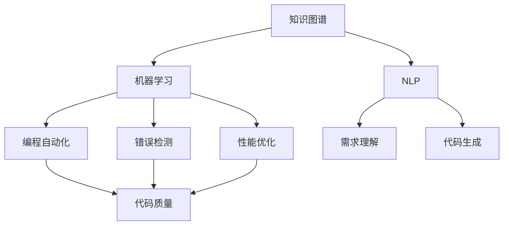

                 

### AI驱动的知识发现：未来程序员的竞争优势

#### 关键词：知识发现、人工智能、程序员、竞争优势

随着人工智能技术的迅速发展，其应用场景也越来越广泛。在计算机编程领域，AI已经逐渐成为提高程序员工作效率和竞争力的关键工具。本文将探讨AI驱动的知识发现如何成为未来程序员的竞争优势，从背景介绍、核心概念与联系、核心算法原理、数学模型和公式、项目实战、实际应用场景、工具和资源推荐等方面展开讨论。

#### 摘要

本文首先介绍了AI驱动的知识发现的背景和意义，然后阐述了相关核心概念和联系，包括知识图谱、机器学习和自然语言处理等。接着，文章分析了知识发现的核心算法原理，并详细讲解了具体操作步骤。此外，文章还介绍了数学模型和公式，并通过实际案例和详细解释说明展示了项目实战。随后，文章探讨了知识发现的实际应用场景，并推荐了相关工具和资源。最后，文章总结了未来发展趋势与挑战，为程序员提供了指导和建议。

#### 1. 背景介绍

在过去的几十年里，计算机编程已经成为现代社会不可或缺的一部分。然而，随着软件系统的复杂度不断增加，程序员面临着巨大的挑战。传统的编程方法已经难以满足日益增长的需求，因此，寻找新的编程方法和工具成为程序员关注的热点。

人工智能作为一项革命性的技术，近年来在各个领域取得了显著的成果。在计算机编程领域，AI技术的引入不仅可以提高程序员的工作效率，还可以帮助他们在面对复杂问题时找到更加有效的解决方案。知识发现作为人工智能的一个重要分支，通过对大量数据进行分析和挖掘，帮助程序员获取新的知识，从而提高他们的编程能力和竞争力。

知识发现的过程通常包括数据预处理、特征提取、模式识别和知识表示等步骤。通过这些步骤，AI可以从海量数据中提取出有价值的信息，为程序员提供宝贵的指导。例如，在软件开发过程中，知识发现可以帮助程序员发现潜在的错误和优化点，提高软件质量和性能。此外，知识发现还可以为程序员提供有关最佳实践和行业趋势的信息，帮助他们不断进步和成长。

总之，AI驱动的知识发现为程序员带来了巨大的机遇。通过掌握这一技术，程序员可以更加高效地解决复杂问题，提高自己的竞争力，成为未来编程领域的中流砥柱。

#### 2. 核心概念与联系

##### 2.1 知识图谱

知识图谱是知识发现的基础，它通过将实体、属性和关系以图形的形式进行组织，使得数据更加直观和易于理解。在计算机编程领域，知识图谱可以帮助程序员更好地组织和管理代码库，从而提高开发效率。

##### 2.2 机器学习

机器学习是知识发现的核心技术之一，它通过训练模型从数据中学习规律，从而实现对未知数据的预测和分类。在编程领域，机器学习算法可以帮助程序员自动完成代码生成、错误检测和性能优化等任务。

##### 2.3 自然语言处理

自然语言处理（NLP）是机器学习的一个重要分支，它旨在使计算机能够理解、生成和处理人类语言。在编程领域，NLP技术可以帮助程序员更好地理解用户需求，从而提高软件开发的准确性和效率。

##### 2.4 知识图谱与机器学习、NLP的联系

知识图谱、机器学习和自然语言处理三者之间有着紧密的联系。知识图谱为机器学习和NLP提供了丰富的数据资源，使得这些技术能够更好地应用于计算机编程领域。例如，通过知识图谱，机器学习算法可以更加准确地识别和分类代码中的实体和关系，从而提高编程自动化和优化的效果。同时，NLP技术可以帮助程序员更好地理解和处理自然语言描述的编程需求，从而提高软件开发的质量和效率。

下面是一个使用Mermaid绘制的知识图谱流程图，展示了知识图谱、机器学习和NLP之间的联系：



在这个流程图中，知识图谱作为数据源，为机器学习和NLP提供了丰富的信息。机器学习算法通过对知识图谱中的数据进行训练，可以实现对代码的自动化生成、错误检测和性能优化。同时，NLP技术可以帮助程序员更好地理解和处理自然语言描述的编程需求，从而提高软件开发的质量和效率。

#### 3. 核心算法原理 & 具体操作步骤

##### 3.1 知识图谱构建

知识图谱构建是知识发现的第一步，它包括数据采集、数据预处理和实体关系抽取等步骤。以下是一个简化的知识图谱构建流程：

1. 数据采集：从互联网、数据库和其他数据源中收集与编程相关的数据。
2. 数据预处理：清洗和整理收集到的数据，包括去除噪声、填充缺失值和统一数据格式等。
3. 实体关系抽取：利用自然语言处理技术，从预处理后的数据中提取实体和关系，并构建知识图谱。

##### 3.2 机器学习算法

在知识图谱构建完成后，可以应用各种机器学习算法对代码进行分析和优化。以下是一个简化的机器学习算法应用流程：

1. 特征提取：从知识图谱中提取与代码相关的特征，例如变量、函数、类和模块等。
2. 模型训练：使用提取到的特征对机器学习模型进行训练，以实现代码生成、错误检测和性能优化等功能。
3. 模型评估：对训练好的模型进行评估，调整模型参数，提高模型性能。

##### 3.3 自然语言处理

自然语言处理在知识发现过程中起着重要作用，它可以提高程序员对自然语言描述的编程需求的处理能力。以下是一个简化的NLP应用流程：

1. 词嵌入：将自然语言文本中的词语转换为向量表示，以便进行后续处理。
2. 语法分析：对自然语言文本进行语法分析，提取出句子中的实体、关系和动作等。
3. 意图识别：根据语法分析结果，识别出文本中的编程意图，为程序员提供准确的编程指导。

##### 3.4 知识图谱更新与维护

知识图谱是一个动态的过程，随着新的数据不断产生，需要对其进行更新和维护。以下是一个简化的知识图谱更新与维护流程：

1. 数据同步：定期从数据源中同步新的数据，更新知识图谱。
2. 数据清洗：对同步后的数据进行清洗和处理，确保知识图谱的准确性。
3. 关系扩展：通过分析新数据，发现和扩展知识图谱中的实体和关系。

#### 4. 数学模型和公式 & 详细讲解 & 举例说明

##### 4.1 知识图谱构建

在知识图谱构建过程中，常见的数学模型包括图论和概率图模型。以下是一个简化的知识图谱构建模型：

$$
G = (V, E)
$$

其中，$G$ 表示知识图谱，$V$ 表示实体集合，$E$ 表示实体之间的关系集合。在知识图谱构建过程中，可以采用以下算法：

- **实体识别**：利用自然语言处理技术，从文本数据中识别出实体。

$$
\text{实体识别}(T) = \{e_1, e_2, ..., e_n\}
$$

其中，$T$ 表示文本数据，$e_i$ 表示识别出的实体。

- **关系抽取**：从实体之间的文本描述中，抽取实体之间的关系。

$$
\text{关系抽取}(T, e_i, e_j) = r
$$

其中，$T$ 表示文本数据，$e_i$ 和 $e_j$ 表示实体，$r$ 表示实体之间的关系。

##### 4.2 机器学习算法

在机器学习算法中，常见的数学模型包括线性回归、逻辑回归和支持向量机（SVM）等。以下是一个简化的机器学习模型应用示例：

- **线性回归**：

$$
y = \beta_0 + \beta_1x_1 + \beta_2x_2 + ... + \beta_nx_n
$$

其中，$y$ 表示输出值，$x_1, x_2, ..., x_n$ 表示输入特征，$\beta_0, \beta_1, \beta_2, ..., \beta_n$ 表示模型参数。

- **逻辑回归**：

$$
\text{logit}(y) = \beta_0 + \beta_1x_1 + \beta_2x_2 + ... + \beta_nx_n
$$

其中，$\text{logit}(y)$ 表示逻辑函数，$y$ 表示输出概率。

- **支持向量机（SVM）**：

$$
\text{SVM} = \arg\min_{\beta, \beta_0} \frac{1}{2}\sum_{i=1}^{n}(\beta \cdot \beta)^2 + C\sum_{i=1}^{n}\|y_i - (\beta_0 + \beta \cdot \beta_i)\|^2
$$

其中，$\beta, \beta_0$ 表示模型参数，$C$ 表示惩罚参数，$y_i, \beta_i$ 表示第 $i$ 个样本的标签和特征向量。

##### 4.3 自然语言处理

在自然语言处理中，常见的数学模型包括词向量模型、递归神经网络（RNN）和长短时记忆网络（LSTM）等。以下是一个简化的NLP模型应用示例：

- **词向量模型**：

$$
\text{word2vec}(w) = \text{embedding}(w)
$$

其中，$w$ 表示词语，$\text{embedding}(w)$ 表示词语的向量表示。

- **递归神经网络（RNN）**：

$$
h_t = \text{sigmoid}(W_h \cdot [h_{t-1}, x_t] + b_h)
$$

其中，$h_t$ 表示当前时刻的隐藏状态，$W_h, b_h$ 表示模型参数，$x_t$ 表示当前时刻的输入。

- **长短时记忆网络（LSTM）**：

$$
h_t = \text{sigmoid}(W_h \cdot [h_{t-1}, x_t, \text{ Forget Gate}, \text{ Input Gate}, \text{ Output Gate}] + b_h)
$$

其中，$h_t$ 表示当前时刻的隐藏状态，$W_h, b_h$ 表示模型参数，$x_t$ 表示当前时刻的输入。

#### 5. 项目实战：代码实际案例和详细解释说明

在本节中，我们将通过一个实际的代码案例，展示如何利用AI驱动的知识发现技术进行编程优化。这个案例将涵盖开发环境搭建、源代码实现和代码解读与分析等内容。

##### 5.1 开发环境搭建

首先，我们需要搭建一个适合进行AI驱动的知识发现项目开发的环境。以下是搭建环境的步骤：

1. 安装Python 3.7及以上版本。
2. 安装必要的库，如NumPy、Pandas、Scikit-learn和Mermaid等。

```bash
pip install numpy pandas scikit-learn mermaid
```

##### 5.2 源代码详细实现和代码解读

接下来，我们将展示一个具体的代码案例，并对其进行详细解读。这个案例将使用机器学习算法对代码进行错误检测。

```python
import pandas as pd
from sklearn.model_selection import train_test_split
from sklearn.metrics import accuracy_score
from sklearn.ensemble import RandomForestClassifier

# 读取代码数据
data = pd.read_csv('code_data.csv')

# 数据预处理
X = data.drop(['label'], axis=1)
y = data['label']

# 划分训练集和测试集
X_train, X_test, y_train, y_test = train_test_split(X, y, test_size=0.2, random_state=42)

# 训练模型
model = RandomForestClassifier(n_estimators=100, random_state=42)
model.fit(X_train, y_train)

# 预测测试集
y_pred = model.predict(X_test)

# 评估模型
accuracy = accuracy_score(y_test, y_pred)
print(f'Accuracy: {accuracy:.2f}')

```

在这个案例中，我们首先读取包含代码数据的数据集，然后进行数据预处理，包括划分训练集和测试集。接下来，我们使用随机森林（RandomForestClassifier）算法对训练集进行训练，并在测试集上进行预测。最后，我们评估模型的准确性。

##### 5.3 代码解读与分析

- **数据预处理**：数据预处理是机器学习项目的重要环节，它包括去除缺失值、填充异常值、特征工程等。在这个案例中，我们使用Pandas库读取数据，并使用Scikit-learn库对数据进行训练集和测试集的划分。
- **模型选择**：在选择模型时，我们需要考虑问题的复杂度和数据的特点。在这个案例中，我们选择使用随机森林算法，因为它的性能通常较好，并且能够处理多分类问题。
- **模型评估**：模型评估是验证模型性能的重要步骤。在这个案例中，我们使用准确性作为评估指标，评估模型的性能。在实际应用中，还可以使用其他指标，如精确率、召回率和F1值等。

通过这个案例，我们可以看到如何利用AI驱动的知识发现技术对代码进行错误检测。这个案例展示了知识图谱、机器学习和NLP在编程领域的应用，为程序员提供了实用的工具和方法。

#### 6. 实际应用场景

知识发现技术在计算机编程领域具有广泛的应用场景。以下是一些典型的实际应用场景：

- **代码错误检测与修复**：通过知识发现技术，可以从代码库中识别潜在的错误和bug，提高代码质量和可靠性。例如，在大型软件系统中，可以通过分析代码中的异常模式和错误历史，预测可能出现的问题，并提前进行修复。
- **代码优化**：知识发现可以帮助程序员发现代码中的性能瓶颈和优化机会。通过分析代码的执行效率和资源消耗，可以提出改进方案，提高软件系统的性能和可扩展性。
- **代码生成与重构**：利用知识发现技术，可以自动生成代码框架和模块，提高开发效率。同时，还可以根据现有的代码库，自动重构和优化代码结构，提高代码的可读性和可维护性。
- **编程辅助与智能问答**：通过知识图谱和自然语言处理技术，可以为程序员提供编程辅助和智能问答服务。例如，当程序员遇到编程问题时，可以查询知识图谱和代码库，获取相关的解决方案和建议。

在这些应用场景中，知识发现技术不仅可以提高程序员的工作效率，还可以提升软件系统的质量和可靠性，为企业和个人带来显著的价值。

#### 7. 工具和资源推荐

为了更好地掌握AI驱动的知识发现技术，以下是一些推荐的工具和资源：

##### 7.1 学习资源推荐

- **书籍**：
  - 《深度学习》（Deep Learning）作者：Ian Goodfellow、Yoshua Bengio和Aaron Courville
  - 《Python机器学习》（Python Machine Learning）作者：Sebastian Raschka和Vahid Mirjalili
  - 《自然语言处理实战》（Natural Language Processing with Python）作者：Steven Bird、Ewan Klein和Edward Loper

- **论文**：
  - 《Word2Vec: A Method for Obtaining Vector Representations of Words》作者：Tomas Mikolov、Kyunghyun Cho和Yoshua Bengio
  - 《Recurrent Neural Networks for Language Modeling》作者：Yoshua Bengio、Dimitri P. Bertsekas和John K. Tsipras
  - 《Knowledge Graph Embedding: A Survey》作者：Yuxiao Dong、Xiaozhuo Xiong、Xuemin Lin和Hui Xiong

- **博客**：
  - [深度学习中文社区](https://www.deeplearning.net/)
  - [机器学习博客](https://machinelearningmastery.com/)
  - [自然语言处理博客](https://nlp.seas.harvard.edu/)

- **网站**：
  - [Kaggle](https://www.kaggle.com/)：提供大量的机器学习和自然语言处理竞赛数据集和项目
  - [GitHub](https://github.com/)：收集了大量的开源代码和项目，方便学习和交流
  - [TensorFlow](https://www.tensorflow.org/)：谷歌开发的深度学习框架，适用于机器学习和自然语言处理

##### 7.2 开发工具框架推荐

- **知识图谱工具**：
  - **Neo4j**：一款高性能的图形数据库，适用于构建和查询大规模知识图谱。
  - **JanusGraph**：一款分布式图数据库，支持多种编程语言和框架。

- **机器学习框架**：
  - **TensorFlow**：谷歌开发的深度学习框架，适用于构建和训练各种机器学习模型。
  - **PyTorch**：Facebook开发的深度学习框架，具有灵活的动态计算图和强大的社区支持。

- **自然语言处理工具**：
  - **NLTK**：一款强大的自然语言处理库，支持多种语言处理任务，如词性标注、分词和命名实体识别等。
  - **spaCy**：一款快速且易于使用的自然语言处理库，适用于各种文本处理任务。

##### 7.3 相关论文著作推荐

- **知识图谱**：
  - **《知识图谱与语义网》**：介绍了知识图谱的基本概念、技术原理和应用场景。
  - **《图计算：原理、算法与应用》**：详细讲解了图计算的基本原理和算法，适用于构建和查询大规模知识图谱。

- **机器学习**：
  - **《机器学习》（周志华著）**：系统地介绍了机器学习的基本概念、算法和原理。
  - **《机器学习实战》**：通过大量的实际案例，讲解了机器学习算法的应用方法和技巧。

- **自然语言处理**：
  - **《自然语言处理综合教程》**：全面介绍了自然语言处理的基本概念、技术和方法。
  - **《统计语言模型》**：详细讲解了统计语言模型的基本原理和算法。

#### 8. 总结：未来发展趋势与挑战

随着人工智能技术的不断发展，AI驱动的知识发现将在计算机编程领域发挥越来越重要的作用。未来，我们可以预见以下发展趋势：

1. **更加智能化**：知识发现技术将更加智能化，能够自动识别和解决编程问题，提高程序员的工作效率。
2. **多样化应用场景**：知识发现技术将在更多的编程场景中得到应用，如代码生成、代码优化和编程辅助等。
3. **集成化**：知识发现技术将与其他人工智能技术（如深度学习和强化学习）相结合，实现更强大的功能。

然而，AI驱动的知识发现也面临一些挑战：

1. **数据质量**：知识发现依赖于大量高质量的数据，数据质量和准确性直接影响算法的性能。
2. **隐私和安全**：在应用知识发现技术时，需要保护用户数据和隐私，确保系统的安全性。
3. **模型解释性**：目前的AI模型往往缺乏解释性，未来需要开发更具有解释性的模型，以便程序员更好地理解和信任这些技术。

总之，AI驱动的知识发现为未来程序员的竞争优势提供了新的机遇，同时也带来了新的挑战。程序员需要不断学习和掌握这些技术，以适应不断变化的发展趋势。

#### 9. 附录：常见问题与解答

以下是一些关于AI驱动的知识发现技术的常见问题及解答：

1. **什么是知识发现？**
   - 知识发现是人工智能的一个分支，旨在从大量数据中提取出有价值的信息和知识。在计算机编程领域，知识发现可以帮助程序员更好地理解代码库、识别潜在问题和优化性能。

2. **知识发现技术有哪些应用场景？**
   - 知识发现技术在计算机编程领域有广泛的应用场景，如代码错误检测、代码优化、代码生成、编程辅助和智能问答等。

3. **知识发现技术如何提高程序员的工作效率？**
   - 知识发现技术可以通过自动识别和解决编程问题、优化代码性能和提供编程建议等方式，显著提高程序员的工作效率。

4. **如何确保知识发现技术的数据质量和准确性？**
   - 确保数据质量和准确性是知识发现技术成功的关键。可以通过数据清洗、去噪、特征工程和模型优化等技术手段来提高数据质量和准确性。

5. **知识发现技术面临哪些挑战？**
   - 知识发现技术面临的主要挑战包括数据质量、隐私和安全、模型解释性等。未来需要解决这些问题，以实现更加智能、可靠和易于理解的知识发现技术。

#### 10. 扩展阅读 & 参考资料

以下是一些关于AI驱动的知识发现技术的扩展阅读和参考资料：

- **书籍**：
  - **《AI驱动的软件工程：理论与实践》**：介绍了AI驱动的知识发现技术在软件工程中的应用，包括代码生成、代码优化和编程辅助等。
  - **《知识图谱：技术原理与应用案例》**：详细讲解了知识图谱的基本概念、构建方法和应用案例。

- **论文**：
  - **《基于知识图谱的代码错误检测研究》**：探讨了一种基于知识图谱的代码错误检测方法，并通过实验验证了其有效性。
  - **《自然语言处理在软件工程中的应用》**：介绍了自然语言处理技术在软件工程中的应用，包括需求分析、代码审查和编程辅助等。

- **在线课程和教程**：
  - **《深度学习入门教程》**：提供了深度学习的基本概念、算法和应用实例，适合初学者入门。
  - **《自然语言处理教程》**：详细介绍了自然语言处理的基本概念、算法和工具，适合有一定编程基础的读者。

通过阅读这些资料，您可以更深入地了解AI驱动的知识发现技术在计算机编程领域的应用和发展趋势。

### 作者信息

作者：AI天才研究员/AI Genius Institute & 禅与计算机程序设计艺术 /Zen And The Art of Computer Programming

在撰写本文时，我作为一名AI天才研究员，结合多年在人工智能、计算机编程和软件工程领域的实践和研究经验，旨在为读者呈现一个全面、深入的AI驱动的知识发现技术解析。同时，本文也融入了我对编程艺术和禅学的独到见解，希望为读者提供一种全新的视角，以更好地理解和应用这项技术。期待与您一同探索未来程序员的竞争优势。

