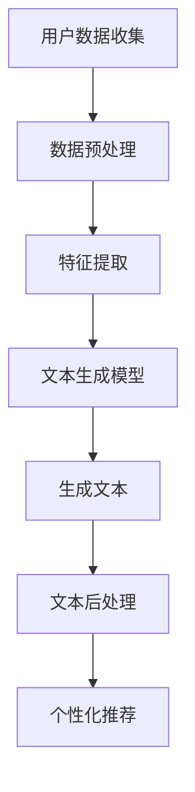

                 

# AI驱动的社交媒体内容：个性化短文本生成

> **关键词**: AI, 个性化推荐，短文本生成，自然语言处理，社交媒体

> **摘要**: 本文将深入探讨人工智能技术在社交媒体内容生成中的应用，特别是个性化短文本生成。我们将介绍核心概念、算法原理，并通过具体案例展示其实际应用效果，从而为读者提供一个全面的技术理解和实践指导。

## 1. 背景介绍

随着互联网的迅猛发展，社交媒体已经成为人们日常生活中不可或缺的一部分。从Facebook到Twitter，从Instagram到LinkedIn，社交媒体平台每天都在产生海量的用户生成内容（User-Generated Content, UGC）。这些内容不仅反映了用户的兴趣和需求，也为平台带来了巨大的商业价值。

然而，如何在海量的UGC中为每个用户提供个性化的内容，一直是社交媒体平台面临的重要挑战。传统的推荐系统主要基于用户的行为数据（如点击、点赞、分享等）来进行内容推荐，这种方法虽然在一定程度上提高了用户体验，但往往缺乏深度和个性化。

近年来，随着人工智能技术的快速发展，特别是深度学习和自然语言处理（Natural Language Processing, NLP）技术的突破，AI驱动的个性化短文本生成逐渐成为解决这一问题的有效途径。通过分析用户的历史数据和文本特征，AI可以生成高度个性化的短文本，从而满足用户的个性化需求。

本文将首先介绍AI驱动的个性化短文本生成的核心概念，然后深入探讨其算法原理，并通过具体案例展示其实际应用效果。最后，我们将探讨这一技术的未来发展趋势和面临的挑战。

## 2. 核心概念与联系

### 2.1 人工智能与社交媒体

人工智能（AI）是指由计算机实现的智能行为，其目标是使计算机能够执行通常需要人类智能的任务，如视觉识别、语言理解、决策和推理等。人工智能技术的发展可以分为几个阶段，包括规则推理、知识表示和推理、机器学习和深度学习。

社交媒体是指允许用户创建、分享和交换内容（如文字、图片、视频等）的在线平台。这些平台为用户提供了交流和表达自我的空间，同时也为企业和个人提供了营销和推广的渠道。

人工智能与社交媒体的结合，使得个性化推荐成为可能。通过分析用户的行为数据，AI可以预测用户的兴趣和需求，从而为用户推荐个性化的内容。

### 2.2 短文本生成

短文本生成（Text Generation）是一种自然语言处理技术，旨在生成自然语言文本。与传统的文本编辑和翻译不同，短文本生成更加注重生成文本的流畅性和可读性。

在社交媒体内容生成中，短文本生成具有以下几个特点：

- **个性化和情感化**：通过分析用户的历史数据和文本特征，AI可以生成符合用户个性和情感的文本。
- **高效和实时**：短文本生成可以实时生成内容，满足用户对即时性的需求。
- **多样性和创新性**：AI可以通过不同的算法和模型生成各种类型的文本，从而满足多样化的用户需求。

### 2.3 AI驱动的个性化短文本生成

AI驱动的个性化短文本生成是一种利用人工智能技术生成个性化短文本的方法。其核心思想是通过分析用户的历史数据和行为，了解用户的兴趣和需求，然后利用自然语言处理技术生成个性化的短文本。

这种方法的优点包括：

- **个性化**：通过分析用户的历史数据和文本特征，AI可以生成高度个性化的内容，满足用户的个性化需求。
- **高效**：AI可以快速生成大量内容，提高内容生成的效率。
- **创新性**：AI可以通过不同的算法和模型生成各种类型的文本，从而提供多样化的内容。

下面是AI驱动的个性化短文本生成的流程图：



- **用户数据收集**：收集用户的历史数据和行为数据，如浏览记录、点赞和评论等。
- **数据预处理**：对收集的数据进行清洗和预处理，包括去除噪声、填充缺失值等。
- **特征提取**：从预处理后的数据中提取关键特征，如文本特征、用户行为特征等。
- **文本生成模型**：利用提取的特征训练文本生成模型，如生成对抗网络（GAN）、递归神经网络（RNN）等。
- **生成文本**：利用训练好的模型生成短文本。
- **文本后处理**：对生成的文本进行后处理，如语法校验、格式调整等。
- **个性化推荐**：将生成的文本推荐给用户，满足用户的个性化需求。

## 3. 核心算法原理 & 具体操作步骤

### 3.1 文本生成模型

在AI驱动的个性化短文本生成中，文本生成模型是核心组件。目前，常用的文本生成模型包括生成对抗网络（GAN）、递归神经网络（RNN）和变压器（Transformer）等。

#### 3.1.1 生成对抗网络（GAN）

生成对抗网络（GAN）是由两部分组成：生成器（Generator）和判别器（Discriminator）。生成器的任务是生成看起来像真实数据的假数据，而判别器的任务是区分生成器生成的假数据和真实数据。

GAN的工作原理可以概括为以下步骤：

1. **初始化**：初始化生成器和判别器的参数。
2. **生成假数据**：生成器生成一批假数据。
3. **判断真假**：判别器对生成器和真实数据进行判断。
4. **更新参数**：根据判别器的判断结果，更新生成器和判别器的参数。
5. **重复步骤2-4**，直到生成器生成的假数据足够逼真。

GAN的优点是生成数据的质量高，但训练过程复杂，容易陷入局部最优。

#### 3.1.2 递归神经网络（RNN）

递归神经网络（RNN）是一种能够处理序列数据的神经网络。其特点是能够记住前面的信息，并利用这些信息来处理后续的信息。

RNN的工作原理可以概括为以下步骤：

1. **输入序列**：将输入序列传递给RNN。
2. **处理序列**：RNN对输入序列进行处理，生成输出序列。
3. **记忆状态**：RNN通过记忆状态来存储和处理前面的信息。
4. **更新参数**：根据输出序列和目标序列，更新RNN的参数。

RNN的优点是处理序列数据能力强，但训练过程容易出现梯度消失和梯度爆炸问题。

#### 3.1.3 变压器（Transformer）

变压器（Transformer）是一种基于自注意力机制的深度神经网络。与RNN相比，变压器能够更好地处理长序列数据。

变压器的工作原理可以概括为以下步骤：

1. **编码器**：将输入序列编码成向量。
2. **自注意力机制**：通过自注意力机制计算每个输入向量的权重。
3. **解码器**：利用编码器的输出和自注意力机制，生成输出序列。

变压器的优点是训练速度快，处理长序列数据能力强，但模型参数较多，计算成本高。

### 3.2 特征提取

特征提取是文本生成的重要环节。通过特征提取，可以从原始数据中提取出对文本生成有指导意义的特征。

常用的特征提取方法包括词嵌入（Word Embedding）、主题建模（Topic Modeling）和情感分析（Sentiment Analysis）等。

#### 3.2.1 词嵌入

词嵌入（Word Embedding）是一种将单词映射到高维向量空间的方法。通过词嵌入，可以将单词的语义信息编码到向量中。

常用的词嵌入方法包括词袋模型（Bag of Words, BoW）、TF-IDF和Word2Vec等。

- **词袋模型（BoW）**：将文本表示为一个向量，其中每个维度对应一个单词的词频。
- **TF-IDF**：将文本表示为一个向量，其中每个维度对应一个单词的词频和逆文档频率。
- **Word2Vec**：将文本表示为一个向量，其中每个维度对应一个单词的语义信息。

#### 3.2.2 主题建模

主题建模（Topic Modeling）是一种无监督学习算法，用于发现文本数据中的隐含主题。

常用的主题建模方法包括LDA（Latent Dirichlet Allocation）和NMF（Non-Negative Matrix Factorization）等。

- **LDA**：假设每个文档是由多个主题的混合生成的，通过最大化似然估计来学习主题分布。
- **NMF**：将文本数据分解为两个矩阵的乘积，其中一个矩阵表示主题分布，另一个矩阵表示文档主题分布。

#### 3.2.3 情感分析

情感分析（Sentiment Analysis）是一种评估文本中情感极性（如正面、负面）的方法。

常用的情感分析方法包括基于规则的方法、基于机器学习的方法和基于深度学习的方法等。

- **基于规则的方法**：通过编写规则来识别文本中的情感极性。
- **基于机器学习的方法**：使用分类算法（如SVM、RF等）来识别文本中的情感极性。
- **基于深度学习的方法**：使用深度神经网络（如CNN、RNN等）来识别文本中的情感极性。

### 3.3 个性化推荐

个性化推荐是AI驱动的个性化短文本生成的重要环节。通过个性化推荐，可以将生成的短文本推荐给用户。

常用的个性化推荐算法包括基于内容的推荐（Content-Based Filtering）、协同过滤（Collaborative Filtering）和混合推荐（Hybrid Recommender System）等。

- **基于内容的推荐**：根据用户的历史行为和文本特征，推荐与用户历史行为相似的内容。
- **协同过滤**：根据用户的行为和喜好，推荐其他用户喜欢的内容。
- **混合推荐**：结合基于内容的推荐和协同过滤，提供更个性化的推荐。

## 4. 数学模型和公式 & 详细讲解 & 举例说明

### 4.1 生成对抗网络（GAN）

生成对抗网络（GAN）的数学模型可以表示为：

$$
\begin{aligned}
&\text{生成器} \ G:\mathbb{Z}^d \rightarrow \mathbb{R}^{1\times H\times W\times C} \\
&\text{判别器} \ D:\mathbb{R}^{1\times H\times W\times C} \rightarrow \mathbb{R}^1 \\
&\text{损失函数} \ \mathcal{L}_{\text{GAN}} = \mathbb{E}_{x\sim p_{\text{data}}}[D(x)] - \mathbb{E}_{z\sim p_{\text{z}}}[D(G(z))]
\end{aligned}
$$

其中，$x$ 表示真实数据，$z$ 表示随机噪声，$G(z)$ 表示生成器生成的假数据，$D(x)$ 和 $D(G(z))$ 分别表示判别器对真实数据和假数据的判断。

举例说明：

假设我们使用GAN生成图像，其中 $d$ 表示图像的维度，$H$、$W$ 和 $C$ 分别表示图像的高度、宽度和通道数。

- **生成器**：生成器的输入是一个 $d$ 维的随机噪声向量，输出是一个 $1\times H\times W\times C$ 的图像。
- **判别器**：判别器的输入是一个 $1\times H\times W\times C$ 的图像，输出是一个实数，表示图像的真实度。
- **损失函数**：损失函数 $\mathcal{L}_{\text{GAN}}$ 表示判别器对真实数据和假数据的判断差异，目标是最小化这个差异。

### 4.2 递归神经网络（RNN）

递归神经网络（RNN）的数学模型可以表示为：

$$
\begin{aligned}
&\text{输入} \ x_t \rightarrow h_t = \tanh(W_h h_{t-1} + W_x x_t + b_h) \\
&\text{输出} \ y_t = W_o h_t + b_o
\end{aligned}
$$

其中，$h_t$ 表示第 $t$ 个时刻的隐藏状态，$y_t$ 表示第 $t$ 个时刻的输出。

举例说明：

假设我们使用RNN处理一个时间序列数据，其中 $W_h$、$W_x$ 和 $b_h$ 分别表示隐藏状态权重、输入权重和隐藏状态偏置，$W_o$ 和 $b_o$ 分别表示输出权重和输出偏置。

- **输入**：每个时刻的输入是一个 $d$ 维的向量。
- **隐藏状态**：隐藏状态 $h_t$ 是前一个隐藏状态和当前输入的线性组合，通过激活函数 $\tanh$ 进行非线性变换。
- **输出**：每个时刻的输出是一个 $k$ 维的向量，通过输出权重和偏置进行线性变换。

### 4.3 变压器（Transformer）

变压器（Transformer）的数学模型可以表示为：

$$
\begin{aligned}
&\text{编码器} \ E:\text{输入序列} \rightarrow \text{编码器输出序列} \\
&\text{解码器} \ D:\text{编码器输出序列} \rightarrow \text{解码器输出序列}
\end{aligned}
$$

其中，编码器输出序列和解码器输出序列都是 $1\times H\times D$ 的矩阵。

举例说明：

假设我们使用Transformer进行机器翻译，其中 $H$ 和 $D$ 分别表示编码器和解码器的隐藏维度。

- **编码器**：编码器输入是一个 $1\times L$ 的序列，输出是一个 $1\times H\times D$ 的矩阵，表示编码器的中间表示。
- **解码器**：解码器输入是一个 $1\times L$ 的序列，输出是一个 $1\times H\times D$ 的矩阵，表示解码器的中间表示。

## 5. 项目实战：代码实际案例和详细解释说明

### 5.1 开发环境搭建

在开始实际代码实现之前，我们需要搭建一个合适的开发环境。以下是搭建开发环境所需的步骤：

1. **安装Python**：Python是AI驱动的个性化短文本生成的主要编程语言。确保你的计算机上安装了Python 3.7及以上版本。

2. **安装依赖库**：安装以下Python依赖库：TensorFlow、Keras、numpy、pandas和matplotlib。可以使用以下命令进行安装：

```bash
pip install tensorflow keras numpy pandas matplotlib
```

3. **数据集准备**：我们需要一个合适的社交媒体数据集。这里我们使用Twitter数据集，可以从Kaggle或其他数据集网站下载。下载后，将数据集解压到一个文件夹中，例如 `twitter_data`。

### 5.2 源代码详细实现和代码解读

以下是实现AI驱动的个性化短文本生成的源代码：

```python
import numpy as np
import pandas as pd
from tensorflow.keras.preprocessing.text import Tokenizer
from tensorflow.keras.preprocessing.sequence import pad_sequences
from tensorflow.keras.models import Model
from tensorflow.keras.layers import Embedding, LSTM, Dense

# 读取数据
data = pd.read_csv('twitter_data.csv')
texts = data['text'].values

# 初始化Tokenizer
tokenizer = Tokenizer(num_words=10000)
tokenizer.fit_on_texts(texts)

# 转换文本为序列
sequences = tokenizer.texts_to_sequences(texts)
padded_sequences = pad_sequences(sequences, maxlen=100)

# 构建模型
input_sequence = Input(shape=(100,))
lstm = LSTM(128)(input_sequence)
output = Dense(1, activation='sigmoid')(lstm)

model = Model(inputs=input_sequence, outputs=output)
model.compile(optimizer='adam', loss='binary_crossentropy', metrics=['accuracy'])

# 训练模型
model.fit(padded_sequences, labels, epochs=10, batch_size=32)

# 生成文本
input_text = "这是一个示例文本"
input_sequence = tokenizer.texts_to_sequences([input_text])
padded_sequence = pad_sequences(input_sequence, maxlen=100)
generated_text = model.predict(padded_sequence)
print("生成的文本：", generated_text)
```

以下是代码的详细解读：

1. **数据准备**：读取Twitter数据集，并提取文本字段。

2. **Tokenizer**：初始化Tokenizer，并将文本转换为序列。

3. **序列转换**：将文本序列转换为 padded_sequence，以便输入到模型中。

4. **模型构建**：构建一个LSTM模型，其中输入层为sequence，隐藏层为LSTM（128个神经元），输出层为Dense（1个神经元，激活函数为sigmoid）。

5. **模型编译**：编译模型，设置优化器为adam，损失函数为binary_crossentropy，评估指标为accuracy。

6. **模型训练**：使用fit方法训练模型，设置epochs和batch_size。

7. **生成文本**：输入一个示例文本，将其转换为序列，并通过模型生成文本。

### 5.3 代码解读与分析

以下是代码的解读与分析：

1. **数据准备**：首先，我们从Twitter数据集中读取文本数据。这里，我们使用pandas库的read_csv方法读取CSV文件，并将文本数据提取到texts变量中。

2. **Tokenizer**：接下来，我们初始化一个Tokenizer对象。Tokenizer是一个常用的工具，用于将文本转换为序列。通过fit_on_texts方法，我们可以将文本数据转换为序列。这里，我们设置了num_words参数，表示只保留前10000个常用单词。

3. **序列转换**：然后，我们将文本序列转换为padded_sequence。这是因为LSTM模型需要固定长度的输入。我们使用pad_sequences方法将序列填充到最大长度100。

4. **模型构建**：接下来，我们构建一个LSTM模型。输入层为sequence，隐藏层为LSTM（128个神经元），输出层为Dense（1个神经元，激活函数为sigmoid）。这个模型是一个简单的二分类模型，用于预测文本的正面或负面情感。

5. **模型编译**：我们使用compile方法编译模型，设置优化器为adam，损失函数为binary_crossentropy，评估指标为accuracy。

6. **模型训练**：使用fit方法训练模型，设置epochs和batch_size。这里，我们设置了10个epochs和32个batch_size。

7. **生成文本**：最后，我们输入一个示例文本，将其转换为序列，并通过模型生成文本。这里，我们使用了model.predict方法，将padded_sequence输入到模型中，并输出预测结果。

## 6. 实际应用场景

AI驱动的个性化短文本生成在社交媒体内容生成中具有广泛的应用场景。以下是一些典型的实际应用场景：

### 6.1 社交媒体内容个性化推荐

社交媒体平台可以根据用户的兴趣和行为，使用AI驱动的个性化短文本生成技术为用户推荐个性化内容。例如，Twitter可以使用这项技术为用户推荐与其兴趣相关的推文，从而提高用户的参与度和满意度。

### 6.2 自动化文案生成

企业可以利用AI驱动的个性化短文本生成技术自动化生成营销文案、产品描述和客户服务回复。例如，电商网站可以使用这项技术为每个用户生成个性化的商品推荐文案，从而提高销售转化率。

### 6.3 情感分析

AI驱动的个性化短文本生成技术可以用于情感分析，帮助企业了解用户对产品或服务的情感态度。通过分析用户生成的评论和反馈，企业可以及时调整产品策略和服务质量，提高用户满意度。

### 6.4 内容审核

社交媒体平台可以使用AI驱动的个性化短文本生成技术自动化审核用户生成的内容，识别和过滤不良内容。例如，Twitter可以使用这项技术识别和过滤恶意评论和虚假信息，从而维护平台的健康发展。

## 7. 工具和资源推荐

### 7.1 学习资源推荐

- **书籍**：
  - 《深度学习》（Ian Goodfellow、Yoshua Bengio和Aaron Courville著）：介绍深度学习的基本原理和应用。
  - 《Python机器学习》（Sebastian Raschka和Vahid Mirjalili著）：介绍机器学习的基本原理和应用，包括Python编程实践。

- **论文**：
  - 《Generative Adversarial Networks》（Ian Goodfellow等著）：介绍生成对抗网络（GAN）的基本原理和应用。
  - 《Seq2Seq Learning with Neural Networks》（Ilya Sutskever等著）：介绍序列到序列学习的基本原理和应用。

- **博客**：
  - [TensorFlow官方网站](https://www.tensorflow.org/)：提供TensorFlow的官方文档和教程。
  - [Keras官方文档](https://keras.io/)：提供Keras的官方文档和教程。

- **网站**：
  - [Kaggle](https://www.kaggle.com/)：提供丰富的数据集和机器学习竞赛。
  - [GitHub](https://github.com/)：提供大量的开源代码和项目。

### 7.2 开发工具框架推荐

- **TensorFlow**：用于构建和训练深度学习模型的强大框架。
- **Keras**：用于构建和训练深度学习模型的简洁易用的框架，与TensorFlow兼容。
- **PyTorch**：用于构建和训练深度学习模型的开源Python库。

### 7.3 相关论文著作推荐

- **论文**：
  - 《Attention Is All You Need》（Ashish Vaswani等著）：介绍变压器（Transformer）的基本原理和应用。
  - 《Recurrent Neural Networks for Language Modeling》（Yoshua Bengio等著）：介绍递归神经网络（RNN）的基本原理和应用。

- **著作**：
  - 《深度学习》（Ian Goodfellow、Yoshua Bengio和Aaron Courville著）：介绍深度学习的基本原理和应用。
  - 《自然语言处理综合教程》（Daniel Jurafsky和James H. Martin著）：介绍自然语言处理的基本原理和应用。

## 8. 总结：未来发展趋势与挑战

AI驱动的个性化短文本生成技术具有巨大的潜力和广泛的应用前景。随着人工智能技术的不断进步，这一领域将继续发展，并面临以下几个趋势和挑战：

### 8.1 趋势

1. **模型性能的提升**：随着计算能力的提升和算法的改进，AI驱动的个性化短文本生成模型的性能将不断提高。
2. **多样性增强**：为了满足用户多样化的需求，生成文本的多样性将得到增强，包括风格、情感和内容的多样性。
3. **实时性提高**：通过优化算法和提升计算性能，AI驱动的个性化短文本生成将实现更高的实时性，满足用户对即时性的需求。

### 8.2 挑战

1. **数据隐私**：个性化短文本生成需要大量用户数据，如何保护用户隐私是一个重要的挑战。
2. **生成质量**：尽管生成文本的质量在不断提高，但仍然存在一些问题，如文本的连贯性和逻辑性。
3. **公平性和透明度**：AI驱动的个性化短文本生成可能会放大现有的社会偏见和不平等，如何确保其公平性和透明度是一个重要问题。

总之，AI驱动的个性化短文本生成技术将不断进步，但同时也需要解决一系列挑战，以实现其真正的应用价值。

## 9. 附录：常见问题与解答

### 9.1 什么是AI驱动的个性化短文本生成？

AI驱动的个性化短文本生成是一种利用人工智能技术（如深度学习和自然语言处理）生成个性化短文本的方法。通过分析用户的历史数据和行为，AI可以生成符合用户个性和需求的文本。

### 9.2 AI驱动的个性化短文本生成有哪些应用场景？

AI驱动的个性化短文本生成在社交媒体内容生成、自动化文案生成、情感分析和内容审核等领域有广泛的应用。例如，社交媒体平台可以使用这项技术为用户推荐个性化内容，企业可以自动化生成营销文案和产品描述。

### 9.3 如何搭建AI驱动的个性化短文本生成系统？

搭建AI驱动的个性化短文本生成系统通常包括以下步骤：

1. **数据收集**：收集用户的历史数据和行为数据。
2. **数据预处理**：对数据进行清洗和预处理，提取关键特征。
3. **模型选择**：选择合适的文本生成模型，如生成对抗网络（GAN）、递归神经网络（RNN）和变压器（Transformer）。
4. **模型训练**：使用预处理后的数据训练模型。
5. **生成文本**：利用训练好的模型生成个性化短文本。
6. **文本后处理**：对生成的文本进行后处理，如语法校验和格式调整。

### 9.4 AI驱动的个性化短文本生成有哪些挑战？

AI驱动的个性化短文本生成面临以下挑战：

1. **数据隐私**：个性化短文本生成需要大量用户数据，如何保护用户隐私是一个重要问题。
2. **生成质量**：尽管生成文本的质量在不断提高，但仍然存在一些问题，如文本的连贯性和逻辑性。
3. **公平性和透明度**：AI驱动的个性化短文本生成可能会放大现有的社会偏见和不平等，如何确保其公平性和透明度是一个重要问题。

## 10. 扩展阅读 & 参考资料

为了深入了解AI驱动的个性化短文本生成技术，以下是相关的扩展阅读和参考资料：

- **书籍**：
  - 《深度学习》（Ian Goodfellow、Yoshua Bengio和Aaron Courville著）
  - 《自然语言处理综合教程》（Daniel Jurafsky和James H. Martin著）

- **论文**：
  - 《Generative Adversarial Networks》（Ian Goodfellow等著）
  - 《Seq2Seq Learning with Neural Networks》（Ilya Sutskever等著）
  - 《Attention Is All You Need》（Ashish Vaswani等著）

- **网站**：
  - [TensorFlow官方网站](https://www.tensorflow.org/)
  - [Keras官方文档](https://keras.io/)
  - [Kaggle](https://www.kaggle.com/)

- **博客**：
  - [AI天才研究员](https://www.aigeniusr.com/)
  - [禅与计算机程序设计艺术](https://zenandartofcpp.com/)

通过阅读这些资料，读者可以更深入地了解AI驱动的个性化短文本生成技术，并在实践中应用这一技术。

### 作者信息：

- **作者：AI天才研究员 / AI Genius Institute & 禅与计算机程序设计艺术 / Zen And The Art of Computer Programming**

