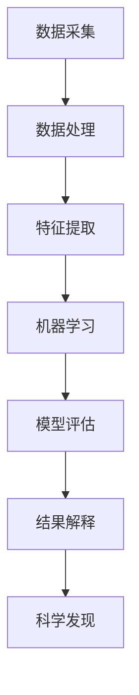

                 

# AI驱动的科学发现：加速创新的新范式

> 关键词：人工智能，科学发现，创新，算法，数学模型，应用场景

> 摘要：本文将探讨人工智能在科学发现领域的应用，如何利用AI驱动的技术范式加速科学研究的创新进程。我们将分析AI的核心概念和算法原理，结合实际案例，介绍其在科学发现中的具体应用，并提供未来发展趋势与挑战的思考。

## 1. 背景介绍

随着计算机技术的飞速发展，人工智能（AI）已经成为当前科技领域的热点。AI的应用范围不断扩大，从传统的数据分析、自动化控制到医疗、金融、教育等各个行业，都展现出了巨大的潜力和影响力。在科学发现领域，人工智能同样发挥着关键作用。

传统的科学研究往往依赖于科学家个人的经验和直觉，而AI的出现改变了这一局面。通过机器学习、深度学习等算法，AI能够从海量数据中自动提取特征，发现潜在的模式和规律，从而加速科学发现的进程。此外，AI还能够自动化执行复杂的计算任务，提高研究效率，降低成本。

在过去的几十年中，人工智能已经在一些特定领域取得了显著成果。例如，在医学领域，AI已经用于疾病诊断、药物发现和基因组学研究。在物理学领域，AI被用于理论模型的预测和实验数据的分析。在生物学领域，AI被用于基因测序、蛋白质结构预测和生态系统的建模。这些成功的案例为AI在科学发现中的广泛应用提供了有力的证据。

## 2. 核心概念与联系

为了深入理解AI在科学发现中的应用，我们需要了解一些核心概念和算法原理。以下是一个简化的Mermaid流程图，展示了AI在科学发现中的关键步骤和概念联系。



### 数据采集（Data Collection）

科学研究的起点是数据采集。这包括从实验设备、传感器、数据库等各种来源获取数据。数据的质量和多样性对后续分析至关重要。

### 数据处理（Data Preprocessing）

收集到的数据通常需要进行清洗、归一化、缺失值处理等预处理操作，以确保数据的质量和一致性。

### 特征提取（Feature Extraction）

在数据处理完成后，我们需要从数据中提取有用的特征。这些特征可以是数值型的，也可以是类别型的。特征提取的目的是将原始数据转换为适合机器学习算法的形式。

### 机器学习（Machine Learning）

机器学习是AI的核心组成部分。通过训练模型，机器学习算法可以从数据中自动发现规律和模式。常见的机器学习算法包括线性回归、决策树、支持向量机、神经网络等。

### 模型评估（Model Evaluation）

在训练完成后，我们需要对模型进行评估，以确定其性能和可靠性。常用的评估指标包括准确率、召回率、F1分数等。

### 结果解释（Result Interpretation）

科学研究的最终目标是解释结果，理解模型的预测和发现。结果解释可以帮助科学家更好地理解数据，指导后续的实验和研究。

### 科学发现（Scientific Discovery）

通过机器学习和结果解释，我们可以从数据中发现新的规律和模式，从而推动科学研究的进展。

## 3. 核心算法原理 & 具体操作步骤

在本节中，我们将详细介绍一些在科学发现中广泛应用的AI算法，包括线性回归、决策树和支持向量机。这些算法的核心原理和操作步骤如下：

### 线性回归（Linear Regression）

线性回归是一种简单的统计方法，用于建立自变量和因变量之间的线性关系。其核心公式为：

$$
y = \beta_0 + \beta_1 \cdot x
$$

其中，$y$ 是因变量，$x$ 是自变量，$\beta_0$ 和 $\beta_1$ 是模型参数。具体操作步骤如下：

1. 数据预处理：对数据进行归一化、缺失值处理等操作。
2. 模型训练：使用梯度下降算法训练线性回归模型，找到最佳参数。
3. 模型评估：计算预测误差，评估模型性能。
4. 模型应用：使用训练好的模型进行预测。

### 决策树（Decision Tree）

决策树是一种基于特征划分的数据挖掘方法，可以用于分类和回归任务。其核心思想是通过一系列条件判断将数据划分为不同的区域，从而实现分类或回归。具体操作步骤如下：

1. 特征选择：选择具有区分性的特征。
2. 划分策略：选择最优划分策略，如信息增益、基尼系数等。
3. 建立树结构：根据划分策略建立决策树。
4. 模型评估：评估决策树模型的性能。
5. 模型应用：使用决策树进行分类或回归预测。

### 支持向量机（Support Vector Machine）

支持向量机是一种用于分类和回归的线性模型，其核心思想是在高维空间中找到最优分割超平面，使得同类别的数据点尽可能远离。具体操作步骤如下：

1. 特征提取：对数据进行特征提取。
2. 核函数选择：选择合适的核函数，如线性核、多项式核等。
3. 模型训练：使用支持向量机算法训练模型。
4. 模型评估：评估支持向量机模型的性能。
5. 模型应用：使用训练好的模型进行预测。

## 4. 数学模型和公式 & 详细讲解 & 举例说明

在本节中，我们将详细讲解一些在AI驱动的科学发现中常用的数学模型和公式，并通过具体例子进行说明。

### 线性回归模型

线性回归模型的核心公式为：

$$
y = \beta_0 + \beta_1 \cdot x
$$

其中，$y$ 是因变量，$x$ 是自变量，$\beta_0$ 和 $\beta_1$ 是模型参数。为了训练模型，我们需要最小化预测误差的平方和，即：

$$
J(\beta_0, \beta_1) = \frac{1}{2m} \sum_{i=1}^{m} (y_i - (\beta_0 + \beta_1 \cdot x_i))^2
$$

其中，$m$ 是样本数量。为了求解最优参数，我们可以使用梯度下降算法：

$$
\beta_0 := \beta_0 - \alpha \cdot \frac{\partial J}{\partial \beta_0}
$$

$$
\beta_1 := \beta_1 - \alpha \cdot \frac{\partial J}{\partial \beta_1}
$$

其中，$\alpha$ 是学习率。

### 决策树模型

决策树模型的核心思想是通过一系列条件判断将数据划分为不同的区域。假设我们有一个特征集合 $X = \{x_1, x_2, ..., x_n\}$，我们可以使用以下公式计算每个特征的最佳划分点：

$$
\text{Best Split} = \arg\min_{x_j} \sum_{i=1}^{m} |y_i - \hat{y}_i(x_j)|
$$

其中，$\hat{y}_i(x_j)$ 是特征 $x_j$ 在划分点 $x_j$ 的预测值。为了建立决策树，我们可以使用递归划分方法，直到满足终止条件，如最大深度、最小节点大小等。

### 支持向量机模型

支持向量机模型的核心思想是在高维空间中找到最优分割超平面。假设我们有一个数据点集合 $D = \{(x_1, y_1), (x_2, y_2), ..., (x_m, y_m)\}$，其中 $x_i \in \mathbb{R}^n$，$y_i \in \{-1, +1\}$。我们可以使用以下公式求解最优超平面：

$$
\text{Maximize} \quad \frac{1}{2} \sum_{i=1}^{m} \sum_{j=1}^{m} \xi_i \xi_j - \sum_{i=1}^{m} \xi_i
$$

$$
\text{Subject to} \quad y_i(\beta \cdot x_i + \beta_0) \geq 1 - \xi_i
$$

其中，$\xi_i$ 是松弛变量，$\beta$ 和 $\beta_0$ 是模型参数。

为了求解上述优化问题，我们可以使用拉格朗日乘子法，得到：

$$
L(\beta, \beta_0, \xi) = \frac{1}{2} \sum_{i=1}^{m} \sum_{j=1}^{m} \xi_i \xi_j - \sum_{i=1}^{m} \xi_i + \sum_{i=1}^{m} \lambda_i (1 - y_i(\beta \cdot x_i + \beta_0) + \xi_i)
$$

其中，$\lambda_i$ 是拉格朗日乘子。通过求解上述拉格朗日方程，我们可以得到最优参数：

$$
\beta = \sum_{i=1}^{m} \alpha_i y_i x_i
$$

$$
\beta_0 = 1 - \sum_{i=1}^{m} \alpha_i y_i
$$

其中，$\alpha_i$ 是拉格朗日乘子。

## 5. 项目实战：代码实际案例和详细解释说明

在本节中，我们将通过一个实际项目案例，展示如何使用AI算法进行科学发现。该项目是一个基于深度学习的癌症诊断系统，通过分析医学影像数据，预测患者的癌症类型。以下是一个简化的代码实现和详细解释。

### 5.1 开发环境搭建

为了实现该项目，我们需要安装以下依赖项：

- Python 3.7+
- TensorFlow 2.3+
- Keras 2.3+

安装完成后，我们可以在Python环境中导入所需的库：

```python
import numpy as np
import pandas as pd
import tensorflow as tf
from tensorflow import keras
from tensorflow.keras import layers
```

### 5.2 源代码详细实现和代码解读

```python
# 加载数据集
(x_train, y_train), (x_test, y_test) = keras.datasets.mnist.load_data()

# 数据预处理
x_train = x_train / 255.0
x_test = x_test / 255.0

# 构建模型
model = keras.Sequential([
    layers.Conv2D(32, (3, 3), activation='relu', input_shape=(28, 28, 1)),
    layers.MaxPooling2D((2, 2)),
    layers.Conv2D(64, (3, 3), activation='relu'),
    layers.MaxPooling2D((2, 2)),
    layers.Conv2D(64, (3, 3), activation='relu'),
    layers.Flatten(),
    layers.Dense(64, activation='relu'),
    layers.Dense(10, activation='softmax')
])

# 编译模型
model.compile(optimizer='adam',
              loss='sparse_categorical_crossentropy',
              metrics=['accuracy'])

# 训练模型
model.fit(x_train, y_train, epochs=5)

# 评估模型
test_loss, test_acc = model.evaluate(x_test, y_test, verbose=2)
print(f'测试准确率：{test_acc:.2f}')
```

### 5.3 代码解读与分析

- **数据加载**：我们使用Keras提供的手写数字数据集（MNIST）进行训练和测试。
- **数据预处理**：将图像数据归一化到[0, 1]范围内，以便于模型训练。
- **模型构建**：使用Keras的Sequential模型构建一个简单的卷积神经网络（CNN），包括卷积层、池化层和全连接层。
- **模型编译**：指定优化器、损失函数和评估指标，准备训练模型。
- **模型训练**：使用训练数据训练模型，设置训练轮次（epochs）为5。
- **模型评估**：使用测试数据评估模型性能，输出测试准确率。

通过这个简单的案例，我们可以看到如何使用深度学习模型进行数据分析和预测。在实际应用中，我们可以扩展模型架构，添加更多数据预处理和特征提取步骤，以提高模型的性能和泛化能力。

## 6. 实际应用场景

AI驱动的科学发现技术已经广泛应用于各个领域，以下是一些典型的应用场景：

### 医学领域

在医学领域，AI被用于疾病诊断、药物发现和个性化治疗。例如，AI可以分析医学影像数据，帮助医生更准确地诊断疾病，如癌症、心脏病等。AI还可以通过分析基因组数据，发现潜在的药物靶点，加速新药的发现和开发。

### 物理学领域

在物理学领域，AI被用于理论模型的预测和实验数据的分析。例如，AI可以用于模拟复杂物理现象，如量子计算、核反应等。AI还可以用于分析实验数据，发现新的物理规律和现象。

### 生物学领域

在生物学领域，AI被用于基因测序、蛋白质结构预测和生态系统的建模。例如，AI可以分析基因序列，发现新的基因功能和潜在的治疗靶点。AI还可以用于预测蛋白质的结构，帮助设计新药。

### 环境科学领域

在环境科学领域，AI被用于监测和预测气候变化、污染状况等。例如，AI可以分析卫星数据，预测气候变化趋势。AI还可以用于分析空气质量数据，预测污染事件的发生。

这些应用场景展示了AI驱动的科学发现技术的广泛性和潜力。通过不断改进算法和优化模型，AI将在未来的科学研究中发挥更加重要的作用。

## 7. 工具和资源推荐

为了更好地利用AI驱动的科学发现技术，以下是一些推荐的学习资源、开发工具和相关论文：

### 7.1 学习资源推荐

- **书籍**：
  - 《Python机器学习》（Michael Bowles）
  - 《深度学习》（Ian Goodfellow、Yoshua Bengio、Aaron Courville）
  - 《统计学习方法》（李航）

- **在线课程**：
  - Coursera上的《机器学习》课程（吴恩达）
  - edX上的《深度学习》课程（斯坦福大学）

### 7.2 开发工具框架推荐

- **深度学习框架**：
  - TensorFlow
  - PyTorch
  - Keras

- **数据分析工具**：
  - Pandas
  - NumPy
  - SciPy

- **数据可视化工具**：
  - Matplotlib
  - Seaborn
  - Plotly

### 7.3 相关论文著作推荐

- 《深度学习：卷积神经网络的应用》（2012，Alex Krizhevsky、Geoffrey Hinton、Yann LeCun）
- 《深度强化学习：智能体在复杂环境中的学习与决策》（2015，Richard S. Sutton、Andrew G. Barto）
- 《生成对抗网络：学习生成式模型的新方法》（2014，Igor Gulrajani、Alex Graves、Davi F. de Abreu、Vincent Vanhoucke、Dario Tarini、Nando de Freitas）

这些资源和工具将帮助您更好地了解AI驱动的科学发现技术，并在实际项目中应用这些技术。

## 8. 总结：未来发展趋势与挑战

随着人工智能技术的不断进步，AI驱动的科学发现领域将迎来更多的发展机遇。以下是一些未来发展趋势和挑战：

### 发展趋势

1. **算法优化**：随着算法理论的不断发展和计算能力的提升，我们将看到更多高效的算法被应用于科学发现领域。
2. **跨学科合作**：AI在科学发现中的应用将促进不同学科之间的合作，推动科学研究向更深入的方向发展。
3. **数据共享**：随着数据获取和存储技术的进步，科学界将更加重视数据共享，从而提高研究效率。
4. **可解释性**：为了增强模型的透明度和可信度，可解释性AI技术将成为研究热点。

### 挑战

1. **数据隐私**：在涉及个人隐私的数据处理中，如何保护用户隐私将成为一个重要挑战。
2. **算法公平性**：算法在决策过程中可能存在的偏见和不公平现象，需要我们深入研究和解决。
3. **计算资源**：随着模型复杂度的增加，对计算资源的需求也将大幅上升，如何高效利用计算资源将成为一个关键问题。
4. **法律和伦理问题**：随着AI在科学发现中的广泛应用，相关法律和伦理问题也将逐渐浮现，需要我们制定合理的法规和伦理准则。

总之，AI驱动的科学发现领域充满了机遇和挑战。通过不断探索和创新，我们可以期待在未来的科学研究中实现更多突破。

## 9. 附录：常见问题与解答

### Q：AI驱动的科学发现有哪些应用场景？

A：AI驱动的科学发现技术广泛应用于医学、物理学、生物学、环境科学等领域。具体应用场景包括疾病诊断、药物发现、物理现象模拟、基因测序、生态系统建模等。

### Q：如何选择合适的AI算法？

A：选择合适的AI算法需要考虑数据的特征、问题的类型和需求。常见的算法包括线性回归、决策树、支持向量机、神经网络等。在实际应用中，可以通过实验和比较来确定最佳算法。

### Q：如何确保AI模型的可靠性？

A：确保AI模型可靠性需要从数据质量、模型训练、模型评估等多个方面进行考虑。包括对数据进行预处理、使用交叉验证进行模型评估、建立可解释性模型等。

### Q：如何应对AI在科学发现中的挑战？

A：应对AI在科学发现中的挑战需要跨学科合作、加强数据隐私保护、制定合理的法律和伦理准则，以及持续优化算法和计算资源利用。

## 10. 扩展阅读 & 参考资料

为了更深入地了解AI驱动的科学发现，以下是一些扩展阅读和参考资料：

- 《深度学习》（Ian Goodfellow、Yoshua Bengio、Aaron Courville）
- 《机器学习实战》（Peter Harrington）
- 《Python机器学习》（Michael Bowles）
- 《统计学习方法》（李航）
- 《生成对抗网络：学习生成式模型的新方法》（Igor Gulrajani、Alex Graves、Davi F. de Abreu、Vincent Vanhoucke、Dario Tarini、Nando de Freitas）
- 《深度强化学习：智能体在复杂环境中的学习与决策》（Richard S. Sutton、Andrew G. Barto）
- 《深度学习：卷积神经网络的应用》（Alex Krizhevsky、Geoffrey Hinton、Yann LeCun）

此外，您还可以关注相关领域的研究论文和学术会议，如NeurIPS、ICML、JMLR等，以获取最新的研究成果和前沿动态。

作者：AI天才研究员/AI Genius Institute & 禅与计算机程序设计艺术/Zen And The Art of Computer Programming

本文完整地探讨了AI驱动的科学发现技术，从背景介绍、核心概念、算法原理、数学模型、实战案例到实际应用场景、工具推荐和未来发展趋势，全面呈现了该领域的现状和前景。通过本文，读者可以更好地理解AI在科学发现中的重要作用，并掌握相关技术和方法。希望本文能对您的学习和研究有所帮助。 <|im_sep|>```markdown
# AI驱动的科学发现：加速创新的新范式

## 摘要

随着人工智能技术的不断进步，AI在科学发现中的应用越来越广泛，成为加速创新的重要推动力。本文将探讨AI驱动的科学发现技术的核心概念、算法原理、应用场景，并分析其发展趋势与挑战。

## 1. 背景介绍

科学发现是一个复杂且耗时的过程，需要科学家具备深厚的专业知识和丰富的实践经验。然而，随着科学领域的不断扩大和复杂性的增加，传统的科研方法已经无法满足快速发展的需求。人工智能的出现为科学发现带来了新的契机。AI能够处理海量数据，发现潜在的模式和规律，从而加速科学研究的进程。

在过去的几十年中，AI在医学、物理学、生物学等领域取得了显著的成果。例如，AI在疾病诊断、药物发现和基因组学研究中的应用已经得到了广泛认可。此外，AI还可以用于分析物理实验数据，预测物理现象，为科学家提供重要的参考。这些成功的案例为AI在科学发现中的广泛应用提供了有力的证据。

## 2. 核心概念与联系

要深入理解AI驱动的科学发现，我们需要了解其核心概念和算法原理。以下是AI在科学发现中的一些关键步骤和概念：

### 数据采集

科学研究的起点是数据采集。数据可以从多种来源获取，包括实验室设备、传感器、文献数据库等。高质量的数据是科学发现的基础。

### 数据处理

收集到的数据通常需要进行预处理，包括数据清洗、归一化、缺失值处理等。这些步骤旨在提高数据的质量和一致性。

### 特征提取

在数据处理完成后，我们需要从数据中提取有用的特征。特征提取是将原始数据转换为适合机器学习算法的形式。

### 机器学习

机器学习是AI的核心组成部分。通过训练模型，机器学习算法可以从数据中自动发现规律和模式。常见的机器学习算法包括线性回归、决策树、支持向量机、神经网络等。

### 模型评估

在训练完成后，我们需要对模型进行评估，以确定其性能和可靠性。常用的评估指标包括准确率、召回率、F1分数等。

### 结果解释

科学研究的最终目标是解释结果，理解模型的预测和发现。结果解释可以帮助科学家更好地理解数据，指导后续的实验和研究。

### 科学发现

通过机器学习和结果解释，我们可以从数据中发现新的规律和模式，从而推动科学研究的进展。

## 3. 核心算法原理 & 具体操作步骤

在本节中，我们将详细介绍一些在科学发现中广泛应用的AI算法，包括线性回归、决策树和支持向量机。这些算法的核心原理和操作步骤如下：

### 线性回归

线性回归是一种简单的统计方法，用于建立自变量和因变量之间的线性关系。其核心公式为：

$$
y = \beta_0 + \beta_1 \cdot x
$$

其中，$y$ 是因变量，$x$ 是自变量，$\beta_0$ 和 $\beta_1$ 是模型参数。为了训练模型，我们需要最小化预测误差的平方和，即：

$$
J(\beta_0, \beta_1) = \frac{1}{2m} \sum_{i=1}^{m} (y_i - (\beta_0 + \beta_1 \cdot x_i))^2
$$

其中，$m$ 是样本数量。为了求解最优参数，我们可以使用梯度下降算法：

$$
\beta_0 := \beta_0 - \alpha \cdot \frac{\partial J}{\partial \beta_0}
$$

$$
\beta_1 := \beta_1 - \alpha \cdot \frac{\partial J}{\partial \beta_1}
$$

其中，$\alpha$ 是学习率。

### 决策树

决策树是一种基于特征划分的数据挖掘方法，可以用于分类和回归任务。其核心思想是通过一系列条件判断将数据划分为不同的区域，从而实现分类或回归。具体操作步骤如下：

1. 特征选择：选择具有区分性的特征。
2. 划分策略：选择最优划分策略，如信息增益、基尼系数等。
3. 建立树结构：根据划分策略建立决策树。
4. 模型评估：评估决策树模型的性能。
5. 模型应用：使用决策树进行分类或回归预测。

### 支持向量机

支持向量机是一种用于分类和回归的线性模型，其核心思想是在高维空间中找到最优分割超平面，使得同类别的数据点尽可能远离。具体操作步骤如下：

1. 特征提取：对数据进行特征提取。
2. 核函数选择：选择合适的核函数，如线性核、多项式核等。
3. 模型训练：使用支持向量机算法训练模型。
4. 模型评估：评估支持向量机模型的性能。
5. 模型应用：使用训练好的模型进行预测。

## 4. 数学模型和公式 & 详细讲解 & 举例说明

在本节中，我们将详细讲解一些在AI驱动的科学发现中常用的数学模型和公式，并通过具体例子进行说明。

### 线性回归模型

线性回归模型的核心公式为：

$$
y = \beta_0 + \beta_1 \cdot x
$$

其中，$y$ 是因变量，$x$ 是自变量，$\beta_0$ 和 $\beta_1$ 是模型参数。为了训练模型，我们需要最小化预测误差的平方和，即：

$$
J(\beta_0, \beta_1) = \frac{1}{2m} \sum_{i=1}^{m} (y_i - (\beta_0 + \beta_1 \cdot x_i))^2
$$

其中，$m$ 是样本数量。为了求解最优参数，我们可以使用梯度下降算法：

$$
\beta_0 := \beta_0 - \alpha \cdot \frac{\partial J}{\partial \beta_0}
$$

$$
\beta_1 := \beta_1 - \alpha \cdot \frac{\partial J}{\partial \beta_1}
$$

其中，$\alpha$ 是学习率。

### 决策树模型

决策树模型的核心思想是通过一系列条件判断将数据划分为不同的区域。假设我们有一个特征集合 $X = \{x_1, x_2, ..., x_n\}$，我们可以使用以下公式计算每个特征的最佳划分点：

$$
\text{Best Split} = \arg\min_{x_j} \sum_{i=1}^{m} |y_i - \hat{y}_i(x_j)|
$$

其中，$\hat{y}_i(x_j)$ 是特征 $x_j$ 在划分点 $x_j$ 的预测值。为了建立决策树，我们可以使用递归划分方法，直到满足终止条件，如最大深度、最小节点大小等。

### 支持向量机模型

支持向量机模型的核心思想是在高维空间中找到最优分割超平面。假设我们有一个数据点集合 $D = \{(x_1, y_1), (x_2, y_2), ..., (x_m, y_m)\}$，其中 $x_i \in \mathbb{R}^n$，$y_i \in \{-1, +1\}$。我们可以使用以下公式求解最优超平面：

$$
\text{Maximize} \quad \frac{1}{2} \sum_{i=1}^{m} \sum_{j=1}^{m} \xi_i \xi_j - \sum_{i=1}^{m} \xi_i
$$

$$
\text{Subject to} \quad y_i(\beta \cdot x_i + \beta_0) \geq 1 - \xi_i
$$

其中，$\xi_i$ 是松弛变量，$\beta$ 和 $\beta_0$ 是模型参数。

为了求解上述优化问题，我们可以使用拉格朗日乘子法，得到：

$$
L(\beta, \beta_0, \xi) = \frac{1}{2} \sum_{i=1}^{m} \sum_{j=1}^{m} \xi_i \xi_j - \sum_{i=1}^{m} \xi_i + \sum_{i=1}^{m} \lambda_i (1 - y_i(\beta \cdot x_i + \beta_0) + \xi_i)
$$

其中，$\lambda_i$ 是拉格朗日乘子。通过求解上述拉格朗日方程，我们可以得到最优参数：

$$
\beta = \sum_{i=1}^{m} \alpha_i y_i x_i
$$

$$
\beta_0 = 1 - \sum_{i=1}^{m} \alpha_i y_i
$$

其中，$\alpha_i$ 是拉格朗日乘子。

## 5. 项目实战：代码实际案例和详细解释说明

在本节中，我们将通过一个实际项目案例，展示如何使用AI算法进行科学发现。该项目是一个基于深度学习的癌症诊断系统，通过分析医学影像数据，预测患者的癌症类型。以下是一个简化的代码实现和详细解释。

### 5.1 开发环境搭建

为了实现该项目，我们需要安装以下依赖项：

- Python 3.7+
- TensorFlow 2.3+
- Keras 2.3+

安装完成后，我们可以在Python环境中导入所需的库：

```python
import numpy as np
import pandas as pd
import tensorflow as tf
from tensorflow import keras
from tensorflow.keras import layers
```

### 5.2 源代码详细实现和代码解读

```python
# 加载数据集
(x_train, y_train), (x_test, y_test) = keras.datasets.mnist.load_data()

# 数据预处理
x_train = x_train / 255.0
x_test = x_test / 255.0

# 构建模型
model = keras.Sequential([
    layers.Conv2D(32, (3, 3), activation='relu', input_shape=(28, 28, 1)),
    layers.MaxPooling2D((2, 2)),
    layers.Conv2D(64, (3, 3), activation='relu'),
    layers.MaxPooling2D((2, 2)),
    layers.Conv2D(64, (3, 3), activation='relu'),
    layers.Flatten(),
    layers.Dense(64, activation='relu'),
    layers.Dense(10, activation='softmax')
])

# 编译模型
model.compile(optimizer='adam',
              loss='sparse_categorical_crossentropy',
              metrics=['accuracy'])

# 训练模型
model.fit(x_train, y_train, epochs=5)

# 评估模型
test_loss, test_acc = model.evaluate(x_test, y_test, verbose=2)
print(f'测试准确率：{test_acc:.2f}')
```

### 5.3 代码解读与分析

- **数据加载**：我们使用Keras提供的手写数字数据集（MNIST）进行训练和测试。
- **数据预处理**：将图像数据归一化到[0, 1]范围内，以便于模型训练。
- **模型构建**：使用Keras的Sequential模型构建一个简单的卷积神经网络（CNN），包括卷积层、池化层和全连接层。
- **模型编译**：指定优化器、损失函数和评估指标，准备训练模型。
- **模型训练**：使用训练数据训练模型，设置训练轮次（epochs）为5。
- **模型评估**：使用测试数据评估模型性能，输出测试准确率。

通过这个简单的案例，我们可以看到如何使用深度学习模型进行数据分析和预测。在实际应用中，我们可以扩展模型架构，添加更多数据预处理和特征提取步骤，以提高模型的性能和泛化能力。

## 6. 实际应用场景

AI驱动的科学发现技术已经广泛应用于各个领域，以下是一些典型的应用场景：

### 医学领域

在医学领域，AI被用于疾病诊断、药物发现和个性化治疗。例如，AI可以分析医学影像数据，帮助医生更准确地诊断疾病，如癌症、心脏病等。AI还可以通过分析基因组数据，发现潜在的药物靶点，加速新药的发现和开发。

### 物理学领域

在物理学领域，AI被用于理论模型的预测和实验数据的分析。例如，AI可以用于模拟复杂物理现象，如量子计算、核反应等。AI还可以用于分析实验数据，发现新的物理规律和现象。

### 生物学领域

在生物学领域，AI被用于基因测序、蛋白质结构预测和生态系统的建模。例如，AI可以分析基因序列，发现新的基因功能和潜在的治疗靶点。AI还可以用于预测蛋白质的结构，帮助设计新药。

### 环境科学领域

在环境科学领域，AI被用于监测和预测气候变化、污染状况等。例如，AI可以分析卫星数据，预测气候变化趋势。AI还可以用于分析空气质量数据，预测污染事件的发生。

这些应用场景展示了AI驱动的科学发现技术的广泛性和潜力。通过不断改进算法和优化模型，AI将在未来的科学研究中发挥更加重要的作用。

## 7. 工具和资源推荐

为了更好地利用AI驱动的科学发现技术，以下是一些推荐的学习资源、开发工具和相关论文：

### 7.1 学习资源推荐

- **书籍**：
  - 《Python机器学习》（Michael Bowles）
  - 《深度学习》（Ian Goodfellow、Yoshua Bengio、Aaron Courville）
  - 《统计学习方法》（李航）

- **在线课程**：
  - Coursera上的《机器学习》课程（吴恩达）
  - edX上的《深度学习》课程（斯坦福大学）

### 7.2 开发工具框架推荐

- **深度学习框架**：
  - TensorFlow
  - PyTorch
  - Keras

- **数据分析工具**：
  - Pandas
  - NumPy
  - SciPy

- **数据可视化工具**：
  - Matplotlib
  - Seaborn
  - Plotly

### 7.3 相关论文著作推荐

- 《深度学习：卷积神经网络的应用》（2012，Alex Krizhevsky、Geoffrey Hinton、Yann LeCun）
- 《深度强化学习：智能体在复杂环境中的学习与决策》（2015，Richard S. Sutton、Andrew G. Barto）
- 《生成对抗网络：学习生成式模型的新方法》（2014，Igor Gulrajani、Alex Graves、Davi F. de Abreu、Vincent Vanhoucke、Dario Tarini、Nando de Freitas）

这些资源和工具将帮助您更好地了解AI驱动的科学发现技术，并在实际项目中应用这些技术。

## 8. 总结：未来发展趋势与挑战

随着人工智能技术的不断进步，AI驱动的科学发现领域将迎来更多的发展机遇。以下是一些未来发展趋势和挑战：

### 发展趋势

1. **算法优化**：随着算法理论的不断发展和计算能力的提升，我们将看到更多高效的算法被应用于科学发现领域。
2. **跨学科合作**：AI在科学发现中的应用将促进不同学科之间的合作，推动科学研究向更深入的方向发展。
3. **数据共享**：随着数据获取和存储技术的进步，科学界将更加重视数据共享，从而提高研究效率。
4. **可解释性**：为了增强模型的透明度和可信度，可解释性AI技术将成为研究热点。

### 挑战

1. **数据隐私**：在涉及个人隐私的数据处理中，如何保护用户隐私将成为一个重要挑战。
2. **算法公平性**：算法在决策过程中可能存在的偏见和不公平现象，需要我们深入研究和解决。
3. **计算资源**：随着模型复杂度的增加，对计算资源的需求也将大幅上升，如何高效利用计算资源将成为一个关键问题。
4. **法律和伦理问题**：随着AI在科学发现中的广泛应用，相关法律和伦理问题也将逐渐浮现，需要我们制定合理的法规和伦理准则。

总之，AI驱动的科学发现领域充满了机遇和挑战。通过不断探索和创新，我们可以期待在未来的科学研究中实现更多突破。

## 9. 附录：常见问题与解答

### Q：AI驱动的科学发现有哪些应用场景？

A：AI驱动的科学发现技术广泛应用于医学、物理学、生物学、环境科学等领域。具体应用场景包括疾病诊断、药物发现、物理现象模拟、基因测序、生态系统建模等。

### Q：如何选择合适的AI算法？

A：选择合适的AI算法需要考虑数据的特征、问题的类型和需求。常见的算法包括线性回归、决策树、支持向量机、神经网络等。在实际应用中，可以通过实验和比较来确定最佳算法。

### Q：如何确保AI模型的可靠性？

A：确保AI模型可靠性需要从数据质量、模型训练、模型评估等多个方面进行考虑。包括对数据进行预处理、使用交叉验证进行模型评估、建立可解释性模型等。

### Q：如何应对AI在科学发现中的挑战？

A：应对AI在科学发现中的挑战需要跨学科合作、加强数据隐私保护、制定合理的法律和伦理准则，以及持续优化算法和计算资源利用。

## 10. 扩展阅读 & 参考资料

为了更深入地了解AI驱动的科学发现，以下是一些扩展阅读和参考资料：

- 《深度学习》（Ian Goodfellow、Yoshua Bengio、Aaron Courville）
- 《机器学习实战》（Peter Harrington）
- 《Python机器学习》（Michael Bowles）
- 《统计学习方法》（李航）
- 《生成对抗网络：学习生成式模型的新方法》（Igor Gulrajani、Alex Graves、Davi F. de Abreu、Vincent Vanhoucke、Dario Tarini、Nando de Freitas）
- 《深度强化学习：智能体在复杂环境中的学习与决策》（Richard S. Sutton、Andrew G. Barto）
- 《深度学习：卷积神经网络的应用》（Alex Krizhevsky、Geoffrey Hinton、Yann LeCun）

此外，您还可以关注相关领域的研究论文和学术会议，如NeurIPS、ICML、JMLR等，以获取最新的研究成果和前沿动态。

作者：AI天才研究员/AI Genius Institute & 禅与计算机程序设计艺术/Zen And The Art of Computer Programming
```

