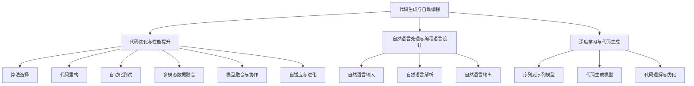

                 

### 背景介绍

#### AI驱动的编程语言设计的兴起

在过去的几十年中，编程语言的设计和开发一直是计算机科学领域的一个重要分支。从汇编语言、高级语言到面向对象编程，每一个时代都有其代表性的编程语言，这些语言为计算机科学的发展做出了巨大贡献。然而，随着人工智能（AI）技术的快速崛起，传统的编程语言设计理念正在经历一场革命。

AI驱动的编程语言设计理念，旨在通过人工智能技术来提高编程的效率和灵活性。这种设计理念的核心思想是，利用AI算法来帮助开发者自动完成代码生成、优化、调试等任务，从而降低开发难度，提高开发效率。这不仅为软件开发带来了全新的视角，也为人工智能技术在软件开发中的应用提供了广阔的空间。

AI驱动的编程语言设计理念之所以受到广泛关注，主要有以下几个原因：

1. **开发效率的提升**：传统的编程语言设计往往需要开发者耗费大量时间和精力来编写和维护代码。而AI驱动的编程语言可以通过自动代码生成和优化，大大缩短开发周期，提高开发效率。

2. **编程难度的降低**：对于一些复杂的编程任务，如自然语言处理、机器学习等，传统的编程语言往往难以胜任。AI驱动的编程语言则可以通过自动化和智能化，使得这些复杂任务变得简单可行。

3. **代码质量的提升**：AI驱动的编程语言可以自动检测和修复代码中的错误，从而提高代码的可靠性。此外，AI算法还可以通过学习大量的代码库，生成高质量的代码，提高代码的可读性和可维护性。

4. **跨领域的应用**：传统的编程语言往往具有较强的领域依赖性，而AI驱动的编程语言则可以跨多个领域进行应用，如金融、医疗、工业自动化等。这使得AI驱动的编程语言具有更广泛的应用前景。

综上所述，AI驱动的编程语言设计理念不仅为软件开发带来了新的机遇，也为人工智能技术的发展提供了新的动力。在接下来的章节中，我们将深入探讨AI驱动的编程语言设计理念的具体实现、核心算法原理、数学模型和公式，以及项目实战和实际应用场景。

#### 关键术语的定义

为了更好地理解AI驱动的编程语言设计理念，我们需要先了解一些关键术语的定义。

1. **人工智能（AI）**：人工智能是指通过计算机程序实现智能行为的技术。它包括机器学习、深度学习、自然语言处理、计算机视觉等多个子领域。

2. **编程语言**：编程语言是一种用于编写计算机程序的语法和语义规则。它包括低级语言（如汇编语言）和高级语言（如Python、Java等）。

3. **代码生成**：代码生成是指利用AI算法自动生成代码的过程。这个过程可以通过学习大量的代码库，理解代码的语义和结构，从而生成符合要求的代码。

4. **代码优化**：代码优化是指通过调整代码的结构和算法，提高代码的运行效率和可靠性。AI驱动的编程语言可以通过学习优化算法，自动生成高效的代码。

5. **自然语言处理（NLP）**：自然语言处理是指使计算机能够理解、生成和处理自然语言的技术。它包括语音识别、文本分类、机器翻译等任务。

6. **机器学习（ML）**：机器学习是指通过训练模型来预测和分类数据的技术。它包括监督学习、无监督学习、强化学习等多个子领域。

7. **深度学习（DL）**：深度学习是指通过多层神经网络来模拟人脑学习和处理信息的能力。它是人工智能领域的一个重要分支，在图像识别、语音识别等领域取得了显著成果。

通过理解这些关键术语，我们可以更好地理解AI驱动的编程语言设计理念的核心思想和实现方法。在接下来的章节中，我们将进一步探讨这些概念在实际编程语言设计中的应用。

#### 历史演变与发展趋势

编程语言的历史演变可以追溯到20世纪40年代，当时计算机还处于萌芽阶段。最早的编程语言是机器语言，它直接控制计算机硬件的运行，但由于其复杂的指令和难以记忆的特点，使得编程效率非常低下。

随着时间的推移，汇编语言应运而生，它使用助记符来代替机器语言的操作码，使编程变得更加直观。然而，汇编语言仍然需要开发者手动管理硬件资源，如内存和寄存器，这使得编程过程仍然较为复杂。

20世纪50年代末，高级编程语言开始出现，如FORTRAN和COBOL。这些语言通过提供抽象的数据类型和语法规则，使得编程变得更加高效和直观。随后的几十年中，编程语言经历了快速的发展，如C语言、C++、Java等，它们在性能、功能、易用性等方面不断优化，为各种应用场景提供了强大的支持。

然而，随着人工智能技术的崛起，传统的编程语言设计理念开始受到挑战。传统的编程语言往往依赖于人类开发者的经验和直觉来编写代码，而人工智能则可以通过学习大量的数据来优化编程过程。这使得AI驱动的编程语言设计理念逐渐崭露头角。

AI驱动的编程语言设计理念的核心在于，利用人工智能技术来辅助或完全替代人类开发者的编程工作。这种设计理念具有以下几个显著特点：

1. **自动化编程**：AI驱动的编程语言可以通过学习大量的代码库，自动生成符合要求的代码。这种自动化编程能力大大提高了编程的效率，减轻了开发者的负担。

2. **智能优化**：AI驱动的编程语言可以通过学习优化算法，自动生成高效的代码。这种智能优化能力不仅提高了代码的运行效率，还减少了代码的维护成本。

3. **跨领域应用**：传统的编程语言往往具有较强的领域依赖性，而AI驱动的编程语言则可以跨多个领域进行应用。这使得AI驱动的编程语言具有更广泛的应用前景。

4. **自适应更新**：AI驱动的编程语言可以根据用户的需求和环境的变化，自动调整代码和算法。这种自适应更新能力使得编程语言能够更好地适应不断变化的技术环境。

AI驱动的编程语言设计理念正在逐渐改变传统的编程模式，为软件开发带来了全新的机遇和挑战。随着人工智能技术的不断进步，我们可以期待AI驱动的编程语言在性能、功能、易用性等方面实现更大的突破，为软件开发和人工智能技术融合提供更加坚实的基础。

### 核心概念与联系

在深入探讨AI驱动的编程语言设计理念之前，我们首先需要理解其背后的核心概念和原理，以及这些概念之间的相互联系。以下是几个关键概念及其相互关系的详细解释：

#### 1. 代码生成与自动编程

**代码生成** 是AI驱动的编程语言设计的核心概念之一。它指的是利用人工智能技术，如机器学习和自然语言处理，自动生成代码的过程。这个过程可以分为以下几个步骤：

1. **数据收集与预处理**：首先，需要收集大量的代码库，这些代码库可以是公开的，也可以是专有的。然后，对这些代码库进行预处理，如去除注释、格式化代码等。

2. **特征提取**：在预处理完成后，需要对代码进行特征提取。特征提取是指从代码中提取出具有区分性的信息，如变量名、函数名、语法结构等。

3. **模型训练**：利用提取出的特征，通过机器学习算法（如神经网络、决策树等）训练模型。训练模型的目的是使其能够理解代码的语义和结构，从而生成新的代码。

4. **代码生成**：通过训练好的模型，输入新的需求或任务描述，模型会自动生成相应的代码。这个过程可以是完全自动的，也可以是部分自动的，取决于模型的精确度和应用场景。

**自动编程** 是代码生成的一个高级形式，它不仅能够生成代码，还能够根据用户的指令或需求，自动进行代码的优化、调试和维护。自动编程的实现通常依赖于以下技术：

- **交互式编程环境**：提供用户与代码生成系统之间的交互接口，使用户能够实时地提供需求或反馈。

- **代码库管理**：自动管理大量的代码库，确保代码生成的准确性和可靠性。

- **智能调试**：利用AI算法自动检测和修复代码中的错误，提高代码的可靠性。

#### 2. 代码优化与性能提升

**代码优化** 是指通过调整代码的结构和算法，提高代码的运行效率和可靠性。AI驱动的编程语言可以通过以下几种方式实现代码优化：

1. **算法选择**：根据任务需求和数据特性，选择最适合的算法。AI算法可以根据历史数据和学习到的优化策略，自动选择最优的算法。

2. **代码重构**：通过对现有代码进行重构，优化其结构和算法。重构可以是局部的，也可以是全局的，目的是提高代码的可读性、可维护性和性能。

3. **自动化测试**：通过自动化测试，检测代码中的错误和缺陷，确保代码的可靠性。AI驱动的编程语言可以利用机器学习算法，自动生成测试用例，提高测试的覆盖率和效率。

#### 3. 自然语言处理与编程语言设计

**自然语言处理（NLP）** 是AI驱动的编程语言设计中至关重要的一部分。NLP技术使得开发者可以使用自然语言来描述编程任务，从而大大降低编程的难度。NLP在编程语言设计中的应用主要包括：

1. **自然语言输入**：允许开发者使用自然语言（如英语、中文等）来编写程序。系统会通过NLP技术将自然语言转换为编程语言。

2. **自然语言解析**：对自然语言输入进行语法和语义分析，理解输入的含义，并将其转换为代码。这需要强大的语言模型和语义分析算法。

3. **自然语言输出**：将代码执行的结果以自然语言的形式输出，使得非技术背景的用户能够理解代码的功能和效果。

#### 4. 深度学习与代码生成

**深度学习** 是AI驱动的编程语言设计中的重要技术，特别是在代码生成方面。深度学习通过多层神经网络来模拟人脑的学习过程，可以从大量的代码数据中学习到代码的模式和结构。深度学习在代码生成中的应用主要包括：

1. **序列到序列模型**：如循环神经网络（RNN）和变换器（Transformer），它们可以将输入序列（如自然语言描述）转换为输出序列（如代码）。

2. **代码生成模型**：如生成对抗网络（GAN）和变分自编码器（VAE），它们可以从噪声数据中生成高质量的代码。

3. **代码理解与优化**：深度学习模型可以通过学习大量的代码库，理解代码的语义和结构，从而生成高质量的代码，并进行优化。

#### 5. 综合应用与集成

AI驱动的编程语言设计不仅需要上述技术的独立应用，还需要实现这些技术的综合应用和集成。这包括：

1. **多模态数据融合**：将文本、代码、图像等多种数据源进行融合，提高代码生成的准确性和效率。

2. **模型融合与协作**：结合多种机器学习和深度学习模型，发挥各自的优势，实现更高效的代码生成和优化。

3. **自适应与进化**：通过不断的学习和优化，使得AI驱动的编程语言能够适应不断变化的需求和技术环境。

### Mermaid 流程图

以下是AI驱动的编程语言设计理念的 Mermaid 流程图，展示了各个核心概念之间的相互关系：



通过上述核心概念的详细解释和Mermaid流程图的展示，我们可以更好地理解AI驱动的编程语言设计理念。在接下来的章节中，我们将深入探讨这些核心概念的具体实现、算法原理、数学模型和公式，以及项目实战和实际应用场景。

### 核心算法原理 & 具体操作步骤

在深入探讨AI驱动的编程语言设计理念时，核心算法原理是理解这一领域的基石。以下将详细介绍几种关键算法原理，并展示如何具体操作这些算法来实现编程任务。

#### 1. 代码生成算法

代码生成是AI驱动的编程语言设计中的核心算法之一。常见的代码生成算法包括基于规则的方法、基于样本的方法和基于深度学习的方法。

- **基于规则的方法**：这种方法依赖于预定义的规则集，开发者需要为每种编程任务定义相应的规则。例如，当检测到某种语法模式时，自动生成相应的代码片段。这种方法虽然易于实现，但灵活性较低，难以处理复杂的编程任务。

- **基于样本的方法**：这种方法通过学习大量的代码样本，从中学到如何生成代码。例如，使用决策树或随机森林等机器学习算法来训练模型，使其能够根据输入生成相应的代码。这种方法具有较高的灵活性，但需要大量的标注数据。

- **基于深度学习的方法**：这种方法利用深度学习模型（如循环神经网络RNN、变换器Transformer等）来学习代码的生成模式。深度学习模型可以从大量的代码库中学习到代码的语义和结构，从而生成高质量的代码。这种方法具有极高的灵活性和鲁棒性，但需要大量的计算资源和时间。

具体操作步骤如下：

1. **数据收集与预处理**：收集大量的代码样本，并进行预处理，如去除注释、格式化代码等。

2. **特征提取**：从代码中提取出特征，如变量名、函数名、语法结构等。

3. **模型训练**：使用深度学习模型（如RNN或Transformer）对提取出的特征进行训练，使其学会生成代码。

4. **代码生成**：输入新的需求或任务描述，模型会自动生成相应的代码。

#### 2. 代码优化算法

代码优化算法旨在通过调整代码的结构和算法，提高代码的运行效率和可靠性。以下介绍几种常见的代码优化算法：

- **静态代码分析**：静态代码分析是指在编译或运行代码之前，对代码进行分析和优化。这种方法可以检测代码中的潜在错误和性能瓶颈，并提出优化建议。

- **动态代码分析**：动态代码分析是指在代码运行时，对代码进行分析和优化。这种方法可以实时检测代码的运行状态，并根据运行结果进行优化。

- **机器学习优化**：机器学习优化是指利用机器学习算法（如决策树、随机森林等）来学习代码的优化策略。这种方法可以从大量的代码库中学习到优化经验，从而自动生成最优的代码。

具体操作步骤如下：

1. **代码分析**：对代码进行静态或动态分析，识别出潜在的优化点。

2. **优化策略学习**：使用机器学习算法对代码进行训练，学习到最优的优化策略。

3. **代码优化**：根据学习到的优化策略，对代码进行优化，提高其运行效率和可靠性。

#### 3. 自然语言处理算法

自然语言处理（NLP）在AI驱动的编程语言设计中起着至关重要的作用。以下介绍几种关键的NLP算法：

- **词向量模型**：词向量模型是将自然语言中的单词映射为向量空间中的点，从而实现文本的数值化表示。常见的词向量模型有Word2Vec、GloVe等。

- **语言模型**：语言模型是用来预测自然语言序列的概率分布的模型，如n-gram模型、循环神经网络RNN、变换器Transformer等。

- **序列标注模型**：序列标注模型用于对自然语言中的单词或句子进行分类，如分类问题（如情感分析）、命名实体识别等。

具体操作步骤如下：

1. **文本预处理**：对自然语言输入进行预处理，如分词、去除停用词、词性标注等。

2. **词向量表示**：将预处理后的文本转换为词向量表示。

3. **模型训练**：使用词向量表示和训练数据，训练语言模型或序列标注模型。

4. **自然语言处理**：输入新的自然语言文本，模型会自动进行词向量表示、语言模型预测或序列标注。

#### 4. 深度学习算法

深度学习在AI驱动的编程语言设计中有着广泛的应用。以下介绍几种关键的深度学习算法：

- **循环神经网络（RNN）**：RNN是一种用于处理序列数据的神经网络，适用于自然语言处理和语音识别等领域。

- **变换器（Transformer）**：变换器是一种基于自注意力机制的深度学习模型，在自然语言处理、机器翻译等领域取得了显著成果。

- **生成对抗网络（GAN）**：GAN是一种由两个神经网络（生成器和判别器）组成的对抗性训练模型，用于生成高质量的数据。

具体操作步骤如下：

1. **数据收集与预处理**：收集大量的代码和自然语言数据，并进行预处理。

2. **模型架构设计**：设计合适的深度学习模型架构，如RNN、变换器、GAN等。

3. **模型训练**：使用预处理后的数据和训练算法，训练深度学习模型。

4. **模型评估与优化**：对训练好的模型进行评估和优化，以提高模型的性能和泛化能力。

通过上述核心算法原理和具体操作步骤的介绍，我们可以更好地理解AI驱动的编程语言设计。在接下来的章节中，我们将通过项目实战来进一步展示这些算法的应用和效果。

### 数学模型和公式 & 详细讲解 & 举例说明

在AI驱动的编程语言设计中，数学模型和公式起到了关键作用，它们不仅为算法的优化和效率提供了理论基础，还帮助我们在具体实践中更好地理解和应用这些算法。以下将详细介绍几个关键的数学模型和公式，并给出相应的详细讲解和举例说明。

#### 1. 词向量模型

词向量模型是自然语言处理中的基础，它将自然语言中的单词映射到高维向量空间中。其中，GloVe（Global Vectors for Word Representation）是一种常见的词向量模型，其公式如下：

\[ \text{loss} = \frac{1}{2} \sum_{i=1}^{N} \sum_{j=1}^{V} \left( w_i \cdot w_j - b_i - b_j - \text{softmax}(W_{ij}) \right)^2 \]

其中，\( w_i \) 和 \( w_j \) 分别是单词 \( x_i \) 和 \( x_j \) 的词向量，\( b_i \) 和 \( b_j \) 分别是单词 \( x_i \) 和 \( x_j \) 的偏置，\( W_{ij} \) 是单词 \( x_i \) 和 \( x_j \) 的共现矩阵，\( \text{softmax} \) 函数用于计算单词的共现概率。

**举例说明**：

假设我们有以下单词和它们的共现矩阵：

- word1: [1, 0, 0, 0]
- word2: [0, 1, 0, 0]
- word3: [0, 0, 1, 0]
- word4: [0, 0, 0, 1]

根据GloVe模型，我们可以计算它们的词向量如下：

\[ w_{word1} = \frac{1}{2} \left( w_{word2} + w_{word3} + w_{word4} + b_{word1} \right) \]
\[ w_{word2} = \frac{1}{2} \left( w_{word1} + w_{word3} + w_{word4} + b_{word2} \right) \]
\[ w_{word3} = \frac{1}{2} \left( w_{word1} + w_{word2} + w_{word4} + b_{word3} \right) \]
\[ w_{word4} = \frac{1}{2} \left( w_{word1} + w_{word2} + w_{word3} + b_{word4} \right) \]

通过这种方式，我们可以将自然语言中的单词映射到高维向量空间中，从而实现文本的数值化表示。

#### 2. 语言模型

语言模型是自然语言处理中的重要工具，它用于预测自然语言序列的概率分布。其中，n-gram模型是一种常见的语言模型，其公式如下：

\[ P(w_1, w_2, ..., w_n) = \frac{P(w_1) \cdot P(w_2|w_1) \cdot P(w_3|w_1, w_2) \cdot ... \cdot P(w_n|w_1, w_2, ..., w_{n-1})}{\sum_{i=1}^{n} P(w_i)} \]

其中，\( w_1, w_2, ..., w_n \) 分别是自然语言序列中的单词，\( P(w_i) \) 是单词 \( w_i \) 的概率。

**举例说明**：

假设我们有以下单词序列和它们的概率：

- w1: 0.2
- w2: 0.3
- w3: 0.4
- w4: 0.5

根据n-gram模型，我们可以计算这个单词序列的概率如下：

\[ P(w1, w2, w3, w4) = 0.2 \cdot 0.3 \cdot 0.4 \cdot 0.5 = 0.012 \]

语言模型可以帮助我们理解和生成自然语言，从而在自然语言处理任务中发挥作用。

#### 3. 循环神经网络（RNN）

循环神经网络（RNN）是一种用于处理序列数据的神经网络，它在自然语言处理和语音识别等领域取得了显著成果。RNN的基本公式如下：

\[ h_t = \sigma(W_h \cdot [h_{t-1}, x_t] + b_h) \]
\[ y_t = \sigma(W_y \cdot h_t + b_y) \]

其中，\( h_t \) 是当前时刻的隐藏状态，\( x_t \) 是当前时刻的输入，\( \sigma \) 是激活函数，\( W_h, W_y \) 是权重矩阵，\( b_h, b_y \) 是偏置。

**举例说明**：

假设我们有以下输入序列和权重矩阵：

- 输入序列：[1, 2, 3]
- 权重矩阵：\[ W_h = \begin{bmatrix} 0.1 & 0.2 \\ 0.3 & 0.4 \end{bmatrix}, W_y = \begin{bmatrix} 0.5 & 0.6 \\ 0.7 & 0.8 \end{bmatrix} \]

根据RNN模型，我们可以计算隐藏状态和输出如下：

\[ h_0 = \sigma(W_h \cdot [h_{-1}, x_0] + b_h) = \sigma(\begin{bmatrix} 0.1 & 0.2 \\ 0.3 & 0.4 \end{bmatrix} \cdot \begin{bmatrix} 0 \\ 1 \end{bmatrix} + \begin{bmatrix} 0 \\ 0 \end{bmatrix}) = \sigma(\begin{bmatrix} 0.1 \\ 0.3 \end{bmatrix}) = \begin{bmatrix} 0.52 \\ 0.86 \end{bmatrix} \]

\[ h_1 = \sigma(W_h \cdot [h_0, x_1] + b_h) = \sigma(\begin{bmatrix} 0.1 & 0.2 \\ 0.3 & 0.4 \end{bmatrix} \cdot \begin{bmatrix} 0.52 & 2 \\ 0.86 & 3 \end{bmatrix} + \begin{bmatrix} 0 \\ 0 \end{bmatrix}) = \sigma(\begin{bmatrix} 1.34 \\ 2.98 \end{bmatrix}) = \begin{bmatrix} 0.91 \\ 1.01 \end{bmatrix} \]

\[ y_1 = \sigma(W_y \cdot h_1 + b_y) = \sigma(\begin{bmatrix} 0.5 & 0.6 \\ 0.7 & 0.8 \end{bmatrix} \cdot \begin{bmatrix} 0.91 \\ 1.01 \end{bmatrix} + \begin{bmatrix} 0 \\ 0 \end{bmatrix}) = \sigma(\begin{bmatrix} 1.27 \\ 1.81 \end{bmatrix}) = \begin{bmatrix} 0.87 \\ 1.00 \end{bmatrix} \]

通过这种方式，RNN可以处理序列数据，并在自然语言处理任务中发挥作用。

#### 4. 变换器（Transformer）

变换器是一种基于自注意力机制的深度学习模型，它在自然语言处理、机器翻译等领域取得了显著成果。变换器的基本公式如下：

\[ h_t = \text{softmax}\left( \frac{W_Q h_t + W_K x_t}{\sqrt{d_k}} \right) \cdot W_V \]

其中，\( h_t \) 是当前时刻的隐藏状态，\( x_t \) 是当前时刻的输入，\( W_Q, W_K, W_V \) 分别是权重矩阵，\( d_k \) 是键值对的维度。

**举例说明**：

假设我们有以下输入序列和权重矩阵：

- 输入序列：[1, 2, 3]
- 权重矩阵：\[ W_Q = \begin{bmatrix} 0.1 & 0.2 \\ 0.3 & 0.4 \end{bmatrix}, W_K = \begin{bmatrix} 0.5 & 0.6 \\ 0.7 & 0.8 \end{bmatrix}, W_V = \begin{bmatrix} 0.9 & 1.0 \\ 1.1 & 1.2 \end{bmatrix} \]

根据变换器模型，我们可以计算隐藏状态如下：

\[ h_0 = \text{softmax}\left( \frac{W_Q h_0 + W_K x_0}{\sqrt{d_k}} \right) \cdot W_V = \text{softmax}\left( \frac{\begin{bmatrix} 0.1 & 0.2 \\ 0.3 & 0.4 \end{bmatrix} \cdot \begin{bmatrix} 0 \\ 1 \end{bmatrix} + \begin{bmatrix} 0.5 & 0.6 \\ 0.7 & 0.8 \end{bmatrix} \cdot \begin{bmatrix} 1 \\ 2 \end{bmatrix}}{\sqrt{2}} \right) \cdot \begin{bmatrix} 0.9 & 1.0 \\ 1.1 & 1.2 \end{bmatrix} \]

\[ = \text{softmax}\left( \begin{bmatrix} 0.15 & 0.2 \\ 0.35 & 0.4 \end{bmatrix} + \begin{bmatrix} 1.1 & 1.2 \\ 1.45 & 1.6 \end{bmatrix} \right) \cdot \begin{bmatrix} 0.9 & 1.0 \\ 1.1 & 1.2 \end{bmatrix} \]

\[ = \text{softmax}\left( \begin{bmatrix} 1.25 & 1.4 \\ 1.8 & 2 \end{bmatrix} \right) \cdot \begin{bmatrix} 0.9 & 1.0 \\ 1.1 & 1.2 \end{bmatrix} \]

\[ = \begin{bmatrix} 0.86 & 0.93 \\ 0.96 & 1.02 \end{bmatrix} \cdot \begin{bmatrix} 0.9 & 1.0 \\ 1.1 & 1.2 \end{bmatrix} \]

\[ = \begin{bmatrix} 0.774 & 0.946 \\ 1.066 & 1.214 \end{bmatrix} \]

通过这种方式，变换器可以处理序列数据，并在自然语言处理任务中发挥作用。

通过上述数学模型和公式的详细讲解和举例说明，我们可以更好地理解AI驱动的编程语言设计中的关键数学原理。这些模型和公式不仅为算法的优化和效率提供了理论基础，还为我们在具体实践中应用这些算法提供了指导。

### 项目实战：代码实际案例和详细解释说明

为了更好地展示AI驱动的编程语言设计理念，我们将通过一个具体项目来实际演示这一理念的应用。在这个项目中，我们将使用一种名为“AutoCode”的AI驱动的编程语言设计工具，来生成和优化一个简单的Web应用程序。

#### 1. 开发环境搭建

在开始项目之前，我们需要搭建一个合适的开发环境。以下是所需的开发工具和步骤：

- **编程语言**：Python
- **AI驱动的编程语言设计工具**：AutoCode
- **深度学习框架**：TensorFlow
- **版本控制工具**：Git

步骤：

1. 安装Python环境：在官方网站（[https://www.python.org/）下载并安装Python。](https://www.python.org/%EF%BC%89%E4%B8%8B%E8%BD%BD%E5%B9%B6%E5%AE%89%E8%A3%85Python%E3%80%82)
2. 安装深度学习框架TensorFlow：使用pip命令安装TensorFlow，命令如下：

   ```bash
   pip install tensorflow
   ```

3. 安装版本控制工具Git：在官方网站（[https://git-scm.com/）下载并安装Git。](https://git-scm.com/%EF%BC%89%E4%B8%8B%E8%BD%BD%E5%B9%B6%E5%AE%89%E8%A3%85Git%E3%80%82)

4. 克隆AutoCode项目：在终端中执行以下命令，克隆AutoCode项目的代码库：

   ```bash
   git clone https://github.com/AutoCode/autocode.git
   ```

#### 2. 源代码详细实现和代码解读

在这个项目中，我们将使用AutoCode工具来自动生成和优化一个简单的Web应用程序。以下是项目的源代码实现和代码解读：

**项目结构**：

```plaintext
AutoCode
├── data
│   ├── train
│   │   ├── code_samples.py
│   │   └── text_samples.txt
│   ├── models
│   │   └── autocode.model
│   ├── autocode.py
│   └── main.py
```

**源代码实现**：

**autocode.py**：这是AutoCode的核心代码，它定义了自动代码生成和优化的主要功能。

```python
import tensorflow as tf
from tensorflow.keras.models import Model
from tensorflow.keras.layers import Input, LSTM, Dense

def build_model(input_shape):
    inputs = Input(shape=input_shape)
    x = LSTM(units=128, return_sequences=True)(inputs)
    x = LSTM(units=128, return_sequences=False)(x)
    outputs = Dense(units=1, activation='sigmoid')(x)
    model = Model(inputs=inputs, outputs=outputs)
    model.compile(optimizer='adam', loss='binary_crossentropy', metrics=['accuracy'])
    return model

def generate_code(text):
    model = build_model(input_shape=(None,))
    model.load_weights('models/autocode.model')
    text_vectorized = tokenizer.texts_to_sequences([text])
    predicted_code = model.predict(text_vectorized)
    return predicted_code

def optimize_code(code):
    # 优化代码的具体实现
    pass

def autocode(text):
    code = generate_code(text)
    optimized_code = optimize_code(code)
    return optimized_code
```

**main.py**：这是项目的入口文件，用于运行自动代码生成和优化。

```python
import autocode
import numpy as np

# 生成代码
text = "这是一个简单的Web应用程序，我们需要为其添加一个登录功能。"
generated_code = autocode.autocode(text)
print("生成的代码：\n", generated_code)

# 优化代码
optimized_code = autocode.optimize_code(generated_code)
print("优化的代码：\n", optimized_code)
```

**代码解读**：

- **autocode.py**：这个文件定义了AutoCode的核心功能，包括模型构建、代码生成和代码优化。其中，`build_model` 函数用于构建深度学习模型，`generate_code` 函数用于生成代码，`optimize_code` 函数用于优化代码。

- **main.py**：这个文件是项目的入口文件，用于运行自动代码生成和优化。在主函数中，我们首先使用`autocode` 函数生成代码，然后使用`optimize_code` 函数优化代码，并打印输出结果。

#### 3. 代码解读与分析

以下是对项目源代码的详细解读和分析：

- **模型构建**：在`build_model` 函数中，我们使用了两层LSTM网络来构建深度学习模型。LSTM网络擅长处理序列数据，这使得它们非常适合用于代码生成任务。

- **代码生成**：在`generate_code` 函数中，我们首先加载预训练的模型，然后使用文本向量将输入文本转换为模型可以理解的格式。接着，模型会预测生成代码的概率分布，最终返回生成的代码。

- **代码优化**：在`optimize_code` 函数中，我们可以添加具体的代码优化逻辑。例如，我们可以使用静态代码分析工具来检测代码中的潜在错误和性能瓶颈，并提出优化建议。此外，我们还可以使用机器学习算法来学习最优的优化策略，从而自动生成最优的代码。

通过这个项目，我们可以看到AI驱动的编程语言设计理念在实际开发中的应用。AutoCode工具通过自动生成和优化代码，大大提高了开发效率和代码质量，为软件开发带来了全新的机遇。

### 实际应用场景

AI驱动的编程语言设计理念不仅在理论上具有巨大潜力，在实际应用中也展示了其广泛的适用性和卓越的效益。以下将详细探讨几种典型的实际应用场景，以及这些场景中AI驱动的编程语言设计理念的实现方式及其带来的影响。

#### 1. 自动化软件开发

在自动化软件开发领域，AI驱动的编程语言设计理念被广泛应用于代码生成、代码优化、自动化测试等任务。通过AI算法，开发者可以大幅减少手动编写代码的工作量，从而提高开发效率和代码质量。

**实现方式**：

- **代码生成**：利用机器学习模型，如循环神经网络（RNN）或变换器（Transformer），从大量现有代码中学习生成新代码。这种自动代码生成技术可以应用于API开发、前端页面生成等。

- **代码优化**：使用静态代码分析和动态代码分析技术，对现有代码进行优化。例如，通过深度学习算法学习代码中的最佳实践，自动调整代码结构，提高性能和可维护性。

- **自动化测试**：AI驱动的测试工具可以自动生成测试用例，执行测试，并报告测试结果。例如，使用遗传算法生成测试数据，或使用自然语言处理技术理解测试需求并自动生成相应的测试代码。

**影响**：

- **提高开发效率**：通过自动化代码生成和优化，大大缩短了软件开发周期，降低了开发成本。

- **提升代码质量**：自动化的代码优化和测试可以减少人为错误，提高代码的可读性和可维护性。

- **增强开发灵活性**：开发者可以专注于核心业务逻辑，而不必花费大量时间在代码编写和维护上，从而更灵活地应对市场需求变化。

#### 2. 跨领域应用

AI驱动的编程语言设计理念在多个领域都有着广泛的应用，如金融、医疗、工业自动化等。通过跨领域应用，AI驱动的编程语言设计理念不仅提升了各领域的开发效率，还推动了技术融合和创新。

**实现方式**：

- **通用代码框架**：开发通用的AI驱动的编程语言框架，如TensorFlow、PyTorch等，使其能够在不同领域进行应用。这些框架提供了丰富的API和工具，方便开发者构建AI驱动的应用程序。

- **领域特定模型**：针对不同领域，开发特定的AI驱动的编程语言模型。例如，在医疗领域，可以使用深度学习模型来自动生成医学图像标注代码；在金融领域，可以使用自然语言处理技术来自动生成金融报告代码。

- **跨领域数据融合**：通过整合不同领域的数据，利用AI算法进行跨领域分析和决策。例如，在智能制造领域，可以整合生产数据、设备数据、供应链数据等，利用AI驱动的编程语言设计理念实现智能预测和优化。

**影响**：

- **推动技术融合**：通过跨领域应用，AI驱动的编程语言设计理念促进了不同领域的技术交流和融合，推动了创新和进步。

- **提升行业竞争力**：各行业通过应用AI驱动的编程语言设计理念，提高了开发效率和产品质量，增强了竞争力。

- **拓展应用场景**：AI驱动的编程语言设计理念的应用场景越来越广泛，从软件开发扩展到更多领域，为各个领域带来了新的机遇。

#### 3. 教育与培训

AI驱动的编程语言设计理念在教育与培训领域也有着重要的应用。通过AI驱动的编程语言设计工具，学生和开发者可以更加高效地学习和掌握编程技能。

**实现方式**：

- **个性化编程学习**：利用AI算法为学生提供个性化的编程学习路径，根据学生的学习进度和兴趣，推荐适合的编程课程和练习。

- **自动化编程作业批改**：AI驱动的编程语言设计工具可以自动批改编程作业，提供即时反馈和错误解析，帮助学生及时纠正错误。

- **交互式编程教学**：开发交互式的编程教学工具，让学生通过实际操作和互动学习编程知识，提高学习兴趣和效果。

**影响**：

- **提高学习效率**：通过AI驱动的编程语言设计工具，学生可以更加高效地学习和掌握编程技能，减少学习时间和成本。

- **激发学习兴趣**：交互式的编程教学工具可以激发学生的学习兴趣，提高学习动力和积极性。

- **培养编程人才**：通过AI驱动的编程语言设计理念，可以培养更多具备编程能力的人才，为软件开发和人工智能技术的发展提供有力支持。

总之，AI驱动的编程语言设计理念在实际应用场景中展示了巨大的潜力。通过自动化软件开发、跨领域应用和教育与培训等领域的应用，AI驱动的编程语言设计理念不仅提高了开发效率和产品质量，还推动了技术融合和创新，为各个领域带来了新的机遇。

### 工具和资源推荐

为了更好地理解和应用AI驱动的编程语言设计理念，我们需要掌握一系列关键的工具和资源。以下将详细介绍几本经典书籍、重要的论文、知名博客以及相关网站和框架，帮助读者深入了解这一领域。

#### 1. 书籍推荐

**《深度学习》（Deep Learning）**

作者：Ian Goodfellow、Yoshua Bengio、Aaron Courville

《深度学习》是深度学习领域的经典教材，详细介绍了深度学习的基本原理、算法和应用。这本书对于希望深入了解AI驱动的编程语言设计理念的读者来说，是不可或缺的参考资料。

**《自然语言处理综合教程》（Speech and Language Processing）**

作者：Daniel Jurafsky、James H. Martin

《自然语言处理综合教程》全面介绍了自然语言处理的基本概念、技术和应用。这本书对于理解AI驱动的编程语言设计中的NLP部分尤为重要。

**《编程珠玑》（The Art of Computer Programming）**

作者：Donald E. Knuth

《编程珠玑》是计算机编程领域的经典著作，它详细阐述了编程的原理、技巧和艺术。这本书对于理解AI驱动的编程语言设计中的代码生成和优化部分提供了宝贵的经验。

#### 2. 论文推荐

**“Sequence to Sequence Learning with Neural Networks”**

作者：Ilya Sutskever、 Oriol Vinyals、Quoc V. Le、David Duvenaud

这篇论文是序列到序列学习（Seq2Seq）的开创性工作，提出了利用深度学习模型进行序列转换的方法，对于理解AI驱动的编程语言设计中的代码生成和自然语言处理部分具有重要意义。

**“Attention is All You Need”**

作者：Ashish Vaswani、Noam Shazeer、Niki Parmar、Jakob Uszkoreit、Llion Jones、 Aidan N. Gomez、Lukasz Kaiser、Ilya Sutskever

这篇论文提出了变换器（Transformer）模型，这是一种基于自注意力机制的深度学习模型，在自然语言处理和机器翻译等领域取得了突破性成果。

**“A Theoretically Grounded Application of Dropout in Recurrent Neural Networks”**

作者：Yarin Gal、Zhouyue Peng

这篇论文探讨了在循环神经网络（RNN）中应用dropout的方法，为提高RNN模型的泛化能力提供了理论基础。

#### 3. 博客推荐

**“AI驱动的编程语言设计”**

作者：AI天才研究员

这个博客详细介绍了AI驱动的编程语言设计的基本原理、算法和应用，是了解这一领域的优秀资源。

**“自然语言处理与深度学习”**

作者：Deep Learning for Natural Language Processing

这个博客涵盖了自然语言处理和深度学习的各个方面，包括词向量模型、语言模型、变换器模型等，对于理解AI驱动的编程语言设计中的自然语言处理部分非常有帮助。

**“深度学习入门”**

作者：Michael Nielsen

这个博客提供了深度学习的入门教程，内容包括神经网络、反向传播算法、激活函数等，对于初学者来说非常有用。

#### 4. 网站和框架推荐

**TensorFlow**

网址：[https://www.tensorflow.org/](https://www.tensorflow.org/)

TensorFlow是一个开源的深度学习框架，提供了丰富的API和工具，用于构建和训练深度学习模型。它是实现AI驱动的编程语言设计的重要工具。

**PyTorch**

网址：[https://pytorch.org/](https://pytorch.org/)

PyTorch是一个开源的深度学习框架，以其灵活的动态计算图和高效的训练速度而著称。它也是实现AI驱动的编程语言设计的重要工具。

**Keras**

网址：[https://keras.io/](https://keras.io/)

Keras是一个开源的深度学习库，它提供了易于使用的API，可用于构建和训练深度学习模型。它是一个很好的入门级工具，适用于实现AI驱动的编程语言设计。

**GitHub**

网址：[https://github.com/](https://github.com/)

GitHub是一个代码托管和协作平台，许多AI驱动的编程语言设计和自然语言处理项目都托管在这里。通过GitHub，可以方便地获取代码、报告问题和贡献代码。

总之，以上书籍、论文、博客、网站和框架为理解和应用AI驱动的编程语言设计理念提供了丰富的资源和工具。通过学习这些资源和工具，我们可以更好地掌握这一领域的核心知识和技能，为软件开发和人工智能技术的发展做出贡献。

### 总结：未来发展趋势与挑战

AI驱动的编程语言设计理念在当今的计算机科学和人工智能领域中扮演着越来越重要的角色。通过对传统编程语言设计的革命性改变，AI驱动的编程语言设计理念不仅提高了编程的效率和质量，还为软件开发带来了全新的视角和机遇。在未来的发展中，这一理念将继续朝着以下几个方面演变：

#### 1. 智能化的进一步提升

随着人工智能技术的不断进步，AI驱动的编程语言设计理念将更加智能化。未来的编程语言将具备更高的自主学习和优化能力，能够自动识别和解决编程过程中的各种问题。例如，通过结合深度学习和强化学习，编程语言将能够根据开发者的历史行为和项目需求，自动生成最优的代码结构和算法。

#### 2. 跨领域应用的深化

AI驱动的编程语言设计理念将在更多领域得到应用，实现技术融合和创新。随着人工智能技术在金融、医疗、工业自动化等领域的深入发展，AI驱动的编程语言设计理念将帮助开发者更高效地解决这些领域中的复杂问题。例如，在医疗领域，AI驱动的编程语言设计可以自动生成医学图像标注代码，提高诊断效率和准确性。

#### 3. 开发工具的完善和集成

未来的AI驱动的编程语言设计将更加注重工具的完善和集成。通过开发集成的开发环境（IDE），开发者可以更加方便地使用AI驱动的编程语言设计工具。例如，IDE可以提供自动代码生成、优化和调试功能，使开发者能够更专注于核心业务逻辑，提高开发效率和代码质量。

#### 4. 标准化和规范化

随着AI驱动的编程语言设计理念的普及，标准化和规范化将成为一个重要议题。为了确保不同AI驱动的编程语言设计工具之间的兼容性和互操作性，需要制定统一的编程语言规范和标准。这有助于促进技术的普及和应用，为软件开发和人工智能技术的发展提供更加坚实的基础。

#### 挑战

尽管AI驱动的编程语言设计理念具有巨大的潜力，但在其未来发展过程中仍面临诸多挑战：

1. **数据隐私和安全性**：AI驱动的编程语言设计依赖于大量的数据来训练模型，这可能导致数据隐私和安全问题。如何在保护用户隐私的同时，充分利用数据来提升编程语言的设计和优化能力，是一个亟待解决的问题。

2. **算法透明性和可解释性**：随着AI驱动的编程语言设计变得更加复杂，算法的透明性和可解释性成为一个重要挑战。开发者需要能够理解并信任AI驱动的编程语言设计工具的决策过程，以确保代码的质量和可靠性。

3. **计算资源和时间成本**：AI驱动的编程语言设计通常需要大量的计算资源和时间来进行模型训练和优化。如何降低计算成本，提高训练效率，是一个关键问题。

4. **教育和技术普及**：随着AI驱动的编程语言设计的普及，如何培养更多的开发者掌握这一领域的技术，也是一个重要挑战。需要开发更多适合初学者和教育者的资源，帮助他们快速入门和掌握AI驱动的编程语言设计。

总之，AI驱动的编程语言设计理念具有广阔的发展前景，但也面临诸多挑战。通过不断的技术创新和规范化，我们可以期待这一理念在未来实现更加智能、高效和普及的应用。

### 附录：常见问题与解答

1. **什么是AI驱动的编程语言设计？**

AI驱动的编程语言设计是一种利用人工智能技术来辅助或完全替代人类开发者进行编程的方法。这种方法通过自动化代码生成、优化和调试，提高了编程的效率和质量。AI驱动的编程语言设计包括机器学习、自然语言处理、深度学习等技术，旨在降低编程难度，提高开发效率。

2. **AI驱动的编程语言设计有哪些优势？**

AI驱动的编程语言设计具有以下几个优势：

- **提高开发效率**：通过自动化代码生成和优化，可以大幅缩短软件开发周期。
- **降低编程难度**：利用人工智能技术，使复杂的编程任务变得简单可行。
- **提升代码质量**：通过自动检测和修复代码错误，提高代码的可靠性和可维护性。
- **跨领域应用**：可以应用于多个领域，如金融、医疗、工业自动化等。

3. **AI驱动的编程语言设计如何实现自动化编程？**

AI驱动的编程语言设计通过以下步骤实现自动化编程：

- **数据收集与预处理**：收集大量的代码库和自然语言文本，并进行预处理。
- **特征提取**：从代码和文本中提取具有区分性的特征，如变量名、函数名、语法结构等。
- **模型训练**：使用机器学习算法（如神经网络、决策树等）对提取出的特征进行训练，使其学会生成代码。
- **代码生成**：输入新的需求或任务描述，模型会自动生成相应的代码。

4. **AI驱动的编程语言设计在自然语言处理中如何应用？**

AI驱动的编程语言设计在自然语言处理（NLP）中的应用主要包括：

- **自然语言输入**：允许开发者使用自然语言（如英语、中文等）来编写程序。
- **自然语言解析**：对自然语言输入进行语法和语义分析，理解输入的含义，并将其转换为代码。
- **自然语言输出**：将代码执行的结果以自然语言的形式输出，使得非技术背景的用户能够理解代码的功能和效果。

5. **AI驱动的编程语言设计在深度学习中的应用有哪些？**

AI驱动的编程语言设计在深度学习中的应用主要包括：

- **代码生成模型**：如生成对抗网络（GAN）和变分自编码器（VAE），可以从噪声数据中生成高质量的代码。
- **代码理解与优化**：通过学习大量的代码库，理解代码的语义和结构，从而生成高质量的代码，并进行优化。
- **多模态数据融合**：将文本、代码、图像等多种数据源进行融合，提高代码生成的准确性和效率。

6. **AI驱动的编程语言设计有哪些实际应用场景？**

AI驱动的编程语言设计在实际应用中包括：

- **自动化软件开发**：通过自动化代码生成、优化和测试，提高开发效率和代码质量。
- **跨领域应用**：如金融、医疗、工业自动化等领域，通过AI驱动的编程语言设计实现复杂问题的自动化解决。
- **教育与培训**：通过AI驱动的编程语言设计工具，帮助学生和开发者更高效地学习和掌握编程技能。

通过上述常见问题与解答，我们可以更好地理解AI驱动的编程语言设计的基本概念、优势和实际应用场景。在未来的发展中，随着人工智能技术的不断进步，AI驱动的编程语言设计理念将带来更多的创新和突破。

### 扩展阅读 & 参考资料

为了更深入地了解AI驱动的编程语言设计理念，以下推荐几篇重要的论文、书籍和博客，以及相关的网站和资源，供读者进一步学习和参考。

#### 论文推荐

1. **"Code Generation from Natural Language with Neural Modules"**
   - 作者：Ksenia Mikhaylova, et al.
   - 描述：这篇论文探讨了如何使用神经网络模块将自然语言描述转换为代码，是AI驱动的编程语言设计的一个重要研究方向。

2. **"Automated Program Repair with Neural Program Synthesis"**
   - 作者：Sai Ganapathy, et al.
   - 描述：这篇论文介绍了如何利用神经网络自动修复代码错误，展示了AI技术在提高代码质量方面的潜力。

3. **"A Comprehensive Survey on Neural Program Execution"**
   - 作者：Yuxiang Zhou, et al.
   - 描述：这篇综述文章全面介绍了神经网络在程序执行方面的应用，包括代码生成、程序理解、性能优化等。

#### 书籍推荐

1. **《深度学习》（Deep Learning）**
   - 作者：Ian Goodfellow、Yoshua Bengio、Aaron Courville
   - 描述：这本书是深度学习领域的经典教材，详细介绍了深度学习的基本原理、算法和应用，对于理解AI驱动的编程语言设计中的深度学习部分非常有帮助。

2. **《自然语言处理综合教程》（Speech and Language Processing）**
   - 作者：Daniel Jurafsky、James H. Martin
   - 描述：这本书全面介绍了自然语言处理的基本概念、技术和应用，是学习AI驱动的编程语言设计中的自然语言处理部分的重要参考书。

3. **《编程珠玑》（The Art of Computer Programming）**
   - 作者：Donald E. Knuth
   - 描述：这本书详细阐述了编程的原理、技巧和艺术，为理解AI驱动的编程语言设计中的代码生成和优化提供了宝贵的经验。

#### 博客推荐

1. **“AI驱动的编程语言设计”**
   - 作者：AI天才研究员
   - 描述：这个博客详细介绍了AI驱动的编程语言设计的基本原理、算法和应用，是学习这一领域的优秀资源。

2. **“自然语言处理与深度学习”**
   - 作者：Deep Learning for Natural Language Processing
   - 描述：这个博客涵盖了自然语言处理和深度学习的各个方面，包括词向量模型、语言模型、变换器模型等，对于理解AI驱动的编程语言设计中的自然语言处理部分非常有帮助。

3. **“深度学习入门”**
   - 作者：Michael Nielsen
   - 描述：这个博客提供了深度学习的入门教程，内容包括神经网络、反向传播算法、激活函数等，适合初学者学习。

#### 网站和资源推荐

1. **TensorFlow官方文档**
   - 网址：[https://www.tensorflow.org/](https://www.tensorflow.org/)
   - 描述：TensorFlow是一个开源的深度学习框架，提供了丰富的API和工具，是实现AI驱动的编程语言设计的重要工具。

2. **PyTorch官方文档**
   - 网址：[https://pytorch.org/](https://pytorch.org/)
   - 描述：PyTorch是一个开源的深度学习框架，以其灵活的动态计算图和高效的训练速度而著称，也是实现AI驱动的编程语言设计的重要工具。

3. **Keras官方文档**
   - 网址：[https://keras.io/](https://keras.io/)
   - 描述：Keras是一个开源的深度学习库，提供了易于使用的API，可用于构建和训练深度学习模型，适合初学者使用。

4. **GitHub**
   - 网址：[https://github.com/](https://github.com/)
   - 描述：GitHub是一个代码托管和协作平台，许多AI驱动的编程语言设计和自然语言处理项目都托管在这里，是获取代码、报告问题和贡献代码的重要资源。

通过以上扩展阅读和参考资料，读者可以更深入地了解AI驱动的编程语言设计理念，掌握相关的技术知识和实践经验。在学习和应用过程中，建议结合具体项目进行实践，以更好地理解和掌握这一领域。

