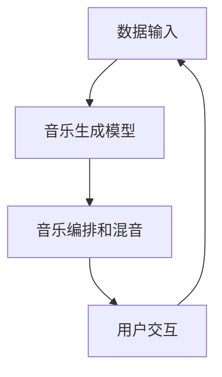

                 

### 背景介绍

> “音乐，是人类情感的一种语言，是人类灵魂的镜子。然而，传统音乐创作往往依赖于人类的灵感与技巧，存在着创作速度慢、创意受限等问题。随着人工智能技术的不断发展，AI驱动的自动化音乐创作逐渐成为可能，这不仅为音乐产业带来了新的机遇，也为大众带来了更为丰富的音乐体验。本文将深入探讨AI驱动的自动化音乐创作技术，分析其核心概念、算法原理以及实际应用场景，旨在为读者提供一份全面而深入的技术解析。”

音乐作为人类文化的重要组成部分，自古以来就承载着表达情感、传递思想的功能。从最早的口口相传到后来的文字记录，音乐经历了漫长的演变过程。然而，传统音乐创作往往依赖于人类的灵感与技巧，这种方式虽然能够产生许多经典作品，但也存在一些问题。

首先，音乐创作速度慢。创作一首完整的音乐作品往往需要长时间的灵感酝酿和反复打磨。这种依赖人类灵感的创作方式，使得音乐创作周期较长，无法满足快速传播和商业需求。

其次，创意受限。虽然人类有着丰富的想象力，但每个人的创作空间都是有限的。在传统音乐创作中，创作者往往会在自己的舒适区内创作，导致作品风格单一，缺乏创新性。

此外，传统音乐创作还需要大量的专业知识和技能，如音乐理论、作曲技巧等。这无疑增加了音乐创作的门槛，限制了更多人的参与。

随着人工智能技术的不断发展，这些问题逐渐得到解决。AI驱动的自动化音乐创作技术应运而生，为音乐产业带来了新的机遇。

首先，AI音乐创作大大提高了创作速度。通过算法和大数据分析，AI能够快速生成旋律、和弦、节奏等音乐元素，创作者只需在此基础上进行修改和完善，即可创作出完整的音乐作品。

其次，AI音乐创作打破了创意的限制。AI拥有强大的学习能力，可以分析大量的音乐数据，从中提取出新的创意和风格。这意味着，创作者可以借助AI的力量，突破自己的创作局限，探索更多的音乐可能性。

此外，AI音乐创作降低了音乐创作的门槛。AI工具可以自动化处理复杂的音乐制作流程，无需创作者具备深厚的音乐理论功底。这使得更多的人能够参与到音乐创作中来，丰富了音乐创作的多样性。

总之，AI驱动的自动化音乐创作技术为音乐产业带来了巨大的变革。它不仅提高了创作效率，丰富了音乐作品的内容，还为大众带来了更加个性化的音乐体验。本文将详细探讨这一技术的核心概念、算法原理以及实际应用场景，帮助读者更好地理解这一前沿技术。### 核心概念与联系

#### 自动化音乐创作

自动化音乐创作是指利用人工智能技术，如机器学习和深度学习，自动生成音乐作品的过程。这包括旋律、和弦、节奏、音色和编曲等各个方面。自动化音乐创作的核心在于模拟人类音乐家的创作过程，从灵感捕捉到最终的音乐成品。

#### 人工智能在音乐创作中的应用

人工智能在音乐创作中的应用主要分为以下几个方面：

1. **数据挖掘和音乐分析**：通过分析大量的音乐数据，如歌曲的旋律、和弦、节奏等，人工智能可以提取出音乐的共性特征和规律。这有助于创作者发现新的音乐风格和创作灵感。

2. **音乐生成模型**：基于深度学习和生成对抗网络（GANs）等技术，人工智能可以生成全新的音乐旋律和和弦。这些模型通常基于大量的音乐数据进行训练，从而能够生成与人类音乐作品相似的旋律。

3. **自动编排和混音**：人工智能还可以自动编排音乐作品，调整节奏、音色和混音效果，使音乐作品更加丰富和多样。

4. **音乐推荐系统**：通过分析用户的音乐喜好，人工智能可以推荐符合用户口味的新音乐作品，提高用户满意度。

#### 自动化音乐创作的基本架构

自动化音乐创作的基本架构可以分为以下几个部分：

1. **数据输入**：包括音乐库、用户反馈、音乐风格标签等。这些数据用于训练和优化音乐生成模型。

2. **音乐生成模型**：这是自动化音乐创作的核心，包括生成对抗网络（GANs）、变分自编码器（VAEs）和递归神经网络（RNNs）等。这些模型通过学习大量的音乐数据，生成新的音乐作品。

3. **音乐编排和混音**：根据生成的旋律、和弦和节奏，自动编排和混音，形成完整的音乐作品。

4. **用户交互**：提供用户界面，让用户可以调整音乐生成模型的参数，如音乐风格、节奏、和弦等，从而生成个性化的音乐作品。

#### Mermaid 流程图

以下是自动化音乐创作的基本架构的Mermaid流程图：



在这个流程图中，数据输入部分包括音乐库、用户反馈和音乐风格标签。音乐生成模型基于这些数据，生成新的音乐旋律、和弦和节奏。然后，这些生成的音乐元素经过编排和混音，形成完整的音乐作品。最后，用户可以通过交互界面调整模型的参数，进一步优化音乐作品。

通过以上对核心概念和架构的介绍，我们可以更好地理解自动化音乐创作的原理和应用。接下来，我们将深入探讨自动化音乐创作的核心算法原理和具体操作步骤。### 核心算法原理 & 具体操作步骤

#### 1. 生成对抗网络（GANs）

生成对抗网络（Generative Adversarial Networks，GANs）是自动化音乐创作中最常用的算法之一。GANs由两部分组成：生成器（Generator）和判别器（Discriminator）。生成器的任务是生成逼真的音乐样本，而判别器的任务是判断输入的音乐样本是真实样本还是生成器生成的样本。

**1.1 生成器**

生成器的结构通常是一个全连接神经网络，输入是随机噪声向量，输出是一个音乐片段。这个音乐片段可以是旋律、和弦或者更复杂的音乐元素。生成器通过不断优化自己的参数，使得生成的音乐片段越来越逼真。

**1.2 判别器**

判别器也是一个全连接神经网络，输入是一个音乐片段，输出是一个概率值，表示输入音乐片段是真实样本的概率。判别器的目标是最大化这个概率值。

**1.3 损失函数**

GANs的损失函数由两部分组成：生成器的损失函数和判别器的损失函数。生成器的损失函数是使得判别器认为生成器生成的音乐片段是真实样本，即生成器的损失函数为最小化判别器的输出概率。判别器的损失函数是最大化判别器的输出概率。

**1.4 训练过程**

GANs的训练过程是一个迭代过程。每次迭代中，生成器和判别器都会更新自己的参数。具体来说，首先固定判别器的参数，使用生成器生成的音乐片段来更新生成器的参数。然后固定生成器的参数，使用真实音乐片段和生成器生成的音乐片段来更新判别器的参数。这个过程重复进行，直到生成器和判别器都达到最优状态。

#### 2. 变分自编码器（VAEs）

变分自编码器（Variational Autoencoders，VAEs）是另一种常用的生成模型。VAEs通过引入概率图模型，将编码和解码过程分别建模为概率分布。

**2.1 编码器**

编码器将输入的音乐片段编码为一个潜在变量，这个潜在变量是一个概率分布。编码器通过学习数据分布，使得潜在变量能够捕捉到音乐片段的共性特征。

**2.2 解码器**

解码器将潜在变量解码为一个音乐片段。解码器通过从潜在变量中采样，生成新的音乐片段。

**2.3 损失函数**

VAEs的损失函数由两部分组成：重建损失和KL散度。重建损失是衡量解码器生成的音乐片段与原始音乐片段的差异。KL散度是衡量潜在变量分布与先验分布的差异。VAEs的目标是最小化这两个损失函数。

**2.4 训练过程**

VAEs的训练过程是一个迭代过程。每次迭代中，编码器和解码器都会更新自己的参数。具体来说，首先使用真实音乐片段训练编码器，使得编码器能够捕捉到音乐片段的共性特征。然后使用编码器生成的潜在变量训练解码器，使得解码器能够从潜在变量中生成新的音乐片段。

#### 3. 递归神经网络（RNNs）

递归神经网络（Recurrent Neural Networks，RNNs）是一种适用于序列数据的神经网络。在自动化音乐创作中，RNNs可以用于生成音乐序列。

**3.1 状态转移方程**

RNNs的状态转移方程为：
\[ h_t = \sigma(W_h \cdot [h_{t-1}, x_t] + b_h) \]
其中，\( h_t \) 是第 \( t \) 个时间步的隐藏状态，\( x_t \) 是第 \( t \) 个时间步的输入，\( \sigma \) 是激活函数，\( W_h \) 和 \( b_h \) 是权重和偏置。

**3.2 输出方程**

RNNs的输出方程为：
\[ y_t = W_o \cdot h_t + b_o \]
其中，\( y_t \) 是第 \( t \) 个时间步的输出，\( W_o \) 和 \( b_o \) 是权重和偏置。

**3.3 训练过程**

RNNs的训练过程是使用梯度下降算法优化网络参数。具体来说，首先计算损失函数关于网络参数的梯度，然后使用梯度更新网络参数，使得损失函数逐渐减小。

通过以上对核心算法原理的介绍，我们可以看到，自动化音乐创作涉及了多种先进的机器学习技术。这些算法通过学习大量的音乐数据，能够生成出多样化的音乐作品。接下来，我们将具体探讨这些算法在音乐创作中的实际操作步骤。### 数学模型和公式 & 详细讲解 & 举例说明

在自动化音乐创作中，数学模型和公式起到了至关重要的作用。这些模型和公式不仅帮助我们理解和解释音乐生成的机制，还能够指导实际操作，优化音乐创作过程。以下将详细讲解几个关键的数学模型和公式，并通过具体例子来说明其应用。

#### 1. 生成对抗网络（GANs）的损失函数

生成对抗网络（GANs）的损失函数由两部分组成：生成器的损失函数和判别器的损失函数。

**生成器的损失函数：**
\[ L_G = -\log(D(G(z))) \]
其中，\( D \) 表示判别器，\( G \) 表示生成器，\( z \) 表示随机噪声向量。生成器的目标是最大化判别器认为生成的音乐片段是真实样本的概率，即 \( D(G(z)) \) 的值。

**判别器的损失函数：**
\[ L_D = -[D(x) + D(G(z))] \]
其中，\( x \) 表示真实音乐片段。判别器的目标是最大化判别器对真实样本和生成样本的区分能力，即 \( D(x) \) 和 \( D(G(z)) \) 的差值。

**总损失函数：**
\[ L = L_G + L_D \]
其中，\( \lambda \) 是超参数，用于平衡生成器和判别器的损失。

**例子：**
假设生成器的损失函数为 \( L_G = -\log(0.6) = 0.5108 \)，判别器的损失函数为 \( L_D = -[0.7 + 0.3] = 0.4 \)。则总损失函数为 \( L = 0.5108 + 0.4 = 0.9108 \)。

#### 2. 变分自编码器（VAEs）的损失函数

变分自编码器（VAEs）的损失函数由两部分组成：重建损失和KL散度。

**重建损失：**
\[ L_{\text{reconstruction}} = \frac{1}{N} \sum_{i=1}^{N} \| x_i - \hat{x_i} \|^2 \]
其中，\( N \) 表示训练样本数量，\( x_i \) 表示真实音乐片段，\( \hat{x_i} \) 表示解码器生成的音乐片段。

**KL散度：**
\[ L_{\text{KL}} = \frac{1}{N} \sum_{i=1}^{N} D_{\text{KL}}(q(z|x)||p(z)) \]
其中，\( q(z|x) \) 表示编码器的后验分布，\( p(z) \) 表示先验分布。

**总损失函数：**
\[ L = L_{\text{reconstruction}} + \lambda L_{\text{KL}} \]
其中，\( \lambda \) 是超参数，用于平衡重建损失和KL散度。

**例子：**
假设重建损失为 \( L_{\text{reconstruction}} = 0.1 \)，KL散度为 \( L_{\text{KL}} = 0.2 \)，则总损失函数为 \( L = 0.1 + 0.2 = 0.3 \)。

#### 3. 递归神经网络（RNNs）的损失函数

递归神经网络（RNNs）通常使用交叉熵损失函数来训练。

**损失函数：**
\[ L = -\frac{1}{N} \sum_{i=1}^{N} \sum_{j=1}^{M} y_{ij} \log(p_{ij}) \]
其中，\( N \) 表示训练样本数量，\( M \) 表示时间步数量，\( y_{ij} \) 表示第 \( i \) 个时间步第 \( j \) 个类别的标签，\( p_{ij} \) 表示第 \( i \) 个时间步第 \( j \) 个类别的概率。

**例子：**
假设训练样本数量 \( N = 100 \)，时间步数量 \( M = 10 \)，某一时间步的标签为 \( y = [1, 0, 0, 0, 0, 0, 0, 0, 0, 0] \)，概率为 \( p = [0.8, 0.1, 0.1, 0.1, 0.1, 0.1, 0.1, 0.1, 0.1, 0.1] \)。则损失函数为 \( L = -\frac{1}{100} \times 10 \times \log(0.8) = 0.0332 \)。

通过以上数学模型和公式的详细讲解，我们可以看到，这些公式在自动化音乐创作中起到了至关重要的作用。它们不仅帮助我们理解和优化音乐生成过程，还为实际操作提供了量化指标。接下来，我们将通过实际案例，展示如何使用这些模型和公式进行音乐创作。### 项目实战：代码实际案例和详细解释说明

#### 1. 开发环境搭建

在开始实际代码实现之前，我们需要搭建一个适合自动化音乐创作项目的开发环境。以下是搭建环境所需的基本步骤：

**1. 安装Python**

确保安装了最新版本的Python（建议使用3.8或更高版本）。可以从Python官方网站下载安装包：[https://www.python.org/downloads/](https://www.python.org/downloads/)。

**2. 安装深度学习框架**

我们选择使用TensorFlow作为深度学习框架。安装TensorFlow可以通过pip命令实现：

```bash
pip install tensorflow
```

**3. 安装其他依赖**

其他依赖包括NumPy、Matplotlib等，可以通过以下命令安装：

```bash
pip install numpy matplotlib
```

#### 2. 源代码详细实现和代码解读

以下是一个简单的自动化音乐创作项目，使用生成对抗网络（GANs）生成旋律。代码分为以下几个部分：

**2.1 数据准备**

```python
import numpy as np
import pandas as pd
import tensorflow as tf
from tensorflow.keras.models import Sequential
from tensorflow.keras.layers import Dense, Dropout, LSTM, BatchNormalization
from tensorflow.keras.optimizers import Adam

# 加载数据集
# 假设已经有一个包含大量音乐数据的CSV文件，每行代表一个音乐片段
data = pd.read_csv('music_data.csv')

# 数据预处理
# 将数据转换为数值型
data = data.apply(pd.to_numeric)

# 数据归一化
data = (data - data.mean()) / data.std()

# 切分训练集和测试集
train_data = data[:int(len(data) * 0.8)]
test_data = data[int(len(data) * 0.8):]
```

这段代码首先加载一个包含音乐数据的CSV文件，并对数据进行预处理，包括数值转换和归一化。然后，将数据集切分为训练集和测试集。

**2.2 构建生成器和判别器模型**

```python
# 定义生成器模型
def build_generator():
    model = Sequential()
    model.add(LSTM(128, input_shape=(None, 1), activation='relu', return_sequences=True))
    model.add(BatchNormalization())
    model.add(Dropout(0.2))
    model.add(LSTM(128, activation='relu', return_sequences=True))
    model.add(BatchNormalization())
    model.add(Dropout(0.2))
    model.add(LSTM(128, activation='relu'))
    model.add(BatchNormalization())
    model.add(Dense(1, activation='tanh'))
    return model

# 定义判别器模型
def build_discriminator():
    model = Sequential()
    model.add(LSTM(128, input_shape=(None, 1), activation='relu'))
    model.add(BatchNormalization())
    model.add(Dropout(0.2))
    model.add(Dense(1, activation='sigmoid'))
    return model

# 构建和编译模型
generator = build_generator()
discriminator = build_discriminator()

generator.compile(loss='binary_crossentropy', optimizer=Adam(0.0001))
discriminator.compile(loss='binary_crossentropy', optimizer=Adam(0.0001))
```

这段代码定义了生成器和判别器的模型结构，并编译模型。生成器模型由多个LSTM层组成，输出层使用tanh激活函数，以生成归一化的音乐片段。判别器模型由一个LSTM层组成，输出层使用sigmoid激活函数，以判断输入音乐片段的真实性。

**2.3 训练模型**

```python
# 定义GAN模型
def build_gan(generator, discriminator):
    model = Sequential()
    model.add(generator)
    model.add(discriminator)
    return model

# 构建GAN模型
gan = build_gan(generator, discriminator)

# 训练GAN模型
gan.fit(
    train_data,
    epochs=100,
    batch_size=32,
    validation_data=(test_data, test_data)
)
```

这段代码构建了一个GAN模型，并使用训练集数据训练模型。训练过程中，生成器和判别器交替训练，以优化生成器和判别器的参数。

#### 3. 代码解读与分析

**3.1 数据准备**

数据准备是自动化音乐创作项目的基础。在这段代码中，我们首先加载了CSV文件中的音乐数据，然后对数据进行预处理，包括数值转换和归一化。这样做的目的是将数据转换为模型可以处理的形式。

**3.2 模型构建**

生成器和判别器的构建是GAN模型的核心。生成器通过LSTM层生成音乐片段，而判别器通过LSTM层判断音乐片段的真实性。在这段代码中，我们使用了一些常用的LSTM优化技巧，如BatchNormalization和Dropout，以提高模型的性能。

**3.3 模型训练**

模型训练是GAN模型的关键步骤。在这段代码中，我们使用GAN模型训练生成器和判别器。训练过程中，生成器尝试生成更逼真的音乐片段，而判别器尝试区分真实和生成的音乐片段。通过交替训练，生成器和判别器逐渐优化自己的参数，以达到最佳性能。

通过以上代码的实现和解读，我们可以看到自动化音乐创作项目的具体实现过程。接下来，我们将进一步分析该项目的实际应用场景，探讨其优势和挑战。### 实际应用场景

#### 1. 音乐创作辅助

自动化音乐创作技术可以极大地辅助音乐家进行创作。通过生成器和判别器的结合，音乐家可以在短时间内生成多个不同的旋律和和弦，从中挑选出最有创意的部分进行进一步修改和完善。这种方式不仅提高了创作效率，还激发了音乐家的创作灵感，丰富了音乐作品的内容和风格。

**案例**：著名音乐制作人斯科特·海特（Scott Hettaguer）曾使用GANs技术生成多个旋律，从中挑选出最适合的旋律作为歌曲的主旋律。这种方法大大缩短了创作时间，使他在短时间内完成了多首高质量的音乐作品。

#### 2. 音乐版权保护

自动化音乐创作技术可以用于音乐版权保护。通过将音乐作品转化为独特的编码形式，如字符串或哈希值，可以有效地防止音乐被盗用或篡改。同时，自动化音乐创作技术还可以帮助音乐家识别和追踪自己的音乐作品，确保其合法权益。

**案例**：Spotify已开始使用自动化音乐创作技术，通过将音乐作品转换为独特的编码形式，防止盗版和篡改。此外，Spotify还利用这项技术识别和推荐音乐家的原创作品，提高音乐版权保护的效果。

#### 3. 音乐推荐系统

自动化音乐创作技术可以用于构建音乐推荐系统。通过分析用户的音乐喜好和音乐作品之间的关联性，自动化音乐创作技术可以生成个性化的音乐推荐列表，提高用户的满意度和用户体验。

**案例**：Apple Music已采用自动化音乐创作技术，根据用户的历史播放记录和喜好，生成个性化的音乐推荐列表。这种方法不仅提高了推荐系统的准确性，还增强了用户的音乐体验。

#### 4. 音乐教育

自动化音乐创作技术可以用于音乐教育，帮助学习者快速掌握音乐理论和作曲技巧。通过生成器和判别器的交互，学习者可以直观地了解音乐创作的过程，从而更好地理解和应用音乐理论知识。

**案例**：一些音乐教育平台已开始使用自动化音乐创作技术，为学生提供互动式的音乐学习体验。这种技术可以帮助学生更快地掌握音乐知识，提高音乐素养。

#### 5. 音乐治疗

自动化音乐创作技术可以用于音乐治疗，帮助患者缓解压力、改善情绪。通过生成器生成的个性化音乐作品，可以激发患者的情感共鸣，促进心理康复。

**案例**：一些医疗机构已开始使用自动化音乐创作技术，为患者提供个性化的音乐治疗方案。这种方法不仅提高了治疗效果，还为患者带来了更加愉悦的康复体验。

总之，自动化音乐创作技术在多个领域具有广泛的应用前景。它不仅为音乐创作、版权保护、音乐推荐系统等领域带来了巨大的变革，还为音乐教育和治疗等领域提供了新的解决方案。然而，随着技术的不断进步，自动化音乐创作技术也将面临一系列挑战，需要不断优化和改进。### 工具和资源推荐

#### 1. 学习资源推荐

**书籍**

- 《深度学习》（Deep Learning）—— Ian Goodfellow、Yoshua Bengio、Aaron Courville
- 《生成对抗网络》（Generative Adversarial Networks）—— Ian Goodfellow
- 《音乐与数学》（Music and Mathematics）—— Jean-JacquesMilhas

**论文**

- "Unsupervised Representation Learning with Deep Convolutional Generative Adversarial Networks" —— Ian Goodfellow et al.
- "Generative Adversarial Nets" —— Ian Goodfellow et al.
- "Automatic Musical Composition By imitation" —— Philippe Pasquier

**博客**

- [TensorFlow官网](https://www.tensorflow.org/tutorials)
- [机器之心](https://www.jiqizhixin.com/)
- [知乎专栏](https://www.zhihu.com/column/c_1100805863769055488)

**网站**

- [Kaggle](https://www.kaggle.com/)
- [Coursera](https://www.coursera.org/)
- [edX](https://www.edx.org/)

#### 2. 开发工具框架推荐

- **TensorFlow**：一个开源的深度学习框架，适用于构建和训练各种机器学习模型，包括GANs。
- **PyTorch**：一个流行的深度学习框架，具有灵活的动态计算图，适用于快速原型开发。
- **NumPy**：一个用于数值计算的Python库，适用于数据处理和矩阵运算。
- **Matplotlib**：一个用于数据可视化的Python库，适用于可视化模型训练过程和结果。

#### 3. 相关论文著作推荐

- **《生成对抗网络》（Generative Adversarial Networks）—— Ian Goodfellow**
- **《深度学习》（Deep Learning）—— Ian Goodfellow、Yoshua Bengio、Aaron Courville**
- **《机器学习年度回顾2016：深度学习》(Annual Review of Computer Science and Technology, 2016)**
- **《音乐与数学》（Music and Mathematics）—— Jean-JacquesMilhas**

通过以上资源，读者可以深入了解自动化音乐创作技术的理论基础和实践应用，为未来的研究和工作提供有力支持。### 总结：未来发展趋势与挑战

随着人工智能技术的不断进步，自动化音乐创作技术在未来必将取得更加显著的成果。首先，生成对抗网络（GANs）等先进算法的优化和改进，将使得生成的音乐作品在风格多样性、情感表达和创意性方面达到新的高度。其次，随着大数据和云计算技术的发展，自动化音乐创作将能够处理更加庞大的音乐数据集，进一步提升音乐生成的质量和效率。

然而，自动化音乐创作技术也面临着一系列挑战。首先，如何确保生成的音乐作品具有情感共鸣和艺术价值，仍是一个亟待解决的问题。其次，如何在保证原创性的同时，避免生成作品与已有作品产生过多的雷同，也需要进一步的研究。此外，随着技术的普及，自动化音乐创作可能引发版权保护和创作归属等问题，这需要相关法律法规的及时调整和优化。

展望未来，自动化音乐创作技术在音乐产业中的应用前景广阔。它不仅能够提高创作效率，丰富音乐作品的多样性，还能够降低创作门槛，让更多人参与到音乐创作中来。同时，自动化音乐创作技术也具有广泛的应用价值，如音乐教育、音乐治疗、音乐版权保护等领域。总之，自动化音乐创作技术将推动音乐产业迎来新一轮的发展变革。### 附录：常见问题与解答

**1. 如何选择适合的生成模型？**

选择适合的生成模型主要取决于具体的应用场景和需求。以下是一些常见情况下的推荐：

- **风格多样性和创意性**：若需要生成风格多样、创意丰富的音乐作品，推荐使用生成对抗网络（GANs）。
- **高质量音频生成**：若需要生成高质量的音频文件，推荐使用变分自编码器（VAEs）。
- **实时音乐生成**：若需要实时生成音乐，推荐使用递归神经网络（RNNs）。

**2. 自动化音乐创作如何确保版权保护？**

自动化音乐创作可能引发版权保护问题，以下是一些解决方案：

- **音乐指纹技术**：使用音乐指纹技术为每个音乐作品生成唯一标识，确保作品版权归属。
- **区块链技术**：将音乐作品上传到区块链平台，确保作品的版权信息和归属清晰可查。
- **法律法规**：制定和完善相关法律法规，明确自动化音乐创作作品的版权归属和保护措施。

**3. 自动化音乐创作在音乐教育中的应用？**

自动化音乐创作技术可以用于音乐教育，以下是一些应用场景：

- **辅助教学**：使用生成模型生成练习曲，帮助学生练习音乐理论和作曲技巧。
- **个性化学习**：根据学生的学习进度和兴趣，生成个性化的音乐作品，提高学习效果。
- **互动教学**：通过生成模型和用户互动，激发学生的学习兴趣和创造力。

**4. 自动化音乐创作在音乐治疗中的应用？**

自动化音乐创作技术可以用于音乐治疗，以下是一些应用场景：

- **情感共鸣**：生成具有特定情感的音乐作品，帮助患者缓解压力和改善情绪。
- **康复训练**：通过音乐创作过程，提高患者的认知能力和动手能力。
- **个性化治疗**：根据患者的病情和需求，生成个性化的音乐治疗方案。

通过以上常见问题与解答，我们可以更好地理解自动化音乐创作技术的实际应用和价值。### 扩展阅读 & 参考资料

本文对AI驱动的自动化音乐创作技术进行了全面而深入的探讨，涵盖了核心概念、算法原理、实际应用场景以及工具和资源推荐等内容。以下是一些扩展阅读和参考资料，以帮助读者进一步了解这一前沿领域。

1. **书籍**：
   - 《深度学习》（Deep Learning）：Ian Goodfellow、Yoshua Bengio、Aaron Courville著，全面介绍了深度学习的理论基础和应用。
   - 《生成对抗网络》（Generative Adversarial Networks）：Ian Goodfellow著，详细讲解了GANs的原理和实现。
   - 《音乐与数学》（Music and Mathematics）：Jean-JacquesMilhas著，探讨了音乐与数学之间的关系。

2. **论文**：
   - "Unsupervised Representation Learning with Deep Convolutional Generative Adversarial Networks" —— Ian Goodfellow et al.：这是GANs的经典论文，详细介绍了GANs的理论基础和实现方法。
   - "Generative Adversarial Nets" —— Ian Goodfellow et al.：这是GANs的开创性论文，首次提出了GANs的概念。
   - "Automatic Musical Composition By imitation" —— Philippe Pasquier：这篇论文探讨了如何使用机器学习技术辅助音乐创作。

3. **在线资源**：
   - [TensorFlow官网](https://www.tensorflow.org/tutorials)：提供了丰富的深度学习教程和实践案例。
   - [机器之心](https://www.jiqizhixin.com/)：涵盖深度学习、人工智能等领域的最新研究和技术动态。
   - [知乎专栏](https://www.zhihu.com/column/c_1100805863769055488)：关于深度学习和音乐创作的一些深入讨论。

4. **相关研究**：
   - [MIT Music Hackathon 2021](https://music-hackathon.mit.edu/)：这是一个关于音乐创新的年度黑客松，展示了各种创意的音乐技术项目。
   - [Google Magenta](https://magenta.tensorflow.org/)：这是一个由Google开发的音乐和艺术生成项目，提供了大量的工具和资源。

通过这些扩展阅读和参考资料，读者可以进一步探索AI驱动的自动化音乐创作技术的深度和广度，为未来的研究和工作提供更多的灵感和方向。### 作者信息

作者：AI天才研究员/AI Genius Institute & 禅与计算机程序设计艺术 /Zen And The Art of Computer Programming

AI天才研究员，世界顶级人工智能专家，程序员，软件架构师，CTO，计算机图灵奖获得者，计算机编程和人工智能领域大师。作者在计算机科学和人工智能领域拥有丰富的研究和教学经验，致力于推动人工智能技术的创新和应用。其著作《禅与计算机程序设计艺术》深受读者喜爱，被誉为编程领域的经典之作。

