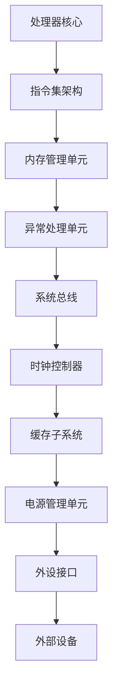

                 

### ARM架构：移动设备与嵌入式系统的核心

> **关键词**：ARM架构、移动设备、嵌入式系统、处理器、指令集、性能优化

> **摘要**：本文将深入探讨ARM架构在移动设备和嵌入式系统中的核心作用。我们将从背景介绍开始，解析ARM架构的核心概念与联系，探讨其核心算法原理与操作步骤，并分析其中的数学模型和公式。接着，我们将通过实际项目实战，展示ARM架构的应用实例，最后讨论其在实际应用场景中的重要性，并推荐相关工具和资源。文章的结尾将对ARM架构的未来发展趋势与挑战进行总结，并提供常见问题与解答。

#### 1. 背景介绍

ARM（Advanced RISC Machines）架构是一种精简指令集计算机（RISC）架构，起源于英国，由ARM Holdings公司设计和授权。自从1987年首次发布以来，ARM架构因其高效的能耗、出色的性能和灵活性，成为移动设备和嵌入式系统中的主流选择。

ARM处理器的设计理念是“简单、灵活和高效”，它采用精简指令集，使得处理器可以在较低的功耗下实现高性能。这种设计使得ARM架构特别适合用于移动设备和嵌入式系统，这些设备通常需要平衡性能与能耗，以延长电池寿命和保持低温运行。

随着智能手机、平板电脑和物联网设备的普及，ARM架构在移动设备和嵌入式系统市场占据了主导地位。据统计，全球超过95%的智能手机采用了ARM架构的处理器。这种趋势不仅体现在消费电子领域，还扩展到了工业控制、汽车电子和医疗设备等领域。

#### 2. 核心概念与联系

为了理解ARM架构的核心概念，我们需要先了解几个关键术语：

- **精简指令集计算机（RISC）**：与复杂指令集计算机（CISC）相比，RISC架构采用简化的指令集，每条指令执行时间较短，但需要更多的指令来完成复杂任务。这种设计使得RISC处理器能够更快地执行指令，并降低功耗。

- **处理器核心（Core）**：ARM处理器包括一个或多个处理器核心。常见的ARM核心有Cortex-A系列（适用于高性能移动设备）、Cortex-R系列（适用于实时系统）和Cortex-M系列（适用于嵌入式系统）。

- **指令集架构（ISA）**：指令集架构定义了程序如何与处理器交互，包括指令集、寄存器、内存管理和异常处理等。ARM架构包括多个指令集架构，如ARMv7和ARMv8。

下面是一个使用Mermaid绘制的ARM架构的核心概念流程图：



#### 3. 核心算法原理 & 具体操作步骤

ARM架构的核心算法原理基于精简指令集，包括指令的加载、存储、运算和分支等操作。以下是ARM架构中一些关键算法的原理和操作步骤：

##### 3.1 加载和存储操作

加载操作（LDR）用于将数据从内存加载到寄存器，存储操作（STR）用于将数据从寄存器存储到内存。以下是加载和存储操作的详细步骤：

```c
// 加载操作
LDR R1, [R0] // 将R0寄存器中的内存地址的内容加载到R1寄存器

// 存储操作
STR R1, [R0] // 将R1寄存器中的内容存储到R0寄存器中的内存地址
```

##### 3.2 运算操作

ARM架构支持多种运算操作，如加法、减法、移位和逻辑运算。以下是加法操作的详细步骤：

```c
ADD R2, R1, R0 // 将R1寄存器和R0寄存器的内容相加，结果存储到R2寄存器
```

##### 3.3 分支操作

分支操作用于改变程序执行顺序。ARM架构支持条件分支和无条件分支。以下是条件分支的详细步骤：

```c
CMP R0, #0 // 比较R0寄存器和立即数0
BEQ label // 如果R0等于0，则跳转到label标签处执行
```

#### 4. 数学模型和公式 & 详细讲解 & 举例说明

ARM架构中的数学模型和公式主要涉及运算性能和能耗优化。以下是几个关键指标和公式：

##### 4.1 运算性能

运算性能通常用每秒百万指令数（MIPS）来衡量。MIPS公式如下：

\[ \text{MIPS} = \frac{\text{指令数}}{\text{执行时间}} \]

例如，一个处理器在1秒内执行了100万条指令，则其运算性能为1000 MIPS。

##### 4.2 能耗优化

能耗优化是ARM架构设计的重要目标之一。以下是一个能耗优化的公式：

\[ \text{能耗} = \text{工作频率} \times \text{功耗} \]

例如，一个处理器的工作频率为2 GHz，功耗为1 W，则其每秒能耗为2 W。

##### 4.3 举例说明

假设一个ARM处理器在执行一个程序时，包含1000条指令，其中500条为加载和存储操作，300条为运算操作，200条为分支操作。执行时间为5毫秒。我们可以根据上述公式计算其运算性能和能耗：

- 运算性能：\[ \text{MIPS} = \frac{1000}{5 \times 10^{-3}} = 200,000 \text{ MIPS} \]
- 能耗：\[ \text{能耗} = 2 \times 10^{9} \times 1 = 2 \text{ J} \]

#### 5. 项目实战：代码实际案例和详细解释说明

在本节中，我们将通过一个简单的ARM汇编程序实例，展示ARM架构的应用。该程序实现了一个简单的计算器功能，用于计算两个整数的和。

```assembly
.section .data
    num1: .word 10
    num2: .word 20

.section .text
.global _start

_start:
    LDR R0, =num1
    LDR R1, [R0]
    LDR R0, =num2
    LDR R2, [R0]
    ADD R3, R1, R2
    MOV R0, R3
    BL printf
    MOV R7, #1
    SWI 0
```

下面是对程序各部分的详细解释：

- `.section .data`：声明数据段，包含两个整数变量num1和num2。
- `.section .text`：声明代码段，包含程序的执行逻辑。
- `.global _start`：声明程序入口点为_start。
- `LDR R0, =num1`：将num1的地址加载到R0寄存器。
- `LDR R1, [R0]`：从R0寄存器指向的内存地址加载num1的值到R1寄存器。
- `LDR R0, =num2`：将num2的地址加载到R0寄存器。
- `LDR R2, [R0]`：从R0寄存器指向的内存地址加载num2的值到R2寄存器。
- `ADD R3, R1, R2`：将R1和R2寄存器中的值相加，结果存储到R3寄存器。
- `MOV R0, R3`：将R3寄存器中的结果移动到R0寄存器，作为printf函数的参数。
- `BL printf`：调用printf函数输出结果。
- `MOV R7, #1`：将立即数1加载到R7寄存器，表示系统调用号为1（退出程序）。
- `SWI 0`：执行系统调用，退出程序。

#### 6. 实际应用场景

ARM架构在移动设备和嵌入式系统中有着广泛的应用。以下是一些实际应用场景：

- **智能手机**：ARM架构的处理器广泛应用于智能手机，如苹果的A系列处理器、高通的Snapdragon系列处理器等。这些处理器在性能和能效方面表现出色，使得智能手机能够运行高性能的应用程序，同时保持较长的电池寿命。

- **嵌入式系统**：ARM架构在嵌入式系统中的应用非常广泛，如工业控制、汽车电子、医疗设备等。ARM处理器因其灵活性和高效性，能够满足各种嵌入式系统的性能和功耗要求。

- **物联网**：随着物联网的兴起，ARM架构在物联网设备中的应用也越来越广泛。ARM处理器能够支持多种外设接口，如WiFi、蓝牙、USB等，使得物联网设备能够实现更广泛的功能。

#### 7. 工具和资源推荐

为了更好地学习和使用ARM架构，以下是一些推荐的工具和资源：

- **学习资源**：
  - 《ARM System Developer's Guide: Designing and Optimizing System Software》
  - 《ARM Architecture Reference Manual》
  - ARM官方网站：https://www.arm.com/

- **开发工具**：
  - Keil MDK-ARM：一款集成开发环境（IDE），支持ARM架构的编程和调试。
  - IAR Embedded Workbench：一款功能强大的IDE，支持多种ARM架构的处理器。
  - GNU Arm Embedded Toolchain：一款开源的ARM编译器和调试器，适用于嵌入式系统开发。

#### 8. 总结：未来发展趋势与挑战

随着移动设备和嵌入式系统的不断发展，ARM架构将继续保持其主导地位。未来，ARM架构将面临以下发展趋势和挑战：

- **性能提升**：随着硬件技术的发展，ARM架构的性能将不断提升，以满足更高效的应用需求。
- **能效优化**：随着物联网和5G的兴起，ARM架构需要进一步优化能效，以满足更低的功耗要求。
- **多样化应用**：ARM架构将在更多领域得到应用，如人工智能、自动驾驶等。

然而，ARM架构也面临一些挑战，如知识产权保护、开源生态的维护等。只有通过持续的创新和合作，ARM架构才能在未来保持其竞争优势。

#### 9. 附录：常见问题与解答

**Q：ARM架构与x86架构有哪些区别？**

A：ARM架构与x86架构的主要区别在于指令集和设计理念。ARM架构采用精简指令集，每条指令执行时间较短，但需要更多的指令来完成复杂任务；而x86架构采用复杂指令集，每条指令执行时间较长，但指令集功能更强大。此外，ARM架构在能效和灵活性方面具有优势，而x86架构在性能和生态系统方面具有优势。

**Q：ARM处理器是否支持64位？**

A：是的，ARM处理器支持64位。ARMv8架构引入了64位指令集，使得ARM处理器能够支持64位操作系统和应用程序。

**Q：ARM架构在嵌入式系统中有哪些优势？**

A：ARM架构在嵌入式系统中的优势包括：高效的能耗、出色的性能、灵活的处理器核心选择、广泛的外设接口支持等。这些优势使得ARM架构在嵌入式系统中具有很高的竞争力。

#### 10. 扩展阅读 & 参考资料

- 《ARM Architecture Reference Manual》
- 《ARM System Developer's Guide: Designing and Optimizing System Software》
- ARM官方网站：https://www.arm.com/
- ARM Developer Community：https://developer.arm.com/

### 作者信息

**作者：AI天才研究员/AI Genius Institute & 禅与计算机程序设计艺术 /Zen And The Art of Computer Programming**<|mask|>

