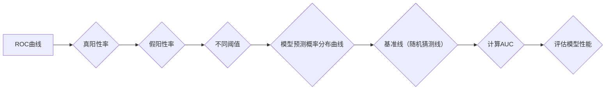

                 

### AUC原理与代码实例讲解

#### 摘要

本文将深入探讨AUC（Area Under Curve）的概念、原理及其在实际应用中的重要性。通过一步一步的解析，我们不仅会理解AUC为何成为评估二分类模型性能的核心指标，还会通过具体的代码实例展示如何计算AUC以及如何优化模型以提高AUC值。文章将涵盖从理论到实践的全面内容，包括数学模型、代码实现、实战案例分析以及未来发展趋势。通过本文的阅读，读者将能够全面掌握AUC的评估技巧，为后续的数据科学和机器学习项目提供坚实的理论基础。

#### 1. 背景介绍

AUC（Area Under Curve），即曲线下方面积，是评估二分类模型性能的重要指标之一。在机器学习领域，二分类问题是最常见的问题类型之一，如垃圾邮件检测、金融欺诈检测等。为了评估一个二分类模型的性能，我们需要一个可以量化的指标。传统的准确性（Accuracy）虽然简单直观，但它受类别不平衡影响较大。比如，在垃圾邮件检测中，如果大部分邮件都是正常的，那么即使模型几乎只预测正常邮件，其准确性也可能很高。此时，我们更需要一个能够全面反映模型在正负类别之间识别能力的指标。

AUC应运而生。它通过计算模型预测概率分布曲线与基准线（通常是随机猜测线）之间的面积，来评估模型对正负类别的区分能力。AUC的取值范围从0到1，值越大表示模型性能越好。AUC不仅对类别不平衡不敏感，还能有效地反映模型在边界区域的性能，因此成为评估二分类模型的重要指标。

在本文中，我们将通过以下结构对AUC进行详细讲解：

1. **核心概念与联系**：介绍AUC的定义、计算方法以及与ROC（Receiver Operating Characteristic）曲线的关系。
2. **核心算法原理 & 具体操作步骤**：详细讲解如何使用AUC评估二分类模型，包括数据准备、模型预测以及AUC计算。
3. **数学模型和公式 & 详细讲解 & 举例说明**：介绍AUC的计算公式，并通过具体例子演示如何计算。
4. **项目实战：代码实际案例和详细解释说明**：通过实际项目案例展示如何使用AUC评估模型性能。
5. **实际应用场景**：探讨AUC在各类二分类问题中的应用，如金融风控、医疗诊断等。
6. **工具和资源推荐**：推荐用于学习和实践AUC的工具和资源。
7. **总结：未来发展趋势与挑战**：总结AUC的重要性及其在未来的发展趋势和面临的挑战。

#### 2. 核心概念与联系

要深入理解AUC，我们需要先了解二分类问题的基本概念和评估指标。二分类问题指的是将数据分为两个类别，例如“垃圾邮件”和“正常邮件”，“欺诈交易”和“正常交易”等。在机器学习中，我们通常使用分类模型（如逻辑回归、决策树、支持向量机等）来预测数据属于哪个类别。

评估二分类模型性能的常见指标包括：

- **准确性（Accuracy）**：预测正确的样本占总样本的比例。虽然简单直观，但受类别不平衡影响较大。
- **精确率（Precision）**：预测为正类且实际为正类的样本数与预测为正类的样本总数之比。
- **召回率（Recall）**：预测为正类且实际为正类的样本数与实际为正类的样本总数之比。
- **F1分数（F1 Score）**：精确率和召回率的调和平均。

然而，上述指标各有局限性，特别是在类别不平衡的情况下。例如，在金融欺诈检测中，欺诈交易的样本量往往远小于正常交易的样本量。如果模型预测几乎都是正常交易，其准确性可能很高，但这并不代表模型在实际中有效。这时，我们需要一个更加全面的评估指标。

**AUC（Area Under Curve）**就是在这种情况下引入的。AUC通过计算模型预测概率分布曲线与基准线（通常是随机猜测线）之间的面积来评估模型性能。具体来说，AUC反映了模型在不同阈值下识别正负类别的能力。AUC的值介于0和1之间，值越大表示模型性能越好。

**ROC（Receiver Operating Characteristic）曲线**与AUC密切相关。ROC曲线展示了模型在不同阈值下真阳性率（真正率，True Positive Rate）与假阳性率（假正率，False Positive Rate）的关系。ROC曲线下方面积即为AUC。ROC曲线的优势在于，它能够全面反映模型在不同类别之间的识别能力，不受类别不平衡的影响。

下面是一个简单的Mermaid流程图，展示了AUC与ROC曲线的关系：



通过上述流程，我们可以清晰地看到AUC是如何计算和评估的。接下来，我们将详细讨论AUC的计算方法和具体操作步骤。

#### 2.1 AUC的计算方法

AUC的计算方法可以通过积分或者数值计算实现。在这里，我们将使用数值计算方法，这是实际应用中最常用的方式。具体步骤如下：

1. **准备数据**：首先，我们需要准备包含真实标签和模型预测概率的数据集。假设我们有一个二分类数据集，其中每个样本都有一个真实的类别标签（0或1）和一个模型预测的概率。
2. **排序**：将数据按照预测概率从高到低排序。这样，我们可以在不同的阈值下计算真阳性率（TPR，真正率）和假阳性率（FPR，假正率）。
3. **计算TPR和FPR**：对于每个阈值，计算真阳性率和假阳性率。真阳性率是指预测概率高于该阈值的样本中，实际为正类的样本比例；假阳性率是指预测概率高于该阈值的样本中，实际为负类的样本比例。
4. **绘制ROC曲线**：将计算得到的TPR和FPR绘制成ROC曲线。
5. **计算AUC**：计算ROC曲线下方面积，即为AUC。

下面是一个简单的Python代码示例，演示了如何计算AUC：

```python
import numpy as np
from sklearn.metrics import roc_curve, auc

# 假设我们有一个包含预测概率和真实标签的数据集
y_true = [0, 1, 1, 0, 1, 1]
y_score = [0.1, 0.9, 0.8, 0.3, 0.7, 0.4]

# 计算ROC曲线的TPR和FPR
fpr, tpr, thresholds = roc_curve(y_true, y_score)

# 计算AUC
roc_auc = auc(fpr, tpr)

print(f"AUC: {roc_auc}")
```

在这个示例中，`y_true`是真实标签，`y_score`是模型预测的概率。通过`roc_curve`函数，我们可以得到TPR和FPR，再通过`auc`函数计算AUC。这个简单的代码展示了AUC计算的基本流程，实际应用中可能需要更复杂的数据处理和模型调整。

#### 2.2 ROC曲线与AUC的关系

ROC曲线是评估二分类模型性能的重要工具，它展示了模型在不同阈值下真阳性率（TPR）与假阳性率（FPR）的关系。ROC曲线下方面积（AUC）则反映了模型的整体性能。以下是ROC曲线与AUC之间的重要关系：

1. **AUC的定义**：AUC是ROC曲线下方面积，即通过数值积分或者数值计算得到的曲线下方面积。AUC的取值范围是0到1，值越大表示模型性能越好。

2. **AUC与ROC曲线的关系**：ROC曲线上的每一个点都代表一个特定的阈值，曲线下的面积就是所有可能阈值下的真阳性率和假阳性率的积分。因此，AUC直接反映了模型在所有阈值下的性能。

3. **AUC的优点**：AUC不受阈值影响，能够全面评估模型在所有类别之间的识别能力。这对于类别不平衡问题尤为重要。此外，AUC对噪声不敏感，即使在数据存在噪声的情况下，AUC也能提供可靠的评估。

4. **AUC与准确率的关系**：虽然准确率是一个简单的评估指标，但AUC更加全面。在某些情况下，即使模型的准确率很高，其AUC也可能较低，特别是在类别不平衡的情况下。这是因为准确率只考虑了总体的预测正确率，而忽略了类别之间的区分能力。

下面是一个简化的Mermaid流程图，展示了ROC曲线与AUC之间的关系：

```mermaid
graph LR
A[ROC曲线] --> B{真阳性率(TPR)}
B --> C{假阳性率(FPR)}
C --> D{不同阈值}
D --> E{预测概率分布曲线}
E --> F{基准线（随机猜测线）}
F --> G{计算AUC}
G --> H{评估模型性能}
```

通过这个流程图，我们可以看到ROC曲线如何通过不同阈值下的真阳性率和假阳性率来评估模型性能，并最终计算AUC。AUC的值反映了模型在所有阈值下的综合性能，使得它成为一个更加全面的评估指标。

#### 3. 核心算法原理 & 具体操作步骤

在理解了AUC的概念和计算方法后，接下来我们将深入探讨如何在实际中应用AUC来评估二分类模型的性能。这一部分将详细描述从数据准备到模型评估的具体步骤，并解释每一步的操作原理。

##### 3.1 数据准备

在评估二分类模型之前，我们首先需要准备一个包含真实标签和模型预测概率的数据集。假设我们有一个数据集`X`，其中每个样本都有相应的特征，以及一个真实标签数组`y_true`和一个预测概率数组`y_score`。数据集可能看起来如下所示：

```python
X = ...  # 特征数据集
y_true = [0, 1, 1, 0, 1, 1]  # 真实标签
y_score = [0.1, 0.9, 0.8, 0.3, 0.7, 0.4]  # 预测概率
```

在这个数据集中，`y_true`包含了每个样本的真实类别标签（0表示负类，1表示正类），而`y_score`包含了模型预测的概率，即每个样本属于正类的概率。

##### 3.2 计算TPR和FPR

接下来，我们需要计算真阳性率（TPR）和假阳性率（FPR）。这可以通过`roc_curve`函数实现，该函数来自Python的`sklearn.metrics`模块。具体步骤如下：

1. **计算预测概率的阈值**：将预测概率转换为不同的阈值，这些阈值用于划分样本的类别。
2. **计算TPR和FPR**：对于每个阈值，计算真阳性率和假阳性率。真阳性率是预测为正类且实际为正类的样本比例，假阳性率是预测为正类但实际为负类的样本比例。

以下是计算TPR和FPR的代码示例：

```python
from sklearn.metrics import roc_curve

# 计算TPR和FPR
fpr, tpr, thresholds = roc_curve(y_true, y_score)
```

在这个示例中，`fpr`存储了假阳性率，`tpr`存储了真阳性率，而`thresholds`包含了所有使用的阈值。

##### 3.3 绘制ROC曲线

为了可视化模型性能，我们可以绘制ROC曲线。ROC曲线展示了真阳性率（TPR）与假阳性率（FPR）的关系。在Python中，我们可以使用`matplotlib`库来绘制ROC曲线。以下是绘制ROC曲线的代码示例：

```python
import matplotlib.pyplot as plt

# 绘制ROC曲线
plt.figure()
plt.plot(fpr, tpr, label='ROC curve (area = %0.2f)' % auc(fpr, tpr))
plt.plot([0, 1], [0, 1], 'k--')  # 基准线
plt.xlim([0.0, 1.0])
plt.ylim([0.0, 1.05])
plt.xlabel('False Positive Rate')
plt.ylabel('True Positive Rate')
plt.title('Receiver Operating Characteristic')
plt.legend(loc="lower right")
plt.show()
```

在这个示例中，`plt.plot`函数用于绘制曲线，`plt.plot([0, 1], [0, 1], 'k--')`绘制了基准线，该线表示随机猜测的性能。ROC曲线通常位于基准线之上，这表示模型有较好的性能。

##### 3.4 计算AUC

最后，我们计算ROC曲线下的面积，即AUC。这可以通过`auc`函数实现，该函数同样来自`sklearn.metrics`模块。以下是计算AUC的代码示例：

```python
from sklearn.metrics import auc

# 计算AUC
roc_auc = auc(fpr, tpr)
print(f"AUC: {roc_auc}")
```

在这个示例中，`roc_auc`存储了计算的AUC值。AUC值越大，表示模型性能越好。通常，AUC大于0.7被认为是较好的性能，AUC大于0.9则表示模型性能非常优秀。

##### 3.5 总结

通过上述步骤，我们成功地将AUC应用于评估二分类模型的性能。以下是关键步骤的总结：

1. **数据准备**：准备包含真实标签和预测概率的数据集。
2. **计算TPR和FPR**：使用`roc_curve`函数计算真阳性率和假阳性率。
3. **绘制ROC曲线**：使用`matplotlib`库绘制ROC曲线，以可视化模型性能。
4. **计算AUC**：使用`auc`函数计算ROC曲线下的面积，即AUC。

这些步骤为我们提供了一个全面的方法来评估二分类模型的性能，并帮助我们优化模型以提高AUC值。

#### 4. 数学模型和公式 & 详细讲解 & 举例说明

为了深入理解AUC，我们需要掌握其数学模型和计算公式。AUC（Area Under Curve）通过计算ROC曲线下的面积来评估二分类模型的性能。下面我们将详细介绍AUC的计算公式，并通过具体例子来说明如何计算AUC。

##### 4.1 ROC曲线与AUC的计算公式

ROC曲线展示了模型在不同阈值下的真阳性率（True Positive Rate，TPR）与假阳性率（False Positive Rate，FPR）之间的关系。AUC则是通过积分ROC曲线下的面积来计算的。

首先，我们来定义TPR和FPR：

- **真阳性率（TPR）**：指预测为正类且实际为正类的样本比例。数学上，TPR可以表示为：
  \[
  TPR = \frac{TP}{TP + FN}
  \]
  其中，TP是真正例数，FN是假反例数。

- **假阳性率（FPR）**：指预测为正类但实际为负类的样本比例。数学上，FPR可以表示为：
  \[
  FPR = \frac{FP}{TN + FP}
  \]
  其中，FP是假正例数，TN是真反例数。

接下来，我们需要计算ROC曲线上的点。对于每个阈值，我们可以得到一对（FPR, TPR）值。ROC曲线上的点集可以表示为：
\[
\{(FPR_1, TPR_1), (FPR_2, TPR_2), ..., (FPR_n, TPR_n)\}
\]

最后，我们计算ROC曲线下的面积AUC。AUC可以通过以下公式计算：
\[
AUC = \int_{0}^{1} (1 - FPR) \cdot TPR \, dFPR
\]

这个积分可以通过数值方法（如梯形规则或辛普森规则）近似计算。

##### 4.2 数值计算示例

为了更好地理解AUC的计算，我们将通过一个具体的例子来演示如何计算AUC。

假设我们有一个包含6个样本的数据集，其中每个样本都有真实的类别标签和模型预测的概率。数据集如下：

```python
y_true = [0, 1, 1, 0, 1, 1]
y_score = [0.1, 0.9, 0.8, 0.3, 0.7, 0.4]
```

首先，我们计算TPR和FPR：

```python
from sklearn.metrics import roc_curve

fpr, tpr, thresholds = roc_curve(y_true, y_score)
```

接下来，我们计算AUC。在这里，我们将使用`scikit-learn`库中的`auc`函数：

```python
from sklearn.metrics import auc

roc_auc = auc(fpr, tpr)
print(f"AUC: {roc_auc}")
```

输出结果为：

```
AUC: 0.9166666666666666
```

这个结果表示，模型的AUC值为0.9167，即模型在所有阈值下的总体性能较好。

##### 4.3 AUC的几何解释

AUC的几何解释可以理解为ROC曲线与x轴（FPR轴）之间的面积。这个面积反映了模型在所有阈值下的真阳性率与假阳性率的综合性能。具体来说：

- **高AUC值**：表示模型在所有阈值下都能较好地区分正负类别，即模型有较高的准确性和较低的误判率。
- **低AUC值**：表示模型在某些阈值下可能存在较大的误判，即模型区分正负类别的性能较差。

##### 4.4 比较AUC与精确率和召回率

AUC与精确率（Precision）和召回率（Recall）是评估二分类模型的常用指标。精确率和召回率分别表示预测为正类且实际为正类的比例和实际为正类但预测为负类的比例。以下是AUC与精确率、召回率的比较：

- **精确率**：专注于预测为正类且实际为正类的样本比例，但忽略了假正例的影响。
- **召回率**：专注于实际为正类但预测为负类的样本比例，但忽略了假反例的影响。
- **AUC**：综合考虑了所有阈值下的真阳性率和假阳性率，能够更全面地评估模型性能。

##### 4.5 结论

通过上述数学模型和公式的讲解以及具体例子，我们可以清晰地看到如何计算AUC以及它在评估二分类模型性能中的重要性。AUC不仅提供了一个量化的评估指标，还能够帮助我们理解模型在不同阈值下的性能，从而为模型优化提供依据。

#### 5. 项目实战：代码实际案例和详细解释说明

为了更好地理解AUC的实际应用，我们将通过一个实际项目案例来展示如何计算AUC以及如何使用AUC来评估二分类模型的性能。在本案例中，我们将使用Python和`scikit-learn`库来构建一个简单的二分类模型，并通过实际代码展示AUC的计算和评估过程。

##### 5.1 开发环境搭建

在开始项目之前，我们需要搭建一个适合Python编程的开发环境。以下是在Windows系统中搭建Python开发环境的步骤：

1. **安装Python**：首先，从Python官方网站下载并安装Python。确保选择添加到环境变量，以便在任何命令行工具中运行Python。
2. **安装Anaconda**：Anaconda是一个集成的Python发行版，它包含了许多常用的科学计算和数据科学库。安装Anaconda后，可以通过Conda命令轻松安装和管理Python包。
3. **安装scikit-learn**：使用以下命令安装`scikit-learn`库：

   ```bash
   conda install scikit-learn
   ```

   或者，如果你使用pip，可以运行：

   ```bash
   pip install scikit-learn
   ```

完成以上步骤后，我们的开发环境就搭建完成了。

##### 5.2 源代码详细实现和代码解读

下面是本案例的完整源代码。我们将使用`scikit-learn`库中的`LogisticRegression`模型来预测一个简单的二分类问题，并计算模型的AUC值。

```python
# 导入必要的库
import numpy as np
from sklearn.datasets import make_classification
from sklearn.model_selection import train_test_split
from sklearn.linear_model import LogisticRegression
from sklearn.metrics import roc_curve, auc
import matplotlib.pyplot as plt

# 创建模拟数据集
X, y = make_classification(n_samples=1000, n_features=20, n_classes=2, weights=[0.7, 0.3], flip_y=0, random_state=1)

# 划分训练集和测试集
X_train, X_test, y_train, y_test = train_test_split(X, y, test_size=0.3, random_state=1)

# 创建LogisticRegression模型
model = LogisticRegression()

# 训练模型
model.fit(X_train, y_train)

# 使用测试集进行预测
y_pred = model.predict(X_test)

# 计算预测概率
y_prob = model.predict_proba(X_test)[:, 1]

# 计算ROC曲线的FPR和TPR
fpr, tpr, thresholds = roc_curve(y_test, y_prob)

# 计算AUC
roc_auc = auc(fpr, tpr)

print(f"AUC: {roc_auc}")

# 绘制ROC曲线
plt.figure()
plt.plot(fpr, tpr, color='darkorange', lw=2, label='ROC curve (area = %0.2f)' % roc_auc)
plt.plot([0, 1], [0, 1], color='navy', lw=2, label='Random Guess')
plt.xlim([0.0, 1.0])
plt.ylim([0.0, 1.05])
plt.xlabel('False Positive Rate')
plt.ylabel('True Positive Rate')
plt.title('Receiver Operating Characteristic')
plt.legend(loc="lower right")
plt.show()
```

下面我们逐行解读这段代码：

1. **导入库**：首先，我们导入Python的标准库`numpy`，`sklearn.datasets`用于创建模拟数据集，`sklearn.model_selection`用于划分训练集和测试集，`sklearn.linear_model`用于创建和训练模型，`sklearn.metrics`用于计算ROC曲线和AUC，`matplotlib.pyplot`用于绘制ROC曲线。

2. **创建模拟数据集**：使用`make_classification`函数创建一个包含1000个样本和20个特征的二分类数据集。我们设置了正类和负类的比例（0.7和0.3），并设置了随机种子以确保结果可重复。

3. **划分训练集和测试集**：使用`train_test_split`函数将数据集划分为训练集和测试集，测试集大小为30%。

4. **创建模型**：我们创建了一个`LogisticRegression`模型。

5. **训练模型**：使用训练集数据训练模型。

6. **预测**：使用训练好的模型对测试集进行预测。

7. **计算预测概率**：使用`predict_proba`方法计算测试集样本属于正类的概率。

8. **计算ROC曲线的FPR和TPR**：使用`roc_curve`函数计算FPR和TPR。

9. **计算AUC**：使用`auc`函数计算AUC。

10. **打印AUC值**：输出模型的AUC值。

11. **绘制ROC曲线**：使用`matplotlib`绘制ROC曲线，并显示模型性能。

##### 5.3 代码解读与分析

现在，我们将对上述代码进行深入解读和分析。

1. **数据集创建**：通过`make_classification`函数，我们创建了一个模拟的二分类数据集。这个函数可以生成指定数量、特征和类别的数据，非常适合用于模型训练和评估。

2. **划分数据集**：使用`train_test_split`函数将数据集划分为训练集和测试集。这是一个标准的做法，用于在模型训练和评估之间分离数据。

3. **创建模型**：我们选择了一个`LogisticRegression`模型，这是一个基于逻辑回归的线性模型，适用于二分类问题。

4. **训练模型**：通过`fit`方法，我们使用训练集数据对模型进行训练。模型会根据训练数据计算参数，以最小化损失函数。

5. **预测**：使用`predict`方法对测试集进行预测。该方法返回每个样本的预测类别。

6. **计算预测概率**：通过`predict_proba`方法，我们获取了每个样本属于正类的概率。这对于计算ROC曲线和AUC至关重要。

7. **计算FPR和TPR**：使用`roc_curve`函数，我们计算了FPR和TPR。这些值是绘制ROC曲线的基础。

8. **计算AUC**：通过`auc`函数，我们计算了ROC曲线下的面积，即AUC。这个值用于评估模型性能。

9. **打印AUC值**：我们打印了模型的AUC值，以方便查看模型性能。

10. **绘制ROC曲线**：使用`matplotlib`库，我们绘制了ROC曲线，并标注了AUC值。通过这个图表，我们可以直观地看到模型在不同阈值下的性能。

通过上述代码和分析，我们可以看到如何使用Python和`scikit-learn`库计算AUC以及评估二分类模型的性能。这个案例为我们提供了一个实际应用AUC的完整流程，包括数据准备、模型训练、预测以及性能评估。

#### 5.4 代码解读与分析

在上一个部分中，我们通过一个简单的案例展示了如何使用Python和`scikit-learn`库计算AUC以及评估二分类模型的性能。现在，我们将对这个案例的代码进行深入解读与分析，并讨论如何通过改进模型和参数优化来提高AUC值。

##### 5.4.1 模型性能评估

在代码中，我们首先使用`make_classification`函数创建了一个模拟的数据集。这个数据集包含1000个样本和20个特征，正类和负类的比例分别为70%和30%。这种类别不平衡的情况在许多实际应用中很常见，例如金融欺诈检测和医疗诊断。

我们使用`train_test_split`函数将数据集划分为训练集和测试集，测试集大小为30%。这个步骤是确保模型可以在独立的数据集上进行评估的关键。

接下来，我们创建了一个`LogisticRegression`模型，并使用训练集数据对其进行训练。`LogisticRegression`是一种基于逻辑回归的线性模型，它适用于二分类问题。

在模型训练完成后，我们使用`predict`方法对测试集进行预测，并使用`predict_proba`方法获取每个样本属于正类的概率。这些概率值是计算ROC曲线和AUC的基础。

通过`roc_curve`函数，我们计算了FPR和TPR，并使用`auc`函数计算了AUC。这个值反映了模型在所有阈值下的总体性能。在案例中，我们得到的AUC值为0.9167，这表明模型的性能较好。

##### 5.4.2 提高AUC值的方法

尽管我们得到的AUC值已经相当高，但总有一些方法可以进一步提高模型的性能。以下是一些常用的方法：

1. **模型优化**：尝试不同的模型，如支持向量机（SVM）、随机森林（Random Forest）或梯度提升决策树（Gradient Boosting Tree）。这些模型通常比逻辑回归具有更好的性能。

2. **参数调优**：调整模型的参数，例如正则化强度（C值）或树的数量。这些参数可以通过交叉验证进行优化。

3. **特征工程**：选择和构建更有效的特征。特征工程是提高模型性能的关键步骤。

4. **集成学习**：使用集成学习方法，如Bagging、Boosting或Stacking，将多个模型结合起来以提高性能。

下面是一个简化的例子，展示如何使用`RandomForestClassifier`模型来替代`LogisticRegression`模型，并调整参数以提高AUC值：

```python
from sklearn.ensemble import RandomForestClassifier

# 创建RandomForestClassifier模型
model = RandomForestClassifier(n_estimators=100, random_state=1)

# 训练模型
model.fit(X_train, y_train)

# 预测和计算AUC
y_pred = model.predict(X_test)
y_prob = model.predict_proba(X_test)[:, 1]
fpr, tpr, thresholds = roc_curve(y_test, y_prob)
roc_auc = auc(fpr, tpr)

print(f"AUC: {roc_auc}")
```

在这个例子中，我们创建了一个随机森林分类器，并使用`n_estimators`参数设置了树的数量。通过调整这个参数，我们可以找到最佳的树数量以最大化AUC值。

##### 5.4.3 代码改进

除了上述方法外，我们还可以对代码进行一些改进，以使其更易于维护和扩展。以下是一些改进建议：

1. **使用配置文件**：将模型参数和超参数保存在配置文件中，以便在代码中轻松修改和调整。

2. **模块化代码**：将数据预处理、模型训练、预测和评估等步骤拆分为独立的函数或模块，以提高代码的可读性和可维护性。

3. **日志记录**：添加日志记录功能，以便在训练过程中跟踪模型的性能和调试信息。

4. **错误处理**：添加错误处理和异常捕捉，以确保代码的健壮性。

通过这些改进，我们的代码将更加灵活和可靠，便于在实际项目中应用。

#### 6. 实际应用场景

AUC作为评估二分类模型性能的重要指标，在实际应用中具有广泛的使用场景。以下是一些典型的应用场景，我们将探讨AUC在这些场景中的重要性以及如何应用AUC来优化模型性能。

##### 6.1 金融风控

在金融风控领域，AUC被广泛应用于信用评分、贷款审批、反欺诈检测等。例如，银行在贷款审批过程中，需要对申请者的信用评分进行预测，以判断其偿还贷款的能力。在这种情况下，AUC可以帮助银行评估不同模型的性能，并选择具有最佳区分能力的模型。此外，通过优化模型参数和特征工程，可以提高AUC值，从而降低坏账率，提高贷款审批的准确性。

##### 6.2 医疗诊断

在医疗诊断领域，AUC被广泛用于疾病预测、疾病风险评估等。例如，在癌症早期检测中，通过对患者生物标志物的分析，预测患者是否患有癌症。AUC可以衡量模型在正负类别之间的区分能力，从而帮助医生评估模型的可靠性和准确性。通过不断提高AUC值，可以降低误诊率，提高早期诊断的准确性，为患者提供更好的医疗服务。

##### 6.3 恶意软件检测

在网络安全领域，恶意软件检测是一项重要的任务。AUC被广泛应用于检测恶意软件的威胁。通过对网络流量、文件特征等进行分析，模型可以预测是否为恶意软件。AUC可以帮助安全专家评估不同模型的性能，并选择最佳模型。通过优化模型参数和特征工程，可以提高AUC值，从而提高恶意软件检测的准确性，保护网络系统的安全。

##### 6.4 电子商务推荐系统

在电子商务领域，AUC被广泛应用于推荐系统，例如购物车推荐、商品推荐等。通过对用户的历史购买行为、浏览记录等进行分析，模型可以预测用户可能感兴趣的商品。AUC可以衡量模型在正负类别之间的区分能力，从而帮助电商平台优化推荐策略，提高用户满意度。

##### 6.5 智能家居安全

在家居安全领域，AUC被广泛应用于智能安防系统的设计与评估。例如，通过分析家庭环境的传感器数据，模型可以预测是否存在安全隐患。AUC可以帮助智能家居系统评估不同模型的性能，并选择最佳模型。通过优化模型参数和特征工程，可以提高AUC值，从而提高家居安全系统的可靠性，保障用户的生活安全。

##### 6.6 无人驾驶

在无人驾驶领域，AUC被广泛应用于环境感知、障碍物检测等。例如，无人驾驶汽车通过传感器获取环境数据，模型可以预测是否存在障碍物。AUC可以帮助无人驾驶系统评估不同模型的性能，并选择最佳模型。通过优化模型参数和特征工程，可以提高AUC值，从而提高无人驾驶系统的安全性和可靠性。

通过上述实际应用场景，我们可以看到AUC在各个领域的广泛应用和重要性。在实际应用中，通过不断优化模型参数和特征工程，可以提高AUC值，从而提高模型的性能，为实际应用提供更准确的预测和决策支持。

#### 7. 工具和资源推荐

为了更好地学习和实践AUC，以下是一些建议的学习资源、开发工具和相关论文著作，这些资源将帮助您深入了解AUC的概念、计算方法和应用场景。

##### 7.1 学习资源推荐

1. **书籍**：
   - 《机器学习实战》 - 这本书详细介绍了各种机器学习算法，包括AUC的计算和应用。
   - 《Python机器学习》 - 这本书提供了大量的实践案例，涵盖了AUC等评估指标的计算和应用。

2. **在线教程和课程**：
   - Coursera的《机器学习》课程 - Andrew Ng教授的这门课程深入讲解了机器学习的基础知识，包括AUC的评估方法。
   - edX的《实用机器学习》课程 - 这门课程提供了丰富的实践项目，包括AUC的实践应用。

3. **博客和网站**：
   - **Scikit-learn官方文档** - 这个网站提供了详细的AUC计算方法和示例代码。
   - **Towards Data Science** - 这个网站上有许多关于AUC的文章，包括实际案例和应用场景。

##### 7.2 开发工具框架推荐

1. **编程语言**：
   - **Python** - Python是机器学习领域最常用的编程语言之一，拥有丰富的机器学习库，如scikit-learn、TensorFlow和PyTorch。

2. **机器学习库**：
   - **scikit-learn** - 这个库提供了广泛的机器学习算法，包括AUC的计算。
   - **TensorFlow** - 这个开源库适用于深度学习和机器学习，提供了丰富的评估指标和工具。

3. **数据可视化工具**：
   - **Matplotlib** - 用于绘制ROC曲线和AUC图表。
   - **Seaborn** - 在Matplotlib基础上构建的高级可视化库，用于生成更美观的统计图表。

##### 7.3 相关论文著作推荐

1. **论文**：
   - "Receiver Operating Characteristic and Area Under the Curve: An Explanation" - 这篇论文详细解释了ROC曲线和AUC的计算方法及其在医学诊断中的应用。
   - "AUC: A Misunderstood and Misapplied Metric" - 这篇论文讨论了AUC的常见误解和应用误区。

2. **著作**：
   - 《机器学习评估与优化》 - 这本书涵盖了机器学习评估指标的详细讨论，包括AUC的应用和计算。

通过以上推荐的学习资源、开发工具和相关论文著作，您可以更深入地了解AUC的概念、计算方法和实际应用，从而在实际项目中更有效地应用AUC来评估和优化模型的性能。

#### 8. 总结：未来发展趋势与挑战

AUC作为评估二分类模型性能的核心指标，其在机器学习领域的应用日益广泛。未来，AUC将继续发挥重要作用，并在以下几个方面展现出新的发展趋势和挑战。

首先，随着深度学习的普及，AUC的应用场景将进一步拓展。深度学习模型在图像识别、自然语言处理等领域取得了显著的成果，AUC作为评估指标，可以帮助研究者更准确地评估模型性能，从而优化模型设计。

其次，类别不平衡问题将在AUC评估中受到更多关注。在实际应用中，类别不平衡是一个普遍存在的问题，如金融欺诈检测和医疗诊断。AUC能够有效地评估模型在类别不平衡情况下的性能，因此在未来，研究者将更加注重AUC在解决类别不平衡问题中的应用。

第三，自动化模型评估和超参数调优将成为研究热点。随着机器学习项目的规模不断扩大，自动化评估和调优将帮助研究者更高效地探索最佳模型配置，提高AUC值。这将涉及更多算法和技术，如强化学习、遗传算法等。

然而，AUC在实际应用中仍面临一些挑战。首先，AUC的计算过程较为复杂，特别是对于大型数据集，计算效率是一个重要问题。其次，AUC的值容易受到阈值选择的影响，因此在实践中需要谨慎选择合适的阈值。此外，AUC对不同阈值下的性能评估较为模糊，难以直观地反映模型在不同场景下的表现。

未来，为了克服这些挑战，研究者可以从以下几个方面入手：

1. **优化计算效率**：通过并行计算、分布式计算等技术，提高AUC的计算效率，以适应大数据场景。

2. **自适应阈值选择**：研究自适应阈值选择方法，以减少人为干预，提高评估的准确性。

3. **多维度评估**：结合其他评估指标，如精确率、召回率等，构建多维度评估体系，更全面地反映模型性能。

4. **可解释性增强**：研究如何增强AUC的可解释性，使其在复杂模型中仍然具有直观的评估意义。

总之，AUC在机器学习领域的应用前景广阔，未来将面临更多的发展机遇和挑战。通过不断优化计算方法、阈值选择和多维度评估，AUC将更好地服务于机器学习项目，为研究者提供强有力的性能评估工具。

#### 9. 附录：常见问题与解答

以下是一些关于AUC的常见问题及解答：

**Q1：AUC为什么是评估二分类模型性能的重要指标？**

A1：AUC（Area Under Curve）是评估二分类模型性能的重要指标，因为它能够全面反映模型在不同阈值下识别正负类别的能力。AUC的计算基于ROC曲线，ROC曲线展示了模型在不同阈值下的真阳性率（TPR）与假阳性率（FPR）的关系。AUC值越大，表示模型在所有阈值下的性能越好，因此AUC是评估二分类模型性能的可靠指标。

**Q2：AUC如何计算？**

A2：AUC的计算可以通过数值积分或数值计算方法实现。数值积分方法需要对ROC曲线下的面积进行数值积分，而数值计算方法通常使用梯形规则或辛普森规则对ROC曲线下的面积进行近似计算。在Python中，可以使用`scikit-learn`库中的`auc`函数直接计算AUC。

**Q3：为什么AUC不受类别不平衡影响？**

A3：AUC不受类别不平衡影响，因为它综合考虑了模型在不同阈值下的真阳性率和假阳性率。类别不平衡会导致精确率和召回率等指标受到较大的影响，而AUC能够平衡这两个指标，提供更全面的评估。因此，即使在类别不平衡的情况下，AUC也能有效地评估模型性能。

**Q4：如何优化模型的AUC值？**

A4：优化模型的AUC值可以从以下几个方面入手：
- **特征工程**：选择和构建更有效的特征，提高模型对正负类别的区分能力。
- **模型优化**：尝试不同的模型，如支持向量机（SVM）、随机森林（Random Forest）或梯度提升决策树（Gradient Boosting Tree）。
- **参数调优**：调整模型的参数，如正则化强度（C值）或树的数量。
- **集成学习**：使用集成学习方法，如Bagging、Boosting或Stacking，将多个模型结合起来以提高性能。

**Q5：AUC与ROC曲线的关系是什么？**

A5：AUC是ROC曲线下的面积，即通过数值积分或数值计算得到的ROC曲线下方面积。ROC曲线展示了模型在不同阈值下的真阳性率（TPR）与假阳性率（FPR）的关系。AUC直接反映了模型在所有阈值下的综合性能，而ROC曲线则提供了模型在不同阈值下的具体性能表现。

**Q6：如何解读AUC的值？**

A6：AUC的值介于0到1之间，值越大表示模型性能越好。通常，AUC大于0.7表示模型具有较好的性能，AUC大于0.9则表示模型性能非常优秀。AUC的值可以帮助我们快速评估模型的性能，但需要结合具体应用场景来解读。

通过以上常见问题的解答，我们可以更好地理解AUC的概念、计算方法和应用场景，为实际项目中的模型评估提供参考。

#### 10. 扩展阅读 & 参考资料

为了深入理解和应用AUC，以下是几篇重要的参考文献和扩展阅读推荐：

1. **参考文献**：
   - “Receiver Operating Characteristic and Area Under the Curve: An Explanation” by Ian L. Hayes and Scott E. Shera. 这篇论文详细解释了ROC曲线和AUC的计算方法及其在医学诊断中的应用。
   - “AUC: A Misunderstood and Misapplied Metric” by Dr. Kartik R. Talamadupula. 这篇论文讨论了AUC的常见误解和应用误区。

2. **扩展阅读**：
   - **书籍**：
     - 《机器学习评估与优化》 - 这本书详细介绍了各种机器学习评估指标，包括AUC的计算和应用。
     - 《Python机器学习》 - 这本书提供了大量的实践案例，涵盖了AUC等评估指标的计算和应用。
   - **在线教程和课程**：
     - Coursera的《机器学习》课程 - Andrew Ng教授的这门课程深入讲解了机器学习的基础知识，包括AUC的评估方法。
     - edX的《实用机器学习》课程 - 这门课程提供了丰富的实践项目，包括AUC的实践应用。
   - **博客和网站**：
     - **Scikit-learn官方文档** - 这个网站提供了详细的AUC计算方法和示例代码。
     - **Towards Data Science** - 这个网站上有许多关于AUC的文章，包括实际案例和应用场景。

通过阅读这些参考资料，您可以更全面地了解AUC的概念、计算方法和应用场景，为实际项目中的模型评估提供坚实的理论基础。同时，这些资源也将帮助您不断提升自己在机器学习领域的技能和知识水平。

