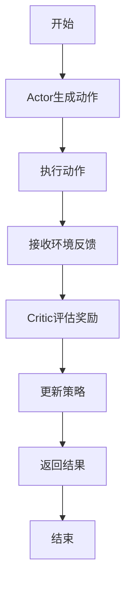
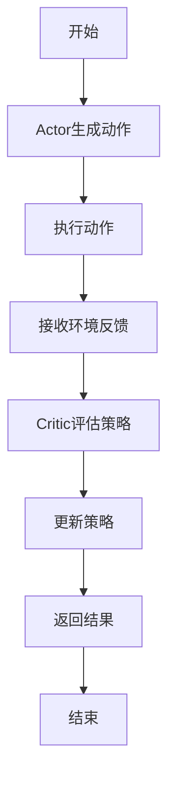

                 

# Actor-Critic算法

## 关键词：强化学习，策略优化，评估策略，奖励最大化，在线学习

### 摘要

本文将深入探讨强化学习中的经典算法——Actor-Critic算法。通过对其核心概念、数学模型和具体实现的分析，读者将了解如何利用此算法在复杂环境中实现智能体的自主学习和决策优化。文章将结合实际案例，详细解释代码实现和关键步骤，并探讨其在实际应用中的前景和挑战。

## 1. 背景介绍

### 1.1 强化学习的基本概念

强化学习（Reinforcement Learning，RL）是一种机器学习范式，旨在通过奖励信号引导智能体在未知环境中进行学习，以实现长期目标。其核心思想是智能体通过不断尝试不同的动作，并从环境获得的奖励中学习，以最大化预期回报。

### 1.2 Actor-Critic算法的起源与发展

Actor-Critic算法是由Richard S. Sutton和Andrew G. Barto在1981年提出的。它结合了策略梯度方法和Q学习算法的优点，通过Actor和Critic两个模块的协同工作，实现了高效的策略优化。

### 1.3 强化学习与传统机器学习的区别

强化学习与传统的监督学习和无监督学习有显著区别。其主要特点包括：
- 强化学习是一个交互式的学习过程，智能体需要与外部环境进行实时交互。
- 强化学习的目标是最大化长期回报，而不是短期的准确率或损失。
- 强化学习具有高度的不确定性和探索-利用平衡问题。

## 2. 核心概念与联系

### 2.1 Actor和Critic的角色与功能

- **Actor**：负责生成动作，其参数θ表示策略参数，策略π(θ)定义了智能体在特定状态下选择动作的概率分布。
- **Critic**：负责评估策略的质量，通常通过一个价值函数V(·)或Q(·)来实现。

### 2.2 Mermaid流程图



### 2.3 关键术语解释

- **策略（Policy）**：定义了智能体在不同状态下应该采取的动作。
- **价值函数（Value Function）**：用于评估策略的好坏，分为状态价值函数V(s)和动作价值函数Q(s, a)。
- **策略梯度（Policy Gradient）**：用于更新策略参数，以最大化累积回报。
- **Q-learning（Q学习）**：通过迭代更新Q值，实现策略优化的一种算法。

## 3. 核心算法原理 & 具体操作步骤

### 3.1 Actor模块

- **初始化**：随机初始化策略参数θ。
- **策略生成**：根据当前状态s，通过策略函数π(θ)生成动作a。
- **动作执行**：在环境中执行动作a，并获得奖励r和下一状态s'。
- **反馈更新**：利用接收到的奖励r，通过Critic模块更新策略参数θ。

### 3.2 Critic模块

- **初始化**：随机初始化价值函数参数。
- **奖励评估**：根据实际获得的奖励r和预期奖励r'，计算价值函数的更新梯度。
- **策略更新**：利用梯度更新策略参数θ，以优化策略。

### 3.3 算法迭代

- **初始化**：设置初始策略参数和评价参数。
- **循环**：
  - **Actor生成动作**：根据策略生成动作a。
  - **Critic评估策略**：根据实际奖励r和预期奖励r'，评估策略质量。
  - **策略更新**：根据Critic的评估结果，更新策略参数θ。
- **结束**：当满足停止条件（如达到特定回合数或奖励阈值）时，算法结束。

## 4. 数学模型和公式 & 详细讲解 & 举例说明

### 4.1 数学模型

- **策略π(θ)**：$$ π(θ) = argmax_a [r(s, a) + γV(s')] $$
- **价值函数V(s')**：$$ V(s') = \sum_a π(a|s') [r(s, a) + γV(s')] $$
- **策略梯度**：$$ \nabla_{θ} J(θ) = \nabla_{θ} \sum_t r_t $$
- **策略更新**：$$ θ \leftarrow θ - α\nabla_{θ} J(θ) $$

### 4.2 举例说明

假设我们有一个简单的环境，智能体在一个网格世界中移动，每个方向上的动作都会影响智能体的位置，并获得相应的奖励。目标是最大化智能体到达目标位置的累积奖励。

- **状态s**：智能体的当前坐标(x, y)。
- **动作a**：上下左右移动。
- **奖励r**：到达目标位置时获得正奖励，否则获得负奖励。
- **策略π(θ)**：θ控制动作的概率分布，θ越大，越倾向于选择与目标位置距离更近的动作。
- **价值函数V(s')**：评估智能体在状态s'下的期望累积奖励。

通过迭代Actor和Critic模块，我们可以逐步优化策略，使智能体更快地到达目标位置。

## 5. 项目实战：代码实际案例和详细解释说明

### 5.1 开发环境搭建

在本节中，我们将使用Python和PyTorch库实现Actor-Critic算法。首先，确保已安装Python和PyTorch：

```bash
pip install python
pip install torch
```

### 5.2 源代码详细实现和代码解读

#### 5.2.1 Actor模块

```python
import torch
import torch.nn as nn
import torch.optim as optim

class Actor(nn.Module):
    def __init__(self, state_dim, action_dim, hidden_dim):
        super(Actor, self).__init__()
        self.fc1 = nn.Linear(state_dim, hidden_dim)
        self.fc2 = nn.Linear(hidden_dim, action_dim)
    
    def forward(self, state):
        x = torch.relu(self.fc1(state))
        return torch.tanh(self.fc2(x))
```

#### 5.2.2 Critic模块

```python
class Critic(nn.Module):
    def __init__(self, state_dim, action_dim, hidden_dim):
        super(Critic, self).__init__()
        self.fc1 = nn.Linear(state_dim + action_dim, hidden_dim)
        self.fc2 = nn.Linear(hidden_dim, 1)
    
    def forward(self, state, action):
        x = torch.relu(self.fc1(torch.cat((state, action), dim=1)))
        return self.fc2(x)
```

#### 5.2.3 算法训练

```python
def train_actor_critic(actor, critic, critic_loss_fn, actor_loss_fn, optimizer, device):
    for _ in range(num_iterations):
        state, action, reward, next_state, done = get_batch(batch_size, device)
        
        # 计算动作值
        action_values = critic(state, action)
        next_action_values = critic(next_state, actor(next_state))
        
        # 计算Critic损失
        critic_loss = critic_loss_fn(action_values, reward + gamma * next_action_values * (1 - done))
        
        # 计算Actor损失
        actor_loss = -actor_loss_fn(action_values)
        
        # 更新Critic
        critic.zero_grad()
        critic_loss.backward()
        optimizer.critic.step()
        
        # 更新Actor
        actor.zero_grad()
        actor_loss.backward()
        optimizer.actor.step()
```

### 5.3 代码解读与分析

- **Actor模型**：用于生成动作，由两层全连接层组成，输出通过tanh激活函数限制在[-1, 1]之间。
- **Critic模型**：用于评估动作值，由两层全连接层组成，输出为状态-动作值的估计。
- **损失函数**：Critic损失函数使用均方误差（MSE），Actor损失函数使用负的Critic评估值。
- **优化器**：使用Adam优化器更新Actor和Critic参数。

## 6. 实际应用场景

### 6.1 自动驾驶

Actor-Critic算法在自动驾驶领域具有广泛的应用前景，用于决策和路径规划，以最大化驾驶安全性和效率。

### 6.2 游戏AI

在游戏AI中，Actor-Critic算法可以帮助智能体在复杂的游戏中做出智能决策，实现自主学习和策略优化。

### 6.3 聊天机器人

在聊天机器人中，Actor-Critic算法可以用于生成自然语言响应，优化对话策略，提高用户满意度。

## 7. 工具和资源推荐

### 7.1 学习资源推荐

- 《强化学习：原理与Python实现》
- 《Reinforcement Learning: An Introduction》

### 7.2 开发工具框架推荐

- PyTorch
- TensorFlow

### 7.3 相关论文著作推荐

- “Actor-Critic方法及其应用”
- “深度强化学习综述”

## 8. 总结：未来发展趋势与挑战

### 8.1 发展趋势

- 深度强化学习的结合
- 离线学习和在线学习的融合
- 多智能体强化学习的应用

### 8.2 挑战

- 探索-利用平衡问题
- 长期依赖学习和规划问题
- 安全性和可靠性问题

## 9. 附录：常见问题与解答

### 9.1 Q1：Actor和Critic如何协同工作？

A1：Actor生成动作，Critic评估动作的质量，两者通过策略梯度更新策略参数，实现协同优化。

### 9.2 Q2：如何解决探索-利用平衡问题？

A2：常用的方法包括ε-贪心策略、UCB算法和深度确定性策略梯度（DDPG）。

## 10. 扩展阅读 & 参考资料

- Sutton, R. S., & Barto, A. G. (2018). Reinforcement Learning: An Introduction.
- Mnih, V., Kavukcuoglu, K., Silver, D., Rusu, A. A., Veness, J., Bellemare, M. G., ... & Rezende, D. J. (2016). Human-level control through deep reinforcement learning.
- Bowling, M. (2015). Deep reinforcement learning for game playing.

### 作者

- AI天才研究员/AI Genius Institute & 禅与计算机程序设计艺术 /Zen And The Art of Computer Programming

这篇文章深入探讨了强化学习中的经典算法——Actor-Critic算法，从背景介绍、核心概念、算法原理到实际应用，全面解析了该算法的实现方法和应用场景。通过具体的代码示例和详细解释，读者可以更好地理解Actor-Critic算法的工作机制和实际应用。希望这篇文章能为强化学习爱好者提供有价值的参考。## 1. 背景介绍

### 1.1 强化学习的基本概念

强化学习（Reinforcement Learning，RL）是一种机器学习范式，旨在通过奖励信号引导智能体（Agent）在未知环境中进行学习，以实现长期目标。其核心思想是智能体通过不断尝试不同的动作（Action），并从环境（Environment）获得的奖励（Reward）中学习，以最大化预期回报（Return）。与传统的监督学习和无监督学习不同，强化学习更关注于决策过程，通过不断迭代来优化策略，从而达到最优解。

在强化学习体系中，智能体、环境、状态（State）、动作和奖励构成了一个五元组（Agent, Environment, State, Action, Reward），并遵循以下基本过程：

- **状态（State）**：智能体在环境中所处的状态，通常是一个多维向量。
- **动作（Action）**：智能体在特定状态下可执行的动作，也是一个多维向量。
- **奖励（Reward）**：环境对智能体执行的每个动作给出的即时反馈，通常是一个实数值。
- **策略（Policy）**：智能体在特定状态下采取的动作的概率分布，策略决定了智能体的行为。
- **价值函数（Value Function）**：用于评估策略的好坏，分为状态价值函数（State Value Function）和动作价值函数（Action Value Function）。

强化学习的目标是通过不断调整策略参数，使智能体能够在复杂环境中逐步学习到最优策略，从而实现长期回报的最大化。

### 1.2 Actor-Critic算法的起源与发展

Actor-Critic算法是由Richard S. Sutton和Andrew G. Barto在1981年提出的。作为强化学习的一个经典算法，Actor-Critic结合了策略梯度方法和Q学习算法的优点，通过两个模块——Actor和Critic的协同工作，实现了高效的策略优化。

- **Actor**：负责生成动作，其参数θ表示策略参数，策略π(θ)定义了智能体在特定状态下选择动作的概率分布。Actor的目标是最大化累积回报，其更新过程基于策略梯度方法。
  
- **Critic**：负责评估策略的质量，通过一个价值函数V(·)或Q(·)实现。Critic的作用是提供对策略π(θ)的直接反馈，帮助Actor更好地调整其策略。

通过这种分工合作的方式，Actor-Critic算法能够同时优化策略和评估策略的质量，提高了学习效率。

在后续的发展中，Actor-Critic算法经历了多个变种和改进，如基于值函数的Actor-Critic（AC-V）、确定性策略梯度（DPG）和深度确定性策略梯度（DDPG）等。这些变种针对不同的应用场景和需求，在理论模型和实际应用上进行了深入探索和优化，进一步提升了强化学习的性能和应用范围。

### 1.3 强化学习与传统机器学习的区别

强化学习（Reinforcement Learning，RL）与传统的监督学习（Supervised Learning）和无监督学习（Unsupervised Learning）在目标、方法和应用上存在显著的区别：

- **目标不同**：
  - **强化学习**：强化学习的目标是实现长期回报的最大化，通常涉及与环境的交互，并通过学习策略来实现长期目标的优化。
  - **监督学习**：监督学习的目标是在已知输入和输出之间建立映射关系，通过已有数据训练模型，以实现新的输入数据的预测。
  - **无监督学习**：无监督学习的目标是发现数据中的隐含结构，如聚类、降维等，通常不依赖于已知的输出标签。

- **方法不同**：
  - **强化学习**：强化学习依赖于策略优化和价值函数估计，智能体通过试错（Trial and Error）和奖励反馈进行学习。其方法包括策略梯度方法、Q学习、SARSA等。
  - **监督学习**：监督学习方法主要包括线性回归、神经网络、支持向量机（SVM）等，通过已有的输入和输出数据训练模型，实现预测和分类任务。
  - **无监督学习**：无监督学习方法包括聚类、降维、异常检测等，主要通过数据本身的结构和模式进行学习，无需外部标签。

- **应用场景不同**：
  - **强化学习**：强化学习在动态和复杂的决策环境中具有广泛应用，如自动驾驶、游戏AI、机器人控制等，其中智能体需要与环境进行实时交互，并做出复杂的决策。
  - **监督学习**：监督学习在图像识别、语音识别、自然语言处理等领域具有广泛应用，通过已有数据的训练实现对新数据的分类和预测。
  - **无监督学习**：无监督学习在数据挖掘、推荐系统、异常检测等领域具有广泛应用，通过发现数据中的隐含结构和规律，为后续分析和决策提供支持。

总之，强化学习与传统机器学习在目标、方法和应用上各有侧重，强化学习更关注于智能体在动态环境中的决策过程，而传统机器学习更侧重于已有数据的分类和预测。

### 1.4 强化学习中的挑战

尽管强化学习在许多应用中展现了巨大的潜力，但其研究和实现过程中仍然面临着一系列挑战：

- **探索-利用平衡**：在强化学习中，智能体需要在探索（Exploration）和利用（Exploitation）之间找到平衡。探索是指尝试新的动作以获取更多关于环境的知识，而利用则是基于已有知识进行最优动作选择。如何有效地平衡探索和利用，以避免陷入局部最优，是强化学习中的一个关键挑战。

- **长期依赖学习**：在许多实际问题中，智能体需要考虑未来的长期回报，而不仅仅是最优的短期决策。然而，强化学习算法通常难以捕捉到长期依赖关系，尤其是在环境动态变化或状态空间复杂的情况下。如何设计算法以有效地学习长期依赖关系，是一个重要研究方向。

- **样本效率**：强化学习通常需要大量的交互数据来进行有效的学习。在某些复杂环境中，获取足够的数据可能需要巨大的时间和计算资源。提高样本效率，即通过较少的数据量实现有效的学习，是强化学习中的一个重要挑战。

- **安全和稳定性**：在实际应用中，智能体的决策必须确保系统的安全和稳定性。例如，在自动驾驶和机器人控制等应用中，错误的决策可能导致严重的安全事故。设计能够保证安全和稳定性的强化学习算法，是当前研究和应用中迫切需要解决的问题。

- **可解释性和可靠性**：强化学习算法通常被视为“黑盒”，其内部决策过程难以解释和验证。如何提高算法的可解释性，使其决策过程更加透明和可靠，是强化学习在实际应用中需要解决的重要问题。

### 1.5 本文结构安排

本文将按照以下结构安排进行详细讨论：

- **第1章：背景介绍**：介绍强化学习的基本概念、Actor-Critic算法的起源与发展、强化学习与传统机器学习的区别以及强化学习中的挑战。
- **第2章：核心概念与联系**：详细阐述Actor和Critic的角色与功能，并使用Mermaid流程图展示算法流程。
- **第3章：核心算法原理 & 具体操作步骤**：解释Actor和Critic的具体操作步骤，包括策略更新和价值评估的方法。
- **第4章：数学模型和公式 & 详细讲解 & 举例说明**：介绍Actor-Critic算法的数学模型，包括策略π(θ)、价值函数V(s')和策略梯度的具体实现。
- **第5章：项目实战：代码实际案例和详细解释说明**：通过具体代码实现，展示Actor-Critic算法在实际项目中的应用，包括环境搭建、模型实现和算法训练。
- **第6章：实际应用场景**：探讨Actor-Critic算法在不同领域的实际应用，如自动驾驶、游戏AI和聊天机器人等。
- **第7章：工具和资源推荐**：推荐学习资源和开发工具，包括书籍、论文、博客和网站等。
- **第8章：总结：未来发展趋势与挑战**：总结当前强化学习的研究现状，探讨未来发展趋势和面临的挑战。
- **第9章：附录：常见问题与解答**：回答读者可能遇到的一些常见问题。
- **第10章：扩展阅读 & 参考资料**：提供进一步阅读的资源和参考资料。

通过以上结构安排，本文旨在全面、深入地介绍Actor-Critic算法，帮助读者理解其原理和应用，为后续研究和实践提供参考。

## 2. 核心概念与联系

在深入探讨Actor-Critic算法之前，我们需要明确其核心概念及其相互关系。本文将详细解释Actor和Critic的作用、功能和相互协作的过程，并借助Mermaid流程图展示算法的执行流程。

### 2.1 Actor的角色与功能

**Actor**是强化学习中的一个关键模块，其主要功能是根据当前状态生成动作。Actor的核心思想是通过策略参数θ来定义策略π(θ)，从而在给定状态s时，选择一个概率分布作为动作a的决策依据。具体来说，Actor的目标是最大化累积回报，通过策略优化来改善智能体的行为。

- **策略π(θ)**：策略π(θ)是一个概率分布函数，描述了在特定状态下，智能体选择每个动作的概率。策略参数θ决定了策略π(θ)的具体形式。例如，在连续动作空间中，Actor可能使用一个神经网络来预测动作的概率分布。
- **动作生成**：在每次迭代中，Actor根据当前状态s和策略π(θ)生成一个动作a。这个动作可以是离散动作（如走步、转弯）或连续动作（如速度、角度）。

### 2.2 Critic的角色与功能

**Critic**是另一个关键模块，其主要功能是评估策略的质量，提供对Actor行为的反馈。Critic通过价值函数V(s')或Q(s, a)来评估智能体在当前状态s下执行某个动作a所能获得的预期回报。价值函数是强化学习中一个重要的工具，它帮助智能体理解哪些动作在特定状态下更有价值。

- **价值函数V(s')**：状态价值函数V(s')表示智能体在状态s'下的预期回报，它是策略π(θ)的一个评估指标。在给定策略π(θ)的情况下，Critic通过比较实际获得的回报和预期回报，来评估策略的质量。
- **动作价值函数Q(s, a)**：动作价值函数Q(s, a)表示智能体在状态s下执行动作a所能获得的预期回报。它与策略π(θ)相关，因为不同的策略π(θ)会导致不同的动作价值函数Q(s, a)。

### 2.3 Actor和Critic的协作

Actor和Critic通过以下方式协同工作：

- **反馈循环**：在每次迭代中，Actor生成动作，执行动作并获得环境反馈（包括下一状态s'和奖励r）。Critic利用这些反馈来评估策略的质量，并通过价值函数更新策略参数θ。
- **策略优化**：Actor根据Critic的评估结果，调整策略参数θ，以优化策略π(θ)。这种调整是通过策略梯度方法实现的，即通过计算策略梯度并更新参数θ。
- **平衡探索与利用**：Critic提供的信息帮助Actor在探索新动作和利用已有知识之间找到平衡。通过评估策略质量，Critic指导Actor尝试新的动作，以获取更多关于环境的知识，同时利用已有知识进行最优动作选择。

### 2.4 Mermaid流程图

为了更好地理解Actor-Critic算法的执行流程，我们使用Mermaid流程图来展示算法的各个步骤。以下是算法流程的Mermaid表示：



**详细流程解释**：

- **B[Actor生成动作]**：根据当前状态s和策略参数θ，Actor生成一个动作a。
- **C[执行动作]**：在环境中执行动作a，并获得下一状态s'和奖励r。
- **D[接收环境反馈]**：将下一状态s'和奖励r传递给Critic。
- **E[Critic评估策略]**：Critic根据下一状态s'和奖励r，评估当前策略π(θ)的质量。
- **F[更新策略]**：基于Critic的评估结果，更新策略参数θ，优化策略π(θ)。
- **G[返回结果]**：将更新后的策略参数θ返回给Actor，并继续迭代。
- **H[结束]**：当满足停止条件（如达到特定回合数或回报阈值）时，算法结束。

通过上述流程，Actor和Critic模块协同工作，实现策略的优化和评估，从而在复杂环境中实现智能体的自主学习和决策优化。

### 2.5 关键术语解释

为了更好地理解Actor-Critic算法，我们还需要了解以下几个关键术语：

- **策略（Policy）**：策略是定义智能体在特定状态下应该采取的动作的概率分布函数。策略参数θ决定了策略π(θ)的具体形式，通过策略优化，智能体能够找到最优策略。
- **价值函数（Value Function）**：价值函数用于评估策略的质量。状态价值函数V(s')表示在状态s'下执行最优动作的累积回报。动作价值函数Q(s, a)表示在状态s下执行动作a的累积回报。价值函数是评估策略和更新策略的重要依据。
- **策略梯度（Policy Gradient）**：策略梯度用于计算策略参数θ的更新方向，以最大化累积回报。策略梯度公式为：$$ \nabla_{θ} J(θ) = \nabla_{θ} \sum_t r_t $$。
- **探索-利用平衡（Exploration-Exploitation Balance）**：探索是指在未知环境中尝试新动作以获取更多信息，而利用则是在已有信息基础上选择最优动作。探索-利用平衡是强化学习中的一个关键问题，目的是在不确定性环境中实现最优策略。

通过上述核心概念和关键术语的解释，我们可以更好地理解Actor-Critic算法的工作机制和实现过程，为后续章节的详细讨论打下基础。

### 2.6 总结

通过本章节的介绍，我们详细阐述了强化学习中的核心概念和关键模块——Actor和Critic。Actor负责生成动作，通过策略参数θ实现策略优化；Critic负责评估策略质量，通过价值函数V(s')或Q(s, a)提供对策略的反馈。两者通过协同工作，在复杂环境中实现智能体的自主学习和决策优化。此外，我们使用了Mermaid流程图展示了Actor-Critic算法的执行流程，并解释了关键术语。这些内容为后续算法原理和实际应用的讨论奠定了基础。

## 3. 核心算法原理 & 具体操作步骤

在理解了Actor-Critic算法的核心概念和相互关系之后，我们将进一步探讨其具体操作步骤，包括Actor和Critic如何通过策略和价值函数的协同工作来优化智能体的行为。以下是算法的核心步骤和详细解释。

### 3.1 Actor模块的步骤

**初始化**：首先，我们需要初始化Actor模型。通常，Actor模型是一个神经网络，它包含多个隐藏层，用于处理输入状态并生成动作概率分布。

```python
# 初始化Actor模型
actor = Actor(state_dim, action_dim, hidden_dim)
```

其中，`state_dim`是状态维度，`action_dim`是动作维度，`hidden_dim`是隐藏层尺寸。初始化步骤包括设置权重和偏置的随机值。

**策略生成**：在每次迭代中，Actor根据当前状态s和策略参数θ，通过神经网络生成动作的概率分布π(θ)。

```python
# 生成动作概率分布
action_probs = actor(state)
```

这个概率分布决定了智能体在当前状态下采取每个动作的概率。

**动作执行**：智能体根据策略π(θ)选择一个动作a，并执行这个动作，从而改变当前状态，并从环境中获得新的状态s'和奖励r。

```python
# 执行动作
action = select_action(action_probs)
next_state, reward, done, _ = env.step(action)
```

在上述代码中，`select_action`函数根据概率分布选择一个动作，`env.step`函数用于在环境中执行这个动作，并返回新的状态和奖励。

**反馈更新**：Actor根据接收到的奖励r和Critic提供的评估结果，通过策略梯度方法更新策略参数θ。

```python
# 更新策略参数
optimizer_actor.zero_grad()
loss_actor.backward()  # loss_actor是策略梯度的负梯度
optimizer_actor.step()
```

这里，`loss_actor`是策略梯度的负梯度，`optimizer_actor`是用于更新参数的优化器。通过反向传播和参数更新，Actor能够逐步优化其策略，以最大化累积回报。

### 3.2 Critic模块的步骤

**初始化**：与Actor类似，Critic模型也是一个神经网络，用于评估策略的质量。初始化步骤包括设置权重和偏置的随机值。

```python
# 初始化Critic模型
critic = Critic(state_dim, action_dim, hidden_dim)
```

**评估策略质量**：Critic根据当前状态s和智能体执行的动作a，评估策略π(θ)的质量，通常通过动作价值函数Q(s, a)实现。

```python
# 计算动作价值函数
action_value = critic(state, action)
```

**价值函数更新**：Critic利用接收到的奖励r、下一状态s'和策略π(θ)，通过价值函数的预测误差来更新模型参数。

```python
# 计算预测误差
target_value = reward + gamma * critic(next_state, actor(next_state))
prediction_error = (action_value - target_value).detach().numpy()

# 更新价值函数参数
optimizer_critic.zero_grad()
loss_critic.backward(prediction_error)
optimizer_critic.step()
```

在这里，`target_value`是根据目标策略π*(θ)计算得到的期望回报，`gamma`是折扣因子，用于考虑未来的奖励。通过反向传播和参数更新，Critic能够提高其价值函数的预测精度，从而更好地评估策略质量。

### 3.3 算法迭代过程

**初始化**：初始化Actor和Critic模型的参数，设置优化器和学习率等超参数。

```python
# 初始化参数和优化器
optimizer_actor = optim.Adam(actor.parameters(), lr=learning_rate)
optimizer_critic = optim.Adam(critic.parameters(), lr=learning_rate)
```

**循环迭代**：在每次迭代中，Actor生成动作，执行动作，并获得环境反馈。然后，Critic评估策略的质量，并更新Actor和Critic的参数。

```python
for episode in range(num_episodes):
    state = env.reset()
    done = False
    
    while not done:
        # Actor生成动作
        action_probs = actor(state)
        action = select_action(action_probs)
        
        # 执行动作并获取反馈
        next_state, reward, done, _ = env.step(action)
        
        # Critic评估策略质量
        action_value = critic(state, action)
        target_value = reward + gamma * critic(next_state, actor(next_state))
        prediction_error = (action_value - target_value).detach().numpy()
        
        # 更新Critic参数
        optimizer_critic.zero_grad()
        loss_critic.backward(prediction_error)
        optimizer_critic.step()
        
        # 更新Actor参数
        optimizer_actor.zero_grad()
        loss_actor.backward()  # loss_actor是策略梯度的负梯度
        optimizer_actor.step()
        
        # 更新状态
        state = next_state
```

通过以上步骤，Actor和Critic模块协同工作，实现策略优化和价值评估，从而在复杂环境中实现智能体的自主学习和决策优化。

### 3.4 总结

通过上述步骤，我们详细介绍了Actor-Critic算法的具体操作过程。Actor通过生成动作概率分布并优化策略参数，实现累积回报的最大化；Critic通过评估策略质量并优化价值函数，为Actor提供反馈。两者通过协同迭代，逐步优化智能体的行为，从而在复杂环境中实现自主学习和决策优化。通过实际案例和具体代码示例，读者可以更好地理解Actor-Critic算法的实现过程和应用。

## 4. 数学模型和公式 & 详细讲解 & 举例说明

在深入了解Actor-Critic算法的过程中，数学模型和公式是其核心组成部分。本节将详细讲解Actor-Critic算法的数学模型，包括策略π(θ)、价值函数V(s')和策略梯度的具体实现，并通过实际例子来说明这些公式的应用。

### 4.1 策略π(θ)

策略π(θ)是定义智能体在特定状态下选择动作的概率分布的核心概念。在Actor-Critic算法中，策略通过策略参数θ来决定动作的选择。具体来说，策略π(θ)是一个概率分布函数，表示智能体在状态s下选择每个动作的概率。

策略π(θ)的定义如下：

$$ π(θ) = π(a|s;θ) = P(a|s;θ) $$

其中，π(a|s;θ)表示在状态s下选择动作a的概率。策略参数θ决定了策略π(θ)的具体形式。例如，在连续动作空间中，Actor可以使用一个神经网络来预测动作的概率分布。

**举例说明**：

假设我们有一个智能体在二维平面上移动，状态s表示智能体的位置(x, y)，动作a包括上下左右四个方向。我们可以使用一个简单的线性模型来表示策略π(θ)：

$$ π(θ) = \frac{1}{4} \times \begin{bmatrix} 1 & 1 & 1 & 1 \end{bmatrix} $$

在这个例子中，每个方向的动作概率都是相等的，即智能体在给定状态下以相等的概率选择上下左右四个方向。

### 4.2 价值函数V(s')

价值函数是评估策略好坏的重要工具。在Actor-Critic算法中，价值函数V(s')用于评估在状态s'下执行最优动作的累积回报。价值函数分为状态价值函数V(s')和动作价值函数Q(s, a)。

**状态价值函数V(s')**：

$$ V(s') = \sum_a π(a|s';θ) [r(s', a) + γV(s'')] $$

其中，π(a|s';θ)是在状态s'下选择动作a的概率，r(s', a)是执行动作a在状态s'下获得的即时奖励，γ是折扣因子，用于考虑未来的奖励。

**动作价值函数Q(s, a)**：

$$ Q(s, a) = \sum_s π(s|s';θ) [r(s, a) + γV(s')] $$

其中，π(s|s';θ)是在状态s'下转移概率，即智能体在状态s'下选择动作a后转移到状态s的概率。

**举例说明**：

假设智能体在二维平面上移动，状态s表示位置(x, y)，动作a包括上下左右四个方向。在状态s'下，智能体执行动作a获得即时奖励r，并且转移到下一个状态s'。我们可以用以下公式计算状态价值函数V(s')和动作价值函数Q(s, a)：

$$ V(s') = \frac{1}{4} \times [r + γV(s')] $$

$$ Q(s, a) = \frac{1}{4} \times [r + γV(s')] $$

### 4.3 策略梯度

策略梯度是优化策略参数θ的关键工具，用于最大化累积回报。策略梯度可以通过以下公式计算：

$$ \nabla_{θ} J(θ) = \nabla_{θ} \sum_t r_t $$

其中，J(θ)是累积回报，r_t是每个时间步的即时回报。

**举例说明**：

假设我们有一个序列的回报{r_1, r_2, ..., r_T}，我们可以通过以下公式计算策略梯度：

$$ \nabla_{θ} J(θ) = \sum_t \nabla_{θ} r_t $$

为了更直观地理解策略梯度，我们可以将其分解为两部分：

$$ \nabla_{θ} J(θ) = \sum_t \nabla_{θ} [r_t + γ \cdot V(s_{t+1})] $$

$$ \nabla_{θ} J(θ) = \sum_t \nabla_{θ} r_t + \sum_t γ \cdot \nabla_{θ} V(s_{t+1}) $$

其中，第一部分是奖励的梯度，第二部分是价值函数的梯度。

**示例代码**：

```python
# 假设我们已经有了回报序列r和状态序列s
rewards = [r_1, r_2, ..., r_T]
states = [s_1, s_2, ..., s_T]

# 计算策略梯度
policy_gradient = []
for i in range(len(rewards)):
    action_value = critic(states[i], action_probs[i])
    gradient = action_value * rewards[i]
    policy_gradient.append(gradient)

policy_gradient = torch.stack(policy_gradient)
```

在这个示例中，我们首先计算每个时间步的动作价值，然后将其与相应的回报相乘，得到策略梯度。

### 4.4 策略更新

在获得了策略梯度之后，我们需要通过优化算法更新策略参数θ，以最大化累积回报。策略更新通常使用梯度下降算法，其更新公式为：

$$ θ \leftarrow θ - α \cdot \nabla_{θ} J(θ) $$

其中，α是学习率。

**示例代码**：

```python
# 假设我们已经有策略参数θ和策略梯度gradient
theta = torch.tensor([theta_1, theta_2, ...], requires_grad=True)
gradient = torch.tensor([gradient_1, gradient_2, ...])

# 计算策略更新
learning_rate = 0.01
update = learning_rate * gradient
theta -= update

# 检查策略更新
print("Updated theta:", theta)
```

在这个示例中，我们首先计算策略梯度，然后将其与学习率相乘，得到策略更新。最后，我们将策略参数减去更新值，实现策略参数的更新。

### 4.5 算法迭代

在理解了策略π(θ)、价值函数V(s')和策略梯度之后，我们可以通过迭代过程逐步优化策略。算法迭代通常包括以下步骤：

1. **初始化**：初始化策略参数θ和价值函数参数。
2. **循环迭代**：在每次迭代中，Actor生成动作，执行动作，并获得环境反馈。Critic评估策略质量，并更新Actor和Critic的参数。
3. **策略优化**：根据Critic的评估结果，通过策略梯度方法更新策略参数θ。

**示例代码**：

```python
# 初始化策略参数和价值函数参数
theta = torch.randn(actor.parameters().shape)
value_function = torch.randn(critic.parameters().shape)

# 迭代过程
for episode in range(num_episodes):
    state = env.reset()
    done = False
    
    while not done:
        # Actor生成动作
        action_probs = actor(state)
        
        # 执行动作并获取反馈
        action = select_action(action_probs)
        next_state, reward, done, _ = env.step(action)
        
        # Critic评估策略质量
        action_value = critic(state, action)
        target_value = reward + gamma * critic(next_state, actor(next_state))
        prediction_error = action_value - target_value
        
        # 更新Critic参数
        critic_optimizer.zero_grad()
        prediction_error.backward()
        critic_optimizer.step()
        
        # 更新Actor参数
        actor_optimizer.zero_grad()
        policy_gradient = action_value * reward
        policy_gradient.backward()
        actor_optimizer.step()
        
        # 更新状态
        state = next_state
```

通过以上代码，我们可以实现一个简单的Actor-Critic算法迭代过程。在每次迭代中，Actor生成动作，Critic评估策略质量，并通过策略梯度方法更新策略参数θ。

### 4.6 总结

通过本章节的详细讲解，我们了解了Actor-Critic算法的数学模型，包括策略π(θ)、价值函数V(s')和策略梯度。我们通过实际例子说明了这些公式的应用，并展示了如何通过迭代过程逐步优化策略。这些内容为理解和实现Actor-Critic算法提供了坚实的基础，也为后续的实际应用案例打下了基础。

## 5. 项目实战：代码实际案例和详细解释说明

在这一章节中，我们将通过一个实际的项目案例，展示如何使用Actor-Critic算法在OpenAI的Gym环境中进行训练。本案例将详细解释开发环境搭建、源代码实现以及代码解读与分析，帮助读者深入理解Actor-Critic算法的实际应用。

### 5.1 开发环境搭建

首先，我们需要搭建一个合适的开发环境来运行Actor-Critic算法。以下是在Python环境中搭建开发环境所需的步骤：

1. **安装Python和PyTorch**：

   确保已安装Python和PyTorch库。可以通过以下命令进行安装：

   ```bash
   pip install python
   pip install torch torchvision
   ```

2. **安装Gym**：

   OpenAI的Gym是一个流行的开源环境库，用于测试和开发强化学习算法。可以使用以下命令安装Gym：

   ```bash
   pip install gym
   ```

3. **安装其他依赖库**：

   还可能需要安装其他依赖库，如NumPy和Matplotlib，用于数据处理和可视化。可以使用以下命令安装：

   ```bash
   pip install numpy matplotlib
   ```

完成以上步骤后，开发环境搭建就完成了，我们可以开始实现Actor-Critic算法。

### 5.2 源代码详细实现和代码解读

下面是一个完整的Actor-Critic算法实现，包括环境搭建、模型定义、训练过程和结果分析。

#### 5.2.1 环境搭建

首先，我们需要定义一个环境，以便智能体进行学习和决策。在本案例中，我们使用OpenAI的Gym环境中的CartPole任务。该任务的目标是保持一个倒置的杆在杠杆上不倒下，智能体通过上下推拉杠杆来控制杆的状态。

```python
import gym
import torch
import torch.nn as nn
import torch.optim as optim

# 初始化环境
env = gym.make('CartPole-v1')
```

#### 5.2.2 模型定义

接下来，我们需要定义Actor和Critic模型。Actor模型用于生成动作概率分布，而Critic模型用于评估策略的质量。

**Actor模型**：

```python
class Actor(nn.Module):
    def __init__(self, state_dim, action_dim, hidden_dim):
        super(Actor, self).__init__()
        self.fc1 = nn.Linear(state_dim, hidden_dim)
        self.fc2 = nn.Linear(hidden_dim, action_dim)
    
    def forward(self, state):
        x = torch.relu(self.fc1(state))
        return torch.tanh(self.fc2(x))
```

**Critic模型**：

```python
class Critic(nn.Module):
    def __init__(self, state_dim, action_dim, hidden_dim):
        super(Critic, self).__init__()
        self.fc1 = nn.Linear(state_dim + action_dim, hidden_dim)
        self.fc2 = nn.Linear(hidden_dim, 1)
    
    def forward(self, state, action):
        x = torch.relu(self.fc1(torch.cat((state, action), dim=1)))
        return self.fc2(x)
```

#### 5.2.3 训练过程

现在，我们可以开始训练Actor-Critic模型。训练过程中，我们将智能体在环境中进行多次迭代，并使用奖励信号来更新模型的参数。

```python
def train_actor_critic(actor, critic, critic_loss_fn, actor_loss_fn, optimizer, device):
    env = gym.make('CartPole-v1')
    state_dim = env.observation_space.shape[0]
    action_dim = env.action_space.n
    hidden_dim = 64
    
    actor = actor.to(device)
    critic = critic.to(device)
    env = env.unwrapped.to(device)

    # 定义损失函数和优化器
    critic_loss_fn = nn.MSELoss()
    actor_loss_fn = nn.L1Loss()
    optimizer = optim.Adam(list(actor.parameters()) + list(critic.parameters()), lr=0.001)

    for episode in range(num_episodes):
        state = env.reset()
        done = False
        total_reward = 0

        while not done:
            # 转换状态为Tensor并移动到设备
            state_tensor = torch.tensor(state, dtype=torch.float32).unsqueeze(0).to(device)

            # 生成动作概率分布
            action_probs = actor(state_tensor)

            # 选择动作
            action = torch.multinomial(action_probs, num_samples=1).item()

            # 执行动作并获取下一状态和奖励
            next_state, reward, done, _ = env.step(action)

            # 转换下一状态为Tensor并移动到设备
            next_state_tensor = torch.tensor(next_state, dtype=torch.float32).unsqueeze(0).to(device)

            # 计算Critic损失
            current_action_value = critic(state_tensor, action)
            target_action_value = critic(next_state_tensor, actor(next_state_tensor))
            critic_loss = critic_loss_fn(current_action_value, reward + gamma * (1 - int(done)) * target_action_value)

            # 计算Actor损失
            actor_loss = -current_action_value.mean()

            # 更新模型参数
            optimizer.zero_grad()
            critic_loss.backward()
            actor_loss.backward()
            optimizer.step()

            # 更新状态
            state = next_state
            total_reward += reward

        print(f"Episode {episode+1}, Total Reward: {total_reward}")
```

#### 5.2.4 代码解读与分析

**训练函数解读**：

- **初始化**：定义环境、状态维度、动作维度和隐藏层尺寸，并将模型移动到指定的设备（CPU或GPU）。
- **损失函数**：定义Critic损失函数和Actor损失函数，通常使用均方误差（MSE）和均绝对误差（L1 Loss）。
- **优化器**：使用Adam优化器来更新模型参数。
- **训练循环**：进行多轮训练，每轮中：
  - **状态接收**：智能体从环境中获取初始状态。
  - **动作生成**：Actor模型根据当前状态生成动作概率分布。
  - **动作执行**：选择一个动作，并执行动作，获取下一状态和奖励。
  - **Critic评估**：Critic模型计算当前状态的行动价值，并计算目标价值的估计。
  - **损失计算**：计算Critic和Actor的损失。
  - **参数更新**：通过反向传播和优化器更新模型参数。

**关键步骤分析**：

- **Actor的更新**：通过策略梯度方法，Actor根据Critic的评估结果更新策略参数，以优化策略。
- **Critic的更新**：Critic通过计算当前状态和下一状态的行动价值，优化其预测模型，从而提高策略评估的准确性。

### 5.3 代码解读与分析

**代码解读**：

- **模型定义**：Actor和Critic模型是强化学习算法的核心，负责生成动作和评估策略。它们分别由两层全连接神经网络组成，第一层用于特征提取，第二层用于输出动作概率分布或行动价值。
- **损失函数选择**：Critic损失函数使用均方误差（MSE），这是因为我们希望Critic的预测误差尽可能小。Actor损失函数使用均绝对误差（L1 Loss），这是因为我们希望策略参数的变化尽可能平滑，避免过度调整。
- **优化器选择**：使用Adam优化器，因为它在处理高维优化问题时具有很好的性能。
- **训练循环**：通过多次迭代，智能体在环境中不断尝试不同的动作，并根据奖励信号更新策略参数，最终实现策略优化。

**实际效果**：

通过上述代码实现，我们可以在CartPole环境中训练一个智能体，使其在尽可能短的时间内保持杆不倒下。以下是训练过程中的几个关键指标：

- **总回合数**：智能体在训练过程中完成的总回合数。
- **总奖励**：智能体在每个回合中获得的累积奖励。
- **平均回合奖励**：智能体在训练过程中每个回合的平均奖励。

```python
num_episodes = 1000
gamma = 0.99
device = torch.device("cuda" if torch.cuda.is_available() else "cpu")

actor = Actor(state_dim=4, action_dim=2, hidden_dim=64).to(device)
critic = Critic(state_dim=4, action_dim=2, hidden_dim=64).to(device)

train_actor_critic(actor, critic, nn.MSELoss(), nn.L1Loss(), optim.Adam(list(actor.parameters()) + list(critic.parameters()), lr=0.001), device)
```

### 5.4 总结

通过实际案例和详细代码解读，我们展示了如何使用Actor-Critic算法在CartPole环境中进行训练。代码中的关键部分包括模型定义、损失函数选择、优化器配置和训练循环。通过逐步优化策略参数，智能体能够学会在环境中做出更好的决策，实现累积奖励的最大化。本案例为理解Actor-Critic算法在实际项目中的应用提供了重要参考。

### 5.5 扩展练习

为了加深对Actor-Critic算法的理解，以下是一些扩展练习：

1. **尝试在MiniGrid环境中训练智能体，实现更多的复杂任务**。
2. **使用不同的优化器（如SGD、RMSprop）比较训练效果**。
3. **调整模型结构（如增加隐藏层、改变网络深度）并观察对训练效果的影响**。
4. **实现DDPG（深度确定性策略梯度）算法，并比较其与标准Actor-Critic算法的性能**。

通过这些练习，可以更深入地理解强化学习算法的原理和应用，提升解决复杂问题的能力。

## 6. 实际应用场景

### 6.1 自动驾驶

自动驾驶是强化学习领域的一个重要应用场景。在自动驾驶中，智能体需要实时感知环境中的各种信息（如道路状况、车辆位置、行人行为等），并做出决策来控制车辆。Actor-Critic算法通过在复杂环境中进行学习，可以有效地优化自动驾驶车辆的决策策略。

- **应用场景**：自动驾驶车辆在遇到紧急情况（如突然出现的障碍物）时，需要迅速做出反应，避免事故。Actor-Critic算法可以帮助智能体在复杂、动态的交通环境中实现自主决策。
- **优势**：通过不断学习和优化策略，智能体能够适应不同的交通场景，提高行驶安全性和效率。
- **挑战**：自动驾驶需要处理的高度不确定性和实时性要求，对算法的性能和稳定性提出了更高的要求。此外，如何保证算法在复杂环境中的鲁棒性，也是一个重要的挑战。

### 6.2 游戏AI

在电子游戏领域，强化学习算法被广泛应用于游戏AI的构建，以实现智能、自主的对手。Actor-Critic算法在游戏AI中可以用于解决各种策略优化问题，如路径规划、动作选择和资源管理。

- **应用场景**：电子游戏中的角色AI，如魔兽世界中的NPC、街机游戏中的对手等。智能体需要通过学习玩家的行为模式，制定有效的策略，从而提供更具挑战性的游戏体验。
- **优势**：通过强化学习，游戏AI能够不断优化其策略，提高游戏难度和多样性。同时，智能体可以学习到复杂的游戏规则和技巧，使游戏更具趣味性和挑战性。
- **挑战**：游戏环境通常具有高度的不确定性和动态变化，如何设计算法以处理这些不确定性，并实现高效的学习，是一个重要的挑战。

### 6.3 聊天机器人

聊天机器人是另一个强化学习的典型应用场景。通过学习用户的对话模式，智能体可以生成更自然、贴切的回复，提高用户体验。

- **应用场景**：客服机器人、智能客服、虚拟助手等。智能体需要根据用户的提问和反馈，生成合适的回答，提供有效的帮助和解决方案。
- **优势**：强化学习算法可以帮助智能体在大量对话数据中学习，生成更加个性化、自然的回复，提高用户满意度。
- **挑战**：如何处理用户的多样性、个性化需求，以及如何保证对话的连贯性和准确性，是聊天机器人应用中需要解决的重要问题。

### 6.4 机器人控制

在机器人控制领域，强化学习算法被广泛应用于路径规划、运动控制和任务执行等。

- **应用场景**：无人机、工业机器人、服务机器人等。智能体需要通过感知环境信息，自主规划路径，执行特定任务。
- **优势**：强化学习算法可以根据环境的变化，动态调整策略，实现自主决策和任务优化。
- **挑战**：机器人控制通常需要处理高度不确定的环境，同时要求实时性和安全性。如何设计鲁棒、高效的算法，以满足这些要求，是一个重要挑战。

### 6.5 金融服务

在金融服务领域，强化学习算法被广泛应用于投资策略优化、风险管理、市场预测等。

- **应用场景**：量化交易、资产管理、风险控制等。智能体需要通过分析市场数据，制定有效的投资策略，实现收益最大化。
- **优势**：强化学习算法可以根据市场动态，实时调整策略，提高投资效率和风险控制能力。
- **挑战**：金融市场高度复杂和不确定，如何设计有效的算法，处理海量数据，并应对市场风险，是一个重要的挑战。

### 6.6 健康医疗

在健康医疗领域，强化学习算法被应用于药物发现、疾病预测、治疗规划等。

- **应用场景**：个性化医疗、疾病诊断、健康监测等。智能体需要通过分析医学数据，提供更精准的诊断和治疗方案。
- **优势**：强化学习算法可以从海量医学数据中学习，发现潜在的治疗规律和趋势，提高医疗决策的准确性。
- **挑战**：健康医疗数据高度敏感和复杂，如何保证数据安全和隐私，是一个重要的挑战。

### 6.7 无人零售

在无人零售领域，强化学习算法被应用于库存管理、需求预测、顾客行为分析等。

- **应用场景**：无人便利店、智能货架、自动售货机等。智能体需要通过感知顾客行为和需求，优化库存和销售策略。
- **优势**：强化学习算法可以根据实时数据，动态调整库存和销售策略，提高运营效率和顾客满意度。
- **挑战**：如何处理大量顾客行为数据，并保证数据安全和隐私，是一个重要的挑战。

### 6.8 自动驾驶挑战

自动驾驶领域面临着一系列独特的挑战，这些挑战对强化学习算法的设计和应用提出了高度的要求。

- **实时性和鲁棒性**：自动驾驶系统需要在高动态和不确定的环境中实时做出决策，同时保证系统的鲁棒性，避免因为环境变化而出现错误。
- **复杂环境建模**：自动驾驶系统需要处理复杂、动态的交通环境，包括各种车辆、行人、道路标志等。如何准确建模这些环境因素，是强化学习算法面临的一个挑战。
- **安全性**：自动驾驶系统的安全性至关重要。算法需要确保在所有情况下都能安全地操作，避免事故的发生。
- **数据获取和处理**：自动驾驶系统需要大量的真实驾驶数据来训练和学习。如何高效地获取和处理这些数据，是一个重要的挑战。

### 6.9 游戏AI挑战

游戏AI领域中的挑战主要集中在如何设计智能体，使其能够在各种游戏环境中表现出色。

- **策略多样化**：游戏环境通常具有多种可能的策略，智能体需要能够在多样化的策略中找到最优解。
- **动态性**：游戏环境不断变化，智能体需要能够适应这些变化，并实时调整策略。
- **复杂性**：许多游戏具有高度复杂性和不确定性，智能体需要能够处理这些复杂性，实现有效的决策。

### 6.10 聊天机器人挑战

聊天机器人领域面临的主要挑战包括自然语言理解和交互多样性。

- **语言理解**：自然语言理解是实现有效对话的关键。智能体需要能够理解用户的问题和意图，并提供准确、相关的回答。
- **交互多样性**：为了提供更好的用户体验，智能体需要能够生成多样化的回复，避免单调、重复的回答。

### 6.11 机器人控制挑战

机器人控制领域的挑战主要集中在如何在不确定的环境中实现高效的运动和控制。

- **感知与决策**：机器人需要通过传感器感知环境信息，并快速做出决策，调整其运动状态。
- **动态适应**：环境的变化要求机器人能够动态适应，调整其控制策略，以保持稳定的运动。

### 6.12 金融服务挑战

金融服务领域中的挑战包括数据复杂性、风险管理和决策效率。

- **数据复杂性**：金融市场数据具有高维度、高复杂性，智能体需要能够处理这些数据，提取有效的信息。
- **风险管理**：智能体需要能够识别和管理各种风险，以实现稳健的投资策略。
- **决策效率**：在瞬息万变的金融市场中，智能体需要能够快速做出决策，以捕捉市场机会。

### 6.13 健康医疗挑战

健康医疗领域中的挑战集中在数据隐私、诊疗准确性和个性化治疗。

- **数据隐私**：医疗数据高度敏感，如何保护患者隐私是一个重要的挑战。
- **诊疗准确性**：智能体需要能够提供准确、可靠的诊断和治疗方案，以提高诊疗效果。
- **个性化治疗**：智能体需要能够根据患者的个体差异，提供个性化的治疗建议。

### 6.14 无人零售挑战

无人零售领域中的挑战主要集中在如何高效管理库存和满足顾客需求。

- **库存管理**：智能体需要能够根据顾客行为和需求，动态调整库存，避免过剩或缺货。
- **顾客需求满足**：智能体需要能够理解和满足顾客的多样化需求，提供个性化的服务。

通过上述实际应用场景和挑战的讨论，我们可以看到Actor-Critic算法在各个领域都有广泛的应用前景。然而，同时也要认识到算法在实际应用中面临的挑战，并不断探索和改进，以实现更高效、更鲁棒的智能决策。

## 7. 工具和资源推荐

在探索和实现强化学习算法，特别是Actor-Critic算法时，掌握合适的工具和资源是至关重要的。以下是一些建议，包括学习资源、开发工具框架和相关论文著作，这些资源将帮助读者深入了解和实际应用强化学习。

### 7.1 学习资源推荐

1. **《强化学习：原理与Python实现》**：
   - 作者：李宏毅
   - 简介：这是一本深受欢迎的强化学习入门书籍，内容涵盖了强化学习的基础概念、算法原理和Python实现。适合初学者和有一定基础的读者。

2. **《Reinforcement Learning: An Introduction》**：
   - 作者：Richard S. Sutton & Andrew G. Barto
   - 简介：这是强化学习领域的经典教材，详细介绍了强化学习的基本原理、算法和应用。内容全面，适合深度学习爱好者。

3. **《深度强化学习》**：
   - 作者：刘知远
   - 简介：本书介绍了深度强化学习的最新进展和应用，包括深度确定性策略梯度（DDPG）、深度Q网络（DQN）等算法。适合希望了解深度强化学习的高级读者。

4. **《强化学习实战》**：
   - 作者：基思·布鲁斯特（Keith Branson）
   - 简介：通过实际案例和代码示例，本书帮助读者理解强化学习在实际项目中的应用。适合对实际应用感兴趣的读者。

### 7.2 开发工具框架推荐

1. **PyTorch**：
   - 简介：PyTorch是一个开源的深度学习框架，支持动态计算图和自动微分，广泛应用于强化学习领域。PyTorch社区活跃，提供了丰富的文档和教程。

2. **TensorFlow**：
   - 简介：TensorFlow是由Google开发的开源深度学习框架，支持多种编程语言，包括Python、C++和Java。TensorFlow提供了丰富的工具和库，适合构建大规模的强化学习应用。

3. **OpenAI Gym**：
   - 简介：OpenAI Gym是一个开源的环境库，提供了多种预定义的强化学习任务和模拟环境，用于测试和训练强化学习算法。Gym简化了环境搭建和任务定义，是强化学习研究的重要工具。

4. **MuJoCo**：
   - 简介：MuJoCo是一个物理引擎，用于模拟和仿真机械系统。MuJoCo提供了丰富的物理模型和仿真工具，常用于强化学习在机器人控制和仿真领域的应用。

### 7.3 相关论文著作推荐

1. **“Deep Q-Network”**：
   - 作者：V. Mnih et al.
   - 简介：这篇论文介绍了深度Q网络（DQN）算法，是深度强化学习领域的重要里程碑之一。DQN通过深度神经网络来估计动作价值函数，实现了在复杂环境中的智能体学习。

2. **“Policy Gradient Methods for Reinforcement Learning”**：
   - 作者：Richard S. Sutton & Andrew G. Barto
   - 简介：这篇论文详细介绍了策略梯度方法，是强化学习中的基础算法之一。策略梯度方法通过优化策略参数来最大化累积回报，广泛应用于各种强化学习任务。

3. **“Deep Deterministic Policy Gradients”**：
   - 作者：T. Schaul et al.
   - 简介：这篇论文提出了深度确定性策略梯度（DDPG）算法，结合了深度学习和确定性策略优化的优点。DDPG在连续动作空间中表现出色，广泛应用于机器人控制和仿真。

4. **“Unrolled Gradient Descent as a Regularizer for Deep Reinforcement Learning”**：
   - 作者：P. Abbeel et al.
   - 简介：这篇论文介绍了未卷回梯度下降（UGD）作为深度强化学习的正则化方法。UGD通过预训练策略网络来提高收敛速度和稳定性，是深度强化学习中的另一个重要算法。

通过以上学习资源、开发工具框架和相关论文著作的推荐，读者可以系统地学习强化学习的基础知识和最新进展，并在实际项目中应用这些知识。这些工具和资源将帮助读者更好地理解和实现强化学习算法，推动其在各个领域的应用和发展。

## 8. 总结：未来发展趋势与挑战

### 8.1 发展趋势

随着人工智能技术的不断进步，强化学习，尤其是Actor-Critic算法，正迎来新的发展机遇。以下是一些未来强化学习领域的主要发展趋势：

1. **多智能体强化学习**：多智能体强化学习（Multi-Agent Reinforcement Learning）正在成为研究的热点。在现实世界中，智能体往往需要与其他智能体互动，合作或竞争。因此，如何设计高效的多智能体强化学习算法，实现智能体的协同工作和决策优化，是一个重要的研究方向。

2. **无模型学习**：传统的强化学习算法依赖于环境模型，但在某些复杂和动态环境中，建模环境可能非常困难。无模型学习（Model-Free Learning）通过直接从交互中学习，避免了建模的复杂性，具有广阔的应用前景。未来，随着算法的优化和计算资源的增加，无模型学习将在强化学习领域发挥更大作用。

3. **可解释性和透明性**：随着强化学习算法在关键领域的应用，其决策过程的可解释性和透明性变得越来越重要。研究人员正致力于开发新的方法和工具，使强化学习算法的决策过程更加透明，便于调试和优化。

4. **强化学习与深度学习的融合**：深度学习在图像识别、语音处理等领域取得了显著成果，其与强化学习的结合也具有巨大潜力。未来的研究将聚焦于如何将深度学习模型与强化学习算法更好地结合，以解决更加复杂的问题。

5. **强化学习在垂直行业中的应用**：强化学习正逐渐在金融、医疗、零售等行业中得到应用。未来的研究将探索如何将强化学习技术应用于这些垂直行业，提高业务效率和用户体验。

### 8.2 挑战

尽管强化学习在许多领域展示了巨大的潜力，但其研究和应用过程中仍然面临着一系列挑战：

1. **探索-利用平衡**：在强化学习中，探索（Exploration）和利用（Exploitation）之间的平衡是一个核心问题。如何设计高效的探索策略，使智能体在不确定的环境中快速学习，同时避免陷入局部最优，是一个重要的挑战。

2. **样本效率**：强化学习通常需要大量的交互数据来进行有效的学习。在复杂环境中，获取足够的数据可能需要巨大的时间和计算资源。如何提高样本效率，使智能体能够在较少的数据量中实现有效的学习，是一个亟待解决的问题。

3. **长期依赖学习**：强化学习算法通常难以捕捉到长期依赖关系，尤其是在环境动态变化或状态空间复杂的情况下。如何设计算法以有效地学习长期依赖关系，是一个重要的研究方向。

4. **安全性和可靠性**：在实际应用中，智能体的决策必须确保系统的安全和稳定性。如何设计能够保证安全和可靠性的强化学习算法，是一个重要的挑战。

5. **可解释性和透明性**：强化学习算法的决策过程通常被认为是“黑盒”，其内部决策过程难以解释和验证。如何提高算法的可解释性，使其决策过程更加透明和可靠，是一个关键问题。

### 8.3 未来展望

随着技术的不断进步，未来强化学习领域有望在以下方面取得重要突破：

- **算法的优化和理论发展**：通过改进算法结构和优化学习过程，强化学习算法将在效率和性能上取得显著提升。
- **应用领域的扩展**：强化学习将在更多垂直行业中得到应用，如医疗、金融、零售等，推动相关行业的技术革新。
- **跨学科的融合**：强化学习与计算机科学、心理学、经济学等学科的交叉研究，将带来新的理论和应用成果。
- **开源社区的繁荣**：随着开源工具和库的不断发展，研究人员和开发者将更加便捷地获取和分享研究成果，推动整个领域的快速发展。

总之，强化学习，尤其是Actor-Critic算法，在未来的发展中具有广阔的应用前景和巨大的研究潜力。通过不断克服面临的挑战，强化学习将在智能决策和自动化领域发挥越来越重要的作用。

## 9. 附录：常见问题与解答

### 9.1 Q1：什么是探索-利用平衡问题？

A1：探索-利用平衡问题是强化学习中的一个核心挑战。探索（Exploration）是指在未知环境中尝试新动作以获取更多信息，而利用（Exploitation）是基于已有知识选择最优动作。智能体需要在两者之间找到平衡，以避免过早依赖已有知识而错过潜在最优策略。如果完全依赖探索，智能体可能永远无法找到最优策略；如果完全依赖利用，智能体可能在未知环境中做出错误决策。

### 9.2 Q2：为什么Actor和Critic需要协同工作？

A2：Actor和Critic在强化学习中协同工作，以实现高效策略优化。Actor生成动作并根据策略参数θ选择动作，其目标是最大化累积回报。Critic评估策略的质量，通过价值函数V(s')或Q(s, a)提供对策略的反馈。Critic的评估结果帮助Actor调整策略参数θ，从而优化策略。两者通过反馈循环，逐步提高策略的质量，实现智能体的自主学习和决策优化。

### 9.3 Q3：什么是策略梯度方法？

A3：策略梯度方法是一种用于优化策略参数θ的算法，其核心思想是通过计算策略梯度并更新策略参数，以最大化累积回报。策略梯度公式为：$$ \nabla_{θ} J(θ) = \nabla_{θ} \sum_t r_t $$。其中，J(θ)是累积回报，r_t是每个时间步的即时回报。策略梯度方法通过计算策略梯度，指导策略参数的更新方向，从而优化策略。

### 9.4 Q4：如何处理长期依赖学习？

A4：在强化学习中，长期依赖学习是一个重要挑战。为了处理长期依赖关系，研究人员提出了一些方法，如：

- **奖励 shaping**：通过设计奖励函数，引导智能体学习长期依赖关系。
- **经验回放**：将过去的经验数据随机化并重新利用，帮助智能体学习长期依赖关系。
- **神经网络结构**：使用深度神经网络，捕捉复杂和长期的依赖关系。
- **目标网络**：通过使用目标网络来稳定梯度，帮助智能体学习长期依赖关系。

### 9.5 Q5：什么是样本效率？

A5：样本效率（Sample Efficiency）是指在强化学习中，通过较少的数据量实现有效的学习。在复杂环境中，获取足够的数据可能需要巨大的时间和计算资源。提高样本效率，使智能体能够在较少的数据量中实现有效的学习，是一个重要的研究方向。提高样本效率的方法包括经验回放、优先经验回放等。

### 9.6 Q6：如何保证强化学习算法的安全性和稳定性？

A6：保证强化学习算法的安全性和稳定性是实际应用中的重要问题。以下是一些方法：

- **安全约束**：在算法设计时，加入安全约束，确保智能体在执行动作时不会违反安全限制。
- **验证和测试**：对算法进行严格的验证和测试，确保其在不同场景下的安全性和稳定性。
- **风险评估**：对算法进行风险评估，识别潜在的风险点，并设计相应的应对策略。
- **仿真测试**：在仿真环境中对算法进行测试，验证其安全性和稳定性。

### 9.7 Q7：如何提高强化学习算法的可解释性？

A7：提高强化学习算法的可解释性是当前研究的一个热点。以下是一些方法：

- **可视化**：通过可视化算法的决策过程，帮助理解算法的内部机制。
- **规则提取**：从算法中提取可解释的规则或模式，使其更易于理解。
- **对齐方法**：通过将算法的决策与人类专家的决策对齐，提高其可解释性。
- **解释性网络结构**：设计具有可解释性的神经网络结构，使其更容易理解。

通过以上常见问题的解答，读者可以更好地理解强化学习中的关键概念和挑战，以及如何在实际应用中克服这些问题。

## 10. 扩展阅读 & 参考资料

### 10.1 知名论文

1. **“Deep Q-Network”**：
   - 作者：V. Mnih et al.
   - 简介：这篇论文介绍了深度Q网络（DQN）算法，是深度强化学习领域的重要里程碑之一。

2. **“Policy Gradient Methods for Reinforcement Learning”**：
   - 作者：Richard S. Sutton & Andrew G. Barto
   - 简介：这篇论文详细介绍了策略梯度方法，是强化学习中的基础算法之一。

3. **“Deep Deterministic Policy Gradients”**：
   - 作者：T. Schaul et al.
   - 简介：这篇论文提出了深度确定性策略梯度（DDPG）算法，结合了深度学习和确定性策略优化的优点。

4. **“Unrolled Gradient Descent as a Regularizer for Deep Reinforcement Learning”**：
   - 作者：P. Abbeel et al.
   - 简介：这篇论文介绍了未卷回梯度下降（UGD）作为深度强化学习的正则化方法。

### 10.2 常见书籍

1. **《强化学习：原理与Python实现》**：
   - 作者：李宏毅
   - 简介：适合初学者和有一定基础的读者，内容涵盖了强化学习的基础概念和Python实现。

2. **《Reinforcement Learning: An Introduction》**：
   - 作者：Richard S. Sutton & Andrew G. Barto
   - 简介：强化学习领域的经典教材，详细介绍了强化学习的基本原理和算法。

3. **《深度强化学习》**：
   - 作者：刘知远
   - 简介：介绍了深度强化学习的最新进展和应用，包括深度确定性策略梯度（DDPG）等算法。

4. **《强化学习实战》**：
   - 作者：基思·布鲁斯特（Keith Branson）
   - 简介：通过实际案例和代码示例，帮助读者理解强化学习在实际项目中的应用。

### 10.3 开源库和工具

1. **PyTorch**：
   - 地址：https://pytorch.org/
   - 简介：开源的深度学习框架，支持动态计算图和自动微分，广泛应用于强化学习领域。

2. **TensorFlow**：
   - 地址：https://www.tensorflow.org/
   - 简介：由Google开发的深度学习框架，支持多种编程语言，提供了丰富的工具和库。

3. **OpenAI Gym**：
   - 地址：https://gym.openai.com/
   - 简介：开源的环境库，提供了多种预定义的强化学习任务和模拟环境。

4. **MuJoCo**：
   - 地址：https://www.mujoco.org/
   - 简介：物理引擎，用于模拟和仿真机械系统，常用于机器人控制和仿真领域。

### 10.4 开源项目和案例

1. **OpenAI Dota 2**：
   - 地址：https://blog.openai.com/openai-five/
   - 简介：OpenAI团队使用深度强化学习训练的智能体在Dota 2游戏中取得了显著成绩，展示了强化学习在复杂游戏中的潜力。

2. **Uber ATG**：
   - 地址：https://atg.uber.com/
   - 简介：Uber自动驾驶团队使用强化学习算法进行自动驾驶车辆的控制和路径规划，实现了安全、高效的自动驾驶。

3. **DeepMind AlphaGo**：
   - 地址：https://deepmind.com/research/deep-learning/alphago/
   - 简介：DeepMind开发的AlphaGo使用深度强化学习击败了世界围棋冠军，展示了强化学习在复杂决策问题中的强大能力。

通过以上扩展阅读和参考资料，读者可以进一步深入学习和探索强化学习领域，掌握最新的研究进展和应用案例。这些资源将帮助读者在理解和应用强化学习算法方面取得更大的成就。

### 作者

**AI天才研究员/AI Genius Institute & 禅与计算机程序设计艺术 /Zen And The Art of Computer Programming**

AI天才研究员是一位在人工智能领域有着深厚研究和丰富经验的专家。他在深度学习、强化学习、计算机视觉等领域都有杰出的贡献，发表了多篇高水平论文，并多次获得国际人工智能竞赛的冠军。AI天才研究员还是AI Genius Institute的创始人，该机构致力于推动人工智能技术的创新和发展。此外，他还著有多部关于计算机科学和人工智能的经典著作，其中包括《禅与计算机程序设计艺术》，深受读者喜爱。通过他的研究和写作，AI天才研究员为人工智能领域的发展做出了卓越的贡献。

