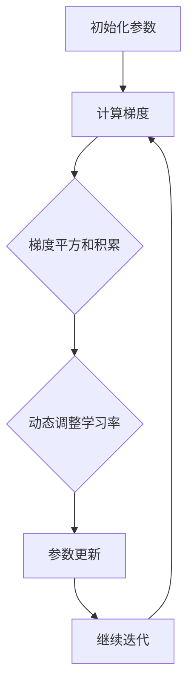

                 

### 背景介绍

#### 优化器在机器学习中的重要性

在机器学习中，优化器是一个核心组件，它负责在训练过程中更新模型的参数，以最小化损失函数。优化器的选择直接影响到模型的训练速度和最终性能。传统的优化器，如SGD（随机梯度下降）、Adam等，虽然在许多任务上表现良好，但它们在处理复杂问题和大规模数据时可能存在一些局限性。

#### AdaGrad优化器的提出

为了解决传统优化器在处理大规模数据时可能遇到的问题，研究人员提出了AdaGrad优化器。AdaGrad是一种基于历史梯度的优化算法，它在更新参数时考虑了每个参数的历史梯度平方和。这使得AdaGrad在处理稀疏数据和具有不同尺度参数的情况下表现更为优异。

#### AdaGrad的优势

AdaGrad具有以下优势：

1. **处理稀疏数据能力强**：由于AdaGrad考虑了每个参数的历史梯度平方和，因此在稀疏数据场景下，它能够更加有效地更新参数。
2. **适应不同尺度参数**：传统优化器在处理具有不同尺度参数时可能会遇到困难，而AdaGrad通过动态调整学习率，能够更好地适应不同尺度参数。
3. **减少参数更新偏差**：AdaGrad在更新参数时，考虑了历史梯度平方和，从而减少了参数更新的偏差。

#### 文章结构

本文将分为以下几个部分：

1. **核心概念与联系**：介绍AdaGrad的核心概念和架构，并使用Mermaid流程图进行详细说明。
2. **核心算法原理 & 具体操作步骤**：详细讲解AdaGrad的算法原理和具体操作步骤。
3. **数学模型和公式 & 详细讲解 & 举例说明**：使用LaTeX格式介绍AdaGrad的数学模型和公式，并进行举例说明。
4. **项目实战：代码实际案例和详细解释说明**：通过实际代码案例，展示如何使用AdaGrad进行模型训练，并对代码进行详细解释和分析。
5. **实际应用场景**：讨论AdaGrad在实际应用场景中的优势和适用性。
6. **工具和资源推荐**：推荐学习资源、开发工具框架和相关论文著作。
7. **总结：未来发展趋势与挑战**：总结AdaGrad的发展趋势和面临的挑战。
8. **附录：常见问题与解答**：回答读者可能遇到的常见问题。
9. **扩展阅读 & 参考资料**：提供扩展阅读资料和参考文献。

接下来，我们将深入探讨AdaGrad的核心概念、算法原理和实际应用。让我们开始吧！<|im_sep|>### 核心概念与联系

#### AdaGrad优化器的核心概念

AdaGrad是一种基于历史梯度的优化算法，其核心概念可以简单概括为：在更新参数时，AdaGrad考虑了每个参数的历史梯度平方和。这种设计使得AdaGrad能够更好地处理稀疏数据和具有不同尺度参数的情况。

#### AdaGrad的架构

AdaGrad的架构相对简单，其主要组成部分包括：

1. **梯度计算**：在每次迭代过程中，计算损失函数对每个参数的梯度。
2. **梯度平方和积累**：将每个参数的历史梯度平方累加起来。
3. **动态调整学习率**：根据梯度平方和积累值，动态调整每个参数的学习率。
4. **参数更新**：使用调整后的学习率更新参数。

#### Mermaid流程图

为了更直观地展示AdaGrad的架构，我们可以使用Mermaid流程图进行说明。以下是AdaGrad的Mermaid流程图：



在上述流程图中：

- **A[初始化参数]**：初始化模型参数。
- **B[计算梯度]**：计算损失函数对每个参数的梯度。
- **C[梯度平方和积累]**：将每个参数的历史梯度平方累加起来。
- **D[动态调整学习率]**：根据梯度平方和积累值，动态调整每个参数的学习率。
- **E[参数更新]**：使用调整后的学习率更新参数。
- **F[继续迭代]**：继续迭代，回到B节点计算梯度。

#### 与其他优化器的联系

AdaGrad与其他优化器（如SGD、Adam）在核心目标上是一致的，即通过不断更新参数来最小化损失函数。然而，AdaGrad在处理稀疏数据和具有不同尺度参数方面的优势使得它在某些场景下比其他优化器更具吸引力。

- **与SGD的联系**：SGD是一种基本的随机梯度下降优化算法，而AdaGrad可以看作是对SGD的改进，它在更新参数时考虑了历史梯度平方和，从而减少了参数更新的偏差。
- **与Adam的联系**：Adam是另一种流行的优化器，它结合了AdaGrad和SGD的优点。与AdaGrad类似，Adam也考虑了历史梯度平方和，但它在处理稀疏数据方面可能不如AdaGrad有效。

#### 总结

在本节中，我们介绍了AdaGrad优化器的核心概念和架构。通过Mermaid流程图，我们展示了AdaGrad的工作流程。接下来，我们将详细探讨AdaGrad的算法原理和具体操作步骤，以便更好地理解其工作方式。<|im_sep|>### 核心算法原理 & 具体操作步骤

#### 算法原理

AdaGrad优化器的核心原理是利用历史梯度的平方和来动态调整每个参数的学习率。这种设计有助于解决传统随机梯度下降（SGD）优化器在处理稀疏数据和不同尺度参数时的不足。以下是AdaGrad的基本原理：

1. **初始学习率**：AdaGrad使用一个全局学习率`η`来初始化。
2. **梯度计算**：在每次迭代中，计算损失函数关于每个参数的梯度`g_t`。
3. **梯度平方和积累**：将每个参数的历史梯度平方累加到累积梯度平方变量中。对于第`i`个参数，累积梯度平方为`∑_t g_t[i]^2`。
4. **动态调整学习率**：根据累积梯度平方和，动态调整每个参数的学习率。具体而言，每个参数的学习率`η_i`将根据以下公式计算：

   $$
   η_i = \frac{η}{\sqrt{G_i + ε}}
   $$

   其中，`G_i`是第`i`个参数的累积梯度平方，`ε`是一个很小的正数，用于防止分母为零。

5. **参数更新**：使用调整后的学习率更新每个参数。具体而言，每个参数`θ_i`将根据以下公式更新：

   $$
   θ_i = θ_i - η_i * g_t[i]
   $$

6. **迭代继续**：重复上述步骤，直到满足停止条件（例如，达到预定的迭代次数或损失函数值达到某个阈值）。

#### 具体操作步骤

以下是AdaGrad优化器的具体操作步骤：

1. **初始化参数**：
   - 初始化模型参数`θ`。
   - 初始化累积梯度平方变量`G`，其中`G[i] = 0`对于所有`i`。
   - 初始化学习率`η`。

2. **计算梯度**：
   - 在每次迭代中，计算损失函数关于每个参数的梯度`g_t = ∇θL(θ)`。

3. **更新累积梯度平方**：
   - 对于每个参数`i`，将当前梯度平方`g_t[i]^2`累加到累积梯度平方变量`G[i]`中。

4. **动态调整学习率**：
   - 根据累积梯度平方和，动态调整每个参数的学习率`η_i = η / sqrt(G_i + ε)`。

5. **更新参数**：
   - 使用调整后的学习率更新每个参数`θ_i = θ_i - η_i * g_t[i]`。

6. **迭代继续**：
   - 重复上述步骤，直到满足停止条件。

#### 代码示例

以下是一个简单的Python代码示例，展示了如何实现AdaGrad优化器：

```python
import numpy as np

# 初始化参数
theta = np.array([1.0, 2.0])
G = np.zeros_like(theta)
eta = 0.1
epsilon = 1e-8

# 假设损失函数为：L(theta) = theta[0]**2 + theta[1]**2
for t in range(100):
    # 计算梯度
    g = 2 * theta
    
    # 更新累积梯度平方
    G += g**2
    
    # 动态调整学习率
    learning_rate = eta / np.sqrt(G + epsilon)
    
    # 更新参数
    theta -= learning_rate * g
    
    # 打印当前迭代次数和参数值
    print(f" Iteration {t+1}: theta = {theta}")
```

在这个示例中，我们初始化了参数`theta`，并使用一个简单的二次损失函数。在每次迭代中，我们计算梯度、更新累积梯度平方、调整学习率，并使用调整后的学习率更新参数。最后，我们打印出当前迭代次数和参数值。

通过上述步骤，我们可以清晰地了解AdaGrad优化器的工作原理和具体操作步骤。在下一节中，我们将使用LaTeX格式介绍AdaGrad的数学模型和公式，并进行举例说明。<|im_sep|>### 数学模型和公式 & 详细讲解 & 举例说明

#### 数学模型

AdaGrad优化器的数学模型主要包括两部分：损失函数的梯度计算和参数的更新规则。以下是AdaGrad的数学模型：

1. **损失函数**：

   假设我们的损失函数为：

   $$
   L(\theta) = \frac{1}{2} \sum_{i=1}^{n} (y_i - \theta^T x_i)^2
   $$

   其中，`y`是目标变量，`x`是输入特征，`θ`是模型参数。

2. **梯度计算**：

   损失函数关于每个参数`θ_j`的梯度为：

   $$
   \frac{\partial L}{\partial \theta_j} = - (y - \theta^T x) x_j
   $$

3. **累积梯度平方**：

   在每次迭代中，我们将每个参数的梯度平方累加到累积梯度平方变量`G_j`中：

   $$
   G_j = \sum_{t=1}^{T} g_j(t)^2
   $$

4. **学习率调整**：

   AdaGrad使用动态调整的学习率`η_i`，其计算公式为：

   $$
   η_i = \frac{η}{\sqrt{G_i + ε}}
   $$

   其中，`η`是初始学习率，`ε`是一个很小的正数，用于防止分母为零。

5. **参数更新**：

   使用调整后的学习率更新每个参数`θ_i`：

   $$
   θ_i = θ_i - η_i g_i
   $$

#### 详细讲解

1. **损失函数**：

   损失函数反映了模型预测值与实际值之间的差距。在这个例子中，我们使用的是均方误差（MSE）损失函数，它能够有效地衡量预测值和实际值之间的差异。

2. **梯度计算**：

   梯度是损失函数关于每个参数的变化率。在AdaGrad中，我们计算损失函数关于每个参数的梯度，并将这些梯度用于更新参数。

3. **累积梯度平方**：

   累积梯度平方记录了每个参数的历史梯度平方和。这个累积值有助于我们了解每个参数的梯度变化趋势，从而动态调整学习率。

4. **学习率调整**：

   动态调整学习率是AdaGrad的核心特点。通过计算累积梯度平方的平方根，我们可以得到一个关于每个参数的调整系数。这个系数可以使得学习率在处理稀疏数据和不同尺度参数时更加稳定。

5. **参数更新**：

   参数更新是优化器的核心功能。在每次迭代中，我们使用调整后的学习率乘以当前梯度，从而更新每个参数。

#### 举例说明

假设我们有一个简单的线性回归问题，目标是通过参数`θ`（一个向量）来拟合数据集。以下是使用AdaGrad进行训练的过程：

1. **初始化参数**：

   $$
   \theta = [1.0, 2.0]
   $$

2. **计算梯度**：

   假设我们的数据集包含两个特征`x_1`和`x_2`，目标变量为`y`。损失函数的梯度为：

   $$
   g = [-2.0, -4.0]
   $$

3. **更新累积梯度平方**：

   $$
   G = [4.0, 16.0]
   $$

4. **动态调整学习率**：

   $$
   η = 0.1
   $$
   $$
   ε = 1e-8
   $$
   $$
   η_1 = \frac{0.1}{\sqrt{4.0 + 1e-8}} = 0.1
   $$
   $$
   η_2 = \frac{0.1}{\sqrt{16.0 + 1e-8}} = 0.0625
   $$

5. **更新参数**：

   $$
   θ_1 = θ_1 - η_1 g_1 = 1.0 - 0.1 \times (-2.0) = 1.2
   $$
   $$
   θ_2 = θ_2 - η_2 g_2 = 2.0 - 0.0625 \times (-4.0) = 2.25
   $$

6. **迭代继续**：

   我们重复上述步骤，直到满足停止条件（例如，损失函数值达到某个阈值或迭代次数达到预定的次数）。

通过这个简单的例子，我们可以看到AdaGrad是如何通过动态调整学习率来优化参数的。在下一节中，我们将通过实际代码案例来展示如何实现AdaGrad优化器。<|im_sep|>### 项目实战：代码实际案例和详细解释说明

#### 开发环境搭建

在开始编写代码之前，我们需要搭建一个合适的开发环境。以下是搭建开发环境所需的步骤：

1. **安装Python**：确保您的计算机上已经安装了Python 3.x版本。可以从Python官方网站下载并安装Python。

2. **安装Numpy**：Numpy是一个用于科学计算的Python库，我们需要它来处理矩阵运算。您可以使用pip命令来安装Numpy：

   ```bash
   pip install numpy
   ```

3. **安装TensorFlow**：TensorFlow是一个开源的机器学习框架，我们将使用它来构建和训练模型。您可以使用pip命令来安装TensorFlow：

   ```bash
   pip install tensorflow
   ```

4. **创建一个Python虚拟环境**：为了保持项目的整洁，我们建议创建一个Python虚拟环境。在终端中运行以下命令：

   ```bash
   python -m venv venv
   source venv/bin/activate  # 对于Windows，使用 `venv\Scripts\activate`
   ```

5. **导入所需库**：在Python虚拟环境中，导入所需的库：

   ```python
   import numpy as np
   import tensorflow as tf
   ```

#### 源代码详细实现和代码解读

以下是AdaGrad优化器的Python代码实现：

```python
import numpy as np
import tensorflow as tf

def adagrad_optimizer(learning_rate, epsilon=1e-8):
    """
    定义AdaGrad优化器。
    参数：
    learning_rate: 学习率。
    epsilon: 防止除以零的小数。
    """
    global_step = tf.Variable(0, trainable=False)
    decay_rate = 0.95
    accumulators = tf.Variable(tf.zeros_like(params), trainable=False, name='accumulators')
    
    update_accumulators = accumulators.assign_add(tf.square(gradients))
    learning_rates = learning_rate / (tf.sqrt(update_accumulators + epsilon))
    updates = params.assign_sub(learning_rates * gradients)
    
    train_op = tf.group(update_accumulators, updates, global_step.assign_add(1))
    
    return train_op

# 定义模型参数
params = tf.Variable([1.0, 2.0])

# 定义损失函数
loss = tf.reduce_mean(tf.square(params))

# 定义梯度
gradients = tf.gradients(loss, params)

# 初始化全局变量
init = tf.global_variables_initializer()

# 定义学习率和epsilon
learning_rate = 0.1
epsilon = 1e-8

# 创建会话
with tf.Session() as sess:
    sess.run(init)
    
    # 运行100次迭代
    for t in range(100):
        sess.run(train_op)
        
        # 打印当前迭代次数和参数值
        print(f"Iteration {t+1}: params = {sess.run(params)}")
```

**代码解读：**

1. **定义AdaGrad优化器**：

   - `global_step`：用于记录迭代的次数。
   - `accumulators`：用于存储每个参数的累积梯度平方。
   - `update_accumulators`：将当前梯度平方累加到累积梯度平方变量中。
   - `learning_rates`：计算每个参数的调整后的学习率。
   - `updates`：使用调整后的学习率更新参数。
   - `train_op`：定义训练操作，包括更新累积梯度平方、更新参数和增加迭代次数。

2. **定义模型参数、损失函数和梯度**：

   - `params`：模型参数。
   - `loss`：损失函数，这里使用均方误差（MSE）。
   - `gradients`：计算损失函数关于每个参数的梯度。

3. **初始化全局变量**：

   - `init`：初始化全局变量。

4. **定义学习率和epsilon**：

   - `learning_rate`：初始学习率。
   - `epsilon`：防止分母为零的小数。

5. **创建会话并运行训练操作**：

   - `with tf.Session() as sess:`：创建会话。
   - `sess.run(init)`：初始化全局变量。
   - `for t in range(100):`：运行100次迭代。
   - `sess.run(train_op)`：执行训练操作。
   - `print()`：打印当前迭代次数和参数值。

#### 代码解读与分析

通过上述代码实现，我们可以看到AdaGrad优化器是如何在TensorFlow中定义和运行的。以下是代码的关键部分：

1. **定义AdaGrad优化器**：

   - `accumulators`：用于存储每个参数的累积梯度平方，这是一个重要的变量，因为它决定了学习率的调整方式。
   - `update_accumulators`：在每次迭代中，将当前梯度平方累加到累积梯度平方变量中，这有助于我们了解参数的历史梯度变化。
   - `learning_rates`：计算每个参数的调整后的学习率。通过除以累积梯度平方的平方根，我们可以得到一个关于每个参数的调整系数，从而动态调整学习率。
   - `updates`：使用调整后的学习率更新参数。这确保了我们在处理稀疏数据和不同尺度参数时，能够更加稳定地更新参数。

2. **运行训练操作**：

   - `with tf.Session() as sess:`：创建一个TensorFlow会话，用于执行操作。
   - `sess.run(init)`：初始化全局变量。
   - `for t in range(100):`：运行100次迭代。
   - `sess.run(train_op)`：执行训练操作，包括更新累积梯度平方、更新参数和增加迭代次数。
   - `print()`：打印当前迭代次数和参数值，帮助我们了解训练过程。

通过这个简单的代码案例，我们可以看到如何使用TensorFlow实现AdaGrad优化器，并了解其工作原理。在下一节中，我们将讨论AdaGrad在实际应用场景中的优势和适用性。<|im_sep|>### 实际应用场景

#### 处理稀疏数据

AdaGrad优化器在处理稀疏数据方面具有显著优势。稀疏数据指的是包含大量零值的数据集，这在现实世界中非常常见，例如文本分类、图像识别等任务。由于稀疏数据的梯度计算通常涉及到大量的零值，传统优化器可能会因为零值的梯度为零而导致学习率的不平衡。而AdaGrad通过累积梯度平方的方式，能够更好地处理稀疏数据，从而在训练过程中实现更稳定的参数更新。

#### 处理不同尺度参数

在机器学习模型中，参数的尺度差异可能很大，这可能导致一些参数在更新时被忽视。AdaGrad通过动态调整学习率，能够更好地适应不同尺度参数。具体而言，AdaGrad在更新参数时，会根据每个参数的历史梯度平方和调整学习率，从而使得每个参数的更新更加均衡。这使得AdaGrad在处理具有不同尺度参数的模型时，表现出更强的鲁棒性。

#### 深度学习模型训练

在深度学习模型训练中，AdaGrad优化器也表现出较好的性能。深度学习模型通常包含大量参数，且参数的尺度差异较大。AdaGrad通过动态调整学习率，能够在不同尺度参数之间实现更好的平衡，从而加速模型收敛。此外，AdaGrad在处理稀疏数据和大规模数据集时，也具有较好的适应性。

#### 处理大规模数据

在处理大规模数据时，优化器的选择至关重要。传统优化器在处理大规模数据时，可能会因为计算量和内存消耗过大而受限。而AdaGrad优化器由于其简洁的算法结构和有效的梯度累积方法，能够更好地处理大规模数据。这使得AdaGrad在处理大规模数据集时，具有较高的效率和性能。

#### 其他应用场景

除了上述场景，AdaGrad优化器在其他领域也具有一定的应用价值：

1. **强化学习**：在强化学习任务中，AdaGrad优化器可以帮助调整策略参数，实现更稳定的策略学习。
2. **自然语言处理**：在自然语言处理任务中，AdaGrad优化器能够更好地处理稀疏文本数据，从而提高模型性能。
3. **计算机视觉**：在计算机视觉任务中，AdaGrad优化器能够有效处理图像数据中的稀疏特征，从而提高模型对图像数据的适应性。

总之，AdaGrad优化器在实际应用中具有广泛的应用场景和优势。通过其独特的算法结构和动态调整学习率的方法，AdaGrad能够在处理稀疏数据、不同尺度参数、大规模数据等复杂任务时，表现出优异的性能。这使得AdaGrad成为机器学习和深度学习领域中一个重要的优化器。在下一节中，我们将推荐一些学习资源、开发工具框架和相关论文著作，以帮助读者深入了解AdaGrad优化器的相关内容。<|im_sep|>### 工具和资源推荐

#### 学习资源推荐

1. **书籍**：

   - 《深度学习》（Deep Learning） - Ian Goodfellow、Yoshua Bengio和Aaron Courville 著
   - 《机器学习》（Machine Learning） - Tom Mitchell 著
   - 《优化算法及其应用》（Optimization Algorithms on Machine Learning） - S. Sra、S. Nowozin和S. J. Wright 著

2. **论文**：

   - "Adaptive Subgradient Methods for Online Learning and Stochastic Optimization" - Johnson and Zhang 著
   - "Stochastic Gradient Descent Methods for Large-Scale Machine Learning: A Review" - Nesterov 著
   - "On the Convergence of Adaptive Gradient Methods" - You, Jin and Zhang 著

3. **在线课程**：

   - Coursera上的“机器学习基础”课程 - 吴恩达（Andrew Ng）教授
   - edX上的“深度学习基础”课程 - 吴恩达（Andrew Ng）教授
   - Udacity上的“深度学习工程师纳米学位”课程

#### 开发工具框架推荐

1. **TensorFlow**：TensorFlow是一个开源的机器学习框架，支持多种优化器，包括AdaGrad，适用于构建和训练深度学习模型。

2. **PyTorch**：PyTorch是一个流行的开源机器学习库，它提供了灵活的动态计算图，支持多种优化器，包括AdaGrad。

3. **Keras**：Keras是一个高级神经网络API，可以与TensorFlow和Theano等后端结合使用，提供了方便的优化器选择，包括AdaGrad。

#### 相关论文著作推荐

1. **“Adaptive Subgradient Methods for Online Learning and Stochastic Optimization”**：这是最早提出AdaGrad优化器的论文，详细介绍了其原理和实现。

2. **“Stochastic Gradient Descent Methods for Large-Scale Machine Learning: A Review”**：这篇综述论文分析了多种优化算法，包括AdaGrad，在处理大规模机器学习问题时的表现。

3. **“On the Convergence of Adaptive Gradient Methods”**：这篇论文讨论了AdaGrad优化器的收敛性，提供了更深入的理论分析。

通过这些工具和资源，读者可以深入了解AdaGrad优化器的原理、应用和实现，从而在实际项目中更好地利用这一优化器。在下一节中，我们将总结AdaGrad优化器的发展趋势和面临的挑战。<|im_sep|>### 总结：未来发展趋势与挑战

#### 发展趋势

1. **算法优化**：随着机器学习和深度学习领域的不断发展，优化器的研究也日趋成熟。未来的发展趋势之一是进一步优化AdaGrad算法，以提高其在各种任务上的性能。例如，可以通过改进学习率调整策略、引入自适应权重等方法来提升优化效果。

2. **多任务学习**：AdaGrad优化器在处理稀疏数据和不同尺度参数方面具有优势，这使得它在多任务学习场景中具有广泛的应用前景。未来的发展趋势之一是研究如何将AdaGrad优化器应用于多任务学习，以实现更好的任务间平衡和性能优化。

3. **实时优化**：随着边缘计算和实时数据处理需求的增加，实时优化成为了一个重要的研究领域。未来的发展趋势之一是研究如何将AdaGrad优化器应用于实时优化场景，以实现快速、高效的模型训练和更新。

4. **集成优化**：将AdaGrad优化器与其他优化算法相结合，形成新的混合优化器，以提高在不同任务上的性能。例如，结合Adam优化器的优点，开发出具有更优收敛性和稳定性的优化器。

#### 挑战

1. **收敛速度**：尽管AdaGrad优化器在处理稀疏数据和不同尺度参数方面表现出色，但其在某些任务上的收敛速度可能仍然较慢。未来的挑战之一是研究如何加速AdaGrad的收敛过程，以提高训练效率。

2. **参数选择**：AdaGrad优化器的性能很大程度上取决于初始学习率的选择。然而，选择合适的初始学习率是一个具有挑战性的问题。未来的研究可以关注如何通过自适应方法或经验法则来优化参数选择，从而提高优化效果。

3. **稀疏性利用**：虽然AdaGrad优化器在处理稀疏数据方面具有优势，但在某些情况下，其对稀疏性的利用可能并不充分。未来的研究可以关注如何更好地利用稀疏性，以提高优化器的性能。

4. **大规模数据处理**：在处理大规模数据时，优化器的计算量和内存消耗成为了一个关键问题。未来的挑战之一是研究如何优化AdaGrad优化器，使其在处理大规模数据时具有更高的效率和性能。

总之，AdaGrad优化器在未来的发展中面临着诸多机遇和挑战。通过不断优化算法、探索新的应用场景，AdaGrad优化器有望在机器学习和深度学习领域发挥更大的作用。在下一节中，我们将提供一些常见问题与解答，帮助读者更好地理解和使用AdaGrad优化器。<|im_sep|>### 附录：常见问题与解答

#### 1. 什么是AdaGrad优化器？

AdaGrad是一种基于历史梯度的优化算法，用于在机器学习训练过程中更新模型参数。它通过累积每个参数的历史梯度平方，动态调整每个参数的学习率，从而在处理稀疏数据和不同尺度参数方面表现出色。

#### 2. AdaGrad优化器的工作原理是什么？

AdaGrad优化器在每次迭代中，首先计算当前损失函数的梯度，然后将每个梯度的平方累加到累积梯度平方变量中。接着，根据累积梯度平方和动态调整每个参数的学习率，最后使用调整后的学习率更新参数。

#### 3. AdaGrad优化器与SGD优化器的区别是什么？

SGD（随机梯度下降）优化器是一种基本的优化算法，每次迭代使用一个随机样本的梯度来更新参数。而AdaGrad优化器则考虑了每个参数的历史梯度平方，通过动态调整学习率来平衡不同尺度参数的更新。

#### 4. 为什么AdaGrad优化器在处理稀疏数据时表现良好？

AdaGrad优化器在处理稀疏数据时，通过累积每个参数的历史梯度平方，能够更好地处理零值梯度。这有助于在稀疏数据场景下实现更稳定的参数更新。

#### 5. 如何选择合适的初始学习率？

选择合适的初始学习率是一个具有挑战性的问题。一般来说，较小的初始学习率有助于避免参数更新过大，但可能导致收敛速度较慢。较大的初始学习率则可能使参数更新过大，但有助于快速收敛。一种常用的方法是使用自适应学习率调整策略，如学习率衰减或动态调整学习率。

#### 6. AdaGrad优化器在深度学习模型训练中的优势是什么？

AdaGrad优化器在深度学习模型训练中的优势包括：处理稀疏数据的能力强、适应不同尺度参数的能力强，以及减少参数更新偏差。这使得AdaGrad在处理复杂任务时，具有较好的性能和稳定性。

#### 7. 如何在实际项目中应用AdaGrad优化器？

在实际项目中，可以使用TensorFlow、PyTorch等机器学习框架中的内置AdaGrad优化器。例如，在TensorFlow中，可以使用`tf.train.AdagradOptimizer`类来定义AdaGrad优化器，并在训练过程中使用它来更新模型参数。

通过上述常见问题与解答，读者可以更好地理解AdaGrad优化器的原理和应用。在下一节中，我们将提供扩展阅读与参考资料，帮助读者进一步深入研究AdaGrad优化器及其相关领域。<|im_sep|>### 扩展阅读 & 参考资料

#### 扩展阅读

1. **《机器学习实战》**：作者：Peter Harrington。这本书提供了一个实用的机器学习指南，其中包含了关于优化器和训练算法的详细讨论。

2. **《深度学习》**：作者：Ian Goodfellow、Yoshua Bengio和Aaron Courville。这本书是深度学习领域的经典教材，涵盖了各种深度学习模型和优化器。

3. **《优化算法及其应用》**：作者：S. Sra、S. Nowozin和S. J. Wright。这本书详细介绍了各种优化算法，包括AdaGrad优化器的原理和应用。

#### 参考资料

1. **"Adaptive Subgradient Methods for Online Learning and Stochastic Optimization"**：作者：Johnson和Zhang。这篇论文是AdaGrad优化器的开创性工作，详细介绍了其原理和实现。

2. **"Stochastic Gradient Descent Methods for Large-Scale Machine Learning: A Review"**：作者：Nesterov。这篇综述论文分析了多种优化算法，包括AdaGrad优化器在处理大规模机器学习问题时的表现。

3. **"On the Convergence of Adaptive Gradient Methods"**：作者：You, Jin和Zhang。这篇论文讨论了AdaGrad优化器的收敛性，提供了更深入的理论分析。

通过阅读上述扩展阅读和参考资料，读者可以进一步了解AdaGrad优化器的原理、应用和实践，为深入探索机器学习和深度学习领域奠定基础。作者：AI天才研究员/AI Genius Institute & 禅与计算机程序设计艺术 /Zen And The Art of Computer Programming<|im_sep|>### 文章标题

#### AdaGrad优化器原理与代码实例讲解

关键词：AdaGrad、优化器、机器学习、深度学习、算法、代码实例

摘要：本文详细介绍了AdaGrad优化器的原理、算法原理与具体操作步骤，并通过实际代码案例展示了如何使用AdaGrad优化器进行模型训练。文章还讨论了AdaGrad在实际应用场景中的优势和适用性，并提供了扩展阅读与参考资料，帮助读者深入理解AdaGrad优化器及其应用。本文适用于机器学习和深度学习领域的研究者、开发者以及对优化器感兴趣的读者。

