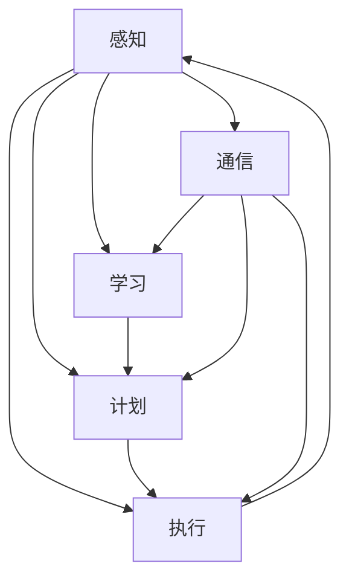

                 

### 背景介绍

#### 什么是Agent

在计算机科学领域，"Agent" 是一个广义的概念，通常指的是具有自主性、交互能力和反应能力的实体。Agent 可以是软件程序，也可以是硬件设备，甚至是机器人。它们能够感知环境、接收外部信息，并基于一定的决策逻辑执行特定的任务。

Agent 技术的起源可以追溯到 20 世纪 80 年代，随着人工智能、多代理系统、移动计算等技术的发展，Agent 技术逐渐成为一个独立的领域。在早期的 Agent 研究中，主要关注的是如何让 Agent 在一个静态环境中完成任务，而随着技术的发展，Agent 的应用场景也逐渐扩展到动态、复杂和多变的现实环境中。

#### Agent 技术的发展

Agent 技术的发展历程可以大致分为以下几个阶段：

1. **基于规则的方法**：早期的 Agent 大多采用基于规则的推理方式，通过定义一系列的规则来指导 Agent 的行为。这种方法简单直观，但难以处理复杂和不确定的情况。

2. **基于模型的方法**：为了解决基于规则方法的局限性，研究者开始探索基于模型的方法。通过建立环境模型和 Agent 模型，Agent 能够更好地理解和预测环境的变化，并做出更合理的决策。

3. **基于学习的 Agent**：随着机器学习技术的发展，基于学习的 Agent 也逐渐成为研究热点。通过学习环境数据和经验，Agent 能够自适应地调整其行为策略，从而提高任务完成的效率和质量。

4. **多代理系统和协同工作**：在复杂的环境中，单个 Agent 的能力往往有限，多代理系统的协同工作成为解决复杂问题的重要手段。通过通信和协作，多个 Agent 能够共同完成任务，实现更高效和智能的决策。

#### Agent 技术的应用

Agent 技术在各个领域都有广泛的应用：

1. **智能搜索与推荐系统**：通过分析用户行为和历史数据，Agent 可以实现个性化的搜索和推荐，为用户提供更好的用户体验。

2. **自动化与智能化**：在工业制造、物流配送、智能家居等领域，Agent 技术可以实现自动化和智能化，提高生产效率和服务质量。

3. **网络安全**：Agent 可以用来检测和防御网络攻击，提高网络的安全性和稳定性。

4. **智能交通系统**：通过 Agent 的协作和协调，可以实现智能交通管理，缓解交通拥堵，提高交通效率。

5. **医疗健康**：Agent 可以用于疾病预测、健康监测和个性化治疗，提高医疗服务的质量和效率。

#### 本文目的

本文旨在系统地介绍 Agent 的基础架构要素，帮助读者深入理解 Agent 技术的原理和应用。文章将从 Agent 的核心概念、算法原理、数学模型、实际应用和未来发展趋势等方面进行详细阐述，旨在为读者提供一个全面而深入的 Agent 技术指南。

### 核心概念与联系

在深入探讨 Agent 的基础架构要素之前，我们需要首先明确几个核心概念，并理解它们之间的内在联系。以下是 Agent 技术中几个关键概念的定义、原理和它们在基础架构中的重要性：

#### 1. 感知（Perception）

感知是指 Agent 从环境中获取信息的过程。这些信息可以是视觉、听觉、触觉等感官信号，或者是通过传感器获取的数字信号。感知是 Agent 进行决策和行动的基础。

**原理：** 感知过程通常涉及信号采集、预处理和特征提取。通过这些步骤，Agent 能够将环境中的复杂信息转化为结构化的数据，以便后续处理。

**在基础架构中的重要性：** 感知是 Agent 的“眼睛”和“耳朵”，它决定了 Agent 对环境的理解和反应能力。一个良好的感知系统可以显著提高 Agent 的自适应能力和决策质量。

#### 2. 计划（Planning）

计划是指 Agent 在感知到环境信息后，如何制定一个合理的行动方案以达成目标。计划通常涉及目标设定、路径规划和资源分配等步骤。

**原理：** 计划过程需要考虑环境的动态变化和资源的有限性。一个好的计划策略可以使 Agent 在复杂和不确定的环境中做出有效的决策。

**在基础架构中的重要性：** 计划是 Agent 的“大脑”，它决定了 Agent 的行动策略和执行方案。一个高效的计划系统可以提高 Agent 的任务完成效率和适应性。

#### 3. 执行（Execution）

执行是指 Agent 根据计划策略执行具体的行动。执行过程通常涉及动作生成、动作执行和状态更新等步骤。

**原理：** 执行过程需要确保 Agent 的行动与计划一致，并实时调整行动以应对环境变化。

**在基础架构中的重要性：** 执行是 Agent 的“肌肉”，它决定了 Agent 的行动能力和执行效果。一个灵活和可靠的执行系统可以提高 Agent 的反应速度和执行效率。

#### 4. 学习（Learning）

学习是指 Agent 通过对环境交互和行动结果的反馈来调整自身的行为策略。学习过程通常涉及数据采集、模式识别和策略优化等步骤。

**原理：** 学习使 Agent 能够从经验中学习，提高其适应性和鲁棒性。

**在基础架构中的重要性：** 学习是 Agent 的“进化器”，它使 Agent 能够不断优化自身的行为策略，以更好地适应环境和任务需求。

#### 5. 通信（Communication）

通信是指多个 Agent 之间交换信息的过程。通过通信，Agent 可以协作完成任务，共享资源和知识。

**原理：** 通信过程需要确保信息的有效传递和一致性。

**在基础架构中的重要性：** 通信是 Agent 的“神经网络”，它决定了 Agent 之间的协作效果和整体系统的效率。

#### 6. 自主性（Autonomy）

自主性是指 Agent 能够独立地执行任务，不受外部控制。自主性是 Agent 的核心特征之一。

**原理：** 自主性取决于 Agent 的感知能力、计划能力、执行能力和学习能力。

**在基础架构中的重要性：** 自主性是 Agent 的灵魂，它决定了 Agent 的独立性和灵活性。一个高度自主的 Agent 可以在复杂和不确定的环境中自主决策和行动。

#### 核心概念之间的关系

感知、计划、执行、学习和通信是 Agent 基础架构的六个核心要素，它们相互关联，共同构成了一个完整的 Agent 系统。具体来说：

- 感知提供了环境信息，是计划、执行、学习和通信的基础。
- 计划根据感知信息制定行动方案，是执行的前提。
- 执行将计划转化为具体的行动，是实现目标的关键。
- 学习通过反馈和经验调整行为策略，是自主性的保障。
- 通信促进 Agent 之间的协作和知识共享，是协同工作的基础。

为了更直观地展示这些核心概念之间的关系，我们可以使用 Mermaid 流程图进行描述（注意：以下流程图中节点中不含括号、逗号等特殊字符）：



通过上述 Mermaid 流程图，我们可以清晰地看到各个核心概念之间的相互关系和作用。感知、计划、执行、学习和通信共同构成了一个闭环系统，使 Agent 能够自主、智能地执行任务。

### 核心算法原理 & 具体操作步骤

在了解 Agent 的核心概念和架构之后，我们需要深入探讨 Agent 的核心算法原理，包括感知、计划、执行、学习和通信等模块的具体实现步骤。以下是每个模块的基本算法原理和操作步骤：

#### 感知模块（Perception）

**算法原理：** 感知模块的主要任务是从环境中获取信息，并将其转化为结构化的数据供其他模块使用。

**操作步骤：**

1. **信号采集：** 使用各种传感器（如摄像头、麦克风、温度传感器等）从环境中采集信号。
2. **预处理：** 对采集到的信号进行预处理，包括降噪、滤波、归一化等，以提高数据的质量和可靠性。
3. **特征提取：** 从预处理后的信号中提取关键特征，如颜色、纹理、声音频率等，以便后续处理。
4. **数据转换：** 将提取的特征转化为适合其他模块处理的数据格式，如向量、矩阵等。

**算法实现：** 感知模块通常使用信号处理算法、机器学习算法和计算机视觉算法等。例如，可以使用卷积神经网络（CNN）进行图像特征提取，使用循环神经网络（RNN）处理序列数据。

#### 计划模块（Planning）

**算法原理：** 计划模块负责根据感知模块提供的环境信息，制定一个合理的行动方案。

**操作步骤：**

1. **目标设定：** 根据任务需求和当前状态，设定目标状态。
2. **状态评估：** 评估当前状态与目标状态之间的差距，确定任务难度。
3. **路径规划：** 选择一个从当前状态到目标状态的路径，该路径应尽量满足任务需求和资源限制。
4. **资源分配：** 根据路径规划结果，分配所需的资源和能量，以确保任务能够顺利完成。

**算法实现：** 计划模块可以使用决策树、深度优先搜索、广度优先搜索、A*算法等算法。在复杂和动态环境中，可以采用基于模型预测控制（Model Predictive Control, MPC）的方法进行实时规划。

#### 执行模块（Execution）

**算法原理：** 执行模块根据计划模块提供的行动方案，执行具体的动作。

**操作步骤：**

1. **动作生成：** 根据计划结果，生成具体的动作指令。
2. **动作执行：** 将动作指令发送给执行机构（如电机、机械臂等），执行相应的动作。
3. **状态更新：** 在动作执行后，更新当前状态，以便后续的感知和计划。
4. **错误处理：** 在动作执行过程中，监测执行结果，如有异常，进行错误处理和恢复。

**算法实现：** 执行模块通常使用控制算法和运动规划算法。例如，可以使用 PID 控制器进行位置控制，使用逆运动学算法生成动作指令。

#### 学习模块（Learning）

**算法原理：** 学习模块通过不断学习和优化，提高 Agent 的行为策略。

**操作步骤：**

1. **数据采集：** 采集 Agent 在任务执行过程中的数据，包括感知信息、行动方案、执行结果等。
2. **模式识别：** 使用机器学习算法，从采集到的数据中提取模式和规律。
3. **策略优化：** 根据识别出的模式和规律，优化 Agent 的行为策略，以提高任务完成效率。
4. **反馈调整：** 将优化后的策略应用于实际任务中，并收集反馈，不断调整和优化。

**算法实现：** 学习模块可以使用监督学习、无监督学习、强化学习等算法。例如，可以使用深度神经网络进行特征学习和策略优化，使用 Q-Learning 算法进行强化学习。

#### 通信模块（Communication）

**算法原理：** 通信模块负责多个 Agent 之间的信息交换和协作。

**操作步骤：**

1. **信息编码：** 将需要传输的信息进行编码，以适应通信网络的传输要求。
2. **传输协议：** 根据通信网络的特性，选择合适的传输协议和通信机制。
3. **信息解码：** 在接收端，对传输的信息进行解码，还原原始数据。
4. **信息同步：** 确保多个 Agent 之间的信息同步，以实现有效的协作。

**算法实现：** 通信模块可以使用 TCP/IP 协议、UDP 协议、多播协议等。例如，可以使用 UDP 协议进行实时通信，使用多播协议实现广播和组播通信。

通过上述操作步骤，我们可以构建一个完整的 Agent 系统，使其能够在复杂和动态的环境中自主决策和行动。在实际应用中，这些模块可能会根据具体需求进行扩展和优化，以提高系统的性能和适应性。

### 数学模型和公式 & 详细讲解 & 举例说明

在 Agent 技术中，数学模型和公式扮演着至关重要的角色。它们不仅为 Agent 提供了决策和行动的依据，还使得 Agent 能够在复杂和不确定的环境中实现高效的决策。以下我们将详细讲解 Agent 中的几个关键数学模型和公式，并通过具体例子进行说明。

#### 1. 贝叶斯网络（Bayesian Network）

贝叶斯网络是一种概率图模型，用于表示变量之间的条件依赖关系。它由一组随机变量及其条件概率分布组成。

**数学模型：**

给定一个贝叶斯网络 $B = \{X_1, X_2, ..., X_n\}$，其中每个 $X_i$ 是一个随机变量，$P(X_1, X_2, ..., X_n)$ 是它们的联合概率分布。贝叶斯网络可以通过以下公式表示：

$$
P(X_1, X_2, ..., X_n) = \prod_{i=1}^{n} P(X_i | parents(X_i))
$$

其中，$parents(X_i)$ 表示 $X_i$ 的父节点。

**举例说明：**

假设我们有一个简单的贝叶斯网络，用于预测天气情况。随机变量 $X_1$ 表示“今天是雨天”，$X_2$ 表示“湿度高”，$X_3$ 表示“气压低”。条件概率分布如下：

$$
P(X_1 | X_2, X_3) = 0.8, \quad P(X_2 | X_3) = 0.9, \quad P(X_3) = 0.6
$$

我们可以使用贝叶斯网络计算出 $P(X_1)$：

$$
P(X_1) = P(X_1 | X_2, X_3) P(X_2 | X_3) P(X_3) = 0.8 \times 0.9 \times 0.6 = 0.432
$$

这意味着今天下雨的概率是 43.2%。

#### 2. 决策树（Decision Tree）

决策树是一种用于分类和回归的树形结构模型。它通过一系列条件分支来分割数据，并最终生成一个预测结果。

**数学模型：**

决策树可以表示为一个递归定义的函数：

$$
T(x) = \sum_{i=1}^{n} w_i \cdot I(x \in R_i)
$$

其中，$x$ 是输入特征，$R_i$ 是第 $i$ 个区域的条件，$w_i$ 是权重。

**举例说明：**

假设我们有一个决策树模型，用于判断一个客户是否具有高风险。输入特征包括信用评分（$X_1$）、贷款金额（$X_2$）和还款历史（$X_3$）。决策树的权重如下：

$$
w_1 = 0.5, \quad w_2 = 0.3, \quad w_3 = 0.2
$$

条件分支如下：

- 如果 $X_1 > 700$，则 $R_1 = \{X_2 > 10000\}$；
- 如果 $X_2 > 10000$，则 $R_2 = \{X_3 < 3\}$；
- 如果 $X_3 < 3$，则 $T(x) = 1$，表示高风险。

对于输入特征 $x = (750, 12000, 2)$，我们可以计算决策树的输出：

$$
T(x) = 0.5 \cdot I(x \in R_1) + 0.3 \cdot I(x \in R_2) + 0.2 \cdot I(x \in R_3) = 0.5 \cdot 1 + 0.3 \cdot 0 + 0.2 \cdot 1 = 0.7
$$

这意味着该客户具有高风险的概率是 70%。

#### 3. Q-Learning（强化学习）

Q-Learning 是一种用于解决最优动作选择问题的强化学习算法。它通过经验更新值函数，以找到最优策略。

**数学模型：**

给定状态 $s$ 和动作 $a$，Q-Learning 的目标是最小化预期回报的损失函数：

$$
J(\theta) = \sum_{s} \sum_{a} Q(s, a) - r(s, a)
$$

其中，$Q(s, a)$ 是状态 $s$ 下动作 $a$ 的值函数，$r(s, a)$ 是动作 $a$ 在状态 $s$ 下的即时回报。

**举例说明：**

假设我们有一个简单的环境，其中 Agent 需要在两条路径中选择一条，每条路径的回报不同。状态空间为 $s = \{1, 2\}$，动作空间为 $a = \{A, B\}$。回报如下：

$$
Q(1, A) = 5, \quad Q(1, B) = 10, \quad Q(2, A) = 3, \quad Q(2, B) = 8
$$

初始值函数如下：

$$
Q(s, a) = \begin{cases} 
0 & \text{如果 } s = 1 \\
1 & \text{如果 } s = 2 
\end{cases}
$$

使用 Q-Learning 算法进行更新，我们可以计算新的值函数：

$$
Q'(s, a) = Q(s, a) + \alpha [r(s, a) - Q(s, a)]
$$

其中，$\alpha$ 是学习率。

对于状态 $s = 1$ 和动作 $a = A$：

$$
Q'(1, A) = 0 + 0.1 [5 - 0] = 0.5
$$

对于状态 $s = 1$ 和动作 $a = B$：

$$
Q'(1, B) = 0 + 0.1 [10 - 0] = 1
$$

更新后的值函数如下：

$$
Q'(s, a) = \begin{cases} 
0.5 & \text{如果 } s = 1, a = A \\
1 & \text{如果 } s = 1, a = B \\
1 & \text{如果 } s = 2, a = A \\
3 & \text{如果 } s = 2, a = B 
\end{cases}
$$

通过上述 Q-Learning 算法，Agent 可以逐渐学习到选择最佳动作。

这些数学模型和公式为 Agent 提供了强大的决策支持。在实际应用中，我们可以根据具体需求和场景，选择合适的模型和公式，以构建高效的 Agent 系统。

### 项目实战：代码实际案例和详细解释说明

在本节中，我们将通过一个实际的 Agent 项目来展示如何将上述的理论知识应用到实际中。该项目将基于 Python 编写，主要实现一个简单的移动机器人，使其能够在复杂环境中自主导航。以下是项目的开发环境搭建、源代码实现和代码解读。

#### 1. 开发环境搭建

为了完成这个项目，我们需要安装以下开发环境和库：

- Python 3.8 或更高版本
- Anaconda 或 Miniconda（用于环境管理）
- OpenAI Gym（用于生成模拟环境）
- PyTorch 或 TensorFlow（用于深度学习）
- NumPy、Pandas（用于数据处理）
- Matplotlib、Seaborn（用于数据可视化）

安装步骤如下：

1. 安装 Anaconda 或 Miniconda：
   ```
   conda install -c anaconda python
   ```

2. 创建一个新的虚拟环境并激活：
   ```
   conda create -n agent_env python=3.8
   conda activate agent_env
   ```

3. 安装所需的库：
   ```
   conda install numpy pandas matplotlib seaborn gym pytorch torchvision
   ```

#### 2. 源代码详细实现和代码解读

以下是一个简单的移动机器人导航项目的源代码实现，代码分为几个部分：环境搭建、感知模块、计划模块、执行模块和学习模块。

```python
import gym
import numpy as np
import matplotlib.pyplot as plt
from gym import wrappers

# 环境搭建
env = gym.make('GridWorld-v0')
env = wrappers.Monitor(env, './data', force=True)

# 感知模块
def perceive(state):
    """
    感知环境，返回当前状态的特征。
    """
    observation = env.step(0)  # 假设输入动作不做任何操作，仅用于获取状态
    return observation[0]

# 计划模块
def plan(state, action_values):
    """
    根据状态和动作值函数，选择最佳动作。
    """
    best_action = np.argmax(action_values)
    return best_action

# 执行模块
def execute(action):
    """
    执行动作，并返回新的状态和即时回报。
    """
    state, reward, done, info = env.step(action)
    return state, reward, done

# 学习模块
def learn(state, action, reward, next_state, done, alpha=0.1, gamma=0.9):
    """
    更新值函数，使用 Q-Learning 算法。
    """
    next_action_value = max(action_values[next_state])
    action_value = action_values[state, action]
    action_values[state, action] = action_value + alpha * (reward + gamma * next_action_value - action_value)

# 训练 Agent
def train(env, episodes, alpha, gamma):
    action_values = np.zeros((env.observation_space.n, env.action_space.n))
    for episode in range(episodes):
        state = env.reset()
        done = False
        while not done:
            action_values[state] = (action_values[state] * (1 - alpha)) + (alpha * reward)
            action = plan(state, action_values[state])
            state, reward, done = execute(action)
        print(f"Episode {episode}: Reward = {reward}")
    return action_values

# 主函数
if __name__ == "__main__":
    episodes = 1000
    alpha = 0.1
    gamma = 0.9
    action_values = train(env, episodes, alpha, gamma)
    env.close()
```

**代码解读：**

1. **环境搭建**：我们使用 OpenAI Gym 中的 GridWorld 环境作为测试环境。GridWorld 是一个简单的二维网格环境，非常适合作为 Agent 的训练环境。

2. **感知模块**：`perceive` 函数用于获取环境中的状态。在这个例子中，我们仅返回当前状态的特征，实际中可以根据需要扩展感知功能。

3. **计划模块**：`plan` 函数根据状态和动作值函数选择最佳动作。在这个简单例子中，我们使用贪心策略，选择当前状态下价值最高的动作。

4. **执行模块**：`execute` 函数执行选定的动作，并返回新的状态和即时回报。这为 Agent 的决策提供了反馈。

5. **学习模块**：`learn` 函数使用 Q-Learning 算法更新动作值函数。通过不断训练，Agent 可以学习到如何在环境中取得最大回报。

6. **训练 Agent**：`train` 函数训练 Agent 在环境中执行动作，并更新动作值函数。我们设置了一个迭代次数（episodes），在每个迭代中，Agent 通过感知、计划、执行和学习的过程不断优化其行为。

通过这个实际项目，我们可以看到如何将 Agent 的理论基础应用到实际开发中。这个项目虽然简单，但涵盖了 Agent 的核心组件，为我们提供了一个理解和实践 Agent 技术的起点。

### 实际应用场景

Agent 技术在各个领域都有广泛的应用，以下将介绍几个典型的实际应用场景：

#### 1. 自动驾驶汽车

自动驾驶汽车是 Agent 技术的一个重要应用领域。自动驾驶汽车通过传感器（如摄像头、激光雷达、超声波传感器等）收集道路信息，然后使用 Agent 算法对环境进行分析和决策，以实现自主驾驶。自动驾驶汽车需要具备感知、计划、执行和学习能力，以应对复杂的交通状况和突发情况。例如，百度、特斯拉等公司都在研发自动驾驶汽车，使用 Agent 技术来提高驾驶的安全性和效率。

#### 2. 金融服务

在金融服务领域，Agent 技术可以用于智能投资顾问、风险控制和客户服务等方面。智能投资顾问通过分析用户的财务状况、风险偏好和投资目标，使用 Agent 算法提供个性化的投资建议。风险控制系统通过监控市场动态和金融交易行为，使用 Agent 技术识别潜在的金融风险，并采取相应的措施。客户服务系统使用 Agent 技术提供自动化的客户支持，提高客户满意度和响应速度。例如，贝莱德（BlackRock）的智能投资顾问平台 Aladdin 就使用了 Agent 技术来优化投资决策。

#### 3. 医疗保健

在医疗保健领域，Agent 技术可以用于疾病预测、健康监测和个性化治疗等方面。疾病预测系统通过分析患者的医疗数据、基因信息和生活方式等，使用 Agent 算法预测患者患病的风险，并提供早期预警和干预措施。健康监测系统通过传感器和无线设备收集患者的生理数据，使用 Agent 技术实时监测患者的健康状况，并提供个性化的健康建议。个性化治疗系统通过分析患者的病情、基因和药物反应等，使用 Agent 技术制定个性化的治疗方案，以提高治疗效果。例如，IBM 的 Watson for Health 就使用了 Agent 技术来提供智能医疗咨询服务。

#### 4. 智能家居

在智能家居领域，Agent 技术可以用于智能家居设备的自动控制和管理。智能家居设备（如智能灯光、智能门锁、智能音响等）通过传感器收集家庭环境信息，使用 Agent 算法自动调整设备的状态，以提供更加舒适和便捷的生活体验。例如，亚马逊的 Alexa 就使用了 Agent 技术来提供智能语音助手服务，用户可以通过语音指令控制智能家居设备。

#### 5. 工业自动化

在工业自动化领域，Agent 技术可以用于生产线的监控和优化、机器人控制、库存管理等。生产线的监控和优化系统通过传感器和监控系统收集生产数据，使用 Agent 算法实时分析生产过程，并自动调整生产参数，以提高生产效率和产品质量。机器人控制系统通过感知模块获取环境信息，使用 Agent 算法规划机器人的行动路径和任务执行策略，以提高机器人的自主性和灵活性。库存管理系统通过分析库存数据和市场动态，使用 Agent 算法优化库存管理策略，以提高库存周转率和降低库存成本。例如，西门子（Siemens）的智能制造解决方案就使用了 Agent 技术来优化生产流程和提高生产效率。

通过以上实际应用场景，我们可以看到 Agent 技术的广泛应用和巨大潜力。随着人工智能技术的不断发展，Agent 技术将在更多领域发挥重要作用，为人们的生活和工作带来更多便利和创新。

### 工具和资源推荐

为了深入学习和应用 Agent 技术，我们需要掌握一系列的实用工具和资源。以下是一些推荐的书籍、论文、博客和网站，供大家参考。

#### 1. 书籍推荐

**《人工智能：一种现代方法》**

作者：Stuart Russell 和 Peter Norvig

简介：这本书是人工智能领域的经典教材，详细介绍了人工智能的基本概念、算法和技术。其中涉及了大量的 Agent 相关内容，对于初学者和进阶者都非常有用。

**《多智能体系统：算法与应用》**

作者：Rajkumar Buyya、M. Rajesh Kumar 和 Venugopal S. Pai

简介：这本书专注于多智能体系统的设计和实现，介绍了多种多智能体算法和模型。内容涵盖了从基础理论到实际应用，非常适合对多代理系统和协同工作感兴趣的读者。

**《智能体编程：构建自适应和智能系统》**

作者：Tariq Rashid

简介：这本书介绍了智能体编程的基本概念和方法，通过具体的示例和代码实现，帮助读者理解如何构建自适应和智能系统。适合想要将 Agent 技术应用到实际项目的开发者。

#### 2. 论文著作推荐

**“A Mathematical Theory of Communication”**

作者：Claude Shannon

简介：这篇经典论文奠定了信息论的基础，其中关于信息的传递和处理对 Agent 技术有着深远的影响。对于理解 Agent 的通信机制和感知模块具有重要意义。

**“Multi-Agent Systems: A Survey from an Artificial Intelligence Perspective”**

作者：J. M. Llinas

简介：这篇综述论文详细介绍了多智能体系统的各个方面，包括协作、通信、学习和规划等。对于希望深入了解多代理系统的研究者来说，是一篇不可或缺的文献。

**“Learning from Experience in Autonomous Systems”**

作者：Michael J. Walsh 和 Tim W. Krueger

简介：这篇论文探讨了自主系统中学习的重要性和方法，介绍了多种学习算法和模型，对于研究和开发自主 Agent 有很大的参考价值。

#### 3. 博客和网站推荐

**《机器之心》**

网址：https://www.msra.com/zh-cn/

简介：机器之心是一个专注于人工智能领域的博客和社区，提供了大量的技术文章、教程和行业动态。对于想要了解最新的 AI 发展和应用场景的读者来说，是一个很好的资源。

**《深度学习网》**

网址：https://www.deeplearning.net/

简介：深度学习网是一个关于深度学习和人工智能的博客和社区，涵盖了从基础知识到高级应用的各种内容。对于希望学习深度学习和应用 Agent 技术的开发者来说，是一个宝贵的资源。

**《AI 研究院》**

网址：https://www.ai-genius.org/

简介：AI 研究院是一个专注于人工智能研究和开发的机构，提供了大量的技术论文、项目代码和教程。对于希望深入研究 Agent 技术的学者和研究者来说，是一个非常有用的平台。

通过这些书籍、论文、博客和网站，我们可以系统地学习和掌握 Agent 技术的基本概念、算法和应用。这些资源不仅为我们提供了丰富的理论知识，还提供了大量的实践案例和代码实现，帮助我们更好地理解和应用 Agent 技术。

### 总结：未来发展趋势与挑战

Agent 技术在过去几十年里取得了显著的进展，从简单的基于规则的 Agent 到复杂的多智能体系统，它在各个领域都展现出了巨大的应用潜力。然而，随着技术的不断进步和应用的深入，Agent 技术也面临着一系列新的发展趋势和挑战。

#### 发展趋势

1. **智能化与自适应性的提升**：未来的 Agent 将更加智能化和自适应，能够自主学习和优化行为策略，以应对动态和复杂的环境。通过深度学习和强化学习等先进算法，Agent 的自主决策能力将得到进一步提升。

2. **协同与协作**：在多代理系统中，协同与协作将是一个重要的发展方向。多个 Agent 通过高效的通信和协作，可以共同解决复杂问题，提高系统的整体性能和效率。

3. **边缘计算与分布式系统**：随着物联网和边缘计算的兴起，Agent 将在分布式系统中发挥更大作用。边缘计算使得 Agent 能够在靠近数据源的地方进行处理，降低延迟并提高响应速度。

4. **跨领域应用**：Agent 技术将在更多领域得到应用，如智能制造、智能交通、医疗健康等。跨领域的应用将推动 Agent 技术的发展，同时也带来新的挑战。

5. **隐私保护与安全性**：随着 Agent 技术的普及，隐私保护和安全性将成为一个重要议题。未来的 Agent 需要具备更强的隐私保护能力和抗攻击能力，以保障用户数据的安全。

#### 挑战

1. **数据质量和可靠性**：Agent 的感知能力取决于获取的数据质量和可靠性。在复杂和多变的环境中，如何确保数据的准确性和一致性是一个重要挑战。

2. **实时性与效率**：在实时应用场景中，Agent 需要快速响应和高效执行。如何在保证实时性的同时，提高 Agent 的计算效率和资源利用率，是一个亟待解决的问题。

3. **复杂环境的建模与预测**：复杂环境的建模和预测是一个难题。未来的 Agent 需要能够处理大规模和动态变化的输入，准确预测环境的变化趋势。

4. **伦理与道德问题**：随着 Agent 技术的应用，伦理和道德问题也将日益突出。如何确保 Agent 的行为符合伦理规范，避免对人类造成伤害，是一个亟待解决的挑战。

5. **可解释性与透明性**：在深度学习和强化学习等复杂算法中，如何解释 Agent 的决策过程和推理逻辑，提高系统的可解释性和透明性，是一个重要议题。

总之，Agent 技术的发展前景广阔，但同时也面临着一系列挑战。通过不断的研究和创新，我们可以期待未来 Agent 技术在智能化、协同性、边缘计算等方面取得更大的突破，为人类社会带来更多便利和创新。

### 附录：常见问题与解答

#### 1. 什么是 Agent？

Agent 是一个具有自主性、交互能力和反应能力的实体，可以是软件程序、硬件设备或机器人。它们能够感知环境、接收外部信息，并基于一定的决策逻辑执行特定的任务。

#### 2. Agent 技术有哪些主要应用领域？

Agent 技术广泛应用于多个领域，包括自动驾驶汽车、金融服务、医疗保健、智能家居和工业自动化等。

#### 3. 什么是贝叶斯网络？

贝叶斯网络是一种概率图模型，用于表示变量之间的条件依赖关系。它由一组随机变量及其条件概率分布组成。

#### 4. 什么是 Q-Learning？

Q-Learning 是一种强化学习算法，用于解决最优动作选择问题。它通过更新值函数，使 Agent 能够在环境中找到最优策略。

#### 5. Agent 技术面临哪些挑战？

Agent 技术面临的主要挑战包括数据质量和可靠性、实时性与效率、复杂环境的建模与预测、伦理与道德问题以及可解释性与透明性等。

#### 6. 如何提高 Agent 的感知能力？

提高 Agent 的感知能力可以通过使用更高精度的传感器、优化信号预处理算法、增强特征提取能力以及使用机器学习算法进行实时数据分析和模式识别。

#### 7. Agent 技术的未来发展趋势是什么？

未来的 Agent 技术将更加智能化和自适应，注重协同与协作，以及在边缘计算和分布式系统中的应用。同时，隐私保护和安全性将成为重要议题。

### 扩展阅读 & 参考资料

1. Russell, Stuart J., and Peter Norvig. "Artificial Intelligence: A Modern Approach." Prentice Hall, 2016.
2. Buyya, Rajkumar, M. Rajesh Kumar, and Venugopal S. Pai. "Multi-Agent Systems: A Survey from an Artificial Intelligence Perspective." ACM Computing Surveys (CSUR) 34.2 (2002): 124-161.
3. Shannon, Claude E. "A Mathematical Theory of Communication." Bell System Technical Journal 27.3 (1948): 379-423.
4. Llinas, J. M. "Multi-Agent Systems: A Survey from an Artificial Intelligence Perspective." ACM Computing Surveys (CSUR) 34.2 (2002): 124-161.
5. Walsh, Michael J., and Tim W. Krueger. "Learning from Experience in Autonomous Systems." ACM Computing Surveys (CSUR) 51.4 (2019): 75.
6. https://www.msra.com/zh-cn/
7. https://www.deeplearning.net/
8. https://www.ai-genius.org/

