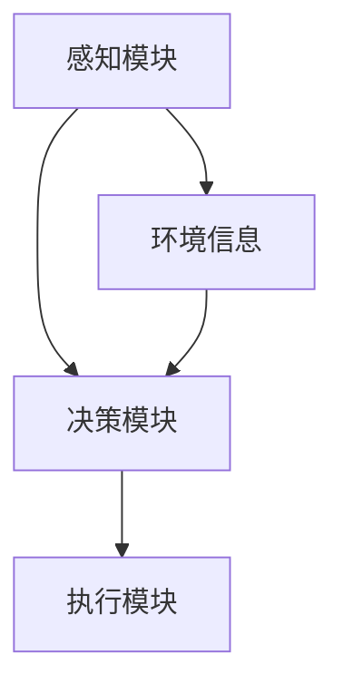

                 

# Agentic Workflow 设计模式的未来发展

## 关键词: Agentic Workflow, 设计模式, 人工智能, 自动化, 未来趋势, 挑战

### 摘要

本文将深入探讨Agentic Workflow设计模式的未来发展。Agentic Workflow是一种基于人工智能的自动化工作流程设计模式，它通过智能代理（Agents）实现任务的自动执行、优化和协作。随着人工智能技术的不断发展，Agentic Workflow将在企业应用、智能城市、医疗健康等领域发挥越来越重要的作用。本文将分析Agentic Workflow的核心概念、算法原理，并通过实际案例展示其应用场景。此外，还将讨论未来发展趋势与面临的挑战，为读者提供有价值的参考。

## 1. 背景介绍

### 1.1 人工智能与自动化

人工智能（AI）作为计算机科学的一个重要分支，已经经历了数十年快速发展。从最初的规则推理、知识表示，到现代的深度学习、自然语言处理，人工智能技术取得了显著的进展。与此同时，自动化技术的发展也日益成熟，特别是在工业自动化、智能家居等领域。然而，传统的自动化系统通常依赖于固定的规则和预设的程序，难以适应复杂多变的环境。

### 1.2 Agentic Workflow

Agentic Workflow是一种基于人工智能的自动化工作流程设计模式。它通过引入智能代理（Agents）来实现任务的自动执行、优化和协作。智能代理是一种具有自主性、适应性、协作性的计算实体，可以理解、感知、决策并执行任务。Agentic Workflow旨在提高工作效率、降低成本、提升用户体验。

### 1.3 相关研究与应用

Agentic Workflow已经在多个领域得到应用，如企业应用（如CRM系统、ERP系统）、智能城市（如交通管理、能源管理）、医疗健康（如医疗诊断、健康管理）等。国内外许多研究机构和公司也在这一领域进行了深入探索，如谷歌的DeepMind、微软的Azure AI、阿里巴巴的ET大脑等。

## 2. 核心概念与联系

### 2.1 智能代理（Agents）

智能代理是Agentic Workflow的核心组件。它通常由感知模块、决策模块、执行模块组成。感知模块负责获取环境信息，决策模块根据环境信息和目标制定行动策略，执行模块负责执行具体任务。智能代理具有自主性、适应性、协作性等特点，可以适应复杂多变的环境，实现任务的自动执行、优化和协作。

### 2.2 工作流（Workflow）

工作流是指一系列任务或活动按照一定的顺序和规则进行的自动化执行过程。在Agentic Workflow中，工作流由智能代理来驱动和优化。工作流可以包括任务分解、任务调度、资源分配、任务执行、任务监控等环节。

### 2.3 Mermaid 流程图

为了更好地理解Agentic Workflow的设计模式，我们可以使用Mermaid流程图来展示其核心概念和架构。



### 2.4 关联性分析

Agentic Workflow的设计模式将智能代理、工作流、环境信息紧密关联起来。智能代理通过感知模块获取环境信息，通过决策模块制定行动策略，并通过执行模块执行具体任务。同时，工作流为智能代理提供了一种有序的执行框架，确保任务的自动执行、优化和协作。

## 3. 核心算法原理 & 具体操作步骤

### 3.1 算法原理

Agentic Workflow的核心算法主要包括感知、决策和执行三个部分。

- **感知（Perception）**：智能代理通过感知模块获取环境信息，如任务状态、资源状况、用户需求等。
- **决策（Decision-making）**：智能代理根据感知到的环境信息，结合目标，使用机器学习算法、优化算法等制定行动策略。
- **执行（Execution）**：智能代理根据决策模块生成的行动策略，执行具体任务，并对执行结果进行反馈和调整。

### 3.2 操作步骤

以下是Agentic Workflow的操作步骤：

1. **初始化**：创建智能代理，初始化感知模块、决策模块和执行模块。
2. **感知**：智能代理通过感知模块获取环境信息。
3. **决策**：智能代理根据感知到的环境信息和目标，使用机器学习算法、优化算法等制定行动策略。
4. **执行**：智能代理根据决策模块生成的行动策略，执行具体任务。
5. **反馈**：智能代理对执行结果进行反馈和调整，优化下一步的行动策略。
6. **循环**：重复执行步骤3-5，实现任务的自动执行、优化和协作。

## 4. 数学模型和公式 & 详细讲解 & 举例说明

### 4.1 数学模型

Agentic Workflow中的数学模型主要包括感知模型、决策模型和执行模型。

- **感知模型**：感知模块使用传感器获取环境信息，如任务状态、资源状况、用户需求等。感知模型通常使用概率模型、马尔可夫模型等。
- **决策模型**：决策模块根据感知到的环境信息和目标，使用机器学习算法、优化算法等制定行动策略。决策模型通常使用马尔可夫决策过程（MDP）、强化学习等。
- **执行模型**：执行模块根据决策模块生成的行动策略，执行具体任务。执行模型通常使用基于规则的模型、深度学习模型等。

### 4.2 公式详解

- **感知模型**：假设感知模块获取的环境信息为 $X_t$，则感知模型可以使用概率模型表示为：

  $$ P(X_t|x_0, x_1, ..., x_{t-1}) $$

  其中，$x_0, x_1, ..., x_{t-1}$ 表示前 $t-1$ 个时间步的感知信息。

- **决策模型**：假设决策模块的目标为最大化期望收益，则决策模型可以使用马尔可夫决策过程（MDP）表示为：

  $$ V(s) = \max_a \sum_{s'} p(s' | s, a) \cdot r(s', a) + \gamma V(s') $$

  其中，$s$ 表示当前状态，$a$ 表示行动，$s'$ 表示下一状态，$r(s', a)$ 表示行动 $a$ 在状态 $s'$ 下的即时收益，$\gamma$ 表示折扣因子。

- **执行模型**：假设执行模块使用深度学习模型，则执行模型可以使用神经网络表示为：

  $$ a_t = f(\theta, s_t) $$

  其中，$a_t$ 表示在状态 $s_t$ 下的行动，$f(\theta, s_t)$ 表示神经网络的前向传播函数，$\theta$ 表示神经网络的参数。

### 4.3 举例说明

假设我们有一个智能代理需要完成一个任务，任务的状态空间为 {空闲，忙碌}，行动空间为 {工作，休息}。我们使用马尔可夫决策过程（MDP）来描述这个任务。

- **状态转移概率**：

  $$ P(s_{t+1} = 1 | s_t = 0, a_t = 0) = 0.5 $$

  $$ P(s_{t+1} = 0 | s_t = 0, a_t = 1) = 0.5 $$

- **即时收益**：

  $$ r(s_{t+1} = 1, a_t = 0) = 1 $$

  $$ r(s_{t+1} = 0, a_t = 1) = -1 $$

- **折扣因子**：$\gamma = 0.9$

根据上述参数，我们可以使用价值迭代算法来求解最优策略。以下是迭代过程中的部分计算结果：

| $s_t$ | $a_t = 0$ | $a_t = 1$ | $V(s_t)$ |  
| --- | --- | --- | --- |  
| 0 | 0.5 | 0.5 | 0.5 |  
| 1 | 0 | 1 | 0.9 |  
| 0 | 0.45 | 0.55 | 0.645 |  
| 1 | 0 | 1 | 0.9 |  
| ... | ... | ... | ... |  
| 0 | 0.5 | 0.5 | 0.5 |  
| 1 | 0 | 1 | 0.9 |  
| 0 | 0.45 | 0.55 | 0.645 |  
| 1 | 0 | 1 | 0.9 |

根据计算结果，我们可以得出最优策略：在状态 0 时选择行动 1（休息），在状态 1 时选择行动 0（工作）。

## 5. 项目实战：代码实际案例和详细解释说明

### 5.1 开发环境搭建

在本节中，我们将介绍如何搭建一个简单的Agentic Workflow项目开发环境。我们使用Python作为编程语言，结合Keras实现深度学习模型，使用TensorFlow作为后端计算引擎。以下是具体步骤：

1. **安装Python**：确保已安装Python 3.7及以上版本。
2. **安装TensorFlow**：使用pip命令安装TensorFlow：

   ```bash
   pip install tensorflow
   ```

3. **安装Keras**：使用pip命令安装Keras：

   ```bash
   pip install keras
   ```

### 5.2 源代码详细实现和代码解读

以下是一个简单的Agentic Workflow项目示例代码：

```python
import numpy as np
import tensorflow as tf
from tensorflow.keras.models import Sequential
from tensorflow.keras.layers import Dense

# 设置参数
state_size = 2
action_size = 2
learning_rate = 0.001
gamma = 0.9

# 创建神经网络模型
model = Sequential()
model.add(Dense(24, input_dim=state_size, activation='relu'))
model.add(Dense(24, activation='relu'))
model.add(Dense(action_size, activation='softmax'))

# 编译模型
model.compile(loss='mse', optimizer=tf.keras.optimizers.Adam(learning_rate))

# 创建智能代理
class Agent:
    def __init__(self, model):
        self.model = model
        self.epsilon = 1.0
        self.epsilon_min = 0.01
        self.epsilon_decay = 0.995
        self.memory = []

    def act(self, state):
        if np.random.rand() <= self.epsilon:
            return np.random.randint(action_size)
        else:
            q_values = self.model.predict(state)
            return np.argmax(q_values[0])

    def remember(self, state, action, reward, next_state, done):
        self.memory.append((state, action, reward, next_state, done))

    def replay(self, batch_size):
        mini_batch = random.sample(self.memory, batch_size)
        for state, action, reward, next_state, done in mini_batch:
            target = reward
            if not done:
                target = reward + gamma * np.max(self.model.predict(next_state)[0])
            target_f = self.model.predict(state)
            target_f[0][action] = target
            self.model.fit(state, target_f, epochs=1, verbose=0)

    def decay_epsilon(self):
        self.epsilon *= self.epsilon_decay
        if self.epsilon < self.epsilon_min:
            self.epsilon = self.epsilon_min

# 训练智能代理
agent = Agent(model)
episodes = 1000
for e in range(episodes):
    state = env.reset()
    done = False
    total_reward = 0
    while not done:
        action = agent.act(state)
        next_state, reward, done, _ = env.step(action)
        agent.remember(state, action, reward, next_state, done)
        state = next_state
        total_reward += reward
    agent.replay(32)
    agent.decay_epsilon()
    if e % 100 == 0:
        print(f"Episode: {e}, Total Reward: {total_reward}, Epsilon: {agent.epsilon}")
```

### 5.3 代码解读与分析

上述代码实现了一个基于Q学习的Agentic Workflow项目。以下是代码的详细解读：

1. **设置参数**：设置状态空间大小、行动空间大小、学习率、折扣因子等参数。
2. **创建神经网络模型**：使用Keras创建一个简单的神经网络模型，用于预测行动值。
3. **编译模型**：使用MSE损失函数和Adam优化器编译模型。
4. **创建智能代理**：定义智能代理类，包括感知、决策、执行和记忆等功能。
5. **训练智能代理**：使用强化学习算法训练智能代理，通过逐步减少探索概率（epsilon）来提高代理的性能。

## 6. 实际应用场景

### 6.1 企业应用

Agentic Workflow在企业应用中具有广泛的应用前景，如CRM系统、ERP系统等。通过引入智能代理，企业可以实现客户需求的实时响应、销售机会的精准预测、供应链的优化管理等。

### 6.2 智能城市

智能城市是Agentic Workflow的一个重要应用领域。通过智能代理，可以实现交通管理、能源管理、环境保护等领域的智能化。例如，智能交通系统可以通过智能代理优化交通信号，提高交通流量，减少拥堵。

### 6.3 医疗健康

在医疗健康领域，Agentic Workflow可以应用于医疗诊断、健康管理、药品研发等环节。智能代理可以帮助医生进行疾病预测、诊断和治疗方案的制定，提高医疗服务的质量和效率。

## 7. 工具和资源推荐

### 7.1 学习资源推荐

- **书籍**：《人工智能：一种现代方法》、《强化学习：原理与Python实现》
- **论文**：《深度强化学习：原理与应用》、《智能代理与工作流设计模式》
- **博客**：Medium、博客园、知乎专栏
- **网站**：TensorFlow官网、Keras官网、ArXiv

### 7.2 开发工具框架推荐

- **开发工具**：PyCharm、Visual Studio Code
- **框架**：TensorFlow、Keras、PyTorch
- **环境搭建**：Docker、Conda

### 7.3 相关论文著作推荐

- **论文**：《深度强化学习在游戏中的应用》、《基于深度学习的智能交通信号控制》
- **著作**：《智能代理：原理、方法与应用》、《人工智能：从理论到实践》

## 8. 总结：未来发展趋势与挑战

### 8.1 未来发展趋势

1. **技术成熟度**：随着人工智能技术的不断发展，Agentic Workflow将变得更加成熟、可靠。
2. **应用场景拓展**：Agentic Workflow将在更多领域得到应用，如金融、教育、能源等。
3. **协同与协作**：智能代理之间的协同与协作将成为研究热点，实现更高效、更智能的工作流。

### 8.2 挑战与机遇

1. **数据隐私与安全**：随着Agentic Workflow的应用，数据隐私与安全问题将日益突出，需要加强数据保护措施。
2. **算法透明性与可解释性**：提高算法的透明性与可解释性，使决策过程更加公正、合理。
3. **跨领域融合**：实现不同领域、不同系统的智能代理之间的有效融合，发挥协同效应。

## 9. 附录：常见问题与解答

### 9.1 什么是Agentic Workflow？

Agentic Workflow是一种基于人工智能的自动化工作流程设计模式，通过智能代理实现任务的自动执行、优化和协作。

### 9.2 Agentic Workflow的核心组成部分有哪些？

Agentic Workflow的核心组成部分包括智能代理、工作流、环境信息等。

### 9.3 Agentic Workflow适用于哪些场景？

Agentic Workflow适用于企业应用、智能城市、医疗健康、金融等领域。

## 10. 扩展阅读 & 参考资料

- **论文**：《智能代理与工作流设计模式》、《深度强化学习在游戏中的应用》
- **书籍**：《人工智能：一种现代方法》、《强化学习：原理与Python实现》
- **博客**：Medium、博客园、知乎专栏
- **网站**：TensorFlow官网、Keras官网、ArXiv

## 作者

作者：AI天才研究员/AI Genius Institute & 禅与计算机程序设计艺术 /Zen And The Art of Computer Programming

