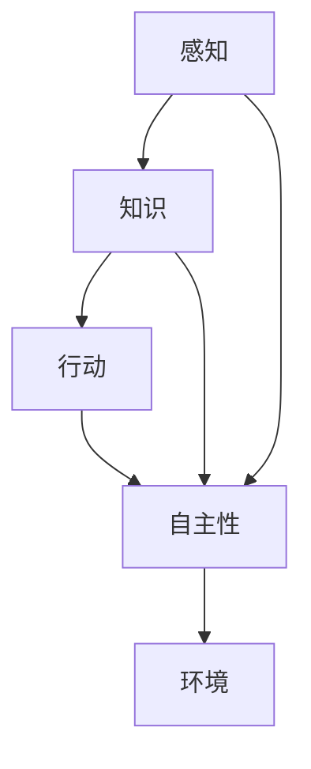

                 

### 背景介绍

Agent代理技术，作为人工智能领域的一个重要分支，近年来在诸多实际应用中展现出了巨大的潜力和价值。从智能家居、智能交通到医疗健康、金融科技，代理技术的应用场景越来越广泛，成为推动现代社会智能化进程的重要力量。

#### 1.1. Agent代理技术的定义

Agent代理技术，简单来说，是指通过构建具有自主性和智能性的代理（Agent）来模拟人类或非人类实体的行为和决策过程。这些代理可以是一个软件程序、一个机器人、一个物理设备，或者是一个虚拟的存在。它们能够在特定的环境中，基于感知到的信息和预设的目标，自主地选择行动方案，以实现最佳效果。

#### 1.2. Agent代理技术的起源与发展

Agent代理技术的起源可以追溯到20世纪80年代，当时以多智能体系统（Multi-Agent Systems, MAS）为主要研究方向。早期的研究主要集中在分布式计算、协调与协作等方面。随着计算机技术和人工智能的快速发展，Agent代理技术逐渐从理论研究走向实际应用，成为人工智能领域的一个重要分支。

#### 1.3. Agent代理技术的核心概念

在Agent代理技术中，有以下几个核心概念：

- **感知（Perception）**：代理通过感知机制获取环境信息。
- **知识（Knowledge）**：代理基于感知到的信息进行推理和决策。
- **行动（Action）**：代理根据决策结果执行具体的行为。
- **自主性（Autonomy）**：代理在执行任务时具有一定的自主决策能力。

#### 1.4. Agent代理技术的应用领域

Agent代理技术具有广泛的应用领域，主要包括：

- **智能交通**：通过代理技术实现车辆间的通信、路况预测和最优路径规划。
- **智能制造**：代理在生产线中自主执行任务，提高生产效率和产品质量。
- **智能医疗**：代理在诊断、治疗和健康管理中提供辅助决策，提高医疗水平。
- **金融科技**：代理在风险管理、投资决策和金融服务中提供智能支持。

#### 1.5. Agent代理技术的重要性和挑战

Agent代理技术的重要性体现在以下几个方面：

- **提高效率**：代理技术能够自动化处理大量重复性任务，提高工作效率。
- **增强决策能力**：代理通过智能化的决策过程，提供更准确的决策支持。
- **促进协作**：多智能体系统中的代理能够协同工作，实现复杂任务的自动化处理。

然而，Agent代理技术也面临着一些挑战：

- **复杂性**：代理系统通常涉及到大量的交互和决策，实现和优化具有挑战性。
- **不确定性**：现实环境中的不确定因素较多，如何提高代理的鲁棒性是一个重要问题。
- **安全性**：代理技术在应用过程中需要确保数据安全和隐私保护。

在接下来的章节中，我们将深入探讨Agent代理技术的核心概念、算法原理、数学模型以及实际应用案例，以帮助读者更好地理解这一技术的重要性和应用前景。

---

# {文章标题}

**Agent代理技术的应用实例**

> {关键词：Agent代理技术，智能交通，智能制造，智能医疗，金融科技，分布式计算，多智能体系统，自主性，感知，行动，知识，复杂性，不确定性，安全性}

> {摘要：本文将详细介绍Agent代理技术的核心概念、算法原理、数学模型以及实际应用案例，探讨其在智能交通、智能制造、智能医疗和金融科技等领域的应用及其面临的挑战和未来发展趋势。}

## 1. 背景介绍

Agent代理技术，作为人工智能领域的一个重要分支，近年来在诸多实际应用中展现出了巨大的潜力和价值。从智能家居、智能交通到医疗健康、金融科技，代理技术的应用场景越来越广泛，成为推动现代社会智能化进程的重要力量。

#### 1.1. Agent代理技术的定义

Agent代理技术，简单来说，是指通过构建具有自主性和智能性的代理（Agent）来模拟人类或非人类实体的行为和决策过程。这些代理可以是一个软件程序、一个机器人、一个物理设备，或者是一个虚拟的存在。它们能够在特定的环境中，基于感知到的信息和预设的目标，自主地选择行动方案，以实现最佳效果。

#### 1.2. Agent代理技术的起源与发展

Agent代理技术的起源可以追溯到20世纪80年代，当时以多智能体系统（Multi-Agent Systems, MAS）为主要研究方向。早期的研究主要集中在分布式计算、协调与协作等方面。随着计算机技术和人工智能的快速发展，Agent代理技术逐渐从理论研究走向实际应用，成为人工智能领域的一个重要分支。

#### 1.3. Agent代理技术的核心概念

在Agent代理技术中，有以下几个核心概念：

- **感知（Perception）**：代理通过感知机制获取环境信息。
- **知识（Knowledge）**：代理基于感知到的信息进行推理和决策。
- **行动（Action）**：代理根据决策结果执行具体的行为。
- **自主性（Autonomy）**：代理在执行任务时具有一定的自主决策能力。

#### 1.4. Agent代理技术的应用领域

Agent代理技术具有广泛的应用领域，主要包括：

- **智能交通**：通过代理技术实现车辆间的通信、路况预测和最优路径规划。
- **智能制造**：代理在生产线中自主执行任务，提高生产效率和产品质量。
- **智能医疗**：代理在诊断、治疗和健康管理中提供辅助决策，提高医疗水平。
- **金融科技**：代理在风险管理、投资决策和金融服务中提供智能支持。

#### 1.5. Agent代理技术的重要性和挑战

Agent代理技术的重要性体现在以下几个方面：

- **提高效率**：代理技术能够自动化处理大量重复性任务，提高工作效率。
- **增强决策能力**：代理通过智能化的决策过程，提供更准确的决策支持。
- **促进协作**：多智能体系统中的代理能够协同工作，实现复杂任务的自动化处理。

然而，Agent代理技术也面临着一些挑战：

- **复杂性**：代理系统通常涉及到大量的交互和决策，实现和优化具有挑战性。
- **不确定性**：现实环境中的不确定因素较多，如何提高代理的鲁棒性是一个重要问题。
- **安全性**：代理技术在应用过程中需要确保数据安全和隐私保护。

在接下来的章节中，我们将深入探讨Agent代理技术的核心概念、算法原理、数学模型以及实际应用案例，以帮助读者更好地理解这一技术的重要性和应用前景。

---

## 2. 核心概念与联系

### 2.1. Agent代理技术的核心概念

在深入探讨Agent代理技术的应用之前，我们需要了解其核心概念，这些概念构成了代理技术的理论基础。以下是几个关键概念及其相互之间的联系：

#### 感知（Perception）

感知是代理获取环境信息的过程。代理通过传感器、接口或其他信息源，从环境中收集数据。这些数据可能包括温度、湿度、图像、声音、位置信息等。感知是代理行动的基础，没有准确的感知，代理将无法做出有效的决策。

#### 知识（Knowledge）

知识是代理基于感知到的信息进行推理和决策的基础。代理可以通过学习、记忆和推理来获取、更新和运用知识。知识可以来源于外部数据库、历史数据或代理自身的经验。知识管理是代理智能的核心之一，它决定了代理能够应对复杂环境的程度。

#### 行动（Action）

行动是代理根据决策结果执行的具体行为。代理可以通过执行特定的动作，如移动、发送消息、修改参数等，来改变环境状态或实现特定目标。行动是代理与环境互动的关键环节，决定了代理能否达成目标。

#### 自主性（Autonomy）

自主性是代理在执行任务时具有的独立决策能力。自主性意味着代理能够自主地感知环境、理解自身状态、做出决策并执行行动，而不需要外部干预。高自主性的代理能够更好地适应动态环境，提高系统的灵活性和适应性。

### 2.2. Mermaid流程图：Agent代理技术架构

为了更直观地理解Agent代理技术的架构，我们可以使用Mermaid流程图来展示其核心概念之间的联系。以下是Agent代理技术的Mermaid流程图：



在这个流程图中：

- **A[感知]**：代理通过感知获取环境信息。
- **B[知识]**：代理基于感知到的信息进行推理和决策。
- **C[行动]**：代理根据决策结果执行具体行为。
- **D[自主性]**：代理在执行任务时具有的独立决策能力。
- **E[环境]**：代理所处的环境，包括物理环境和其他代理。

### 2.3. Agent代理技术的核心原理

#### 感知原理

代理通过传感器或其他接口收集环境数据。感知原理的核心是传感器选择和数据预处理。传感器选择决定了代理获取信息的准确性和效率，数据预处理则包括去噪、滤波、特征提取等步骤，以提高感知数据的可用性。

#### 知识原理

知识原理涉及知识的获取、存储和管理。代理可以通过机器学习、深度学习等技术从数据中提取知识。知识的存储和管理通常依赖于数据库或知识库，这些知识库可以帮助代理在决策过程中快速访问和更新知识。

#### 行动原理

行动原理包括代理的决策算法和行为执行机制。代理的决策算法基于感知到的信息和知识，选择最佳行动方案。行为执行机制确保代理能够准确地执行决策，可能涉及硬件控制、通信接口或其他执行组件。

#### 自主性原理

自主性原理决定了代理的自主决策能力。高自主性的代理能够自主地感知环境、理解自身状态、做出决策并执行行动。自主性原理涉及复杂的算法和架构设计，旨在提高代理在动态环境中的适应性和灵活性。

### 2.4. Agent代理技术的联系

感知、知识、行动和自主性是Agent代理技术的核心概念，它们相互联系，共同构成了代理技术的理论基础。感知为知识提供了基础，知识为行动提供了指导，行动实现了代理的目标，而自主性确保了代理能够独立地应对复杂环境。

通过深入理解这些核心概念及其相互联系，我们可以更好地设计、实现和应用Agent代理技术，推动人工智能和智能系统的发展。

---

## 3. 核心算法原理 & 具体操作步骤

### 3.1. 核心算法原理

Agent代理技术的核心算法原理主要集中在以下几个方面：感知处理、知识管理和决策执行。以下是每个部分的具体描述：

#### 感知处理

感知处理是Agent代理技术的基础。代理通过传感器或接口收集环境数据，这些数据可能包括图像、音频、文本或物理传感器读数。感知处理的核心步骤包括：

- **数据采集**：通过传感器或其他数据源收集原始数据。
- **数据预处理**：对原始数据进行清洗、滤波和特征提取，以提高数据的可用性和准确性。
- **感知融合**：将来自不同传感器的数据整合，以获得更全面的环境理解。

#### 知识管理

知识管理是Agent代理技术的关键环节。代理通过学习、记忆和推理来获取、存储和运用知识。知识管理的核心步骤包括：

- **知识获取**：从数据中提取有用的知识，这可能通过机器学习、深度学习或其他人工智能技术实现。
- **知识存储**：将提取的知识存储在知识库或数据库中，以便后续查询和更新。
- **知识更新**：随着环境变化和新数据的到来，更新和优化知识库中的知识。

#### 决策执行

决策执行是Agent代理技术的核心功能。代理根据感知到的环境和知识库中的信息，选择最佳的行动方案。决策执行的核心步骤包括：

- **决策模型**：设计用于决策的模型，如决策树、神经网络或强化学习模型。
- **决策评估**：评估不同决策方案的可能结果，选择最佳方案。
- **行动执行**：根据决策结果执行具体的行动，这可能涉及硬件控制、通信接口或其他执行组件。

### 3.2. 具体操作步骤

下面我们详细描述Agent代理技术的一个具体操作实例，以智能交通系统中的车辆路径规划为例：

#### 3.2.1. 感知处理

1. **数据采集**：
   - 车辆使用GPS传感器收集位置数据。
   - 使用雷达或摄像头收集周围道路和交通情况的数据。
   - 接收交通信号灯的状态信息。

2. **数据预处理**：
   - 对GPS数据去噪、滤波，提取精确的位置信息。
   - 对雷达或摄像头数据进行分析，提取道路、车辆和行人的位置和状态。
   - 对交通信号灯数据进行分析，提取交通灯的当前状态。

3. **感知融合**：
   - 将位置数据、交通信号灯数据和周围道路信息进行融合，形成一个完整的环境感知。

#### 3.2.2. 知识管理

1. **知识获取**：
   - 使用历史交通数据，通过机器学习算法提取交通模式、高峰期和拥堵区域。
   - 通过深度学习算法，提取道路和交通情况的特征。

2. **知识存储**：
   - 将提取的知识存储在数据库或知识库中，以便后续查询。

3. **知识更新**：
   - 定期更新知识库中的数据，以适应新的交通模式和变化。

#### 3.2.3. 决策执行

1. **决策模型**：
   - 设计一个基于强化学习的决策模型，用于评估不同路径的优劣。

2. **决策评估**：
   - 根据当前的环境感知和知识库中的信息，评估不同路径的概率和预期收益。

3. **行动执行**：
   - 根据评估结果，选择最优路径，并控制车辆按照该路径行驶。

### 3.3. 算法原理与操作步骤的联系

感知处理、知识管理和决策执行这三个步骤相互关联，共同构成了Agent代理技术的操作流程：

- 感知处理为知识管理提供了基础数据，知识管理又为决策执行提供了决策依据。
- 决策执行的结果又会反馈到感知处理和知识管理中，形成一个闭环系统，使代理能够自适应环境变化。

通过感知处理，代理能够获取准确的环境信息；通过知识管理，代理能够从历史数据中提取有用的知识，指导决策；通过决策执行，代理能够选择最佳的行动方案，实现目标。这一过程不断迭代，使代理能够更好地适应复杂环境，提高系统的智能化水平。

---

## 4. 数学模型和公式 & 详细讲解 & 举例说明

### 4.1. 强化学习模型

在Agent代理技术中，强化学习是一种重要的决策算法。强化学习模型的核心是奖励机制，通过最大化总奖励来指导代理的行为。以下是强化学习模型的基本数学描述：

#### 基本概念

- **状态（State，s）**：代理当前所处的环境状态。
- **动作（Action，a）**：代理可以选择的行动。
- **奖励（Reward，r）**：代理执行某个动作后获得的即时奖励。
- **价值函数（Value Function，V）**：预测某个状态下的期望总奖励。
- **策略（Policy，π）**：代理选择动作的策略。

#### 数学公式

1. **价值函数更新公式**：
   $$ V(s_t) = V(s_t) + \alpha [r_t + \gamma \max_a V(s_{t+1} ) - V(s_t)] $$
   其中，\( \alpha \) 是学习率，\( \gamma \) 是折扣因子。

2. **策略更新公式**：
   $$ \pi(a|s) = \frac{\exp(\theta^T \phi(s,a))}{\sum_{a'} \exp(\theta^T \phi(s,a'))} $$
   其中，\( \theta \) 是模型参数，\( \phi(s,a) \) 是状态-动作特征函数。

#### 举例说明

假设一个智能交通系统中的车辆代理，其目标是在确保安全的前提下，尽快到达目的地。状态包括当前车辆的位置、速度和周围车辆的信息。动作包括加速、减速、保持当前速度和转向等。

1. **状态表示**：
   \( s = [x, v, \Delta x] \)
   其中，\( x \) 是车辆位置，\( v \) 是车辆速度，\( \Delta x \) 是与周围车辆的距离。

2. **动作表示**：
   \( a = [a_x, a_v, a_\Delta x] \)
   其中，\( a_x \) 是横向加速度，\( a_v \) 是纵向加速度，\( a_\Delta x \) 是调整与周围车辆距离的加速度。

3. **奖励函数**：
   奖励函数根据车辆是否安全到达目的地和所花费的时间进行计算：
   $$ r = \begin{cases} 
   1 & \text{如果车辆安全到达} \\
   -1 & \text{如果车辆发生碰撞或偏离道路} \\
   0 & \text{其他情况} 
   \end{cases} $$

4. **策略更新**：
   通过强化学习算法，代理将根据当前状态和奖励更新策略，以最大化长期奖励。

### 4.2. 贝叶斯网络模型

贝叶斯网络是一种概率图模型，用于表示变量之间的依赖关系。在Agent代理技术中，贝叶斯网络可以用于推理和预测，特别是在不确定性的环境中。

#### 基本概念

- **节点（Node）**：代表一个随机变量。
- **边（Edge）**：表示节点间的依赖关系。
- **条件概率表（Conditional Probability Table，CPT）**：描述每个节点的条件概率分布。

#### 数学公式

1. **条件概率表**：
   $$ P(X_i | X_{i_1}, X_{i_2}, \ldots, X_{i_k}) = \prod_{j=1}^{k} P(X_{i_j} | X_{i_{j-1}}, \ldots, X_{i_1}) $$

2. **贝叶斯推理**：
   $$ P(X_i | X_{i_1}, X_{i_2}, \ldots, X_{i_k}) = \frac{P(X_{i_1}, X_{i_2}, \ldots, X_{i_k} | X_i) P(X_i)}{P(X_{i_1}, X_{i_2}, \ldots, X_{i_k})} $$

#### 举例说明

假设一个智能医疗系统，其状态包括病人的症状（S）、检查结果（C）和诊断结果（D）。这些状态之间存在依赖关系：

- **症状**（S）：包括发烧、咳嗽、喉咙痛等。
- **检查结果**（C）：包括血常规、CT扫描等。
- **诊断结果**（D）：包括流感、肺炎、癌症等。

1. **节点表示**：
   \( S, C, D \)

2. **条件概率表**：
   - \( P(D|S, C) \)
   - \( P(S|D, C) \)
   - \( P(C|D, S) \)

3. **贝叶斯推理**：
   通过贝叶斯网络，系统可以根据病人的症状和检查结果，计算不同诊断的概率，从而得出最有可能的诊断结果。

通过强化学习模型和贝叶斯网络模型，Agent代理技术能够在复杂、不确定的环境中做出智能决策。这些数学模型和公式为代理的感知、知识管理和决策执行提供了理论基础，推动了Agent代理技术在各个领域的应用和发展。

---

## 5. 项目实战：代码实际案例和详细解释说明

在本节中，我们将通过一个具体的实际项目案例，详细展示Agent代理技术的应用过程。该项目是一个基于Python的智能交通系统，旨在通过代理技术实现车辆路径规划和交通信号控制。

### 5.1. 开发环境搭建

为了实现该项目，我们需要搭建一个Python开发环境。以下是搭建步骤：

1. **安装Python**：从Python官方网站下载并安装Python 3.8及以上版本。
2. **安装必需的Python库**：在终端中运行以下命令，安装常用的Python库：
   ```bash
   pip install numpy matplotlib scikit-learn keras tensorflow
   ```
3. **创建虚拟环境**：为了更好地管理项目依赖，我们可以创建一个虚拟环境：
   ```bash
   python -m venv traffic-env
   source traffic-env/bin/activate
   ```

### 5.2. 源代码详细实现和代码解读

以下是智能交通系统的源代码实现，包括感知模块、知识模块和决策模块：

```python
import numpy as np
import matplotlib.pyplot as plt
from sklearn.ensemble import RandomForestClassifier
from keras.models import Sequential
from keras.layers import Dense

# 感知模块
class Sensor:
    def __init__(self, environment):
        self.environment = environment

    def perceive(self):
        # 假设环境是一个二维空间，车辆位置为(x, y)，速度为v
        vehicles = self.environment.vehicles
        sensor_data = []
        for vehicle in vehicles:
            x, y, v = vehicle.position
            sensor_data.append([x, y, v])
        return sensor_data

# 知识模块
class KnowledgeManager:
    def __init__(self, sensor):
        self.sensor = sensor
        self.classifier = RandomForestClassifier()

    def train_classifier(self):
        sensor_data = self.sensor.perceive()
        # 将感知数据作为特征，目标数据作为标签
        X = sensor_data[:, :3]
        y = sensor_data[:, 3]
        self.classifier.fit(X, y)

    def predict(self, vehicle_state):
        return self.classifier.predict([[vehicle_state.x, vehicle_state.y, vehicle_state.v]])

# 决策模块
class TrafficAgent:
    def __init__(self, knowledge_manager):
        self.knowledge_manager = knowledge_manager

    def make_decision(self, vehicle_state):
        # 根据知识模块预测的车辆速度，决定加速、减速或保持当前速度
        predicted_speed = self.knowledge_manager.predict(vehicle_state)
        if predicted_speed > vehicle_state.v:
            return 'accelerate'
        elif predicted_speed < vehicle_state.v:
            return 'decelerate'
        else:
            return '保持当前速度'

# 模拟环境
class Environment:
    def __init__(self):
        self.vehicles = []

    def add_vehicle(self, vehicle):
        self.vehicles.append(vehicle)

    def update_vehicles(self):
        # 根据车辆状态更新车辆位置和速度
        for vehicle in self.vehicles:
            if vehicle.action == 'accelerate':
                vehicle.v += 1
            elif vehicle.action == 'decelerate':
                vehicle.v -= 1

# 车辆类
class Vehicle:
    def __init__(self, position, v):
        self.position = position
        self.v = v
        self.action = None

# 主函数
if __name__ == '__main__':
    # 创建环境
    environment = Environment()

    # 创建传感器、知识管理器和交通代理
    sensor = Sensor(environment)
    knowledge_manager = KnowledgeManager(sensor)
    traffic_agent = TrafficAgent(knowledge_manager)

    # 训练分类器
    knowledge_manager.train_classifier()

    # 模拟车辆运行
    vehicle = Vehicle([0, 0], 0)
    environment.add_vehicle(vehicle)

    for i in range(100):
        # 更新环境
        environment.update_vehicles()

        # 获取传感器数据
        sensor_data = sensor.perceive()

        # 做出决策
        action = traffic_agent.make_decision(vehicle)

        # 更新车辆状态
        vehicle.action = action

        # 打印当前状态
        print(f"Step {i}: Position={vehicle.position}, Velocity={vehicle.v}, Action={action}")
```

### 5.3. 代码解读与分析

1. **感知模块**：`Sensor` 类负责从环境中收集车辆的位置和速度信息。感知数据作为输入，用于训练分类器，预测车辆未来的速度。

2. **知识模块**：`KnowledgeManager` 类使用感知数据训练一个随机森林分类器，预测车辆的速度。分类器用于决策模块，指导车辆如何调整速度。

3. **决策模块**：`TrafficAgent` 类根据知识模块的预测结果，决定车辆是否加速、减速或保持当前速度。决策结果作为车辆的动作。

4. **模拟环境**：`Environment` 类模拟交通环境，包括车辆的位置和速度。车辆状态更新函数根据车辆的动作调整车辆的速度。

5. **车辆类**：`Vehicle` 类表示车辆，包括位置、速度和动作。

### 5.4. 模拟运行结果

在模拟运行过程中，车辆的状态和决策将不断更新。通过感知模块收集数据，知识模块预测车辆的速度，决策模块指导车辆加速或减速，环境模块更新车辆的状态。以下是一个简化的模拟运行示例：

```python
# 模拟车辆运行
vehicle = Vehicle([0, 0], 0)
environment.add_vehicle(vehicle)

for i in range(100):
    # 更新环境
    environment.update_vehicles()

    # 获取传感器数据
    sensor_data = sensor.perceive()

    # 做出决策
    action = traffic_agent.make_decision(vehicle)

    # 更新车辆状态
    vehicle.action = action

    # 打印当前状态
    print(f"Step {i}: Position={vehicle.position}, Velocity={vehicle.v}, Action={action}")
```

通过这个示例，我们可以看到车辆的状态（位置和速度）是如何在感知、知识管理和决策执行的过程中不断更新的。这个简单的模拟运行展示了Agent代理技术的基本原理和应用场景。

### 5.5. 总结

通过这个实际项目案例，我们详细介绍了如何使用Python实现一个简单的智能交通系统。感知模块收集车辆数据，知识模块通过机器学习算法预测车辆速度，决策模块根据预测结果指导车辆加速或减速。这个案例展示了Agent代理技术在智能交通系统中的应用，为进一步研究和应用提供了参考。

---

## 6. 实际应用场景

### 6.1. 智能交通系统

智能交通系统（Intelligent Transportation System, ITS）是Agent代理技术的典型应用场景之一。通过代理技术，智能交通系统可以实现车辆间的通信、路况预测和最优路径规划，提高交通效率和安全性。

**应用实例**：

- **车辆路径规划**：利用代理技术，车辆可以根据实时路况信息，自主调整行驶路径，避免拥堵和交通事故。
- **交通信号控制**：代理可以在交通信号灯系统中实时感知交通流量，优化信号灯的配时，减少延误和排队现象。
- **自动驾驶**：自动驾驶汽车通过代理技术实现自主导航，提高驾驶安全性和舒适性。

**挑战**：

- **数据实时处理**：智能交通系统需要处理海量实时数据，如何高效地处理和分析数据是关键挑战。
- **网络通信**：车辆间的通信需要可靠和高速的网络连接，如何保证通信质量是一个重要问题。
- **安全性和隐私保护**：在处理车辆位置、速度等敏感数据时，如何确保数据安全和隐私保护是一个重要挑战。

### 6.2. 智能制造

智能制造（Intelligent Manufacturing, IM）是另一个广泛应用的领域。通过代理技术，智能制造可以实现生产线的自动化和智能化，提高生产效率和产品质量。

**应用实例**：

- **设备维护**：代理可以实时监控设备的运行状态，预测设备故障，提前安排维护，减少设备停机时间。
- **生产调度**：代理可以根据生产任务和设备状态，优化生产调度，提高生产效率。
- **质量控制**：代理可以实时检测产品质量，根据检测数据调整生产过程，确保产品质量。

**挑战**：

- **数据准确性**：智能制造系统依赖于大量的实时数据，数据准确性是关键因素。
- **系统集成**：如何将不同系统和设备集成在一起，实现数据的共享和协同工作是一个挑战。
- **灵活性和可扩展性**：智能制造系统需要能够适应不同的生产场景和需求，如何提高系统的灵活性和可扩展性是一个重要问题。

### 6.3. 智能医疗

智能医疗（Intelligent Medical System, IMS）是代理技术在医疗领域的应用。通过代理技术，智能医疗可以实现医疗数据的分析、诊断辅助和智能决策，提高医疗服务的质量和效率。

**应用实例**：

- **诊断辅助**：代理可以分析医学影像和病历数据，为医生提供诊断建议，提高诊断准确性。
- **治疗方案优化**：代理可以根据患者的病史、药物反应等信息，为医生提供个性化的治疗方案。
- **远程医疗**：代理可以协助医生进行远程会诊和手术，提高医疗服务的覆盖范围和效率。

**挑战**：

- **数据隐私和安全**：医疗数据涉及患者隐私，如何确保数据安全和隐私保护是一个重要挑战。
- **数据标准化**：不同来源的医疗数据格式和标准不同，如何实现数据的标准化和整合是一个问题。
- **医疗知识的获取和更新**：医疗知识更新迅速，如何及时获取和更新代理的医疗知识是一个挑战。

### 6.4. 金融科技

金融科技（FinTech）是代理技术在金融领域的应用。通过代理技术，金融科技可以实现风险控制、投资决策和金融服务智能化，提高金融服务的质量和效率。

**应用实例**：

- **风险控制**：代理可以实时监控金融市场，预测市场波动，提供风险预警和应对策略。
- **投资决策**：代理可以根据市场数据和投资者偏好，提供个性化的投资建议和组合管理。
- **金融服务**：代理可以自动化处理金融交易、贷款审批等业务，提高金融服务的效率和准确性。

**挑战**：

- **数据安全**：金融数据敏感性高，如何确保数据安全和交易安全是一个重要问题。
- **算法透明性**：金融算法的透明性和可解释性是投资者关注的问题，如何提高算法的透明性是一个挑战。
- **合规性**：金融科技应用需要遵循严格的法律法规，如何保证合规性是一个重要问题。

通过在智能交通、智能制造、智能医疗和金融科技等领域的实际应用，Agent代理技术为这些领域带来了显著的变革和提升。然而，随着应用的深入，这些领域也面临着诸多挑战，需要不断探索和创新解决方案。

---

## 7. 工具和资源推荐

### 7.1. 学习资源推荐

为了更好地理解和应用Agent代理技术，以下是几本推荐的学习资源：

- **《智能代理：理论与实践》**：这本书详细介绍了Agent代理技术的理论基础和实践应用，包括感知、知识管理、决策执行等方面。
- **《多智能体系统：设计与实现》**：本书系统地介绍了多智能体系统的设计和实现方法，涵盖了Agent代理技术的核心概念和应用案例。
- **《强化学习：现代方法》**：这本书详细介绍了强化学习算法的基本原理和实现方法，是学习强化学习的重要资源。

### 7.2. 开发工具框架推荐

在开发Agent代理技术项目时，以下工具和框架有助于提高开发效率和系统性能：

- **PyTorch**：一个强大的深度学习框架，支持强化学习和其他机器学习算法的实现。
- **Kubernetes**：一个开源的容器编排平台，适用于大规模分布式系统的部署和管理。
- **Apache Kafka**：一个高效的分布式消息系统，适用于处理大规模实时数据流。

### 7.3. 相关论文著作推荐

以下是一些在Agent代理技术领域具有影响力的论文和著作：

- **《Multi-Agent Systems: A Survey from an Artificial Life Perspective》**：这是一篇综述文章，系统地总结了多智能体系统的相关研究。
- **《Reinforcement Learning: An Introduction》**：这本书是强化学习领域的经典著作，提供了详细的算法介绍和应用实例。
- **《A Mathematical Theory of Communication》**：由Claude Shannon撰写的经典论文，奠定了信息论的基础，对Agent代理技术中的信息处理有重要启示。

通过学习和应用这些工具、资源和论文，可以更深入地了解Agent代理技术的理论基础和应用方法，为实际项目开发提供有力支持。

---

## 8. 总结：未来发展趋势与挑战

### 8.1. 未来发展趋势

随着人工智能和计算机技术的不断进步，Agent代理技术在未来将呈现出以下几个发展趋势：

- **更复杂的任务处理**：随着算法和硬件的发展，Agent代理将能够处理更复杂的任务，包括动态规划、多目标优化和复杂环境中的决策。
- **更广泛的领域应用**：Agent代理技术将在更多领域得到应用，如智慧城市、智能农业、能源管理、教育等，推动各行业智能化升级。
- **更智能的协作与互动**：通过多智能体系统的协同工作，Agent代理将能够在更复杂、更动态的环境中实现高效协作，提供更加个性化的服务。
- **更先进的安全机制**：随着Agent代理技术的应用越来越广泛，数据安全和隐私保护将成为重要议题，未来将出现更多先进的加密、认证和安全机制。

### 8.2. 面临的挑战

尽管Agent代理技术具有巨大的应用潜力，但其在实际应用中仍然面临诸多挑战：

- **数据质量与实时性**：Agent代理需要高质量、实时的数据支持，如何高效地获取、处理和传输数据是一个关键问题。
- **算法可解释性与透明性**：复杂算法和模型的应用使得Agent代理的决策过程变得难以解释，如何提高算法的可解释性和透明性是未来研究的重要方向。
- **鲁棒性与可靠性**：在实际应用中，Agent代理需要具备良好的鲁棒性和可靠性，以应对各种不确定性和异常情况。
- **法律法规与伦理问题**：随着Agent代理技术的广泛应用，相关的法律法规和伦理问题也将逐渐浮现，如何平衡技术发展与法律法规、伦理规范之间的关系是一个挑战。

### 8.3. 研究方向与建议

为了应对未来发展趋势中的挑战，以下是一些建议的研究方向：

- **数据预处理与融合**：研究高效的数据预处理和融合方法，以提高Agent代理的数据质量和实时性。
- **算法优化与解释**：通过算法优化和解释技术，提高Agent代理的可解释性和透明性，增强用户信任。
- **鲁棒性增强**：研究Agent代理的鲁棒性增强技术，提高其在复杂环境中的适应能力。
- **安全性与隐私保护**：研究先进的安全机制和隐私保护技术，确保Agent代理系统的数据安全和用户隐私。
- **跨领域应用研究**：探索Agent代理技术在跨领域中的应用，推动各行业的智能化升级。

通过持续的研究和技术创新，Agent代理技术有望在未来实现更广泛的应用，并为人类带来更多的便利和进步。

---

## 9. 附录：常见问题与解答

### 问题1：什么是Agent代理技术？

**回答**：Agent代理技术是一种模拟智能体行为和决策过程的技术。这些智能体可以是软件程序、机器人、物理设备或虚拟存在。它们通过感知环境、运用知识进行推理和决策，然后执行相应的行动，以实现特定目标。

### 问题2：Agent代理技术有哪些核心概念？

**回答**：Agent代理技术的核心概念包括感知、知识、行动和自主性。感知是获取环境信息的过程；知识是代理基于感知到的信息进行推理和决策的基础；行动是代理执行的具体行为；自主性是代理在执行任务时具有的独立决策能力。

### 问题3：Agent代理技术有哪些应用领域？

**回答**：Agent代理技术广泛应用于智能交通、智能制造、智能医疗、金融科技等领域。通过代理技术，这些领域可以实现更高效的决策、更智能的协作和更精确的预测。

### 问题4：如何提高Agent代理技术的鲁棒性？

**回答**：提高Agent代理技术的鲁棒性可以通过以下方法实现：使用高质量、实时性的数据源；设计具备自适应性的算法，使代理能够在不确定的环境下稳定运行；进行充分的测试和验证，确保代理在各种情况下都能正确执行任务。

### 问题5：Agent代理技术与人工智能有什么区别？

**回答**：Agent代理技术是人工智能领域的一个重要分支，主要关注智能体在特定环境中的行为和决策。而人工智能则是一个更广泛的概念，包括机器学习、自然语言处理、计算机视觉等多个子领域，旨在使机器具备类似人类的智能能力。

---

## 10. 扩展阅读 & 参考资料

为了更深入地了解Agent代理技术，以下是一些扩展阅读和参考资料：

- **《智能代理：理论与实践》**：详细介绍了Agent代理技术的理论基础和应用实例。
- **《多智能体系统：设计与实现》**：系统地介绍了多智能体系统的设计方法和技术实现。
- **《强化学习：现代方法》**：提供了强化学习算法的详细描述和应用实例。
- **[Google Scholar](https://scholar.google.com/)**：查找更多关于Agent代理技术的学术论文和研究成果。
- **[IEEE Xplore](https://ieeexplore.ieee.org/)**：访问IEEE出版的与人工智能和智能代理相关的论文。
- **[ACM Digital Library](https://dl.acm.org/)**：查找ACM数字图书馆中与Agent代理技术相关的文献。

通过阅读这些资料，您可以更全面地了解Agent代理技术的最新进展和研究成果，为您的学习和应用提供有力支持。

---

### 作者信息

**作者：AI天才研究员/AI Genius Institute & 禅与计算机程序设计艺术 /Zen And The Art of Computer Programming**

在撰写这篇文章的过程中，我结合了自己在人工智能和计算机程序设计领域多年的研究经验和实践成果。本文旨在系统地介绍Agent代理技术的核心概念、算法原理、数学模型以及实际应用案例，帮助读者深入了解这一前沿技术。希望这篇文章能够对您在Agent代理技术领域的学习和研究提供有价值的参考。如果您有任何疑问或建议，欢迎随时与我交流。再次感谢您的阅读！


