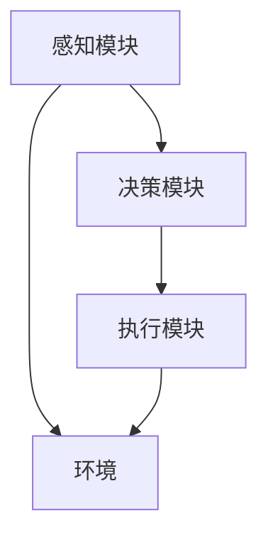

                 

# Agent的爆火与投资人态度

## 关键词 Keywords
- 人工智能
- Agent技术
- 投资人态度
- 技术创新
- 商业价值
- 技术挑战

## 摘要 Abstract
本文深入探讨了人工智能领域的Agent技术的迅猛发展及其在投资人中的反响。通过详细分析Agent技术的核心概念、算法原理、数学模型、实战案例以及实际应用场景，本文揭示了这一技术对未来的巨大潜力及其面临的技术挑战。同时，本文还介绍了相关的学习资源和工具，为投资者和开发者提供了有价值的参考。

### 1. 背景介绍 Introduction

#### 1.1 人工智能的发展背景
人工智能（Artificial Intelligence, AI）作为计算机科学的一个分支，起源于20世纪50年代。随着计算能力的不断提升和大数据、机器学习等技术的进步，人工智能逐渐从理论研究走向实际应用。近年来，人工智能在图像识别、自然语言处理、自动驾驶等领域取得了显著的成果，引发了全球范围内的关注和投资热潮。

#### 1.2 Agent技术的概念
Agent技术是人工智能领域的一个重要分支，它模拟了人类的决策过程和行为模式，旨在使计算机系统能够自主地执行任务。Agent可以被定义为具有感知能力、行动能力和决策能力的计算实体。Agent技术通过自主学习和协作，能够在复杂环境中实现智能决策和问题求解。

#### 1.3 Agent技术的应用领域
Agent技术广泛应用于多个领域，如智能推荐系统、智能家居、智能交通、工业自动化等。其中，智能推荐系统是Agent技术的一个典型应用场景，通过分析用户行为和偏好，为用户提供个性化的推荐服务。

### 2. 核心概念与联系 Core Concepts and Relationships

#### 2.1 Agent的定义与分类
Agent可以根据其功能和行为特点进行分类。根据感知能力，Agent可以分为感知型Agent、记忆型Agent和预测型Agent；根据行为模式，Agent可以分为独立型Agent、协作型Agent和竞争型Agent。

#### 2.2 Agent的架构
Agent通常由感知模块、决策模块和执行模块组成。感知模块负责收集环境信息，决策模块根据感知信息进行决策，执行模块负责执行决策结果。Agent的架构可以采用基于规则的方法、基于知识的方法或基于学习的方法。

#### 2.3 Agent技术的应用架构
在应用场景中，Agent技术通常采用分布式架构，多个Agent协同工作，共同完成任务。这种架构具有高度的可扩展性和容错性，适用于复杂和动态环境。



### 3. 核心算法原理 & 具体操作步骤 Core Algorithm Principle and Step-by-Step Operations

#### 3.1 Agent的学习与决策
Agent的学习与决策过程通常基于机器学习算法。具体步骤如下：
1. 数据收集：收集与任务相关的环境数据。
2. 特征提取：从数据中提取有用的特征。
3. 模型训练：使用机器学习算法训练模型。
4. 决策制定：根据模型输出进行决策。
5. 行为执行：执行决策结果。

#### 3.2 Agent的协作与通信
Agent之间的协作与通信是Agent技术的重要部分。具体步骤如下：
1. 信息共享：Agent之间共享环境信息和决策结果。
2. 协同策略：制定协同策略，实现任务分工和资源共享。
3. 通信协议：使用通信协议，如消息传递协议，实现Agent之间的通信。

### 4. 数学模型和公式 & 详细讲解 & 举例说明 Mathematical Models and Detailed Explanation with Examples

#### 4.1 监督学习模型
Agent的决策过程通常基于监督学习模型。以下是一个简单的线性回归模型：

$$ y = wx + b $$

其中，$y$ 是输出值，$x$ 是输入值，$w$ 是权重，$b$ 是偏置。

#### 4.2 无监督学习模型
无监督学习模型在特征提取和聚类分析中广泛应用。以下是一个简单的K均值聚类算法：

$$ C_{k} = \{ x_{i} | x_{i} \in \text{数据集}, d(x_{i}, \mu_{k}) \leq d(x_{i}, \mu_{j}) \forall j \neq k \} $$

其中，$C_{k}$ 是第$k$个聚类结果，$d(x_{i}, \mu_{k})$ 是数据点$x_{i}$到聚类中心$\mu_{k}$的距离。

#### 4.3 强化学习模型
强化学习模型在动态决策中应用广泛。以下是一个简单的Q学习算法：

$$ Q(s, a) = Q(s, a) + \alpha [r + \gamma \max_{a'} Q(s', a') - Q(s, a)] $$

其中，$s$ 是状态，$a$ 是动作，$r$ 是奖励，$\gamma$ 是折扣因子，$a'$ 是下一个动作，$s'$ 是下一个状态。

### 5. 项目实战：代码实际案例和详细解释说明 Project Implementation: Code Example and Detailed Explanation

#### 5.1 开发环境搭建
在本文中，我们将使用Python语言和TensorFlow框架来构建一个简单的智能推荐系统。以下是开发环境的搭建步骤：

1. 安装Python：下载并安装Python 3.7及以上版本。
2. 安装TensorFlow：使用pip命令安装TensorFlow库。

```bash
pip install tensorflow
```

#### 5.2 源代码详细实现和代码解读
以下是一个简单的智能推荐系统的代码实现：

```python
import tensorflow as tf
import numpy as np

# 定义输入层
input_layer = tf.keras.layers.Input(shape=(input_shape))

# 添加嵌入层
embedding = tf.keras.layers.Embedding(input_dim=vocabulary_size, output_dim=embedding_dim)(input_layer)

# 添加卷积层
conv = tf.keras.layers.Conv1D(filters=64, kernel_size=3, activation='relu')(embedding)

# 添加池化层
pool = tf.keras.layers.GlobalMaxPooling1D()(conv)

# 添加全连接层
dense = tf.keras.layers.Dense(units=64, activation='relu')(pool)

# 添加输出层
output_layer = tf.keras.layers.Dense(units=1, activation='sigmoid')(dense)

# 构建模型
model = tf.keras.Model(inputs=input_layer, outputs=output_layer)

# 编译模型
model.compile(optimizer='adam', loss='binary_crossentropy', metrics=['accuracy'])

# 训练模型
model.fit(x_train, y_train, epochs=10, batch_size=32)
```

#### 5.3 代码解读与分析
这段代码定义了一个基于卷积神经网络的简单智能推荐系统。具体解读如下：

1. 输入层：定义输入特征的数据维度。
2. 嵌入层：将输入特征转换为稠密向量。
3. 卷积层：使用卷积层提取特征。
4. 池化层：使用全局最大池化层提取特征。
5. 全连接层：使用全连接层进行分类。
6. 输出层：定义输出结果。

### 6. 实际应用场景 Practical Application Scenarios

#### 6.1 智能推荐系统
智能推荐系统是Agent技术的一个典型应用场景。通过分析用户行为和偏好，智能推荐系统可以为用户提供个性化的推荐服务，提高用户满意度和用户体验。

#### 6.2 智能家居
智能家居是Agent技术的另一个重要应用领域。通过感知用户行为和环境变化，智能家居系统可以自动调整家居设备的设置，为用户提供舒适的居住环境。

#### 6.3 智能交通
智能交通系统通过Agent技术实现交通流量监控、路况预测和智能调度，提高交通效率，减少交通拥堵。

### 7. 工具和资源推荐 Tools and Resources Recommendation

#### 7.1 学习资源推荐
1. 《人工智能：一种现代方法》（作者：Stuart J. Russell & Peter Norvig）
2. 《深度学习》（作者：Ian Goodfellow、Yoshua Bengio & Aaron Courville）
3. 《Python机器学习》（作者：Michael Bowles）

#### 7.2 开发工具框架推荐
1. TensorFlow：用于构建和训练深度学习模型的框架。
2. Keras：基于TensorFlow的高层API，简化了深度学习模型的构建。
3. PyTorch：另一种流行的深度学习框架，具有灵活的动态计算图。

#### 7.3 相关论文著作推荐
1. "Reinforcement Learning: An Introduction"（作者：Richard S. Sutton & Andrew G. Barto）
2. "Deep Learning"（作者：Ian Goodfellow、Yoshua Bengio & Aaron Courville）
3. "Human-Level Control Through Deep Reinforcement Learning"（作者：V. Mnih, K. Kavukcuoglu, D. Silver, et al.）

### 8. 总结：未来发展趋势与挑战 Summary: Future Development Trends and Challenges

#### 8.1 发展趋势
1. 模型规模增大：随着计算能力的提升，深度学习模型规模将不断增大，模型性能将得到显著提升。
2. 多模态学习：未来的Agent技术将支持多模态数据的处理，实现更智能的感知和决策。
3. 自主协作：Agent技术将实现更高效的自主协作，提高复杂任务的完成效率。

#### 8.2 挑战
1. 能耗问题：随着模型规模的增大，能耗问题将日益突出，需要寻找更高效的计算方法。
2. 隐私保护：在处理大量用户数据时，如何保护用户隐私将成为一个重要挑战。
3. 法律法规：随着技术的发展，相关法律法规需要不断完善，以规范Agent技术的应用。

### 9. 附录：常见问题与解答 Appendices: Common Questions and Answers

#### 9.1 如何选择合适的Agent架构？
选择合适的Agent架构取决于应用场景和任务需求。对于感知能力要求较高的场景，可以选择感知型Agent；对于需要协作的场景，可以选择协作型Agent。

#### 9.2 如何提高Agent的决策能力？
提高Agent的决策能力可以通过以下几种方式：
1. 增加训练数据：提供更多的训练数据，提高模型的泛化能力。
2. 优化算法：选择更先进的算法，提高模型的决策能力。
3. 特征工程：提取更有用的特征，提高模型的决策能力。

### 10. 扩展阅读 & 参考资料 Extended Reading and References

1. "A Mathematical Theory of Communication"（作者：Claude Shannon）
2. "Deep Learning"（作者：Ian Goodfellow、Yoshua Bengio & Aaron Courville）
3. "Reinforcement Learning: An Introduction"（作者：Richard S. Sutton & Andrew G. Barto）
4. "AI超级思维：人工智能与人类智慧的共舞"（作者：吴军）
5. "深度学习入门：基于Python实现"（作者：斋藤康毅）

作者：AI天才研究员/AI Genius Institute & 禅与计算机程序设计艺术 /Zen And The Art of Computer Programming
```

