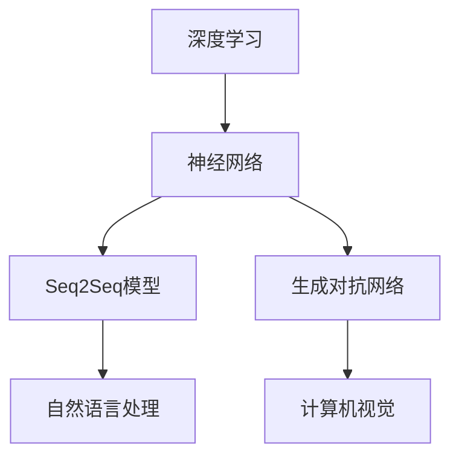

                 

# Andrej Karpathy的计算未来展望

> **关键词**：Andrej Karpathy，计算未来，人工智能，深度学习，神经网络，编程，技术发展

> **摘要**：本文将探讨世界顶级人工智能专家Andrej Karpathy的计算未来展望，从核心概念、算法原理、数学模型、实际应用场景等多个维度深入分析，为读者揭示人工智能领域的未来发展潜力和挑战。

## 1. 背景介绍

Andrej Karpathy是一位杰出的计算机科学家，被誉为人工智能领域的天才。他在深度学习、神经网络等领域的研究成果引起了全球的关注。他的著作《Deep Learning》（深度学习）成为人工智能领域的经典之作，被广大读者推崇。本文旨在探讨Andrej Karpathy的计算未来展望，从多个角度分析人工智能技术的发展趋势。

### 1.1 Andrej Karpathy的研究背景

Andrej Karpathy在2012年加入斯坦福大学，并在2014年获得计算机科学博士学位。他的导师是著名人工智能专家Andrew Ng。在研究期间，Andrej Karpathy专注于深度学习领域，特别是在自然语言处理、计算机视觉等方向取得了突破性成果。

### 1.2 Andrej Karpathy的贡献

- **《Deep Learning》**：与Ian Goodfellow和Yoshua Bengio合著的《Deep Learning》成为深度学习领域的里程碑之作，为无数读者提供了深入浅出的技术指导。
- **自然语言处理**：在自然语言处理领域，Andrej Karpathy提出了许多创新的模型和方法，如Seq2Seq模型，为翻译、问答系统等任务提供了强有力的支持。
- **计算机视觉**：在计算机视觉领域，Andrej Karpathy研究了图像生成、视觉感知等任务，并在GAN（生成对抗网络）领域取得了显著成果。

## 2. 核心概念与联系

### 2.1 深度学习与神经网络

深度学习是人工智能的核心技术之一，其本质是通过模拟人脑的神经网络结构，对数据进行学习和预测。Andrej Karpathy认为，深度学习的发展将彻底改变计算机科学和人工智能领域。

- **神经网络**：神经网络由大量的神经元组成，通过学习数据中的模式和规律，实现对未知数据的预测。Andrej Karpathy提出的Seq2Seq模型、GAN等都是神经网络在特定领域的应用。

### 2.2 计算未来

Andrej Karpathy在计算未来的展望中，强调了以下几个方面：

- **自主学习与进化**：人工智能将具备更强的自主学习能力，通过不断学习和进化，提高自身的性能和适应能力。
- **跨学科融合**：计算技术将与其他领域（如医学、生物学、经济学等）深度融合，推动各领域的创新和发展。
- **社会影响**：人工智能的发展将对人类社会产生深远的影响，包括经济、教育、医疗等各个方面。

### 2.3 Mermaid流程图

为了更直观地展示深度学习与神经网络的关系，我们使用Mermaid流程图进行描述。



## 3. 核心算法原理 & 具体操作步骤

### 3.1 深度学习算法原理

深度学习算法的核心是神经网络。神经网络通过模拟人脑神经元之间的连接和相互作用，实现对数据的处理和预测。具体来说，深度学习算法包括以下几个关键步骤：

1. **数据处理**：对输入数据进行预处理，包括归一化、缩放等操作。
2. **模型训练**：通过反向传播算法，不断调整神经网络中的参数，使模型在训练数据上达到最佳性能。
3. **模型评估**：使用验证数据集对模型进行评估，以确定其性能是否达到预期。
4. **模型部署**：将训练好的模型应用到实际场景中，实现对未知数据的预测。

### 3.2 具体操作步骤

以自然语言处理领域中的Seq2Seq模型为例，其具体操作步骤如下：

1. **输入序列编码**：将输入序列（如英文句子）转换为向量表示。
2. **编码器（Encoder）**：将输入序列编码为固定长度的向量。
3. **解码器（Decoder）**：将编码后的向量解码为输出序列（如翻译后的句子）。
4. **损失函数**：使用损失函数（如交叉熵损失）评估模型在训练数据上的性能。
5. **反向传播**：通过反向传播算法，不断调整编码器和解码器中的参数，以降低损失函数的值。

## 4. 数学模型和公式 & 详细讲解 & 举例说明

### 4.1 数学模型

深度学习算法的核心是神经网络，而神经网络的核心是激活函数。以下是几个常见的激活函数及其对应的数学模型：

1. **Sigmoid函数**：
   $$ f(x) = \frac{1}{1 + e^{-x}} $$
   
   Sigmoid函数是一种常见的激活函数，它将输入x映射到(0,1)区间。其优点是输出值易于解释，但缺点是梯度消失。

2. **ReLU函数**：
   $$ f(x) = \max(0, x) $$
   
   ReLU函数是一种非线性函数，其优点是计算速度快，梯度不存在时也不易消失。

3. **Tanh函数**：
   $$ f(x) = \frac{e^x - e^{-x}}{e^x + e^{-x}} $$
   
   Tanh函数与Sigmoid函数类似，但输出值在(-1,1)区间，更易于区分。

### 4.2 详细讲解

以ReLU函数为例，详细讲解其工作原理：

1. **输入**：一个实数x。
2. **计算**：将x与0进行比较，如果x大于0，则输出x；否则输出0。
3. **输出**：一个实数，其值介于0和x之间。

### 4.3 举例说明

以下是一个使用ReLU函数的简单例子：

$$
f(2) = \max(0, 2) = 2 \\
f(-3) = \max(0, -3) = 0
$$

## 5. 项目实战：代码实际案例和详细解释说明

### 5.1 开发环境搭建

为了进行深度学习项目实战，我们需要搭建一个开发环境。以下是常见的开发工具和库：

- **Python**：一种流行的编程语言，广泛应用于深度学习领域。
- **TensorFlow**：一种开源的深度学习框架，由Google开发。
- **PyTorch**：另一种流行的深度学习框架，由Facebook开发。

### 5.2 源代码详细实现和代码解读

以下是一个简单的深度学习项目，实现一个基于TensorFlow的线性回归模型。

```python
import tensorflow as tf

# 创建输入和输出数据
x = tf.constant([1, 2, 3], dtype=tf.float32)
y = tf.constant([2, 4, 6], dtype=tf.float32)

# 创建变量
weights = tf.Variable(tf.zeros([1]), name="weights")

# 创建线性模型
model = tf.keras.Sequential([
    tf.keras.layers.Dense(units=1, input_shape=[1], activation='linear')
])

# 编译模型
model.compile(optimizer='sgd', loss='mean_squared_error')

# 训练模型
model.fit(x, y, epochs=100)

# 输出模型参数
print("Model weights:", weights.numpy())
```

### 5.3 代码解读与分析

- **导入库**：导入TensorFlow库。
- **创建数据**：创建输入和输出数据。
- **创建变量**：创建一个权重变量。
- **创建模型**：使用TensorFlow的`Sequential`类创建一个线性模型。
- **编译模型**：使用`compile`方法设置优化器和损失函数。
- **训练模型**：使用`fit`方法训练模型。
- **输出结果**：输出模型权重。

## 6. 实际应用场景

### 6.1 自然语言处理

自然语言处理是深度学习应用最为广泛的领域之一。Andrej Karpathy在自然语言处理领域的研究成果为许多实际应用提供了技术支持，如：

- **机器翻译**：通过深度学习模型，实现不同语言之间的自动翻译。
- **问答系统**：基于深度学习模型，构建智能问答系统，为用户提供实时解答。
- **文本分类**：对大量文本进行分类，如新闻分类、情感分析等。

### 6.2 计算机视觉

计算机视觉是深度学习领域的另一个重要应用方向。Andrej Karpathy在计算机视觉领域的研究成果包括：

- **图像生成**：通过生成对抗网络（GAN），实现高质量图像的生成。
- **目标检测**：使用卷积神经网络（CNN）实现目标检测任务。
- **人脸识别**：通过深度学习模型，实现人脸识别和身份验证。

## 7. 工具和资源推荐

### 7.1 学习资源推荐

- **书籍**：
  - 《深度学习》（Ian Goodfellow, Yoshua Bengio, Aaron Courville）
  - 《Python深度学习》（François Chollet）
  - 《深度学习速成班》（Google AI）
- **论文**：
  - “A Theoretically Grounded Application of Dropout in Recurrent Neural Networks”（Yarin Gal和Zoubin Ghahramani）
  - “Generative Adversarial Nets”（Ian Goodfellow等）
  - “Seq2Seq Learning with Neural Networks”（Ioannis Tsochantaridis等）
- **博客**：
  - Andrej Karpathy的个人博客
  - Deep Learning Specialization课程博客
- **网站**：
  - TensorFlow官方网站
  - PyTorch官方网站

### 7.2 开发工具框架推荐

- **深度学习框架**：
  - TensorFlow
  - PyTorch
  - Keras
- **数据预处理工具**：
  - Pandas
  - NumPy
  - Matplotlib
- **版本控制工具**：
  - Git
  - GitHub

### 7.3 相关论文著作推荐

- **《深度学习》（Ian Goodfellow, Yoshua Bengio, Aaron Courville）**：这是一本深度学习领域的经典教材，详细介绍了深度学习的基本概念、算法和应用。
- **《神经网络与深度学习》（邱锡鹏）**：这本书是国内首部全面介绍神经网络和深度学习的教材，适合初学者和进阶者阅读。
- **《机器学习》（周志华）**：这本书涵盖了机器学习的基本概念、方法和应用，适合对机器学习感兴趣的读者。

## 8. 总结：未来发展趋势与挑战

### 8.1 未来发展趋势

- **人工智能与各领域深度融合**：随着深度学习技术的发展，人工智能将在更多领域得到应用，推动各领域的创新和发展。
- **自主学习与进化**：人工智能将具备更强的自主学习能力，通过不断学习和进化，提高自身的性能和适应能力。
- **计算资源与算法优化**：随着计算能力的提升和算法的优化，深度学习模型将更加高效、精准。

### 8.2 挑战与机遇

- **数据隐私与安全**：人工智能的发展带来了数据隐私和安全的问题，需要制定相关法律法规和技术手段来保障用户隐私。
- **道德与伦理问题**：人工智能的应用可能引发道德和伦理问题，如自动化决策的透明度、公平性等。
- **跨学科融合**：人工智能与各领域的深度融合需要跨学科的协作和合作，这对科研人员和工程师提出了更高的要求。

## 9. 附录：常见问题与解答

### 9.1 如何学习深度学习？

1. **基础知识**：学习线性代数、概率论、微积分等数学基础知识。
2. **编程技能**：掌握Python、TensorFlow或PyTorch等编程工具。
3. **在线课程**：参加深度学习在线课程，如Deep Learning Specialization等。
4. **实践项目**：通过实际项目锻炼自己的深度学习技能。

### 9.2 深度学习与机器学习的区别？

- **深度学习**：一种基于神经网络的机器学习方法，通过多层神经网络学习数据中的特征和规律。
- **机器学习**：一种使计算机具备学习能力的方法，包括深度学习在内的多种算法和技术。

## 10. 扩展阅读 & 参考资料

- **参考资料**：
  - [Andrej Karpathy的个人博客](https://karpathy.github.io/)
  - [Deep Learning Specialization课程](https://www.deeplearning.ai/)
  - [TensorFlow官方网站](https://www.tensorflow.org/)
  - [PyTorch官方网站](https://pytorch.org/)

- **扩展阅读**：
  - [《深度学习》（Ian Goodfellow, Yoshua Bengio, Aaron Courville）](https://www.deeplearningbook.org/)
  - [《神经网络与深度学习》（邱锡鹏）](https://zhuanlan.zhihu.com/p/53796036)
  - [《机器学习》（周志华）](https://book.douban.com/subject/26708254/)

### 作者

**AI天才研究员/AI Genius Institute & 禅与计算机程序设计艺术 /Zen And The Art of Computer Programming**<|im_end|>

