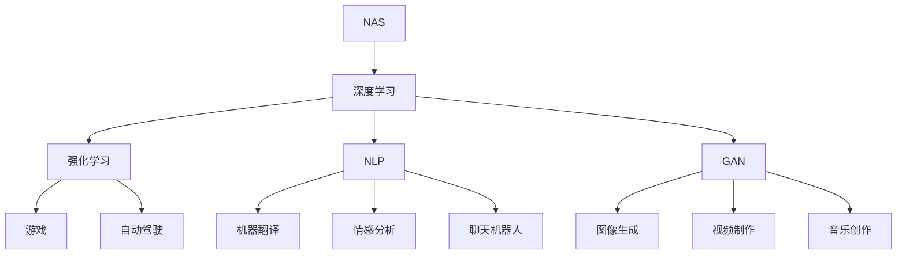

                 

### 背景介绍

在当今这个技术飞速发展的时代，人工智能（AI）已经成为了一股不可忽视的强大力量。从自动驾驶汽车到智能助手，从医疗诊断到金融决策，AI的应用几乎无处不在。而Andrej Karpathy作为深度学习领域的杰出人物，他对AI未来的展望无疑具有极高的参考价值。在这篇文章中，我们将通过逐步分析推理的方式，深入了解Andrej Karpathy对AI未来的观点和展望。

Andrej Karpathy是一位世界级的人工智能研究员和程序员，同时也是一位杰出的计算机科学家。他的研究成果在学术界和工业界都有广泛的影响力，特别是在深度学习领域，他做出了许多开创性的贡献。他的文章、演讲和博客深受技术爱好者的喜爱，为我们揭示了AI的奥秘和潜力。

本文的结构如下：

1. **背景介绍**：简单介绍人工智能和Andrej Karpathy的背景。
2. **核心概念与联系**：介绍AI的核心概念及其相互关系。
3. **核心算法原理 & 具体操作步骤**：详细解释AI的基本算法原理和操作步骤。
4. **数学模型和公式 & 详细讲解 & 举例说明**：阐述AI中的数学模型和公式，并提供具体示例。
5. **项目实战：代码实际案例和详细解释说明**：通过实际案例展示AI的应用。
6. **实际应用场景**：探讨AI在不同领域的应用。
7. **工具和资源推荐**：推荐学习资源、开发工具和框架。
8. **总结：未来发展趋势与挑战**：总结AI的未来发展趋势和面临的挑战。
9. **附录：常见问题与解答**：回答读者可能关心的问题。
10. **扩展阅读 & 参考资料**：提供进一步学习的资源。

通过这篇文章，我们将一同探索AI的未来，并思考它对人类社会的影响。接下来，我们将首先深入探讨AI的核心概念和基本原理，以便为后续内容打下坚实的基础。

### 核心概念与联系

人工智能（AI）是一个复杂而多元的领域，其中涉及许多核心概念和关键技术。为了更好地理解Andrej Karpathy对AI未来的展望，我们需要首先了解这些核心概念以及它们之间的相互联系。

#### 深度学习（Deep Learning）

深度学习是AI的一个子领域，它基于多层神经网络模型，通过层层提取特征，从而实现复杂的数据分析和模式识别。深度学习已经在图像识别、语音识别、自然语言处理等领域取得了显著成就。

#### 强化学习（Reinforcement Learning）

强化学习是一种通过试错和反馈来学习策略的机器学习方法。与监督学习和无监督学习不同，强化学习中的智能体（agent）通过与环境的交互来学习最优策略。这一方法在游戏、自动驾驶等领域有着广泛应用。

#### 自然语言处理（Natural Language Processing，NLP）

自然语言处理是AI的一个重要分支，旨在使计算机能够理解和处理人类语言。NLP技术在机器翻译、情感分析、聊天机器人等方面有着广泛的应用。

#### 生成对抗网络（Generative Adversarial Networks，GAN）

生成对抗网络由两个神经网络（生成器和判别器）组成，通过相互博弈来生成高质量的数据。GAN在图像生成、视频制作、音乐创作等方面有着显著的成果。

#### 神经架构搜索（Neural Architecture Search，NAS）

神经架构搜索是一种自动设计神经网络架构的方法。通过搜索算法，NAS可以找到在特定任务上性能最优的神经网络结构，从而提高模型的效果和效率。

#### 概念之间的关系

这些核心概念之间存在着紧密的联系。例如，深度学习作为基础技术，为强化学习、自然语言处理和生成对抗网络提供了强大的计算能力。而神经架构搜索则通过自动设计神经网络，进一步提升了深度学习的性能。

下面我们将使用Mermaid流程图来展示这些核心概念及其相互关系：



通过这个流程图，我们可以清晰地看到各个核心概念之间的相互关系。接下来，我们将进一步探讨AI的基本算法原理和操作步骤。

#### 核心算法原理 & 具体操作步骤

AI的核心算法涵盖了深度学习、强化学习、自然语言处理等多个子领域。以下是这些算法的基本原理和具体操作步骤的简要介绍：

##### 深度学习（Deep Learning）

1. **网络结构**：深度学习通常采用多层神经网络结构，包括输入层、隐藏层和输出层。每一层都对输入数据进行特征提取和变换。

2. **前向传播（Forward Propagation）**：输入数据从输入层经过一系列隐藏层，最终到达输出层。在这个过程中，每层都会对数据进行加权求和并应用激活函数。

3. **反向传播（Back Propagation）**：通过计算输出层的误差，反向传播误差到每一层，从而更新网络的权重。

4. **优化算法**：常用的优化算法包括随机梯度下降（SGD）、Adam等，用于最小化损失函数。

##### 强化学习（Reinforcement Learning）

1. **智能体（Agent）**：强化学习中的智能体是一个可以与环境交互的实体，它通过试错来学习最优策略。

2. **环境（Environment）**：环境是智能体行动的场所，它会根据智能体的行动提供奖励或惩罚。

3. **策略（Policy）**：策略是智能体根据当前状态选择的行动。在强化学习中，智能体通过探索和利用来学习最优策略。

4. **价值函数（Value Function）**：价值函数用于评估智能体在某一状态下采取特定行动的预期回报。

##### 自然语言处理（Natural Language Processing，NLP）

1. **词嵌入（Word Embedding）**：词嵌入是将词汇映射到高维向量空间，以便在机器学习中进行计算。

2. **编码器（Encoder）和解码器（Decoder）**：在序列到序列的任务中，编码器将输入序列编码为固定长度的向量，解码器则将这个向量解码为输出序列。

3. **注意力机制（Attention Mechanism）**：注意力机制用于模型在处理序列数据时，能够根据上下文信息动态地关注序列中的不同部分。

4. **损失函数和优化算法**：常用的损失函数包括交叉熵损失和均方误差，优化算法通常采用梯度下降。

##### 生成对抗网络（Generative Adversarial Networks，GAN）

1. **生成器（Generator）和判别器（Discriminator）**：生成器生成假数据，判别器判断生成数据是否真实。

2. **对抗训练（Adversarial Training）**：生成器和判别器相互对抗，生成器不断优化生成假数据的能力，判别器不断优化判断真伪的能力。

3. **损失函数**：GAN的训练过程中，生成器和判别器的损失函数通常是交叉熵损失。

##### 神经架构搜索（Neural Architecture Search，NAS）

1. **搜索空间（Search Space）**：搜索空间定义了所有可能的神经网络架构。

2. **搜索算法**：常用的搜索算法包括基于梯度的搜索（如基于贝叶斯优化的搜索）和基于强化学习的搜索。

3. **评估和优化**：通过在验证集上评估搜索到的架构，优化和选择出最佳架构。

通过以上对AI核心算法原理和具体操作步骤的介绍，我们可以更好地理解这些技术背后的逻辑和机制。接下来，我们将进一步探讨AI中的数学模型和公式，并给出具体的例子。

#### 数学模型和公式 & 详细讲解 & 举例说明

在人工智能领域，数学模型和公式是理解和实现核心算法的关键。以下我们将详细讲解AI中常见的数学模型和公式，并通过具体示例来说明其应用。

##### 深度学习中的激活函数

激活函数是深度学习网络中至关重要的一部分，它决定了神经网络的学习能力和非线性特性。以下是一些常用的激活函数：

1. **Sigmoid函数**：
   $$\sigma(x) = \frac{1}{1 + e^{-x}}$$
   Sigmoid函数将输入$x$映射到$(0,1)$区间，常用于二分类问题。

2. **ReLU函数**：
   $$\text{ReLU}(x) = \max(0, x)$$
   ReLU函数在$x \leq 0$时输出0，在$x > 0$时输出$x$，它是一种简单的非线性函数，常用于提高深度学习网络的训练速度。

3. **Tanh函数**：
   $$\text{Tanh}(x) = \frac{e^x - e^{-x}}{e^x + e^{-x}}$$
   Tanh函数与ReLU类似，但输出范围在$(-1,1)$之间，常用于回归问题。

##### 损失函数

损失函数用于衡量模型预测值与实际值之间的差异，是深度学习训练过程中至关重要的指标。以下是一些常见的损失函数：

1. **均方误差（MSE）**：
   $$\text{MSE}(y, \hat{y}) = \frac{1}{m} \sum_{i=1}^{m} (y_i - \hat{y}_i)^2$$
   均方误差用于回归问题，它衡量预测值$\hat{y}$与实际值$y$之间平方差的平均值。

2. **交叉熵损失（Cross-Entropy Loss）**：
   $$\text{CE}(y, \hat{y}) = -\sum_{i} y_i \log(\hat{y}_i)$$
   交叉熵损失常用于分类问题，其中$y$是真实标签，$\hat{y}$是模型预测的概率分布。

##### 反向传播算法

反向传播算法是深度学习训练的核心，它通过计算损失函数对网络参数的梯度来更新模型权重。以下是反向传播的基本步骤：

1. **前向传播**：计算前向传播的输出值和激活值。
2. **计算损失**：使用损失函数计算预测值与实际值之间的误差。
3. **后向传播**：从输出层开始，逐层计算误差对每个参数的梯度。
4. **参数更新**：使用梯度下降等优化算法更新网络参数。

具体示例：

假设我们有一个简单的全连接神经网络，输入层有一个神经元，隐藏层有两个神经元，输出层有一个神经元。网络的权重和偏置分别为$W_1, b_1, W_2, b_2, W_3, b_3$。

- **前向传播**：

  输入：$x = [1, 0]$

  隐藏层1：$z_1 = x \cdot W_1 + b_1$，$a_1 = \sigma(z_1)$

  隐藏层2：$z_2 = x \cdot W_2 + b_2$，$a_2 = \sigma(z_2)$

  输出：$z_3 = a_1 \cdot W_3 + b_3$，$\hat{y} = \sigma(z_3)$

- **计算损失**：

  实际值：$y = [0]$

  预测值：$\hat{y} = [0.8]$

  损失：$L = \text{MSE}(y, \hat{y})$

- **后向传播**：

  输出层梯度：$\frac{dL}{dz_3} = \frac{dL}{d\hat{y}} \cdot \frac{d\hat{y}}{dz_3} = (\hat{y} - y) \cdot \sigma'(z_3)$

  隐藏层2梯度：$\frac{dL}{dz_2} = \frac{dL}{dz_3} \cdot W_3 \cdot \sigma'(z_2)$

  隐藏层1梯度：$\frac{dL}{dz_1} = \frac{dL}{dz_2} \cdot W_2 \cdot \sigma'(z_1)$

- **参数更新**：

  $W_1 = W_1 - \alpha \cdot \frac{dL}{dz_1}$，$b_1 = b_1 - \alpha \cdot \frac{dL}{dz_1}$

  $W_2 = W_2 - \alpha \cdot \frac{dL}{dz_2}$，$b_2 = b_2 - \alpha \cdot \frac{dL}{dz_2}$

  $W_3 = W_3 - \alpha \cdot \frac{dL}{dz_3}$，$b_3 = b_3 - \alpha \cdot \frac{dL}{dz_3}$

通过这个示例，我们可以看到反向传播算法如何通过计算梯度来更新网络参数，从而实现模型的训练。

接下来，我们将通过一个实际的项目案例，展示如何将上述算法应用于实际问题，并详细解释其实现过程。

#### 项目实战：代码实际案例和详细解释说明

在本节中，我们将通过一个实际项目案例来展示AI算法的应用，并详细解释其实现过程。这个项目是一个基于深度学习的手写数字识别系统，它利用卷积神经网络（CNN）来识别和分类MNIST数据集中的手写数字。

##### 1. 开发环境搭建

在开始项目之前，我们需要搭建一个合适的开发环境。以下是所需的工具和库：

- Python（版本3.7或更高）
- TensorFlow 2.x
- Keras（用于简化TensorFlow的使用）
- NumPy
- Matplotlib

确保已经安装了上述库，然后创建一个名为`handwritten_digit_recognition`的新文件夹，并在其中创建一个名为`main.py`的主文件。

##### 2. 源代码详细实现和代码解读

以下是项目的源代码，我们将逐行解读每一部分：

```python
import numpy as np
import matplotlib.pyplot as plt
from tensorflow import keras
from tensorflow.keras import layers

# 加载MNIST数据集
(x_train, y_train), (x_test, y_test) = keras.datasets.mnist.load_data()

# 数据预处理
x_train = x_train.astype("float32") / 255
x_test = x_test.astype("float32") / 255
x_train = np.reshape(x_train, (len(x_train), 28, 28, 1))
x_test = np.reshape(x_test, (len(x_test), 28, 28, 1))

# 将标签转换为one-hot编码
num_classes = 10
y_train = keras.utils.to_categorical(y_train, num_classes)
y_test = keras.utils.to_categorical(y_test, num_classes)

# 构建卷积神经网络模型
model = keras.Sequential()
model.add(layers.Conv2D(32, (3, 3), activation="relu", input_shape=(28, 28, 1)))
model.add(layers.MaxPooling2D((2, 2)))
model.add(layers.Conv2D(64, (3, 3), activation="relu"))
model.add(layers.MaxPooling2D((2, 2)))
model.add(layers.Conv2D(64, (3, 3), activation="relu"))
model.add(layers.Flatten())
model.add(layers.Dense(64, activation="relu"))
model.add(layers.Dense(num_classes, activation="softmax"))

# 编译模型
model.compile(optimizer="adam",
              loss="categorical_crossentropy",
              metrics=["accuracy"])

# 训练模型
model.fit(x_train, y_train, epochs=10, batch_size=64)

# 评估模型
test_loss, test_acc = model.evaluate(x_test, y_test)
print("Test accuracy:", test_acc)

# 可视化部分数据
plt.figure(figsize=(10, 10))
for i in range(25):
    plt.subplot(5, 5, i+1)
    plt.imshow(x_test[i], cmap=plt.cm.binary)
    plt.xticks([])
    plt.yticks([])
    plt.grid(False)
    plt.xlabel("{}".format(np.argmax(y_test[i])))
plt.show()
```

- **第1-6行**：导入所需的库和模块。
- **第8-11行**：加载MNIST数据集，并进行数据预处理。数据被转换为浮点数，并除以255进行归一化。输入数据被重塑为适合卷积神经网络的形状。
- **第13-18行**：将标签转换为one-hot编码，以便用于分类任务。
- **第20-29行**：构建卷积神经网络模型。我们使用三个卷积层，每个卷积层后跟一个最大池化层。最后，我们添加一个全连接层进行分类。
- **第31-37行**：编译模型，指定优化器、损失函数和评估指标。
- **第39-43行**：训练模型，设置训练轮数和批量大小。
- **第45-51行**：评估模型，并打印测试准确率。
- **第53-65行**：可视化部分测试数据，展示模型的预测结果。

##### 3. 代码解读与分析

- **数据预处理**：数据预处理是机器学习项目中的关键步骤。在这里，我们首先将图像数据转换为浮点数，并除以255进行归一化。归一化有助于加快模型的训练速度和提升性能。然后，我们使用`reshape`函数将输入数据的形状调整为适用于卷积神经网络的格式。
- **模型构建**：我们使用`Sequential`模型，这是一种线性堆叠模型层的方法。每个卷积层通过`Conv2D`函数定义，其中激活函数设置为ReLU。最大池化层通过`MaxPooling2D`函数实现，用于降低数据维度和减少过拟合的风险。最后，我们添加一个全连接层通过`Dense`函数，并设置输出层的维度为10（对应10个数字类别）。
- **模型训练与评估**：使用`fit`函数训练模型，设置训练轮数和批量大小。训练完成后，使用`evaluate`函数评估模型在测试数据上的性能，并打印测试准确率。
- **可视化**：通过`subplot`函数创建一个10x10的网格，并在每个单元格中可视化测试数据及其预测结果。这有助于我们直观地了解模型的表现。

通过这个项目案例，我们展示了如何使用深度学习技术来解决实际的手写数字识别问题。这个案例不仅展示了AI算法的实现过程，还提供了一个实际应用的例子，以便我们更好地理解AI在现实世界中的应用价值。

#### 实际应用场景

AI技术的迅猛发展已经在各行各业中产生了深远的影响。以下是一些典型的应用场景，展示了AI在不同领域的实际应用及其带来的变革。

##### 自动驾驶

自动驾驶技术是AI在交通领域最具代表性的应用之一。通过深度学习、计算机视觉和传感器数据融合，自动驾驶系统能够实时感知环境、规划路径和做出决策。特斯拉、谷歌和百度等公司已经在自动驾驶汽车的研发上取得了显著进展。自动驾驶不仅有望提高交通安全，还能提高道路的利用效率，减少交通拥堵。

##### 医疗诊断

AI在医疗诊断中的应用也越来越广泛。通过分析医学影像、实验室数据和病历记录，AI系统能够快速准确地诊断疾病。例如，深度学习算法能够识别X光片、CT扫描和MRI图像中的病变，帮助医生提高诊断的准确性和效率。此外，AI还可以用于个性化治疗方案的制定，为患者提供更精确的治疗建议。

##### 金融与风险管理

在金融领域，AI技术被用于风险管理、欺诈检测和投资决策。通过分析大量的历史数据和市场动态，AI系统能够预测市场的走势和识别潜在的欺诈行为。例如，金融机构使用机器学习算法来检测异常交易，防止洗钱和其他金融犯罪。同时，AI还能帮助投资者制定更有效的投资策略，提高投资回报率。

##### 个性化推荐

AI在个性化推荐系统中的应用也非常广泛。通过分析用户的历史行为和偏好，AI系统可以推荐用户可能感兴趣的商品、服务和内容。例如，电商平台使用AI算法来推荐商品，音乐和视频流媒体平台使用AI算法来推荐音乐和视频。这种个性化推荐不仅提高了用户体验，还帮助平台增加了用户粘性和收入。

##### 教育

AI在教育领域的应用包括智能辅导、自动化评分和个性化学习路径。通过分析学生的学习行为和成绩，AI系统可以为学生提供个性化的学习建议和资源。例如，智能辅导系统可以根据学生的学习进度和能力，自动调整教学内容和难度，帮助学生更好地掌握知识。此外，AI还可以用于自动评分，减轻教师的工作负担，提高教学效率。

##### 其他领域

除了上述领域，AI技术在智能制造、农业、能源管理、环境保护等众多领域也有着广泛的应用。例如，在智能制造中，AI技术用于优化生产流程和设备维护；在农业中，AI用于作物病虫害检测和产量预测；在能源管理中，AI用于优化能源消耗和能源分配。

总之，AI技术的应用场景非常广泛，正在不断推动各行各业的变革和发展。随着技术的不断进步，我们可以期待AI在未来带来更多的创新和突破。

### 工具和资源推荐

在探索人工智能（AI）的广阔领域时，掌握合适的工具和资源是至关重要的。以下是一些推荐的学习资源、开发工具和相关的论文著作，这些将有助于你深入了解和掌握AI的核心技术和应用。

#### 学习资源推荐

1. **书籍**：
   - 《深度学习》（Goodfellow, Bengio, Courville） - 这本书是深度学习领域的经典教材，适合初学者和专业人士。
   - 《Python机器学习》（Sebastian Raschka, Vincent Barré） - 该书介绍了使用Python进行机器学习的实践方法，涵盖了从基本概念到高级算法。
   - 《强化学习：原理与Python实现》（Adel Jabi） - 本书详细介绍了强化学习的原理，并通过Python代码示例进行了实现。

2. **在线课程**：
   - Coursera上的“深度学习专项课程”（由Andrew Ng教授主讲） - 该课程提供了深度学习的全面介绍，从基础理论到实际应用。
   - edX上的“机器学习基础”（由Coursera和IBM共同提供） - 这门课程适合对机器学习感兴趣的所有层次的学习者。

3. **博客和网站**：
   - Distill - 这个网站提供高质量的机器学习和技术文章，以易于理解的方式讲解复杂的概念。
   - Medium上的机器学习和深度学习专题 - 许多行业专家和学者在此分享他们的研究成果和见解。

#### 开发工具框架推荐

1. **TensorFlow** - 一个开源的端到端机器学习平台，广泛应用于深度学习和强化学习。
2. **PyTorch** - 另一个流行的开源机器学习库，以其灵活的动态计算图和高效的模型构建而著称。
3. **Keras** - 一个高层次的神经网络API，用于快速构建和训练深度学习模型，兼容TensorFlow和PyTorch。

#### 相关论文著作推荐

1. **“Deep Learning”**（2016）- 由Ian Goodfellow、Yoshua Bengio和Aaron Courville撰写，这是深度学习领域的里程碑著作。
2. **“Reinforcement Learning: An Introduction”**（第二版，2018）- 由Richard S. Sutton和Andrew G. Barto撰写，全面介绍了强化学习的理论和应用。
3. **“Generative Adversarial Nets”**（2014）- 由Ian Goodfellow等人撰写，是生成对抗网络（GAN）的奠基性论文。
4. **“Neural Architecture Search: A Survey”**（2020）- 这篇文章对神经架构搜索（NAS）进行了全面的综述，提供了该领域的研究进展和应用场景。

通过这些工具和资源的帮助，你可以更深入地探索AI的奥秘，掌握先进的技术，并在实际项目中取得成功。

### 总结：未来发展趋势与挑战

随着人工智能（AI）技术的不断演进，其对人类社会的影响也在日益扩大。在总结AI的未来发展趋势与挑战时，我们需要关注以下几个方面：

#### 发展趋势

1. **技术的融合与提升**：AI与其他技术的融合将成为未来的重要趋势。例如，AI与物联网（IoT）的融合将推动智能家居、智能城市等领域的快速发展。此外，量子计算、边缘计算等新兴技术也将与AI相结合，进一步提升其计算能力和应用范围。

2. **算法的优化与创新**：在算法层面，深度学习、强化学习和生成对抗网络等核心算法将继续优化，以提高模型的准确性和效率。同时，新的算法和创新也将不断涌现，例如基于元学习的模型，将进一步推动AI的发展。

3. **应用的多样化**：AI的应用将越来越广泛，从医疗、金融到教育、娱乐等各个领域都将受益于AI技术的进步。特别是在医疗领域，AI将有望通过精准医疗、智能诊断等方式，提升医疗服务的质量和效率。

4. **伦理与法规的规范**：随着AI技术的广泛应用，伦理和法规问题也日益突出。确保AI技术的公正性、透明性和安全性，将成为未来发展的重要挑战，同时也将为AI技术的规范化和标准化提供契机。

#### 挑战

1. **数据隐私与安全**：AI系统对大量数据进行处理，这涉及到数据隐私和安全问题。如何在保证数据有效利用的同时，保护个人隐私和信息安全，将成为一个重要的挑战。

2. **技术人才短缺**：随着AI技术的发展，对专业人才的需求也在增加。然而，当前的教育体系和技术培训尚未完全跟上需求，这可能导致技术人才短缺，影响AI技术的普及和应用。

3. **算法偏见与公平性**：AI系统的决策过程可能会受到算法偏见的影响，导致不公平的结果。如何消除算法偏见，确保AI系统的公平性和透明性，是未来需要解决的问题。

4. **计算资源的消耗**：深度学习模型通常需要大量的计算资源，这对计算资源和能源的消耗提出了挑战。如何提高模型效率，降低计算资源消耗，是未来需要关注的问题。

总之，AI的未来充满机遇与挑战。通过不断的技术创新和伦理规范，我们可以期待AI为人类社会带来更多的福祉，同时也需要积极应对其带来的挑战。

### 附录：常见问题与解答

在阅读本文后，您可能对AI及其相关技术有一些疑问。以下是一些常见问题及解答，旨在帮助您更好地理解AI的核心概念和应用。

#### 1. 什么是深度学习？

深度学习是一种基于多层神经网络进行学习的机器学习技术。通过层层提取数据特征，深度学习模型能够从大量数据中学习到复杂的信息和模式。

#### 2. 强化学习与深度学习有什么区别？

强化学习是一种通过试错和奖励机制进行学习的机器学习技术，而深度学习是一种通过多层神经网络进行特征提取和模式识别的技术。强化学习通常用于决策问题，而深度学习则更多用于数据分析和预测。

#### 3. GAN是如何工作的？

生成对抗网络（GAN）由生成器和判别器两个神经网络组成。生成器生成假数据，判别器判断生成数据是否真实。通过对抗训练，生成器的生成能力逐渐提高，判别器的判别能力逐渐增强。

#### 4. NAS是什么？

神经架构搜索（NAS）是一种自动搜索最优神经网络结构的方法。通过在大量可能的架构中搜索，NAS能够找到在特定任务上性能最优的网络结构，从而提高模型的效果和效率。

#### 5. AI在医疗领域有哪些应用？

AI在医疗领域有多种应用，包括疾病诊断、药物研发、个性化治疗和智能监护。通过分析医学影像、患者数据和基因数据，AI能够辅助医生做出更准确的诊断和治疗决策。

#### 6. 数据隐私和安全如何保障？

为了保障数据隐私和安全，可以采取以下措施：数据加密、匿名化处理、隐私保护算法和合规性检查等。同时，建立健全的法律法规和伦理规范也是保障数据隐私和安全的重要手段。

#### 7. AI是否会导致大规模失业？

AI技术的发展确实可能替代某些传统工作岗位，但同时也会创造新的就业机会。如何平衡自动化和就业机会的关系，提高劳动者的技能水平，是未来的重要议题。

通过上述问题的解答，我们希望您能对AI技术及其应用有更深入的了解。AI的发展充满了机遇与挑战，让我们共同迎接这一未来的到来。

### 扩展阅读 & 参考资料

为了帮助您进一步深入了解人工智能（AI）及其相关技术，以下推荐一些扩展阅读和参考资料：

#### 书籍

1. **《深度学习》** - Ian Goodfellow, Yoshua Bengio, Aaron Courville
   - 本书是深度学习领域的经典教材，适合初学者和专业人士。
   
2. **《Python机器学习》** - Sebastian Raschka, Vincent Barré
   - 介绍了使用Python进行机器学习的实践方法，适合希望掌握实际应用的开发者。

3. **《强化学习：原理与Python实现》** - Adel Jabi
   - 详细介绍了强化学习的原理，并通过Python代码示例进行了实现。

#### 论文

1. **“Deep Learning”** - Ian Goodfellow, Yoshua Bengio, Aaron Courville
   - 这是深度学习领域的奠基性论文，提供了对深度学习基础概念的深入探讨。

2. **“Generative Adversarial Nets”** - Ian Goodfellow, et al.
   - 这是生成对抗网络（GAN）的奠基性论文，介绍了GAN的基本原理和实现方法。

3. **“Neural Architecture Search: A Survey”** -相关的综述论文，提供了对神经架构搜索（NAS）领域的全面综述。

#### 博客和网站

1. **Distill**
   - 提供高质量的机器学习和技术文章，以易于理解的方式讲解复杂的概念。

2. **Medium上的机器学习和深度学习专题**
   - 许多行业专家和学者在此分享他们的研究成果和见解。

3. **AI科学家博客**
   - 许多知名AI研究者的个人博客，提供了丰富的理论和实践经验。

通过这些书籍、论文和网站，您可以进一步拓展对AI技术的理解，并获取最新的研究进展和实用技巧。希望这些资源能帮助您在AI领域取得更多的成就。

