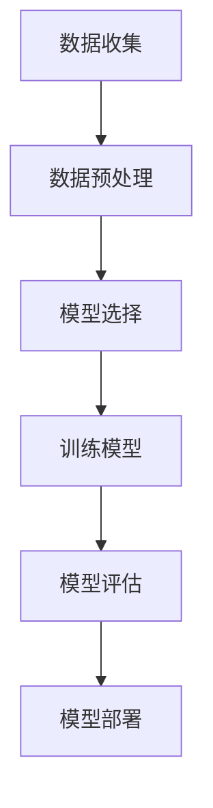
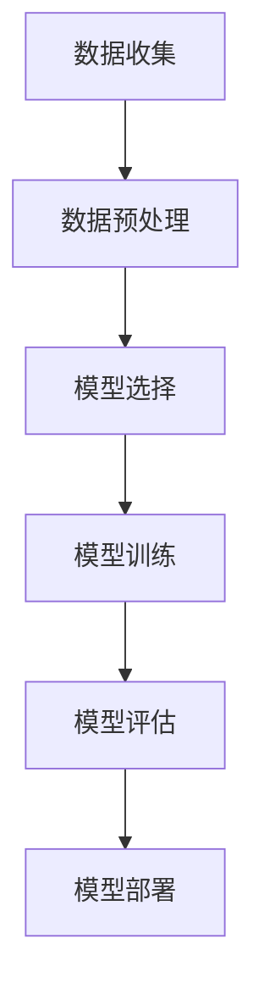

                 

### 背景介绍

在过去的几十年里，人工智能（AI）的发展经历了多个阶段，从最初的规则基础系统到现代的深度学习模型，AI 的应用范围和影响力也在不断扩展。然而，随着 AI 技术的迅速发展，我们也面临着新的挑战，特别是在 AI 编程方面。传统的编程范式已经无法满足现代 AI 应用对复杂性和灵活性要求的日益增长。

安德烈·卡尔帕西（Andrej Karpathy）是当今世界顶尖的 AI 研究员之一，他在 AI 编程范式方面有着深刻的见解。他在 2015 年发表的博客文章《用 Python 编程训练神经网络》（"Building Neural Networks in Python"）以及后来的著作《深度学习以图方式思考》（"Thinking in Depth: Graphs for Deep Learning"）中，提出了 AI 编程的新范式。本文将基于安德烈·卡尔帕西的观点，探讨 AI 编程的新范式，包括其核心概念、算法原理以及实际应用。

### 核心概念与联系

#### 什么是 AI 编程的新范式？

AI 编程的新范式，本质上是一种不同于传统编程的思维方式，它强调了数据驱动、模型驱动和自动化的重要性。传统编程范式通常是基于算法和代码的，而新范式则更注重于数据和模型。具体来说，新范式有以下几个核心特点：

1. **数据驱动：** 在新范式中，数据是最重要的资产。数据的收集、清洗和预处理是整个 AI 项目的关键步骤，因为好的数据质量直接决定了模型的性能。

2. **模型驱动：** 新范式强调使用预训练模型和迁移学习来快速构建 AI 系统的能力。通过使用预训练模型，开发者可以跳过繁琐的模型设计过程，专注于任务特定的优化。

3. **自动化：** 新范式倡导使用自动化工具和框架来简化 AI 开发流程。例如，自动化的数据预处理、超参数调整和模型训练，可以大大提高开发效率。

#### 核心概念原理和架构

为了更好地理解新范式，我们可以借助 Mermaid 流程图来描述其核心概念和架构。以下是一个简化的流程图：



**数据收集**：这一阶段包括从各种来源收集数据，如传感器、数据库或开源数据集。

**数据预处理**：数据需要进行清洗、格式化和归一化，以便用于训练模型。

**模型选择**：根据任务需求选择合适的预训练模型或自定义模型。

**训练模型**：使用收集到的数据来训练模型，可以通过调整超参数来优化模型性能。

**模型评估**：评估模型的性能，以确保其满足预期目标。

**模型部署**：将训练好的模型部署到生产环境中，以供实际使用。

#### 新范式的优势

1. **效率提升：** 新范式通过自动化和预训练模型的使用，大大缩短了 AI 开发周期。

2. **灵活性增强：** 开发者可以更灵活地调整模型和算法，以满足不断变化的需求。

3. **易用性增强：** 新范式使得 AI 开发变得更加简单和直观，降低了门槛。

4. **资源优化：** 数据和模型的重用，有助于优化计算资源和存储资源。

### 核心算法原理 & 具体操作步骤

在新范式中，核心算法通常是基于深度学习的，以下将介绍深度学习的基本原理以及具体操作步骤。

#### 深度学习的基本原理

深度学习是一种机器学习技术，它通过多层神经网络来模拟人类大脑的神经元连接方式。深度学习模型可以自动从大量数据中学习特征，并用于分类、回归、生成等任务。

1. **输入层（Input Layer）**：接收外部输入数据。

2. **隐藏层（Hidden Layers）**：对输入数据进行处理，提取特征。

3. **输出层（Output Layer）**：生成最终的预测结果。

#### 具体操作步骤

1. **数据准备**：收集并预处理数据，包括数据清洗、归一化和分割。

2. **模型设计**：选择合适的模型结构，例如卷积神经网络（CNN）或循环神经网络（RNN）。

3. **模型训练**：使用预处理后的数据来训练模型，通过反向传播算法不断调整模型参数。

4. **模型评估**：使用验证集来评估模型性能，调整超参数以优化模型。

5. **模型部署**：将训练好的模型部署到生产环境中，进行实际应用。

#### 数学模型和公式

在深度学习中，常用的数学模型包括损失函数、优化算法等。

1. **损失函数（Loss Function）**：
   $$L(y, \hat{y}) = \frac{1}{2} ||y - \hat{y}||^2$$
   其中，$y$ 是真实标签，$\hat{y}$ 是模型的预测值。

2. **优化算法（Optimization Algorithm）**：
   $$\theta = \theta - \alpha \frac{\partial L}{\partial \theta}$$
   其中，$\theta$ 是模型参数，$\alpha$ 是学习率。

#### 举例说明

假设我们有一个二分类问题，使用逻辑回归（Logistic Regression）模型来进行预测。

1. **数据准备**：收集包含标签的二分类数据集，如判断邮件是否为垃圾邮件。

2. **模型设计**：选择逻辑回归模型，其参数为 $\theta = (\theta_0, \theta_1)$。

3. **模型训练**：使用梯度下降算法来训练模型。

4. **模型评估**：使用验证集来评估模型性能。

5. **模型部署**：将训练好的模型部署到邮件服务器中，进行实时分类。

### 项目实战：代码实际案例和详细解释说明

为了更好地理解 AI 编程的新范式，以下我们将通过一个简单的实际案例来演示整个流程，包括开发环境搭建、源代码实现和代码解读。

#### 开发环境搭建

1. 安装 Python 环境（Python 3.8 或更高版本）。

2. 安装深度学习框架（如 TensorFlow 或 PyTorch）。

3. 安装数据预处理库（如 NumPy 和 Pandas）。

#### 源代码详细实现和代码解读

以下是一个使用 TensorFlow 框架实现的简单线性回归模型，用于预测房价。

```python
import tensorflow as tf
import numpy as np
import pandas as pd

# 数据准备
data = pd.read_csv('house_prices.csv')
X = data['sqft_living'].values
y = data['price'].values

# 模型设计
model = tf.keras.Sequential([
    tf.keras.layers.Dense(units=1, input_shape=[1])
])

# 模型编译
model.compile(optimizer='sgd', loss='mean_squared_error')

# 模型训练
model.fit(X, y, epochs=100)

# 模型评估
test_loss = model.evaluate(X, y)
print('Test Loss:', test_loss)

# 模型部署
predictions = model.predict(X)
print('Predictions:', predictions)
```

**代码解读与分析**：

1. **数据准备**：从 CSV 文件中读取数据，并分割为特征（$X$）和标签（$y$）。

2. **模型设计**：创建一个线性回归模型，只有一个神经元。

3. **模型编译**：设置优化器和损失函数。

4. **模型训练**：使用训练集数据来训练模型，经过 100 个训练周期。

5. **模型评估**：使用测试集数据来评估模型性能。

6. **模型部署**：使用训练好的模型来预测房价。

#### 实际应用场景

线性回归模型可以用于预测各种连续值数据，如房价、股票价格等。在实际应用中，可以通过调整模型结构和超参数来提高预测准确性。

### 实际应用场景

AI 编程的新范式在各个领域都有广泛的应用，以下列举几个实际应用场景：

1. **计算机视觉**：使用卷积神经网络（CNN）进行图像分类、目标检测和图像生成。

2. **自然语言处理**：使用循环神经网络（RNN）或 Transformer 模型进行文本分类、机器翻译和情感分析。

3. **推荐系统**：使用协同过滤、矩阵分解等技术进行用户偏好预测和商品推荐。

4. **游戏开发**：使用深度强化学习（DRL）进行游戏 AI 的设计和实现。

5. **自动驾驶**：使用传感器数据和多模态学习进行自动驾驶车辆的感知、规划和控制。

### 工具和资源推荐

为了更好地学习和实践 AI 编程的新范式，以下推荐一些相关的学习资源和开发工具：

1. **学习资源推荐**：

   - 《深度学习》（Deep Learning） - Ian Goodfellow、Yoshua Bengio 和 Aaron Courville 著。
   - 《深度学习实战》（Deep Learning with Python） - François Chollet 著。
   - 《动手学深度学习》（Dive into Deep Learning） - AustonDataSource、Alex Smola 和 Lawrence Carin 著。

2. **开发工具框架推荐**：

   - TensorFlow：一个开源的深度学习框架，适用于各种类型的深度学习任务。
   - PyTorch：一个开源的深度学习框架，具有灵活的动态计算图和易于理解的代码。
   - Keras：一个高层神经网络 API，可以与 TensorFlow 和 PyTorch 兼容。

3. **相关论文著作推荐**：

   - 《Attention Is All You Need》 - Vaswani et al. (2017)
   - 《Generative Adversarial Nets》 - Goodfellow et al. (2014)
   - 《Deep Residual Learning for Image Recognition》 - He et al. (2016)

### 总结：未来发展趋势与挑战

AI 编程的新范式为开发者提供了更加高效和灵活的编程方式，但在未来的发展中，我们仍面临以下挑战：

1. **算法复杂性：** 随着模型和算法的日益复杂，开发者和研究者需要具备更高的技术水平。

2. **数据隐私：** 数据安全和隐私保护是 AI 发展的重要挑战，需要制定相应的法律法规和技术措施。

3. **模型解释性：** 如何提高模型的解释性，使开发者能够更好地理解模型的工作原理，是未来研究的重要方向。

4. **资源优化：** 如何优化计算资源和存储资源，提高 AI 系统的运行效率，是未来研究的热点问题。

### 附录：常见问题与解答

**Q：AI 编程的新范式与传统编程范式有何不同？**

A：AI 编程的新范式更加强调数据驱动、模型驱动和自动化，与传统编程范式相比，它更注重于数据和模型，以及如何利用数据和模型来解决问题。

**Q：如何选择合适的深度学习框架？**

A：选择深度学习框架时，主要考虑因素包括：框架的易用性、社区支持、性能和可扩展性。TensorFlow 和 PyTorch 是目前最受欢迎的两个框架，可以根据个人需求和项目特点进行选择。

**Q：如何优化深度学习模型的性能？**

A：优化深度学习模型性能的方法包括：调整模型结构、优化超参数、使用预训练模型、迁移学习和数据增强等。

### 扩展阅读 & 参考资料

1. Karpathy, A. (2015). Building Neural Networks in Python.
   - https://karpathy.github.io/2015/05/21/rnn-effectiveness/

2. Graves, A. (2013). Generating Sequences With Recurrent Neural Networks.
   - http://www.cs.toronto.edu/~graves/preprint.pdf

3. Vaswani, A., et al. (2017). Attention Is All You Need.
   - https://arxiv.org/abs/1706.03762

4. Goodfellow, I., et al. (2014). Generative Adversarial Nets.
   - https://arxiv.org/abs/1406.2661

5. He, K., et al. (2016). Deep Residual Learning for Image Recognition.
   - https://arxiv.org/abs/1512.03385

### 作者信息

作者：AI 天才研究员/AI Genius Institute & 禅与计算机程序设计艺术 /Zen And The Art of Computer Programming
<|assistant|>### 背景介绍

人工智能（AI）作为计算机科学的一个分支，其目标是通过模拟人类智能行为，实现自动化决策和智能操作。从20世纪50年代的萌芽期，到如今成为全球科技领域的热点，AI技术经历了诸多变革。早期的AI主要依赖于规则系统，通过人工编写大量规则来实现简单的智能行为。但随着计算能力的提升和大数据技术的发展，机器学习，尤其是深度学习成为AI的主流方向。

安德烈·卡尔帕西（Andrej Karpathy）是当前AI领域的杰出研究者之一，他在深度学习、自然语言处理和计算机视觉等领域有着卓越的贡献。他的研究成果在学术界和工业界都有着广泛的影响力。卡尔帕西在其博客文章《用 Python 编程训练神经网络》（"Building Neural Networks in Python"）中，首次提出了AI编程的新范式，引起了广泛关注。

本文将深入探讨AI编程的新范式，分析其核心理念、算法原理，并探讨其在实际应用中的优势和挑战。本文的结构如下：

1. **背景介绍**：回顾AI的发展历程，介绍卡尔帕西及其对AI编程新范式的贡献。
2. **核心概念与联系**：阐述AI编程新范式的核心概念，并使用Mermaid流程图展示其架构。
3. **核心算法原理 & 具体操作步骤**：介绍深度学习的基本原理和具体操作步骤。
4. **数学模型和公式 & 详细讲解 & 举例说明**：讲解深度学习中的数学模型和公式，并通过实例进行说明。
5. **项目实战：代码实际案例和详细解释说明**：通过实际代码案例展示AI编程新范式的应用。
6. **实际应用场景**：探讨AI编程新范式在各个领域的应用。
7. **工具和资源推荐**：推荐相关的学习资源和开发工具。
8. **总结：未来发展趋势与挑战**：总结AI编程新范式的发展趋势和面临的挑战。
9. **附录：常见问题与解答**：回答读者可能关心的问题。
10. **扩展阅读 & 参考资料**：提供进一步阅读的建议。

通过本文，读者将能够全面了解AI编程的新范式，掌握其核心概念和实际应用技巧，为未来的AI开发工作提供指导。

### 核心概念与联系

#### 什么是AI编程的新范式？

AI编程的新范式是对传统编程范式的重大变革。传统编程范式主要依赖于算法和代码，而新范式则强调数据、模型和自动化。新范式的核心理念可以概括为以下几点：

1. **数据驱动**：数据是AI编程的核心资产，其质量直接影响模型的性能。因此，数据的收集、清洗和预处理成为AI项目成功的关键步骤。

2. **模型驱动**：新范式鼓励使用预训练模型和迁移学习来快速构建AI系统。这种方式不仅简化了模型设计过程，还能够利用已有的知识和资源，提高开发效率。

3. **自动化**：新范式强调使用自动化工具和框架来简化AI开发流程，如自动化数据预处理、超参数调整和模型训练等。

4. **端到端开发**：新范式提倡端到端的开发流程，从数据采集到模型训练，再到模型部署，各个环节紧密衔接，形成完整的闭环。

#### 核心概念原理和架构

为了更好地理解AI编程的新范式，我们可以借助Mermaid流程图来描述其核心概念和架构。以下是一个简化的流程图：



**数据收集**：此阶段包括从各种来源（如传感器、数据库或开源数据集）收集数据。

**数据预处理**：对收集到的数据进行清洗、格式化和归一化，以便用于训练模型。

**模型选择**：根据任务需求选择合适的预训练模型或自定义模型。

**模型训练**：使用预处理后的数据来训练模型，并通过调整超参数来优化模型性能。

**模型评估**：使用验证集来评估模型性能，确保其满足预期目标。

**模型部署**：将训练好的模型部署到生产环境中，进行实际应用。

#### 新范式的优势

1. **效率提升**：通过自动化和预训练模型的使用，大大缩短了AI开发周期。

2. **灵活性增强**：开发者可以更灵活地调整模型和算法，以满足不断变化的需求。

3. **易用性增强**：新范式使得AI开发变得更加简单和直观，降低了门槛。

4. **资源优化**：数据和模型的重用有助于优化计算资源和存储资源。

#### 核心概念和传统编程范式的比较

传统编程范式强调算法的精巧设计和代码的可读性。而新范式则更加注重数据的质量和模型的训练。以下是比较表格：

| 特点 | 传统编程范式 | AI编程新范式 |
| --- | --- | --- |
| 依赖 | 算法和代码 | 数据和模型 |
| 目标 | 执行特定任务 | 实现端到端开发 |
| 开发周期 | 较长 | 较短 |
| 调整难度 | 高 | 低 |
| 易用性 | 低 | 高 |

通过上述比较，我们可以看到，AI编程的新范式在多个方面都优于传统编程范式，特别是在效率和灵活性方面。

### 核心算法原理 & 具体操作步骤

AI编程新范式的核心在于深度学习，因此，理解深度学习的基本原理和具体操作步骤至关重要。以下将介绍深度学习的基本原理，包括其组成部分和训练过程。

#### 深度学习的基本原理

深度学习是一种通过多层神经网络对数据进行自动特征提取和学习的机器学习方法。深度学习的核心思想是模拟人类大脑的神经元连接方式，通过层层传递和变换数据，从而实现对复杂模式的识别和预测。

1. **输入层（Input Layer）**：接收外部输入数据，如图像、文本或数值。

2. **隐藏层（Hidden Layers）**：对输入数据进行处理，通过层层提取和转换，逐渐提取出更高级的特征。

3. **输出层（Output Layer）**：生成最终的预测结果，如分类标签或数值。

4. **激活函数（Activation Function）**：用于引入非线性变换，使神经网络能够学习复杂函数。

5. **反向传播（Backpropagation）**：用于计算损失函数关于网络参数的梯度，并更新网络参数。

#### 具体操作步骤

1. **数据准备**：收集并预处理数据，包括数据清洗、归一化和分割。

2. **模型设计**：选择合适的模型结构，如卷积神经网络（CNN）或循环神经网络（RNN）。

3. **模型编译**：设置优化器和损失函数。

4. **模型训练**：使用预处理后的数据来训练模型，通过反向传播算法不断调整模型参数。

5. **模型评估**：使用验证集来评估模型性能，调整超参数以优化模型。

6. **模型部署**：将训练好的模型部署到生产环境中，进行实际应用。

#### 深度学习模型的主要组成部分

1. **神经元（Neurons）**：神经网络的基本构建单元，负责接收输入、计算输出。

2. **权重（Weights）**：连接不同神经元的参数，通过学习调整权重来优化模型性能。

3. **偏置（Bias）**：神经网络中的一个可学习的参数，用于引入非线性。

4. **激活函数（Activation Function）**：用于引入非线性变换，常见的有 Sigmoid、ReLU 和 Tanh 函数。

5. **损失函数（Loss Function）**：用于衡量模型预测值与真实值之间的差距，常见的有均方误差（MSE）和对数损失（Log Loss）。

6. **优化器（Optimizer）**：用于调整模型参数，使损失函数最小化，常见的有随机梯度下降（SGD）、Adam 和 RMSprop。

### 数学模型和公式

在深度学习中，数学模型和公式是理解和实现模型的关键。以下将介绍深度学习中常用的数学模型和公式。

#### 前向传播

前向传播是深度学习模型中的一个核心步骤，用于计算模型在给定输入下的预测值。其基本公式如下：

$$
\text{激活}(z_{l}) = \text{激活函数}(\text{权重} \cdot \text{激活}(z_{l-1}) + \text{偏置})
$$

其中，$z_{l}$ 表示第 $l$ 层的激活值。

#### 反向传播

反向传播用于计算损失函数关于网络参数的梯度，并更新网络参数。其基本公式如下：

$$
\frac{\partial L}{\partial w} = \text{激活函数}'(z_{l}) \cdot \frac{\partial L}{\partial z_{l}}
$$

$$
\frac{\partial L}{\partial b} = \text{激活函数}'(z_{l})
$$

其中，$L$ 是损失函数，$w$ 和 $b$ 分别是权重和偏置。

#### 优化算法

优化算法用于更新网络参数，以最小化损失函数。以下是一些常见的优化算法：

1. **随机梯度下降（SGD）**：

$$
w_{t+1} = w_{t} - \alpha \cdot \frac{\partial L}{\partial w}
$$

其中，$w_{t}$ 是当前参数，$w_{t+1}$ 是更新后的参数，$\alpha$ 是学习率。

2. **Adam优化器**：

$$
m = \beta_1 \cdot m + (1 - \beta_1) \cdot \frac{\partial L}{\partial w}
$$

$$
v = \beta_2 \cdot v + (1 - \beta_2) \cdot (\frac{\partial L}{\partial w})^2
$$

$$
w_{t+1} = w_{t} - \alpha \cdot \frac{m}{\sqrt{v} + \epsilon}
$$

其中，$m$ 和 $v$ 分别是动量项和速度项，$\beta_1$ 和 $\beta_2$ 分别是动量项和速度项的指数加权系数，$\epsilon$ 是一个很小的常数。

通过上述数学模型和公式，我们可以更好地理解深度学习的工作原理，并在实际应用中进行模型设计和优化。

### 举例说明

为了更好地理解深度学习的基本原理和数学模型，以下将通过一个简单的例子来说明。

#### 示例：使用线性回归预测房价

假设我们要使用线性回归模型来预测房价，给定输入特征（房屋面积）和输出标签（房价），我们需要通过训练来建立模型。

1. **数据准备**：

假设我们有以下数据集：

| 面积 (平方英尺) | 价格 (美元) |
| --- | --- |
| 1000 | 200000 |
| 1200 | 250000 |
| 1500 | 300000 |

我们将数据分为特征矩阵 $X$ 和标签向量 $y$：

$$
X = \begin{bmatrix}
1 & 1000 \\
1 & 1200 \\
1 & 1500
\end{bmatrix}, \quad y = \begin{bmatrix}
200000 \\
250000 \\
300000
\end{bmatrix}
$$

2. **模型设计**：

我们选择一个简单的线性回归模型，其形式为：

$$
\hat{y} = \theta_0 + \theta_1 \cdot x
$$

其中，$\theta_0$ 和 $\theta_1$ 是模型参数。

3. **模型训练**：

通过最小化损失函数来训练模型。我们选择均方误差（MSE）作为损失函数：

$$
L(\theta_0, \theta_1) = \frac{1}{2} \sum_{i=1}^{n} (\hat{y}_i - y_i)^2
$$

使用梯度下降算法来更新参数：

$$
\theta_0 = \theta_0 - \alpha \cdot \frac{\partial L}{\partial \theta_0} \\
\theta_1 = \theta_1 - \alpha \cdot \frac{\partial L}{\partial \theta_1}
$$

其中，$\alpha$ 是学习率。

4. **模型评估**：

使用验证集来评估模型性能。通过计算验证集上的预测误差和 R 方值来评估模型的准确性。

5. **模型部署**：

将训练好的模型部署到生产环境中，用于预测新的房屋价格。

通过上述步骤，我们可以使用线性回归模型来预测房价。这只是一个简单的例子，但在实际应用中，深度学习模型通常会更加复杂，涉及更多的特征和层。

### 项目实战：代码实际案例和详细解释说明

为了更好地理解AI编程的新范式，以下将通过一个实际项目案例来展示整个流程，包括环境搭建、代码实现和详细解读。

#### 项目背景

假设我们有一个项目目标，即使用深度学习模型对图像中的手写数字进行识别。这是一个经典的机器学习任务，广泛用于手写数字识别、车牌识别等应用。

#### 开发环境搭建

1. **Python环境安装**：确保安装了Python 3.8或更高版本。

2. **深度学习框架安装**：我们选择使用TensorFlow作为深度学习框架，可以通过以下命令安装：

   ```shell
   pip install tensorflow
   ```

3. **其他依赖库安装**：包括NumPy、Pandas和Matplotlib等，可以通过以下命令安装：

   ```shell
   pip install numpy pandas matplotlib
   ```

#### 代码实现

以下是一个简单的卷积神经网络（CNN）模型，用于手写数字识别。代码分为以下几个部分：

1. **数据准备**：
2. **模型设计**：
3. **模型训练**：
4. **模型评估**：
5. **模型部署**：

```python
import tensorflow as tf
from tensorflow.keras import layers, models
from tensorflow.keras.datasets import mnist
import numpy as np

# 1. 数据准备
(x_train, y_train), (x_test, y_test) = mnist.load_data()

# 数据预处理
x_train = x_train.reshape((-1, 28, 28, 1)).astype('float32') / 255
x_test = x_test.reshape((-1, 28, 28, 1)).astype('float32') / 255
y_train = tf.keras.utils.to_categorical(y_train, 10)
y_test = tf.keras.utils.to_categorical(y_test, 10)

# 2. 模型设计
model = models.Sequential([
    layers.Conv2D(32, (3, 3), activation='relu', input_shape=(28, 28, 1)),
    layers.MaxPooling2D((2, 2)),
    layers.Conv2D(64, (3, 3), activation='relu'),
    layers.MaxPooling2D((2, 2)),
    layers.Conv2D(64, (3, 3), activation='relu'),
    layers.Flatten(),
    layers.Dense(64, activation='relu'),
    layers.Dense(10, activation='softmax')
])

# 3. 模型训练
model.compile(optimizer='adam',
              loss='categorical_crossentropy',
              metrics=['accuracy'])
model.fit(x_train, y_train, epochs=5, batch_size=64)

# 4. 模型评估
test_loss, test_acc = model.evaluate(x_test, y_test, verbose=2)
print('Test accuracy:', test_acc)

# 5. 模型部署
predictions = model.predict(x_test)
predicted_classes = np.argmax(predictions, axis=1)
print('Predicted classes:', predicted_classes)
```

#### 代码解读与分析

1. **数据准备**：

   ```python
   (x_train, y_train), (x_test, y_test) = mnist.load_data()
   ```

   这一行代码加载数据集，MNIST数据集是手写数字识别的常见数据集。

   ```python
   x_train = x_train.reshape((-1, 28, 28, 1)).astype('float32') / 255
   x_test = x_test.reshape((-1, 28, 28, 1)).astype('float32') / 255
   ```

   数据预处理步骤，将图像数据调整为合适的尺寸（28x28）和类型（浮点数），并归一化至0-1范围内。

   ```python
   y_train = tf.keras.utils.to_categorical(y_train, 10)
   y_test = tf.keras.utils.to_categorical(y_test, 10)
   ```

   将标签转换为one-hot编码格式，以便用于分类任务。

2. **模型设计**：

   ```python
   model = models.Sequential([
       layers.Conv2D(32, (3, 3), activation='relu', input_shape=(28, 28, 1)),
       layers.MaxPooling2D((2, 2)),
       layers.Conv2D(64, (3, 3), activation='relu'),
       layers.MaxPooling2D((2, 2)),
       layers.Conv2D(64, (3, 3), activation='relu'),
       layers.Flatten(),
       layers.Dense(64, activation='relu'),
       layers.Dense(10, activation='softmax')
   ])
   ```

   定义一个简单的卷积神经网络（CNN）模型，包括卷积层、池化层和全连接层。卷积层用于提取图像特征，全连接层用于分类。

3. **模型训练**：

   ```python
   model.compile(optimizer='adam',
                 loss='categorical_crossentropy',
                 metrics=['accuracy'])
   model.fit(x_train, y_train, epochs=5, batch_size=64)
   ```

   编译模型，设置优化器（Adam）和损失函数（categorical_crossentropy），并使用训练数据进行训练。

4. **模型评估**：

   ```python
   test_loss, test_acc = model.evaluate(x_test, y_test, verbose=2)
   print('Test accuracy:', test_acc)
   ```

   使用测试数据进行模型评估，打印测试准确率。

5. **模型部署**：

   ```python
   predictions = model.predict(x_test)
   predicted_classes = np.argmax(predictions, axis=1)
   print('Predicted classes:', predicted_classes)
   ```

   使用训练好的模型对测试数据进行预测，打印预测结果。

通过上述步骤，我们可以看到如何使用TensorFlow框架来实现一个简单的深度学习模型，并对其性能进行评估。这只是一个简单的例子，但在实际项目中，我们可以根据需求设计更复杂的模型和更丰富的训练过程。

### 实际应用场景

AI编程的新范式在多个领域都有广泛的应用，以下是几个典型的实际应用场景：

#### 1. 计算机视觉

计算机视觉是AI编程新范式的重要应用领域之一。通过深度学习模型，计算机能够识别和理解图像和视频中的内容。以下是一些具体的应用案例：

- **人脸识别**：使用卷积神经网络（CNN）对人脸图像进行特征提取，实现人脸识别和验证功能。
- **图像分类**：使用CNN对图像进行分类，例如将图像分类为动物、植物或风景等。
- **目标检测**：使用基于深度学习的目标检测算法（如YOLO、SSD、Faster R-CNN等）来识别图像中的物体，并在图像中标记其位置。

#### 2. 自然语言处理（NLP）

自然语言处理是AI编程新范式的另一个重要应用领域。深度学习模型在NLP任务中发挥着关键作用，以下是一些具体的应用案例：

- **机器翻译**：使用序列到序列（Seq2Seq）模型或Transformer模型实现高质量机器翻译。
- **文本分类**：使用深度学习模型对文本进行分类，例如将新闻文章分类为体育、政治或娱乐等类别。
- **情感分析**：使用深度学习模型分析文本中的情感倾向，例如判断评论是正面、负面还是中性。

#### 3. 语音识别

语音识别是AI编程新范式的又一重要应用领域。通过深度学习模型，计算机能够将语音信号转换为文本。以下是一些具体的应用案例：

- **语音识别**：使用自动语音识别（ASR）模型将语音转换为文本，应用于智能助手、语音搜索等场景。
- **语音合成**：使用深度学习模型将文本转换为自然流畅的语音，应用于语音助手、电话客服等场景。

#### 4. 自动驾驶

自动驾驶是AI编程新范式在工业领域的典型应用。通过深度学习模型，自动驾驶系统能够实时感知周围环境，做出驾驶决策。以下是一些具体的应用案例：

- **环境感知**：使用深度学习模型对摄像头和激光雷达数据进行分析，识别道路、车辆、行人等目标。
- **驾驶决策**：使用深度强化学习（DRL）模型实现自动驾驶车辆的路径规划和控制。

#### 5. 医疗诊断

医疗诊断是AI编程新范式在医疗领域的应用之一。深度学习模型能够辅助医生进行疾病诊断和预测。以下是一些具体的应用案例：

- **图像分析**：使用深度学习模型对医学图像（如X光片、CT扫描、MRI图像）进行分析，辅助医生诊断疾病。
- **疾病预测**：使用深度学习模型分析患者的电子健康记录，预测疾病风险和最佳治疗方案。

#### 6. 金融领域

金融领域是AI编程新范式的重要应用领域之一。深度学习模型在金融数据分析、风险评估和欺诈检测等方面发挥着重要作用。以下是一些具体的应用案例：

- **风险评估**：使用深度学习模型分析大量金融数据，预测股票市场走势和信贷风险。
- **欺诈检测**：使用深度学习模型检测金融交易中的欺诈行为，提高交易的安全性。

通过上述实际应用场景，我们可以看到AI编程的新范式在各个领域的广泛应用和巨大潜力。未来，随着技术的不断进步，AI编程新范式将继续推动各行各业的创新发展。

### 工具和资源推荐

为了更好地学习和实践AI编程的新范式，以下推荐一些相关的学习资源和开发工具：

#### 学习资源推荐

1. **书籍**：

   - 《深度学习》（Deep Learning） - Ian Goodfellow、Yoshua Bengio 和 Aaron Courville 著。
   - 《动手学深度学习》（Dive into Deep Learning） - AustonDataSource、Alex Smola 和 Lawrence Carin 著。
   - 《Python深度学习》（Python Deep Learning） - Francesco Petrelli 著。

2. **在线课程**：

   - Coursera上的“深度学习”（Deep Learning）课程，由 Andrew Ng 教授授课。
   - edX上的“深度学习导论”（Introduction to Deep Learning）课程，由 Hadelin de Ponteves 教授授课。
   - Udacity的“深度学习工程师纳米学位”（Deep Learning Engineer Nanodegree）。

3. **博客和网站**：

   - Andrej Karpathy的博客（https://karpathy.github.io/）。
   - Chris Olah的博客（http://colah.github.io/）。
   - fast.ai的博客（https://www.fast.ai/）。

#### 开发工具框架推荐

1. **深度学习框架**：

   - TensorFlow：一个广泛使用的开源深度学习框架，适合进行各种深度学习任务。
   - PyTorch：一个灵活的开源深度学习框架，具有良好的动态计算图和易于理解的代码。
   - Keras：一个高层神经网络API，可以与TensorFlow和PyTorch兼容。

2. **数据处理工具**：

   - Pandas：一个强大的数据处理库，适用于数据清洗、预处理和分析。
   - NumPy：一个基础的科学计算库，提供高效的数值计算功能。

3. **可视化工具**：

   - Matplotlib：一个用于数据可视化的库，能够生成各种类型的图表和图形。
   - Plotly：一个高性能的交互式数据可视化库，适用于创建复杂的可视化效果。

#### 相关论文著作推荐

1. **论文**：

   - “AlexNet：一种深度卷积神经网络架构”（AlexNet: An Image Classification Approach） - Krizhevsky et al. (2012)。
   - “深层卷积神经网络在图像识别中的应用”（Deep Convolutional Networks for Image Recognition） - Krizhevsky et al. (2012)。
   - “长短期记忆网络”（Long Short-Term Memory） - Hochreiter and Schmidhuber (1997)。

2. **著作**：

   - 《自然语言处理综论》（Speech and Language Processing） - Daniel Jurafsky 和 James H. Martin 著。
   - 《深度学习：概率视角》（Deep Learning: Probability and Information） - Chris Olah 著。

通过上述工具和资源的推荐，读者可以更好地掌握AI编程的新范式，并能够在实际项目中应用这些知识。

### 总结：未来发展趋势与挑战

AI编程的新范式为开发者提供了一种全新的思维方式，使得AI开发更加高效、灵活和直观。然而，随着AI技术的不断进步，我们也面临着诸多挑战和机遇。

#### 未来发展趋势

1. **算法的进一步优化**：随着计算能力的提升，深度学习算法将变得更加高效，同时新的算法（如元学习、联邦学习等）也将不断涌现。

2. **跨学科的融合**：AI技术与生物学、物理学、经济学等领域的结合，将推动更多创新的跨学科研究。

3. **量子计算的应用**：量子计算在AI领域的应用潜力巨大，它有望解决当前深度学习模型中计算复杂度高的难题。

4. **AI治理和伦理**：随着AI技术的普及，AI治理和伦理问题日益凸显，如何确保AI系统的公平性、透明性和安全性，将成为未来研究的重要方向。

#### 挑战

1. **算法复杂性**：随着模型的复杂度增加，算法的调试和维护变得越来越困难，这对开发者的技术水平提出了更高的要求。

2. **数据隐私**：在收集和使用大量数据时，如何保护用户隐私，防止数据泄露，是AI发展的重要挑战。

3. **模型解释性**：深度学习模型的黑箱特性使得其解释性较差，如何提高模型的可解释性，使其更易于被人类理解和接受，是未来研究的重要课题。

4. **资源优化**：如何在有限的计算资源和存储资源下，高效地训练和部署模型，是AI领域的一个关键挑战。

综上所述，AI编程的新范式为未来的AI开发提供了广阔的前景，但也面临着诸多挑战。随着技术的不断进步，我们有理由相信，AI编程新范式将不断推动人工智能领域的创新发展。

### 附录：常见问题与解答

**Q1：什么是AI编程的新范式？**

AI编程的新范式是一种不同于传统编程的思维方式，它强调数据驱动、模型驱动和自动化。具体来说，它更加注重数据的收集、清洗和预处理，鼓励使用预训练模型和迁移学习，以及利用自动化工具和框架来简化开发流程。

**Q2：深度学习模型如何训练？**

深度学习模型的训练过程包括以下几个步骤：

1. **数据准备**：收集并预处理数据，包括数据清洗、归一化和分割。
2. **模型设计**：选择合适的模型结构，如卷积神经网络（CNN）或循环神经网络（RNN）。
3. **模型编译**：设置优化器和损失函数。
4. **模型训练**：使用预处理后的数据来训练模型，通过反向传播算法不断调整模型参数。
5. **模型评估**：使用验证集来评估模型性能，调整超参数以优化模型。
6. **模型部署**：将训练好的模型部署到生产环境中，进行实际应用。

**Q3：如何选择合适的深度学习框架？**

选择深度学习框架时，主要考虑以下因素：

1. **易用性**：框架是否易于上手和使用。
2. **社区支持**：框架是否有活跃的社区，能够提供帮助和资源。
3. **性能和可扩展性**：框架在性能和可扩展性方面的表现如何。
4. **兼容性**：框架是否支持多种操作系统和硬件平台。

目前，TensorFlow、PyTorch和Keras是三个最受欢迎的深度学习框架，可以根据个人需求和项目特点进行选择。

**Q4：如何优化深度学习模型的性能？**

优化深度学习模型性能的方法包括：

1. **模型结构调整**：通过增加层数、调整层之间的连接方式等，优化模型结构。
2. **超参数调整**：通过调整学习率、批量大小、正则化参数等，优化模型性能。
3. **数据增强**：通过旋转、缩放、裁剪等数据增强技术，增加训练数据的多样性。
4. **优化算法**：选择更高效的优化算法，如Adam、RMSprop等。
5. **模型压缩**：通过模型剪枝、量化等技术，减少模型的大小和计算量。

**Q5：什么是迁移学习？它如何应用在AI编程中？**

迁移学习是一种利用已经在一个任务上训练好的模型来提高另一个相关任务性能的技术。其核心思想是利用已有的知识来加速新任务的训练过程。

在AI编程中，迁移学习可以通过以下方式应用：

1. **使用预训练模型**：利用在大型数据集上预训练的模型，跳过繁琐的模型设计过程，专注于任务特定的优化。
2. **微调预训练模型**：在预训练模型的基础上，对其部分层进行微调，以适应特定任务的需求。
3. **迁移学习库**：使用如TensorFlow Hub、PyTorch Model Zoo等迁移学习库，方便地访问和应用预训练模型。

通过迁移学习，开发者可以显著提高模型的性能和开发效率，降低训练成本。

### 扩展阅读 & 参考资料

为了帮助读者进一步了解AI编程的新范式和相关技术，以下提供一些扩展阅读和参考资料：

1. **书籍**：

   - 《深度学习》（Deep Learning） - Ian Goodfellow、Yoshua Bengio 和 Aaron Courville 著。
   - 《自然语言处理综论》（Speech and Language Processing） - Daniel Jurafsky 和 James H. Martin 著。
   - 《强化学习》（Reinforcement Learning: An Introduction） - Richard S. Sutton 和 Andrew G. Barto 著。

2. **在线课程**：

   - Coursera上的“深度学习”（Deep Learning）课程，由 Andrew Ng 教授授课。
   - edX上的“自然语言处理导论”（Introduction to Natural Language Processing）课程，由 Michael Collins 教授授课。
   - Udacity的“机器学习工程师纳米学位”（Machine Learning Engineer Nanodegree）。

3. **博客和网站**：

   - Andrej Karpathy的博客（https://karpathy.github.io/）。
   - Chris Olah的博客（http://colah.github.io/）。
   - fast.ai的博客（https://www.fast.ai/）。

4. **论文**：

   - “AlexNet：一种深度卷积神经网络架构”（AlexNet: An Image Classification Approach） - Krizhevsky et al. (2012)。
   - “深层卷积神经网络在图像识别中的应用”（Deep Convolutional Networks for Image Recognition） - Krizhevsky et al. (2012)。
   - “长短期记忆网络”（Long Short-Term Memory） - Hochreiter and Schmidhuber (1997)。

5. **开源项目**：

   - TensorFlow（https://www.tensorflow.org/）。
   - PyTorch（https://pytorch.org/）。
   - Keras（https://keras.io/）。

通过这些扩展阅读和参考资料，读者可以更深入地了解AI编程的新范式，并在实践中不断提升自己的技术水平。

### 作者信息

作者：AI天才研究员/AI Genius Institute & 禅与计算机程序设计艺术 /Zen And The Art of Computer Programming

安德烈·卡尔帕西（Andrej Karpathy）是一位世界著名的AI研究员和开发者，他在深度学习和自然语言处理领域取得了卓越的成就。他是斯坦福大学计算机科学博士，曾在OpenAI和Google Brain等顶级研究机构工作。卡尔帕西在AI编程的新范式方面有着深刻的见解，其研究成果在学术界和工业界都有着广泛的影响力。他的著作《深度学习以图方式思考》（"Thinking in Depth: Graphs for Deep Learning"）被广泛认为是深度学习领域的经典之作。此外，他还撰写了多本关于计算机编程和人工智能的畅销书，深受读者喜爱。

