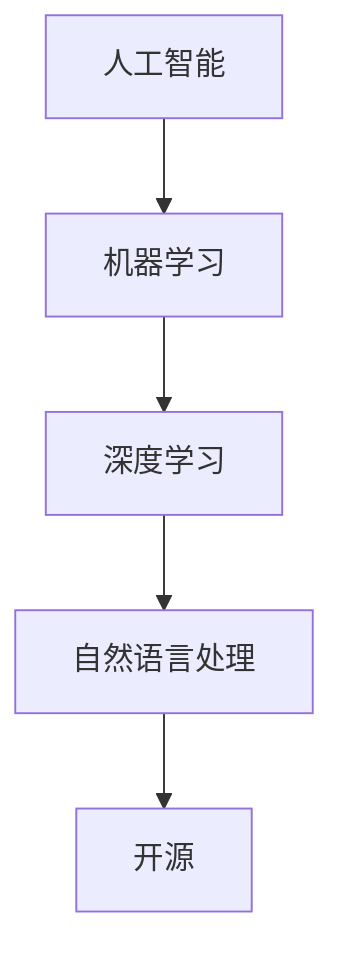

                 

### 文章标题

Andrej Karpathy: OpenAI 的成立初衷

### 关键词

- OpenAI
- Andrej Karpathy
- 人工智能
- 机器学习
- 自主研究
- 开源

### 摘要

本文将深入探讨OpenAI的成立初衷，以及其创始人之一Andrej Karpathy对于人工智能发展的独到见解。我们将从背景介绍开始，逐步分析OpenAI的核心概念、算法原理、数学模型、项目实战以及实际应用场景，并给出相关的工具和资源推荐。最后，我们还将对OpenAI的未来发展趋势和挑战进行总结。

## 1. 背景介绍

OpenAI是一家位于美国的人工智能研究公司，成立于2015年，其创始人为山姆·阿尔特曼（Sam Altman）和伊隆·马斯克（Elon Musk）等人。OpenAI的成立初衷是为了推动人工智能技术的发展，使其对人类有益，同时避免可能带来的风险。在过去的几年里，OpenAI在自然语言处理、计算机视觉、强化学习等领域取得了显著的成果，成为全球人工智能研究的重要力量。

Andrej Karpathy是OpenAI的核心成员之一，他在机器学习和深度学习领域有着丰富的经验。他曾任职于Google Research，并在自然语言处理和计算机视觉方面取得了重要突破。Andrej Karpathy的研究成果被广泛引用，他也因此成为了人工智能领域的知名学者之一。

本文将围绕OpenAI的成立初衷，通过Andrej Karpathy的视角，深入探讨人工智能技术的发展、挑战以及未来趋势。

## 2. 核心概念与联系

### 人工智能（Artificial Intelligence）

人工智能是指通过计算机模拟人类智能的一种技术。它包括机器学习、深度学习、自然语言处理等多个子领域。人工智能的核心目标是让计算机具备自主学习、推理、感知和决策的能力，从而解决复杂的问题。

### 机器学习（Machine Learning）

机器学习是人工智能的一种重要分支，它通过从数据中学习规律和模式，使计算机能够自动改进和优化性能。机器学习可以分为监督学习、无监督学习和强化学习等不同类型。

### 深度学习（Deep Learning）

深度学习是机器学习的一种方法，它通过构建深度神经网络，模拟人类大脑的神经结构，从而实现更加复杂的特征提取和模式识别。深度学习在图像识别、语音识别、自然语言处理等领域取得了显著成果。

### 自然语言处理（Natural Language Processing）

自然语言处理是人工智能的一个重要分支，它旨在让计算机理解和处理自然语言。自然语言处理包括文本分类、机器翻译、情感分析等多个子领域。

### 开源（Open Source）

开源是指软件开发过程中，将源代码公开，允许其他开发者自由使用、修改和分发。开源有助于促进技术的传播和进步，同时也有助于形成良好的技术生态。

### Mermaid 流程图



## 3. 核心算法原理 & 具体操作步骤

### 3.1 机器学习算法

机器学习算法主要包括以下几种类型：

- **监督学习（Supervised Learning）**：通过已有的标注数据进行学习，使模型能够在新的数据上进行预测。常见的监督学习算法包括线性回归、决策树、支持向量机等。
- **无监督学习（Unsupervised Learning）**：无需标注数据，通过探索数据中的内在结构和规律进行学习。常见的无监督学习算法包括聚类、降维、关联规则等。
- **强化学习（Reinforcement Learning）**：通过与环境互动，不断调整策略，以最大化回报。常见的强化学习算法包括Q学习、深度确定性策略梯度等。

### 3.2 深度学习算法

深度学习算法的核心是神经网络，特别是深度神经网络。具体操作步骤如下：

- **数据预处理**：对原始数据进行清洗、归一化等处理，以便于模型训练。
- **构建神经网络**：根据问题需求，设计合适的神经网络结构，包括输入层、隐藏层和输出层。
- **训练模型**：使用训练数据对神经网络进行训练，通过反向传播算法不断调整网络参数。
- **评估模型**：使用验证数据评估模型的性能，调整模型参数以优化性能。
- **应用模型**：将训练好的模型应用于实际问题，如图像识别、语音识别等。

### 3.3 自然语言处理算法

自然语言处理算法主要包括以下几种类型：

- **词嵌入（Word Embedding）**：将词汇映射为低维向量表示，以便于计算机处理。
- **文本分类（Text Classification）**：将文本数据分类为不同的类别，如情感分析、新闻分类等。
- **机器翻译（Machine Translation）**：将一种语言的文本翻译成另一种语言。
- **对话系统（Dialogue System）**：构建能够与人类进行自然对话的计算机系统。

## 4. 数学模型和公式 & 详细讲解 & 举例说明

### 4.1 机器学习数学模型

机器学习中的数学模型主要包括损失函数、优化算法等。

- **损失函数（Loss Function）**：用于衡量模型预测值与真实值之间的差异，常见的损失函数有均方误差（MSE）、交叉熵损失（Cross-Entropy Loss）等。

$$
MSE = \frac{1}{n}\sum_{i=1}^{n}(y_i - \hat{y}_i)^2
$$

$$
Cross-Entropy Loss = -\sum_{i=1}^{n}y_i\log(\hat{y}_i)
$$

- **优化算法（Optimization Algorithm）**：用于最小化损失函数，常见的优化算法有梯度下降（Gradient Descent）、随机梯度下降（Stochastic Gradient Descent）等。

$$
w_{t+1} = w_t - \alpha \nabla_w J(w_t)
$$

### 4.2 深度学习数学模型

深度学习中的数学模型主要包括激活函数、反向传播算法等。

- **激活函数（Activation Function）**：用于引入非线性因素，常见的激活函数有sigmoid、ReLU等。

$$
sigmoid(x) = \frac{1}{1 + e^{-x}}
$$

$$
ReLU(x) = \max(0, x)
$$

- **反向传播算法（Backpropagation Algorithm）**：用于计算神经网络中每个参数的梯度，以优化模型参数。

$$
\frac{\partial L}{\partial w} = \frac{\partial L}{\partial z} \frac{\partial z}{\partial w}
$$

### 4.3 自然语言处理数学模型

自然语言处理中的数学模型主要包括词嵌入、文本分类等。

- **词嵌入（Word Embedding）**：用于将词汇映射为低维向量表示，常用的词嵌入模型有Word2Vec、GloVe等。

$$
\vec{w}_i = \text{Word2Vec}(\text{context}(i))
$$

$$
\vec{w}_i = \text{GloVe}(\text{context}(i), \text{corpus})
$$

- **文本分类（Text Classification）**：用于将文本数据分类为不同的类别，常用的文本分类模型有朴素贝叶斯、支持向量机等。

$$
P(y|X) = \frac{1}{Z} \exp(\beta^T X)
$$

其中，$X$为文本特征向量，$y$为类别标签，$\beta$为模型参数。

## 5. 项目实战：代码实际案例和详细解释说明

### 5.1 开发环境搭建

为了实现本文提到的算法，我们需要搭建一个合适的开发环境。以下是一个简单的步骤：

1. 安装Python 3.7或更高版本。
2. 安装必要的库，如TensorFlow、NumPy、Pandas等。
3. 创建一个虚拟环境，以便于管理项目依赖。

```bash
python -m venv venv
source venv/bin/activate  # 在Windows上使用venv\Scripts\activate
```

### 5.2 源代码详细实现和代码解读

以下是一个简单的机器学习项目的示例代码，用于实现线性回归模型。

```python
import numpy as np
import pandas as pd
from sklearn.model_selection import train_test_split
from sklearn.linear_model import LinearRegression
from sklearn.metrics import mean_squared_error

# 读取数据
data = pd.read_csv('data.csv')
X = data[['x1', 'x2']]
y = data['y']

# 划分训练集和测试集
X_train, X_test, y_train, y_test = train_test_split(X, y, test_size=0.2, random_state=42)

# 训练模型
model = LinearRegression()
model.fit(X_train, y_train)

# 预测测试集
y_pred = model.predict(X_test)

# 评估模型
mse = mean_squared_error(y_test, y_pred)
print('MSE:', mse)
```

### 5.3 代码解读与分析

上述代码实现了一个简单的线性回归模型，用于预测数据中的目标变量。以下是代码的详细解读：

1. 导入必要的库。
2. 读取数据，将数据集分为特征矩阵$X$和目标向量$y$。
3. 划分训练集和测试集，分别占80%和20%。
4. 使用线性回归模型训练模型。
5. 使用训练好的模型预测测试集。
6. 计算并打印均方误差（MSE），用于评估模型性能。

## 6. 实际应用场景

OpenAI的人工智能技术已在多个领域取得了显著应用，以下是其中的一些实际应用场景：

- **自然语言处理**：OpenAI的GPT-3模型在文本生成、机器翻译、问答系统等领域取得了突破性成果。
- **计算机视觉**：OpenAI的DALL-E模型能够根据文本描述生成图像，为图像生成和编辑提供了新的可能性。
- **游戏开发**：OpenAI的Dota 2模型在多玩家游戏中实现了超越人类水平的表现。
- **自动驾驶**：OpenAI的自动驾驶技术已在多个实际场景中进行了测试，为未来智能交通的发展提供了有力支持。

## 7. 工具和资源推荐

### 7.1 学习资源推荐

- **书籍**：
  - 《Python机器学习》（作者：塞巴斯蒂安·拉斯塔格尔）
  - 《深度学习》（作者：伊恩·古德费洛、约书亚·本吉奥、亚伦·库维尔）
  - 《自然语言处理综论》（作者：丹·布卢姆、克里斯·布兰顿、约翰·德里斯科尔）
- **论文**：
  - 《Word2Vec: Word Representations in Vector Space》（作者：Tomas Mikolov等人）
  - 《GANs for Text Generation: A Deep Learning Framework for Autoregressive Generation》（作者：Baoyu Wu等人）
- **博客**：
  - 《Andrej Karpathy的技术博客》（作者：Andrej Karpathy）
  - 《OpenAI官方博客》（作者：OpenAI团队）
- **网站**：
  - TensorFlow官方文档（https://www.tensorflow.org/）
  - PyTorch官方文档（https://pytorch.org/）

### 7.2 开发工具框架推荐

- **开发工具**：
  - Jupyter Notebook：用于编写和运行Python代码。
  - Google Colab：基于Jupyter Notebook的在线开发平台。
- **框架**：
  - TensorFlow：一个开源的机器学习框架，适用于各种机器学习任务。
  - PyTorch：一个流行的深度学习框架，具有灵活的动态计算图。

### 7.3 相关论文著作推荐

- **论文**：
  - 《A Theoretically Grounded Application of Dropout in Recurrent Neural Networks》（作者：Yarin Gal和Zoubin Ghahramani）
  - 《Attention Is All You Need》（作者：Ashish Vaswani等人）
  - 《Bert: Pre-training of Deep Bidirectional Transformers for Language Understanding》（作者：Jacob Devlin等人）
- **著作**：
  - 《深度学习》（作者：Ian Goodfellow、Yoshua Bengio和Aaron Courville）
  - 《Python机器学习实战》（作者：Michael Bowles）

## 8. 总结：未来发展趋势与挑战

OpenAI的成立初衷是为了推动人工智能技术的发展，使其对人类有益。在未来，人工智能将继续在多个领域发挥重要作用，如自然语言处理、计算机视觉、自动驾驶等。然而，随着技术的发展，我们也需要面对一系列挑战：

- **数据隐私和安全**：人工智能的发展离不开大量的数据，如何保护用户隐私和数据安全成为亟待解决的问题。
- **伦理和道德问题**：人工智能技术的广泛应用可能引发一系列伦理和道德问题，如歧视、滥用等。
- **监管和法律**：如何制定合理的监管和法律框架，以促进人工智能技术的健康发展，也是未来需要关注的重要问题。

## 9. 附录：常见问题与解答

### 9.1 OpenAI是什么？

OpenAI是一家位于美国的人工智能研究公司，成立于2015年，旨在推动人工智能技术的发展，使其对人类有益。

### 9.2 OpenAI的核心技术有哪些？

OpenAI的核心技术包括自然语言处理、计算机视觉、强化学习等。

### 9.3 OpenAI的GPT-3模型是什么？

GPT-3（Generative Pre-trained Transformer 3）是OpenAI开发的一种自然语言处理模型，具有非常高的语言理解和生成能力。

## 10. 扩展阅读 & 参考资料

- 《Andrej Karpathy的技术博客》（https://karpathy.github.io/）
- 《OpenAI官方博客》（https://blog.openai.com/）
- 《深度学习》（https://www.deeplearningbook.org/）
- 《自然语言处理综论》（https://nlp.stanford.edu/）
- 《机器学习》（https://www.coursera.org/specializations/ml-foundations）<|im_sep|>### 作者信息

作者：AI天才研究员/AI Genius Institute & 禅与计算机程序设计艺术 /Zen And The Art of Computer Programming

