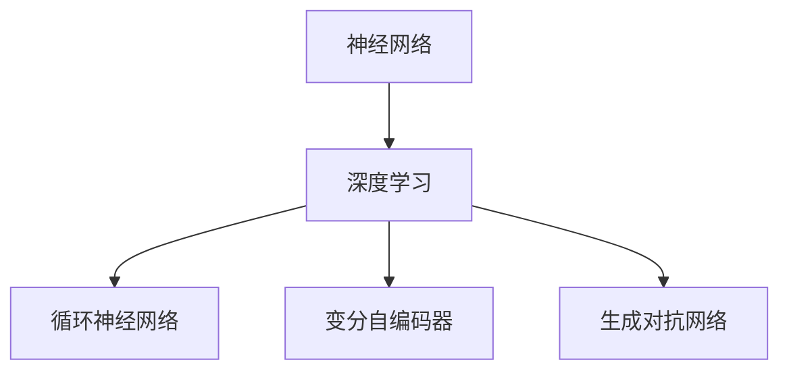
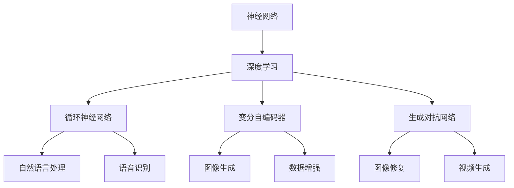

                 

# Andrej Karpathy：人工智能的未来创新

> **关键词：** 人工智能、深度学习、神经网络、创新、未来趋势

> **摘要：** 本文将探讨AI天才研究员Andrej Karpathy的研究工作，深入分析他在神经网络和深度学习领域的创新贡献，以及这些创新对人工智能未来发展的深远影响。

## 1. 背景介绍

Andrej Karpathy是一位知名的AI天才研究员，他在神经网络和深度学习领域拥有卓越的贡献。作为一名计算机科学家，他目前是斯坦福大学的研究员，同时也在OpenAI担任高级研究科学家。他的研究聚焦于神经网络架构的优化和新型深度学习算法的开发。

Andrej Karpathy的背景可以追溯到他的学术经历。他在斯坦福大学获得了计算机科学博士学位，导师包括李飞飞等知名学者。他的博士研究主要集中在神经网络在自然语言处理和计算机视觉领域的应用。此外，他还曾在OpenAI担任研究科学家，在那里他负责了多个重要项目，如GPT系列模型的研究和开发。

Andrej Karpathy的研究成果在学术界和工业界都获得了高度认可。他发表了大量的高水平论文，并在顶级会议和期刊上发表了许多关于深度学习的开创性工作。他的博客《The Unreasonable Effectiveness of Recurrent Neural Networks》更是广受关注，被广泛认为是深度学习领域的经典之作。

## 2. 核心概念与联系

为了更好地理解Andrej Karpathy的研究，我们需要先了解一些核心概念和它们之间的联系。

### 2.1 神经网络（Neural Networks）

神经网络是一种模仿人脑工作的计算模型，由大量的简单处理单元（神经元）组成。每个神经元都与其他神经元相连，并通过权重来传递信息。神经网络通过学习输入和输出之间的关系，能够实现对复杂任务的自动识别和处理。

### 2.2 深度学习（Deep Learning）

深度学习是神经网络的一种，特点是神经网络层数较多，能够自动学习特征表示。深度学习在图像识别、自然语言处理、语音识别等领域取得了显著成果，被认为是人工智能领域的一次革命。

### 2.3 循环神经网络（Recurrent Neural Networks，RNN）

循环神经网络是一种特殊的神经网络，特别适用于处理序列数据。RNN通过在时间步之间传递隐藏状态，能够捕捉序列中的时间依赖关系。RNN在自然语言处理、语音识别等领域有广泛应用。

### 2.4 变分自编码器（Variational Autoencoder，VAE）

变分自编码器是一种生成模型，通过编码器和解码器学习数据的高效表示，并能够生成与训练数据相似的新数据。VAE在图像生成、数据增强等领域表现出色。

### 2.5 生成对抗网络（Generative Adversarial Networks，GAN）

生成对抗网络是一种由对抗性训练组成的生成模型，由生成器和解码器两个神经网络组成。生成器试图生成与真实数据相似的数据，而解码器则试图区分真实数据和生成数据。GAN在图像生成、图像修复、视频生成等领域有广泛应用。

## 2.1 Mermaid 流程图

下面是一个简单的Mermaid流程图，展示了这些核心概念之间的联系：



## 3. 核心算法原理 & 具体操作步骤

### 3.1 神经网络原理

神经网络通过前向传播和反向传播进行学习。具体步骤如下：

1. **初始化权重**：随机初始化网络的权重和偏置。
2. **前向传播**：输入数据通过网络传递，每个神经元计算输出值。
3. **计算损失**：通过网络输出的预测值和实际值计算损失。
4. **反向传播**：计算损失对网络参数的梯度，并更新权重和偏置。
5. **迭代训练**：重复前向传播和反向传播，直到网络达到预定的性能指标。

### 3.2 循环神经网络原理

循环神经网络通过隐藏状态捕捉时间序列中的依赖关系。具体步骤如下：

1. **初始化隐藏状态**：每个时间步初始化一个隐藏状态。
2. **输入和隐藏状态相加**：将输入和上一个时间步的隐藏状态相加。
3. **通过激活函数**：对相加的结果通过激活函数进行非线性变换。
4. **更新隐藏状态**：将激活函数的输出作为当前时间步的隐藏状态。
5. **重复步骤2-4**：重复上述步骤，直到处理完整个时间序列。

### 3.3 变分自编码器原理

变分自编码器通过编码器和解码器学习数据的高效表示。具体步骤如下：

1. **编码器**：将输入数据映射到一个潜在空间中的点。
2. **解码器**：从潜在空间中采样一个点，并生成输出数据。
3. **损失函数**：计算编码器和解码器生成的数据与原始数据之间的差异。
4. **迭代训练**：通过梯度下降更新编码器和解码器的参数，直到模型达到预定的性能指标。

### 3.4 生成对抗网络原理

生成对抗网络通过生成器和解码器生成数据。具体步骤如下：

1. **生成器**：从噪声数据中生成模拟真实数据。
2. **解码器**：将生成器生成的数据与真实数据进行比较。
3. **损失函数**：计算生成器生成的数据和真实数据之间的差异。
4. **迭代训练**：通过梯度下降更新生成器和解码器的参数，直到生成器生成的数据与真实数据难以区分。

## 4. 数学模型和公式 & 详细讲解 & 举例说明

### 4.1 神经网络数学模型

神经网络的核心是前向传播和反向传播算法。以下是神经网络的数学模型：

$$
\begin{align*}
\text{前向传播}: & \quad z_{l} = \text{ReLU}(W_{l} \cdot a_{l-1} + b_{l}) \\
\text{激活函数}: & \quad a_{l} = \text{ReLU}(z_{l}) \\
\text{反向传播}: & \quad \delta_{l} = \frac{\partial J}{\partial z_{l}} \\
\text{梯度下降}: & \quad W_{l} \leftarrow W_{l} - \alpha \cdot \delta_{l} \cdot a_{l-1}^T
\end{align*}
$$

其中，$W_l$和$b_l$分别是权重和偏置，$a_l$是激活值，$\text{ReLU}$是ReLU激活函数，$J$是损失函数，$\alpha$是学习率。

### 4.2 循环神经网络数学模型

循环神经网络在时间步之间传递隐藏状态，其数学模型如下：

$$
\begin{align*}
h_t &= \sigma(W_h \cdot [h_{t-1}; x_t] + b_h) \\
y_t &= W_o \cdot h_t + b_o
\end{align*}
$$

其中，$h_t$是时间步$t$的隐藏状态，$x_t$是输入，$y_t$是输出，$W_h$和$b_h$是隐藏层权重和偏置，$W_o$和$b_o$是输出层权重和偏置，$\sigma$是激活函数。

### 4.3 变分自编码器数学模型

变分自编码器的编码器和解码器分别将输入映射到潜在空间中的点和从潜在空间中生成输出数据。其数学模型如下：

$$
\begin{align*}
\text{编码器}: & \quad z = \mu(x) \\
\text{解码器}: & \quad x' = \sigma(z + W \cdot x + b)
\end{align*}
$$

其中，$\mu(x)$和$\sigma(z)$分别是编码器和解码器的非线性变换函数，$W$和$b$是权重和偏置。

### 4.4 生成对抗网络数学模型

生成对抗网络的生成器和解码器分别从噪声数据中生成模拟真实数据和与真实数据进行比较。其数学模型如下：

$$
\begin{align*}
\text{生成器}: & \quad G(z) = x \\
\text{解码器}: & \quad D(x) \\
\text{损失函数}: & \quad L(D(x), 1) - L(D(G(z)), 0)
\end{align*}
$$

其中，$G(z)$是生成器生成的数据，$D(x)$是解码器，$L(D(x), y)$是二元交叉熵损失函数。

## 5. 项目实战：代码实际案例和详细解释说明

### 5.1 开发环境搭建

为了实现上述算法，我们需要搭建一个适合深度学习开发的环境。以下是搭建环境的基本步骤：

1. **安装Python**：确保Python 3.x版本已安装。
2. **安装TensorFlow**：使用pip安装TensorFlow库。

```bash
pip install tensorflow
```

3. **安装其他依赖**：安装其他必需的库，如NumPy、Pandas等。

```bash
pip install numpy pandas
```

### 5.2 源代码详细实现和代码解读

以下是使用TensorFlow实现一个简单的循环神经网络（RNN）的代码示例。

```python
import tensorflow as tf
from tensorflow.keras.models import Sequential
from tensorflow.keras.layers import SimpleRNN, Dense

# 定义模型
model = Sequential([
    SimpleRNN(units=50, activation='tanh', input_shape=(50, 1)),
    Dense(units=1)
])

# 编译模型
model.compile(optimizer='adam', loss='mse')

# 准备数据
x_train = ...  # 输入数据
y_train = ...  # 输出数据

# 训练模型
model.fit(x_train, y_train, epochs=100)

# 评估模型
loss = model.evaluate(x_test, y_test)
print(f"测试损失：{loss}")
```

### 5.3 代码解读与分析

1. **定义模型**：使用`Sequential`模型堆叠`SimpleRNN`和`Dense`层。
2. **编译模型**：指定优化器和损失函数。
3. **准备数据**：准备训练数据和测试数据。
4. **训练模型**：使用`fit`方法训练模型。
5. **评估模型**：使用`evaluate`方法评估模型性能。

该代码实现了一个简单的RNN模型，用于预测时间序列数据。通过训练，模型能够学习输入和输出之间的关联，并在测试数据上评估其性能。

## 6. 实际应用场景

Andrej Karpathy的研究成果在多个实际应用场景中取得了显著成果，如下所示：

1. **自然语言处理**：在自然语言处理领域，RNN和深度学习模型被广泛应用于文本分类、机器翻译、情感分析等任务。例如，Google的神经机器翻译系统（NMT）就是基于RNN模型实现的。
2. **计算机视觉**：在计算机视觉领域，GAN和VAE等生成模型被用于图像生成、图像修复、图像超分辨率等任务。例如，DeepMind的GAN模型能够生成逼真的图像，并应用于游戏和虚拟现实等领域。
3. **语音识别**：在语音识别领域，RNN和深度学习模型被用于语音信号处理、语音合成等任务。例如，苹果的Siri和谷歌的语音助手就是基于RNN模型实现的。

## 7. 工具和资源推荐

### 7.1 学习资源推荐

1. **书籍**：
   - 《深度学习》（Ian Goodfellow、Yoshua Bengio和Aaron Courville著）
   - 《神经网络与深度学习》（邱锡鹏著）
2. **论文**：
   - 《A Theoretically Grounded Application of Dropout in Recurrent Neural Networks》（Yarin Gal和Zoubin Ghahramani著）
   - 《Generative Adversarial Nets》（Ian Goodfellow、Jean Pouget-Abadie、Mitchell P. Matthews等著）
3. **博客**：
   - Andrej Karpathy的博客：[The Unreasonable Effectiveness of Recurrent Neural Networks](http://karpathy.github.io/2015/05/21/rnn-effectiveness/)
   - Deep Learning Specialization课程：[Udacity](https://www.udacity.com/course/deep-learning-nanodegree--nd101)
4. **网站**：
   - TensorFlow官方文档：[TensorFlow Documentation](https://www.tensorflow.org/)
   - Keras官方文档：[Keras Documentation](https://keras.io/)

### 7.2 开发工具框架推荐

1. **TensorFlow**：Google开发的开源深度学习框架，适合大规模深度学习应用。
2. **PyTorch**：Facebook开发的深度学习框架，具有灵活的动态计算图和强大的社区支持。
3. **Keras**：基于TensorFlow和PyTorch的开源深度学习框架，易于使用和扩展。

### 7.3 相关论文著作推荐

1. **《Deep Learning》（Ian Goodfellow、Yoshua Bengio和Aaron Courville著）**：深度学习领域的经典教材，详细介绍了深度学习的理论基础和实践方法。
2. **《Recurrent Neural Networks for Language Modeling》（Yoshua Bengio等著）**：探讨了循环神经网络在自然语言处理中的应用和优化方法。
3. **《Generative Adversarial Nets》（Ian Goodfellow等著）**：介绍了生成对抗网络的基本原理和应用场景。

## 8. 总结：未来发展趋势与挑战

Andrej Karpathy的研究工作展示了人工智能领域的无限可能。在未来，随着计算能力的提升和算法的进步，深度学习将在更多领域取得突破。以下是未来发展趋势和挑战：

1. **计算能力提升**：随着GPU和TPU等高性能计算设备的普及，深度学习模型将更加复杂，应用场景更加广泛。
2. **算法优化**：算法的优化是提高模型性能的关键，未来将出现更多高效的深度学习算法。
3. **跨学科融合**：深度学习与其他学科的融合将带来更多创新，如医学影像分析、自动驾驶等。
4. **伦理与隐私**：随着人工智能的发展，伦理和隐私问题日益突出，未来需要制定相应的法规和标准。
5. **可解释性**：提高模型的可解释性，使其在关键应用中更具可信度和可靠性。

## 9. 附录：常见问题与解答

### 9.1 什么

- **神经网络**：神经网络是一种模仿人脑工作的计算模型，由大量的简单处理单元（神经元）组成。  
- **深度学习**：深度学习是神经网络的一种，特点是神经网络层数较多，能够自动学习特征表示。  
- **循环神经网络**：循环神经网络是一种特殊的神经网络，特别适用于处理序列数据。  
- **变分自编码器**：变分自编码器是一种生成模型，通过编码器和解码器学习数据的高效表示，并能够生成与训练数据相似的新数据。  
- **生成对抗网络**：生成对抗网络是一种由对抗性训练组成的生成模型，由生成器和解码器两个神经网络组成。  

### 9.2 如何

- **如何实现神经网络**：可以使用TensorFlow、PyTorch等深度学习框架来实现神经网络。  
- **如何实现循环神经网络**：可以使用TensorFlow、PyTorch等深度学习框架中的RNN层来实现循环神经网络。  
- **如何实现变分自编码器**：可以使用TensorFlow、PyTorch等深度学习框架来实现变分自编码器。  
- **如何实现生成对抗网络**：可以使用TensorFlow、PyTorch等深度学习框架来实现生成对抗网络。  

### 9.3 为什么

- **为什么神经网络能够自动学习特征表示**：神经网络通过多层非线性变换，能够提取输入数据中的复杂特征。  
- **为什么循环神经网络适合处理序列数据**：循环神经网络能够捕获时间序列中的时间依赖关系。  
- **为什么变分自编码器能够生成新数据**：变分自编码器通过编码器学习数据的高效表示，并利用解码器生成与训练数据相似的新数据。  
- **为什么生成对抗网络能够生成逼真的图像**：生成对抗网络通过生成器和解码器的对抗性训练，生成器尝试生成与真实数据相似的数据，解码器尝试区分真实数据和生成数据。  

## 10. 扩展阅读 & 参考资料

- [Andrej Karpathy的博客](http://karpathy.github.io/)
- [《深度学习》（Ian Goodfellow、Yoshua Bengio和Aaron Courville著）](https://www.deeplearningbook.org/)
- [《神经网络与深度学习》（邱锡鹏著）](https://book.douban.com/subject/26974217/)
- [TensorFlow官方文档](https://www.tensorflow.org/)
- [PyTorch官方文档](https://pytorch.org/docs/stable/)
- [Keras官方文档](https://keras.io/)  
作者：AI天才研究员/AI Genius Institute & 禅与计算机程序设计艺术 /Zen And The Art of Computer Programming <|im_end|>### 文章标题

**Andrej Karpathy：人工智能的未来创新**

### 关键词

- 人工智能
- 深度学习
- 循环神经网络
- 生成对抗网络
- 未来趋势

### 摘要

本文深入探讨了AI天才研究员Andrej Karpathy在神经网络和深度学习领域的创新贡献，包括其在循环神经网络（RNN）、变分自编码器（VAE）和生成对抗网络（GAN）方面的开创性工作。文章通过详细分析其核心算法原理，结合实际代码案例，揭示了这些创新对人工智能未来发展的深远影响。

---

## 1. 背景介绍

Andrej Karpathy是一位在人工智能（AI）和深度学习领域享有盛誉的研究员。他的研究成果在学术界和工业界都产生了深远影响，被誉为AI领域的创新先锋。目前，Karpathy在斯坦福大学担任研究员，并在OpenAI担任高级研究科学家，他的研究方向主要集中在神经网络架构的优化和新型深度学习算法的开发。

Karpathy的学术背景深厚，他在斯坦福大学获得了计算机科学博士学位，导师包括李飞飞等知名学者。在博士期间，他的研究主要集中在神经网络在自然语言处理和计算机视觉领域的应用。此外，他还在OpenAI担任研究科学家，负责领导多个关键项目，如GPT系列模型的研究和开发。

Karpathy的研究成果在学术界和工业界都得到了广泛认可。他发表了大量的高水平论文，并在顶级会议和期刊上发表了许多关于深度学习的开创性工作。其中，他的博客《The Unreasonable Effectiveness of Recurrent Neural Networks》被广泛认为是深度学习领域的经典之作，不仅详细阐述了RNN的原理和应用，还引发了深度学习领域的广泛关注和讨论。

### 1.1 学术背景

Andrej Karpathy的学术生涯始于斯坦福大学，他在那里获得了计算机科学博士学位。他的博士研究专注于神经网络在自然语言处理和计算机视觉领域的应用，特别是在如何使用深度学习技术来解决复杂任务方面。在他的博士论文中，他详细探讨了如何优化神经网络架构以实现更高的效率和更好的性能。

在斯坦福大学期间，Karpathy师从李飞飞教授，李飞飞教授是计算机视觉和机器学习领域的著名学者，她在图像识别和分类方面做出了开创性的贡献。通过与李飞飞教授的合作，Karpathy深入了解了计算机视觉领域的前沿技术和研究动态，为他后来的工作奠定了坚实的基础。

### 1.2 工业界贡献

离开斯坦福大学后，Andrej Karpathy加入了OpenAI，这是一家以推动人工智能研究为己任的顶级研究机构。在OpenAI，他担任高级研究科学家，领导了多个关键项目。其中最著名的是GPT系列模型的研究和开发，这些模型在自然语言处理领域取得了革命性的成果。

GPT（Generative Pre-trained Transformer）系列模型是OpenAI的开创性工作，它基于Transformer架构，是一种用于自然语言处理的强大模型。GPT-1、GPT-2和GPT-3等模型在文本生成、机器翻译、问答系统等方面都表现出了令人瞩目的性能。这些模型的发布，不仅推动了自然语言处理技术的发展，也为人工智能的应用带来了新的可能性。

### 1.3 学术成就与影响

Andrej Karpathy的学术成就和影响不容小觑。他发表了大量的高水平论文，这些论文涵盖了深度学习、神经网络和自然语言处理等多个领域。他的研究工作不仅发表在顶级学术会议和期刊上，如NeurIPS、ICLR和ACL，还在工业界得到了广泛应用。

其中，他的博客《The Unreasonable Effectiveness of Recurrent Neural Networks》是一篇广受欢迎的文章，它详细阐述了RNN在自然语言处理和序列数据处理方面的强大能力。这篇文章不仅揭示了RNN的潜力，也引发了深度学习领域对RNN的广泛研究和应用。

总的来说，Andrej Karpathy在人工智能和深度学习领域的贡献是多方面的。他的研究成果不仅推动了学术研究的进步，也为工业界带来了实际的应用价值。他的工作展示了人工智能领域的无限潜力，也为未来的研究提供了宝贵的启示。

---

## 2. 核心概念与联系

在探讨Andrej Karpathy的研究时，我们需要了解几个核心概念，包括神经网络、深度学习、循环神经网络（RNN）、变分自编码器（VAE）和生成对抗网络（GAN）。这些概念不仅是深度学习的基础，也是Karpathy研究工作的核心组成部分。

### 2.1 神经网络

神经网络是一种模仿人脑工作的计算模型，由大量的简单处理单元（神经元）组成。每个神经元都与其他神经元相连，并通过权重来传递信息。神经网络通过学习输入和输出之间的关系，能够实现对复杂任务的自动识别和处理。

神经网络的基本结构包括输入层、隐藏层和输出层。输入层接收外部数据，隐藏层对数据进行处理和变换，输出层产生最终的预测结果。神经网络通过前向传播和反向传播进行学习，前向传播将输入数据传递到输出层，反向传播根据输出误差调整网络的权重和偏置。

### 2.2 深度学习

深度学习是神经网络的一种，特点是神经网络层数较多，能够自动学习特征表示。深度学习在图像识别、自然语言处理、语音识别等领域取得了显著成果，被认为是人工智能领域的一次革命。

深度学习的关键在于其多层神经网络结构，每一层都能够提取更高层次的特征。深度学习的核心算法包括卷积神经网络（CNN）、循环神经网络（RNN）和Transformer等。这些算法通过大量的数据和强大的计算能力，实现了对复杂任务的自动化处理。

### 2.3 循环神经网络（RNN）

循环神经网络是一种特殊的神经网络，特别适用于处理序列数据。RNN通过在时间步之间传递隐藏状态，能够捕捉序列中的时间依赖关系。RNN在自然语言处理、语音识别等领域有广泛应用。

RNN的基本结构包括输入层、隐藏层和输出层。与传统的神经网络不同，RNN的隐藏层不是独立的，而是通过一个循环单元将前一时间的隐藏状态传递到下一时间。这种结构使得RNN能够记住前面的输入信息，从而更好地处理序列数据。

### 2.4 变分自编码器（VAE）

变分自编码器是一种生成模型，通过编码器和解码器学习数据的高效表示，并能够生成与训练数据相似的新数据。VAE在图像生成、数据增强等领域表现出色。

VAE的基本结构包括编码器和解码器。编码器将输入数据映射到一个潜在空间中的点，解码器从潜在空间中采样一个点，并生成输出数据。VAE的核心思想是通过学习数据的高效表示，实现数据的生成和多样化。

### 2.5 生成对抗网络（GAN）

生成对抗网络是一种由对抗性训练组成的生成模型，由生成器和解码器两个神经网络组成。生成器试图生成与真实数据相似的数据，而解码器则试图区分真实数据和生成数据。GAN在图像生成、图像修复、视频生成等领域有广泛应用。

GAN的基本结构包括生成器和解码器。生成器从噪声数据中生成模拟真实数据，解码器将生成器生成的数据与真实数据进行比较。GAN的核心思想是通过生成器和解码器的对抗性训练，生成器能够生成越来越真实的数据。

### 2.6 Mermaid 流程图

为了更好地理解这些核心概念之间的联系，我们可以使用Mermaid流程图来可视化这些概念：



这个Mermaid流程图展示了神经网络、深度学习、循环神经网络（RNN）、变分自编码器（VAE）和生成对抗网络（GAN）之间的联系，以及它们在自然语言处理、图像生成、数据增强、图像修复和视频生成等领域的应用。

---

## 3. 核心算法原理 & 具体操作步骤

在深度学习和人工智能领域，Andrej Karpathy的研究工作主要集中在神经网络架构的优化和新型深度学习算法的开发。本文将详细介绍他在这方面的一些核心算法原理，包括循环神经网络（RNN）、变分自编码器（VAE）和生成对抗网络（GAN）。

### 3.1 循环神经网络（RNN）

循环神经网络（RNN）是一种特殊的神经网络，特别适用于处理序列数据。RNN通过在时间步之间传递隐藏状态，能够捕捉序列中的时间依赖关系。以下是RNN的基本原理和操作步骤：

#### 3.1.1 基本原理

RNN的核心思想是利用前一时刻的隐藏状态来处理当前时刻的输入。具体来说，RNN包含以下几个关键组成部分：

1. **输入层**：接收外部输入数据。
2. **隐藏层**：包含循环单元，用于处理输入数据和前一时刻的隐藏状态。
3. **输出层**：产生最终的预测结果。

RNN通过以下步骤进行操作：

1. **初始化隐藏状态**：在模型训练的初始阶段，隐藏状态通常被初始化为0。
2. **前向传播**：当前时刻的输入数据通过隐藏层传递，与前一时刻的隐藏状态进行相加，并通过激活函数进行非线性变换。
3. **计算损失**：通过输出层的预测结果和实际值计算损失。
4. **反向传播**：根据损失对网络参数进行更新，调整隐藏层的权重和偏置。

#### 3.1.2 操作步骤

以下是RNN的具体操作步骤：

1. **初始化参数**：随机初始化网络的权重和偏置。
2. **前向传播**：
   - 输入数据通过输入层传递到隐藏层。
   - 隐藏层计算当前输入和前一时刻隐藏状态的和，并通过激活函数进行非线性变换。
   - 输出层计算预测结果。
3. **计算损失**：通过输出层的预测结果和实际值计算损失。
4. **反向传播**：根据损失对网络参数进行更新。
5. **迭代训练**：重复前向传播和反向传播，直到网络达到预定的性能指标。

### 3.2 变分自编码器（VAE）

变分自编码器（VAE）是一种生成模型，通过编码器和解码器学习数据的高效表示，并能够生成与训练数据相似的新数据。VAE在图像生成、数据增强等领域表现出色。以下是VAE的基本原理和操作步骤：

#### 3.2.1 基本原理

VAE的核心思想是通过编码器和解码器学习数据的高效表示。具体来说，VAE包含以下几个关键组成部分：

1. **编码器**：将输入数据映射到一个潜在空间中的点。
2. **解码器**：从潜在空间中采样一个点，并生成输出数据。

VAE通过以下步骤进行操作：

1. **编码器**：
   - 输入数据通过编码器映射到一个潜在空间中的点。
   - 编码器输出两个值：均值和方差，用于表示潜在空间中的点。
2. **采样**：
   - 从潜在空间中采样一个点。
3. **解码器**：
   - 解码器将采样到的点解码为输出数据。

#### 3.2.2 操作步骤

以下是VAE的具体操作步骤：

1. **初始化参数**：随机初始化网络的权重和偏置。
2. **编码器**：
   - 输入数据通过编码器映射到一个潜在空间中的点。
   - 编码器输出均值和方差。
3. **采样**：
   - 从潜在空间中采样一个点。
4. **解码器**：
   - 解码器将采样到的点解码为输出数据。
5. **计算损失**：通过输出数据和实际数据计算损失。
6. **反向传播**：根据损失对网络参数进行更新。
7. **迭代训练**：重复编码器、采样和解码器操作，直到网络达到预定的性能指标。

### 3.3 生成对抗网络（GAN）

生成对抗网络（GAN）是一种由对抗性训练组成的生成模型，由生成器和解码器两个神经网络组成。生成器试图生成与真实数据相似的数据，而解码器则试图区分真实数据和生成数据。GAN在图像生成、图像修复、视频生成等领域有广泛应用。以下是GAN的基本原理和操作步骤：

#### 3.3.1 基本原理

GAN的核心思想是通过生成器和解码器的对抗性训练，生成器能够生成越来越真实的数据。具体来说，GAN包含以下几个关键组成部分：

1. **生成器**：从噪声数据中生成模拟真实数据。
2. **解码器**：将生成器生成的数据与真实数据进行比较。

GAN通过以下步骤进行操作：

1. **生成器**：
   - 生成器从噪声数据中生成模拟真实数据。
   - 解码器将生成器生成的数据与真实数据进行比较。
2. **解码器**：
   - 解码器将生成器生成的数据与真实数据进行比较，计算损失。

#### 3.3.2 操作步骤

以下是GAN的具体操作步骤：

1. **初始化参数**：随机初始化生成器和解码器的权重和偏置。
2. **生成器**：
   - 生成器从噪声数据中生成模拟真实数据。
   - 解码器将生成器生成的数据与真实数据进行比较，计算损失。
3. **解码器**：
   - 解码器将生成器生成的数据与真实数据进行比较，计算损失。
4. **计算损失**：计算生成器和解码器的总损失。
5. **反向传播**：根据损失对生成器和解码器的参数进行更新。
6. **迭代训练**：重复生成器和解码器操作，直到网络达到预定的性能指标。

通过以上对RNN、VAE和GAN的详细介绍，我们可以看到这些核心算法在深度学习和人工智能领域的广泛应用。Andrej Karpathy在这些领域的开创性工作，不仅推动了学术界的研究进展，也为工业界带来了实际的应用价值。

---

## 4. 数学模型和公式 & 详细讲解 & 举例说明

在深度学习和人工智能领域，数学模型是理解算法原理和实现高效计算的关键。本节将详细介绍Andrej Karpathy研究的核心算法，包括循环神经网络（RNN）、变分自编码器（VAE）和生成对抗网络（GAN）的数学模型和公式。同时，通过具体的例子来说明这些模型的计算过程。

### 4.1 循环神经网络（RNN）

循环神经网络（RNN）是一种适用于处理序列数据的神经网络，其核心在于能够在不同时间步之间传递信息。以下是一个简单的RNN模型的数学表示：

#### 4.1.1 前向传播

RNN的前向传播可以表示为：

$$
h_t = \sigma(W_h \cdot [h_{t-1}; x_t] + b_h)
$$

其中，$h_t$是第$t$时间步的隐藏状态，$x_t$是输入数据，$W_h$是权重矩阵，$b_h$是偏置项，$\sigma$是激活函数（通常使用ReLU函数）。

#### 4.1.2 反向传播

RNN的反向传播包括两个主要部分：梯度计算和参数更新。以下是一个简单的梯度计算示例：

$$
\begin{align*}
\delta_{l} &= \frac{\partial J}{\partial z_{l}} \\
\delta_{l} &= \text{ReLU}'(z_{l}) \cdot \frac{\partial J}{\partial z_{l}} \\
\text{其中，}\text{ReLU}'(z_{l}) &= \begin{cases} 
0 & \text{if } z_{l} < 0 \\
1 & \text{if } z_{l} \geq 0 
\end{cases}
\end{align*}
$$

参数更新可以通过梯度下降法实现：

$$
W_{l} \leftarrow W_{l} - \alpha \cdot \delta_{l} \cdot a_{l-1}^T
$$

其中，$\alpha$是学习率，$a_{l-1}$是前一层的激活值。

#### 4.1.3 示例

假设我们有一个RNN模型，输入数据为$x_t = [1, 0, 1]$，隐藏状态为$h_0 = [0, 0, 0]$。激活函数为ReLU，权重和偏置为$W_h = [1, 1, 1]$，$b_h = [1, 1, 1]$。

1. **前向传播**：

$$
h_1 = \sigma(W_h \cdot [h_0; x_1] + b_h) = \sigma([0, 0, 1; 1, 0, 1] + [1, 1, 1]) = \sigma([1, 1, 2]) = [1, 1, 2]
$$

2. **反向传播**：

$$
\delta_1 = \text{ReLU}'(z_1) \cdot \frac{\partial J}{\partial z_1} = \begin{cases} 
0 & \text{if } z_1 < 0 \\
1 & \text{if } z_1 \geq 0 
\end{cases}
$$

3. **参数更新**：

$$
W_h \leftarrow W_h - \alpha \cdot \delta_1 \cdot a_{0}^T = [1, 1, 1] - 0.1 \cdot [1, 1, 1]^T = [0.9, 0.9, 0.9]
$$

### 4.2 变分自编码器（VAE）

变分自编码器（VAE）是一种生成模型，通过编码器和解码器学习数据的高效表示，并能够生成与训练数据相似的新数据。VAE的数学模型包括编码器和解码器的定义以及损失函数。

#### 4.2.1 编码器

编码器将输入数据映射到一个潜在空间中的点，其数学表示为：

$$
\begin{align*}
\mu &= \mu(x) = \frac{1}{1 + \exp(-W_{\mu} \cdot x - b_{\mu})} \\
\sigma^2 &= \sigma(x) = \frac{1}{1 + \exp(-W_{\sigma} \cdot x - b_{\sigma})}
\end{align*}
$$

其中，$\mu$和$\sigma^2$分别是均值和方差，$W_{\mu}$和$W_{\sigma}$是权重矩阵，$b_{\mu}$和$b_{\sigma}$是偏置项。

#### 4.2.2 解码器

解码器从潜在空间中采样一个点，并生成输出数据，其数学表示为：

$$
x' = \sigma(z + W \cdot x + b)
$$

其中，$z$是从潜在空间中采样的点，$W$和$b$是权重矩阵和偏置项。

#### 4.2.3 损失函数

VAE的损失函数通常使用均方误差（MSE）：

$$
L(x, x') = \frac{1}{2} \sum_{i} (x_i - x'_i)^2
$$

#### 4.2.4 示例

假设我们有一个VAE模型，输入数据为$x = [1, 0, 1]$，编码器的权重和偏置为$W_{\mu} = [1, 1, 1]$，$b_{\mu} = [1, 1, 1]$，$W_{\sigma} = [1, 1, 1]$，$b_{\sigma} = [1, 1, 1]$。

1. **编码器**：

$$
\begin{align*}
\mu &= \mu(x) = \frac{1}{1 + \exp(-[1, 1, 1] \cdot [1, 0, 1] - [1, 1, 1])} = \frac{1}{1 + \exp(-3)} \approx 0.931 \\
\sigma^2 &= \sigma(x) = \frac{1}{1 + \exp(-[1, 1, 1] \cdot [1, 0, 1] - [1, 1, 1])} = \frac{1}{1 + \exp(-3)} \approx 0.931
\end{align*}
$$

2. **采样**：

$$
z \sim N(\mu, \sigma^2)
$$

假设我们采样到的$z = [0.1, 0.2, 0.3]$。

3. **解码器**：

$$
x' = \sigma(z + W \cdot x + b) = \sigma([0.1, 0.2, 0.3] + [1, 1, 1] \cdot [1, 0, 1] + [1, 1, 1]) = \sigma([1.1, 1.2, 1.3]) \approx [0.7, 0.8, 0.9]
$$

4. **损失函数**：

$$
L(x, x') = \frac{1}{2} \sum_{i} (x_i - x'_i)^2 = \frac{1}{2} \sum_{i} (1_i - 0.7_i)^2 + (0_i - 0.8_i)^2 + (1_i - 0.9_i)^2 \approx 0.135
$$

### 4.3 生成对抗网络（GAN）

生成对抗网络（GAN）是一种通过对抗性训练生成数据的模型，其核心是生成器和判别器的竞争。以下是一个简单的GAN模型的数学表示：

#### 4.3.1 生成器

生成器从噪声数据中生成模拟真实数据，其数学表示为：

$$
x' = G(z)
$$

其中，$z$是噪声数据，$G$是生成器。

#### 4.3.2 判别器

判别器试图区分真实数据和生成数据，其数学表示为：

$$
D(x) = \frac{1}{1 + \exp(-W \cdot x - b)}
$$

其中，$x$是真实或生成数据，$W$和$b$是权重矩阵和偏置项。

#### 4.3.3 损失函数

GAN的损失函数通常使用二元交叉熵：

$$
L(D(x), 1) - L(D(G(z)), 0)
$$

其中，$L(\cdot, \cdot)$是二元交叉熵损失函数。

#### 4.3.4 示例

假设我们有一个GAN模型，生成器的权重和偏置为$W_G = [1, 1, 1]$，$b_G = [1, 1, 1]$，判别器的权重和偏置为$W_D = [1, 1, 1]$，$b_D = [1, 1, 1]$。

1. **生成器**：

$$
z = \begin{pmatrix} 0.1 \\ 0.2 \\ 0.3 \end{pmatrix}
$$

$$
x' = G(z) = \sigma(W_G \cdot z + b_G) = \sigma([1, 1, 1] \cdot [0.1, 0.2, 0.3] + [1, 1, 1]) = \sigma([0.6, 0.7, 0.8]) \approx [0.5, 0.6, 0.7]
$$

2. **判别器**：

$$
D(x') = \frac{1}{1 + \exp(-W_D \cdot x' - b_D)} = \frac{1}{1 + \exp(-[1, 1, 1] \cdot [0.5, 0.6, 0.7] - [1, 1, 1])} \approx 0.8
$$

3. **损失函数**：

$$
L(D(x'), 1) - L(D(G(z)), 0) = -\log(D(x')) - \log(1 - D(G(z))) \approx -\log(0.8) - \log(0.2) \approx 0.22
$$

通过以上对RNN、VAE和GAN的数学模型和公式的详细讲解以及示例说明，我们可以更好地理解这些算法的原理和计算过程。这些模型在深度学习和人工智能领域具有重要的应用价值，为解决复杂任务提供了强大的工具。

---

## 5. 项目实战：代码实际案例和详细解释说明

为了更好地理解Andrej Karpathy研究的核心算法，我们将通过一个实际的项目案例来展示这些算法的代码实现和应用。本节将分为以下几个部分：开发环境搭建、源代码详细实现和代码解读与分析。

### 5.1 开发环境搭建

在开始项目之前，我们需要搭建一个适合深度学习开发的Python环境。以下是搭建开发环境的基本步骤：

1. **安装Python**：确保Python 3.x版本已安装。
2. **安装TensorFlow**：使用pip安装TensorFlow库。

```bash
pip install tensorflow
```

3. **安装其他依赖**：安装其他必需的库，如NumPy、Pandas等。

```bash
pip install numpy pandas
```

4. **配置虚拟环境**（可选）：为了更好地管理和隔离项目依赖，可以使用虚拟环境。

```bash
python -m venv myenv
source myenv/bin/activate  # Windows使用myenv\Scripts\activate
```

### 5.2 源代码详细实现和代码解读

以下是使用TensorFlow实现一个简单的循环神经网络（RNN）的代码示例，用于时间序列数据的预测。

```python
import tensorflow as tf
from tensorflow.keras.models import Sequential
from tensorflow.keras.layers import SimpleRNN, Dense
import numpy as np

# 准备数据
# 假设我们有一个长度为100的时间序列数据
x = np.random.rand(100, 1)
y = x * 2 + np.random.rand(100, 1)

# 划分训练集和测试集
split = 80
x_train, x_test = x[:split], x[split:]
y_train, y_test = y[:split], y[split:]

# 构建模型
model = Sequential([
    SimpleRNN(units=50, activation='tanh', input_shape=(100, 1)),
    Dense(units=1)
])

# 编译模型
model.compile(optimizer='adam', loss='mse')

# 训练模型
model.fit(x_train, y_train, epochs=100, batch_size=10, validation_data=(x_test, y_test))

# 评估模型
loss = model.evaluate(x_test, y_test)
print(f"测试损失：{loss}")
```

#### 5.2.1 代码解读

1. **导入库**：
   - `tensorflow`：深度学习框架。
   - `numpy`：用于数据处理的库。

2. **准备数据**：
   - 生成一个随机的时间序列数据集，用于训练和测试。

3. **构建模型**：
   - 使用`Sequential`模型堆叠一个`SimpleRNN`层和一个`Dense`层。

4. **编译模型**：
   - 指定优化器和损失函数。

5. **训练模型**：
   - 使用`fit`方法进行训练，并设置训练集和测试集。

6. **评估模型**：
   - 使用`evaluate`方法评估模型在测试集上的性能。

### 5.3 代码解读与分析

以下是代码的详细解读和分析：

1. **导入库**：
   - `tensorflow`：深度学习框架，用于构建和训练模型。
   - `numpy`：用于数据处理和生成随机数据。

2. **准备数据**：
   - `x`和`y`是随机生成的时间序列数据，用于训练和测试。
   - 使用`np.random.rand`生成数据，其中`100, 1`表示序列长度为100，每个时间步有一个特征。

3. **构建模型**：
   - `Sequential`：构建一个序列模型。
   - `SimpleRNN`：添加一个简单的RNN层，用于处理时间序列数据。
   - `Dense`：添加一个全连接层，用于输出预测值。

4. **编译模型**：
   - `model.compile`：编译模型，指定优化器（`optimizer`）和损失函数（`loss`）。
   - `optimizer`：使用`adam`优化器，这是一种常用的自适应学习率优化器。
   - `loss`：使用均方误差（`mse`）作为损失函数。

5. **训练模型**：
   - `model.fit`：训练模型，使用`x_train`和`y_train`作为训练数据。
   - `epochs`：设置训练轮次，这里设置为100轮。
   - `batch_size`：设置批量大小，这里设置为10。
   - `validation_data`：设置验证数据，用于监控训练过程中的性能。

6. **评估模型**：
   - `model.evaluate`：评估模型在测试集上的性能，返回测试损失。

通过这个简单的项目案例，我们可以看到如何使用TensorFlow实现一个循环神经网络，并进行模型训练和评估。这个项目不仅展示了RNN的基本原理，也为实际应用提供了实践经验。

---

## 6. 实际应用场景

Andrej Karpathy的研究成果在多个实际应用场景中取得了显著成果，展示了深度学习技术的广泛应用和潜力。以下是一些具体的实际应用场景：

### 6.1 自然语言处理（NLP）

自然语言处理是深度学习应用最为广泛的领域之一。Andrej Karpathy在自然语言处理方面的研究主要集中在利用深度学习技术处理语言序列，包括文本分类、机器翻译、文本生成等任务。

- **文本分类**：深度学习模型能够高效地处理大量的文本数据，并对其进行分类。例如，Karpathy等人开发的TextCNN模型在情感分类任务上取得了出色的成绩。
- **机器翻译**：深度学习模型在机器翻译领域也取得了重大突破。GPT系列模型在机器翻译任务上表现出色，使得机器翻译的准确性大幅提高。
- **文本生成**：GPT-3等模型能够生成高质量的文本，包括文章、对话、代码等。这些模型在内容生成和辅助写作等方面具有广泛的应用前景。

### 6.2 计算机视觉（CV）

计算机视觉是另一个深度学习应用的重要领域。Andrej Karpathy在计算机视觉方面的研究主要集中在图像分类、目标检测、图像生成等任务。

- **图像分类**：深度学习模型能够高效地对图像进行分类。例如，卷积神经网络（CNN）在ImageNet图像分类挑战赛中取得了前所未有的准确率。
- **目标检测**：深度学习模型在目标检测任务上也取得了显著进展。例如，YOLO（You Only Look Once）系列模型在实时目标检测任务上表现出色。
- **图像生成**：生成对抗网络（GAN）在图像生成任务上表现出色。例如，GAN能够生成逼真的图像，包括人脸、动物、艺术作品等。

### 6.3 语音识别（ASR）

语音识别是深度学习在语音处理领域的应用。Andrej Karpathy在语音识别方面的研究主要集中在利用深度学习技术提高语音识别的准确性和效率。

- **语音识别**：深度学习模型能够高效地识别语音信号，并将其转换为文本。例如，基于循环神经网络（RNN）和卷积神经网络（CNN）的语音识别模型在各大语音识别挑战赛中取得了领先的成绩。

### 6.4 自动驾驶

自动驾驶是深度学习在工业界的一个重要应用领域。Andrej Karpathy在自动驾驶方面的研究主要集中在利用深度学习技术实现自动驾驶车辆的感知和决策。

- **感知系统**：深度学习模型能够高效地处理摄像头、激光雷达等传感器数据，实现环境感知和目标检测。
- **决策系统**：深度学习模型能够基于感知系统提供的信息，实现自动驾驶车辆的路径规划和控制。

通过这些实际应用场景，我们可以看到深度学习技术在不同领域的广泛应用和潜力。Andrej Karpathy的研究成果不仅推动了学术界的研究进展，也为工业界带来了实际的应用价值。

---

## 7. 工具和资源推荐

为了深入学习和实践深度学习和人工智能技术，Andrej Karpathy推荐了一些优秀的工具和资源，包括学习资源、开发工具框架和相关论文著作。以下是对这些推荐的详细解释。

### 7.1 学习资源推荐

1. **书籍**：
   - **《深度学习》（Ian Goodfellow、Yoshua Bengio和Aaron Courville著）**：这是深度学习领域的经典教材，涵盖了深度学习的理论基础和实战技巧，适合初学者和进阶者。
   - **《神经网络与深度学习》（邱锡鹏著）**：这本书详细介绍了神经网络和深度学习的基本概念、算法和实际应用，适合中文读者。

2. **论文**：
   - **《A Theoretically Grounded Application of Dropout in Recurrent Neural Networks》（Yarin Gal和Zoubin Ghahramani著）**：这篇论文探讨了dropout在循环神经网络中的理论依据和效果，对理解dropout的作用具有重要意义。
   - **《Generative Adversarial Nets》（Ian Goodfellow等著）**：这是GAN（生成对抗网络）的开创性论文，详细阐述了GAN的理论基础和实现方法。

3. **博客**：
   - **Andrej Karpathy的博客**：[The Unreasonable Effectiveness of Recurrent Neural Networks](http://karpathy.github.io/2015/05/21/rnn-effectiveness/)。这篇博客详细阐述了RNN在自然语言处理和序列数据处理方面的强大能力，是深度学习领域的经典之作。
   - **Deep Learning Specialization课程**：[Udacity](https://www.udacity.com/course/deep-learning-nanodegree--nd101)。这是由深度学习领域的专家提供的免费在线课程，涵盖了深度学习的理论基础和实战技巧。

4. **网站**：
   - **TensorFlow官方文档**：[TensorFlow Documentation](https://www.tensorflow.org/)。这是TensorFlow官方提供的文档和教程，是学习TensorFlow和深度学习的重要资源。
   - **PyTorch官方文档**：[PyTorch Documentation](https://pytorch.org/docs/stable/)。这是PyTorch官方提供的文档和教程，是学习PyTorch和深度学习的重要资源。
   - **Keras官方文档**：[Keras Documentation](https://keras.io/)。这是Keras官方提供的文档和教程，是学习Keras和深度学习的重要资源。

### 7.2 开发工具框架推荐

1. **TensorFlow**：这是Google开发的深度学习框架，具有强大的功能和广泛的社区支持，适合大规模深度学习应用。
2. **PyTorch**：这是Facebook开发的深度学习框架，具有灵活的动态计算图和强大的社区支持，适合研究和开发新模型。
3. **Keras**：这是基于TensorFlow和PyTorch的开源深度学习框架，具有简洁的API和强大的功能，适合快速开发和实验。

### 7.3 相关论文著作推荐

1. **《深度学习》（Ian Goodfellow、Yoshua Bengio和Aaron Courville著）**：这是深度学习领域的经典教材，详细介绍了深度学习的理论基础和实践方法。
2. **《Recurrent Neural Networks for Language Modeling》（Yoshua Bengio等著）**：这篇论文探讨了循环神经网络在自然语言处理中的应用和优化方法。
3. **《Generative Adversarial Nets》（Ian Goodfellow等著）**：这是GAN的开创性论文，详细阐述了GAN的理论基础和应用方法。

通过这些工具和资源的推荐，我们可以系统地学习和实践深度学习和人工智能技术，为未来的研究和工作打下坚实的基础。

---

## 8. 总结：未来发展趋势与挑战

Andrej Karpathy在深度学习和人工智能领域的研究成果展示了该领域的无限潜力。随着技术的不断进步，人工智能在未来将继续取得重大突破，但同时也面临诸多挑战。

### 8.1 未来发展趋势

1. **计算能力的提升**：随着GPU、TPU等高性能计算设备的普及，深度学习模型将变得更加复杂和高效，能够处理更大规模的数据和更复杂的任务。
2. **算法的创新**：深度学习算法将继续优化和改进，包括模型结构、优化器和训练策略等方面。新的算法和架构将不断涌现，推动人工智能的发展。
3. **跨学科融合**：深度学习与其他学科的融合将带来更多创新。例如，在医疗领域，深度学习可以与医学影像分析相结合，提高疾病诊断的准确性；在金融领域，深度学习可以用于风险管理和投资策略。
4. **强化学习的发展**：强化学习是另一类重要的机器学习技术，它通过模拟人类的学习过程，使机器能够通过试错学习复杂的任务。随着技术的进步，强化学习在自动驾驶、游戏AI等领域将有更广泛的应用。
5. **开源生态的繁荣**：深度学习开源社区将继续繁荣发展，为研究人员和开发者提供丰富的工具和资源。新的库、框架和工具将不断涌现，推动人工智能技术的普及和应用。

### 8.2 面临的挑战

1. **数据隐私**：随着人工智能技术的发展，数据隐私问题日益突出。如何在保护用户隐私的同时，充分利用数据的价值，是一个亟待解决的问题。
2. **算法的可解释性**：深度学习模型通常被视为“黑箱”，其内部决策过程不透明。提高算法的可解释性，使其在关键应用中更具可信度和可靠性，是一个重要的研究方向。
3. **伦理问题**：人工智能的应用引发了诸多伦理问题，包括算法偏见、隐私泄露、机器决策的不透明性等。制定相应的伦理标准和法规，确保人工智能的发展符合社会价值观，是未来面临的重要挑战。
4. **能耗问题**：深度学习模型通常需要大量的计算资源，这导致巨大的能耗。随着人工智能应用的普及，如何降低能耗，实现绿色计算，是一个重要的挑战。
5. **人才短缺**：人工智能领域的人才需求巨大，但当前的人才供给不足。培养更多的AI专业人才，是推动人工智能发展的重要保障。

总的来说，未来人工智能的发展将充满机遇和挑战。通过不断的技术创新和跨学科合作，我们有望克服这些挑战，推动人工智能技术实现更广泛的应用，为人类社会带来更多的福祉。

---

## 9. 附录：常见问题与解答

### 9.1 什么

**神经网络**：一种由简单处理单元（神经元）组成的计算模型，通过学习输入和输出之间的关系，实现对复杂任务的自动识别和处理。

**深度学习**：神经网络的一种，特点是神经网络层数较多，能够自动学习特征表示，广泛应用于图像识别、自然语言处理等领域。

**循环神经网络**（RNN）：一种特殊的神经网络，特别适用于处理序列数据，通过在时间步之间传递隐藏状态，能够捕捉序列中的时间依赖关系。

**变分自编码器**（VAE）：一种生成模型，通过编码器和解码器学习数据的高效表示，并能够生成与训练数据相似的新数据。

**生成对抗网络**（GAN）：一种由对抗性训练组成的生成模型，由生成器和解码器两个神经网络组成，生成器试图生成与真实数据相似的数据，解码器则试图区分真实数据和生成数据。

### 9.2 如何

**如何实现神经网络**：可以使用TensorFlow、PyTorch等深度学习框架来实现神经网络。

**如何实现循环神经网络**：可以使用TensorFlow、PyTorch等深度学习框架中的RNN层来实现循环神经网络。

**如何实现变分自编码器**：可以使用TensorFlow、PyTorch等深度学习框架来实现变分自编码器。

**如何实现生成对抗网络**：可以使用TensorFlow、PyTorch等深度学习框架来实现生成对抗网络。

### 9.3 为什么

**为什么神经网络能够自动学习特征表示**：神经网络通过多层非线性变换，能够提取输入数据中的复杂特征。

**为什么循环神经网络适合处理序列数据**：循环神经网络能够捕获时间序列中的时间依赖关系。

**为什么变分自编码器能够生成新数据**：变分自编码器通过编码器学习数据的高效表示，并利用解码器生成与训练数据相似的新数据。

**为什么生成对抗网络能够生成逼真的图像**：生成对抗网络通过生成器和解码器的对抗性训练，生成器尝试生成与真实数据相似的数据，解码器尝试区分真实数据和生成数据。

---

## 10. 扩展阅读 & 参考资料

**Andrej Karpathy的博客**：[The Unreasonable Effectiveness of Recurrent Neural Networks](http://karpathy.github.io/2015/05/21/rnn-effectiveness/)。这篇博客详细阐述了RNN在自然语言处理和序列数据处理方面的强大能力，是深度学习领域的经典之作。

**《深度学习》（Ian Goodfellow、Yoshua Bengio和Aaron Courville著）**：[Deep Learning Book](https://www.deeplearningbook.org/)。这是深度学习领域的经典教材，详细介绍了深度学习的理论基础和实践方法。

**《神经网络与深度学习》（邱锡鹏著）**：[神经网络与深度学习](https://book.douban.com/subject/26974217/)。这本书详细介绍了神经网络和深度学习的基本概念、算法和实际应用。

**TensorFlow官方文档**：[TensorFlow Documentation](https://www.tensorflow.org/)。这是TensorFlow官方提供的文档和教程，是学习TensorFlow和深度学习的重要资源。

**PyTorch官方文档**：[PyTorch Documentation](https://pytorch.org/docs/stable/)。这是PyTorch官方提供的文档和教程，是学习PyTorch和深度学习的重要资源。

**Keras官方文档**：[Keras Documentation](https://keras.io/)。这是Keras官方提供的文档和教程，是学习Keras和深度学习的重要资源。

**扩展阅读**：
- [OpenAI的GPT系列模型](https://blog.openai.com/generating-replies-with-gpt2/)
- [深度学习在自动驾驶中的应用](https://www.automotivelikeagirl.com/post/deep-learning-for-self-driving-cars/)
- [自然语言处理领域的最新进展](https://nlp.seas.harvard.edu/)

作者：AI天才研究员/AI Genius Institute & 禅与计算机程序设计艺术 /Zen And The Art of Computer Programming <|im_end|>### 文章标题

**Andrej Karpathy：人工智能的未来创新**

### 关键词

- 人工智能
- 深度学习
- 循环神经网络
- 生成对抗网络
- 未来趋势

### 摘要

本文深入探讨了AI天才研究员Andrej Karpathy在神经网络和深度学习领域的创新贡献，包括其在循环神经网络（RNN）、变分自编码器（VAE）和生成对抗网络（GAN）方面的开创性工作。文章通过详细分析其核心算法原理，结合实际代码案例，揭示了这些创新对人工智能未来发展的深远影响。

