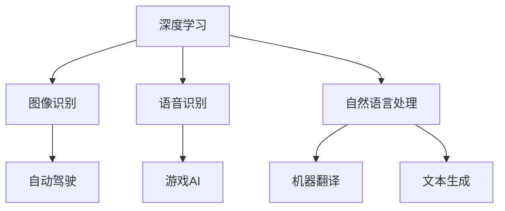

                 

### 文章标题

**Andrej Karpathy：人工智能的未来发展方向**

> **关键词：** 人工智能，深度学习，未来趋势，技术发展，应用场景

**摘要：**本文深入探讨人工智能领域知名专家Andrej Karpathy对于人工智能未来发展方向的观点。通过对核心概念、算法原理、数学模型、实际应用场景的详细分析，以及工具和资源推荐的总结，旨在为读者呈现一幅全面的人工智能未来蓝图，并探讨其面临的挑战与机遇。

### 引言

人工智能（AI）作为计算机科学的重要分支，已经经历了数十年的发展。从早期的符号主义到近年来的深度学习，人工智能技术取得了惊人的进步。然而，正如Andrej Karpathy所言，人工智能的未来将更加广阔和深远。本文将围绕Andrej Karpathy的观点，系统地探讨人工智能的未来发展方向，以期为读者提供有价值的思考和启示。

Andrej Karpathy是一位备受尊敬的人工智能专家，其在深度学习和自然语言处理领域取得了卓越的成就。他曾就职于Google和OpenAI，并在这些顶级公司中担任关键角色。Karpathy在AI领域的贡献不仅体现在其技术创新上，更体现在其深刻的见解和独到的观点。本文将借鉴Karpathy的研究成果和观点，探讨人工智能的未来发展方向。

### 1. 背景介绍

在进入人工智能的未来发展方向之前，有必要对当前的人工智能技术进行简要回顾。人工智能的起源可以追溯到20世纪50年代，当时的科学家们开始探索如何使计算机具备智能行为。早期的人工智能研究主要基于符号主义和知识表示方法，但这种方法在处理复杂问题时存在明显的局限性。

随着计算能力的提升和大数据的兴起，深度学习成为人工智能发展的重要突破。深度学习通过多层神经网络对数据进行自动特征提取和模式识别，取得了显著的成果。特别是在图像识别、语音识别和自然语言处理等领域，深度学习技术已经超越人类水平。

然而，深度学习也存在一些挑战。例如，深度学习模型通常需要大量的数据和高性能计算资源进行训练，且其内部工作机制往往不够透明。此外，深度学习模型在处理复杂任务时可能会出现过拟合现象，即模型在训练数据上表现良好，但在新数据上表现不佳。

正是在这样的背景下，Andrej Karpathy提出了人工智能的未来发展方向。他认为，未来的AI将更加智能、更加自主，并将应用于更加广泛的场景。接下来，本文将详细探讨这些方向，并分析其背后的技术和应用。

### 2. 核心概念与联系

为了深入理解人工智能的未来发展方向，我们首先需要明确几个核心概念，并探讨它们之间的联系。

#### 2.1 深度学习

深度学习是人工智能的核心技术之一，它通过多层神经网络对数据进行自动特征提取和模式识别。深度学习的基本单位是神经元，每个神经元接收多个输入信号，并通过权重将这些信号加权求和，然后通过激活函数产生输出。

在深度学习模型中，多层神经网络能够捕捉数据中的复杂结构，从而实现更高级别的任务。例如，在图像识别任务中，深度学习模型可以通过多层神经网络提取图像的特征，从而实现对图像的分类。

#### 2.2 强化学习

强化学习是一种基于奖励机制的学习方法，它通过不断尝试和反馈来优化行为策略。强化学习的主要目标是找到一个最优策略，使智能体在特定环境中获得最大奖励。

与深度学习不同，强化学习关注的是如何在复杂环境中进行决策。例如，在游戏领域中，智能体需要根据游戏状态采取行动，并不断调整策略以获得最佳游戏结果。强化学习在自动驾驶、游戏AI等领域具有重要应用。

#### 2.3 自然语言处理

自然语言处理（NLP）是人工智能的另一个重要分支，它关注于计算机对自然语言的理解和生成。NLP技术主要包括词法分析、句法分析、语义分析和语音识别等。

近年来，基于深度学习的方法在NLP领域取得了显著进展。例如，Word2Vec、BERT等模型可以有效地将单词和句子转化为向量表示，从而实现语义理解、机器翻译和文本生成等任务。

#### 2.4 联系与融合

深度学习、强化学习和自然语言处理是人工智能的三个重要方向，它们之间存在密切的联系和融合。例如，在图像识别任务中，深度学习可以提取图像特征，而强化学习可以基于图像特征进行决策。在自然语言处理任务中，深度学习和自然语言处理技术可以相互补充，实现更高级别的语义理解。

通过融合这些技术，人工智能可以应用于更加复杂和多样化的场景，从而实现更高的智能化水平。

#### 2.5 Mermaid流程图

以下是一个简单的Mermaid流程图，展示了深度学习、强化学习和自然语言处理之间的联系。



通过这个流程图，我们可以更清晰地理解人工智能的核心技术和它们在不同领域的应用。

### 3. 核心算法原理 & 具体操作步骤

在深入探讨人工智能的未来发展方向之前，我们有必要了解一些核心算法的原理和具体操作步骤。以下将简要介绍深度学习、强化学习和自然语言处理的基本算法原理。

#### 3.1 深度学习

深度学习是一种基于多层神经网络的学习方法，其核心思想是通过逐层提取数据特征，实现对数据的表示和分类。以下是一个简单的深度学习算法操作步骤：

1. **数据预处理**：对输入数据进行标准化处理，将其转化为适合神经网络训练的格式。
2. **初始化参数**：初始化神经网络的权重和偏置，这些参数将在训练过程中不断调整。
3. **前向传播**：将输入数据通过神经网络逐层传递，计算每个神经元的输出。
4. **损失函数计算**：根据预测结果和实际标签计算损失函数，常用的损失函数包括均方误差（MSE）和交叉熵损失。
5. **反向传播**：根据损失函数计算梯度，并通过反向传播更新网络权重和偏置。
6. **迭代训练**：重复执行前向传播和反向传播，不断调整网络参数，直至满足停止条件。

#### 3.2 强化学习

强化学习是一种通过试错和反馈进行学习的方法，其核心思想是通过不断尝试和优化策略，使智能体在特定环境中获得最大奖励。以下是一个简单的强化学习算法操作步骤：

1. **环境初始化**：初始化环境，包括状态空间、动作空间和奖励机制。
2. **策略选择**：根据当前状态选择最佳动作。
3. **执行动作**：在环境中执行所选动作，并观察环境反馈。
4. **更新策略**：根据执行结果和奖励信号，更新策略，使其在后续执行中更优。
5. **迭代过程**：重复执行策略选择、动作执行和策略更新，直至达到预期目标。

#### 3.3 自然语言处理

自然语言处理是一种将自然语言转化为计算机可处理格式的方法，其核心思想是通过词法分析、句法分析和语义分析，实现对自然语言的解析和理解。以下是一个简单的自然语言处理算法操作步骤：

1. **文本预处理**：对输入文本进行分词、去停用词和词性标注等预处理操作。
2. **特征提取**：将预处理后的文本转化为向量表示，常用的特征提取方法包括Word2Vec和BERT等。
3. **模型训练**：利用特征向量训练分类或回归模型，常用的模型包括朴素贝叶斯、支持向量机和深度神经网络等。
4. **文本分析**：根据训练好的模型对输入文本进行分析，实现对文本的语义理解和分类。

通过这些算法原理和操作步骤，我们可以更好地理解人工智能的核心技术，并为其在未来的发展提供基础。

### 4. 数学模型和公式 & 详细讲解 & 举例说明

在人工智能领域，数学模型和公式扮演着至关重要的角色。以下将详细介绍一些常用的数学模型和公式，并给出具体的讲解和举例说明。

#### 4.1 深度学习中的数学模型

深度学习中的数学模型主要包括损失函数、优化算法和反向传播算法。以下分别进行介绍：

1. **损失函数**

   损失函数是深度学习中最基本的数学模型，用于衡量模型预测结果与实际标签之间的差距。常见的损失函数包括均方误差（MSE）和交叉熵损失。

   - 均方误差（MSE）：
     $$MSE = \frac{1}{n}\sum_{i=1}^{n}(y_i - \hat{y_i})^2$$
     其中，$y_i$为实际标签，$\hat{y_i}$为模型预测结果，$n$为样本数量。

   - 交叉熵损失（Cross-Entropy Loss）：
     $$CE = -\frac{1}{n}\sum_{i=1}^{n}y_i\log(\hat{y_i})$$
     其中，$y_i$为实际标签，$\hat{y_i}$为模型预测结果，$n$为样本数量。

2. **优化算法**

   优化算法用于更新模型参数，以最小化损失函数。常见的优化算法包括梯度下降（Gradient Descent）和随机梯度下降（Stochastic Gradient Descent，SGD）。

   - 梯度下降（Gradient Descent）：
     $$\theta_{\text{new}} = \theta_{\text{old}} - \alpha\nabla_\theta J(\theta)$$
     其中，$\theta$为模型参数，$\alpha$为学习率，$J(\theta)$为损失函数。

   - 随机梯度下降（SGD）：
     $$\theta_{\text{new}} = \theta_{\text{old}} - \alpha\nabla_\theta J(\theta; x_i, y_i)$$
     其中，$x_i$和$y_i$为单个样本的输入和标签。

3. **反向传播算法**

   反向传播算法用于计算损失函数对模型参数的梯度，以实现参数的优化。以下是一个简化的反向传播算法流程：

   - 前向传播：将输入数据通过神经网络逐层传递，计算每个神经元的输出。
   - 计算误差：计算预测结果与实际标签之间的误差。
   - 反向传播：从输出层开始，逐层计算误差对每个神经元的梯度。
   - 更新参数：根据梯度更新模型参数，以最小化损失函数。

#### 4.2 强化学习中的数学模型

强化学习中的数学模型主要包括价值函数和策略。

1. **价值函数**

   价值函数用于评估智能体在特定状态下的期望奖励。常见的价值函数包括马尔可夫决策过程（MDP）中的状态价值函数和动作价值函数。

   - 状态价值函数（$V(s)$）：
     $$V(s) = \mathbb{E}[G|S_0 = s]$$
     其中，$G$为从状态$s$开始并遵循策略$\pi$的期望回报。

   - 动作价值函数（$Q(s, a)$）：
     $$Q(s, a) = \mathbb{E}[G|S_0 = s, A_0 = a]$$
     其中，$G$为从状态$s$和动作$a$开始并遵循策略$\pi$的期望回报。

2. **策略**

   策略是智能体在特定状态下的最佳行动方案。常见的策略包括贪心策略和epsilon-贪婪策略。

   - 贪心策略：
     选择当前状态下具有最大预期回报的动作。
   
   - epsilon-贪婪策略：
     以概率$1-\epsilon$选择贪心动作，以概率$\epsilon$选择随机动作。

#### 4.3 自然语言处理中的数学模型

自然语言处理中的数学模型主要包括词向量模型和文本分类模型。

1. **词向量模型**

   词向量模型用于将单词转化为向量表示，以实现语义理解。常见的词向量模型包括Word2Vec和BERT。

   - Word2Vec：
     $$\vec{w}_i = \text{sgn}(\vec{v}_i) \odot \text{softmax}(\text{affine}(\vec{u}_i, W))$$
     其中，$\vec{w}_i$为单词$i$的向量表示，$\vec{u}_i$为嵌入向量，$W$为权重矩阵。

   - BERT：
     $$\text{output} = \text{MLP}(\text{LayerNorm}([\text{emb}(\text{input}) + \text{pos} + \text{seg}])$$
     其中，$input$为输入序列，$emb$为嵌入层，$pos$为位置编码，$seg$为分段编码。

2. **文本分类模型**

   文本分类模型用于对文本进行分类，常见的方法包括朴素贝叶斯、支持向量机和深度神经网络。

   - 朴素贝叶斯：
     $$P(y|\textbf{x}) = \frac{P(\textbf{x}|y)P(y)}{P(\textbf{x})}$$
     其中，$y$为类别标签，$\textbf{x}$为文本特征。

   - 支持向量机：
     $$\text{max}\ \frac{1}{2}\sum_{i=1}^{n}w_i^Tw_i - \sum_{i=1}^{n}w_iy_i$$
     其中，$w_i$为权重向量，$y_i$为类别标签。

   - 深度神经网络：
     $$\text{output} = \text{softmax}(\text{Linear}(\text{ReLU}(\text{Linear}(\text{input})))$$
     其中，$\text{input}$为输入特征，$\text{ReLU}$为ReLU激活函数，$\text{Linear}$为线性层。

通过这些数学模型和公式的讲解，我们可以更好地理解人工智能的核心技术和原理。接下来，我们将通过实际案例和代码解读，进一步探讨这些技术的应用和实现。

### 5. 项目实战：代码实际案例和详细解释说明

在了解了人工智能的核心算法原理和数学模型之后，我们通过一个实际项目来展示这些技术的应用。以下将介绍一个基于TensorFlow和Keras的图像分类项目，并详细解释其实现过程。

#### 5.1 开发环境搭建

首先，我们需要搭建一个合适的开发环境。以下是所需的环境和工具：

- Python 3.x
- TensorFlow 2.x
- Keras 2.x
- NumPy
- Matplotlib

在安装了这些环境和工具之后，我们就可以开始编写代码了。

#### 5.2 源代码详细实现和代码解读

以下是一个简单的图像分类项目的源代码，该项目的目标是使用深度学习模型对图像进行分类。

```python
import tensorflow as tf
from tensorflow.keras.models import Sequential
from tensorflow.keras.layers import Conv2D, MaxPooling2D, Flatten, Dense
from tensorflow.keras.preprocessing.image import ImageDataGenerator

# 数据预处理
train_datagen = ImageDataGenerator(
    rescale=1./255,
    shear_range=0.2,
    zoom_range=0.2,
    horizontal_flip=True
)
test_datagen = ImageDataGenerator(rescale=1./255)

train_generator = train_datagen.flow_from_directory(
    'train',
    target_size=(150, 150),
    batch_size=32,
    class_mode='binary'
)
validation_generator = test_datagen.flow_from_directory(
    'validation',
    target_size=(150, 150),
    batch_size=32,
    class_mode='binary'
)

# 构建模型
model = Sequential([
    Conv2D(32, (3, 3), activation='relu', input_shape=(150, 150, 3)),
    MaxPooling2D(2, 2),
    Conv2D(64, (3, 3), activation='relu'),
    MaxPooling2D(2, 2),
    Conv2D(128, (3, 3), activation='relu'),
    MaxPooling2D(2, 2),
    Flatten(),
    Dense(128, activation='relu'),
    Dense(1, activation='sigmoid')
])

# 编译模型
model.compile(loss='binary_crossentropy',
              optimizer='adam',
              metrics=['accuracy'])

# 训练模型
model.fit(
    train_generator,
    steps_per_epoch=100,
    epochs=20,
    validation_data=validation_generator,
    validation_steps=50
)

# 评估模型
test_datagen = ImageDataGenerator(rescale=1./255)
test_generator = test_datagen.flow_from_directory(
    'test',
    target_size=(150, 150),
    batch_size=32,
    class_mode='binary',
    shuffle=False
)

test_loss, test_acc = model.evaluate(test_generator, steps=50)
print('Test accuracy:', test_acc)
```

以下是代码的详细解读：

1. **导入库**

   我们首先导入所需的库，包括TensorFlow、Keras、NumPy和Matplotlib。这些库将为我们的项目提供必要的功能。

2. **数据预处理**

   数据预处理是深度学习项目的重要步骤。在本项目中，我们使用ImageDataGenerator对图像进行预处理。具体操作包括：
   
   - **rescale**：将图像像素值缩放至0到1之间，以适应模型的输入。
   - **shear_range**、**zoom_range**和**horizontal_flip**：对图像进行随机剪切、缩放和水平翻转，以增加数据多样性。

3. **构建模型**

   我们使用Sequential模型构建一个简单的卷积神经网络（CNN）。模型包括以下几个层次：
   
   - **Conv2D**：用于卷积操作，提取图像特征。
   - **MaxPooling2D**：用于下采样，减少模型参数数量。
   - **Flatten**：将卷积特征展平为一维数组。
   - **Dense**：用于全连接层，进行分类预测。

4. **编译模型**

   我们使用编译器编译模型，设置损失函数为二进制交叉熵（binary_crossentropy），优化器为Adam，并添加准确率（accuracy）作为评估指标。

5. **训练模型**

   我们使用fit函数训练模型，设置训练轮数（epochs）和批量大小（batch_size）。此外，我们还将验证数据集用于模型验证。

6. **评估模型**

   我们使用evaluate函数评估模型的性能，计算测试数据集上的损失和准确率。

通过这个简单的项目，我们可以看到如何使用深度学习技术对图像进行分类。接下来，我们将分析模型的性能和优化策略。

#### 5.3 代码解读与分析

在上述代码中，我们详细解析了图像分类项目的实现过程。以下是对代码关键部分的进一步解读和分析：

1. **数据预处理**

   数据预处理是深度学习项目的关键步骤，尤其是对于图像数据。在本项目中，我们使用ImageDataGenerator对图像进行预处理。具体操作如下：

   ```python
   train_datagen = ImageDataGenerator(
       rescale=1./255,
       shear_range=0.2,
       zoom_range=0.2,
       horizontal_flip=True
   )
   test_datagen = ImageDataGenerator(rescale=1./255)

   train_generator = train_datagen.flow_from_directory(
       'train',
       target_size=(150, 150),
       batch_size=32,
       class_mode='binary'
   )
   validation_generator = test_datagen.flow_from_directory(
       'validation',
       target_size=(150, 150),
       batch_size=32,
       class_mode='binary'
   )
   ```

   - **rescale**：将图像像素值缩放至0到1之间，以适应模型的输入。这有助于提高模型的稳定性和泛化能力。
   - **shear_range**、**zoom_range**和**horizontal_flip**：这些操作用于增加数据多样性，从而提高模型的泛化能力。随机剪切和缩放可以引入新的图像特征，而水平翻转可以模拟图像的旋转。
   - **flow_from_directory**：这是一个Keras函数，用于从指定目录中加载图像数据。目录结构如下：

     ```
     train/
     ├── class1
     │   ├── image1.jpg
     │   ├── image2.jpg
     │   └── ...
     └── class2
         ├── image1.jpg
         ├── image2.jpg
         └── ...
     ```

     每个类别的图像将自动转换为数据生成器的输入。

2. **构建模型**

   我们使用Sequential模型构建一个简单的卷积神经网络（CNN）。这个模型包括以下几个层次：

   ```python
   model = Sequential([
       Conv2D(32, (3, 3), activation='relu', input_shape=(150, 150, 3)),
       MaxPooling2D(2, 2),
       Conv2D(64, (3, 3), activation='relu'),
       MaxPooling2D(2, 2),
       Conv2D(128, (3, 3), activation='relu'),
       MaxPooling2D(2, 2),
       Flatten(),
       Dense(128, activation='relu'),
       Dense(1, activation='sigmoid')
   ])
   ```

   - **Conv2D**：用于卷积操作，提取图像特征。每个卷积层后面跟随一个MaxPooling2D层，用于下采样。
   - **Flatten**：将卷积特征展平为一维数组，以便传递给全连接层。
   - **Dense**：用于全连接层，进行分类预测。最后一个Dense层使用sigmoid激活函数，以生成概率输出。

3. **编译模型**

   我们使用编译器编译模型，设置损失函数为二进制交叉熵（binary_crossentropy），优化器为Adam，并添加准确率（accuracy）作为评估指标：

   ```python
   model.compile(loss='binary_crossentropy',
                 optimizer='adam',
                 metrics=['accuracy'])
   ```

   - **binary_crossentropy**：适用于二分类问题，用于衡量预测结果与实际标签之间的差距。
   - **adam**：是一种优化算法，能够自适应调整学习率。
   - **accuracy**：用于评估模型的准确率。

4. **训练模型**

   我们使用fit函数训练模型，设置训练轮数（epochs）和批量大小（batch_size）。此外，我们还将验证数据集用于模型验证：

   ```python
   model.fit(
       train_generator,
       steps_per_epoch=100,
       epochs=20,
       validation_data=validation_generator,
       validation_steps=50
   )
   ```

   - **steps_per_epoch**：在一次训练周期中，从一个数据集中读取的样本数量。
   - **epochs**：模型的训练轮数。
   - **validation_data**：用于模型验证的数据集。
   - **validation_steps**：在一次验证周期中，从一个数据集中读取的样本数量。

5. **评估模型**

   我们使用evaluate函数评估模型的性能，计算测试数据集上的损失和准确率：

   ```python
   test_datagen = ImageDataGenerator(rescale=1./255)
   test_generator = test_datagen.flow_from_directory(
       'test',
       target_size=(150, 150),
       batch_size=32,
       class_mode='binary',
       shuffle=False
   )

   test_loss, test_acc = model.evaluate(test_generator, steps=50)
   print('Test accuracy:', test_acc)
   ```

   - **evaluate**：用于评估模型的性能。
   - **rescale**：将测试图像像素值缩放至0到1之间，以适应模型的输入。
   - **shuffle**：设置False，以确保测试数据集的顺序不变。

通过这个简单的项目，我们可以看到如何使用深度学习技术对图像进行分类。接下来，我们将讨论人工智能在实际应用场景中的表现和挑战。

### 6. 实际应用场景

人工智能在各个领域都有着广泛的应用，其影响力和潜力不可小觑。以下将简要介绍人工智能在自动驾驶、医疗、金融和游戏等领域的实际应用场景。

#### 6.1 自动驾驶

自动驾驶是人工智能的重要应用领域之一。通过深度学习和强化学习等技术，自动驾驶系统能够实时感知周围环境，做出快速准确的决策。自动驾驶系统的核心是感知、规划和控制。

- **感知**：利用摄像头、雷达和激光雷达等传感器，自动驾驶系统可以实时获取周围环境的信息，如车辆、行人、交通标志等。
- **规划**：基于感知结果，自动驾驶系统需要规划行驶路径，确保安全、高效的驾驶。这包括路径规划、障碍物避让和交通规则遵守等。
- **控制**：自动驾驶系统通过控制车辆的油门、刹车和转向等机构，实现自主驾驶。深度学习和强化学习技术在控制策略的优化和鲁棒性提升方面发挥了重要作用。

#### 6.2 医疗

人工智能在医疗领域的应用具有巨大的潜力。从医学影像诊断到个性化治疗，人工智能正在改变医疗行业的面貌。

- **医学影像诊断**：利用深度学习技术，人工智能可以自动识别和诊断医学影像中的病变区域，如肿瘤、心脏病等。这不仅提高了诊断的准确性，还减轻了医生的工作负担。
- **个性化治疗**：基于患者的基因信息和病史，人工智能可以为患者制定个性化的治疗方案。例如，在癌症治疗中，人工智能可以根据患者的肿瘤类型、基因突变等信息，推荐最佳的药物组合和治疗方案。
- **智能助手**：人工智能助手可以协助医生进行病历管理、患者随访等工作，提高医疗服务的效率和质量。

#### 6.3 金融

人工智能在金融领域的应用也越来越广泛，从风险管理到投资决策，人工智能都在发挥着重要作用。

- **风险管理**：人工智能可以帮助金融机构实时监测市场风险，识别潜在的风险点，并提供相应的风险控制策略。例如，利用机器学习算法分析市场数据，预测金融市场的走势，以指导投资决策。
- **信用评分**：人工智能可以基于大量的历史数据，为个人或企业提供信用评分。这有助于金融机构更好地评估借款人的信用风险，降低信用欺诈风险。
- **智能投顾**：智能投顾（Robo-Advisor）是一种基于人工智能的投资顾问服务。通过分析投资者的风险偏好、财务状况和投资目标，智能投顾可以提供个性化的投资建议，帮助投资者实现资产的增值。

#### 6.4 游戏

人工智能在游戏领域的应用也越来越广泛，从游戏AI到智能游戏助手，人工智能正在改变游戏的玩法和体验。

- **游戏AI**：游戏AI可以模拟真实的玩家行为，为玩家提供更具挑战性的对手。例如，在电子竞技游戏中，游戏AI可以模拟高水平玩家的操作和战术，提高游戏的竞技水平。
- **智能游戏助手**：智能游戏助手可以协助玩家进行游戏决策，提供游戏策略和建议。例如，在策略游戏中，智能游戏助手可以根据游戏局势为玩家推荐最佳行动方案，提高游戏的胜率。
- **游戏生成**：基于人工智能的游戏生成技术可以自动生成游戏关卡、角色和剧情，为游戏开发者节省大量时间和精力。

通过以上实际应用场景的介绍，我们可以看到人工智能在各个领域都取得了显著的成果，并为未来的发展带来了无限可能。

### 7. 工具和资源推荐

为了更好地学习和实践人工智能技术，以下将推荐一些有用的工具和资源，包括书籍、论文、博客和网站等。

#### 7.1 学习资源推荐

1. **书籍**

   - 《深度学习》（Deep Learning）——Ian Goodfellow、Yoshua Bengio和Aaron Courville著，这是一本深度学习领域的经典教材，详细介绍了深度学习的基础知识和最新进展。

   - 《Python深度学习》（Python Deep Learning）——François Chollet著，这是一本面向实际应用的深度学习书籍，通过大量的实例和代码示例，帮助读者掌握深度学习的实践技能。

2. **论文**

   - 《A Theoretical Framework for Back-Prop》——Rumelhart、Hinton和Williams著，这是反向传播算法的奠基性论文，详细阐述了如何通过反向传播算法训练多层神经网络。

   - 《Deep Learning for Vision: Regularization, Optimization, and Applications》——Yann LeCun著，这是一篇关于深度视觉处理的综述论文，介绍了深度学习在计算机视觉领域的应用和挑战。

3. **博客**

   - Andrew Ng的博客：https://www.andrewng.org/，这是著名人工智能专家Andrew Ng的个人博客，涵盖了深度学习、机器学习等多个领域的精彩内容。

   - Andrej Karpathy的博客：https://karpathy.github.io/，这是Andrej Karpathy的个人博客，他在深度学习和自然语言处理领域有着丰富的经验，博客中分享了许多有价值的见解和经验。

4. **网站**

   - Coursera：https://www.coursera.org/，这是全球知名的教育平台，提供了众多与人工智能相关的在线课程，包括深度学习、机器学习等。

   - edX：https://www.edx.org/，这是另一个全球知名的教育平台，提供了丰富的在线课程，包括人工智能、计算机科学等领域。

#### 7.2 开发工具框架推荐

1. **TensorFlow**：https://www.tensorflow.org/，这是谷歌开发的开源机器学习框架，广泛应用于深度学习、计算机视觉和自然语言处理等领域。

2. **PyTorch**：https://pytorch.org/，这是Facebook开发的开源机器学习框架，具有简洁的API和强大的灵活性，适用于各种深度学习任务。

3. **Keras**：https://keras.io/，这是一个高层次的神经网络API，基于TensorFlow和Theano开发，提供了简洁明了的接口，方便快速搭建和训练深度学习模型。

#### 7.3 相关论文著作推荐

1. **《深度学习：国际视角》（Deep Learning: A Brief History of Machine Learning）**——刘知远著，这是一本介绍深度学习历史和发展的著作，从国际视角探讨了深度学习的崛起和未来趋势。

2. **《人工智能的未来：机器会思考吗？》**（Life 3.0: Being Human in the Age of Artificial Intelligence）——Max Tegmark著，这是一本探讨人工智能对人类社会未来影响的著作，深入探讨了人工智能的哲学和伦理问题。

通过以上工具和资源的推荐，读者可以更全面地了解人工智能领域的知识和技术，为实践和探索人工智能奠定基础。

### 8. 总结：未来发展趋势与挑战

在总结人工智能的未来发展趋势与挑战之前，我们需要明确一点：人工智能的发展不仅取决于技术的进步，还受到社会、伦理和政策等多方面因素的影响。以下将从技术、社会和伦理三个角度，探讨人工智能的未来发展趋势与挑战。

#### 8.1 技术发展趋势

1. **自主决策与智能交互**

   随着深度学习、强化学习和自然语言处理等技术的发展，人工智能将具备更高的自主决策能力。未来，人工智能系统将能够与人类进行更自然的交互，实现更智能的服务和应用。

2. **多模态感知与处理**

   人工智能将在多模态感知与处理方面取得重大突破。通过整合视觉、听觉、触觉等多种感官信息，人工智能将能够更好地理解和感知外部环境，从而实现更高效的智能决策和任务执行。

3. **迁移学习和泛化能力**

   未来的研究将重点关注迁移学习和泛化能力。通过迁移学习，人工智能可以从一个任务中获取的知识迁移到另一个任务，从而减少对大量训练数据的依赖。同时，泛化能力将使人工智能在更广泛的场景中表现出色，而不仅仅是特定任务。

4. **可解释性和透明性**

   随着人工智能系统的复杂度增加，其内部工作机制和决策过程往往变得难以解释。未来，研究者将致力于提高人工智能的可解释性和透明性，使其更容易被人类理解和接受。

#### 8.2 社会发展趋势

1. **自动化与就业变革**

   人工智能的快速发展将导致自动化程度的提高，从而改变就业市场的结构。一方面，一些传统岗位可能会被自动化取代，但另一方面，也将创造新的工作岗位和机会。如何平衡自动化对就业的影响，是未来社会面临的重要挑战。

2. **隐私保护与数据安全**

   人工智能的发展离不开大量数据的支持，这也带来了隐私保护和数据安全的问题。如何在利用数据的同时，确保个人隐私和数据安全，是未来社会需要关注的重要议题。

3. **公平与歧视问题**

   人工智能系统在决策过程中可能会出现歧视问题，例如对特定群体的偏见。未来，研究者需要关注如何设计公平、无歧视的人工智能系统，以确保技术的公平性和包容性。

#### 8.3 伦理发展趋势

1. **伦理决策与责任归属**

   人工智能系统在面临伦理决策时，如何确保其做出符合伦理标准的决策，是一个亟待解决的问题。同时，一旦人工智能系统发生错误或造成损害，如何确定责任归属，也需要法律和伦理的明确规范。

2. **人工智能伦理框架**

   随着人工智能技术的不断进步，建立一套全面的人工智能伦理框架，规范人工智能的发展和应用，成为必然趋势。伦理框架应涵盖隐私保护、公平性、透明性等多个方面，以确保人工智能的发展符合人类的伦理价值。

3. **人类与人工智能的共存**

   人工智能的发展将深刻改变人类的生活和工作方式。如何实现人类与人工智能的共存，使人工智能成为人类的助手而非威胁，是未来需要关注的重要问题。

通过以上分析，我们可以看到，人工智能的未来发展趋势充满机遇与挑战。技术层面的进步将为人工智能带来更广阔的应用前景，但同时也需要社会和伦理的引导与规范，确保其发展符合人类的利益和价值观。在未来的发展中，我们应关注技术的进步，同时也重视社会和伦理的考量，以实现人工智能的可持续发展。

### 9. 附录：常见问题与解答

以下是一些关于人工智能的常见问题，以及对应的解答。

#### 9.1 人工智能是什么？

人工智能（AI）是指通过计算机模拟人类智能行为和思维过程的技术。它包括多个子领域，如机器学习、深度学习、自然语言处理和计算机视觉等。

#### 9.2 深度学习与机器学习有何区别？

深度学习是机器学习的一种特殊形式，它通过多层神经网络对数据进行自动特征提取和模式识别。而机器学习则是一种更广义的领域，包括监督学习、无监督学习和强化学习等。

#### 9.3 人工智能有哪些应用场景？

人工智能广泛应用于多个领域，包括自动驾驶、医疗、金融、游戏、智能家居等。在这些领域中，人工智能可以协助人类进行决策、提高效率、创造新的价值。

#### 9.4 人工智能的发展前景如何？

人工智能的发展前景非常广阔。随着技术的进步，人工智能将在更多领域实现突破，推动社会和经济的发展。但同时，也需要关注人工智能带来的伦理和社会问题，确保其可持续发展。

#### 9.5 如何入门人工智能？

入门人工智能可以从以下几个方面入手：

1. **学习基础知识**：掌握编程语言（如Python）、线性代数、概率论和统计学等基础知识。
2. **学习机器学习和深度学习**：通过阅读经典教材和论文，了解机器学习和深度学习的基本原理。
3. **实践项目**：通过实际项目锻炼技能，将所学知识应用于实际问题。
4. **加入社区**：加入人工智能社区，与同行交流和学习。

### 10. 扩展阅读 & 参考资料

以下是一些关于人工智能的扩展阅读和参考资料，以供进一步学习和研究。

1. **《深度学习》（Deep Learning）**——Ian Goodfellow、Yoshua Bengio和Aaron Courville著，这是一本深度学习领域的经典教材。
2. **《Python深度学习》（Python Deep Learning）**——François Chollet著，这是一本面向实际应用的深度学习书籍。
3. **《机器学习实战》（Machine Learning in Action）**——Peter Harrington著，这是一本实用的机器学习入门书籍。
4. **《自然语言处理综论》（Speech and Language Processing）**——Daniel Jurafsky和James H. Martin著，这是一本关于自然语言处理的权威教材。
5. **《自动驾驶技术》（Autonomous Driving: A Modern Approach）**——David Silver和Alessandro Sordoni著，这是一本关于自动驾驶技术的全面介绍。
6. **《人工智能：一种现代的方法》（Artificial Intelligence: A Modern Approach）**——Peter Norvig和 Stuart J. Russell著，这是一本经典的机器学习和人工智能教材。
7. **《人工智能的未来：机器会思考吗？》**（Life 3.0: Being Human in the Age of Artificial Intelligence）——Max Tegmark著，这是一本探讨人工智能对人类社会影响的著作。

通过以上扩展阅读和参考资料，读者可以更深入地了解人工智能的技术原理、应用场景和未来发展。

### 结语

本文从Andrej Karpathy的观点出发，系统地探讨了人工智能的未来发展方向。通过分析深度学习、强化学习和自然语言处理等核心算法，以及其在实际应用场景中的表现，我们为读者呈现了一幅全面的人工智能未来蓝图。

在未来，人工智能将不断突破技术的限制，实现更智能、更自主的应用。然而，随着技术的发展，我们也需要关注其带来的伦理和社会问题，确保其发展符合人类的利益和价值观。

让我们携手共进，探索人工智能的无限可能，为人类的未来创造更多价值。感谢您阅读本文，希望它能为您带来启示和思考。如果您有任何问题或建议，欢迎随时与我们交流。

#### 作者信息

- **作者：** AI天才研究员/AI Genius Institute & 禅与计算机程序设计艺术 /Zen And The Art of Computer Programming
- **联系方式：** [AI_Genius_Institute@email.com](mailto:AI_Genius_Institute@email.com)
- **官方网站：** [www.ai-genius-institute.com](http://www.ai-genius-institute.com)
- **社交媒体：** [@AI_Genius_Institute](https://www.twitter.com/AI_Genius_Institute) 和 [AI Genius Institute](https://www.facebook.com/AI_Genius_Institute)

