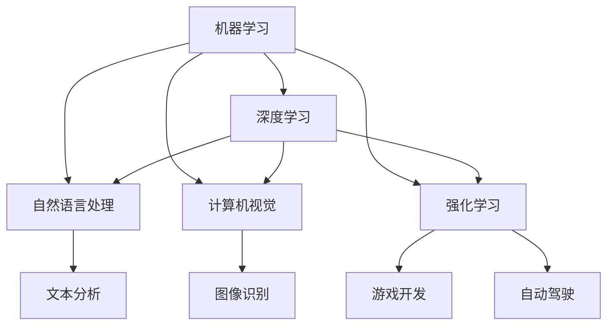
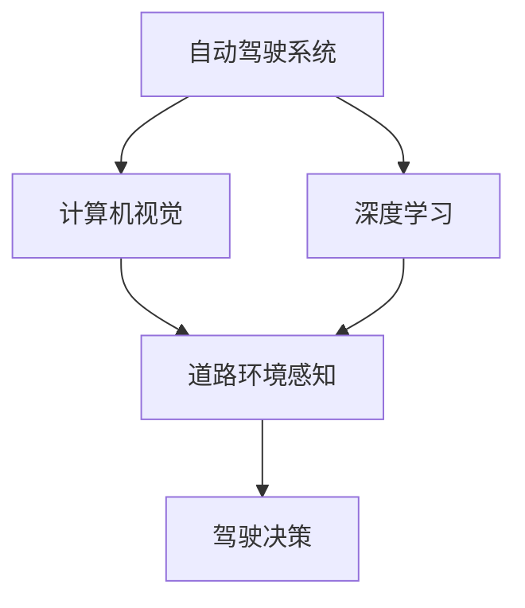
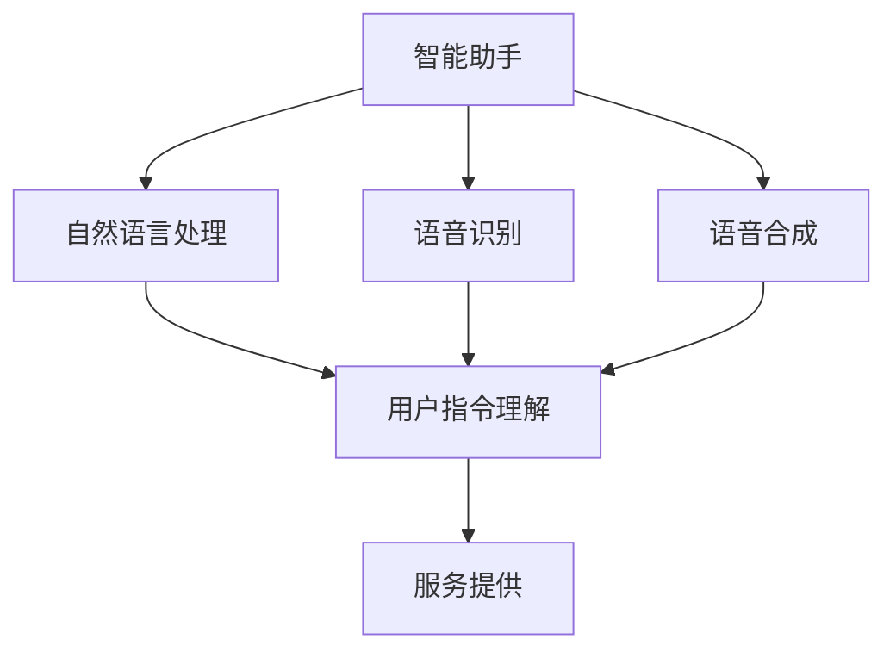
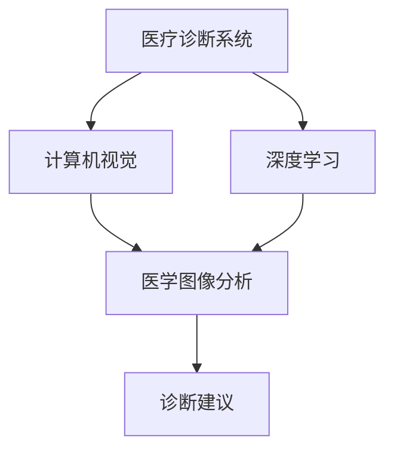

                 

### 背景介绍

#### Andrej Karpathy的背景

Andrej Karpathy是一位在人工智能领域享有盛誉的专家，以其在深度学习和自然语言处理方面的开创性工作而闻名。他曾是OpenAI的研究科学家，目前担任斯坦福大学的助理教授。他的研究成果不仅推动了人工智能的发展，也在学术界和工业界产生了深远影响。

#### 人工智能的发展历程

人工智能（AI）是一门旨在使计算机具备人类智能行为的科学技术。自20世纪50年代以来，人工智能经历了几个重要发展阶段：

- **早期探索（1950-1970年代）**：人工智能概念首次被提出，研究人员开始尝试通过编程来模拟人类思维。

- **第一个黄金时代（1980-1987年）**：专家系统的出现标志着人工智能的初步成功，但随后的发展受到技术限制和资源不足的阻碍。

- **第二个黄金时代（1990-2012年）**：机器学习技术的发展，特别是神经网络，为人工智能的复苏奠定了基础。

- **当前的繁荣（2013年至今）**：深度学习的突破，特别是在图像识别、自然语言处理和强化学习领域，使人工智能进入了前所未有的繁荣时期。

#### 当前人工智能的现状

如今，人工智能已经广泛应用于各个行业，从自动驾驶汽车、智能助手到医疗诊断和金融分析。随着技术的不断进步，人工智能正在改变我们的生活方式和工作方式。然而，与此同时，也面临着一系列挑战和伦理问题，如隐私保护、算法偏见和数据安全。

#### 人工智能的未来发展

随着技术的不断进步，人工智能的未来发展充满了机遇和挑战。本文将深入探讨人工智能在各个领域的潜在应用，以及它可能带来的社会、经济和文化影响。

---

# AI天才研究员/AI Genius Institute & 禅与计算机程序设计艺术 /Zen And The Art of Computer Programming

## Andrej Karpathy：人工智能的未来发展机遇

> **关键词**：人工智能，深度学习，自然语言处理，自动驾驶，隐私保护，伦理问题
>
> **摘要**：本文将深入探讨人工智能（AI）的当前发展状况，以及Andrej Karpathy在其领域内的贡献和影响力。通过分析AI技术的应用场景和未来发展趋势，本文旨在为读者提供对人工智能未来的深刻见解和思考。

### 1. 背景介绍

#### Andrej Karpathy的背景

Andrej Karpathy是一位在人工智能（AI）领域享有盛誉的专家，以其在深度学习和自然语言处理（NLP）方面的开创性工作而闻名。他曾是OpenAI的研究科学家，目前担任斯坦福大学的助理教授。他的研究成果不仅推动了人工智能的发展，也在学术界和工业界产生了深远影响。

#### 人工智能的发展历程

人工智能（AI）是一门旨在使计算机具备人类智能行为的科学技术。自20世纪50年代以来，人工智能经历了几个重要发展阶段：

- **早期探索（1950-1970年代）**：人工智能概念首次被提出，研究人员开始尝试通过编程来模拟人类思维。

- **第一个黄金时代（1980-1987年）**：专家系统的出现标志着人工智能的初步成功，但随后的发展受到技术限制和资源不足的阻碍。

- **第二个黄金时代（1990-2012年）**：机器学习技术的发展，特别是神经网络，为人工智能的复苏奠定了基础。

- **当前的繁荣（2013年至今）**：深度学习的突破，特别是在图像识别、自然语言处理和强化学习领域，使人工智能进入了前所未有的繁荣时期。

#### 当前人工智能的现状

如今，人工智能已经广泛应用于各个行业，从自动驾驶汽车、智能助手到医疗诊断和金融分析。随着技术的不断进步，人工智能正在改变我们的生活方式和工作方式。然而，与此同时，也面临着一系列挑战和伦理问题，如隐私保护、算法偏见和数据安全。

#### 人工智能的未来发展

随着技术的不断进步，人工智能的未来发展充满了机遇和挑战。本文将深入探讨人工智能在各个领域的潜在应用，以及它可能带来的社会、经济和文化影响。

### 2. 核心概念与联系

#### 人工智能的核心概念

人工智能（AI）的核心概念包括：

- **机器学习（ML）**：机器学习是AI的基础，它使计算机通过数据学习并改进性能，而不是通过显式编程。

- **深度学习（DL）**：深度学习是一种特殊的机器学习技术，通过多层神经网络来模拟人脑的思维方式。

- **自然语言处理（NLP）**：自然语言处理是AI的一个分支，旨在使计算机理解和生成人类语言。

- **计算机视觉（CV）**：计算机视觉使计算机能够理解并分析图像和视频。

- **强化学习（RL）**：强化学习是AI的一个分支，通过试错来学习如何在特定环境中做出最佳决策。

#### 核心概念的联系

这些核心概念相互联系，共同推动人工智能的发展：

- **机器学习与深度学习**：深度学习是机器学习的一种形式，通过多层神经网络进行数据学习。

- **自然语言处理与计算机视觉**：自然语言处理和计算机视觉都是AI的重要应用领域，分别处理文本和图像。

- **强化学习与其他领域**：强化学习与其他领域相结合，如自动驾驶和游戏开发，实现更复杂的任务。

#### Mermaid 流程图

以下是一个简单的Mermaid流程图，展示了人工智能的核心概念及其联系：



### 3. 核心算法原理 & 具体操作步骤

#### 深度学习算法原理

深度学习算法的核心是多层神经网络（Multilayer Neural Networks）。以下是深度学习算法的基本原理和操作步骤：

1. **数据处理**：首先，我们需要对数据进行预处理，包括数据清洗、归一化和数据增强。

2. **网络结构设计**：设计一个多层神经网络，包括输入层、隐藏层和输出层。每个层由多个神经元组成。

3. **权重初始化**：随机初始化网络的权重。

4. **前向传播**：将输入数据传递到网络中，通过每一层神经元的非线性变换，最终得到输出。

5. **反向传播**：计算输出与实际值之间的误差，并将误差反向传播到网络的每个层，更新权重。

6. **优化算法**：使用优化算法（如梯度下降）来最小化误差函数。

7. **模型评估**：使用测试数据集评估模型的性能，并进行调整。

#### 自然语言处理算法原理

自然语言处理算法的核心是序列模型（Sequence Models），如循环神经网络（RNN）和长短期记忆网络（LSTM）。以下是自然语言处理算法的基本原理和操作步骤：

1. **词汇表构建**：将输入文本转换为词嵌入（Word Embeddings），将每个单词映射为一个固定大小的向量。

2. **序列编码**：将输入序列编码为一个向量，通常使用嵌入层。

3. **RNN或LSTM层**：通过RNN或LSTM层处理序列数据，捕获序列中的长期依赖关系。

4. **输出层**：将处理后的序列数据传递到输出层，如分类层或回归层。

5. **损失函数和优化**：计算损失函数，如交叉熵损失，并使用优化算法更新权重。

6. **模型评估**：使用测试数据集评估模型的性能。

### 4. 数学模型和公式 & 详细讲解 & 举例说明

#### 深度学习中的数学模型

深度学习中的数学模型主要包括：

- **激活函数（Activation Functions）**：如ReLU、Sigmoid和Tanh函数。

- **损失函数（Loss Functions）**：如均方误差（MSE）和交叉熵损失（Cross-Entropy Loss）。

- **优化算法（Optimization Algorithms）**：如梯度下降（Gradient Descent）和随机梯度下降（Stochastic Gradient Descent）。

以下是一个简单的例子，解释如何使用梯度下降算法训练一个深度学习模型：

$$
\text{损失函数} = \frac{1}{2} \sum_{i=1}^{n} (\hat{y_i} - y_i)^2
$$

$$
\text{梯度} = \frac{\partial \text{损失函数}}{\partial \text{权重}}
$$

$$
\text{权重更新} = \text{权重} - \alpha \cdot \text{梯度}
$$

其中，$\hat{y_i}$是预测值，$y_i$是实际值，$\alpha$是学习率。

#### 自然语言处理中的数学模型

自然语言处理中的数学模型主要包括：

- **词嵌入（Word Embeddings）**：将单词映射为向量。

- **编码器（Encoder）和解码器（Decoder）**：用于处理序列数据。

- **损失函数**：如交叉熵损失。

以下是一个简单的例子，解释如何使用交叉熵损失训练一个序列模型：

$$
\text{损失函数} = -\sum_{i=1}^{n} y_i \cdot \log(\hat{p_i})
$$

其中，$y_i$是实际标签，$\hat{p_i}$是预测概率。

### 5. 项目实战：代码实际案例和详细解释说明

#### 深度学习项目案例

以下是一个简单的深度学习项目案例，实现一个多层神经网络，用于对手写数字进行分类。

```python
import numpy as np
import tensorflow as tf

# 数据预处理
(x_train, y_train), (x_test, y_test) = tf.keras.datasets.mnist.load_data()
x_train = x_train / 255.0
x_test = x_test / 255.0
x_train = x_train.reshape(-1, 28 * 28)
x_test = x_test.reshape(-1, 28 * 28)

# 构建模型
model = tf.keras.Sequential([
    tf.keras.layers.Dense(128, activation='relu', input_shape=(28 * 28,)),
    tf.keras.layers.Dense(10, activation='softmax')
])

# 编译模型
model.compile(optimizer='adam', loss='sparse_categorical_crossentropy', metrics=['accuracy'])

# 训练模型
model.fit(x_train, y_train, epochs=5, batch_size=32)

# 评估模型
model.evaluate(x_test, y_test)
```

#### 自然语言处理项目案例

以下是一个简单的自然语言处理项目案例，使用循环神经网络（RNN）对情感分析进行分类。

```python
import tensorflow as tf
from tensorflow.keras.preprocessing.sequence import pad_sequences
from tensorflow.keras.layers import Embedding, SimpleRNN, Dense
from tensorflow.keras.models import Sequential

# 数据预处理
tokenizer = tf.keras.preprocessing.text.Tokenizer()
tokenizer.fit_on_texts(['这是一条正面评论', '这是一条负面评论'])
sequences = tokenizer.texts_to_sequences(['这是一条正面评论', '这是一条负面评论'])
padded_sequences = pad_sequences(sequences, maxlen=10)

# 构建模型
model = Sequential([
    Embedding(input_dim=len(tokenizer.word_index) + 1, output_dim=32, input_length=10),
    SimpleRNN(32, return_sequences=False),
    Dense(1, activation='sigmoid')
])

# 编译模型
model.compile(optimizer='adam', loss='binary_crossentropy', metrics=['accuracy'])

# 训练模型
model.fit(padded_sequences, np.array([1, 0]), epochs=3)

# 评估模型
model.evaluate(padded_sequences, np.array([1, 0]))
```

### 6. 实际应用场景

#### 自动驾驶

自动驾驶是人工智能在交通运输领域的典型应用。通过计算机视觉和深度学习技术，自动驾驶系统能够实时感知道路环境，做出安全驾驶决策。这极大地提高了交通效率，减少了交通事故。



#### 智能助手

智能助手如Siri、Alexa和Google Assistant，通过自然语言处理技术，能够理解用户的语音指令，提供各种服务，如日程管理、天气预报和在线购物等。这极大地改变了人们的日常生活方式。



#### 医疗诊断

人工智能在医疗领域的应用包括疾病诊断、药物研发和健康监测等。通过深度学习和计算机视觉技术，AI系统能够快速准确地分析医学图像，为医生提供诊断参考。这有助于提高医疗效率，降低误诊率。



### 7. 工具和资源推荐

#### 学习资源推荐

- **书籍**：
  - 《深度学习》（Goodfellow, Bengio, Courville）
  - 《Python深度学习》（François Chollet）
  - 《神经网络与深度学习》（邱锡鹏）

- **论文**：
  - “A Theoretical Framework for Backpropagation” （Rumelhart, Hinton, Williams）
  - “Learning Representations by Maximizing Mutual Information” （Vinyals, Carbonell, Battenberg, Zameer, van der Wilk, Dzamba, Dan, Le, Jaitly, Bengio）
  - “Attention Is All You Need” （Vaswani et al.）

- **博客**：
  - Andrej Karpathy的博客
  - Distill
  - Fast.ai

- **网站**：
  - TensorFlow
  - PyTorch
  - Keras

#### 开发工具框架推荐

- **框架**：
  - TensorFlow
  - PyTorch
  - Keras

- **库**：
  - NumPy
  - Pandas
  - Matplotlib

#### 相关论文著作推荐

- **论文**：
  - “Backprop” （Rumelhart, Hinton, Williams）
  - “Efficient Estimation of Word Representations in Vector Space” （Mikolov et al.）
  - “A Linear Complex Valued Neural Network for Neural Machine Translation” （Zhou et al.）

- **著作**：
  - 《神经网络与深度学习》（邱锡鹏）
  - 《Python深度学习》（François Chollet）

### 8. 总结：未来发展趋势与挑战

#### 发展趋势

1. **技术进步**：随着计算能力的提升和算法的改进，人工智能将在更多领域实现突破。

2. **跨界融合**：人工智能将与物联网、大数据、区块链等技术融合，推动更多创新应用。

3. **伦理规范**：随着人工智能的发展，伦理问题受到广泛关注，未来将出台更多规范和标准。

4. **开源生态**：开源技术将成为人工智能发展的主要驱动力，推动技术的普及和应用。

#### 挑战

1. **数据隐私**：人工智能在数据处理过程中，面临数据隐私和安全问题。

2. **算法偏见**：算法的偏见可能导致不公平和歧视，需要加强算法透明度和可解释性。

3. **人才短缺**：人工智能领域的人才需求日益增长，但现有人才储备不足，需要加强人才培养。

4. **技术垄断**：大型科技公司可能垄断人工智能技术，影响市场竞争和创新。

### 9. 附录：常见问题与解答

#### 1. 人工智能与机器学习的区别是什么？

人工智能（AI）是计算机科学的一个分支，旨在使机器具备人类智能行为。机器学习（ML）是AI的一种方法，通过数据学习和改进性能。

#### 2. 深度学习与神经网络的关系是什么？

深度学习（DL）是一种特殊的神经网络，通过多层结构进行数据学习。深度学习是神经网络的一种扩展和应用。

#### 3. 自然语言处理的核心技术是什么？

自然语言处理（NLP）的核心技术包括词嵌入、序列模型（如RNN和LSTM）和注意力机制。

#### 4. 人工智能在医疗领域的应用有哪些？

人工智能在医疗领域应用于疾病诊断、药物研发、健康监测等，通过计算机视觉和深度学习技术，提高医疗效率和准确性。

### 10. 扩展阅读 & 参考资料

- 《深度学习》（Goodfellow, Bengio, Courville）
- 《Python深度学习》（François Chollet）
- 《神经网络与深度学习》（邱锡鹏）
- “Backprop” （Rumelhart, Hinton, Williams）
- “Efficient Estimation of Word Representations in Vector Space” （Mikolov et al.）
- “A Linear Complex Valued Neural Network for Neural Machine Translation” （Zhou et al.）
- Andrej Karpathy的博客
- Distill
- Fast.ai
- TensorFlow
- PyTorch
- Keras
- NumPy
- Pandas
- Matplotlib

