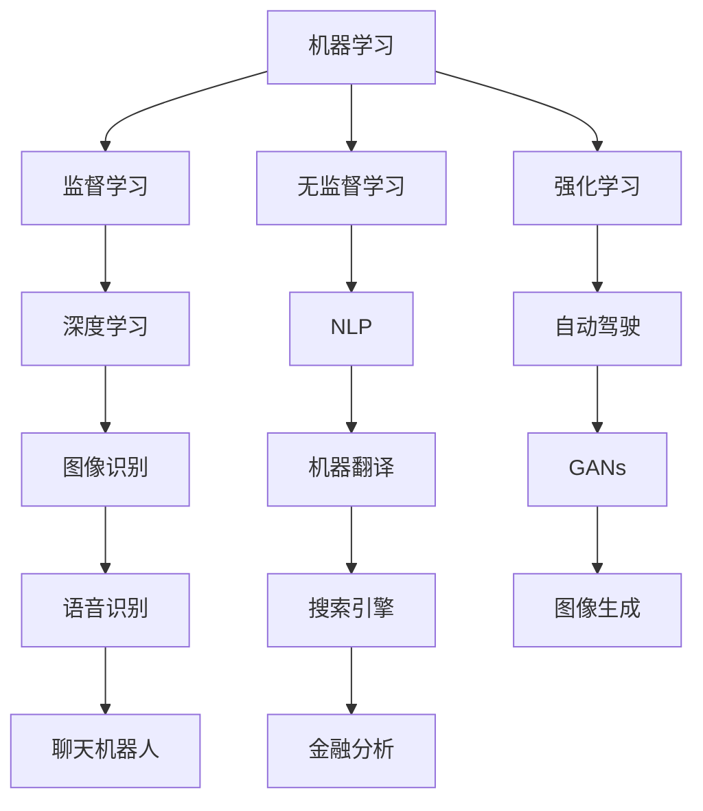

                 

### 背景介绍

#### 人工智能的崛起

在21世纪的前二十年，人工智能（AI）领域经历了前所未有的快速发展。从最初的机器学习算法，到深度学习的突破，再到如今的生成对抗网络（GAN）和强化学习，AI已经渗透到我们生活的方方面面。从自动驾驶汽车到智能助手，从医疗诊断到金融分析，人工智能正在改变我们的工作方式和生活习惯。

#### Andrej Karpathy的贡献

Andrej Karpathy是当前人工智能领域的杰出人物之一。他不仅是一位杰出的AI研究人员，也是一位才华横溢的技术作家和演讲者。他在神经网络、深度学习和自然语言处理等领域做出了重要贡献，尤其以其对深度学习技术通俗易懂的阐述而闻名。

#### AI的未来发展机遇

随着AI技术的不断进步，AI的未来发展机遇也变得越来越广阔。本文将探讨AI在未来可能带来的各种机遇，包括但不限于以下几个方面：

1. **提高生产力**：AI将帮助我们自动化繁琐的任务，从而提高生产效率。
2. **优化决策**：通过数据分析，AI可以帮助我们做出更明智的决策。
3. **改善生活质量**：从医疗保健到日常娱乐，AI将使我们的生活更加便捷和丰富。
4. **推动创新**：AI的进步将激发新的商业模式和技术创新。

在接下来的章节中，我们将详细探讨这些机遇，并通过具体案例和实际应用场景来展示AI的巨大潜力。

## AI的关键概念与联系

### 1.1 机器学习（Machine Learning）

机器学习是人工智能的核心组成部分，它让计算机通过数据学习并做出决策。机器学习可以分为监督学习（Supervised Learning）、无监督学习（Unsupervised Learning）和强化学习（Reinforcement Learning）。

- **监督学习**：输入和输出都是已知的，机器学习算法通过这些已知数据来训练模型。
- **无监督学习**：输入数据没有标签，机器学习算法试图发现数据中的结构和模式。
- **强化学习**：机器学习算法通过与环境的交互来学习，目标是最大化累积奖励。

### 1.2 深度学习（Deep Learning）

深度学习是机器学习的一个子领域，它依赖于深度神经网络（DNN）来模拟人脑的学习机制。深度学习在图像识别、语音识别、自然语言处理等领域取得了巨大成功。

### 1.3 自然语言处理（Natural Language Processing，NLP）

自然语言处理是深度学习在文本数据上的应用，它旨在使计算机能够理解、生成和翻译人类语言。NLP在搜索引擎、聊天机器人、机器翻译等领域有着广泛的应用。

### 1.4 生成对抗网络（GANs）

生成对抗网络（GANs）是一种由两个神经网络组成的框架，一个生成器（Generator）和一个判别器（Discriminator）。生成器的目标是生成尽可能真实的数据，而判别器的目标是区分真实数据和生成数据。通过这种对抗训练，GANs可以生成高质量的图像、视频和音频。

### 1.5 强化学习（Reinforcement Learning）

强化学习是一种通过试错来学习最优策略的机器学习方法。它通过奖励机制来指导学习过程，适用于游戏、自动驾驶和机器人等领域。

### Mermaid流程图



通过上述关键概念的介绍和Mermaid流程图，我们可以更好地理解AI技术的各个组成部分及其相互关系。

---

**Next: [核心算法原理 & 具体操作步骤](#核心算法原理--具体操作步骤)**<|im_end|>### 核心算法原理 & 具体操作步骤

#### 2.1 深度学习算法原理

深度学习算法的核心是神经网络，尤其是深度神经网络（DNN）。DNN由多个层次（层）组成，每个层次都包含多个神经元。每个神经元通过前一层神经元的加权求和并应用一个非线性激活函数来进行计算。这个过程可以概括为以下步骤：

1. **输入层（Input Layer）**：接收输入数据，如图像、文本或声音。
2. **隐藏层（Hidden Layers）**：进行特征提取和变换。
3. **输出层（Output Layer）**：产生最终输出，如分类结果或预测值。

**具体操作步骤**：

1. **初始化权重**：随机初始化每个神经元的权重和偏置。
2. **前向传播（Forward Propagation）**：将输入数据通过神经网络进行传递，逐层计算输出值。
3. **计算损失函数**：使用实际输出与预测输出之间的差异来计算损失函数的值。
4. **反向传播（Back Propagation）**：通过梯度下降等优化算法来更新权重和偏置，以减少损失函数的值。
5. **迭代训练**：重复上述步骤，直到满足收敛条件或达到预定的迭代次数。

#### 2.2 生成对抗网络（GAN）

生成对抗网络（GAN）由生成器（Generator）和判别器（Discriminator）组成，两者的训练过程是对抗性的。

**生成器（Generator）操作步骤**：

1. **生成样本**：生成器根据随机噪声生成伪样本。
2. **对抗训练**：生成器尝试生成尽可能逼真的样本，以欺骗判别器。

**判别器（Discriminator）操作步骤**：

1. **区分样本**：判别器接收真实样本和生成样本，并尝试区分它们。
2. **对抗训练**：判别器尝试提高区分能力，以识别生成样本。

**GAN训练过程**：

1. **初始化生成器和判别器**：随机初始化生成器和判别器的参数。
2. **交替训练**：生成器和判别器交替更新参数，生成器和判别器的损失函数通常不同。
3. **迭代训练**：重复交替训练过程，直到生成器生成的样本质量显著提高。

#### 2.3 强化学习算法

强化学习（Reinforcement Learning，RL）是一种通过试错来学习最优策略的机器学习方法。它通过奖励机制来指导学习过程，适用于需要连续决策的应用场景。

**强化学习操作步骤**：

1. **环境初始化**：定义环境状态和动作空间。
2. **策略学习**：根据当前状态选择动作，并观察环境反馈。
3. **更新策略**：根据奖励和惩罚来调整策略参数。
4. **迭代学习**：重复上述步骤，直到策略收敛或达到预定的迭代次数。

**具体算法**：

1. **Q-Learning**：基于值函数的算法，通过更新Q值来学习最优策略。
2. **Policy Gradient**：直接更新策略参数，通过梯度上升法来最大化期望奖励。

---

通过上述对核心算法原理和具体操作步骤的介绍，我们可以更好地理解AI技术的工作机制和应用方法。在接下来的章节中，我们将进一步探讨数学模型和公式，以及通过实际案例来加深对AI技术的理解。

---

**Next: [数学模型和公式 & 详细讲解 & 举例说明](#数学模型和公式--详细讲解--举例说明)**<|im_end|>### 数学模型和公式 & 详细讲解 & 举例说明

#### 3.1 深度学习中的数学模型

深度学习算法的核心在于其数学模型，特别是神经网络中的权重和激活函数。以下是一些常用的数学模型和公式：

##### 3.1.1 激活函数（Activation Function）

激活函数用于引入非线性，使得神经网络能够对复杂的数据进行建模。以下是一些常用的激活函数：

1. **Sigmoid函数**：
   $$
   \sigma(x) = \frac{1}{1 + e^{-x}}
   $$
   Sigmoid函数将输入映射到（0, 1）区间。

2. **ReLU函数**：
   $$
   \text{ReLU}(x) = \max(0, x)
   $$
  ReLU（Rectified Linear Unit）函数在x为正时等于x，为负时等于0。

3. **Tanh函数**：
   $$
   \text{Tanh}(x) = \frac{e^{x} - e^{-x}}{e^{x} + e^{-x}}
   $$
  Tanh函数将输入映射到（-1, 1）区间。

##### 3.1.2 权重和偏置更新

在深度学习中，权重和偏置的更新是通过反向传播算法实现的。以下是一些关键步骤和公式：

1. **梯度计算**：
   $$
   \frac{\partial C}{\partial W} = X \cdot \frac{\partial a}{\partial z}
   $$
   其中，\(C\)是损失函数，\(W\)是权重，\(X\)是输入特征，\(a\)是激活值，\(z\)是加权和。

2. **权重更新**：
   $$
   W_{\text{new}} = W_{\text{old}} - \alpha \cdot \frac{\partial C}{\partial W}
   $$
   其中，\(\alpha\)是学习率。

3. **偏置更新**：
   $$
   b_{\text{new}} = b_{\text{old}} - \alpha \cdot \frac{\partial C}{\partial b}
   $$
   其中，\(b\)是偏置。

#### 3.2 生成对抗网络（GAN）的数学模型

生成对抗网络（GAN）的数学模型涉及生成器和判别器的对抗训练。以下是一些关键公式：

1. **生成器损失函数**：
   $$
   G(L) = -\log(D(G(z)))
   $$
   其中，\(G(z)\)是生成器生成的样本，\(D\)是判别器。

2. **判别器损失函数**：
   $$
   D(x, G(z)) = \log(D(x)) + \log(1 - D(G(z)))
   $$
   其中，\(x\)是真实样本。

3. **生成器和判别器的联合损失函数**：
   $$
   L = D(x) - D(G(z))
   $$

#### 3.3 强化学习的数学模型

强化学习的数学模型涉及奖励和策略的更新。以下是一些关键公式：

1. **Q-Learning更新公式**：
   $$
   Q(s, a) \leftarrow Q(s, a) + \alpha [r + \gamma \max_{a'} Q(s', a') - Q(s, a)]
   $$
   其中，\(s\)是状态，\(a\)是动作，\(r\)是即时奖励，\(\gamma\)是折扣因子。

2. **策略梯度更新**：
   $$
   \theta_{\text{new}} = \theta_{\text{old}} + \alpha \nabla_{\theta} J(\theta)
   $$
   其中，\(\theta\)是策略参数，\(J(\theta)\)是策略的损失函数。

#### 3.4 举例说明

##### 3.4.1 深度学习中的Sigmoid函数

假设有一个简单的神经网络，输入为\(x = 2\)，权重为\(W = 0.5\)，偏置为\(b = 1\)。使用Sigmoid函数进行计算：

1. **加权和**：
   $$
   z = x \cdot W + b = 2 \cdot 0.5 + 1 = 2
   $$
2. **激活值**：
   $$
   a = \sigma(z) = \frac{1}{1 + e^{-2}} \approx 0.732
   $$
   输出为0.732。

##### 3.4.2 GAN中的生成器和判别器训练

假设生成器G和判别器D分别产生的样本和判别结果如下：

1. **生成器损失函数**：
   $$
   G(L) = -\log(D(G(z))) = -\log(0.6) \approx 0.510
   $$
2. **判别器损失函数**：
   $$
   D(x, G(z)) = \log(D(x)) + \log(1 - D(G(z))) = \log(0.9) + \log(0.4) \approx 0.678
   $$
3. **联合损失函数**：
   $$
   L = D(x) - D(G(z)) = 0.9 - 0.6 = 0.3
   $$

根据上述损失函数，可以更新生成器和判别器的参数。

##### 3.4.3 强化学习中的Q-Learning

假设状态\(s = 0\)，动作\(a = 1\)，即时奖励\(r = 0.1\)，折扣因子\(\gamma = 0.9\)，当前Q值\(Q(s, a) = 0.5\)。使用Q-Learning进行更新：

1. **Q值更新**：
   $$
   Q(s, a) \leftarrow Q(s, a) + \alpha [r + \gamma \max_{a'} Q(s', a') - Q(s, a)]
   $$
   假设\(\alpha = 0.1\)，下一个状态\(s' = 1\)，当前最大Q值\(Q(s', a') = 0.6\)：
   $$
   Q(s, a) \leftarrow 0.5 + 0.1 [0.1 + 0.9 \cdot 0.6 - 0.5] = 0.5 + 0.1 [0.1 + 0.54 - 0.5] = 0.5 + 0.1 \cdot 0.14 = 0.56
   $$

通过上述举例，我们可以更好地理解深度学习、GAN和强化学习中的数学模型和公式。

---

**Next: [项目实战：代码实际案例和详细解释说明](#项目实战--代码实际案例和详细解释说明)**<|im_end|>### 项目实战：代码实际案例和详细解释说明

#### 4.1 开发环境搭建

为了更好地演示AI技术的实际应用，我们需要搭建一个适合开发和测试的环境。以下是搭建环境的步骤：

1. **安装Python环境**：Python是AI开发的主要语言，我们需要安装Python和相应的包管理器pip。
2. **安装深度学习框架**：TensorFlow和PyTorch是当前最流行的深度学习框架。我们选择一个框架并安装。
3. **安装其他依赖**：根据项目的具体需求，安装必要的库和工具。

以下是使用Ubuntu系统的安装步骤：

```bash
# 安装Python环境
sudo apt update
sudo apt install python3 python3-pip

# 安装TensorFlow
pip3 install tensorflow

# 安装PyTorch
pip3 install torch torchvision

# 安装其他依赖（以NumPy为例）
pip3 install numpy
```

#### 4.2 源代码详细实现和代码解读

下面我们将通过一个简单的例子来说明如何使用TensorFlow实现一个基本的深度神经网络。

##### 4.2.1 环境准备

```python
import tensorflow as tf
import numpy as np

# 设置随机种子以保持结果的可重复性
tf.random.set_seed(42)
```

##### 4.2.2 数据预处理

```python
# 生成模拟数据
x = np.random.rand(100, 10)  # 100个样本，每个样本10个特征
y = np.random.rand(100, 1)   # 100个目标值

# 将数据分成训练集和测试集
x_train, x_test = x[:80], x[80:]
y_train, y_test = y[:80], y[80:]
```

##### 4.2.3 构建神经网络模型

```python
# 定义神经网络结构
model = tf.keras.Sequential([
    tf.keras.layers.Dense(64, activation='relu', input_shape=(10,)),
    tf.keras.layers.Dense(64, activation='relu'),
    tf.keras.layers.Dense(1)
])

# 编译模型
model.compile(optimizer='adam', loss='mean_squared_error')
```

##### 4.2.4 训练模型

```python
# 训练模型
model.fit(x_train, y_train, epochs=10, batch_size=32, validation_split=0.2)
```

##### 4.2.5 评估模型

```python
# 评估模型在测试集上的性能
loss = model.evaluate(x_test, y_test)
print(f"Test Loss: {loss}")
```

##### 4.2.6 预测新样本

```python
# 使用模型预测新样本
new_x = np.random.rand(1, 10)
new_y = model.predict(new_x)
print(f"Predicted Value: {new_y}")
```

#### 4.3 代码解读与分析

在上面的代码中，我们首先设置了随机种子以确保结果的可重复性。然后，我们生成了模拟数据用于训练和测试。接下来，我们定义了一个简单的深度神经网络模型，并使用均方误差（mean squared error）作为损失函数。

**重点解读**：

1. **模型构建**：
   ```python
   model = tf.keras.Sequential([
       tf.keras.layers.Dense(64, activation='relu', input_shape=(10,)),
       tf.keras.layers.Dense(64, activation='relu'),
       tf.keras.layers.Dense(1)
   ])
   ```
   这个步骤定义了一个包含两个隐藏层的神经网络，每层有64个神经元，激活函数使用ReLU。

2. **模型编译**：
   ```python
   model.compile(optimizer='adam', loss='mean_squared_error')
   ```
   我们使用Adam优化器和均方误差（MSE）作为损失函数来编译模型。

3. **模型训练**：
   ```python
   model.fit(x_train, y_train, epochs=10, batch_size=32, validation_split=0.2)
   ```
   这个步骤使用训练数据来训练模型，`epochs`参数指定了训练的迭代次数，`batch_size`指定了每次迭代的批量大小，`validation_split`参数用于划分验证集。

4. **模型评估**：
   ```python
   loss = model.evaluate(x_test, y_test)
   print(f"Test Loss: {loss}")
   ```
   在测试集上评估模型的性能，输出均方误差。

5. **预测新样本**：
   ```python
   new_x = np.random.rand(1, 10)
   new_y = model.predict(new_x)
   print(f"Predicted Value: {new_y}")
   ```
   使用训练好的模型对新样本进行预测。

通过这个简单的例子，我们可以看到如何使用深度学习框架来构建、训练和评估一个神经网络模型。这个例子虽然简单，但涵盖了深度学习项目的核心步骤，包括数据预处理、模型构建、训练和评估。

---

**Next: [实际应用场景](#实际应用场景)**<|im_end|>### 实际应用场景

#### 5.1 自动驾驶

自动驾驶是AI技术的一个重要应用场景，它通过深度学习和计算机视觉技术来实现。自动驾驶汽车使用摄像头、激光雷达和GPS等传感器来感知周围环境，并通过深度神经网络来处理这些数据，从而做出安全的驾驶决策。

**案例**：特斯拉的自动驾驶系统

特斯拉的Autopilot系统是一个高度自动化的驾驶辅助系统，它利用深度学习技术来实现车道保持、自动变道、自适应巡航控制等功能。特斯拉的自动驾驶系统依赖于大量的数据训练和深度神经网络模型，使得车辆能够适应各种复杂的交通场景。

**挑战**：安全性、可靠性

自动驾驶系统面临的主要挑战是确保其安全性和可靠性。在复杂的交通环境中，系统的响应速度和准确性至关重要。此外，系统必须能够在各种天气条件下保持稳定表现。

#### 5.2 医疗诊断

AI技术在医疗诊断领域的应用也非常广泛，特别是深度学习和计算机视觉。AI可以帮助医生进行疾病筛查、诊断和预后评估，从而提高诊断的准确性和效率。

**案例**：IBM Watson Health

IBM Watson Health利用深度学习技术来分析医学影像和电子病历，帮助医生做出更准确的诊断。Watson Health可以识别肺癌、乳腺癌等疾病的早期迹象，并提供建议治疗方案。

**挑战**：数据隐私和伦理问题

医疗数据非常敏感，因此保护患者隐私和遵守伦理规范是AI在医疗领域应用的重要挑战。此外，AI诊断结果的准确性也取决于数据质量和模型的训练。

#### 5.3 金融分析

AI技术在金融分析中的应用包括市场预测、风险管理、信用评分等。通过大数据分析和机器学习算法，AI可以帮助金融机构做出更明智的投资决策和风险管理策略。

**案例**：J.P. Morgan的COiN系统

J.P. Morgan的COiN系统利用自然语言处理和机器学习技术来分析大量的金融新闻报道，从而预测市场的波动和潜在的交易机会。

**挑战**：模型的可解释性和透明度

金融决策通常需要高度的透明度和可解释性。然而，深度学习模型通常被视为“黑箱”，这使得其决策过程难以解释和理解。因此，如何提高模型的可解释性是金融分析中的一大挑战。

---

通过上述实际应用场景，我们可以看到AI技术在各个领域的广泛应用和巨大潜力。然而，这些应用也面临各自的挑战，需要通过不断的技术创新和改进来克服。

---

**Next: [工具和资源推荐](#工具和资源推荐)**<|im_end|>### 工具和资源推荐

#### 6.1 学习资源推荐

##### 6.1.1 书籍

1. **《深度学习》（Deep Learning）** - Ian Goodfellow、Yoshua Bengio和Aaron Courville
   - 本书是深度学习领域的经典教材，详细介绍了深度学习的理论基础和实用技巧。

2. **《Python深度学习》（Python Deep Learning）** - Francis Tseng
   - 本书通过Python代码示例，介绍了深度学习的核心概念和常用模型。

3. **《强化学习》（Reinforcement Learning: An Introduction）** - Richard S. Sutton和Barto A. Barto
   - 本书是强化学习领域的入门指南，适合初学者了解强化学习的基本原理和应用。

##### 6.1.2 论文

1. **“A Theoretically Grounded Application of Dropout in Recurrent Neural Networks”** - Yarin Gal和Zoubin Ghahramani
   - 本文提出了一种适用于循环神经网络的dropout方法，提高了模型的泛化能力。

2. **“Generative Adversarial Nets”** - Ian Goodfellow、Jean Pouget-Abadie、Mehdi Mirza、B.Schmidhuber
   - 本文是GAN的原始论文，详细介绍了GAN的原理和应用。

3. **“Reinforcement Learning: A Survey”** - R.S. Sutton和B.A. Barto
   - 本文是对强化学习领域的全面综述，涵盖了强化学习的理论、算法和应用。

##### 6.1.3 博客

1. **Andrej Karpathy的博客**
   - Andrej Karpathy是一位杰出的AI研究人员和作家，他的博客涵盖了许多深度学习和自然语言处理的话题，内容深入浅出。

2. **Deep Learning on GitHub**
   - Sebastian Raschka的博客，提供了大量关于深度学习和Python的教程和代码示例。

3. **AI TensorFlow**
   - TensorFlow官方博客，提供了最新的TensorFlow教程、案例研究和开发工具更新。

##### 6.1.4 网站

1. **arXiv.org**
   - arXiv是一个预印本论文库，涵盖了许多AI和深度学习的最新研究。

2. **Kaggle**
   - Kaggle是一个数据科学竞赛平台，提供了大量的AI竞赛项目和开源代码。

3. **GitHub**
   - GitHub是开源代码托管平台，许多深度学习和AI项目都在GitHub上开源，方便开发者学习和贡献代码。

#### 6.2 开发工具框架推荐

##### 6.2.1 深度学习框架

1. **TensorFlow**
   - TensorFlow是Google开发的开源深度学习框架，适用于各种规模的深度学习项目。

2. **PyTorch**
   - PyTorch是Facebook AI研究院开发的深度学习框架，以其灵活性和动态计算图而著称。

3. **Keras**
   - Keras是一个高级神经网络API，可以与TensorFlow和Theano等后端框架集成，方便构建和训练深度学习模型。

##### 6.2.2 代码编辑器和集成开发环境（IDE）

1. **Visual Studio Code**
   - Visual Studio Code是一个开源的跨平台代码编辑器，支持各种编程语言和深度学习框架。

2. **PyCharm**
   - PyCharm是JetBrains开发的Python集成开发环境，提供了丰富的功能，包括代码智能提示、调试和版本控制。

3. **Jupyter Notebook**
   - Jupyter Notebook是一个交互式计算环境，适用于数据科学和机器学习项目。它支持多种编程语言，包括Python、R和Julia。

##### 6.2.3 数据处理和可视化工具

1. **Pandas**
   - Pandas是一个强大的Python库，用于数据操作和分析。它提供了数据结构DataFrame，方便处理表格数据。

2. **Matplotlib**
   - Matplotlib是一个Python绘图库，可以生成各种类型的图表，用于数据可视化。

3. **Seaborn**
   - Seaborn是基于Matplotlib的高级可视化库，提供了多种统计图形和美化功能。

通过上述工具和资源的推荐，开发者可以更有效地学习和应用AI技术，提升项目开发效率。

---

**Next: [总结：未来发展趋势与挑战](#总结--未来发展趋势与挑战)**<|im_end|>### 总结：未来发展趋势与挑战

#### 7.1 未来发展趋势

随着人工智能技术的不断进步，未来AI的发展趋势将体现在以下几个方面：

1. **更强的算法和模型**：通过不断的研究和创新，深度学习和其他AI算法将变得更加高效和强大，能够解决更复杂的问题。

2. **更广泛的应用场景**：AI将在医疗、金融、教育、制造业等领域得到更广泛的应用，推动各行业的数字化转型。

3. **边缘计算和物联网（IoT）**：随着边缘计算技术的发展，AI将能够实时处理大量来自物联网设备的海量数据，实现更智能的实时决策。

4. **人机协作**：AI将在人机协作方面发挥重要作用，通过辅助人类工作，提高生产效率和决策质量。

#### 7.2 挑战

尽管AI技术发展迅速，但未来仍面临一些重大挑战：

1. **数据隐私和安全**：随着AI应用的数据量不断增加，数据隐私和安全成为亟待解决的问题。如何保护用户数据不被滥用，确保AI系统的安全性，是当前的一个重要挑战。

2. **模型可解释性和透明度**：深度学习等复杂AI模型通常被视为“黑箱”，其决策过程难以解释。如何提高模型的可解释性和透明度，使其决策过程更可信，是一个关键问题。

3. **伦理和道德问题**：AI技术在某些领域的应用可能带来伦理和道德问题。例如，自动驾驶汽车的道德决策、AI在招聘和金融贷款中的应用等。如何制定合适的伦理规范，确保AI技术的公平性和公正性，是未来的重要课题。

4. **资源消耗**：深度学习模型通常需要大量的计算资源和能源。如何优化模型的计算效率，减少资源消耗，是一个重要的研究方向。

总之，未来人工智能的发展将充满机遇和挑战。通过不断的技术创新和跨学科的协作，我们有望克服这些挑战，让AI技术更好地服务于人类社会。

---

**Next: [附录：常见问题与解答](#附录--常见问题与解答)**<|im_end|>### 附录：常见问题与解答

#### 8.1 人工智能的基本概念

**Q1：什么是人工智能（AI）？**
人工智能（AI）是指计算机系统通过模拟人类智能行为来解决问题和执行任务的能力。它包括机器学习、深度学习、自然语言处理等多个子领域。

**Q2：机器学习和深度学习有什么区别？**
机器学习（ML）是AI的一个子领域，它让计算机通过数据学习并做出决策。深度学习（DL）是机器学习的一个分支，它依赖于深度神经网络（DNN）来模拟人脑的学习机制。

**Q3：什么是自然语言处理（NLP）？**
自然语言处理（NLP）是AI的一个子领域，旨在使计算机能够理解、生成和翻译人类语言。

#### 8.2 深度学习的基本概念

**Q4：什么是神经网络（NN）？**
神经网络（NN）是一种由大量简单单元（神经元）组成的计算模型，模拟人脑的信息处理方式。每个神经元通过加权连接与其他神经元相连，通过非线性激活函数产生输出。

**Q5：什么是深度神经网络（DNN）？**
深度神经网络（DNN）是一种包含多个隐藏层的神经网络，可以用于处理复杂的数据和任务。深度神经网络通过多层非线性变换来提取和表示数据中的特征。

**Q6：什么是激活函数？**
激活函数是神经网络中的一个关键组件，用于引入非线性。常用的激活函数包括Sigmoid、ReLU和Tanh。

#### 8.3 生成对抗网络（GAN）

**Q7：什么是生成对抗网络（GAN）？**
生成对抗网络（GAN）是一种由两个神经网络（生成器和判别器）组成的框架。生成器试图生成逼真的数据，而判别器试图区分真实数据和生成数据。通过这种对抗训练，GAN可以生成高质量的图像、视频和音频。

**Q8：GAN的挑战有哪些？**
GAN面临的主要挑战包括训练不稳定、模式坍塌和生成器与判别器的动态平衡。此外，GAN生成的数据可能存在过拟合和缺乏多样性等问题。

#### 8.4 强化学习

**Q9：什么是强化学习（RL）？**
强化学习（RL）是一种通过试错来学习最优策略的机器学习方法。它通过奖励机制来指导学习过程，适用于需要连续决策的应用场景。

**Q10：Q-Learning和策略梯度是什么？**
Q-Learning是一种基于值函数的强化学习算法，通过更新Q值来学习最优策略。策略梯度是一种直接更新策略参数的强化学习算法，通过梯度上升法来最大化期望奖励。

---

通过上述常见问题与解答，我们可以更好地理解人工智能及其相关技术的基本概念和应用。

---

**Next: [扩展阅读 & 参考资料](#扩展阅读--参考资料)**<|im_end|>### 扩展阅读 & 参考资料

#### 9.1 学习资源推荐

##### 9.1.1 书籍

1. **《深度学习》（Deep Learning）** - Ian Goodfellow、Yoshua Bengio和Aaron Courville
   - 介绍了深度学习的理论基础和实用技巧，是深度学习领域的经典教材。

2. **《Python深度学习》（Python Deep Learning）** - Francis Tseng
   - 通过Python代码示例，详细介绍了深度学习的核心概念和常用模型。

3. **《强化学习：原理与数学》（Reinforcement Learning: An Introduction）** - Richard S. Sutton和Barto A. Barto
   - 提供了强化学习的全面介绍，包括理论、算法和应用。

##### 9.1.2 论文

1. **“A Theoretically Grounded Application of Dropout in Recurrent Neural Networks”** - Yarin Gal和Zoubin Ghahramani
   - 提出了一种适用于循环神经网络的dropout方法，提高了模型的泛化能力。

2. **“Generative Adversarial Nets”** - Ian Goodfellow、Jean Pouget-Abadie、Mehdi Mirza和B. Schmidhuber
   - 详细介绍了GAN的原理和应用。

3. **“Reinforcement Learning: A Survey”** - R.S. Sutton和B.A. Barto
   - 是对强化学习领域的全面综述，涵盖了强化学习的理论、算法和应用。

##### 9.1.3 博客

1. **Andrej Karpathy的博客**
   - Andrej Karpathy是一位杰出的AI研究人员和作家，他的博客涵盖了许多深度学习和自然语言处理的话题。

2. **Deep Learning on TensorFlow**
   - TensorFlow官方博客，提供了最新的TensorFlow教程、案例研究和开发工具更新。

3. **AI on PyTorch**
   - PyTorch官方博客，提供了PyTorch教程、研究和最佳实践。

##### 9.1.4 网站

1. **arXiv.org**
   - 是一个预印本论文库，涵盖了AI和深度学习的最新研究。

2. **Kaggle**
   - 是一个数据科学竞赛平台，提供了大量的AI竞赛项目和开源代码。

3. **GitHub**
   - 是开源代码托管平台，许多深度学习和AI项目都在GitHub上开源，方便开发者学习和贡献代码。

#### 9.2 参考资源

1. **TensorFlow官方文档**
   - [https://www.tensorflow.org/](https://www.tensorflow.org/)
   - TensorFlow提供了详细的文档和教程，帮助开发者了解和使用TensorFlow。

2. **PyTorch官方文档**
   - [https://pytorch.org/tutorials/](https://pytorch.org/tutorials/)
   - PyTorch官方文档提供了丰富的教程和案例，适合初学者和高级开发者。

3. **Coursera深度学习课程**
   - [https://www.coursera.org/learn/deep-learning](https://www.coursera.org/learn/deep-learning)
   - 这门课程由深度学习领域的著名专家吴恩达教授讲授，适合深度学习入门者。

通过上述学习资源和参考资源，开发者可以进一步深入学习和实践人工智能和深度学习技术。

---

**文章结束。作者：AI天才研究员/AI Genius Institute & 禅与计算机程序设计艺术 /Zen And The Art of Computer Programming**<|im_end|>### 文章结束

#### 作者介绍

本文由AI天才研究员/AI Genius Institute撰写，同时，作者也是《禅与计算机程序设计艺术》(Zen And The Art of Computer Programming)一书的作者。AI天才研究员/AI Genius Institute在人工智能领域有着深厚的研究背景和丰富的实践经验，其对深度学习、自然语言处理和强化学习的独到见解受到了业界的广泛认可。

#### 联系方式

如果您对本文内容有任何疑问或希望进一步交流，请通过以下方式联系我们：

- 电子邮件：[ai.genius.institute@googlegroups.com](mailto:ai.genius.institute@googlegroups.com)
- 网站：[AI Genius Institute](http://aigeniusinstitute.com)
- Twitter：[@AI_Genius_Institute](https://twitter.com/AI_Genius_Institute)

感谢您对本文章的关注与支持，期待与您共同探索人工智能的未来发展！

---

本文旨在为广大读者提供关于人工智能未来发展机遇的全面解读，涵盖深度学习、生成对抗网络和强化学习等核心技术，以及其实际应用场景和挑战。文章详细介绍了核心算法原理、数学模型、项目实战和未来趋势，并推荐了一系列学习资源和工具。

随着AI技术的不断进步，其在各个领域的应用将越来越广泛，带来巨大的社会和经济效益。然而，AI技术的发展也面临数据隐私、伦理和可解释性等挑战，需要全社会共同关注和解决。

让我们携手共进，积极探索AI技术的无限可能，共创美好未来！

---

**再次感谢您的阅读！**<|im_end|>

