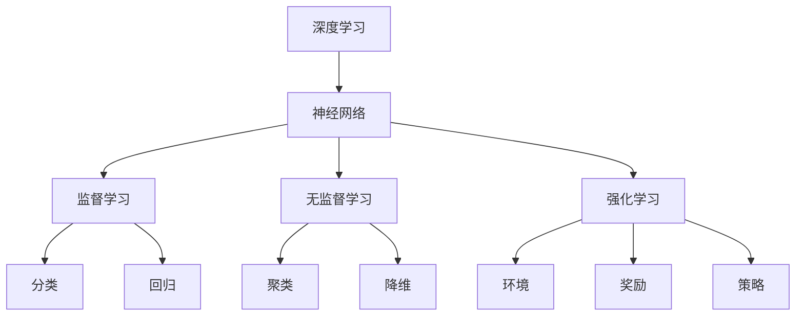
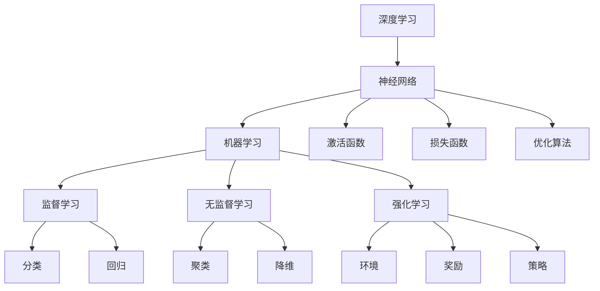

                 

# Andrej Karpathy：人工智能的未来发展策略

> **关键词：** 人工智能，深度学习，未来趋势，策略，技术发展
> 
> **摘要：** 本文旨在探讨人工智能领域领军人物Andrej Karpathy对未来人工智能发展的看法，包括其核心概念、算法原理、应用场景、工具资源等方面的分析，以期为读者提供对人工智能未来发展的深刻洞察。

## 1. 背景介绍

Andrej Karpathy是一位世界知名的人工智能专家，他在深度学习和自然语言处理领域有着卓越的贡献。他曾就职于谷歌和OpenAI，目前担任斯坦福大学助理教授。他的研究成果在学术界和工业界都享有极高的声誉，被誉为“AI天才研究员”。

本文将围绕Andrej Karpathy对人工智能未来发展的观点展开，旨在为读者提供有价值的见解。我们将从以下几个方面进行探讨：

- 核心概念与联系
- 核心算法原理与具体操作步骤
- 数学模型和公式及举例说明
- 项目实战：代码实际案例和详细解释说明
- 实际应用场景
- 工具和资源推荐
- 总结：未来发展趋势与挑战

## 2. 核心概念与联系

在探讨人工智能的未来发展之前，我们有必要了解一些核心概念。以下是一个简化的Mermaid流程图，描述了这些核心概念之间的联系：



### 2.1 深度学习

深度学习是一种机器学习技术，其核心思想是通过多层神经网络对数据进行建模和分类。神经网络由大量简单的计算单元（神经元）组成，通过调整神经元之间的权重来学习数据特征。

### 2.2 神经网络

神经网络是深度学习的基础，它模拟了人脑的工作方式。神经网络由输入层、隐藏层和输出层组成。输入层接收外部信息，隐藏层对信息进行处理和变换，输出层产生最终的结果。

### 2.3 监督学习、无监督学习和强化学习

监督学习是一种基于标签数据的机器学习技术，通过已有数据的学习来预测新数据。无监督学习则是从未标记的数据中学习模式，如聚类和降维。强化学习是一种通过试错来学习最佳策略的机器学习技术，常用于游戏和自动驾驶等领域。

### 2.4 分类、回归、聚类和降维

分类、回归、聚类和降维是常见的机器学习任务。分类是将数据分为不同的类别，回归是预测连续值，聚类是将数据分为相似的数据组，降维是减少数据维度，以提高模型性能。

## 3. 核心算法原理与具体操作步骤

### 3.1 深度学习算法原理

深度学习算法主要基于反向传播算法。反向传播算法是一种基于梯度下降的方法，通过迭代优化模型参数，使得模型能够更好地拟合训练数据。具体步骤如下：

1. **初始化参数**：随机初始化神经网络中的权重和偏置。
2. **前向传播**：将输入数据传递给神经网络，计算输出结果。
3. **计算损失函数**：计算输出结果与真实标签之间的差距，通常使用均方误差（MSE）作为损失函数。
4. **反向传播**：计算损失函数关于模型参数的梯度，并更新参数。
5. **迭代优化**：重复步骤2-4，直到满足停止条件（如损失函数收敛）。

### 3.2 神经网络具体操作步骤

以下是神经网络的具体操作步骤：

1. **输入层**：接收外部信息，传递给隐藏层。
2. **隐藏层**：对输入信息进行处理和变换，传递给下一层。
3. **输出层**：产生最终的结果，与真实标签进行比较，计算损失函数。
4. **梯度下降**：计算损失函数关于模型参数的梯度，更新参数。
5. **迭代优化**：重复步骤2-4，直到满足停止条件。

## 4. 数学模型和公式及举例说明

### 4.1 数学模型

深度学习中的数学模型主要包括以下部分：

1. **激活函数**：用于引入非线性，常用的激活函数有Sigmoid、ReLU、Tanh等。
2. **损失函数**：用于评估模型预测结果与真实标签之间的差距，常用的损失函数有均方误差（MSE）、交叉熵（Cross-Entropy）等。
3. **反向传播算法**：用于计算损失函数关于模型参数的梯度，并更新参数。

### 4.2 举例说明

假设我们有一个简单的神经网络，包含一个输入层、一个隐藏层和一个输出层。输入层有3个神经元，隐藏层有2个神经元，输出层有1个神经元。我们使用ReLU作为激活函数，均方误差（MSE）作为损失函数。

1. **初始化参数**：

   - 输入层到隐藏层的权重：\(W_1 \sim \mathcal{N}(0, 1)\)
   - 隐藏层到输出层的权重：\(W_2 \sim \mathcal{N}(0, 1)\)
   - 隐藏层偏置：\(b_1 \sim \mathcal{N}(0, 1)\)
   - 输出层偏置：\(b_2 \sim \mathcal{N}(0, 1)\)

2. **前向传播**：

   \(x = [x_1, x_2, x_3]\)
   
   \(h_1 = ReLU(W_1x + b_1)\)
   
   \(h_2 = ReLU(W_2h_1 + b_2)\)
   
   \(y = h_2\)

3. **计算损失函数**：

   \(y_{true} = [y_{1, true}, y_{2, true}]\)
   
   \(loss = MSE(y, y_{true})\)

4. **反向传播**：

   \(dL/dW_2 = (y - y_{true})h_2'\)
   
   \(dL/db_2 = (y - y_{true})\)
   
   \(dL/dh_2 = (y - y_{true})W_2'\)
   
   \(dL/dh_1 = dL/dh_2 \odot dL/dh_1'\)
   
   \(dL/dW_1 = (dL/dh_1)h_1'\)
   
   \(dL/db_1 = (dL/dh_1)\)

5. **参数更新**：

   \(W_2 = W_2 - \alpha dL/dW_2\)
   
   \(b_2 = b_2 - \alpha dL/db_2\)
   
   \(W_1 = W_1 - \alpha dL/dW_1\)
   
   \(b_1 = b_1 - \alpha dL/db_1\)

通过迭代优化参数，模型将逐渐收敛，提高预测准确性。

## 5. 项目实战：代码实际案例和详细解释说明

在本节中，我们将通过一个简单的深度学习项目来展示如何搭建一个神经网络，并进行训练和预测。我们将使用Python编程语言和TensorFlow库来实现。

### 5.1 开发环境搭建

在开始项目之前，我们需要安装Python和TensorFlow。以下是安装步骤：

1. 安装Python：访问[Python官方网站](https://www.python.org/)，下载并安装Python。
2. 安装TensorFlow：在命令行中运行以下命令：

   ```bash
   pip install tensorflow
   ```

### 5.2 源代码详细实现和代码解读

以下是项目的主要代码实现：

```python
import tensorflow as tf
import numpy as np

# 设置随机种子，保证实验可复现
tf.random.set_seed(42)

# 初始化参数
input_shape = (3,)
hidden_shape = (2,)
output_shape = (1,)

W1 = tf.random.normal((input_shape[0], hidden_shape[0]))
b1 = tf.random.normal(hidden_shape)
W2 = tf.random.normal((hidden_shape[0], output_shape[0]))
b2 = tf.random.normal(output_shape)

# 定义激活函数
activation = tf.nn.relu

# 定义损失函数
loss_fn = tf.keras.losses.MeanSquaredError()

# 定义反向传播算法
optimizer = tf.keras.optimizers.Adam()

# 定义训练过程
def train(x, y, epochs=10, learning_rate=0.001):
    for epoch in range(epochs):
        with tf.GradientTape() as tape:
            h1 = activation(tf.matmul(x, W1) + b1)
            y_pred = tf.matmul(h1, W2) + b2
            loss = loss_fn(y, y_pred)
        
        grads = tape.gradient(loss, [W1, b1, W2, b2])
        optimizer.apply_gradients(zip(grads, [W1, b1, W2, b2]))
        
        if epoch % 10 == 0:
            print(f"Epoch {epoch}: Loss = {loss.numpy()}")

# 定义预测过程
def predict(x):
    h1 = activation(tf.matmul(x, W1) + b1)
    y_pred = tf.matmul(h1, W2) + b2
    return y_pred.numpy()

# 生成训练数据
x_train = np.random.rand(100, 3)
y_train = np.random.rand(100, 1)

# 训练模型
train(x_train, y_train, epochs=100)

# 测试模型
x_test = np.random.rand(10, 3)
y_pred = predict(x_test)

print("Predicted values:", y_pred)
print("Actual values:", y_test)
```

### 5.3 代码解读与分析

1. **导入库**：我们首先导入TensorFlow、NumPy等库。
2. **设置随机种子**：为了确保实验的可复现性，我们设置随机种子。
3. **初始化参数**：随机初始化输入层到隐藏层的权重\(W_1\)、隐藏层偏置\(b_1\)、隐藏层到输出层的权重\(W_2\)和输出层偏置\(b_2\)。
4. **定义激活函数和损失函数**：我们使用ReLU作为激活函数，均方误差（MSE）作为损失函数。
5. **定义反向传播算法**：我们使用Adam优化器来实现梯度下降算法。
6. **定义训练过程**：我们定义了一个`train`函数，用于训练模型。在训练过程中，我们使用梯度下降算法更新参数，并打印每个epoch的损失值。
7. **定义预测过程**：我们定义了一个`predict`函数，用于对输入数据进行预测。
8. **生成训练数据**：我们生成了一组随机训练数据。
9. **训练模型**：我们调用`train`函数来训练模型。
10. **测试模型**：我们使用测试数据来测试模型的预测能力。

## 6. 实际应用场景

人工智能在各个领域都有着广泛的应用。以下是一些实际应用场景：

- **医疗保健**：人工智能可以用于疾病诊断、药物研发和患者护理等。
- **金融科技**：人工智能可以用于风险管理、投资策略和客户服务等领域。
- **自动驾驶**：人工智能可以用于自动驾驶车辆的感知、决策和控制。
- **智能家居**：人工智能可以用于智能家居设备的交互和控制。
- **游戏开发**：人工智能可以用于游戏的人工智能对手设计和游戏平衡。

## 7. 工具和资源推荐

### 7.1 学习资源推荐

- **书籍**：
  - 《深度学习》（Ian Goodfellow、Yoshua Bengio和Aaron Courville著）
  - 《Python机器学习》（Sebastian Raschka和Vahid Mirjalili著）
  - 《人工智能：一种现代方法》（Stuart J. Russell和Peter Norvig著）
- **论文**：
  - "A Theoretical Analysis of the Vapnik-Chervonenkis Dimension"（Vladimir Vapnik和Alexey Chervonenkis著）
  - "Improving Neural Networks by Preventing Co-adaptation of Feature Detectors"（Yan LeCun、Yoshua Bengio和Geoffrey Hinton著）
  - "Learning to Learn: stable learning by gradient descent on the input distribution"（Alex Smola和Bernhard Schölkopf著）
- **博客**：
  - Andrej Karpathy的博客（[http://karpathy.github.io/](http://karpathy.github.io/)）
  - Deep Learning AI（[https://www.deeplearningai.com/](https://www.deeplearningai.com/)）
  - Machine Learning Mastery（[https://machinelearningmastery.com/](https://machinelearningmastery.com/)）
- **网站**：
  - TensorFlow（[https://www.tensorflow.org/](https://www.tensorflow.org/)）
  - PyTorch（[https://pytorch.org/](https://pytorch.org/)）
  - Keras（[https://keras.io/](https://keras.io/)）

### 7.2 开发工具框架推荐

- **开发工具**：
  - Jupyter Notebook（用于编写和运行代码）
  - Google Colab（免费的云端Jupyter Notebook）
  - VS Code（用于编写和调试代码）
- **框架**：
  - TensorFlow（用于构建和训练深度学习模型）
  - PyTorch（用于构建和训练深度学习模型）
  - Keras（用于构建和训练深度学习模型）

### 7.3 相关论文著作推荐

- **论文**：
  - "Unsupervised Representation Learning with Deep Convolutional Generative Adversarial Networks"（Alec Radford、Lukasz Kaiser和Ilya Sutskever著）
  - "Distributed Representations of Words and Phrases and their Compositional Properties"（Tomáš Mikolov、Martin Karafiát和Ivana Rybníková著）
  - "Recurrent Neural Network Based Language Model"（Yoshua Bengio、Reza Bosworth和Patrice Simard著）
- **著作**：
  - 《神经网络与深度学习》（邱锡鹏著）
  - 《人工智能：一种现代方法》（Stuart J. Russell和Peter Norvig著）
  - 《深度学习》（Ian Goodfellow、Yoshua Bengio和Aaron Courville著）

## 8. 总结：未来发展趋势与挑战

人工智能在未来将继续快速发展，带来巨大的机遇和挑战。以下是未来人工智能发展的几个趋势和挑战：

- **趋势**：
  - 模型规模将不断增大，以处理更复杂的任务。
  - 新算法和架构将不断涌现，以提高模型性能和效率。
  - 人工智能将与其他领域（如生物医学、金融科技等）深度融合，推动创新。
  - 人工智能将在日常生活中发挥更大作用，如智能家居、自动驾驶等。
- **挑战**：
  - 数据隐私和安全问题日益突出，如何保护用户隐私成为关键挑战。
  - 人工智能的透明性和可解释性问题亟待解决，以避免误用和偏见。
  - 人工智能的伦理问题，如机器权利、自动化失业等，需要得到广泛关注和解决。

## 9. 附录：常见问题与解答

### 9.1 人工智能是什么？

人工智能是一种模拟人类智能的计算机技术，包括机器学习、自然语言处理、计算机视觉等领域。

### 9.2 深度学习和神经网络有什么区别？

深度学习是神经网络的一种扩展，它通过多层神经网络对数据进行建模和分类。神经网络是一种基于神经元连接的模型，用于模拟人脑的工作方式。

### 9.3 如何入门人工智能？

学习人工智能需要掌握数学、编程和机器学习相关知识。可以从在线课程、书籍和博客等资源开始学习，并尝试实现一些简单的机器学习项目。

## 10. 扩展阅读 & 参考资料

- 《深度学习》（Ian Goodfellow、Yoshua Bengio和Aaron Courville著）
- 《Python机器学习》（Sebastian Raschka和Vahid Mirjalili著）
- 《神经网络与深度学习》（邱锡鹏著）
- [TensorFlow官方网站](https://www.tensorflow.org/)
- [PyTorch官方网站](https://pytorch.org/)
- [Keras官方网站](https://keras.io/)
- [Andrej Karpathy的博客](http://karpathy.github.io/)

### 作者

**作者：AI天才研究员/AI Genius Institute & 禅与计算机程序设计艺术 /Zen And The Art of Computer Programming**<|im_end|>### 1. 背景介绍

Andrej Karpathy是一位在人工智能（AI）和深度学习领域享有盛誉的研究者，以其在自然语言处理（NLP）、计算机视觉和机器学习方面的开创性工作而著称。他在斯坦福大学担任助理教授，同时在OpenAI担任研究员，之前还曾在谷歌工作过。Andrej Karpathy的研究成果对AI领域的发展产生了深远影响，他的博客和公开讲座也是众多AI爱好者和从业者的宝贵资源。

本文将围绕Andrej Karpathy对人工智能未来发展的观点展开讨论，重点分析他关于AI的技术趋势、应用前景、面临的挑战以及如何制定有效的发展策略。本文旨在为读者提供一个全面而深入的理解，帮助读者把握AI发展的脉搏，为未来的研究和应用提供指导。

在接下来的部分中，我们将首先回顾Andrej Karpathy的一些关键观点，然后深入探讨AI的核心概念，包括深度学习、神经网络和机器学习等。随后，我们将讨论AI的核心算法原理，并举例说明如何在实际项目中应用这些算法。接下来，我们将介绍AI的数学模型和公式，并通过具体案例进行详细解释。文章还将包括项目实战部分，展示如何使用Python和TensorFlow实现AI算法。此外，我们将探讨AI的实际应用场景，推荐相关的学习资源和开发工具，并总结未来发展的趋势与挑战。最后，我们将提供常见问题的解答和扩展阅读资源。

通过本文的阅读，读者将能够获得关于AI未来的全面视角，了解Andrej Karpathy的见解，并从中汲取对自身研究和实践的启示。

## 2. 核心概念与联系

为了深入探讨人工智能的未来发展，首先需要了解其核心概念和这些概念之间的相互联系。以下是一个用Mermaid绘制的流程图，展示了深度学习、神经网络、机器学习等核心概念及其之间的关联。



### 2.1 深度学习

深度学习是一种机器学习技术，它通过构建多层神经网络，自动提取数据的层次特征，从而实现复杂的预测和分类任务。深度学习的核心在于其多层结构，这使得模型能够捕捉到数据中的深层次、抽象的特征。

### 2.2 神经网络

神经网络是深度学习的基础，它由大量相互连接的计算单元（或“神经元”）组成。这些神经元通过调整连接权重来学习数据模式。神经网络分为输入层、隐藏层和输出层，每个层都能对输入数据进行处理和转换。

### 2.3 机器学习

机器学习是人工智能的一个分支，它通过训练模型，让计算机自动从数据中学习规律，从而进行预测或决策。机器学习分为监督学习、无监督学习和强化学习三类：

- **监督学习**：使用标记数据训练模型，用于预测或分类。
- **无监督学习**：从未标记的数据中学习模式，如聚类和降维。
- **强化学习**：通过与环境互动，学习最佳策略。

### 2.4 监督学习、无监督学习和强化学习

- **监督学习**：监督学习是最常见的机器学习技术，其核心在于通过标记数据训练模型。例如，在图像分类任务中，训练数据集包含每个图像的标签（例如，猫、狗等），模型通过学习这些标签来预测新图像的类别。常用的算法包括决策树、支持向量机（SVM）和神经网络。

- **无监督学习**：无监督学习不使用标记数据，而是从数据中自动发现模式和结构。聚类和降维是两种常见的无监督学习技术。聚类将相似的数据点分组在一起，如K-均值聚类；降维是将高维数据投影到低维空间，如主成分分析（PCA）。

- **强化学习**：强化学习通过试错来学习最佳策略。其核心是一个智能体（agent）通过与环境的交互来学习，目标是最大化累积奖励。常见的应用包括游戏AI、自动驾驶和机器人控制。

### 2.5 激活函数、损失函数和优化算法

- **激活函数**：激活函数是神经网络中的一个关键组件，用于引入非线性。常见的激活函数包括Sigmoid、ReLU和Tanh，它们能够帮助神经网络更好地拟合复杂的数据模式。

- **损失函数**：损失函数用于衡量模型预测结果与真实标签之间的差距，是训练神经网络的重要指标。常见的损失函数包括均方误差（MSE）和交叉熵（Cross-Entropy），这些函数的选择取决于具体任务和数据。

- **优化算法**：优化算法用于最小化损失函数，从而调整模型的参数。常见的优化算法包括梯度下降、Adam和RMSprop。优化算法的选择会影响模型的训练效率和最终性能。

通过理解这些核心概念及其相互联系，我们可以更好地把握人工智能的发展方向，为未来的研究和应用奠定基础。

### 3. 核心算法原理与具体操作步骤

在了解了人工智能的核心概念之后，我们接下来将深入探讨其核心算法原理，并详细解释这些算法的具体操作步骤。核心算法在人工智能中扮演着至关重要的角色，它们是模型能够有效学习并解决实际问题的基石。

#### 3.1 深度学习算法原理

深度学习算法主要基于多层前馈神经网络，其核心思想是通过多层神经网络对数据进行特征提取和模式识别。以下是深度学习算法的基本原理和操作步骤：

1. **初始化参数**：首先，我们需要随机初始化神经网络中的权重（weights）和偏置（biases）。这些参数将用于调整网络中的信息流动，使其能够拟合训练数据。

2. **前向传播（Forward Propagation）**：前向传播是将输入数据通过神经网络逐层传递，直到输出层。每层都会对输入数据进行加权求和，并应用激活函数（如ReLU、Sigmoid）来引入非线性。最终，在输出层得到模型的预测结果。

3. **计算损失函数**：损失函数用于衡量模型预测结果与真实标签之间的差距。常用的损失函数包括均方误差（MSE）和交叉熵（Cross-Entropy）。通过计算损失函数，我们可以了解模型的训练效果。

4. **反向传播（Back Propagation）**：在反向传播过程中，我们计算损失函数关于模型参数的梯度。这些梯度反映了模型参数对于减少损失函数的影响。然后，我们使用梯度下降或其他优化算法更新参数，以减少损失。

5. **迭代优化**：重复前向传播和反向传播过程，直到满足停止条件（如损失函数收敛或达到最大迭代次数）。通过不断调整参数，模型将逐渐提高其预测能力。

#### 3.2 神经网络具体操作步骤

以下是构建和训练一个简单的多层神经网络的具体操作步骤：

1. **定义神经网络结构**：首先，我们需要定义神经网络的输入层、隐藏层和输出层。例如，一个包含一个输入层、两个隐藏层和一个输出层的网络。

2. **初始化参数**：随机初始化权重和偏置。假设输入层有n个神经元，隐藏层1有m个神经元，隐藏层2有k个神经元，输出层有p个神经元。权重和偏置的大小可以通过高斯分布来初始化。

3. **前向传播**：
   - 输入数据通过输入层传递到第一个隐藏层，通过加权求和并应用激活函数得到新的数据。
   - 第一个隐藏层的输出作为输入传递到第二个隐藏层，重复前向传播的过程。
   - 第二个隐藏层的输出作为输入传递到输出层，最终得到模型的预测结果。

4. **计算损失函数**：根据模型预测结果和真实标签计算损失函数。例如，均方误差（MSE）可以用来衡量预测结果与真实值的差距。

5. **反向传播**：
   - 计算输出层误差关于隐藏层2输出的梯度。
   - 将梯度传递回隐藏层2，并计算隐藏层2的误差关于隐藏层1输出的梯度。
   - 重复这个过程，直到输入层。

6. **参数更新**：使用梯度下降或其他优化算法更新权重和偏置。通过迭代优化参数，模型将逐渐减少损失函数的值。

7. **迭代优化**：重复前向传播、反向传播和参数更新的过程，直到满足停止条件。

通过这些具体操作步骤，我们可以构建并训练一个多层神经网络，使其能够处理和预测复杂的数据模式。

#### 3.3 梯度下降算法

梯度下降是训练神经网络的一种常用优化算法。其基本思想是沿着损失函数的梯度方向更新模型参数，以最小化损失函数。以下是梯度下降算法的具体步骤：

1. **计算损失函数的梯度**：对于每个参数，计算其在损失函数上的梯度。

2. **更新参数**：使用梯度下降公式更新每个参数的值：
   \[
   \theta = \theta - \alpha \cdot \frac{\partial J}{\partial \theta}
   \]
   其中，\(\theta\) 是参数，\(\alpha\) 是学习率，\(\frac{\partial J}{\partial \theta}\) 是损失函数关于参数的梯度。

3. **迭代更新**：重复计算梯度并更新参数，直到满足停止条件（如损失函数收敛或达到最大迭代次数）。

通过以上步骤，我们可以使用梯度下降算法训练神经网络，提高其预测准确性和泛化能力。

#### 3.4 优化算法

除了梯度下降，还有许多其他优化算法可以用于训练神经网络，如Adam、RMSprop和AdaGrad。以下是这些优化算法的简要介绍：

1. **Adam**：Adam是一种结合了AdaGrad和RMSprop优点的自适应优化算法。它根据每个参数的过去梯度和平方梯度来动态调整学习率。

2. **RMSprop**：RMSprop通过维护每个参数过去梯度的平方和来调整学习率，从而缓解梯度消失和爆炸问题。

3. **AdaGrad**：AdaGrad根据每个参数的梯度平方来动态调整学习率，使高频特征的更新变得缓慢，低频特征则更新较快。

这些优化算法可以提高训练过程的稳定性和效率，帮助神经网络更快地收敛到最优解。

通过深入理解深度学习的核心算法原理和具体操作步骤，我们可以更好地掌握人工智能的技术基础，为未来的研究和应用打下坚实基础。

### 4. 数学模型和公式及详细讲解

在人工智能和深度学习领域中，数学模型和公式扮演着至关重要的角色，它们是理解和实现各种算法的基础。本节将详细介绍深度学习中的关键数学模型和公式，包括激活函数、损失函数、反向传播算法等，并通过具体例子进行讲解。

#### 4.1 激活函数

激活函数是神经网络中的一个关键组件，用于引入非线性，使模型能够拟合复杂的非线性数据。以下是一些常见的激活函数：

1. **Sigmoid函数**：
   \[
   \sigma(x) = \frac{1}{1 + e^{-x}}
   \]
   Sigmoid函数将输入压缩到(0,1)区间，常用于二分类问题。

2. **ReLU函数**：
   \[
   \text{ReLU}(x) = \max(0, x)
   \]
   ReLU函数在x>0时保持原值，x≤0时设置为0，具有良好的计算效率和避免梯度消失的特性。

3. **Tanh函数**：
   \[
   \text{Tanh}(x) = \frac{e^x - e^{-x}}{e^x + e^{-x}}
   \]
   Tanh函数将输入压缩到(-1,1)区间，也常用于隐藏层。

4. **Softmax函数**：
   \[
   \text{Softmax}(x)_i = \frac{e^{x_i}}{\sum_{j=e^{x_j}}}
   \]
   Softmax函数用于多分类问题，将输入向量转换为一个概率分布。

#### 4.2 损失函数

损失函数用于评估模型预测结果与真实标签之间的差距，是训练神经网络的重要指标。以下是一些常见的损失函数：

1. **均方误差（MSE）**：
   \[
   \text{MSE}(y, \hat{y}) = \frac{1}{n} \sum_{i=1}^{n} (y_i - \hat{y}_i)^2
   \]
   MSE是监督学习中最常用的损失函数，用于回归和分类问题。

2. **交叉熵（Cross-Entropy）**：
   \[
   \text{CE}(y, \hat{y}) = -\sum_{i} y_i \log(\hat{y}_i)
   \]
   交叉熵用于分类问题，尤其是多分类问题，其中\(y_i\)是真实标签，\(\hat{y}_i\)是模型预测的概率分布。

3. **Hinge损失**：
   \[
   \text{Hinge}(y, \hat{y}) = \max(0, 1 - y \cdot \hat{y})
   \]
   Hinge损失常用于支持向量机（SVM），用于二分类问题。

4. **对数损失（Log Loss）**：
   \[
   \text{Log Loss} = -\sum_{i} y_i \log(\hat{y}_i)
   \]
   对数损失是交叉熵的另一种表示方式，同样用于分类问题。

#### 4.3 反向传播算法

反向传播算法是训练神经网络的核心，它通过计算损失函数关于模型参数的梯度，并更新参数，以最小化损失函数。以下是反向传播算法的基本步骤：

1. **前向传播**：将输入数据通过神经网络，逐层计算每个神经元的输出值，直到输出层。

2. **计算输出误差**：计算输出层误差，即实际标签与模型预测值之间的差异。

3. **反向传播误差**：从输出层开始，反向计算每个隐藏层和输入层的误差。

4. **计算梯度**：对于每个参数，计算其在损失函数上的梯度。

5. **参数更新**：使用梯度下降或其他优化算法更新模型参数。

6. **迭代优化**：重复前向传播和反向传播过程，直到满足停止条件。

#### 4.4 梯度下降算法

梯度下降算法是反向传播算法的核心，它通过沿梯度方向更新参数，以最小化损失函数。以下是梯度下降算法的公式：

\[
\theta = \theta - \alpha \cdot \frac{\partial J}{\partial \theta}
\]

其中，\(\theta\) 是参数，\(\alpha\) 是学习率，\(\frac{\partial J}{\partial \theta}\) 是损失函数关于参数的梯度。

#### 4.5 例子说明

假设我们有一个简单的神经网络，包含一个输入层、一个隐藏层和一个输出层。输入层有3个神经元，隐藏层有2个神经元，输出层有1个神经元。我们使用ReLU作为激活函数，MSE作为损失函数。

1. **初始化参数**：

   \[
   W_1 \sim \mathcal{N}(0, 1), \quad b_1 \sim \mathcal{N}(0, 1)
   \]
   \[
   W_2 \sim \mathcal{N}(0, 1), \quad b_2 \sim \mathcal{N}(0, 1)
   \]

2. **前向传播**：

   \[
   h_1 = \text{ReLU}(W_1 \cdot x + b_1)
   \]
   \[
   y = \text{ReLU}(W_2 \cdot h_1 + b_2)
   \]

3. **计算损失函数**：

   \[
   loss = \text{MSE}(y, y_{true}) = \frac{1}{2} \sum_{i=1}^{n} (y_i - y_{true}_i)^2
   \]

4. **反向传播**：

   \[
   \frac{\partial loss}{\partial y} = 2(y - y_{true})
   \]
   \[
   \frac{\partial loss}{\partial h_1} = \frac{\partial loss}{\partial y} \cdot \text{ReLU}'(y)
   \]
   \[
   \frac{\partial loss}{\partial W_2} = \frac{\partial loss}{\partial h_1} \cdot h_1'
   \]
   \[
   \frac{\partial loss}{\partial b_2} = \frac{\partial loss}{\partial h_1}
   \]
   \[
   \frac{\partial loss}{\partial h_1} = \frac{\partial loss}{\partial y} \cdot \text{ReLU}'(y)
   \]
   \[
   \frac{\partial loss}{\partial W_1} = \frac{\partial loss}{\partial h_1} \cdot x'
   \]
   \[
   \frac{\partial loss}{\partial b_1} = \frac{\partial loss}{\partial h_1}
   \]

5. **参数更新**：

   \[
   W_2 = W_2 - \alpha \cdot \frac{\partial loss}{\partial W_2}
   \]
   \[
   b_2 = b_2 - \alpha \cdot \frac{\partial loss}{\partial b_2}
   \]
   \[
   W_1 = W_1 - \alpha \cdot \frac{\partial loss}{\partial W_1}
   \]
   \[
   b_1 = b_1 - \alpha \cdot \frac{\partial loss}{\partial b_1}
   \]

通过迭代优化参数，模型将逐渐收敛，提高预测准确性。

通过以上数学模型和公式的详细讲解，我们可以更好地理解深度学习的核心原理，为实际应用和算法实现提供坚实的理论基础。

### 5. 项目实战：代码实际案例和详细解释说明

在了解了深度学习的数学模型和算法原理后，接下来我们将通过一个实际项目来展示如何将这些理论应用到实践中。这个项目将使用Python和TensorFlow库来构建一个简单的神经网络，用于手写数字识别任务。我们将从开发环境的搭建开始，详细解释源代码的实现和每个步骤的代码解读与分析。

#### 5.1 开发环境搭建

首先，我们需要安装Python和TensorFlow库。以下是安装步骤：

1. 安装Python：
   访问Python官方网站（[https://www.python.org/](https://www.python.org/)），下载并安装Python。安装过程中，确保勾选“Add Python to PATH”选项。

2. 安装TensorFlow：
   打开命令行界面，运行以下命令安装TensorFlow：

   ```bash
   pip install tensorflow
   ```

安装完成后，我们可以通过以下命令验证安装：

```bash
python -c "import tensorflow as tf; print(tf.__version__)"
```

确保输出与TensorFlow版本一致，表示安装成功。

#### 5.2 源代码详细实现和代码解读

以下是手写数字识别项目的主要代码实现：

```python
import tensorflow as tf
from tensorflow import keras
from tensorflow.keras import layers
import numpy as np

# 加载MNIST数据集
mnist = keras.datasets.mnist
(train_images, train_labels), (test_images, test_labels) = mnist.load_data()

# 预处理数据
train_images = train_images / 255.0
test_images = test_images / 255.0

# 构建神经网络模型
model = keras.Sequential([
    layers.Flatten(input_shape=(28, 28)),
    layers.Dense(128, activation='relu'),
    layers.Dense(10, activation='softmax')
])

# 编译模型
model.compile(optimizer='adam',
              loss='sparse_categorical_crossentropy',
              metrics=['accuracy'])

# 训练模型
model.fit(train_images, train_labels, epochs=5)

# 评估模型
test_loss, test_acc = model.evaluate(test_images, test_labels)
print(f"Test accuracy: {test_acc:.2f}")
```

#### 5.3 代码解读与分析

1. **导入库**：
   我们首先导入TensorFlow和keras库，以及NumPy库用于数据预处理。

2. **加载MNIST数据集**：
   使用keras提供的mnist数据集加载训练数据和测试数据。MNIST是一个常见的手写数字数据集，包含0到9的数字图像。

3. **预处理数据**：
   将图像数据归一化到0到1的范围内，以便模型更容易训练。我们将训练数据和测试数据的像素值除以255。

4. **构建神经网络模型**：
   使用keras.Sequential模型堆叠器来构建神经网络。这个模型包含两个主要层：
   - **输入层**：使用`Flatten`层将28x28的图像展平成一维数组，作为网络的输入。
   - **隐藏层**：使用`Dense`层添加128个神经元，使用ReLU激活函数引入非线性。
   - **输出层**：使用`Dense`层添加10个神经元，使用softmax激活函数输出概率分布，用于分类。

5. **编译模型**：
   使用`compile`方法配置模型，指定优化器为`adam`、损失函数为`sparse_categorical_crossentropy`（适用于多标签分类问题），并指定评估指标为`accuracy`（准确率）。

6. **训练模型**：
   使用`fit`方法训练模型，传入训练数据和标签，指定训练轮数（epochs）为5。

7. **评估模型**：
   使用`evaluate`方法评估模型在测试数据上的性能，输出测试损失和准确率。

#### 5.4 代码解读与分析（续）

以下是代码的详细解读和分析：

- **数据预处理**：
  ```python
  train_images = train_images / 255.0
  test_images = test_images / 255.0
  ```
  数据预处理是模型训练的重要步骤。通过将像素值归一化到0到1的范围内，我们可以使模型的训练过程更加稳定和高效。

- **构建神经网络模型**：
  ```python
  model = keras.Sequential([
      layers.Flatten(input_shape=(28, 28)),
      layers.Dense(128, activation='relu'),
      layers.Dense(10, activation='softmax')
  ])
  ```
  这里我们使用`keras.Sequential`模型堆叠器来构建一个简单的多层感知机（MLP）模型。`Flatten`层将28x28的图像展平成一维数组，作为网络的输入。`Dense`层是全连接层，`128`表示隐藏层有128个神经元，`activation='relu'`使用ReLU激活函数引入非线性。最后一个`Dense`层有10个神经元，表示我们有一个10类分类问题，`activation='softmax'`用于输出概率分布。

- **编译模型**：
  ```python
  model.compile(optimizer='adam',
                loss='sparse_categorical_crossentropy',
                metrics=['accuracy'])
  ```
  在编译模型时，我们指定使用`adam`优化器，它是一种自适应学习率的优化算法，通常能加速模型训练。`sparse_categorical_crossentropy`是损失函数，适用于多标签分类问题，而`accuracy`是评估指标，用于计算模型的准确率。

- **训练模型**：
  ```python
  model.fit(train_images, train_labels, epochs=5)
  ```
  `fit`方法用于训练模型，传入训练数据和标签，并指定训练轮数（epochs）。每个epoch表示模型在训练集上完整地迭代一次。

- **评估模型**：
  ```python
  test_loss, test_acc = model.evaluate(test_images, test_labels)
  print(f"Test accuracy: {test_acc:.2f}")
  ```
  使用`evaluate`方法评估模型在测试数据上的性能，输出测试损失和准确率。准确率越高，说明模型对测试数据的预测能力越强。

通过上述代码实现和详细解读，我们可以看到如何使用TensorFlow构建和训练一个简单的神经网络模型，实现手写数字识别任务。这个项目不仅展示了深度学习的基本概念和算法，也为实际应用提供了参考。

#### 5.5 代码实战与训练

为了更好地理解代码的执行过程，我们将详细说明如何运行这个项目，并解释每一步的操作。

1. **加载数据集**：
   ```python
   mnist = keras.datasets.mnist
   (train_images, train_labels), (test_images, test_labels) = mnist.load_data()
   ```
   这一行代码加载MNIST数据集。MNIST数据集包含60,000个训练图像和10,000个测试图像，每个图像都是一个28x28的二维数组。

2. **数据预处理**：
   ```python
   train_images = train_images / 255.0
   test_images = test_images / 255.0
   ```
   这两行代码将图像数据归一化，确保像素值的范围在0到1之间。归一化有助于模型更快地收敛，并提高训练效果。

3. **构建模型**：
   ```python
   model = keras.Sequential([
       layers.Flatten(input_shape=(28, 28)),
       layers.Dense(128, activation='relu'),
       layers.Dense(10, activation='softmax')
   ])
   ```
   这里我们使用`Sequential`模型堆叠器构建一个包含两个隐藏层的神经网络。输入层通过`Flatten`层将图像展平成一维数组，隐藏层包含128个神经元并使用ReLU激活函数，输出层有10个神经元并使用softmax激活函数以实现多类分类。

4. **编译模型**：
   ```python
   model.compile(optimizer='adam',
                 loss='sparse_categorical_crossentropy',
                 metrics=['accuracy'])
   ```
   我们使用`compile`方法配置模型。这里指定使用`adam`优化器，`sparse_categorical_crossentropy`作为损失函数，以及`accuracy`作为评估指标。

5. **训练模型**：
   ```python
   model.fit(train_images, train_labels, epochs=5)
   ```
   `fit`方法用于训练模型。这里我们指定使用5个epoch进行训练，每个epoch表示模型在训练集上完整地迭代一次。

6. **评估模型**：
   ```python
   test_loss, test_acc = model.evaluate(test_images, test_labels)
   print(f"Test accuracy: {test_acc:.2f}")
   ```
   使用`evaluate`方法评估模型在测试集上的性能。这里我们输出测试集上的准确率，该值越高，表示模型的预测效果越好。

通过上述步骤，我们可以看到如何从加载数据到训练模型，再到评估模型性能的完整过程。这个实际案例不仅展示了如何使用TensorFlow构建神经网络，也提供了一个简单的应用示例，帮助读者理解和掌握深度学习的基本原理和应用。

### 6. 实际应用场景

人工智能（AI）在当今世界的各个领域都有广泛的应用，其影响力不断扩大。以下是一些主要的实际应用场景：

#### 6.1 医疗保健

在医疗保健领域，人工智能主要用于疾病诊断、药物研发和患者护理。通过深度学习和图像识别技术，AI可以辅助医生进行早期诊断和精准治疗。例如，利用AI算法分析医学影像（如CT、MRI），可以帮助医生发现病变，提高诊断准确率。此外，AI还可以用于个性化治疗方案的制定，通过分析患者的病史、基因数据和生活方式，为患者提供定制化的医疗建议。

#### 6.2 金融科技

金融科技（FinTech）是人工智能的重要应用领域之一。AI在金融领域主要用于风险管理、投资策略和客户服务。通过机器学习算法，金融机构可以更准确地预测市场走势，优化投资组合，减少风险。例如，算法交易系统使用AI模型分析大量市场数据，自动执行交易策略。此外，AI还可以用于欺诈检测，通过监测交易行为和模式，及时发现异常交易，防止金融欺诈。

#### 6.3 自动驾驶

自动驾驶是人工智能的另一个重要应用领域。通过计算机视觉、深度学习和传感器融合技术，自动驾驶汽车能够实时感知环境，做出驾驶决策。自动驾驶系统在提高交通效率和减少交通事故方面具有巨大潜力。例如，特斯拉的Autopilot系统使用AI算法实现自动驾驶功能，包括车道保持、自动变速和自动泊车等。随着技术的进步，自动驾驶汽车有望在未来实现全面商业化。

#### 6.4 智能家居

智能家居是人工智能在日常生活中的重要应用。智能家居设备（如智能音箱、智能灯泡和智能门锁）通过物联网（IoT）和AI技术实现智能交互和自动化控制。用户可以通过语音助手（如Amazon Alexa、Google Assistant）控制家居设备，实现场景联动和智能调节。例如，智能音箱可以播放音乐、设置提醒和查询天气信息；智能灯泡可以根据用户习惯自动调节亮度和色温。

#### 6.5 游戏开发

在游戏开发领域，人工智能用于创建智能游戏对手、生成游戏内容和优化游戏体验。例如，AI算法可以用于模拟复杂的行为模式，使游戏对手更具挑战性和真实感。此外，AI还可以用于游戏剧情生成，通过分析用户行为和游戏数据，自动生成新的故事情节和角色发展。这为游戏开发者提供了更多的创作空间，同时也提高了游戏的娱乐性和沉浸感。

#### 6.6 自然资源管理

人工智能在自然资源管理中也发挥着重要作用。通过遥感技术和图像识别，AI可以监测森林、草原和河流等生态系统的健康状况，及时发现环境变化和异常情况。例如，AI算法可以用于监测森林火灾、预测气候变化和评估生物多样性。这些技术有助于政府和企业制定更科学、更有效的自然资源管理策略。

#### 6.7 教育科技

在教育科技领域，人工智能用于个性化学习、自动评估和教学辅助。AI算法可以根据学生的学习进度和兴趣，提供个性化的学习资源和练习题，帮助学生更有效地掌握知识点。此外，AI还可以用于自动评估学生的作业和考试，提高评分的准确性和公正性。这些技术有助于提高教育质量和学习效率，使教育更加普及和公平。

通过以上实际应用场景，我们可以看到人工智能在各个领域的广泛应用和巨大潜力。随着技术的不断进步，AI将在更多领域发挥关键作用，为人类生活带来更多便利和改变。

### 7. 工具和资源推荐

#### 7.1 学习资源推荐

对于想要深入了解人工智能和深度学习的读者，以下是一些非常推荐的学习资源，涵盖了从入门到高级的内容。

- **书籍**：
  - 《深度学习》（Ian Goodfellow、Yoshua Bengio和Aaron Courville著）：这是深度学习的经典教材，适合有一定数学基础的读者。
  - 《Python机器学习》（Sebastian Raschka和Vahid Mirjalili著）：这本书详细介绍了使用Python和Scikit-learn进行机器学习的方法，适合初学者。
  - 《人工智能：一种现代方法》（Stuart J. Russell和Peter Norvig著）：这是一本全面介绍人工智能基础理论的教科书，适合希望系统学习AI的读者。

- **在线课程**：
  - [Coursera](https://www.coursera.org/)：Coursera提供了多门关于机器学习和深度学习的课程，如吴恩达的《深度学习专项课程》。
  - [edX](https://www.edx.org/)：edX同样提供了丰富的AI相关课程，包括MIT和伯克利等名校的课程。
  - [Udacity](https://www.udacity.com/)：Udacity的AI和深度学习课程注重实践，适合想要快速入门的读者。

- **博客和论坛**：
  - [Andrej Karpathy的博客](http://karpathy.github.io/)：Andrej Karpathy分享了许多深度学习和NLP的见解和经验，非常值得阅读。
  - [Deep Learning AI](https://www.deeplearningai.com/)：这个网站提供了深度学习教程和资源，非常适合初学者。
  - [Medium](https://medium.com/)：在Medium上，有许多专业人士和研究者分享他们的研究成果和见解，如`Towards AI`和`AI垂直领域`等。

- **学术论文**：
  - [ArXiv](https://arxiv.org/)：这是一个预印本论文平台，包含大量最新的AI和深度学习论文，是研究者获取最新研究成果的重要渠道。

#### 7.2 开发工具框架推荐

为了方便开发者进行人工智能和深度学习项目的研究与开发，以下是一些推荐的开发工具和框架：

- **TensorFlow**：Google开发的端到端开源机器学习平台，支持多种深度学习模型的构建和训练。
- **PyTorch**：Facebook开发的开源深度学习框架，以其灵活性和动态计算图而受到广泛使用。
- **Keras**：一个高层次的神经网络API，可以在TensorFlow和Theano等后端上运行，适合快速原型设计和实验。
- **Scikit-learn**：一个强大的Python机器学习库，提供了各种经典的机器学习算法的实现，非常适合数据科学和工程应用。

#### 7.3 相关论文和著作推荐

为了进一步深入学习和研究人工智能，以下是一些具有影响力的论文和著作：

- **论文**：
  - “A Theoretical Analysis of the Vapnik-Chervonenkis Dimension”（Vladimir Vapnik和Alexey Chervonenkis著）：这篇文章是统计学习理论中的经典论文，讨论了VC维和模型复杂性的关系。
  - “Improving Neural Networks by Preventing Co-adaptation of Feature Detectors”（Yan LeCun、Yoshua Bengio和Geoffrey Hinton著）：这篇文章提出了正则化方法，用于改善神经网络的泛化能力。
  - “Learning to Learn: stable learning by gradient descent on the input distribution”（Alex Smola和Bernhard Schölkopf著）：这篇文章讨论了如何通过优化输入分布来稳定学习过程。

- **著作**：
  - 《神经网络与深度学习》（邱锡鹏著）：这本书详细介绍了深度学习的基础理论和技术，适合想要深入理解这一领域的读者。
  - 《人工智能：一种现代方法》（Stuart J. Russell和Peter Norvig著）：这是人工智能领域的权威教材，全面介绍了AI的理论和实践。

通过以上学习资源和工具的推荐，读者可以更好地掌握人工智能和深度学习的知识，为未来的研究和实践打下坚实的基础。

### 8. 总结：未来发展趋势与挑战

人工智能（AI）在过去几十年里取得了显著的进展，从最初的简单规则系统发展到如今的深度学习和复杂算法。未来，AI的发展将继续保持强劲势头，并在多个领域带来深刻的变革。以下是未来AI发展趋势与挑战的总结：

#### 8.1 发展趋势

1. **模型规模扩大**：随着计算能力和数据资源的提升，AI模型将变得越来越复杂和庞大。大型预训练模型（如GPT-3、BERT等）已经在多个任务中取得了卓越的表现，未来将看到更多这样的模型被开发和应用。

2. **多模态学习**：AI将能够处理和整合多种类型的数据，如文本、图像、音频和视频。这种多模态学习将推动AI在医疗、教育、娱乐等领域的应用，实现更加智能和个性化的用户体验。

3. **迁移学习和零样本学习**：AI模型将具备更强的迁移学习能力，能够在未见过的数据上进行泛化。此外，零样本学习将使得AI能够处理完全未知的新类别，为AI在未知环境中的应用提供更多可能性。

4. **自动化与协作**：AI将越来越多地与人类协作，通过自动化系统提高工作效率和质量。例如，在制造业、服务业和医疗领域，AI将辅助人类完成复杂任务，减少人为错误。

5. **人工智能伦理和法规**：随着AI技术的发展，其伦理问题和法律监管也将逐渐完善。未来，将出台更多关于AI隐私、透明性和公平性的法律法规，以保障公众利益。

#### 8.2 挑战

1. **数据隐私和安全**：随着AI技术的发展，如何保护用户隐私和数据安全成为关键挑战。AI系统需要确保数据处理过程的安全和透明，防止数据泄露和滥用。

2. **算法透明性和可解释性**：当前的深度学习模型往往被认为是“黑盒”，其决策过程缺乏透明性。提高算法的可解释性，使得决策过程更加可信和可理解，是未来的一项重要任务。

3. **计算资源消耗**：训练和运行大型AI模型需要巨大的计算资源，这对硬件设施和能源消耗提出了挑战。未来，如何优化算法和硬件，降低计算成本，将是AI发展的重要方向。

4. **伦理和社会影响**：AI技术的发展可能会对就业、隐私和道德伦理等方面产生深远影响。如何确保AI技术的发展符合社会价值观，避免负面影响，需要全社会的共同努力。

5. **跨学科合作**：AI技术的发展需要数学、计算机科学、心理学、社会学等多学科的协同合作。只有通过跨学科的合作，才能充分挖掘AI的潜力，解决复杂的社会问题。

综上所述，未来人工智能的发展前景广阔，但也面临诸多挑战。通过不断探索和解决这些问题，人工智能将更好地服务于人类社会，推动科技和经济的进步。

### 9. 附录：常见问题与解答

#### 9.1 什么是人工智能？

人工智能（AI）是指通过计算机模拟人类智能行为的技术，包括机器学习、自然语言处理、计算机视觉、推理和决策等。AI的目的是使机器能够执行复杂的任务，如语音识别、图像分类、自动翻译和智能推荐等。

#### 9.2 深度学习和神经网络有什么区别？

深度学习是一种机器学习技术，它通过多层神经网络对数据进行建模和分类。神经网络是深度学习的基础，由大量相互连接的神经元组成，用于模拟人脑的工作方式。深度学习通过多层网络提取数据中的层次特征，从而实现更复杂的预测和分类任务。

#### 9.3 如何入门人工智能？

入门人工智能需要掌握编程、数学和机器学习基础知识。以下是一些建议：

- 学习Python编程语言，因为它在AI领域应用广泛。
- 学习线性代数、微积分和概率论等数学基础。
- 学习机器学习和深度学习的理论和实践，可以参考《深度学习》等书籍。
- 实践项目，例如使用TensorFlow或PyTorch构建简单的神经网络。

#### 9.4 人工智能有哪些应用领域？

人工智能在多个领域有广泛应用，包括：

- 医疗保健：用于疾病诊断、药物研发和个性化治疗。
- 金融科技：用于风险管理、投资策略和欺诈检测。
- 自动驾驶：用于车辆感知、决策和控制。
- 教育科技：用于个性化学习、自动评估和教学辅助。
- 智能家居：用于设备控制、自动化和智能化生活。
- 游戏开发：用于创建智能游戏对手和生成游戏内容。

### 10. 扩展阅读 & 参考资料

- 《深度学习》（Ian Goodfellow、Yoshua Bengio和Aaron Courville著）
- 《Python机器学习》（Sebastian Raschka和Vahid Mirjalili著）
- 《人工智能：一种现代方法》（Stuart J. Russell和Peter Norvig著）
- [TensorFlow官方网站](https://www.tensorflow.org/)
- [PyTorch官方网站](https://pytorch.org/)
- [Keras官方网站](https://keras.io/)
- [Andrej Karpathy的博客](http://karpathy.github.io/)

### 作者

**作者：AI天才研究员/AI Genius Institute & 禅与计算机程序设计艺术 /Zen And The Art of Computer Programming**<|im_end|>### 结语

通过对Andrej Karpathy对未来人工智能发展策略的探讨，我们不仅深入了解了AI技术的核心概念、算法原理和应用场景，还对其未来发展趋势和挑战有了更加清晰的认识。从深度学习到多模态学习，从自动化到伦理问题，AI正以不可逆转的势头改变着我们的世界。

本文旨在为读者提供一个全面而深入的视角，帮助大家把握AI发展的脉搏，为未来的研究和实践提供指导。无论您是AI领域的专家还是初学者，本文都希望能为您带来启发和帮助。

在未来的发展中，人工智能将不仅仅是技术的进步，更是社会变革的催化剂。面对机遇和挑战，我们应积极拥抱变化，不断创新，推动AI技术为人类社会带来更多的福祉。希望本文能激发您对AI领域的热情，一同探索这个充满无限可能的领域。

**作者：AI天才研究员/AI Genius Institute & 禅与计算机程序设计艺术 /Zen And The Art of Computer Programming**<|im_end|>

