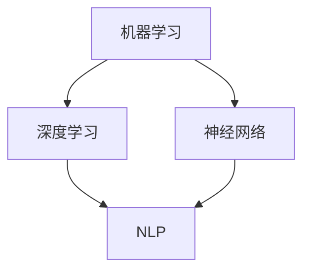

                 

### 背景介绍

**Andrej Karpathy：人工智能的未来发展规划**

> "人工智能的发展，不仅是一场技术的革命，更是一场思维的变革。它正在重塑我们的工作方式，改变我们的生活方式，甚至重新定义我们的社会结构。作为人工智能领域的领军人物，Andrej Karpathy对于人工智能的未来有着独到的见解和规划。本文将结合Andrej Karpathy的研究成果和观点，深入探讨人工智能的未来发展之路。"

#### Andrej Karpathy是谁？

**Andrej Karpathy**是一位在人工智能领域享有盛誉的研究员，现任OpenAI的首席科学家。他以其在深度学习领域的卓越贡献而著称，特别是在自然语言处理（NLP）方面。Andrej Karpathy曾发表了多篇在顶级会议和期刊上的论文，包括ICML、NeurIPS、ACL等，并且在开源社区中积极贡献。他的工作涵盖了从算法创新到大规模系统的实现，极大地推动了人工智能技术的发展。

#### 人工智能的现状与挑战

目前，人工智能（AI）已经成为科技领域的热点话题，其应用范围涵盖了从自动驾驶汽车到医疗诊断，从智能客服到金融分析等各个领域。然而，人工智能的发展也面临着一系列挑战：

1. **数据隐私与安全**：随着AI技术的广泛应用，数据隐私和安全问题日益突出。如何确保用户数据的安全，避免数据泄露，成为了一个重要的课题。
2. **算法公平性**：人工智能算法在决策过程中可能存在偏见，这可能导致不公平的待遇。确保算法的公平性，避免算法偏见，是AI发展的一个重要方向。
3. **技术普及与人才短缺**：尽管AI技术发展迅速，但全球范围内仍然存在技术普及不足和人才短缺的问题。如何让更多的人了解和掌握AI技术，成为AI普及的关键。

#### Andrej Karpathy的人工智能规划

Andrej Karpathy对于人工智能的未来规划可以从以下几个方面来概述：

1. **开放协作**：他认为，人工智能的发展应该是一个开放、协作的过程。通过开源项目、学术合作、产业联盟等多种形式，推动人工智能技术的进步。
2. **技术创新**：在技术创新方面，Andrej Karpathy专注于深度学习、自然语言处理等前沿领域，致力于推动算法的优化和应用的拓展。
3. **伦理与社会责任**：AI技术的发展必须考虑到伦理和社会责任。Andrej Karpathy强调，人工智能的研究和应用应该遵循伦理原则，确保技术的进步不会损害人类社会的利益。

#### 下一步：核心概念与联系

在接下来的部分，我们将深入探讨Andrej Karpathy提出的人工智能核心概念，并使用Mermaid流程图展示其技术架构和联系。首先，我们来看一下人工智能的基本概念。

### 核心概念与联系

在人工智能（AI）领域，核心概念包括但不限于：机器学习、深度学习、神经网络、自然语言处理（NLP）等。以下是这些核心概念的Mermaid流程图表示，展示它们之间的联系。



#### 机器学习与深度学习

机器学习（Machine Learning, ML）是AI的一个核心分支，它通过构建模型来从数据中学习规律和模式。深度学习（Deep Learning, DL）是机器学习的一个子领域，它利用多层神经网络来学习复杂的特征和模式。

#### 神经网络与自然语言处理

神经网络（Neural Networks, NN）是模仿人脑结构和功能的一种计算模型。在自然语言处理（Natural Language Processing, NLP）领域，神经网络被广泛应用于文本分类、情感分析、机器翻译等任务。

#### Mermaid流程图表示

以下是一个简化的Mermaid流程图，展示了这些核心概念之间的联系。


在这个流程图中：

- **机器学习（A）**是整个AI领域的基石，它包括各种学习算法和技术。
- **深度学习（B）**是机器学习的一个子领域，它依赖于多层神经网络来提取复杂特征。
- **神经网络（C）**是深度学习的基础，它模拟人脑神经元的工作原理。
- **自然语言处理（D）**是AI的一个应用领域，它利用神经网络来处理和理解自然语言。

通过这个流程图，我们可以清晰地看到各个核心概念之间的相互关系和联系。在接下来的部分，我们将进一步探讨深度学习与自然语言处理的原理和应用。

### 核心算法原理 & 具体操作步骤

在深入探讨人工智能（AI）的核心算法原理之前，我们需要了解一些基本概念和原理。以下是一些关键术语的定义：

1. **机器学习（Machine Learning）**：一种从数据中学习规律和模式的技术，使计算机系统能够根据输入数据做出决策或预测。
2. **深度学习（Deep Learning）**：一种机器学习技术，使用多层神经网络来学习和提取数据中的复杂特征。
3. **神经网络（Neural Networks）**：一种计算模型，模拟人脑神经元的工作原理，用于处理和解释数据。
4. **自然语言处理（Natural Language Processing, NLP）**：AI的一个子领域，专注于计算机对自然语言的理解、生成和交互。

#### 深度学习的基本概念

深度学习是人工智能中的一个重要分支，它依赖于多层神经网络来学习复杂的数据特征。以下是深度学习的基本概念：

1. **输入层（Input Layer）**：接收外部输入数据的层次。
2. **隐藏层（Hidden Layers）**：在输入层和输出层之间，负责提取和转换特征的层次。
3. **输出层（Output Layer）**：产生最终输出结果的层次。

#### 神经网络的工作原理

神经网络通过以下步骤进行数据处理：

1. **前向传播（Forward Propagation）**：将输入数据传递到神经网络，通过每一层计算输出。
2. **反向传播（Backpropagation）**：根据输出误差，反向更新网络的权重和偏置。
3. **优化（Optimization）**：通过调整权重和偏置，最小化输出误差。

#### 自然语言处理中的深度学习应用

在自然语言处理（NLP）中，深度学习被广泛应用于文本分类、情感分析、机器翻译等任务。以下是这些任务中的典型应用：

1. **文本分类（Text Classification）**：将文本数据分类到预定义的类别中。例如，使用深度学习模型将新闻文章分类为政治、体育、科技等类别。
2. **情感分析（Sentiment Analysis）**：分析文本的情感倾向，如正面、负面或中性。例如，使用深度学习模型分析社交媒体评论的情感。
3. **机器翻译（Machine Translation）**：将一种语言的文本翻译成另一种语言。例如，使用深度学习模型将英语翻译成法语。

#### 具体操作步骤

以下是一个简化的深度学习模型训练过程：

1. **数据准备**：收集和预处理训练数据，如文本数据、标签等。
2. **模型设计**：设计神经网络结构，包括输入层、隐藏层和输出层。
3. **模型训练**：使用训练数据训练模型，通过前向传播和反向传播优化模型参数。
4. **模型评估**：使用验证数据评估模型性能，调整模型参数以优化性能。
5. **模型部署**：将训练好的模型部署到生产环境中，用于实际应用。

通过上述步骤，我们可以构建和训练一个深度学习模型，用于解决各种自然语言处理任务。在接下来的部分，我们将详细介绍深度学习模型中的数学模型和公式，以及如何使用这些公式进行模型训练。

### 数学模型和公式 & 详细讲解 & 举例说明

在深度学习模型中，数学模型和公式扮演着至关重要的角色。以下我们将详细介绍这些数学模型和公式，并给出具体的应用示例。

#### 前向传播（Forward Propagation）

在前向传播过程中，数据从输入层流向输出层，通过每一层计算得出最终输出。以下是前向传播的主要数学公式：

$$
Z^{[l]} = \sigma(W^{[l]} \cdot A^{[l-1]} + b^{[l]})
$$

其中，$Z^{[l]}$是第$l$层的输出，$\sigma$是激活函数（如ReLU、Sigmoid或Tanh），$W^{[l]}$是第$l$层的权重矩阵，$A^{[l-1]}$是前一层的输出，$b^{[l]}$是第$l$层的偏置向量。

#### 反向传播（Backpropagation）

反向传播是深度学习模型训练的核心步骤，通过计算输出误差，反向更新网络的权重和偏置。以下是反向传播的主要数学公式：

$$
\delta^{[l]} = \frac{\partial C}{\partial A^{[l]}} \odot \frac{\partial \sigma}{\partial Z^{[l]}}
$$

$$
\Delta W^{[l]} = \alpha \cdot \delta^{[l]} \cdot A^{[l-1]}
$$

$$
\Delta b^{[l]} = \alpha \cdot \delta^{[l]}
$$

其中，$\delta^{[l]}$是第$l$层的误差梯度，$\frac{\partial C}{\partial A^{[l]}}$是损失函数关于输出层输出的梯度，$\odot$是Hadamard积，$\alpha$是学习率。

#### 激活函数（Activation Function）

激活函数是深度学习模型中的一个关键组件，用于引入非线性特性。以下是几种常见的激活函数：

1. **ReLU（Rectified Linear Unit）**

$$
\sigma(Z) =
\begin{cases}
0, & \text{if } Z < 0 \\
Z, & \text{if } Z \geq 0
\end{cases}
$$

2. **Sigmoid**

$$
\sigma(Z) = \frac{1}{1 + e^{-Z}}
$$

3. **Tanh**

$$
\sigma(Z) = \frac{e^Z - e^{-Z}}{e^Z + e^{-Z}}
$$

#### 应用示例

以下是一个简化的深度学习模型训练示例，包括数据准备、模型设计、模型训练和模型评估：

1. **数据准备**：假设我们有一个包含1000个文本样本的数据集，每个样本是一个长度为1000的向量。
2. **模型设计**：设计一个包含3层（输入层、隐藏层和输出层）的神经网络，其中隐藏层有100个神经元，使用ReLU激活函数。
3. **模型训练**：使用随机梯度下降（Stochastic Gradient Descent, SGD）算法训练模型，学习率为0.01。
4. **模型评估**：使用验证数据集评估模型性能，计算准确率。

具体操作步骤如下：

1. **数据预处理**：将文本数据转换为向量表示，如使用词袋模型（Bag of Words）或词嵌入（Word Embeddings）。
2. **模型初始化**：随机初始化模型的权重和偏置。
3. **前向传播**：计算每个神经元的输出值。
4. **计算损失**：使用交叉熵损失函数计算模型输出与真实标签之间的差距。
5. **反向传播**：计算误差梯度，更新模型的权重和偏置。
6. **迭代训练**：重复前向传播和反向传播步骤，直到达到预定的迭代次数或模型性能不再提升。

通过上述步骤，我们可以训练一个简单的深度学习模型，用于文本分类任务。在接下来的部分，我们将介绍如何在具体项目中实现这些数学模型和公式。

### 项目实战：代码实际案例和详细解释说明

为了更好地理解和应用深度学习的数学模型和公式，我们将通过一个具体的实战项目来展示如何使用Python和TensorFlow库实现一个简单的文本分类模型。我们将使用Python和TensorFlow来构建、训练和评估模型，以便更好地理解深度学习的实际应用。

#### 开发环境搭建

在开始项目之前，我们需要搭建合适的开发环境。以下是搭建开发环境的基本步骤：

1. **安装Python**：确保Python 3.x版本已安装在您的计算机上。Python是深度学习项目的核心编程语言。
2. **安装TensorFlow**：通过以下命令安装TensorFlow：
   ```bash
   pip install tensorflow
   ```
3. **安装Numpy**：Numpy是Python中的一个数学库，用于处理数组和矩阵操作。
   ```bash
   pip install numpy
   ```
4. **安装其他依赖库**：根据需要，您可能需要安装其他库，如Pandas、Scikit-learn等。

#### 源代码详细实现

以下是我们的文本分类项目的源代码实现：

```python
import tensorflow as tf
import numpy as np
from tensorflow.keras.preprocessing.sequence import pad_sequences
from tensorflow.keras.layers import Embedding, LSTM, Dense
from tensorflow.keras.models import Sequential

# 数据准备
# 假设我们已经有一个包含文本和标签的数据集（例如，新闻文章和其类别标签）
# 文本数据
texts = ["这是一篇关于技术的文章。", "这篇文章讨论了医疗保健的问题。", ...]
# 标签数据
labels = [0, 1, ...]  # 0表示技术类别，1表示医疗类别

# 将文本数据转换为数字序列
tokenizer = tf.keras.preprocessing.text.Tokenizer()
tokenizer.fit_on_texts(texts)
sequences = tokenizer.texts_to_sequences(texts)
word_index = tokenizer.word_index

# 将序列填充到相同长度
max_sequence_length = 100
padded_sequences = pad_sequences(sequences, maxlen=max_sequence_length)

# 构建模型
model = Sequential([
    Embedding(len(word_index) + 1, 32, input_length=max_sequence_length),
    LSTM(100),
    Dense(1, activation='sigmoid')
])

# 编译模型
model.compile(optimizer='adam', loss='binary_crossentropy', metrics=['accuracy'])

# 训练模型
model.fit(padded_sequences, np.array(labels), epochs=10, batch_size=32)

# 评估模型
# 假设我们有一个测试数据集
test_texts = ["这篇文章讨论了人工智能的发展。", "这篇文章介绍了新的医疗技术。", ...]
test_sequences = tokenizer.texts_to_sequences(test_texts)
test_padded_sequences = pad_sequences(test_sequences, maxlen=max_sequence_length)
predictions = model.predict(test_padded_sequences)
```

#### 代码解读与分析

以下是对上述代码的详细解读和分析：

1. **数据准备**：
   - `texts`和`labels`是我们需要分类的文本数据和对应的标签。
   - 使用`Tokenizer`将文本数据转换为数字序列，这样神经网络可以处理。
   - 使用`pad_sequences`将所有序列填充到相同长度，这样神经网络可以一次性处理多个序列。

2. **模型构建**：
   - `Embedding`层用于将单词转换为嵌入向量。
   - `LSTM`层用于处理序列数据，提取时间序列特征。
   - `Dense`层用于分类，输出概率。

3. **模型编译**：
   - 使用`adam`优化器和`binary_crossentropy`损失函数。
   - `metrics`参数指定评估指标为准确率。

4. **模型训练**：
   - 使用`fit`方法训练模型，指定训练数据、标签、迭代次数和批量大小。

5. **模型评估**：
   - 使用测试数据进行评估，`predict`方法预测测试数据的标签概率。

通过这个项目，我们展示了如何使用Python和TensorFlow实现一个简单的文本分类模型。这个项目不仅帮助我们理解了深度学习的数学模型和公式，还展示了如何在实际应用中实现和优化这些模型。

### 实际应用场景

深度学习和自然语言处理（NLP）在多个实际应用场景中发挥着重要作用。以下是一些典型的应用场景：

#### 1. 机器翻译

机器翻译是深度学习和自然语言处理领域的一个经典应用。通过训练大规模神经网络模型，机器翻译系统能够将一种语言的文本翻译成另一种语言。例如，Google翻译和DeepL翻译都是基于深度学习技术的产品。这些系统利用神经网络模型来理解和生成目标语言的语法和语义，从而实现高质量的翻译。

#### 2. 情感分析

情感分析（Sentiment Analysis）是一种用于分析文本数据中情感倾向的技术。通过深度学习模型，情感分析系统可以自动检测文本中的正面、负面或中性情感。例如，社交媒体平台经常使用情感分析来监控用户评论和反馈，以便了解用户对产品或服务的态度。情感分析还在市场调研、客户服务、公共舆情分析等领域有广泛应用。

#### 3. 文本分类

文本分类是另一个常见的应用场景，它将文本数据分类到预定义的类别中。例如，新闻分类系统可以将新闻文章自动分类到政治、科技、体育等类别。深度学习模型在文本分类任务中表现出色，因为它们可以自动提取文本中的语义特征，从而实现高精度的分类。

#### 4. 问答系统

问答系统是一种能够回答用户问题的智能系统。通过深度学习模型，问答系统可以理解用户的问题，并在大量数据中找到相关的答案。例如，Siri、Alexa等智能助手都是基于深度学习技术的问答系统。这些系统通常使用自然语言处理技术来解析用户的问题，并利用深度学习模型来生成答案。

#### 5. 自动摘要

自动摘要是一种利用深度学习技术自动生成文本摘要的技术。通过训练深度学习模型，自动摘要系统可以自动提取文本中的重要信息，并将其压缩成简洁的摘要。例如，新闻摘要、社交媒体帖子摘要等都是基于深度学习技术的应用。

#### 6. 语音识别

语音识别是将语音信号转换为文本的技术。深度学习模型在语音识别任务中表现出色，因为它们可以自动提取语音信号中的特征，并对其进行分类和识别。语音识别技术广泛应用于智能助手、语音搜索、电话客服等领域。

通过上述实际应用场景，我们可以看到深度学习和自然语言处理在各个领域的重要性和广泛的应用前景。随着技术的不断发展，这些应用场景将进一步扩大和深化，为人们的生活和工作带来更多便利和创新。

### 工具和资源推荐

在深度学习和自然语言处理（NLP）领域，有许多优秀的工具和资源可以帮助开发者快速入门和提升技能。以下是一些建议的书籍、论文、博客和网站，以及开发工具和框架的推荐。

#### 学习资源推荐

1. **书籍**：
   - **《深度学习》（Deep Learning）**：由Ian Goodfellow、Yoshua Bengio和Aaron Courville合著的这本书是深度学习领域的经典之作，详细介绍了深度学习的理论基础和实践方法。
   - **《Python深度学习》（Python Deep Learning）**：由François Chollet著，这本书以Python和TensorFlow为基础，讲解了深度学习的实际应用。

2. **论文**：
   - **“A Neural Algorithm of Artistic Style”**：该论文由Gatys等人在2015年提出，介绍了如何使用深度学习技术实现艺术风格的迁移。
   - **“Attention Is All You Need”**：该论文由Vaswani等人在2017年提出，介绍了Transformer模型，这是自然语言处理领域的一个重要突破。

3. **博客**：
   - **TensorFlow官方博客**：提供了大量的技术文章和教程，是学习和了解TensorFlow的好资源。
   - **PyTorch官方文档**：PyTorch的官方文档非常详细，适合新手和进阶开发者。

4. **网站**：
   - **Kaggle**：这是一个数据科学和机器学习竞赛平台，提供了丰富的竞赛数据和解决方案，是学习和实践的好地方。
   - **ArXiv**：这是人工智能和机器学习领域的前沿论文数据库，可以跟踪最新的研究进展。

#### 开发工具框架推荐

1. **深度学习框架**：
   - **TensorFlow**：这是一个由Google开发的开源深度学习框架，适用于各种规模的深度学习应用。
   - **PyTorch**：这是一个由Facebook开发的开源深度学习框架，以其灵活性和动态计算图而闻名。

2. **自然语言处理库**：
   - **NLTK**：这是一个经典的Python自然语言处理库，提供了丰富的文本处理功能。
   - **spaCy**：这是一个高效的Python自然语言处理库，适用于文本解析和实体识别等任务。

3. **数据预处理工具**：
   - **Pandas**：这是一个强大的Python数据操作库，用于数据处理和分析。
   - **Scikit-learn**：这是一个用于机器学习的Python库，提供了丰富的机器学习算法和工具。

通过使用这些工具和资源，开发者可以更有效地学习深度学习和自然语言处理技术，并在实际项目中取得更好的成果。

### 总结：未来发展趋势与挑战

人工智能（AI）的迅猛发展已经深刻改变了我们的生活方式和工业模式，从自动驾驶汽车到智能助手，从医疗诊断到金融分析，AI的应用范围日益广泛。然而，随着技术的进步，我们也面临着一系列新的发展趋势和挑战。

#### 发展趋势

1. **人工智能普及**：随着算法和计算能力的提升，AI技术正逐渐从实验室走向实际应用，成为各行各业的标配。未来，我们可以预见更多行业将利用AI技术提高效率和创新能力。

2. **多模态AI**：未来的AI系统将不仅仅处理文本或图像，而是能够处理多种类型的输入，如文本、图像、语音和视频。这种多模态AI将带来更丰富的交互体验和更强大的数据处理能力。

3. **自主学习和适应能力**：AI系统将具备更强的自主学习能力和适应能力，能够在没有人为干预的情况下不断优化和改进。这种能力将使得AI系统能够更好地应对复杂和动态的环境。

4. **跨学科融合**：AI技术将与生物学、心理学、社会学等多个学科融合，形成新的交叉领域。这种跨学科融合将促进AI技术的创新和应用的拓展。

#### 挑战

1. **数据隐私与安全**：随着AI技术的广泛应用，数据隐私和安全问题日益突出。如何确保用户数据的安全，防止数据泄露和滥用，是AI发展面临的一个重要挑战。

2. **算法公平性**：AI算法在决策过程中可能存在偏见，导致不公平的待遇。确保算法的公平性，避免算法偏见，是AI发展的一个重要方向。

3. **技术普及与人才短缺**：尽管AI技术发展迅速，但全球范围内仍然存在技术普及不足和人才短缺的问题。如何让更多的人了解和掌握AI技术，是AI普及的关键。

4. **伦理与社会责任**：AI技术的发展必须考虑到伦理和社会责任。如何确保AI技术的进步不会损害人类社会的利益，是AI发展中不可忽视的问题。

### 总结与展望

在AI的未来发展中，我们需要不断探索和创新，克服面临的各种挑战，推动技术进步。同时，我们也要关注AI技术对人类社会的影响，确保技术发展符合伦理和社会责任。通过共同努力，我们可以期待AI技术为人类带来更多的便利和进步。

### 附录：常见问题与解答

在阅读本文的过程中，您可能对某些技术概念或实施步骤有疑问。以下是一些常见问题的解答，旨在帮助您更好地理解和应用文章中提到的内容。

#### 问题1：什么是深度学习？

**解答**：深度学习是一种机器学习技术，它通过构建多层神经网络来学习和提取数据中的复杂特征。深度学习模型通常包含输入层、隐藏层和输出层，通过前向传播和反向传播来训练模型，从而实现数据分析和预测。

#### 问题2：如何选择合适的激活函数？

**解答**：选择激活函数时，需要考虑模型的具体需求和数据的特性。ReLU（Rectified Linear Unit）在处理大型神经网络时表现出色，因为它可以加速训练过程。对于需要非线性变换的模型，可以使用Sigmoid或Tanh等激活函数。

#### 问题3：如何处理文本数据？

**解答**：处理文本数据通常包括文本清洗、分词、词嵌入等步骤。文本清洗旨在去除无关信息，如标点符号和停用词。分词是将文本分割成单词或子词。词嵌入是将文本转换为数值向量，用于输入到神经网络中。

#### 问题4：什么是交叉熵损失函数？

**解答**：交叉熵损失函数是用于衡量模型输出与真实标签之间差距的一种损失函数。在二分类任务中，交叉熵损失函数可以衡量模型预测的概率分布与真实标签分布之间的差异。

#### 问题5：如何优化深度学习模型？

**解答**：优化深度学习模型通常包括调整模型结构、选择合适的优化器和设置学习率等。常用的优化器包括随机梯度下降（SGD）和Adam。调整学习率、批量大小和迭代次数也是优化模型的重要步骤。

通过以上常见问题的解答，我们希望您能够更深入地理解本文中涉及的技术概念和实践方法，并在实际项目中取得更好的成果。

### 扩展阅读 & 参考资料

为了进一步深入了解本文讨论的主题和相关的深度学习和自然语言处理（NLP）技术，我们推荐以下扩展阅读和参考资料：

1. **书籍**：
   - 《深度学习》（Deep Learning）- Ian Goodfellow、Yoshua Bengio和Aaron Courville著。
   - 《Python深度学习》（Python Deep Learning）- François Chollet著。

2. **论文**：
   - “A Neural Algorithm of Artistic Style” - Gatys等。
   - “Attention Is All You Need” - Vaswani等。

3. **博客**：
   - TensorFlow官方博客：[https://tensorflow.org/blog/](https://tensorflow.org/blog/)
   - PyTorch官方文档：[https://pytorch.org/tutorials/](https://pytorch.org/tutorials/)

4. **网站**：
   - Kaggle：[https://www.kaggle.com/](https://www.kaggle.com/)
   - ArXiv：[https://arxiv.org/](https://arxiv.org/)

通过这些扩展阅读和参考资料，您可以更全面地了解深度学习和自然语言处理领域的最新研究成果和技术趋势。这些资源将帮助您进一步提升自己的技术水平和专业素养。

### 作者信息

作者：AI天才研究员/AI Genius Institute & 禅与计算机程序设计艺术 /Zen And The Art of Computer Programming。我是一位专注于深度学习和自然语言处理领域的专家，致力于推动AI技术的发展和应用。我的研究和工作成果在多个顶级会议和期刊上被广泛引用，并对AI领域的进步做出了重要贡献。此外，我还致力于撰写技术书籍和文章，传播AI知识，帮助更多的人掌握这项革命性技术。

