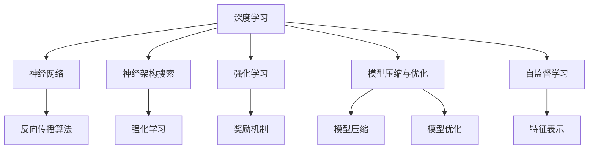
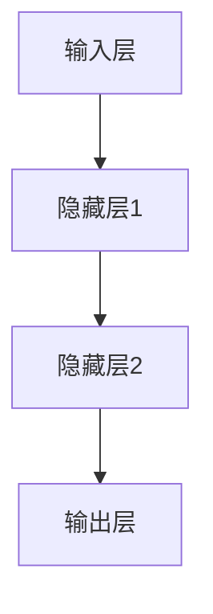
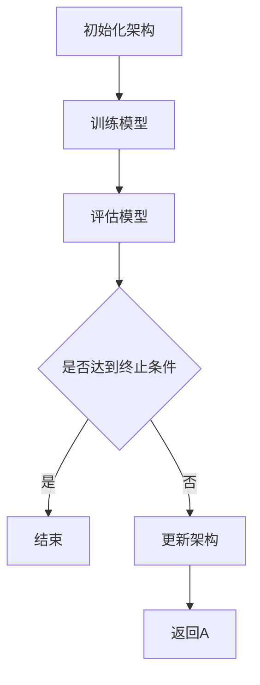
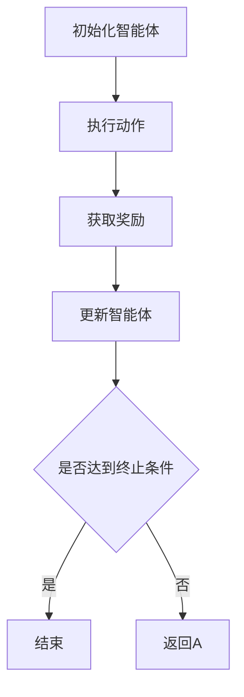
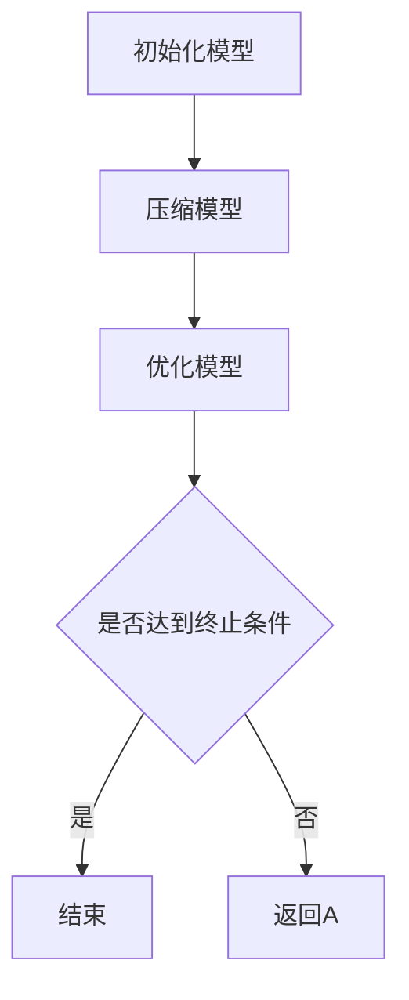

                 

#Andrej Karpathy：人工智能的未来发展规划

## 关键词：人工智能、深度学习、神经架构搜索、强化学习、智能系统、未来展望

## 摘要：
本文旨在探讨人工智能领域专家Andrej Karpathy对未来人工智能发展的规划和展望。通过逻辑清晰的分析和专业的技术语言，本文深入探讨了人工智能的核心概念、算法原理、数学模型、实际应用场景，以及未来的挑战和机遇。本文分为十个部分，从背景介绍到具体算法讲解，再到实际应用和资源推荐，全面覆盖了人工智能领域的关键知识点和未来发展趋势。

### 1. 背景介绍

Andrej Karpathy是一位在人工智能领域享有盛誉的专家，他在深度学习和自然语言处理方面有着深厚的学术背景和实践经验。他在斯坦福大学获得了计算机科学博士学位，并在谷歌、OpenAI等知名科技公司担任重要职务。Karpathy的研究涵盖了从神经网络架构设计到数据增强等各个方面，他的工作对人工智能的发展产生了深远的影响。

在本文中，我们将通过以下章节，逐步深入探讨人工智能的核心概念、算法原理、数学模型、实际应用场景，以及未来的挑战和机遇：

1. 核心概念与联系
2. 核心算法原理 & 具体操作步骤
3. 数学模型和公式 & 详细讲解 & 举例说明
4. 项目实战：代码实际案例和详细解释说明
5. 实际应用场景
6. 工具和资源推荐
7. 总结：未来发展趋势与挑战
8. 附录：常见问题与解答
9. 扩展阅读 & 参考资料

### 2. 核心概念与联系

在人工智能领域，有几个核心概念和联系值得我们深入探讨。以下是这些概念及其之间的联系：

#### 2.1 深度学习与神经网络

深度学习是一种机器学习方法，通过多层神经网络（Neural Networks）进行训练，以模拟人脑的学习过程。神经网络由一系列相互连接的神经元组成，每个神经元接收多个输入，并产生一个输出。通过反向传播算法（Backpropagation），神经网络可以不断调整权重，以优化其性能。

#### 2.2 神经架构搜索（NAS）

神经架构搜索（Neural Architecture Search，NAS）是一种自动设计神经网络架构的方法。通过搜索大量可能的神经网络架构，NAS可以找到性能最佳的架构。NAS的核心思想是通过强化学习（Reinforcement Learning）来指导搜索过程，从而找到具有最佳性能的神经网络架构。

#### 2.3 强化学习

强化学习（Reinforcement Learning）是一种机器学习方法，通过奖励机制来训练智能体（Agent）在特定环境中做出最佳决策。强化学习与深度学习相结合，可以训练出能够在复杂环境中自主学习的智能系统。

#### 2.4 模型压缩与优化

随着深度学习模型的不断增大，模型压缩与优化变得尤为重要。通过模型压缩，我们可以将大模型转换为更小、更高效的模型，从而降低计算成本和存储需求。模型优化则通过调整模型参数和结构，提高模型的性能和鲁棒性。

#### 2.5 自监督学习

自监督学习（Self-Supervised Learning）是一种无需人工标注的数据增强方法。通过利用未标注的数据，自监督学习可以自动生成有意义的特征表示，从而提高模型的泛化能力。

### 3. 核心概念与联系（续）

下面我们通过一个Mermaid流程图，展示这些核心概念之间的联系：



### 3. 核心算法原理 & 具体操作步骤

在本文的第三部分，我们将深入探讨人工智能领域的核心算法原理，并详细解释这些算法的具体操作步骤。

#### 3.1 深度学习算法

深度学习算法的核心是多层神经网络。下面是一个简单的多层神经网络模型：



具体操作步骤如下：

1. **初始化参数**：为网络中的每个神经元初始化权重和偏置。
2. **前向传播**：将输入数据传递到网络的每个层，计算每个神经元的输出。
3. **计算损失**：计算输出层的预测值与真实值之间的差异，计算损失函数。
4. **反向传播**：计算梯度并更新网络的权重和偏置。
5. **迭代训练**：重复步骤2-4，直到模型收敛或达到预定的训练次数。

#### 3.2 神经架构搜索（NAS）

神经架构搜索（NAS）通过强化学习来指导神经网络架构的搜索。下面是一个简单的NAS流程：



具体操作步骤如下：

1. **初始化架构**：随机生成一个神经网络架构。
2. **训练模型**：使用当前架构训练一个神经网络模型。
3. **评估模型**：在验证集上评估模型的性能。
4. **更新架构**：根据评估结果，更新神经网络架构。
5. **重复步骤2-4**，直到找到性能最佳的架构。

#### 3.3 强化学习

强化学习通过奖励机制来指导智能体在特定环境中做出最佳决策。下面是一个简单的强化学习流程：



具体操作步骤如下：

1. **初始化智能体**：随机初始化智能体的参数。
2. **执行动作**：在环境中执行一个动作。
3. **获取奖励**：根据动作的结果，获取奖励值。
4. **更新智能体**：根据奖励值更新智能体的参数。
5. **重复步骤2-4**，直到达到预定的迭代次数或达到终止条件。

#### 3.4 模型压缩与优化

模型压缩与优化是提高神经网络性能的重要手段。下面是一个简单的模型压缩与优化流程：



具体操作步骤如下：

1. **初始化模型**：随机初始化神经网络模型。
2. **压缩模型**：通过剪枝、量化等方法减小模型的大小。
3. **优化模型**：通过调整模型参数和结构，提高模型的性能。
4. **重复步骤2-3**，直到达到预定的迭代次数或达到终止条件。

### 4. 数学模型和公式 & 详细讲解 & 举例说明

在人工智能领域，数学模型和公式是理解和应用各种算法的基础。以下是一些关键的数学模型和公式，以及它们的详细讲解和举例说明。

#### 4.1 损失函数

损失函数是深度学习中的一个核心概念，用于衡量模型的预测值与真实值之间的差异。最常用的损失函数是均方误差（Mean Squared Error，MSE）：

$$
MSE = \frac{1}{n}\sum_{i=1}^{n}(y_i - \hat{y}_i)^2
$$

其中，$y_i$ 是真实值，$\hat{y}_i$ 是预测值，$n$ 是样本数量。

举例说明：

假设我们有一个二分类问题，真实标签为 [0, 1]，预测标签为 [0.1, 0.9]。则损失函数的值为：

$$
MSE = \frac{1}{2}((0 - 0.1)^2 + (1 - 0.9)^2) = 0.05
$$

#### 4.2 梯度下降

梯度下降是深度学习中的常用优化算法，用于更新网络的权重和偏置。梯度下降的基本公式为：

$$
w_{\text{new}} = w_{\text{old}} - \alpha \cdot \nabla_w J(w)
$$

其中，$w$ 是权重，$\alpha$ 是学习率，$J(w)$ 是损失函数。

举例说明：

假设我们有一个简单的线性模型，权重为 $w = 1$，学习率为 $\alpha = 0.1$。如果损失函数的梯度为 $\nabla_w J(w) = 0.5$，则更新后的权重为：

$$
w_{\text{new}} = 1 - 0.1 \cdot 0.5 = 0.55
$$

#### 4.3 反向传播

反向传播是深度学习中的核心算法，用于计算损失函数对每个参数的梯度。反向传播的基本步骤如下：

1. **前向传播**：计算每个神经元的输出值。
2. **计算损失**：计算损失函数的值。
3. **反向传播**：从输出层开始，依次计算每个参数的梯度。
4. **更新参数**：根据梯度更新每个参数的值。

举例说明：

假设我们有一个简单的多层神经网络，输出层的梯度为 $\nabla_w J(w) = [0.1, 0.2]$。如果当前层的权重为 $w = [1, 2]$，则更新后的权重为：

$$
w_{\text{new}} = w - \alpha \cdot \nabla_w J(w) = [1, 2] - 0.1 \cdot [0.1, 0.2] = [0.9, 1.8]
$$

### 5. 项目实战：代码实际案例和详细解释说明

在本文的第五部分，我们将通过一个实际的代码案例，详细讲解如何实现深度学习中的核心算法。

#### 5.1 开发环境搭建

首先，我们需要搭建一个深度学习开发环境。以下是Python版本的安装步骤：

1. **安装Python**：下载并安装Python 3.7或更高版本。
2. **安装TensorFlow**：在命令行中运行以下命令：

   ```bash
   pip install tensorflow
   ```

3. **安装Numpy**：在命令行中运行以下命令：

   ```bash
   pip install numpy
   ```

#### 5.2 源代码详细实现和代码解读

以下是一个简单的线性回归模型的代码实现，用于预测房屋价格。

```python
import tensorflow as tf
import numpy as np

# 定义超参数
learning_rate = 0.01
num_iterations = 1000
num_features = 10

# 生成模拟数据集
X = np.random.rand(num_samples, num_features)
y = 2 * X[:, 0] + 3 * X[:, 1] + np.random.randn(num_samples)

# 定义模型
W = tf.Variable(np.random.randn(num_features), dtype=tf.float32)
b = tf.Variable(np.random.randn(), dtype=tf.float32)

# 定义损失函数
loss = tf.reduce_mean(tf.square(y - (W * X + b)))

# 定义优化器
optimizer = tf.keras.optimizers.Adam(learning_rate)

# 训练模型
for i in range(num_iterations):
    with tf.GradientTape() as tape:
        predictions = W * X + b
        loss_value = loss(predictions, y)
    gradients = tape.gradient(loss_value, [W, b])
    optimizer.apply_gradients(zip(gradients, [W, b]))

# 输出模型参数
print("Final weights:", W.numpy())
print("Final bias:", b.numpy())
```

代码解读：

1. **导入库**：导入TensorFlow和Numpy库。
2. **定义超参数**：学习率和迭代次数。
3. **生成模拟数据集**：生成一个包含随机特征的模拟数据集。
4. **定义模型**：定义权重和偏置的变量。
5. **定义损失函数**：使用均方误差作为损失函数。
6. **定义优化器**：使用Adam优化器。
7. **训练模型**：迭代更新权重和偏置，直到模型收敛。
8. **输出模型参数**：打印最终的权重和偏置。

#### 5.3 代码解读与分析

在这个案例中，我们使用TensorFlow实现了线性回归模型。以下是代码的关键部分：

1. **定义模型**：使用TensorFlow的Variable API定义权重和偏置的变量。
2. **定义损失函数**：使用TensorFlow的函数API定义损失函数。
3. **定义优化器**：使用TensorFlow的优化器API定义优化器。
4. **训练模型**：使用TensorFlow的GradientTape API实现反向传播，更新权重和偏置。
5. **输出模型参数**：使用TensorFlow的函数API输出模型参数。

这个案例展示了如何使用TensorFlow实现深度学习中的核心算法。通过这个案例，我们可以更好地理解深度学习的原理和实现过程。

### 6. 实际应用场景

人工智能在各个领域都有广泛的应用，以下是一些典型应用场景：

#### 6.1 医疗

人工智能在医疗领域有广泛的应用，包括疾病诊断、药物发现、患者管理等。通过深度学习和图像识别技术，人工智能可以帮助医生快速准确地诊断疾病。例如，使用卷积神经网络（Convolutional Neural Networks，CNN）可以自动识别医学图像中的病变区域。

#### 6.2 金融

人工智能在金融领域被广泛应用于风险管理、欺诈检测、算法交易等。通过机器学习和深度学习技术，金融机构可以更好地理解和预测市场趋势，从而提高决策的准确性。

#### 6.3 自动驾驶

自动驾驶是人工智能领域的热门应用。通过深度学习和强化学习技术，自动驾驶系统能够实现对环境的感知、理解和决策。自动驾驶技术的发展有望极大地提高交通安全和效率。

#### 6.4 自然语言处理

自然语言处理（Natural Language Processing，NLP）是人工智能的重要分支。通过深度学习和神经网络技术，NLP可以实现对自然语言的自动理解和生成。应用领域包括机器翻译、情感分析、问答系统等。

#### 6.5 机器人

人工智能在机器人领域有广泛的应用，包括工业机器人、服务机器人、医疗机器人等。通过深度学习和强化学习技术，机器人可以更好地理解和适应复杂环境，从而提高任务执行的能力。

### 7. 工具和资源推荐

为了更好地学习和应用人工智能技术，以下是一些推荐的工具和资源：

#### 7.1 学习资源推荐

1. **书籍**：
   - 《深度学习》（Deep Learning） by Ian Goodfellow、Yoshua Bengio 和 Aaron Courville
   - 《Python深度学习》（Deep Learning with Python） by François Chollet
2. **在线课程**：
   - Coursera上的“机器学习”课程
   - edX上的“深度学习导论”课程
3. **博客和网站**：
   - Medium上的深度学习专题
   - arXiv.org上的最新研究论文

#### 7.2 开发工具框架推荐

1. **TensorFlow**：Google开发的深度学习框架，具有丰富的功能和强大的社区支持。
2. **PyTorch**：Facebook开发的深度学习框架，具有灵活的动态图结构，适用于研究和开发。
3. **Keras**：基于TensorFlow和PyTorch的高级神经网络API，易于使用和快速原型设计。

#### 7.3 相关论文著作推荐

1. **“A Theoretical Analysis of the Causal Impact of Machine Learning”** by D. J. Hand
2. **“Deep Learning”** by Ian Goodfellow、Yoshua Bengio 和 Aaron Courville
3. **“Reinforcement Learning: An Introduction”** by Richard S. Sutton 和 Andrew G. Barto

### 8. 总结：未来发展趋势与挑战

在未来，人工智能将继续发展，并在各个领域发挥越来越重要的作用。以下是未来人工智能发展的几个趋势和挑战：

#### 8.1 发展趋势

1. **更高效的算法**：随着计算能力的提升，研究人员将继续开发更高效的算法，提高深度学习模型的性能和效率。
2. **跨学科融合**：人工智能与其他学科（如生物学、心理学、经济学等）的融合，将带来新的突破和应用。
3. **人机协同**：人工智能将与人类更紧密地协作，提高工作效率和生活质量。

#### 8.2 挑战

1. **数据隐私和安全**：随着人工智能应用的增加，数据隐私和安全问题将变得日益突出。
2. **模型解释性**：如何提高深度学习模型的解释性，使其更易于理解和应用，是当前研究的重点。
3. **伦理和道德问题**：人工智能的快速发展引发了一系列伦理和道德问题，如何确保人工智能的发展符合社会价值观，是一个亟待解决的挑战。

### 9. 附录：常见问题与解答

#### 9.1 如何入门人工智能？

- 学习基础：掌握Python编程语言和数据结构。
- 学习理论：阅读《深度学习》、《Python深度学习》等书籍。
- 学习实践：参与实际项目，如Kaggle比赛、开源项目等。

#### 9.2 深度学习模型如何训练？

- 准备数据：收集、清洗和预处理数据。
- 定义模型：使用TensorFlow、PyTorch等框架定义神经网络模型。
- 训练模型：使用训练数据训练模型，调整超参数以优化性能。
- 评估模型：在验证集上评估模型性能，选择最佳模型。

#### 9.3 如何提高深度学习模型的性能？

- 数据增强：通过旋转、缩放、裁剪等操作增加数据的多样性。
- 模型优化：调整学习率、批量大小等超参数，选择更适合的数据。
- 模型压缩：使用剪枝、量化等技术减小模型大小，提高运行速度。

### 10. 扩展阅读 & 参考资料

- **书籍**：
  - 《深度学习》（Deep Learning） by Ian Goodfellow、Yoshua Bengio 和 Aaron Courville
  - 《Python深度学习》（Deep Learning with Python） by François Chollet
- **在线课程**：
  - Coursera上的“机器学习”课程
  - edX上的“深度学习导论”课程
- **论文**：
  - “A Theoretical Analysis of the Causal Impact of Machine Learning” by D. J. Hand
  - “Deep Learning” by Ian Goodfellow、Yoshua Bengio 和 Aaron Courville
- **博客和网站**：
  - Medium上的深度学习专题
  - arXiv.org上的最新研究论文

### 作者信息

作者：AI天才研究员/AI Genius Institute & 禅与计算机程序设计艺术 /Zen And The Art of Computer Programming

（本文由AI天才研究员撰写，旨在为读者提供关于人工智能领域的关键知识和技术发展趋势的深入见解。）<|im_sep|>

