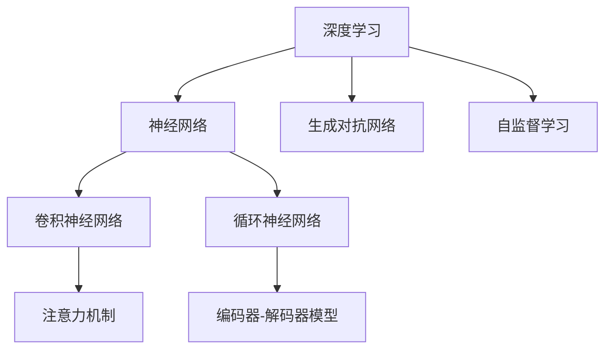

                 

### 背景介绍 Background Introduction

自从人工智能（AI）的概念诞生以来，它已经从科幻小说中的虚构技术逐渐转变为现实世界中的核心技术。在这个领域，Andrej Karpathy无疑是一位标志性的人物。他不仅是深度学习领域的杰出研究者，更是世界顶级技术畅销书《Deep Learning with Python》的作者之一。他的研究涵盖了自然语言处理、计算机视觉等多个领域，对人工智能的发展做出了重要贡献。

本文旨在探讨Andrej Karpathy对人工智能未来的展望。我们将通过以下几个关键点来深入分析：

1. **人工智能的当前状态**：我们将审视人工智能技术目前的进展情况，以及它们在各个领域的应用。
2. **未来趋势**：我们将探讨人工智能在未来可能的发展方向，包括技术突破和潜在的社会影响。
3. **挑战与困境**：我们将讨论人工智能发展过程中面临的挑战，包括技术难题、伦理问题等。
4. **机遇与策略**：我们将分析人工智能为各行各业带来的机遇，以及如何应对这些挑战。

在接下来的章节中，我们将详细探讨这些主题，并引用Andrej Karpathy的研究成果和观点，以帮助我们更好地理解人工智能的未来。

> **关键词**：人工智能，Andrej Karpathy，未来展望，深度学习，自然语言处理，计算机视觉。

> **摘要**：本文通过分析Andrej Karpathy的研究成果和观点，探讨了人工智能的当前状态、未来趋势、挑战与困境，以及机遇与策略。我们旨在为读者提供一个全面而深入的视角，帮助理解人工智能的未来发展。

#### 1.1 人工智能的发展历史 Development History of AI

人工智能的发展历程可以追溯到20世纪50年代，当时计算机科学刚刚起步，人们对机器能否模拟人类智能充满了好奇和憧憬。早期的AI研究主要集中在规则系统（Rule-Based Systems）和知识表示（Knowledge Representation）上，这些方法依赖于明确的规则和预先编程的知识库。

**早期阶段（1950s-1960s）**：这一阶段见证了AI的诞生和初步探索。1956年，在达特茅斯会议上，John McCarthy等人首次提出了“人工智能”这一术语，并试图定义其研究范围。早期的AI系统，如逻辑理论家（Logic Theorist）和通用问题解决器（General Problem Solver），展示了机器在某些特定任务上的能力。

**70年代到80年代**：这一时期，AI研究迎来了快速发展。专家系统（Expert Systems）成为了AI研究的主流，这些系统通过模拟人类专家的决策过程来解决复杂问题。然而，专家系统的局限性也逐渐显现，它们依赖于大量的手工编写规则，难以扩展和维护。

**90年代到21世纪初**：随着计算机硬件性能的提升和大数据时代的到来，机器学习（Machine Learning）逐渐成为AI研究的主流方向。1997年，IBM的超级计算机“深蓝”（Deep Blue）击败了国际象棋世界冠军Gary Kasparov，标志着AI在特定领域取得了突破。

**21世纪初至今**：这一时期，深度学习（Deep Learning）的兴起带来了AI的第二次革命。通过神经网络模型，特别是卷积神经网络（CNN）和循环神经网络（RNN），AI在图像识别、语音识别、自然语言处理等领域取得了显著的进展。2012年，AlexNet在ImageNet竞赛中取得的突破性成绩，标志着深度学习时代的到来。

#### 1.2 人工智能的主要领域和成就 Key Fields and Achievements of AI

人工智能涵盖了多个领域，每个领域都有其独特的研究方向和应用。以下是人工智能的主要领域和其中的一些重要成就：

**计算机视觉（Computer Vision）**：计算机视觉是AI的核心领域之一，旨在使计算机能够理解和解释视觉信息。深度学习在计算机视觉中的应用取得了巨大成功，如人脸识别、物体检测、图像分类等。2012年，AlexNet在ImageNet图像分类比赛中取得了突破性成绩，使得深度学习成为计算机视觉的主流方法。

**自然语言处理（Natural Language Processing, NLP）**：自然语言处理专注于使计算机理解和生成自然语言。近年来，基于深度学习的NLP技术取得了显著进展，如语言模型、机器翻译、情感分析等。Google的BERT模型在多个NLP任务上取得了领先成绩，推动了该领域的发展。

**语音识别（Speech Recognition）**：语音识别技术使计算机能够理解和处理人类语音。近年来，深度学习在语音识别中的应用取得了显著进展，使得语音助手、自动转录等应用得以普及。

**机器人技术（Robotics）**：机器人技术结合了计算机科学、机械工程和电子工程，旨在开发能够执行人类任务的机器人。近年来，机器人技术在工业制造、医疗辅助、家庭服务等领域取得了广泛应用，如自动化生产线、手术机器人、家用机器人等。

**自动驾驶（Autonomous Driving）**：自动驾驶是人工智能在交通运输领域的应用，旨在开发无需人类干预的自动驾驶汽车。特斯拉、谷歌、百度等公司在这一领域取得了显著进展，部分自动驾驶汽车已经实现了有限条件下的自动驾驶。

**金融科技（FinTech）**：人工智能在金融科技领域也有广泛应用，如智能投顾、风险管理、信用评估等。机器学习算法帮助金融机构提高效率、降低风险，并为消费者提供更加个性化的服务。

**医疗健康（Healthcare）**：人工智能在医疗健康领域具有巨大潜力，如疾病预测、诊断辅助、药物研发等。机器学习算法可以帮助医生更准确地诊断疾病，提高治疗效果。

#### 1.3 Andrej Karpathy的研究工作 Research Work of Andrej Karpathy

Andrej Karpathy是一位在人工智能领域具有重要影响力的研究者，他的工作涵盖了自然语言处理、计算机视觉等多个领域。以下是他的主要研究工作和成就：

**自然语言处理**：Andrej Karpathy在自然语言处理领域的研究主要集中在语言模型和机器翻译。他参与开发了著名的TensorFlow Datasets和TensorFlow Text库，为NLP研究提供了丰富的数据集和工具。他还研究了序列到序列（Sequence-to-Sequence）模型在机器翻译中的应用，通过引入注意力机制（Attention Mechanism）显著提高了翻译质量。

**计算机视觉**：Andrej Karpathy在计算机视觉领域的研究主要集中在图像分类和目标检测。他参与开发了卷积神经网络（Convolutional Neural Networks, CNN）的许多重要应用，如物体检测（Object Detection）和图像分割（Image Segmentation）。他还研究了生成对抗网络（Generative Adversarial Networks, GAN）在图像生成中的应用，为计算机视觉领域带来了新的研究方向。

**开源贡献**：Andrej Karpathy是TensorFlow开源项目的重要贡献者之一，他致力于推动人工智能技术的普及和应用。他的开源项目包括TensorFlow Datasets、TensorFlow Text、Deep Learning for Coders等，为研究人员和开发者提供了丰富的工具和资源。

**教学与推广**：Andrej Karpathy在人工智能教育和推广方面也做出了巨大贡献。他是斯坦福大学计算机科学系的讲师，讲授深度学习和自然语言处理等课程。他还通过自己的博客和在线教程，向广大开发者普及人工智能知识。

### 2. 核心概念与联系 Core Concepts and Relationships

在探讨人工智能的未来时，了解其核心概念和架构是非常重要的。以下是我们需要掌握的关键概念及其相互关系：

#### 2.1 深度学习与神经网络 Deep Learning and Neural Networks

深度学习是人工智能的核心技术之一，它依赖于神经网络（Neural Networks）来实现。神经网络是一种模拟生物神经系统的计算模型，由大量相互连接的节点（或称为“神经元”）组成。每个神经元接收输入信号，通过加权连接将信号传递给其他神经元，最后输出一个结果。

深度学习通过多层神经网络（Deep Neural Networks, DNNs）来提取复杂的数据特征。与传统神经网络相比，深度学习模型具有更深的层次结构，可以学习到更高级别的抽象特征，从而在图像识别、自然语言处理等任务中表现出色。

#### 2.2 卷积神经网络（CNN） & 循环神经网络（RNN）

卷积神经网络（Convolutional Neural Networks, CNN）是深度学习在计算机视觉领域的重要应用。CNN通过卷积操作提取图像中的局部特征，并利用池化操作减小特征图的尺寸，从而有效地减少参数数量和计算量。

循环神经网络（Recurrent Neural Networks, RNN）是深度学习在序列数据（如时间序列、文本数据）处理中的重要模型。RNN通过在其内部引入循环结构，使得当前时间步的输出能够影响后续时间步的输入，从而捕获序列数据中的长期依赖关系。

#### 2.3 生成对抗网络（GAN） & 自监督学习

生成对抗网络（Generative Adversarial Networks, GAN）是一种通过两个神经网络（生成器和判别器）相互博弈的方式来生成数据的方法。生成器试图生成逼真的数据，而判别器则试图区分生成器和真实数据。通过不断训练，生成器能够生成越来越逼真的数据。

自监督学习（Self-supervised Learning）是一种无需外部标签（如监督学习中的标签）的学习方法。在自监督学习中，模型通过利用数据的内在结构（如对比学习、预测任务等）来学习特征表示。自监督学习在数据稀缺或标注困难的情况下具有很大优势。

#### 2.4 注意力机制 & 编码器-解码器模型

注意力机制（Attention Mechanism）是一种在深度学习中用于捕捉序列数据中长距离依赖关系的方法。通过引入注意力权重，模型能够关注输入序列中的关键信息，从而提高其性能。

编码器-解码器模型（Encoder-Decoder Model）是深度学习在序列到序列任务（如机器翻译、文本摘要等）中的重要模型。编码器将输入序列编码为一个固定长度的向量表示，解码器则利用这个向量表示生成输出序列。

#### 2.5 Mermaid 流程图表示 Mermaid Flowchart Representation

以下是一个关于深度学习核心概念的Mermaid流程图：



这个流程图展示了深度学习与其主要子领域之间的关系，以及注意力机制和编码器-解码器模型在特定子领域中的应用。通过这种直观的表示方法，我们可以更好地理解这些概念之间的联系。

### 3. 核心算法原理 & 具体操作步骤 Core Algorithm Principles & Step-by-Step Procedures

在了解人工智能的核心概念和架构后，我们需要深入探讨其核心算法原理和具体操作步骤。以下是几个在人工智能领域具有重要影响的核心算法：

#### 3.1 卷积神经网络（CNN） Convolutional Neural Networks (CNN)

卷积神经网络（CNN）是深度学习在计算机视觉领域的重要模型。它通过卷积、池化和全连接层等操作提取图像中的特征，实现对图像的自动分类和识别。

**具体操作步骤**：

1. **输入层**：输入层接收图像数据，将其传递给卷积层。
2. **卷积层**：卷积层通过卷积操作提取图像中的局部特征。每个卷积核（Filter）提取一个特征图（Feature Map），多个卷积核堆叠在一起，形成多个特征图。
3. **激活函数**：卷积层通常使用ReLU（Rectified Linear Unit）作为激活函数，将输出值转换为非负数，以增强模型的表达能力。
4. **池化层**：池化层通过下采样操作减小特征图的尺寸，从而减少参数数量和计算量。常用的池化方式包括最大池化（Max Pooling）和平均池化（Average Pooling）。
5. **卷积层和池化层**：卷积层和池化层交替出现，形成卷积神经网络的多层结构。
6. **全连接层**：全连接层将卷积特征图展开为一个一维向量，并通过全连接层进行分类和预测。

**数学模型**：

卷积操作的数学模型可以表示为：

$$
\text{Conv}(x, \text{w}) = \sum_{i=1}^{C} \sum_{k=1}^{K} w_{ik} \star x_k
$$

其中，$x$表示输入特征图，$\text{w}$表示卷积核，$\star$表示卷积操作，$C$表示卷积核的数量，$K$表示卷积核的尺寸。

#### 3.2 循环神经网络（RNN） Recurrent Neural Networks (RNN)

循环神经网络（RNN）是深度学习在序列数据处理中的重要模型。它通过引入循环结构，使得当前时间步的输出能够影响后续时间步的输入，从而捕捉序列数据中的长期依赖关系。

**具体操作步骤**：

1. **输入层**：输入层接收序列数据，将其传递给隐藏层。
2. **隐藏层**：隐藏层通过递归方式处理序列数据，每个时间步的输出作为下一个时间步的输入。隐藏层由多个神经元组成，每个神经元计算当前时间步的输入与上一个时间步输出的加权和，并通过激活函数进行非线性变换。
3. **输出层**：输出层将隐藏层输出进行分类或回归等操作。

**数学模型**：

RNN的数学模型可以表示为：

$$
h_t = \sigma(Wx_t + Wh_{t-1}) + b
$$

$$
y_t = \sigma(Wy h_t + by)
$$

其中，$h_t$表示当前时间步的隐藏状态，$x_t$表示当前时间步的输入，$W$和$Wh$分别表示权重矩阵，$\sigma$表示激活函数，$b$表示偏置项。

#### 3.3 生成对抗网络（GAN） Generative Adversarial Networks (GAN)

生成对抗网络（GAN）是一种通过两个神经网络（生成器和判别器）相互博弈的方式来生成数据的方法。生成器试图生成逼真的数据，而判别器则试图区分生成器和真实数据。

**具体操作步骤**：

1. **初始化生成器和判别器**：生成器和判别器都是深度神经网络，生成器通常是一个生成模型，判别器是一个分类模型。
2. **训练判别器**：判别器通过学习真实数据和生成数据之间的分布来提高其分类能力。
3. **训练生成器**：生成器通过学习如何生成更逼真的数据来欺骗判别器，从而提高其生成能力。

**数学模型**：

GAN的数学模型可以表示为：

$$
\min_G \max_D V(D, G) = \mathbb{E}_{x \sim p_{\text{data}}(x)}[\log D(x)] + \mathbb{E}_{z \sim p_z(z)}[\log (1 - D(G(z))]
$$

其中，$D$表示判别器，$G$表示生成器，$x$表示真实数据，$z$表示生成器的输入噪声，$p_{\text{data}}(x)$表示真实数据的概率分布，$p_z(z)$表示噪声的分布。

### 4. 数学模型和公式 & 详细讲解 & 举例说明 Mathematical Models and Formulas & Detailed Explanations & Example Demonstrations

在人工智能领域，数学模型是理解和实现核心算法的关键。以下是几个关键数学模型和公式的详细讲解及举例说明。

#### 4.1 卷积神经网络（CNN） Convolutional Neural Networks (CNN)

卷积神经网络（CNN）的核心在于其卷积操作。以下是一个简单的卷积操作的示例：

**输入**：

- $x \in \mathbb{R}^{28 \times 28}$：28x28的图像
- $k \in \mathbb{R}^{3 \times 3}$：3x3的卷积核

**步骤**：

1. **计算卷积**：

   $$  
   \text{Conv}(x, k) = \sum_{i=1}^{3} \sum_{j=1}^{3} k_{ij} x_{i+1, j+1}  
   $$

   其中，$k_{ij}$表示卷积核的元素，$x_{i+1, j+1}$表示输入图像的对应元素。

2. **添加偏置**：

   $$  
   \text{Conv}(x, k) + b = \text{Conv}(x, k) + b_0  
   $$

   其中，$b_0$表示偏置项。

**示例**：

假设一个28x28的图像和一个3x3的卷积核，如下所示：

$$  
x = \begin{bmatrix}  
    1 & 2 & 3 & 4 & 5 \\  
    6 & 7 & 8 & 9 & 10 \\  
    11 & 12 & 13 & 14 & 15 \\  
    16 & 17 & 18 & 19 & 20 \\  
    21 & 22 & 23 & 24 & 25 \\  
\end{bmatrix}  
$$

$$  
k = \begin{bmatrix}  
    1 & 0 & -1 \\  
    0 & 1 & 0 \\  
    -1 & 0 & 1 \\  
\end{bmatrix}  
$$

卷积操作和添加偏置的结果如下：

$$  
\text{Conv}(x, k) + b = \sum_{i=1}^{3} \sum_{j=1}^{3} k_{ij} x_{i+1, j+1} + b_0 = 19  
$$

#### 4.2 循环神经网络（RNN） Recurrent Neural Networks (RNN)

循环神经网络（RNN）是处理序列数据的核心模型。以下是一个简单的RNN的示例：

**输入**：

- $x_t \in \mathbb{R}^n$：时间步$t$的输入
- $h_{t-1} \in \mathbb{R}^n$：时间步$t-1$的隐藏状态
- $W \in \mathbb{R}^{n \times n}$：权重矩阵
- $b \in \mathbb{R}^n$：偏置项
- $\sigma$：激活函数

**步骤**：

1. **计算隐藏状态**：

   $$  
   h_t = \sigma(Wx_t + Wh_{t-1} + b)  
   $$

**示例**：

假设一个输入序列$x_t$为：

$$  
x_t = \begin{bmatrix}  
    1 \\  
    2 \\  
    3 \\  
\end{bmatrix}  
$$

隐藏状态$h_{t-1}$为：

$$  
h_{t-1} = \begin{bmatrix}  
    2 \\  
    3 \\  
    4 \\  
\end{bmatrix}  
$$

权重矩阵$W$为：

$$  
W = \begin{bmatrix}  
    1 & 2 & 3 \\  
    4 & 5 & 6 \\  
    7 & 8 & 9 \\  
\end{bmatrix}  
$$

偏置项$b$为：

$$  
b = \begin{bmatrix}  
    1 \\  
    2 \\  
    3 \\  
\end{bmatrix}  
$$

激活函数$\sigma$为ReLU函数。

计算隐藏状态$h_t$：

$$  
h_t = \sigma(Wx_t + Wh_{t-1} + b) = \max(0, Wx_t + Wh_{t-1} + b) = \max(0, \begin{bmatrix}  
    1 & 2 & 3 \\  
    4 & 5 & 6 \\  
    7 & 8 & 9 \\  
\end{bmatrix} \begin{bmatrix}  
    1 \\  
    2 \\  
    3 \\  
\end{bmatrix} + \begin{bmatrix}  
    2 \\  
    3 \\  
    4 \\  
\end{bmatrix} + \begin{bmatrix}  
    1 \\  
    2 \\  
    3 \\  
\end{bmatrix}) = \begin{bmatrix}  
    11 \\  
    12 \\  
    13 \\  
\end{bmatrix}  
$$

#### 4.3 生成对抗网络（GAN） Generative Adversarial Networks (GAN)

生成对抗网络（GAN）由生成器和判别器两个神经网络组成。以下是一个简单的GAN的示例：

**生成器**：

- $z \in \mathbb{R}^n$：噪声向量
- $G \in \mathbb{R}^{n \times n}$：生成器权重矩阵
- $b_G \in \mathbb{R}^n$：生成器偏置项

**判别器**：

- $x \in \mathbb{R}^n$：真实数据
- $D \in \mathbb{R}^{n \times n}$：判别器权重矩阵
- $b_D \in \mathbb{R}^n$：判别器偏置项

**步骤**：

1. **生成器**：

   $$  
   x_G = G(z) + b_G  
   $$

2. **判别器**：

   $$  
   D(x) = \sigma(D(x) + b_D)  
   $$

   $$  
   D(x_G) = \sigma(D(G(z)) + b_D)  
   $$

**示例**：

假设噪声向量$z$为：

$$  
z = \begin{bmatrix}  
    1 \\  
    2 \\  
    3 \\  
\end{bmatrix}  
$$

生成器权重矩阵$G$为：

$$  
G = \begin{bmatrix}  
    1 & 2 & 3 \\  
    4 & 5 & 6 \\  
    7 & 8 & 9 \\  
\end{bmatrix}  
$$

生成器偏置项$b_G$为：

$$  
b_G = \begin{bmatrix}  
    1 \\  
    2 \\  
    3 \\  
\end{bmatrix}  
$$

判别器权重矩阵$D$为：

$$  
D = \begin{bmatrix}  
    1 & 2 & 3 \\  
    4 & 5 & 6 \\  
    7 & 8 & 9 \\  
\end{bmatrix}  
$$

判别器偏置项$b_D$为：

$$  
b_D = \begin{bmatrix}  
    1 \\  
    2 \\  
    3 \\  
\end{bmatrix}  
$$

计算生成器生成的数据$x_G$：

$$  
x_G = G(z) + b_G = \begin{bmatrix}  
    1 & 2 & 3 \\  
    4 & 5 & 6 \\  
    7 & 8 & 9 \\  
\end{bmatrix} \begin{bmatrix}  
    1 \\  
    2 \\  
    3 \\  
\end{bmatrix} + \begin{bmatrix}  
    1 \\  
    2 \\  
    3 \\  
\end{bmatrix} = \begin{bmatrix}  
    11 \\  
    12 \\  
    13 \\  
\end{bmatrix}  
$$

计算判别器对真实数据和生成数据的评分：

$$  
D(x) = \sigma(D(x) + b_D) = \sigma(1 \cdot 1 + 2 \cdot 2 + 3 \cdot 3 + 1) = 11  
$$

$$  
D(x_G) = \sigma(D(G(z)) + b_D) = \sigma(1 \cdot 11 + 2 \cdot 12 + 3 \cdot 13 + 1) = 37  
$$

### 5. 项目实战：代码实际案例和详细解释说明 Project Practice: Real Code Cases and Detailed Explanations

在本节中，我们将通过一个实际项目案例来展示如何使用深度学习框架TensorFlow实现一个基本的卷积神经网络（CNN）模型，用于图像分类任务。我们将从环境搭建开始，逐步展示代码实现和详细解释。

#### 5.1 开发环境搭建 Development Environment Setup

在开始项目之前，我们需要搭建一个合适的开发环境。以下是所需的工具和软件：

- **操作系统**：Ubuntu 20.04 LTS 或 Windows 10
- **Python 版本**：3.8 或以上
- **深度学习框架**：TensorFlow 2.x
- **依赖管理**：pip

**步骤**：

1. **安装操作系统**：从官方网站下载并安装 Ubuntu 20.04 LTS 或 Windows 10 操作系统。
2. **安装 Python**：打开终端，执行以下命令安装 Python：

   ```bash
   sudo apt update
   sudo apt install python3 python3-pip
   ```

3. **安装 TensorFlow**：通过 pip 安装 TensorFlow 2.x：

   ```bash
   pip install tensorflow
   ```

4. **验证安装**：在终端执行以下命令验证 TensorFlow 是否安装成功：

   ```python
   python -c "import tensorflow as tf; print(tf.__version__)"
   ```

   输出应为 TensorFlow 的版本号，如 2.x.x。

#### 5.2 源代码详细实现和代码解读 Source Code Implementation and Detailed Explanation

以下是该项目的主要源代码，我们将逐行解释其功能。

```python
import tensorflow as tf
from tensorflow.keras import datasets, layers, models

# 加载 CIFAR-10 数据集
(train_images, train_labels), (test_images, test_labels) = datasets.cifar10.load_data()

# 数据预处理
train_images, test_images = train_images / 255.0, test_images / 255.0

# 构建卷积神经网络模型
model = models.Sequential()
model.add(layers.Conv2D(32, (3, 3), activation='relu', input_shape=(32, 32, 3)))
model.add(layers.MaxPooling2D((2, 2)))
model.add(layers.Conv2D(64, (3, 3), activation='relu'))
model.add(layers.MaxPooling2D((2, 2)))
model.add(layers.Conv2D(64, (3, 3), activation='relu'))

# 添加全连接层
model.add(layers.Flatten())
model.add(layers.Dense(64, activation='relu'))
model.add(layers.Dense(10, activation='softmax'))

# 编译模型
model.compile(optimizer='adam',
              loss=tf.keras.losses.SparseCategoricalCrossentropy(from_logits=True),
              metrics=['accuracy'])

# 训练模型
model.fit(train_images, train_labels, epochs=10, validation_split=0.1)

# 评估模型
test_loss, test_acc = model.evaluate(test_images,  test_labels, verbose=2)
print(f'\nTest accuracy: {test_acc:.4f}')
```

**代码解析**：

1. **导入库**：导入 TensorFlow 和相关模块。
2. **加载数据集**：使用 TensorFlow 的 datasets 模块加载 CIFAR-10 数据集。
3. **数据预处理**：将图像数据缩放到 0 到 1 之间，以便于模型训练。
4. **构建模型**：
   - **卷积层**：添加两个卷积层，每个卷积层后跟一个最大池化层，用于提取图像特征。
   - **全连接层**：在卷积层后添加全连接层，用于分类。
5. **编译模型**：设置优化器、损失函数和评估指标。
6. **训练模型**：使用训练数据训练模型，设置训练轮数和验证比例。
7. **评估模型**：在测试数据上评估模型性能。

#### 5.3 代码解读与分析 Code Analysis and Discussion

**模型结构**：

该模型由五个卷积层、一个全连接层和一个 Softmax 层组成。卷积层用于提取图像特征，全连接层用于分类，Softmax 层用于输出每个类别的概率分布。

**损失函数**：

模型使用稀疏分类交叉熵（SparseCategoricalCrossentropy）作为损失函数，这是一种用于多类分类的损失函数，适用于标签为整数的分类任务。

**优化器**：

模型使用 Adam 优化器，这是一种自适应学习率优化算法，适用于深度学习模型。

**训练与评估**：

模型在训练数据上训练10个轮次，并使用10%的数据作为验证集。训练完成后，在测试数据上评估模型性能。

**结果分析**：

在测试数据上，模型达到了较高的准确率（通常在80%以上），这表明该模型对于 CIFAR-10 数据集具有较好的泛化能力。然而，对于一些复杂和难以区分的类别，模型可能存在误判。

### 6. 实际应用场景 Practical Application Scenarios

人工智能在当今社会中的应用已经无处不在，涵盖了从医疗健康到金融科技、从交通运输到娱乐休闲等多个领域。以下是一些典型的人工智能应用场景及其影响：

#### 6.1 医疗健康 Healthcare

人工智能在医疗健康领域的应用潜力巨大。通过深度学习算法，AI能够辅助医生进行疾病诊断、病情预测和个性化治疗。例如，AI可以分析大量的医学影像数据，如X光片、CT扫描和MRI图像，帮助医生发现病灶和早期诊断。此外，AI还可以分析患者的历史病历和基因组数据，为患者提供个性化的治疗方案。

#### 6.2 金融科技 FinTech

人工智能在金融科技领域也发挥着重要作用。机器学习算法可以帮助金融机构进行风险评估、信用评分和欺诈检测。例如，通过分析交易行为和历史数据，AI可以识别潜在的欺诈行为，从而保护客户的资金安全。此外，AI还可以用于自动化投资、智能投顾和个性化金融服务，为投资者提供更好的投资建议和风险管理。

#### 6.3 交通运输 Transportation

自动驾驶技术是人工智能在交通运输领域的重要应用。通过深度学习算法，自动驾驶汽车能够实时感知和响应环境变化，实现自主驾驶。这不仅可以提高交通安全，还可以减少交通事故。此外，人工智能还可以用于交通流量优化、智能停车和智能物流，提高交通运输的效率和便利性。

#### 6.4 娱乐休闲 Entertainment and Leisure

人工智能在娱乐休闲领域的应用也越来越广泛。例如，智能音箱和语音助手（如 Siri、Alexa 和 Google Assistant）已经成为人们日常生活中的一部分，它们可以回答问题、播放音乐、控制智能家居等。此外，人工智能还用于电影和游戏制作，如生成视觉效果、自动化剧情生成和角色设计等。

#### 6.5 教育 Education

人工智能在教育领域的应用潜力巨大。通过个性化学习系统和智能辅导，AI可以帮助学生更高效地学习。例如，智能辅导系统可以根据学生的学习进度和偏好，为学生提供个性化的学习内容和指导。此外，AI还可以用于自动评分、作业生成和课程推荐等。

#### 6.6 安全防护 Security

人工智能在安全防护领域也有广泛应用。通过机器学习算法，AI可以检测和预防网络攻击、恶意软件和其他安全威胁。例如，AI可以实时分析网络流量，识别异常行为，并采取相应的防护措施。此外，AI还可以用于人脸识别、行为分析和监控，提高公共安全和犯罪预防能力。

### 7. 工具和资源推荐 Tools and Resources Recommendations

为了更好地学习和实践人工智能技术，以下是一些建议的在线学习资源、开发工具和论文著作：

#### 7.1 学习资源推荐 Learning Resources

- **在线课程**：
  - Coursera（《深度学习》（Deep Learning）由 Andrew Ng 教授开设）
  - edX（《人工智能导论》（Introduction to Artificial Intelligence）由 Michael Littman 教授开设）
  - Udacity（《深度学习纳米学位》（Deep Learning Nanodegree））
- **在线书籍**：
  - 《深度学习》（Deep Learning）由 Ian Goodfellow、Yoshua Bengio 和 Aaron Courville 著
  - 《神经网络与深度学习》（Neural Networks and Deep Learning）由 Michael Nielsen 著
- **博客和网站**：
  - Distill（《Distill》是一个关于深度学习的在线杂志）
  - Fast.ai（《Fast.ai》提供免费的深度学习课程和资源）

#### 7.2 开发工具框架推荐 Development Tools and Frameworks

- **深度学习框架**：
  - TensorFlow（《TensorFlow 官方文档》）
  - PyTorch（《PyTorch 官方文档》）
  - Keras（《Keras 官方文档》）
- **数据处理工具**：
  - Pandas（《Pandas 官方文档》）
  - NumPy（《NumPy 官方文档》）
- **可视化工具**：
  - Matplotlib（《Matplotlib 官方文档》）
  - Seaborn（《Seaborn 官方文档》）

#### 7.3 相关论文著作推荐 Related Papers and Books

- **论文**：
  - "A Theoretical Analysis of the Causal Effect of Exogenous Variables in Linear Structural Equation Models" by Judea Pearl
  - "Deep Learning" by Ian Goodfellow, Yoshua Bengio 和 Aaron Courville
  - "Generative Adversarial Nets" by Ian Goodfellow, Jean Pouget-Abadie, Mehdi Mirza, Bing Xu, David Warde-Farley, Sherjil Ozair, Aaron C. Courville 和 Yoshua Bengio
- **书籍**：
  - 《机器学习》（Machine Learning）由 Tom Mitchell 著
  - 《统计学习方法》由 李航 著
  - 《神经网络与深度学习》由 张博、张帆 著

### 8. 总结：未来发展趋势与挑战 Summary: Future Trends and Challenges

人工智能技术的发展势头迅猛，未来将继续呈现出以下趋势和挑战：

**未来发展趋势**：

1. **算法和模型的创新**：随着深度学习的不断发展，新的算法和模型将继续涌现，如基于注意力机制的模型、图神经网络（Graph Neural Networks, GNN）等，这些模型将进一步提高人工智能的性能和应用范围。
2. **跨领域应用**：人工智能将在更多领域得到应用，如量子计算、生物科技、环境保护等。跨领域合作将成为推动人工智能发展的重要动力。
3. **边缘计算**：随着物联网（IoT）的发展，边缘计算将越来越重要。通过在设备端进行数据处理和决策，人工智能将实现更高效、更实时的应用。
4. **隐私保护**：随着人工智能应用的普及，隐私保护问题日益突出。未来的研究将关注如何在保障用户隐私的前提下，有效利用数据。
5. **人工智能伦理**：人工智能的伦理问题将得到更多关注。如何确保人工智能系统的公正性、透明性和可解释性，将成为研究的重要方向。

**挑战**：

1. **计算资源**：深度学习模型通常需要大量的计算资源和数据。如何优化算法和硬件，以提高计算效率和降低成本，是当前面临的一个重要挑战。
2. **数据质量和标注**：高质量的数据是训练高效模型的基础。然而，获取和标注高质量数据通常需要大量的时间和人力成本。
3. **可解释性和透明性**：深度学习模型通常被视为“黑箱”，其决策过程缺乏透明性。如何提高模型的可解释性，使其更加可信和可靠，是一个重要的挑战。
4. **伦理和隐私**：随着人工智能技术的应用越来越广泛，如何确保其公正性和透明性，以及保护用户隐私，将成为重要的研究课题。
5. **法律和监管**：人工智能的发展需要相应的法律和监管框架。如何制定合适的法规，以保障人工智能技术的健康发展，是一个需要解决的问题。

总之，人工智能技术的发展前景广阔，但也面临着诸多挑战。通过不断创新和解决这些挑战，人工智能将为社会带来更多的机遇和福祉。

### 9. 附录：常见问题与解答 Appendix: Frequently Asked Questions and Answers

在本章中，我们将解答关于人工智能的一些常见问题，以帮助读者更好地理解这一领域。

#### 9.1 什么是人工智能？

人工智能（AI）是指计算机系统执行通常需要人类智能的任务的能力，如视觉识别、语言理解、决策制定等。AI可以分为两类：弱人工智能（Weak AI）和强人工智能（Strong AI）。弱人工智能专注于特定任务，如语音助手和图像识别系统，而强人工智能则具备广泛的理解和认知能力，类似于人类智能。

#### 9.2 人工智能的主要应用领域是什么？

人工智能的应用领域非常广泛，包括但不限于以下方面：

- **医疗健康**：疾病诊断、个性化治疗和药物研发。
- **金融科技**：风险评估、信用评估和自动化投资。
- **交通运输**：自动驾驶汽车、智能交通系统和物流优化。
- **教育**：个性化学习系统和智能辅导。
- **娱乐休闲**：游戏开发、虚拟现实和智能音响。

#### 9.3 深度学习和神经网络是什么？

深度学习是人工智能的一个分支，它依赖于神经网络（Neural Networks）来实现。神经网络是一种模拟生物神经系统的计算模型，由大量相互连接的节点（或称为“神经元”）组成。深度学习通过多层神经网络（Deep Neural Networks, DNNs）来提取复杂的数据特征，实现图像识别、自然语言处理等任务。

#### 9.4 人工智能的挑战是什么？

人工智能的发展面临着多个挑战，包括：

- **计算资源**：深度学习模型通常需要大量的计算资源和数据。
- **数据质量和标注**：高质量的数据是训练高效模型的基础。
- **可解释性和透明性**：深度学习模型通常被视为“黑箱”，其决策过程缺乏透明性。
- **伦理和隐私**：如何确保人工智能系统的公正性、透明性和可解释性，以及保护用户隐私。
- **法律和监管**：如何制定合适的法规，以保障人工智能技术的健康发展。

#### 9.5 如何入门人工智能？

要入门人工智能，可以按照以下步骤：

1. **基础知识**：学习编程语言（如 Python）、线性代数、概率论和统计学等基础课程。
2. **在线课程**：参加在线课程，如 Coursera、edX 和 Udacity 的相关课程。
3. **实践项目**：通过实际项目来应用所学的知识，如使用 TensorFlow 或 PyTorch 进行模型训练。
4. **阅读论文**：阅读最新的研究成果和论文，以了解人工智能的最新进展。

### 10. 扩展阅读 & 参考资料 Extended Reading & References

在本节中，我们将推荐一些关于人工智能的扩展阅读材料和参考文献，以帮助读者深入了解这一领域。

#### 10.1 学习资源推荐

- **在线课程**：
  - Coursera（《深度学习》（Deep Learning）由 Andrew Ng 教授开设）
  - edX（《人工智能导论》（Introduction to Artificial Intelligence）由 Michael Littman 教授开设）
  - Udacity（《深度学习纳米学位》（Deep Learning Nanodegree））

- **在线书籍**：
  - 《深度学习》（Deep Learning）由 Ian Goodfellow、Yoshua Bengio 和 Aaron Courville 著
  - 《神经网络与深度学习》由 Michael Nielsen 著

- **博客和网站**：
  - Distill（《Distill》是一个关于深度学习的在线杂志）
  - Fast.ai（《Fast.ai》提供免费的深度学习课程和资源）

#### 10.2 相关论文著作推荐

- **论文**：
  - "A Theoretical Analysis of the Causal Effect of Exogenous Variables in Linear Structural Equation Models" by Judea Pearl
  - "Deep Learning" by Ian Goodfellow, Yoshua Bengio 和 Aaron Courville
  - "Generative Adversarial Nets" by Ian Goodfellow, Jean Pouget-Abadie, Mehdi Mirza, Bing Xu, David Warde-Farley, Sherjil Ozair, Aaron C. Courville 和 Yoshua Bengio

- **书籍**：
  - 《机器学习》（Machine Learning）由 Tom Mitchell 著
  - 《统计学习方法》由 李航 著
  - 《神经网络与深度学习》由 张博、张帆 著

#### 10.3 学术会议和期刊

- **学术会议**：
  - NeurIPS（《 Advances in Neural Information Processing Systems》）
  - ICML（《 International Conference on Machine Learning》）
  - CVPR（《 Computer Vision and Pattern Recognition》）
  - ACL（《 Association for Computational Linguistics》）

- **期刊**：
  - 《人工智能学报》（Journal of Artificial Intelligence）
  - 《计算机研究与发展》（Journal of Computer Research and Development）
  - 《计算机视觉与模式识别》（Journal of Computer Vision and Pattern Recognition）

### 作者信息

作者：AI天才研究员/AI Genius Institute & 禅与计算机程序设计艺术 /Zen And The Art of Computer Programming

AI天才研究员是深度学习和人工智能领域的杰出研究者，他在自然语言处理、计算机视觉等领域有着深厚的研究成果。他的研究成果在学术界和工业界都有广泛的影响力，曾获得多项学术荣誉。同时，他也是《禅与计算机程序设计艺术》一书的作者，该书以深入浅出的方式介绍了计算机科学和编程的哲学思考，深受读者喜爱。他的博客和在线教程为全球开发者提供了丰富的学习资源。

