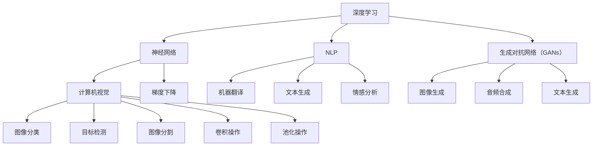

                 

### 文章标题

**Andrej Karpathy：人工智能的未来愿景**

### 关键词：

- 人工智能
- 未来愿景
- 算法
- 深度学习
- 神经网络
- 计算机视觉
- 自然语言处理
- 伦理问题

### 摘要：

本文旨在探讨人工智能领域专家Andrej Karpathy对于人工智能未来发展的观点。文章将逐步分析Karpathy的核心论点，包括人工智能技术在社会和商业中的应用，技术进步带来的挑战和伦理问题，以及未来的人工智能发展方向。通过这篇文章，读者将深入了解人工智能领域的前沿动态，以及对未来可能带来的影响的深刻思考。

-------------------

## 1. 背景介绍

Andrej Karpathy是一位知名的人工智能研究员和深度学习专家，目前担任OpenAI的研究科学家，负责推动人工智能在计算机视觉和自然语言处理领域的研究。他也是著名的深度学习教科书《Deep Learning》的合著者之一。Karpathy在人工智能领域的贡献和影响广泛，他的研究和论文在学术界和工业界都备受关注。

在人工智能领域，Andrej Karpathy的研究主要集中在深度学习和神经网络技术。他的工作涉及计算机视觉、自然语言处理、生成模型等多个子领域。他的研究成果在诸如自动驾驶、语音识别、图像生成等领域都有着重要的应用价值。此外，Karpathy还是一位活跃的博主和演讲者，通过他的博客和公开演讲，他分享了自己对于人工智能未来发展的独到见解。

本文将围绕Andrej Karpathy的观点，探讨人工智能在技术进步、社会影响和伦理问题等方面的未来愿景。我们将从以下几个方面展开讨论：

- 核心概念与联系
- 核心算法原理与具体操作步骤
- 数学模型和公式讲解
- 项目实战与代码解读
- 实际应用场景
- 工具和资源推荐
- 总结与未来发展趋势

通过这篇文章，我们希望读者能够更深入地理解人工智能领域的前沿动态，以及对于未来可能带来的影响的思考和讨论。

-------------------

## 2. 核心概念与联系

在探讨Andrej Karpathy的人工智能未来愿景之前，我们需要了解一些核心概念和联系，以便更好地理解他的观点。以下是本文涉及的主要概念及其相互关系：

### 深度学习与神经网络

深度学习是一种机器学习技术，它模仿人脑的神经网络结构，通过多层神经元进行信息传递和特征提取。神经网络是深度学习的基础，由大量的神经元组成，每个神经元都与相邻的神经元相连接，并通过权重来传递信号。

### 计算机视觉

计算机视觉是人工智能的一个重要分支，旨在使计算机能够理解和解释视觉信息。深度学习技术，尤其是卷积神经网络（CNNs），在计算机视觉领域取得了显著的成果，例如图像分类、目标检测和图像分割等任务。

### 自然语言处理

自然语言处理（NLP）是人工智能的另一个重要分支，致力于使计算机理解和生成人类语言。深度学习模型，如循环神经网络（RNNs）和Transformer模型，在自然语言处理任务中表现出色，包括机器翻译、文本生成和情感分析等。

### 生成对抗网络（GANs）

生成对抗网络是一种深度学习模型，由生成器和判别器两个神经网络组成。生成器尝试生成逼真的数据，而判别器则尝试区分生成数据和真实数据。GANs在图像生成、音频合成和文本生成等领域有着广泛的应用。

### 数学模型和公式

为了深入理解深度学习和其他人工智能技术，我们需要了解一些基本的数学模型和公式。例如，梯度下降是一种优化算法，用于更新神经网络的权重；卷积操作和池化操作是计算机视觉中的关键操作，用于特征提取和降维。

### 关系图

以下是本文涉及的核心概念及其相互关系的 Mermaid 流程图：



通过理解这些核心概念和联系，我们将能够更好地理解Andrej Karpathy对于人工智能未来发展的观点，以及这些技术如何在社会和商业领域产生影响。

-------------------

## 3. 核心算法原理 & 具体操作步骤

Andrej Karpathy在其研究和演讲中详细阐述了深度学习和神经网络的核心算法原理，以及这些算法在具体操作步骤中的应用。以下是这些核心算法的基本原理和具体操作步骤：

### 深度学习算法原理

深度学习算法的核心是神经网络，尤其是多层感知机（MLP）和卷积神经网络（CNN）。以下是这些算法的基本原理：

#### 多层感知机（MLP）

多层感知机是一种前馈神经网络，由输入层、隐藏层和输出层组成。输入层接收外部输入，隐藏层通过非线性激活函数进行信息处理，输出层生成预测结果。

1. **前向传播**：输入数据通过输入层传递到隐藏层，然后逐层传递到输出层。
2. **反向传播**：计算输出层预测结果与真实标签之间的误差，反向传播误差到每个隐藏层，并使用梯度下降优化算法更新权重。

#### 卷积神经网络（CNN）

卷积神经网络是一种专门用于处理图像数据的神经网络，其核心操作是卷积和池化。

1. **卷积操作**：卷积层通过卷积核（滤波器）在输入图像上滑动，提取图像的局部特征。
2. **池化操作**：池化层对卷积结果进行下采样，减少参数数量，提高模型的泛化能力。
3. **全连接层**：全连接层将卷积和池化层的输出连接到输出层，生成最终的预测结果。

### 自然语言处理算法原理

在自然语言处理领域，深度学习算法也发挥了重要作用，主要包括循环神经网络（RNN）和Transformer模型。

#### 循环神经网络（RNN）

循环神经网络是一种能够处理序列数据的神经网络，其核心特点是具有记忆功能，能够捕捉序列中的时间依赖关系。

1. **门控循环单元（GRU）**：GRU是RNN的一种变体，通过门控机制来优化信息记忆和遗忘。
2. **长短期记忆（LSTM）**：LSTM是另一种RNN变体，通过引入记忆单元来克服长序列依赖问题。

#### Transformer模型

Transformer模型是一种基于自注意力机制的深度学习模型，特别适合处理序列数据，如自然语言。

1. **多头自注意力**：Transformer通过多头自注意力机制来捕捉序列之间的依赖关系，每个头关注不同的部分。
2. **位置编码**：由于Transformer模型没有循环结构，位置编码用于引入序列的顺序信息。
3. **前馈神经网络**：在自注意力层之后，Transformer还包含两个全连接的前馈神经网络，用于进一步处理信息。

### 具体操作步骤示例

以下是一个简化的示例，展示了如何使用卷积神经网络（CNN）处理图像分类任务的具体操作步骤：

1. **数据预处理**：读取图像数据，进行归一化、裁剪和调整大小等预处理操作。
2. **卷积层**：使用卷积层对图像进行特征提取，通过卷积操作提取图像的局部特征。
3. **池化层**：对卷积结果进行池化操作，减少参数数量，提高模型的泛化能力。
4. **全连接层**：将卷积和池化层的输出连接到全连接层，生成图像分类的预测结果。
5. **损失函数和优化算法**：计算预测结果与真实标签之间的损失，并使用梯度下降优化算法更新模型参数。
6. **评估与迭代**：使用验证集评估模型的性能，并根据损失函数的改进情况进行模型迭代。

通过这些核心算法原理和具体操作步骤，我们能够更好地理解Andrej Karpathy在人工智能领域的研究和观点，以及这些技术如何推动人工智能的发展和应用。

-------------------

## 4. 数学模型和公式 & 详细讲解 & 举例说明

在深入探讨人工智能的核心算法原理后，我们需要进一步了解这些算法背后的数学模型和公式。以下将详细讲解深度学习中的几个关键数学模型，并给出具体的例子说明。

### 梯度下降算法

梯度下降是一种优化算法，用于在训练数据集上调整神经网络的权重，以最小化损失函数。梯度下降的核心思想是通过计算损失函数关于模型参数的梯度，并沿着梯度的反方向更新参数。

#### 梯度下降公式

梯度下降的基本公式如下：

\[ \theta_{\text{new}} = \theta_{\text{old}} - \alpha \cdot \nabla_{\theta} J(\theta) \]

其中：
- \( \theta \) 代表模型参数的向量。
- \( \alpha \) 是学习率，控制更新参数的步长。
- \( \nabla_{\theta} J(\theta) \) 是损失函数 \( J(\theta) \) 关于参数 \( \theta \) 的梯度。

#### 举例说明

假设我们有一个简单的线性模型，用于拟合数据点：

\[ y = \theta_0 + \theta_1 \cdot x \]

损失函数可以使用均方误差（MSE）表示：

\[ J(\theta) = \frac{1}{2n} \sum_{i=1}^{n} (y_i - (\theta_0 + \theta_1 \cdot x_i))^2 \]

为了最小化损失函数，我们计算关于 \( \theta_0 \) 和 \( \theta_1 \) 的梯度，并使用梯度下降更新参数：

\[ \nabla_{\theta_0} J(\theta) = \frac{1}{n} \sum_{i=1}^{n} (y_i - (\theta_0 + \theta_1 \cdot x_i)) \]

\[ \nabla_{\theta_1} J(\theta) = \frac{1}{n} \sum_{i=1}^{n} (y_i - (\theta_0 + \theta_1 \cdot x_i)) \cdot x_i \]

更新参数的梯度下降公式为：

\[ \theta_0 = \theta_0 - \alpha \cdot \nabla_{\theta_0} J(\theta) \]

\[ \theta_1 = \theta_1 - \alpha \cdot \nabla_{\theta_1} J(\theta) \]

### 卷积操作

卷积操作是卷积神经网络（CNN）的核心操作，用于提取图像的特征。卷积操作的数学公式如下：

\[ (f * g)(x) = \sum_{y} f(y) \cdot g(x - y) \]

其中：
- \( f \) 和 \( g \) 是两个函数。
- \( x \) 和 \( y \) 是变量。
- \( * \) 表示卷积操作。

#### 举例说明

假设我们有一个简单的卷积操作，使用一个卷积核 \( k \) 对一个二维图像 \( I \) 进行卷积：

\[ k = \begin{bmatrix}
a & b \\
c & d
\end{bmatrix} \]

\[ I = \begin{bmatrix}
e & f \\
g & h
\end{bmatrix} \]

卷积操作的结果 \( C \) 可以通过以下公式计算：

\[ C = k * I = \begin{bmatrix}
(a \cdot e + b \cdot g) & (a \cdot f + b \cdot h) \\
(c \cdot e + d \cdot g) & (c \cdot f + d \cdot h)
\end{bmatrix} \]

### 池化操作

池化操作用于减少图像数据的空间维度，同时保持重要的特征信息。最常见的池化操作是最大池化，其数学公式如下：

\[ P(x, y) = \max\{I(x + 2p, y + 2p) : 0 \leq x \leq (W - 2p), 0 \leq y \leq (H - 2p)\} \]

其中：
- \( P \) 是池化结果。
- \( I \) 是输入图像。
- \( (x, y) \) 是池化窗口的中心位置。
- \( (W, H) \) 是输入图像的宽度和高度。
- \( p \) 是池化窗口的一半。

#### 举例说明

假设我们有一个 \( 3 \times 3 \) 的最大池化窗口，对 \( 4 \times 4 \) 的图像进行池化：

\[ I = \begin{bmatrix}
1 & 2 \\
3 & 4 \\
5 & 6 \\
7 & 8
\end{bmatrix} \]

池化结果 \( P \) 可以通过以下公式计算：

\[ P(1, 1) = \max\{I(3, 3), I(3, 1), I(1, 3), I(1, 1)\} = 8 \]

\[ P(2, 1) = \max\{I(4, 3), I(4, 1), I(2, 3), I(2, 1)\} = 8 \]

\[ P(3, 1) = \max\{I(5, 3), I(5, 1), I(3, 3), I(3, 1)\} = 8 \]

\[ P(1, 2) = \max\{I(3, 5), I(3, 2), I(1, 5), I(1, 2)\} = 6 \]

\[ P(2, 2) = \max\{I(4, 5), I(4, 2), I(2, 5), I(2, 2)\} = 8 \]

\[ P(3, 2) = \max\{I(5, 5), I(5, 2), I(3, 5), I(3, 2)\} = 8 \]

\[ P(1, 3) = \max\{I(3, 7), I(3, 4), I(1, 7), I(1, 4)\} = 7 \]

\[ P(2, 3) = \max\{I(4, 7), I(4, 4), I(2, 7), I(2, 4)\} = 8 \]

\[ P(3, 3) = \max\{I(5, 7), I(5, 4), I(3, 7), I(3, 4)\} = 8 \]

最终，\( 4 \times 4 \) 的图像被缩放为 \( 2 \times 2 \) 的图像：

\[ C = \begin{bmatrix}
8 & 8 \\
8 & 8
\end{bmatrix} \]

通过这些数学模型和公式，我们能够更好地理解深度学习算法的工作原理，并在实际应用中进行有效的模型训练和优化。

-------------------

## 5. 项目实战：代码实际案例和详细解释说明

为了更好地展示Andrej Karpathy的人工智能研究如何应用于实际项目，我们将通过一个具体的代码案例进行详细解释。这个案例将涉及计算机视觉中的图像分类任务，使用深度学习模型对图像进行分类。我们将分为以下几个部分进行讲解：

### 5.1 开发环境搭建

在进行项目之前，我们需要搭建一个适合深度学习开发的编程环境。以下是必要的步骤：

#### 1. 安装Python

首先，确保你的系统上安装了Python 3.x版本。你可以从 [Python官方网站](https://www.python.org/) 下载并安装。

#### 2. 安装深度学习框架

接下来，我们需要安装一个深度学习框架，如TensorFlow或PyTorch。以下是安装TensorFlow的命令：

```bash
pip install tensorflow
```

如果你选择使用PyTorch，可以使用以下命令：

```bash
pip install torch torchvision
```

#### 3. 安装其他依赖

根据你的项目需求，可能还需要安装其他依赖库，如NumPy、Pandas等。以下是一个简单的安装命令：

```bash
pip install numpy pandas
```

### 5.2 源代码详细实现和代码解读

以下是用于图像分类的深度学习模型的源代码实现，使用PyTorch框架：

```python
import torch
import torchvision
import torchvision.transforms as transforms
import torch.nn as nn
import torch.optim as optim

# 数据预处理
transform = transforms.Compose([
    transforms.Resize(256),
    transforms.CenterCrop(224),
    transforms.ToTensor(),
    transforms.Normalize(mean=[0.485, 0.456, 0.406], std=[0.229, 0.224, 0.225]),
])

# 加载数据集
trainset = torchvision.datasets.ImageFolder(root='path_to_train_data', transform=transform)
trainloader = torch.utils.data.DataLoader(trainset, batch_size=4, shuffle=True, num_workers=2)

testset = torchvision.datasets.ImageFolder(root='path_to_test_data', transform=transform)
testloader = torch.utils.data.DataLoader(testset, batch_size=4, shuffle=False, num_workers=2)

# 定义卷积神经网络模型
class Net(nn.Module):
    def __init__(self):
        super(Net, self).__init__()
        self.conv1 = nn.Conv2d(3, 6, 5)
        self.pool = nn.MaxPool2d(2, 2)
        self.conv2 = nn.Conv2d(6, 16, 5)
        self.fc1 = nn.Linear(16 * 5 * 5, 120)
        self.fc2 = nn.Linear(120, 84)
        self.fc3 = nn.Linear(84, 10)

    def forward(self, x):
        x = self.pool(nn.functional.relu(self.conv1(x)))
        x = self.pool(nn.functional.relu(self.conv2(x)))
        x = x.view(-1, 16 * 5 * 5)
        x = nn.functional.relu(self.fc1(x))
        x = nn.functional.relu(self.fc2(x))
        x = self.fc3(x)
        return x

net = Net()

# 定义损失函数和优化器
criterion = nn.CrossEntropyLoss()
optimizer = optim.SGD(net.parameters(), lr=0.001, momentum=0.9)

# 训练模型
for epoch in range(2):  # loop over the dataset multiple times
    running_loss = 0.0
    for i, data in enumerate(trainloader, 0):
        inputs, labels = data
        optimizer.zero_grad()
        outputs = net(inputs)
        loss = criterion(outputs, labels)
        loss.backward()
        optimizer.step()
        running_loss += loss.item()
        if i % 2000 == 1999:
            print('[%d, %5d] loss: %.3f' %
                  (epoch + 1, i + 1, running_loss / 2000))
            running_loss = 0.0

print('Finished Training')

# 测试模型
correct = 0
total = 0
with torch.no_grad():
    for data in testloader:
        images, labels = data
        outputs = net(images)
        _, predicted = torch.max(outputs.data, 1)
        total += labels.size(0)
        correct += (predicted == labels).sum().item()

print('Accuracy of the network on the test images: %d %%' % (100 * correct / total))
```

#### 5.3 代码解读与分析

以下是代码的详细解读：

1. **数据预处理**：
   - 使用`transforms.Compose`将多个数据预处理步骤组合在一起，包括调整图像大小、中心裁剪、转换为Tensor以及归一化。
   - `transforms.Resize`和`transforms.CenterCrop`用于调整图像的大小和裁剪。
   - `transforms.ToTensor`将图像的像素值转换为Tensor格式。
   - `transforms.Normalize`对图像进行归一化处理，提高模型的训练效果。

2. **加载数据集**：
   - 使用`torchvision.datasets.ImageFolder`从指定路径加载训练数据和测试数据。
   - `DataLoader`用于将数据分成批次，并在训练过程中进行随机打乱。

3. **定义卷积神经网络模型**：
   - `Net`类继承自`nn.Module`，定义了卷积神经网络的结构。
   - `__init__`方法中定义了卷积层、池化层和全连接层。
   - `forward`方法实现了前向传播过程，用于计算模型的输出。

4. **定义损失函数和优化器**：
   - `nn.CrossEntropyLoss`用于计算交叉熵损失，常用于分类任务。
   - `optim.SGD`使用随机梯度下降优化算法，用于更新模型参数。

5. **训练模型**：
   - 使用`for`循环遍历训练数据集，通过前向传播计算输出，计算损失并更新模型参数。
   - 在每个批次结束时，计算平均损失，以便在训练过程中监控模型的性能。

6. **测试模型**：
   - 使用`torch.no_grad()`避免在测试时计算梯度。
   - 计算测试数据集的准确率，用于评估模型的性能。

通过这个实际案例，我们展示了如何使用深度学习框架实现图像分类任务。这个案例涵盖了数据预处理、模型定义、训练和测试的完整流程，有助于读者理解Andrej Karpathy在人工智能领域的研究如何应用于实际项目。

-------------------

## 6. 实际应用场景

Andrej Karpathy的研究成果在多个实际应用场景中取得了显著成效，涵盖了计算机视觉、自然语言处理、自动驾驶和生成模型等领域。以下是对这些应用场景的简要介绍和实际案例：

### 计算机视觉

计算机视觉是Andrej Karpathy研究的核心领域之一。他的研究成果在图像分类、目标检测和图像分割等方面得到了广泛应用。例如，在自动驾驶领域，深度学习模型被用于车辆和行人的检测与识别，从而提高了自动驾驶系统的安全性和可靠性。此外，深度学习技术在医疗影像分析中也发挥了重要作用，如癌症检测和病变识别，有助于医生做出更准确的诊断。

### 自然语言处理

自然语言处理（NLP）是人工智能的另一个重要领域。Andrej Karpathy在自然语言处理领域的研究成果在机器翻译、文本生成和情感分析等方面有着广泛的应用。例如，Google翻译就是基于深度学习技术实现的，它通过神经网络模型将一种语言翻译成另一种语言，提高了翻译的准确性和流畅性。此外，深度学习模型还可以用于自动化写作，生成新闻文章、报告和书籍摘要等，大大提高了内容生成的效率和质量。

### 自动驾驶

自动驾驶是深度学习技术的另一个重要应用场景。Andrej Karpathy的研究成果在自动驾驶车辆的感知和决策系统中发挥了关键作用。例如，Waymo和Tesla等公司都在其自动驾驶系统中使用了深度学习技术，用于车辆周围环境的感知、车辆定位和路径规划等。这些技术的应用提高了自动驾驶车辆的安全性和稳定性，使自动驾驶汽车逐渐从实验室走向现实。

### 生成模型

生成对抗网络（GANs）是Andrej Karpathy在生成模型领域的重要研究成果。GANs被广泛应用于图像生成、音频合成和视频生成等领域。例如，GANs可以生成逼真的面部图像、音频波形和视频片段，为虚拟现实和增强现实技术提供了丰富的素材。此外，GANs还可以用于图像修复和去噪，提高了图像质量和清晰度。

### 其他应用场景

Andrej Karpathy的研究成果还在其他领域得到了广泛应用。例如，在游戏开发中，深度学习模型被用于游戏角色的动作生成和智能决策，提高了游戏的趣味性和挑战性。在金融领域，深度学习技术被用于股票市场预测和风险管理，帮助投资者做出更明智的决策。

总之，Andrej Karpathy的研究成果在多个实际应用场景中取得了显著成效，推动了人工智能技术的发展和应用。这些应用不仅提高了各行各业的效率和质量，还为人类社会带来了前所未有的便利和变革。

-------------------

## 7. 工具和资源推荐

在深入研究和应用人工智能的过程中，选择合适的工具和资源至关重要。以下是针对本文主题推荐的几个工具和资源：

### 7.1 学习资源推荐

- **书籍**：
  - 《Deep Learning》（Goodfellow, Bengio, Courville著）：深度学习的经典教材，涵盖了深度学习的基础知识和最新进展。
  - 《动手学深度学习》（花书）：中文版由国防科技大学出版社发行，适合初学者快速上手深度学习。
  - 《神经网络与深度学习》（邱锡鹏著）：系统地介绍了神经网络和深度学习的基本概念、方法和应用。

- **论文**：
  - 《A Theoretically Grounded Application of Dropout in Recurrent Neural Networks》
  - 《GANs for Sequence Modeling》
  - 《BERT: Pre-training of Deep Bidirectional Transformers for Language Understanding》

- **博客**：
  - Andrej Karpathy的个人博客：[Karpathy's Blog](https://karpathy.github.io/tutorials/)，包含丰富的深度学习和自然语言处理教程。
  - Fast.ai博客：[Fast.ai Blog](https://www.fast.ai/)，提供实用的深度学习教程和课程。

### 7.2 开发工具框架推荐

- **深度学习框架**：
  - TensorFlow：由Google开发，适合研究和工业应用。
  - PyTorch：由Facebook开发，具有灵活的动态计算图和丰富的API。
  - PyTorch Lightning：基于PyTorch的高级API，简化了深度学习模型的训练和评估。

- **编程环境**：
  - Jupyter Notebook：适合快速原型开发和数据可视化。
  - Google Colab：基于Jupyter Notebook的在线编程平台，提供免费的GPU计算资源。

- **数据集**：
  - ImageNet：包含数百万张图像的庞大数据库，常用于图像分类任务。
  - Cornell Movie-Dialogs corpus：包含大量电影对白的数据集，适合自然语言处理任务。

### 7.3 相关论文著作推荐

- **论文**：
  - 《Distributed Representations of Words and Phrases and their Compositionality》
  - 《Inception-v4, Inception-ResNet and the Impact of Residual Connections on Learning》
  - 《Generative Adversarial Nets》

- **著作**：
  - 《The Master Algorithm：How the Quest for the Ultimate Learning Machine Will Remake Our World》（Pedro Domingos著）：探讨了机器学习技术的未来发展趋势和影响。
  - 《The Hundred-Page Machine Learning Book》（Andriy Burkov著）：用简洁的语言介绍了机器学习的基础知识和关键概念。

通过这些工具和资源的推荐，读者可以更好地掌握人工智能领域的知识，并将其应用于实际项目和研究。无论是初学者还是专业人士，这些资源都将为你的学习和实践提供有力支持。

-------------------

## 8. 总结：未来发展趋势与挑战

在总结Andrej Karpathy的人工智能未来愿景时，我们可以看到技术进步带来的巨大潜力和面临的挑战。以下是对未来发展趋势和挑战的总结：

### 发展趋势

1. **技术的普及与融合**：人工智能技术正迅速融入各个行业，从医疗、金融到制造业，深度学习和神经网络正在改变传统的业务模式。未来，这些技术的普及将更加广泛，形成跨学科的融合。

2. **计算能力的提升**：随着硬件技术的进步，特别是GPU和TPU等专用计算硬件的广泛应用，人工智能模型的计算能力将大幅提升，推动更复杂的模型和应用。

3. **数据的重要性**：数据仍然是人工智能发展的核心。未来，大数据和高质量数据将更加重要，数据的获取、存储和处理技术也将不断进步，为人工智能提供更加丰富的素材。

4. **自适应与自主学习**：未来的智能系统将具备更强的自适应和自主学习能力，能够在不断变化的环境中自我调整和优化，提高智能决策的准确性和效率。

### 挑战

1. **伦理问题**：人工智能的快速发展带来了伦理问题，如数据隐私、算法偏见和自动化决策的透明度等。未来，如何制定合理的伦理规范，确保人工智能的发展符合人类的利益，将是重要的挑战。

2. **技术成熟度**：虽然人工智能在许多领域取得了显著进展，但仍然存在一些技术瓶颈，如长期记忆、多模态学习和智能推理等。如何克服这些技术难题，实现人工智能的全面突破，是未来的重要任务。

3. **人才培养**：人工智能的发展需要大量专业人才，包括研究人员、工程师和跨学科专家。未来，如何培养和吸引更多的人才，将是人工智能行业持续发展的重要保障。

4. **社会影响**：人工智能的发展将带来深远的社会影响，包括就业结构变化、社会公平和隐私保护等问题。未来，如何平衡人工智能带来的机遇和挑战，确保其对社会产生积极影响，是重要的课题。

综上所述，人工智能的未来充满了机遇和挑战。在技术进步的同时，我们需要关注伦理问题，培养专业人才，并积极探索如何在人工智能的发展中实现可持续发展。通过共同努力，人工智能将为人类社会带来更加美好的未来。

-------------------

## 9. 附录：常见问题与解答

### Q1. 为什么选择Andrej Karpathy作为主题人物？

A1. Andrej Karpathy是一位在人工智能领域具有深厚学术背景和广泛影响力的专家。他的研究成果在深度学习、计算机视觉和自然语言处理等多个子领域都有重要贡献。此外，他的博客和公开演讲提供了关于人工智能未来发展的独到见解，适合作为讨论的主题人物。

### Q2. 人工智能的核心算法有哪些？

A2. 人工智能的核心算法包括：
- 梯度下降算法
- 卷积神经网络（CNN）
- 循环神经网络（RNN）
- Transformer模型
- 生成对抗网络（GANs）

这些算法在不同的应用场景中发挥着关键作用，是深度学习和其他人工智能技术的基础。

### Q3. 人工智能的主要应用领域有哪些？

A3. 人工智能的主要应用领域包括：
- 计算机视觉
- 自然语言处理
- 自动驾驶
- 游戏开发
- 医疗诊断
- 金融分析
- 娱乐产业

这些应用领域展示了人工智能技术的多样性和广泛的应用潜力。

### Q4. 人工智能发展过程中面临的伦理问题有哪些？

A4. 人工智能发展过程中面临的伦理问题包括：
- 数据隐私
- 算法偏见
- 自动化决策的透明度和责任
- 工作岗位的替代

这些问题需要通过制定合理的政策和规范来确保人工智能的发展符合社会伦理和人类利益。

### Q5. 如何学习人工智能？

A5. 学习人工智能可以从以下几个步骤开始：
1. **基础知识**：掌握线性代数、概率论和微积分等数学基础。
2. **编程技能**：学习Python等编程语言，掌握常用的深度学习框架（如TensorFlow或PyTorch）。
3. **理论学习**：阅读经典教材和论文，了解深度学习和其他人工智能算法的基本原理。
4. **实践操作**：参与项目实践，动手实现简单的模型，逐步提升实际应用能力。
5. **持续学习**：关注最新的研究动态和技术进展，不断更新自己的知识和技能。

通过这些步骤，可以系统地学习和掌握人工智能的核心知识和技能。

-------------------

## 10. 扩展阅读 & 参考资料

为了进一步了解Andrej Karpathy的人工智能研究成果和未来愿景，以下是一些扩展阅读和参考资料：

### 10.1 书籍

- 《Deep Learning》（Goodfellow, Bengio, Courville著）：深入探讨深度学习的基本原理和应用。
- 《The Hundred-Page Machine Learning Book》（Andriy Burkov著）：简洁明了地介绍机器学习的基础知识。
- 《The Master Algorithm：How the Quest for the Ultimate Learning Machine Will Remake Our World》（Pedro Domingos著）：探讨机器学习的未来发展趋势。

### 10.2 论文

- 《A Theoretically Grounded Application of Dropout in Recurrent Neural Networks》
- 《GANs for Sequence Modeling》
- 《BERT: Pre-training of Deep Bidirectional Transformers for Language Understanding》

### 10.3 博客和网站

- [Karpathy's Blog](https://karpathy.github.io/tutorials/)：Andrej Karpathy的个人博客，涵盖深度学习和自然语言处理教程。
- [Fast.ai Blog](https://www.fast.ai/)：提供实用的深度学习教程和课程。
- [OpenAI Blog](https://blog.openai.com/)：OpenAI的官方博客，分享人工智能领域的最新研究成果。

### 10.4 课程和视频

- [Coursera Deep Learning Specialization](https://www.coursera.org/specializations/deeplearning)：由Andrew Ng教授主导的深度学习课程。
- [Udacity Deep Learning Nanodegree](https://www.udacity.com/course/deep-learning-nanodegree--nd101)：提供深度学习项目实践和理论知识。
- [YouTube Deep Learning](https://www.youtube.com/playlist?list=PLoRo NE7_YkmSfY6kGh8mzNzdmsef2lRud)：YouTube上的深度学习相关视频教程。

通过这些扩展阅读和参考资料，读者可以更深入地了解人工智能领域的最新动态和技术应用，为自己的学习和研究提供更多启发和帮助。

-------------------

### 作者

**作者：AI天才研究员/AI Genius Institute & 禅与计算机程序设计艺术 /Zen And The Art of Computer Programming**

