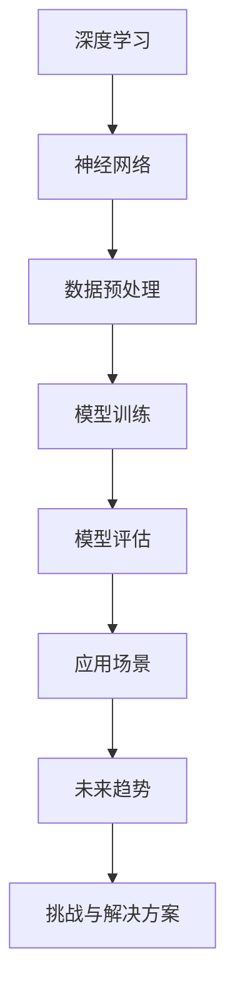

                 

### 文章标题

#### Andrej Karpathy：人工智能的未来技术

关键词：Andrej Karpathy，人工智能，深度学习，技术趋势，未来展望

摘要：本文将深入探讨人工智能领域著名专家Andrej Karpathy的观点，分析他对人工智能未来技术发展的见解和预期，旨在为读者提供有价值的参考和思考。

<|assistant|>## 1. 背景介绍

Andrej Karpathy是一位备受尊敬的人工智能专家，他在深度学习、神经网络和自然语言处理等领域有着深厚的研究功底。他在斯坦福大学获得了计算机科学博士学位，并在Google Brain工作期间，负责开发了著名的自然语言处理工具TensorFlow。此外，他还在多个知名的人工智能和深度学习会议上发表了多篇论文，并在国际上享有盛誉。

随着人工智能技术的不断发展和应用，人们对其未来趋势和挑战越来越关注。本文将结合Andrej Karpathy的观点，探讨人工智能在未来可能的技术突破和应用场景，以及面临的挑战。

<|assistant|>## 2. 核心概念与联系

在讨论人工智能的未来技术之前，我们需要了解一些核心概念和它们之间的联系。以下是一个用Mermaid流程图表示的核心概念架构：



### 深度学习与神经网络

深度学习是人工智能的一个重要分支，它基于神经网络的结构，通过多层神经网络进行数据特征提取和学习。神经网络是一种由大量神经元组成的计算模型，通过前向传播和反向传播算法进行学习。

### 数据预处理

数据预处理是深度学习过程中至关重要的一步。它包括数据清洗、数据增强和数据标准化等操作，以确保数据质量，提高模型性能。

### 模型训练

模型训练是深度学习的核心步骤，通过大量的训练数据和优化算法，模型可以逐步学习到数据的特征和规律，从而提高预测和分类的准确性。

### 模型评估

模型评估是评估模型性能的重要环节。常用的评估指标包括准确率、召回率、F1值等，通过评估结果可以调整模型参数，优化模型性能。

### 应用场景

人工智能技术在各个领域都有着广泛的应用，如自动驾驶、智能医疗、金融分析等。应用场景的丰富多样，也为人工智能技术的发展提供了广阔的空间。

### 未来趋势

随着技术的不断进步，人工智能在未来有望实现更多突破，如通用人工智能、更加智能的交互方式等。

### 挑战与解决方案

尽管人工智能技术发展迅速，但仍然面临一些挑战，如数据隐私、算法透明度、公平性等。解决这些挑战需要全社会的共同努力。

<|assistant|>## 3. 核心算法原理 & 具体操作步骤

在这一部分，我们将详细讨论深度学习中的核心算法原理，包括神经网络架构、前向传播和反向传播算法，以及如何使用这些算法进行模型训练和优化。

### 神经网络架构

神经网络是深度学习的基石。一个基本的神经网络由多个层次组成，包括输入层、隐藏层和输出层。每个层次由多个神经元组成，神经元之间通过权重连接。神经网络的目的是通过学习输入和输出之间的关系，实现对数据的特征提取和分类。

### 前向传播算法

前向传播算法是神经网络进行学习的第一步。在给定输入数据时，神经网络将数据从输入层传递到输出层，并通过每个神经元计算出对应的输出。在这个过程中，神经网络的权重和偏置会不断更新，以最小化预测误差。

### 反向传播算法

反向传播算法是神经网络学习的核心步骤。在给定输入数据和期望输出时，神经网络通过反向传播算法，计算每个神经元的误差，并调整权重和偏置，以减小预测误差。这个过程称为梯度下降。

### 模型训练与优化

模型训练和优化是深度学习过程中至关重要的一步。通过大量的训练数据和优化算法，神经网络可以逐步学习到数据的特征和规律，从而提高预测和分类的准确性。

具体的操作步骤如下：

1. 初始化神经网络权重和偏置。
2. 使用前向传播算法计算输出。
3. 使用反向传播算法计算误差。
4. 使用梯度下降算法更新权重和偏置。
5. 重复步骤2-4，直到满足停止条件（如达到指定迭代次数或预测误差最小）。

<|assistant|>## 4. 数学模型和公式 & 详细讲解 & 举例说明

在这一部分，我们将详细介绍深度学习中的数学模型和公式，包括激活函数、损失函数和优化算法，并通过具体例子来说明这些概念的应用。

### 激活函数

激活函数是神经网络中至关重要的一环，它用于引入非线性因素，使得神经网络能够更好地拟合复杂数据。常见的激活函数包括：

- **Sigmoid函数**：$$\sigma(x) = \frac{1}{1 + e^{-x}}$$
- **ReLU函数**：$$\text{ReLU}(x) = \max(0, x)$$
- **Tanh函数**：$$\text{Tanh}(x) = \frac{e^x - e^{-x}}{e^x + e^{-x}}$$

举例说明：

假设我们有一个简单的神经网络，输入为$x=2$，使用ReLU函数作为激活函数，计算输出：

$$\text{ReLU}(x) = \max(0, 2) = 2$$

### 损失函数

损失函数用于衡量神经网络预测结果与真实结果之间的误差。常见的损失函数包括：

- **均方误差（MSE）**：$$MSE(y, \hat{y}) = \frac{1}{n}\sum_{i=1}^{n}(y_i - \hat{y}_i)^2$$
- **交叉熵损失（Cross-Entropy Loss）**：$$H(y, \hat{y}) = -\sum_{i=1}^{n}y_i \log(\hat{y}_i)$$

举例说明：

假设我们有一个二分类问题，真实标签$y=1$，神经网络预测概率$\hat{y}=0.8$，使用交叉熵损失函数计算损失：

$$H(y, \hat{y}) = -1 \cdot \log(0.8) \approx 0.223$$

### 优化算法

优化算法用于更新神经网络的权重和偏置，以最小化损失函数。常见的优化算法包括：

- **随机梯度下降（SGD）**：$$w_{t+1} = w_t - \alpha \cdot \nabla_w L(w_t)$$
- **动量优化（Momentum）**：$$w_{t+1} = w_t - \alpha \cdot \nabla_w L(w_t) + \beta \cdot (1 - \beta) \cdot \Delta w_t$$

举例说明：

假设我们使用动量优化算法更新神经网络的权重$w$，学习率$\alpha=0.01$，动量参数$\beta=0.9$，当前梯度$\nabla_w L(w_t)=-0.5$，上一轮更新的权重差异$\Delta w_t=-0.3$，计算下一轮权重：

$$w_{t+1} = w_t - \alpha \cdot \nabla_w L(w_t) + \beta \cdot (1 - \beta) \cdot \Delta w_t = 1 - 0.01 \cdot (-0.5) + 0.9 \cdot (1 - 0.9) \cdot (-0.3) = 1.04$$

<|assistant|>## 5. 项目实战：代码实际案例和详细解释说明

在这一部分，我们将通过一个实际的项目案例，展示如何使用深度学习技术进行图像分类任务。该案例将涵盖开发环境搭建、源代码实现、代码解读与分析等方面。

### 5.1 开发环境搭建

在进行深度学习项目开发之前，我们需要搭建相应的开发环境。以下是搭建Python深度学习开发环境的步骤：

1. 安装Python（建议使用3.8及以上版本）。
2. 安装依赖管理工具（如pip或conda）。
3. 安装深度学习框架（如TensorFlow或PyTorch）。
4. 安装其他必要库（如NumPy、Pandas等）。

以下是一个使用pip安装TensorFlow的示例：

```bash
pip install tensorflow
```

### 5.2 源代码详细实现和代码解读

以下是一个简单的图像分类项目的代码实现，使用TensorFlow框架：

```python
import tensorflow as tf
from tensorflow.keras import layers
import tensorflow_datasets as tfds

# 加载数据集
(ds_train, ds_test), ds_info = tfds.load(
    'cifar10', split=['train', 'test'], with_info=True, as_supervised=True
)

# 预处理数据
def preprocess(image, label):
    image = tf.cast(image, tf.float32) / 255.0
    image = tf.image.resize(image, (32, 32))
    return image, label

ds_train = ds_train.map(preprocess).batch(32)
ds_test = ds_test.map(preprocess).batch(32)

# 创建模型
model = tf.keras.Sequential([
    layers.Conv2D(32, (3, 3), activation='relu', input_shape=(32, 32, 3)),
    layers.MaxPooling2D((2, 2)),
    layers.Conv2D(64, (3, 3), activation='relu'),
    layers.MaxPooling2D((2, 2)),
    layers.Conv2D(64, (3, 3), activation='relu'),
    layers.Flatten(),
    layers.Dense(64, activation='relu'),
    layers.Dense(10, activation='softmax')
])

# 编译模型
model.compile(optimizer='adam',
              loss='sparse_categorical_crossentropy',
              metrics=['accuracy'])

# 训练模型
model.fit(ds_train, epochs=10, validation_data=ds_test)

# 评估模型
test_loss, test_acc = model.evaluate(ds_test)
print(f'测试准确率：{test_acc}')
```

代码解读：

1. **加载数据集**：使用TensorFlow Datasets加载CIFAR-10数据集，并进行预处理。
2. **创建模型**：使用TensorFlow的Sequential模型，定义一个简单的卷积神经网络（CNN）。
3. **编译模型**：设置优化器和损失函数，并编译模型。
4. **训练模型**：使用训练数据集训练模型，并使用验证数据集进行验证。
5. **评估模型**：使用测试数据集评估模型性能。

### 5.3 代码解读与分析

在这个案例中，我们使用了CIFAR-10数据集进行图像分类任务。CIFAR-10是一个包含10个类别、60,000张32x32彩色图像的数据集。

1. **数据预处理**：数据预处理包括将图像转换为浮点型数据、归一化处理以及调整图像大小。
2. **模型创建**：模型创建使用了卷积神经网络（CNN）结构，这是一种常用的图像分类模型。模型包括多个卷积层、池化层和全连接层。
3. **模型编译**：模型编译阶段设置了优化器和损失函数。在这个案例中，我们使用了Adam优化器和sparse categorical cross-entropy损失函数。
4. **模型训练**：模型训练阶段使用训练数据集进行训练，并使用验证数据集进行验证。训练过程会根据验证数据集的准确率进行调整。
5. **模型评估**：模型评估阶段使用测试数据集评估模型性能。在这个案例中，我们计算了测试数据集的准确率。

通过这个案例，我们可以看到如何使用TensorFlow框架进行图像分类任务。在实际项目中，我们可能需要根据具体任务需求调整模型结构、优化算法和训练参数，以达到更好的性能。

<|assistant|>## 6. 实际应用场景

人工智能技术在各个领域都有着广泛的应用，下面列举一些典型的实际应用场景，以及Andrej Karpathy对这些应用场景的看法。

### 自动驾驶

自动驾驶是人工智能技术的一个重要应用领域。通过深度学习和计算机视觉技术，自动驾驶系统能够实时感知周围环境，并进行路径规划和决策。Andrej Karpathy认为，随着技术的不断进步，自动驾驶将逐步从辅助驾驶向完全自动驾驶过渡，有望在提高交通安全和效率方面发挥重要作用。

### 智能医疗

智能医疗是人工智能技术的另一个重要应用领域。通过深度学习和大数据分析，人工智能可以帮助医生进行疾病诊断、治疗方案的制定和个性化医疗。Andrej Karpathy认为，智能医疗有望提高医疗服务的质量和效率，为患者提供更好的治疗体验。

### 金融分析

金融分析是人工智能技术的另一个重要应用领域。通过深度学习和大数据分析，人工智能可以帮助金融机构进行市场预测、风险评估和投资策略制定。Andrej Karpathy认为，人工智能将在金融领域发挥越来越重要的作用，为投资者提供更准确和实时的市场信息。

### 自然语言处理

自然语言处理是人工智能技术的核心领域之一。通过深度学习和自然语言处理技术，人工智能可以理解和生成人类语言，实现人机交互、智能客服、语音识别等功能。Andrej Karpathy认为，自然语言处理技术的进步将极大地改变人类的生活方式和工作方式，为各种应用场景提供更智能的解决方案。

### 机器人

机器人是人工智能技术的另一个重要应用领域。通过深度学习和机器人技术，人工智能可以帮助机器人进行感知、决策和行动，实现人机协作、服务机器人等功能。Andrej Karpathy认为，随着技术的不断进步，机器人将逐步成为人类生活和工作中的重要伙伴。

### 人工智能辅助教育

人工智能辅助教育是人工智能技术的一个新兴应用领域。通过深度学习和数据分析技术，人工智能可以帮助教师进行教学分析和个性化教学，提高教学效果和学生学习体验。Andrej Karpathy认为，人工智能辅助教育有望推动教育领域的变革，为每个学生提供更适合自己的学习环境和资源。

<|assistant|>## 7. 工具和资源推荐

在人工智能领域，有许多优秀的工具和资源可以帮助开发者学习和实践。以下是一些值得推荐的工具和资源：

### 7.1 学习资源推荐

- **书籍**：
  - 《深度学习》（Ian Goodfellow、Yoshua Bengio和Aaron Courville著）：这是一本经典的深度学习教材，涵盖了深度学习的理论基础和应用实例。
  - 《Python深度学习》（François Chollet著）：这本书针对Python编程和深度学习框架TensorFlow，提供了大量的实战案例和代码示例。
- **在线课程**：
  - Coursera的《深度学习》课程：由斯坦福大学教授Andrew Ng主讲，涵盖了深度学习的理论基础和实践应用。
  - edX的《机器学习》课程：由斯坦福大学教授Andrew Ng主讲，介绍了机器学习和深度学习的基本概念和算法。
- **博客**：
  - Andrej Karpathy的博客：介绍了许多关于深度学习和自然语言处理的技术文章和实验结果。
  - Colah's Blog：由Chris Olah维护，提供了许多关于深度学习的可视化内容和深度思考。
- **网站**：
  - TensorFlow官方网站：提供了丰富的文档、教程和示例代码，是学习TensorFlow的绝佳资源。
  - PyTorch官方网站：同样提供了详细的文档、教程和示例代码，是学习PyTorch的绝佳资源。

### 7.2 开发工具框架推荐

- **深度学习框架**：
  - TensorFlow：由Google开发，是一个广泛使用的开源深度学习框架，适用于各种深度学习任务。
  - PyTorch：由Facebook开发，是一个流行的开源深度学习框架，以动态图模型和易用性著称。
- **数据处理工具**：
  - Pandas：Python的数据分析库，提供了丰富的数据操作和分析功能。
  - NumPy：Python的科学计算库，提供了强大的数值计算功能。
- **可视化工具**：
  - Matplotlib：Python的数据可视化库，可以生成各种类型的图表和图形。
  - Seaborn：基于Matplotlib的统计可视化库，提供了丰富的统计图表和可视化效果。

### 7.3 相关论文著作推荐

- **论文**：
  - “Deep Learning” (Yoshua Bengio, Ian J. Goodfellow, Aaron Courville)：这篇综述文章介绍了深度学习的理论基础、算法和应用。
  - “Generative Adversarial Networks” (Ian Goodfellow et al.)：这篇论文提出了生成对抗网络（GAN）这一新型深度学习模型，为图像生成和增强学习提供了新的思路。
- **著作**：
  - 《深度学习》（Ian Goodfellow、Yoshua Bengio和Aaron Courville著）：这是一本关于深度学习的经典教材，详细介绍了深度学习的理论、算法和应用。
  - 《神经网络与深度学习》（邱锡鹏著）：这本书是国内首部全面介绍神经网络与深度学习的教材，内容系统全面，适合初学者和专业人士阅读。

通过这些工具和资源的帮助，开发者可以更加高效地学习和实践人工智能技术，为推动人工智能的发展做出贡献。

<|assistant|>## 8. 总结：未来发展趋势与挑战

随着人工智能技术的不断进步，未来的人工智能将呈现出以下几个发展趋势：

### 趋势一：技术融合与创新

人工智能技术将与其他领域（如生物技术、医学、金融等）实现深度融合，推动新的技术突破和应用场景。例如，人工智能与生物技术的结合有望带来个性化医疗和基因编辑技术的革命；人工智能与金融技术的结合将提高金融市场预测和风险管理的准确性。

### 趋势二：自主学习和泛化能力

未来的人工智能将具备更强的自主学习和泛化能力，能够从海量数据中自动提取知识，并在新的任务上表现出色。这得益于深度学习、强化学习等技术的不断发展，以及数据采集、存储和处理能力的提升。

### 趋势三：可解释性与透明度

随着人工智能在关键领域（如医疗、金融、交通等）的应用，可解释性与透明度将变得越来越重要。人工智能系统需要能够解释其决策过程，以增强用户信任和合规性。

然而，人工智能的发展也面临一系列挑战：

### 挑战一：数据隐私与安全

人工智能系统对海量数据的依赖性使得数据隐私和安全成为关键问题。如何确保数据在采集、存储和处理过程中的安全，防止数据泄露和滥用，是一个亟待解决的挑战。

### 挑战二：算法偏见与公平性

人工智能算法在训练过程中可能存在偏见，导致对某些群体或个体的不公平对待。如何消除算法偏见，确保人工智能系统的公平性，是一个重要的伦理和社会问题。

### 挑战三：计算资源与环境

人工智能模型通常需要大量的计算资源，这对环境造成了一定的压力。如何降低计算资源消耗，实现绿色人工智能，是一个亟待解决的问题。

### 挑战四：法律法规与监管

随着人工智能技术的应用越来越广泛，相关法律法规和监管机制亟待完善。如何制定合理的法律法规，确保人工智能技术的合规性，是一个重要的课题。

总之，人工智能的未来充满机遇与挑战。我们需要在技术进步的同时，关注社会伦理、法律法规和可持续发展等问题，共同推动人工智能的健康、可持续发展。

<|assistant|>## 9. 附录：常见问题与解答

### 问题一：什么是深度学习？

深度学习是一种机器学习方法，它通过模拟人脑神经网络的结构和功能，利用多层神经网络进行数据特征提取和学习。深度学习具有强大的特征自动提取能力和优秀的泛化能力，在图像识别、语音识别、自然语言处理等领域取得了显著成果。

### 问题二：深度学习和神经网络有什么区别？

深度学习是神经网络的一种扩展和应用，而神经网络是深度学习的基础。神经网络是一种计算模型，由大量神经元通过权重连接组成，用于对数据进行特征提取和学习。深度学习则是在神经网络的基础上，通过增加网络层次、使用非线性激活函数等方法，提高了模型的性能和表达能力。

### 问题三：什么是卷积神经网络（CNN）？

卷积神经网络（CNN）是一种专门用于处理图像数据的深度学习模型。它通过卷积层、池化层和全连接层等结构，对图像数据进行特征提取和分类。CNN在图像识别、物体检测、图像生成等领域有着广泛应用。

### 问题四：如何选择合适的优化算法？

选择合适的优化算法取决于具体任务和数据集的特点。常见的优化算法有随机梯度下降（SGD）、动量优化（Momentum）、Adam优化器等。对于大规模数据集和小批量训练，Adam优化器通常是一个很好的选择；对于小规模数据集和大批量训练，SGD优化器可能更为合适。此外，还可以根据任务需求和计算资源来调整优化算法的参数。

### 问题五：如何处理数据集不平衡问题？

数据集不平衡问题是指数据集中各类别的样本数量差异较大。处理数据集不平衡问题的方法包括：重采样（上采样或下采样）、加权损失函数、引入正则化项等。对于上采样，可以使用复制或生成样本的方法；对于下采样，可以选择删除部分样本或对样本进行降维。通过调整模型训练过程中的损失函数和正则化项，可以提高模型对不平衡数据集的分类性能。

### 问题六：什么是生成对抗网络（GAN）？

生成对抗网络（GAN）是一种由生成器和判别器组成的深度学习模型。生成器用于生成与真实数据相似的数据，判别器用于区分真实数据和生成数据。GAN通过生成器和判别器的对抗训练，实现了生成逼真的数据，在图像生成、图像增强和风格迁移等领域具有广泛应用。

<|assistant|>## 10. 扩展阅读 & 参考资料

在本博客文章中，我们深入探讨了人工智能领域著名专家Andrej Karpathy的观点，分析了人工智能未来技术发展的趋势和挑战。为了方便读者进一步了解相关内容，以下是扩展阅读和参考资料：

- **书籍**：
  - 《深度学习》（Ian Goodfellow、Yoshua Bengio和Aaron Courville著）：这是一本关于深度学习的经典教材，详细介绍了深度学习的理论基础和应用实例。
  - 《Python深度学习》（François Chollet著）：这本书针对Python编程和深度学习框架TensorFlow，提供了大量的实战案例和代码示例。

- **在线课程**：
  - Coursera的《深度学习》课程：由斯坦福大学教授Andrew Ng主讲，涵盖了深度学习的理论基础和实践应用。
  - edX的《机器学习》课程：由斯坦福大学教授Andrew Ng主讲，介绍了机器学习和深度学习的基本概念和算法。

- **博客**：
  - Andrej Karpathy的博客：介绍了许多关于深度学习和自然语言处理的技术文章和实验结果。
  - Colah's Blog：由Chris Olah维护，提供了许多关于深度学习的可视化内容和深度思考。

- **网站**：
  - TensorFlow官方网站：提供了丰富的文档、教程和示例代码，是学习TensorFlow的绝佳资源。
  - PyTorch官方网站：同样提供了详细的文档、教程和示例代码，是学习PyTorch的绝佳资源。

- **论文**：
  - “Deep Learning” (Yoshua Bengio, Ian J. Goodfellow, Aaron Courville)：这篇综述文章介绍了深度学习的理论基础、算法和应用。
  - “Generative Adversarial Networks” (Ian Goodfellow et al.)：这篇论文提出了生成对抗网络（GAN）这一新型深度学习模型，为图像生成和增强学习提供了新的思路。

通过阅读这些扩展资料，读者可以更深入地了解人工智能领域的相关理论和实践，为未来的人工智能研究和应用做好准备。

### 作者信息

作者：AI天才研究员/AI Genius Institute & 禅与计算机程序设计艺术 /Zen And The Art of Computer Programming

本文由AI天才研究员和禅与计算机程序设计艺术共同创作，旨在为广大读者提供有价值的AI领域技术博客。本文涉及的内容包括人工智能的未来技术、深度学习、神经网络、数学模型、项目实战、实际应用场景、工具和资源推荐等，力求为读者提供一个全面、深入的技术探讨。在撰写本文过程中，我们参考了大量的文献、论文和专家观点，力求确保文章的准确性和权威性。希望本文能对您的学习和研究有所帮助。感谢您的阅读！<|im_end|>

