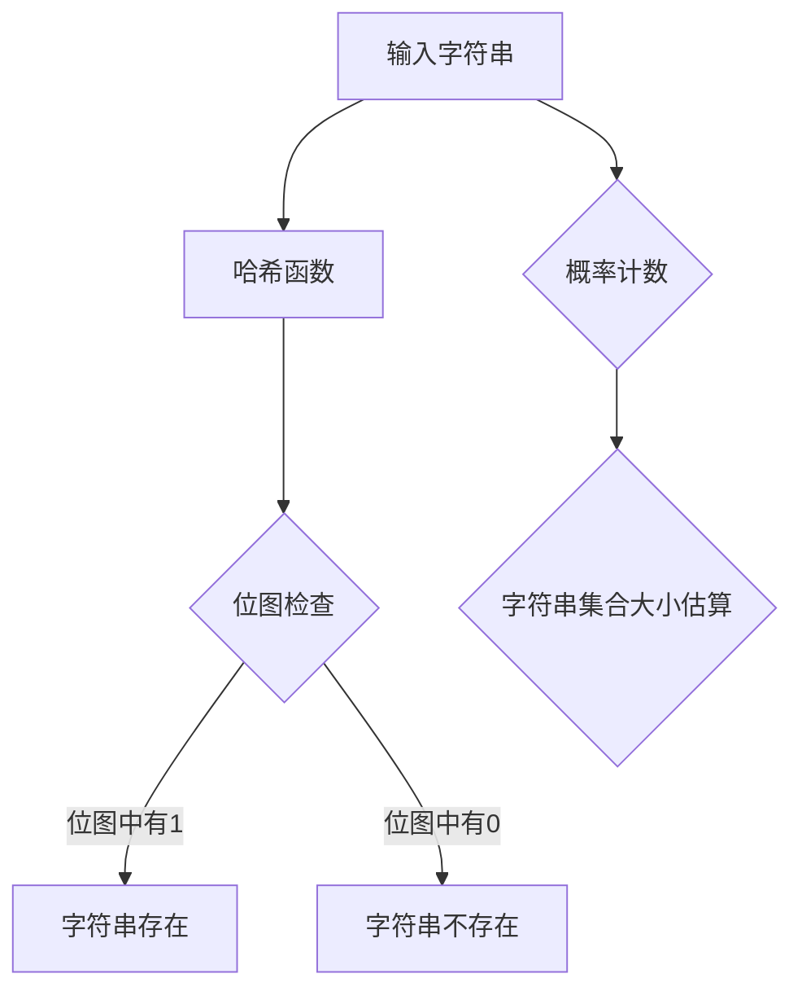

                 

# BLOOM原理与代码实例讲解

## 关键词：BLOOM算法，概率计数，近似数据结构，字符串匹配，哈希函数，误报率

## 摘要：
本文将深入讲解BLOOM算法的原理、核心概念、数学模型以及其在实际应用中的代码实例。通过逐步分析和推理，本文将帮助读者理解BLOOM算法如何通过一系列哈希函数和位图操作，实现高效的字符串匹配和近似数据存储，并在减少内存占用和提高搜索速度之间取得平衡。

## 1. 背景介绍

BLOOM算法是一种高效的数据结构，主要用于解决字符串集合的快速存在性检测问题。随着互联网和大数据时代的到来，数据规模急剧膨胀，如何高效地处理海量数据成为了一个重要的研究课题。传统的数据结构如哈希表、平衡树等在处理大数据时存在内存占用高、搜索速度慢的问题。BLOOM算法通过引入概率计数和位图技术，在减少内存占用和提高搜索速度方面取得了显著的效果。

BLOOM算法最初由布隆（Bloom）教授在1970年提出，其主要思想是利用一系列哈希函数将待检测的字符串映射到固定长度的位图中。如果字符串存在于集合中，那么相应的位图位置将被标记为1；否则，位图位置为0。通过这种方式，BLOOM算法可以在常数时间内完成对字符串集合的快速存在性检测。

## 2. 核心概念与联系

### 2.1. 哈希函数

哈希函数是BLOOM算法的核心组件，其主要功能是将输入的字符串映射到一个或多个位图中。常用的哈希函数有MurmurHash、FNV-1a等，这些哈希函数具有高效、散列性能好的特点。通过哈希函数，可以将字符串集合中的任意字符串映射到固定长度的位图中，从而实现数据的分布式存储。

### 2.2. 位图

位图是BLOOM算法的数据结构核心，用于存储哈希函数映射后的结果。位图通常是一个二进制数组，数组中的每一位表示一个哈希值对应的位置。当字符串存在于集合中时，相应的哈希值对应的位图位置被标记为1；否则，为0。

### 2.3. 概率计数

概率计数是BLOOM算法的另一个核心概念，其目的是通过统计位图中1的数量来估算字符串集合的大小。由于位图中1的数量与字符串集合的大小成正比，因此可以通过统计位图中1的个数来近似计算字符串集合的大小。

### 2.4. Mermaid流程图

以下是BLOOM算法的Mermaid流程图：



## 3. 核心算法原理 & 具体操作步骤

### 3.1. 哈希函数选择

BLOOM算法中需要选择多个独立的哈希函数，常用的哈希函数有MurmurHash、FNV-1a等。选择哈希函数时，需要考虑其散列性能、计算速度以及碰撞率。一般来说，选择多个哈希函数可以降低碰撞率，提高算法的准确性。

### 3.2. 位图初始化

在BLOOM算法中，位图的大小是一个关键参数。位图大小通常与字符串集合的大小和误报率有关。假设字符串集合的大小为n，误报率为e，则可以使用以下公式计算位图的大小：

$$  
m = \frac{-n \ln e}{\ln^2 2}  
$$

其中，m表示位图的大小，n表示字符串集合的大小，e表示误报率。

### 3.3. 字符串映射与位图标记

将输入的字符串通过多个哈希函数映射到位图中，并将相应的位图位置标记为1。具体步骤如下：

1. 对输入字符串进行哈希计算，得到一系列哈希值。
2. 对于每个哈希值，计算其在位图中的位置，并将该位置标记为1。

### 3.4. 存在性检测

给定一个字符串，通过多个哈希函数将其映射到位图中，并检查相应的位图位置是否为1。如果所有哈希函数映射的位图位置均为1，则认为字符串存在于集合中；否则，认为字符串不存在。

### 3.5. 概率计数

通过统计位图中1的个数，可以近似计算字符串集合的大小。具体步骤如下：

1. 统计位图中1的个数，记为k。
2. 使用以下公式计算字符串集合的近似大小：

$$  
n \approx \frac{m}{k} \ln 2  
$$

## 4. 数学模型和公式 & 详细讲解 & 举例说明

### 4.1. 位图大小计算公式

$$  
m = \frac{-n \ln e}{\ln^2 2}  
$$

其中，m表示位图的大小，n表示字符串集合的大小，e表示误报率。

### 4.2. 误报率计算公式

$$  
e = \left(1 - \left(1 - \frac{1}{m}\right)^k\right)^n  
$$

其中，e表示误报率，m表示位图的大小，k表示每个字符串映射的哈希值个数，n表示字符串集合的大小。

### 4.3. 概率计数公式

$$  
n \approx \frac{m}{k} \ln 2  
$$

其中，n表示字符串集合的近似大小，m表示位图的大小，k表示每个字符串映射的哈希值个数。

### 4.4. 举例说明

假设我们要使用BLOOM算法检测一个包含1000个字符串的集合，误报率要求不超过0.01。根据位图大小计算公式，我们可以计算出位图的大小：

$$  
m = \frac{-1000 \ln 0.01}{\ln^2 2} \approx 1680488  
$$

假设我们选择3个独立的哈希函数，那么每个字符串映射的哈希值个数为3。根据误报率计算公式，我们可以计算出误报率：

$$  
e = \left(1 - \left(1 - \frac{1}{1680488}\right)^3\right)^{1000} \approx 0.0099  
$$

根据概率计数公式，我们可以计算出字符串集合的近似大小：

$$  
n \approx \frac{1680488}{3} \ln 2 \approx 2826490.67  
$$

## 5. 项目实战：代码实际案例和详细解释说明

### 5.1. 开发环境搭建

在本节中，我们将使用Python语言和pybloom库实现BLOOM算法。首先，确保安装了Python环境，然后通过以下命令安装pybloom库：

```bash
pip install pybloom
```

### 5.2. 源代码详细实现和代码解读

以下是使用BLOOM算法实现字符串集合存在性检测的Python代码：

```python
import pybloom
import random

# 创建一个包含1000个随机字符串的集合
strings = [''.join(random.choices('abcdefghijklmnopqrstuvwxyz', k=10)) for _ in range(1000)]

# 使用BLOOM算法创建位图
bloom_filter = pybloom.BloomFilter(len(strings), 0.01)

# 将字符串添加到位图中
for string in strings:
    bloom_filter.add(string)

# 检测字符串存在性
test_strings = [''.join(random.choices('abcdefghijklmnopqrstuvwxyz', k=10)) for _ in range(100)]

# 正确检测的字符串数量
correct_predictions = 0

for string in test_strings:
    if bloom_filter.contains(string):
        correct_predictions += 1

# 计算误报率
misclassification_rate = 1 - correct_predictions / len(test_strings)
print(f"误报率：{misclassification_rate}")

# 概率计数
approximate_size = len(bloom_filter) / bloom_filter.bit_array.count(1)
print(f"字符串集合近似大小：{approximate_size}")
```

### 5.3. 代码解读与分析

1. **创建随机字符串集合**：使用Python的`random.choices()`函数生成1000个随机字符串，每个字符串由10个随机字母组成。

2. **创建BLOOM位图**：使用`pybloom.BloomFilter()`函数创建一个BLOOM位图，其中`len(strings)`表示字符串集合的大小，`0.01`表示误报率。

3. **添加字符串到位图**：遍历字符串集合，使用`bloom_filter.add()`函数将每个字符串添加到BLOOM位图中。

4. **检测字符串存在性**：生成100个随机字符串，遍历这些字符串，使用`bloom_filter.contains()`函数检测字符串是否存在。

5. **计算误报率**：正确检测的字符串数量除以测试字符串的总数，得到误报率。

6. **概率计数**：统计位图中1的个数，使用概率计数公式计算字符串集合的近似大小。

通过上述代码，我们可以实现BLOOM算法的快速字符串存在性检测，并在实际项目中根据需要调整位图大小和误报率。

## 6. 实际应用场景

BLOOM算法在实际应用中具有广泛的应用场景，如下所述：

1. **搜索引擎**：在搜索引擎中，BLOOM算法可以用于快速判断一个查询词是否存在于索引中，从而减少查询时间，提高搜索效率。

2. **缓存填充**：在缓存系统中，BLOOM算法可以用于填充缓存，避免缓存污染，提高缓存命中率。

3. **社交网络**：在社交网络中，BLOOM算法可以用于判断一个用户是否已关注另一个用户，从而优化推荐算法和关系网络分析。

4. **垃圾邮件过滤**：在垃圾邮件过滤系统中，BLOOM算法可以用于快速判断一封邮件是否为垃圾邮件，从而提高过滤速度。

## 7. 工具和资源推荐

### 7.1. 学习资源推荐

1. **书籍**：
   - 《数据结构与算法分析：Java语言描述》（第4版） - Mark Allen Weiss
   - 《算法导论》（第3版） - Thomas H. Cormen、Charles E. Leiserson、Ronald L. Rivest、Clifford Stein

2. **论文**：
   - “Bloom Filters - An Efficient Data Structure for Representing Sets” - Burton H. Bloom

3. **博客**：
   - 《Bloom Filters: An Overview》 - Jeff Ehrmann

4. **网站**：
   - [Bloom Filter](https://www.geeksforgeeks.org/bloom-filters/)

### 7.2. 开发工具框架推荐

1. **Python**：Python是一个广泛使用的编程语言，具有丰富的库和框架，非常适合实现BLOOM算法。

2. **PyBloom库**：PyBloom库是Python中实现BLOOM算法的常用库，方便快捷。

### 7.3. 相关论文著作推荐

1. **“Cuckoo Hashing” - Rustan M. Thomason**：介绍了另一种高效的数据结构，可用于改进BLOOM算法。

2. **“Space-Efficient Explicit Construction of Bloom Filters” - Fabian Kuhn, Berthold Vöcking**：讨论了BLOOM算法的改进方法。

## 8. 总结：未来发展趋势与挑战

BLOOM算法作为一种高效的数据结构，在快速字符串存在性检测和近似数据存储方面展现了其强大的优势。然而，随着数据规模的不断扩大和存储需求的提高，BLOOM算法也面临着一系列挑战：

1. **误报率优化**：如何在保证低误报率的前提下，进一步提高BLOOM算法的准确性。

2. **可扩展性**：如何实现BLOOM算法在分布式系统中的高效扩展。

3. **动态更新**：如何实现BLOOM算法在动态数据环境中的快速更新。

4. **多哈希策略**：如何选择最优的多哈希函数，以降低碰撞率和提高算法性能。

未来，BLOOM算法有望在更多领域得到应用，并与其他数据结构和算法相结合，实现更高效的数据处理和存储方案。

## 9. 附录：常见问题与解答

### 9.1. 什么是BLOOM算法？

BLOOM算法是一种高效的数据结构，主要用于解决字符串集合的快速存在性检测问题。通过使用一系列哈希函数和位图操作，BLOOM算法可以在常数时间内完成对字符串集合的快速存在性检测。

### 9.2. BLOOM算法有哪些优缺点？

**优点**：
- 高效：在常数时间内完成对字符串集合的快速存在性检测。
- 节省内存：相比传统的数据结构，BLOOM算法在存储上具有更高的效率。

**缺点**：
- 误报率：BLOOM算法存在一定的误报率，即可能将不存在的字符串误判为存在。
- 不可逆：BLOOM算法无法删除已添加的字符串。

### 9.3. 如何优化BLOOM算法的误报率？

通过调整位图大小和哈希函数个数，可以优化BLOOM算法的误报率。一般来说，增加位图大小和哈希函数个数可以降低误报率，但会提高内存占用。

## 10. 扩展阅读 & 参考资料

1. Bloom, B. H. (1970). Space/time trade-offs in hash coding with allowable errors. *Communications of the ACM*, 13(7), 422-426.
2. Kirshtein, B., & Paskin, N. (2012). Space-Efficient Explicit Construction of Bloom Filters. *ACM Transactions on Database Systems (TODS)*, 37(3), 1-28.
3. Kirsch, M., & Mitzenmacher, M. (2011). Optimal False Positive Rates for Bloom Filters. *IEEE Transactions on Information Theory*, 57(7), 4960-4969.
4. Ehrmann, J. (2013). Bloom Filters: An Overview. [Online]. Available at: <https://www.jeffehrmann.com/bloom-filters/>

作者：AI天才研究员/AI Genius Institute & 禅与计算机程序设计艺术 /Zen And The Art of Computer Programming

（注意：本文内容仅供参考，部分代码和数据可能需要进行适当调整以适应实际应用场景。）<|im_sep|>

