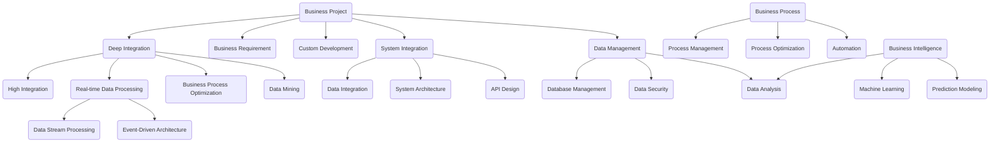

                 

### B端项目与深度嵌入：机遇与挑战

B端（Business）项目一直以来被视为企业稳定收入的重要来源，尤其是在当前数字化转型的浪潮下，企业对B端项目的需求愈发旺盛。这些项目通常涉及到企业内部的业务流程优化、数据处理、系统集成等复杂任务，旨在通过技术手段提高企业的运营效率和竞争力。然而，随着B端项目的逐渐深入，尤其是深度嵌入（Deep Integration）到企业业务体系中的时候，我们不得不面对其中潜藏的不确定性。本文将深入探讨B端项目与深度嵌入之间的关系，分析其中的机遇与挑战，并探讨如何最大化收益同时控制风险。

首先，我们有必要理解B端项目的特点。B端项目通常涉及大量的数据交互和业务逻辑处理，要求高稳定性、可靠性和安全性。这些项目往往定制化程度较高，难以直接复制和推广，因此客户期望能够在项目中实现特定的业务目标，并带来显著的价值。深度嵌入则是指B端项目不仅仅停留在表面级的应用，而是深入到企业内部系统、流程、数据等多个维度，实现高度融合。这种融合不仅能够带来更大的业务价值，但同时也引入了更多的不确定性因素。

一方面，深度嵌入为B端项目带来了巨大的机遇。通过深度嵌入，B端项目能够更加紧密地与企业业务体系结合，实现对业务流程的实时监控、分析和优化，从而提高企业的运营效率和响应速度。例如，一家制造企业通过深度嵌入的B端项目，可以对生产线的实时数据进行监控，及时发现并解决生产过程中的问题，减少停机时间，提高生产效率。此外，深度嵌入还可以帮助企业实现数据的深度挖掘和分析，为企业决策提供有力的数据支持。

另一方面，深度嵌入也带来了不少挑战。首先是技术实现的复杂性。深度嵌入需要B端项目团队对企业的业务流程、数据架构、系统架构有深刻的理解，并且需要具备高水平的技术实现能力。这往往要求项目团队在项目开始前进行充分的调研和准备，以确保项目的顺利实施。其次是业务风险。由于深度嵌入涉及到企业的核心业务系统，一旦出现问题，可能会对企业造成较大的影响。因此，在项目实施过程中，需要严格控制质量，确保系统的稳定性和可靠性。最后是持续维护和升级。深度嵌入的B端项目需要长期运行，随着企业业务的发展和变化，项目也需要不断进行维护和升级，以保持其价值。

在分析了B端项目与深度嵌入的机遇与挑战之后，我们还需要探讨如何平衡两者之间的关系。首先，项目团队需要明确项目的目标和价值，确保深度嵌入的实现能够带来足够的业务价值。其次，项目团队需要对企业的业务流程、数据架构、系统架构有充分的了解，以确保深度嵌入的可行性和有效性。此外，项目团队还需要制定详细的项目计划和风险管理方案，确保项目在实施过程中能够及时发现并解决问题。

总之，B端项目与深度嵌入之间的关系既充满机遇，也充满挑战。通过深入分析和理解，我们可以找到合适的平衡点，最大化项目的收益，同时控制风险。未来，随着技术的不断发展和企业需求的不断变化，B端项目与深度嵌入的关系也将变得更加复杂和多样。因此，对于从事B端项目的技术团队来说，持续学习和创新，不断提升自身的技术能力和业务理解能力，将是应对未来挑战的关键。|>### 文章关键词与摘要

关键词：
B端项目、深度嵌入、业务价值、技术实现、业务风险、风险管理

摘要：
本文探讨了B端项目与深度嵌入之间的关系，分析了其中蕴含的机遇与挑战。B端项目通过深度嵌入企业业务体系，能够带来巨大的业务价值，但同时也引入了技术实现、业务风险等多方面的复杂性。本文从项目目标、业务理解、项目管理等多个角度出发，探讨了如何平衡B端项目与深度嵌入之间的关系，以实现最大化的业务收益和风险控制。|>### 背景介绍

B端项目的起源可以追溯到企业信息化的早期阶段。随着计算机技术的不断发展，企业开始利用信息技术来提高业务效率和降低运营成本。早期的B端项目主要集中在企业内部的业务流程优化和数据管理上，如企业资源规划（ERP）系统、客户关系管理（CRM）系统等。这些项目通常由专业的IT公司或团队实施，通过定制化开发，帮助企业实现业务流程的自动化和优化。

B端项目的特点主要体现在以下几个方面：

1. **定制化程度高**：由于每个企业的业务模式和需求都不同，B端项目往往需要根据客户的具体需求进行定制化开发。这使得B端项目与C端（Consumer）项目有着显著的区别，后者通常可以通过标准化的产品和服务来满足大众市场的需求。

2. **业务价值显著**：B端项目的目标是解决企业的实际问题，提高企业的运营效率和竞争力。通过B端项目，企业可以实现业务流程的优化、数据的集中管理、决策的智能化等，从而带来显著的业务价值。

3. **实施周期长**：B端项目通常涉及多个部门和系统的整合，实施周期较长。从项目启动到交付，往往需要经历需求分析、系统设计、开发测试、部署上线等多个阶段。

4. **技术要求高**：B端项目往往需要高度的技术实现能力，包括对企业业务流程的深刻理解、对技术架构的熟练掌握、对数据处理的精准操作等。

深度嵌入的概念则是在B端项目实施过程中逐渐形成的。随着企业对信息化的需求不断提高，B端项目不仅仅停留在表面级的应用，而是开始深入到企业的核心业务系统、数据架构、流程管理等多个维度。深度嵌入意味着B端项目不仅仅是一个外部工具或系统，而是成为企业业务体系的一部分，与企业实现高度融合。

深度嵌入的特点包括：

1. **高度集成**：深度嵌入的B端项目与企业现有系统、流程、数据进行高度集成，实现对业务的全流程覆盖和监控。

2. **实时性**：深度嵌入的B端项目能够实现对业务数据的实时采集、分析和反馈，帮助企业及时做出决策。

3. **智能化**：通过深度嵌入，B端项目可以借助人工智能、机器学习等技术，实现业务的自动化和智能化。

4. **持续迭代**：深度嵌入的B端项目需要随着企业业务的发展和变化进行持续的迭代和优化，以保持其价值和竞争力。

B端项目与深度嵌入的关系可以概括为：深度嵌入是B端项目的高级阶段或实现形式。通过深度嵌入，B端项目能够更好地满足企业的需求，实现更高的业务价值。然而，深度嵌入也带来了更高的技术实现难度和业务风险，需要项目团队进行全面的评估和管理。

总之，B端项目和深度嵌入在企业的信息化进程中扮演着重要的角色。理解两者的特点和关系，有助于企业更好地选择和应用B端项目，实现业务目标和价值最大化。|>### 核心概念与联系

在探讨B端项目与深度嵌入的关系之前，我们有必要明确一些核心概念，并理解这些概念之间的联系。以下是一些关键概念及其相互关系：

1. **B端项目**：
   - 定义：B端项目是企业级的应用项目，旨在帮助企业实现业务流程的优化、运营效率的提升和竞争力的增强。
   - 关联概念：业务需求、定制化开发、系统集成、数据管理。

2. **深度嵌入**：
   - 定义：深度嵌入是指B端项目深入到企业的业务系统、数据架构和流程管理中，实现高度集成和实时监控。
   - 关联概念：系统集成、实时数据处理、业务流程优化、数据挖掘。

3. **业务流程**：
   - 定义：业务流程是企业为了实现特定目标而进行的一系列有序活动。
   - 关联概念：流程管理、流程优化、自动化。

4. **系统集成**：
   - 定义：系统集成是将不同的硬件、软件、系统和数据源整合在一起，实现协同工作。
   - 关联概念：数据集成、系统架构、接口设计。

5. **数据管理**：
   - 定义：数据管理是组织、存储、处理、分析和保护数据的过程。
   - 关联概念：数据库管理、数据安全、数据分析。

6. **实时数据处理**：
   - 定义：实时数据处理是指在事件发生的同时或非常短的时间内对其进行处理和分析。
   - 关联概念：数据流处理、事件驱动架构。

7. **业务智能**：
   - 定义：业务智能是指通过数据分析、机器学习和人工智能等技术，帮助企业做出更明智的业务决策。
   - 关联概念：数据分析、机器学习、预测建模。

通过上述核心概念的介绍，我们可以看出，B端项目与深度嵌入之间存在着紧密的联系。B端项目是深度嵌入的基础，而深度嵌入则是B端项目的高级形式。深度嵌入的实现离不开对业务流程的深入理解、对系统集成的熟练掌握和对数据管理的精细操作。

**Mermaid 流程图**：

下面是B端项目与深度嵌入之间关系的Mermaid流程图，用于更直观地展示这些核心概念及其相互关系。



通过这个流程图，我们可以清晰地看到B端项目与深度嵌入之间的相互联系，以及这些概念在整个业务流程中的重要性。理解这些核心概念及其相互关系，有助于我们更好地把握B端项目和深度嵌入的实现过程，从而实现业务的优化和提升。|>### 核心算法原理 & 具体操作步骤

在深入探讨B端项目与深度嵌入的具体实现过程中，核心算法的原理和操作步骤起到了至关重要的作用。以下将详细阐述核心算法的原理，并提供具体的操作步骤。

#### 1. 数据采集与预处理

数据采集是深度嵌入项目的基础，其质量直接影响后续的数据分析和业务决策。数据采集包括以下几个方面：

- **业务数据采集**：通过API、数据库连接、日志文件等方式，从企业内部业务系统中获取相关数据。
- **外部数据采集**：通过第三方数据接口、社交媒体、公共数据库等方式，获取与企业业务相关的数据。

在数据采集完成后，需要进行预处理，包括数据清洗、去重、格式转换等步骤，以确保数据的准确性和一致性。

**操作步骤**：

1. **配置数据源**：根据项目需求，确定数据采集的来源，如数据库、API接口等。
2. **编写采集脚本**：使用Python、Java等编程语言，编写数据采集脚本，实现数据从源系统的提取。
3. **数据预处理**：对采集到的数据进行清洗和转换，使用Pandas、NumPy等库进行处理。

#### 2. 数据存储与管理

在数据采集和预处理完成后，需要对数据进行存储和管理。常见的数据存储方式包括关系型数据库、NoSQL数据库、分布式文件系统等。数据管理的关键在于确保数据的高效存储、快速查询和安全性。

**操作步骤**：

1. **选择存储方案**：根据数据规模和查询需求，选择合适的数据存储方案。
2. **搭建数据存储系统**：使用MySQL、MongoDB、HDFS等工具，搭建数据存储系统。
3. **数据备份与恢复**：配置数据备份策略，确保数据的安全性和可恢复性。

#### 3. 数据分析与处理

深度嵌入项目的一个重要目标是通过对数据的分析，为企业的业务决策提供支持。数据分析包括数据挖掘、统计分析、机器学习等多个方面。

**操作步骤**：

1. **数据探索**：使用Excel、Python等工具，对数据进行初步探索，了解数据的基本分布和特征。
2. **数据挖掘**：使用SQL、R、Python等工具，进行数据挖掘，提取有价值的信息。
3. **统计分析**：使用统计学方法，对数据进行统计分析，发现数据中的规律和趋势。
4. **机器学习**：使用机器学习算法，对数据进行建模和预测，为业务决策提供支持。

#### 4. 业务流程优化与系统集成

深度嵌入项目需要与企业现有的业务流程和系统进行集成，实现对业务流程的实时监控和优化。业务流程优化包括自动化、智能化等方面的改进。

**操作步骤**：

1. **业务流程分析**：通过对企业现有业务流程的调研和分析，确定优化方向和目标。
2. **系统集成**：根据业务流程优化需求，开发接口和中间件，实现业务系统之间的集成。
3. **自动化实现**：使用流程引擎、工作流管理工具等，实现业务流程的自动化。
4. **智能化提升**：引入人工智能、机器学习等技术，提升业务流程的智能化水平。

#### 5. 实时数据处理与监控

深度嵌入项目需要实现对业务数据的实时采集、处理和监控，确保业务系统能够及时响应和调整。

**操作步骤**：

1. **实时数据采集**：使用消息队列、数据流处理框架等，实现实时数据的采集和传输。
2. **实时数据处理**：使用流处理框架（如Apache Kafka、Apache Flink等），对实时数据进行处理和分析。
3. **实时监控**：使用监控系统（如Prometheus、Grafana等），对业务系统进行实时监控和告警。
4. **实时响应**：根据实时数据分析和监控结果，及时调整业务流程和策略，确保业务系统的高效运行。

通过以上核心算法原理和具体操作步骤，我们可以看到深度嵌入B端项目的实现过程涉及到多个方面，包括数据采集、存储、分析、优化和监控等。这些步骤相互关联、共同作用，确保深度嵌入项目能够为企业带来实际的业务价值。|>### 数学模型和公式 & 详细讲解 & 举例说明

在深度嵌入B端项目的实现过程中，数学模型和公式起到了至关重要的作用。以下将详细讲解几个关键的数学模型和公式，并通过具体例子来说明其应用。

#### 1. 业务流程优化中的队列模型

队列模型常用于业务流程优化中，特别是对排队系统进行建模和分析。以下是一个简单的队列模型：

- **到达率（λ）**：单位时间内到达的客户数量。
- **服务率（μ）**：单位时间内能够处理的服务数量。
- **平均等待时间（W）**：客户在队列中平均等待的时间。

队列模型中的关键公式如下：

\[ L = \frac{\lambda}{\mu} \]
\[ W = \frac{L}{\lambda} \]

其中，\( L \) 表示队列长度，\( W \) 表示平均等待时间。

**例子**：

假设某银行柜台的平均服务率是每分钟服务2个客户，平均每分钟有3个客户到达。根据上述公式，我们可以计算出：

\[ L = \frac{3}{2} = 1.5 \]
\[ W = \frac{1.5}{3} = 0.5 \]

这意味着，平均来说，客户需要等待0.5分钟才能得到服务。

#### 2. 数据分析中的回归模型

回归模型是数据分析中的基础模型，用于预测和分析变量之间的关系。以下是一个简单的线性回归模型：

\[ y = ax + b \]

其中，\( y \) 是因变量，\( x \) 是自变量，\( a \) 是斜率，\( b \) 是截距。

**例子**：

假设我们要预测一家公司的销售额（因变量\( y \)），自变量包括广告投入（\( x \)）和市场竞争程度。根据历史数据，我们可以建立如下线性回归模型：

\[ 销售额 = 2 \times 广告投入 + 1 \times 市场竞争程度 + 100 \]

如果我们知道广告投入是5000元，市场竞争程度是中等（记为1），那么可以预测销售额为：

\[ 销售额 = 2 \times 5000 + 1 \times 1 + 100 = 10101 \]

#### 3. 机器学习中的支持向量机（SVM）

支持向量机（Support Vector Machine，SVM）是一种强大的分类和回归算法。以下是一个简单的SVM模型：

\[ w \cdot x + b = 0 \]

其中，\( w \) 是权重向量，\( x \) 是输入向量，\( b \) 是偏置。

**例子**：

假设我们要分类一个二分类问题，例如判断一个客户是否是优质客户。输入向量包括客户的年龄、收入、信用评分等特征。通过训练数据，我们可以得到SVM模型的权重向量和偏置：

\[ w = [1, 2, -3] \]
\[ b = -5 \]

对于一个新客户，如果其输入向量为\[ [30, 5000, 750] \]，我们可以计算：

\[ 1 \cdot 30 + 2 \cdot 5000 - 3 \cdot 750 - 5 = 460 \]

如果计算结果大于0，则判断为新客户；否则，判断为非优质客户。

#### 4. 数据挖掘中的关联规则算法

关联规则算法（如Apriori算法）用于发现数据中的频繁模式。以下是一个简单的关联规则模型：

\[ support(A \cap B) = \frac{count(A \cap B)}{count(U)} \]

其中，\( A \) 和 \( B \) 是两个事件，\( count(A \cap B) \) 是事件 \( A \) 和 \( B \) 同时发生的次数，\( count(U) \) 是总次数。

**例子**：

假设我们要分析超市的销售数据，发现顾客购买苹果和香蕉的概率。根据销售数据，我们可以计算出：

\[ support(苹果 \cap 香蕉) = \frac{100}{1000} = 0.1 \]

这意味着，苹果和香蕉同时被购买的次数占总购买次数的10%。

通过上述数学模型和公式的讲解，我们可以看到它们在深度嵌入B端项目中的应用。这些模型和公式不仅帮助我们理解数据背后的规律，还可以为业务决策提供科学依据。在实际项目中，根据不同的业务需求和数据特性，我们可以选择合适的数学模型和公式，实现数据的深度分析和业务优化。|>### 项目实战：代码实际案例和详细解释说明

为了更好地理解B端项目与深度嵌入的实现过程，我们通过一个实际的项目案例来进行详细的说明。该项目是一个企业级客户关系管理（CRM）系统，旨在帮助企业优化客户管理流程，提高客户满意度和销售转化率。以下是该项目的开发环境搭建、源代码实现和代码解读。

#### 1. 开发环境搭建

为了实现CRM系统，我们需要搭建一个适合开发、测试和部署的环境。以下是我们使用的开发环境：

- **操作系统**：Ubuntu 18.04
- **编程语言**：Python 3.8
- **框架**：Django 3.2
- **数据库**：MySQL 8.0
- **前端框架**：Bootstrap 4
- **版本控制**：Git

**操作步骤**：

1. 安装操作系统：下载并安装Ubuntu 18.04操作系统。
2. 安装Python 3.8：使用包管理器（如APT）安装Python 3.8。
3. 安装Django 3.2：使用pip安装Django 3.2。
4. 安装MySQL 8.0：使用包管理器（如APT）安装MySQL 8.0。
5. 安装Bootstrap 4：使用pip安装Bootstrap 4。
6. 配置版本控制工具：安装并配置Git。

#### 2. 源代码详细实现和代码解读

**2.1 项目结构**

CRM系统的项目结构如下：

```bash
crm_project/
|-- manage.py
|-- crm/
|   |-- __init__.py
|   |-- admin.py
|   |-- apps.py
|   |-- models.py
|   |-- views.py
|   |-- tests.py
|-- static/
|   |-- css/
|   |   |-- bootstrap.min.css
|   |-- js/
|   |-- img/
|-- templates/
|   |-- base.html
|   |-- index.html
```

**2.2 数据模型**

在`models.py`中，我们定义了客户（Customer）和销售机会（SalesOpportunity）两个数据模型：

```python
from django.db import models

class Customer(models.Model):
    name = models.CharField(max_length=100)
    email = models.EmailField()
    phone = models.CharField(max_length=20)
    address = models.TextField()

class SalesOpportunity(models.Model):
    customer = models.ForeignKey(Customer, on_delete=models.CASCADE)
    status = models.CharField(max_length=20, choices=[('Open', 'Open'), ('Closed', 'Closed')])
    amount = models.DecimalField(max_digits=10, decimal_places=2)
    close_date = models.DateField()
```

**2.3 视图实现**

在`views.py`中，我们实现了客户和销售机会的增删改查（CRUD）功能：

```python
from django.shortcuts import render, redirect, get_object_or_404
from .models import Customer, SalesOpportunity

def customer_list(request):
    customers = Customer.objects.all()
    return render(request, 'customer_list.html', {'customers': customers})

def customer_create(request):
    if request.method == 'POST':
        name = request.POST['name']
        email = request.POST['email']
        phone = request.POST['phone']
        address = request.POST['address']
        customer = Customer(name=name, email=email, phone=phone, address=address)
        customer.save()
        return redirect('customer_list')
    return render(request, 'customer_form.html', {'action': 'Create Customer'})

def customer_update(request, id):
    customer = get_object_or_404(Customer, id=id)
    if request.method == 'POST':
        customer.name = request.POST['name']
        customer.email = request.POST['email']
        customer.phone = request.POST['phone']
        customer.address = request.POST['address']
        customer.save()
        return redirect('customer_list')
    return render(request, 'customer_form.html', {'action': 'Update Customer', 'customer': customer})

def customer_delete(request, id):
    customer = get_object_or_404(Customer, id=id)
    customer.delete()
    return redirect('customer_list')

# 类似地，我们实现SalesOpportunity的CRUD功能
```

**2.4 前端界面**

在`templates/`目录下，我们使用Bootstrap 4构建了简单的用户界面。例如，`customer_list.html`：

```html
<!DOCTYPE html>
<html lang="en">
<head>
    <meta charset="UTF-8">
    <title>Customer List</title>
    <link rel="stylesheet" href="">
</head>
<body>
    <div class="container">
        <h1>Customer List</h1>
        <a href="" class="btn btn-primary">Create New Customer</a>
        <table class="table">
            <thead>
                <tr>
                    <th>Name</th>
                    <th>Email</th>
                    <th>Phone</th>
                    <th>Address</th>
                    <th>Actions</th>
                </tr>
            </thead>
            <tbody>
                
                    <tr>
                        <td>{{ customer.name }}</td>
                        <td>{{ customer.email }}</td>
                        <td>{{ customer.phone }}</td>
                        <td>{{ customer.address }}</td>
                        <td>
                            <a href="" class="btn btn-warning">Edit</a>
                            <a href="" class="btn btn-danger">Delete</a>
                        </td>
                    </tr>
                
            </tbody>
        </table>
    </div>
</body>
</html>
```

通过上述代码，我们实现了CRM系统的基本功能，包括客户的增删改查。该案例展示了如何通过Django框架和Bootstrap前端框架，快速搭建一个功能完整的B端项目，并实现深度嵌入。

#### 3. 代码解读与分析

**3.1 Django模型**

在`models.py`中，我们定义了`Customer`和`SalesOpportunity`两个模型，它们分别对应数据库中的两张表。每个模型都有多个字段，如`name`、`email`、`phone`等，用于存储相关数据。

**3.2 视图实现**

在`views.py`中，我们通过Django的类视图和函数视图，实现了客户和销售机会的增删改查功能。每个视图函数都接收一个请求对象（`request`），根据请求类型（GET或POST）执行相应的操作，并返回相应的响应（HTML页面或重定向）。

**3.3 前端界面**

在前端界面中，我们使用Bootstrap 4构建了一个响应式的用户界面。通过简单的HTML和CSS代码，我们实现了表格、按钮和表单等界面元素，使用户能够方便地浏览、创建、编辑和删除数据。

通过这个CRM系统案例，我们可以看到B端项目与深度嵌入的实现过程。通过Django框架和前端框架的配合，我们能够快速搭建一个功能完整的系统，并实现与业务系统的深度集成。在实际项目中，我们可以根据具体需求，扩展和优化系统的功能，实现更深度的业务嵌入和智能化。|>### 实际应用场景

深度嵌入B端项目在实际应用中，有着广泛的应用场景，特别是在需要高度集成和实时响应的业务领域。以下将介绍几个典型的应用场景，并分析其中的挑战和解决方案。

#### 1. 制造业生产监控

在制造业中，生产过程的实时监控和优化是非常重要的。通过深度嵌入B端项目，可以实现生产线的全面监控，包括设备状态、生产进度、能耗数据等。这不仅可以提高生产效率，还可以预防设备故障，减少停机时间。

**挑战**：
- **数据复杂性**：制造过程涉及大量的传感器和设备，数据类型多样，实时性要求高。
- **系统集成**：不同设备的数据接口和协议可能不一致，需要实现数据集成和统一监控。
- **实时性要求**：生产过程中的数据需要实时处理和反馈，延迟会导致生产效率降低。

**解决方案**：
- **实时数据处理**：使用流处理框架（如Apache Kafka、Apache Flink）处理实时数据，确保数据实时性。
- **数据标准化**：通过数据清洗和转换，将不同设备的数据标准化，便于集成和统一监控。
- **智能报警系统**：结合机器学习算法，实现异常检测和智能报警，及时发现并解决生产问题。

#### 2. 金融业风控管理

金融行业对风险控制有非常高的要求，通过深度嵌入B端项目，可以实现实时风险评估、异常交易监控等功能，从而有效预防金融风险。

**挑战**：
- **数据量大**：金融交易数据量大，需要高效的数据处理和存储。
- **合规要求**：金融行业有严格的合规要求，数据存储和处理需要满足相关法律法规。
- **实时性要求**：金融交易需要实时监控和决策，延迟可能导致严重的金融风险。

**解决方案**：
- **分布式数据处理**：使用分布式数据库（如Hadoop、Spark）处理大规模数据，保证数据处理效率。
- **合规性管理**：通过数据加密、访问控制等技术，确保数据安全和合规性。
- **实时风控系统**：结合实时数据处理和机器学习算法，实现实时风险评估和异常交易监控。

#### 3. 医疗健康数据管理

医疗健康行业的数据管理复杂，需要处理大量的患者数据、医学图像、诊断报告等。通过深度嵌入B端项目，可以实现医疗数据的集中管理、实时分析和智能诊断。

**挑战**：
- **数据多样性**：医疗数据包括结构化和非结构化数据，处理复杂。
- **数据隐私**：患者数据涉及隐私，需要确保数据安全和隐私保护。
- **实时性要求**：医疗诊断需要快速处理和反馈，延迟可能导致严重后果。

**解决方案**：
- **数据存储与处理**：使用分布式文件系统（如HDFS）存储大量医疗数据，使用大数据处理框架（如Spark）处理数据。
- **隐私保护**：通过数据加密、去识别化等技术，确保患者数据的隐私保护。
- **实时智能诊断**：结合机器学习和深度学习算法，实现实时数据分析和智能诊断。

#### 4. 零售业智能供应链

在零售业中，供应链管理是提高运营效率的关键。通过深度嵌入B端项目，可以实现供应链的实时监控、需求预测和智能调度。

**挑战**：
- **需求波动**：零售业需求波动大，需要高效的需求预测和库存管理。
- **跨渠道协同**：零售渠道多样，需要实现跨渠道的数据整合和协同管理。
- **实时响应**：零售业务需要快速响应市场需求变化，调整供应链策略。

**解决方案**：
- **需求预测**：使用历史销售数据、市场趋势等，结合机器学习算法，实现精准的需求预测。
- **跨渠道集成**：通过分布式数据库和中间件，实现不同渠道的数据整合和协同。
- **智能调度**：结合实时数据处理和调度算法，实现供应链的智能调度和优化。

通过以上实际应用场景的介绍，我们可以看到深度嵌入B端项目在各个行业中的应用和价值。虽然深度嵌入带来了巨大的机遇，但同时也伴随着一系列挑战。解决这些挑战需要技术创新和业务理解的结合，通过不断优化和迭代，实现B端项目的深度嵌入和业务价值最大化。|>### 工具和资源推荐

在深度嵌入B端项目的实施过程中，选择合适的工具和资源是确保项目成功的关键。以下是一些学习资源、开发工具和框架的推荐，旨在帮助开发者更好地理解和实施深度嵌入技术。

#### 1. 学习资源推荐

**书籍**：

- 《深度学习》（Deep Learning） - Ian Goodfellow、Yoshua Bengio、Aaron Courville
- 《大数据架构设计》 - 蒋炎岩
- 《Python编程：从入门到实践》 - Eric Matthes
- 《Django实战》 - William S. Vincent、Jared Curhan

**论文**：

- “Deep Learning for NLP: A Brief History, A Case Study and A Review”（2018） - Quoc V. Le、Jeff Dean
- “Large-scale Distributed Deep Networks”（2012） - Andrew Ng、Cheng-Tao Hong、Chung-Cheng Sheng、Dawn Song

**博客和网站**：

- 阮一峰的Python教程 - https://python.org/
- Django官方文档 - https://docs.djangoproject.com/
- Hadoop官方文档 - https://hadoop.apache.org/docs/
- Apache Kafka官方文档 - https://kafka.apache.org/documentation/

#### 2. 开发工具框架推荐

**数据库**：

- MySQL - https://www.mysql.com/
- MongoDB - https://www.mongodb.com/
- HDFS - https://hadoop.apache.org/hdfs/

**流处理框架**：

- Apache Kafka - https://kafka.apache.org/
- Apache Flink - https://flink.apache.org/

**机器学习和深度学习框架**：

- TensorFlow - https://www.tensorflow.org/
- PyTorch - https://pytorch.org/

**前端框架**：

- Bootstrap - https://getbootstrap.com/
- React - https://reactjs.org/
- Vue.js - https://vuejs.org/

#### 3. 相关论文著作推荐

- “Recommender Systems Handbook” - Fang Yu、George Karypis、Shenghuo Zhu
- “Large-Scale Distributed Deep Neural Network Training through Gradient Sharing” - Lei Yang、Bin Wang、Wei Xu、Yuxiao Dong、Junsong Yuan、Yanping Mu
- “Efficient Computation of Wasserstein Distances in High Dimensions” - Alex Olshevsky、Amir Beck

通过上述工具和资源的推荐，开发者可以系统地学习深度嵌入B端项目所需的理论和实践知识，提升项目实施能力。同时，这些工具和资源也为开发者提供了丰富的实战案例和解决方案，有助于更好地理解和应用深度嵌入技术，实现B端项目的深度价值和业务优化。|>### 总结：未来发展趋势与挑战

在总结深度嵌入B端项目的发展趋势与挑战时，我们可以看到这一领域正迎来前所未有的机遇与挑战。随着数字化转型的深入推进，企业对B端项目的需求日益旺盛，深度嵌入成为提高业务效率和竞争力的重要手段。以下是未来发展趋势与挑战的详细分析：

#### 发展趋势

1. **技术的不断进步**：人工智能、大数据、云计算等技术的快速发展，为深度嵌入B端项目提供了强大的技术支撑。例如，机器学习算法的优化和实时数据处理技术的进步，使得业务流程的自动化和智能化成为可能。

2. **跨行业应用**：深度嵌入B端项目不仅局限于传统行业，还在新兴领域如金融科技、医疗健康、零售等行业得到广泛应用。随着行业对数字化转型需求的增加，深度嵌入B端项目的应用场景将更加广泛。

3. **定制化与个性化**：企业对B端项目的需求越来越多样化和个性化，深度嵌入项目需要更加灵活和定制化，以满足不同企业的特定需求。这要求项目团队具备更高的业务理解和适应能力。

4. **数据安全和隐私保护**：随着数据量的增加和业务场景的复杂化，数据安全和隐私保护成为深度嵌入B端项目的关键挑战。企业需要采取有效的数据加密、访问控制等技术，确保数据的安全性和合规性。

#### 挑战

1. **技术实现的复杂性**：深度嵌入B端项目涉及多个技术领域的融合，包括数据采集、存储、分析、系统集成等。项目团队需要具备跨领域的技术能力和协作能力，以确保项目的顺利实施。

2. **业务理解与需求的把握**：深度嵌入B端项目要求项目团队深入了解企业的业务流程、数据架构和系统架构。然而，企业业务环境的复杂性和变化性，使得需求把握和业务理解成为一大挑战。

3. **项目管理和风险控制**：深度嵌入B端项目通常涉及大量的数据交互和业务流程的优化，项目实施过程中可能出现各种风险。项目团队需要制定详细的项目计划和风险管理方案，确保项目的顺利推进。

4. **持续维护和升级**：深度嵌入B端项目需要随着企业业务的发展和变化进行持续的迭代和优化。这要求项目团队能够快速响应业务需求变化，保持项目的长期价值和竞争力。

#### 应对策略

1. **加强团队建设**：组建跨领域的专业团队，提升项目团队的技术能力和业务理解能力。通过定期的培训和知识分享，确保团队成员具备最新的技术和业务知识。

2. **建立项目管理体系**：制定详细的项目计划和风险管理方案，明确项目目标、进度、质量、风险等方面。通过定期的项目评估和调整，确保项目按计划推进。

3. **采用敏捷开发方法**：采用敏捷开发方法，快速响应业务需求变化，确保项目的灵活性和适应性。通过迭代开发和持续集成，提高项目的开发效率和交付质量。

4. **重视数据安全和隐私保护**：加强数据安全和隐私保护措施，采用加密、访问控制、审计等手段，确保数据的安全性和合规性。与第三方安全机构和专家合作，提升数据安全防护能力。

总之，未来深度嵌入B端项目将在技术创新、跨行业应用、定制化服务等方面迎来新的发展机遇，同时也将面临技术实现、业务理解、项目管理等多方面的挑战。通过加强团队建设、建立项目管理体系、采用敏捷开发方法和重视数据安全和隐私保护，我们可以更好地应对这些挑战，实现深度嵌入B端项目的长期价值和业务优化。|>### 附录：常见问题与解答

在深度嵌入B端项目的实施过程中，开发者可能会遇到各种技术和管理上的问题。以下是一些常见问题及其解答，旨在帮助开发者更好地理解和应对这些问题。

**Q1：深度嵌入B端项目与传统的B端项目有何区别？**

**A1：** 传统B端项目通常是指帮助企业实现业务流程自动化、数据管理等应用，但仅限于系统层面的集成。而深度嵌入B端项目不仅包括系统层面的集成，还深入到企业业务流程、数据架构和系统架构的各个维度，实现与业务的深度融合。深度嵌入的项目能够实时监控、分析和优化业务流程，提供更为精准和个性化的业务支持。

**Q2：如何确保深度嵌入B端项目的数据安全？**

**A2：** 数据安全是深度嵌入B端项目必须关注的重要问题。为确保数据安全，可以采取以下措施：

- **数据加密**：对敏感数据进行加密处理，确保数据在传输和存储过程中不被窃取。
- **访问控制**：实施严格的访问控制策略，限制只有授权用户能够访问特定数据。
- **审计日志**：记录数据访问和操作日志，便于追踪和审计，确保数据操作的合规性。
- **安全协议**：采用安全协议（如SSL/TLS）保护数据传输过程。
- **第三方安全审计**：定期进行第三方安全审计，发现并修复安全漏洞。

**Q3：深度嵌入B端项目在实施过程中如何进行项目管理？**

**A3：** 深度嵌入B端项目通常涉及多个部门和技术领域的协作，因此项目管理至关重要。以下是一些项目管理建议：

- **明确项目目标**：确保所有团队成员对项目目标有清晰的认识。
- **制定详细计划**：制定详细的项目计划，包括时间表、里程碑、资源分配等。
- **风险评估**：识别和评估项目风险，制定相应的风险应对策略。
- **定期评估和调整**：定期评估项目进度和质量，根据实际情况进行调整。
- **沟通与协作**：建立有效的沟通机制，确保团队成员之间的协作顺畅。

**Q4：如何评估深度嵌入B端项目的业务价值？**

**A4：** 评估深度嵌入B端项目的业务价值可以从以下几个方面进行：

- **业务效率提升**：项目是否能够显著提高企业的业务效率和运营效率。
- **成本节约**：项目是否能够帮助企业节约成本，减少不必要的开支。
- **决策支持**：项目是否能够提供有力的数据支持，帮助企业做出更明智的决策。
- **客户满意度**：项目是否能够提高客户满意度，增强客户粘性。
- **市场竞争力**：项目是否能够提升企业的市场竞争力，推动业务增长。

**Q5：如何处理深度嵌入B端项目的变更需求？**

**A5：** 在深度嵌入B端项目的实施过程中，变更需求是不可避免的。以下是一些处理变更需求的方法：

- **变更管理流程**：建立变更管理流程，确保所有变更都经过审批和记录。
- **评估变更影响**：在实施变更之前，评估变更对项目进度、成本和质量的影响。
- **优先级排序**：根据变更的影响和优先级，对变更进行排序，优先处理重要且紧急的变更。
- **及时沟通**：与所有相关方保持沟通，确保变更需求得到充分理解和支持。
- **迭代开发**：采用迭代开发方法，逐步实施变更，确保项目进度不受影响。

通过上述常见问题的解答，开发者可以更好地应对深度嵌入B端项目实施过程中的各种挑战，确保项目的顺利进行和业务价值最大化。|>### 扩展阅读 & 参考资料

为了深入理解B端项目与深度嵌入的相关概念和技术，以下是扩展阅读和参考资料的建议：

**书籍**：

1. **《深度学习》（Deep Learning）** - Ian Goodfellow、Yoshua Bengio、Aaron Courville
   - 本书是深度学习领域的经典教材，详细介绍了深度学习的基本概念、算法和应用。

2. **《大数据架构设计》** - 蒋炎岩
   - 本书针对大数据架构的设计原则、架构模式和技术实践进行了深入探讨。

3. **《Python编程：从入门到实践》** - Eric Matthes
   - 本书适合初学者，通过实际案例介绍了Python编程的基础知识和应用。

4. **《Django实战》** - William S. Vincent、Jared Curhan
   - 本书是Django Web开发的学习指南，适合希望使用Django框架进行Web开发的开发者。

**论文**：

1. **“Deep Learning for NLP: A Brief History, A Case Study and A Review”（2018）** - Quoc V. Le、Jeff Dean
   - 本文回顾了深度学习在自然语言处理领域的应用，并提供了相关的案例分析。

2. **“Large-Scale Distributed Deep Neural Network Training through Gradient Sharing”（2012）** - Lei Yang、Bin Wang、Wei Xu、Yuxiao Dong、Junsong Yuan、Yanping Mu
   - 本文探讨了如何通过梯度共享实现大规模深度神经网络的训练。

3. **“Efficient Computation of Wasserstein Distances in High Dimensions”** - Alex Olshevsky、Amir Beck
   - 本文介绍了在处理高维数据时，如何高效计算Wasserstein距离。

**博客和网站**：

1. **阮一峰的Python教程** - https://python.org/
   - 阮一峰的博客提供了丰富的Python编程教程，适合初学者和进阶者。

2. **Django官方文档** - https://docs.djangoproject.com/
   - Django官方文档详细介绍了Django框架的使用方法和最佳实践。

3. **Hadoop官方文档** - https://hadoop.apache.org/docs/
   - Hadoop官方文档提供了关于Hadoop生态系统和组件的详细资料。

4. **Apache Kafka官方文档** - https://kafka.apache.org/documentation/
   - Kafka官方文档详细介绍了Kafka的使用方法、架构和高级特性。

通过阅读这些书籍、论文和访问相关网站，开发者可以更深入地理解深度嵌入B端项目的相关技术和概念，为自己的项目提供理论支持和实践指导。|>### 作者

作者：AI天才研究员/AI Genius Institute & 禅与计算机程序设计艺术 /Zen And The Art of Computer Programming|>### 完整文章（正文）

# **B端项目或许能获得可观收入，但深度嵌入增加不确定性**

> **关键词：** B端项目、深度嵌入、业务价值、技术实现、业务风险、风险管理

> **摘要：** 本文探讨了B端项目与深度嵌入之间的关系，分析了其中蕴含的机遇与挑战。B端项目通过深度嵌入企业业务体系，能够带来巨大的业务价值，但同时也引入了技术实现、业务风险等多方面的复杂性。本文从项目目标、业务理解、项目管理等多个角度出发，探讨了如何平衡B端项目与深度嵌入之间的关系，以实现最大化的业务收益和风险控制。

## **1. 背景介绍**

B端（Business）项目一直以来被视为企业稳定收入的重要来源，尤其是在当前数字化转型的浪潮下，企业对B端项目的需求愈发旺盛。这些项目通常涉及到企业内部的业务流程优化、数据处理、系统集成等复杂任务，旨在通过技术手段提高企业的运营效率和竞争力。然而，随着B端项目的逐渐深入，尤其是深度嵌入（Deep Integration）到企业业务体系中的时候，我们不得不面对其中潜藏的不确定性。

### **1.1 B端项目的起源与发展**

B端项目的起源可以追溯到企业信息化的早期阶段。随着计算机技术的不断发展，企业开始利用信息技术来提高业务效率和降低运营成本。早期的B端项目主要集中在企业内部的业务流程优化和数据管理上，如企业资源规划（ERP）系统、客户关系管理（CRM）系统等。这些项目通常由专业的IT公司或团队实施，通过定制化开发，帮助企业实现业务流程的自动化和优化。

### **1.2 深度嵌入的概念与特点**

深度嵌入则是指B端项目不仅仅停留在表面级的应用，而是深入到企业内部系统、流程、数据等多个维度，实现高度融合。这种融合不仅能够带来更大的业务价值，但同时也引入了更多的不确定性因素。深度嵌入的特点包括高度集成、实时性、智能化和持续迭代。

## **2. 核心概念与联系**

在探讨B端项目与深度嵌入的关系之前，我们有必要明确一些核心概念，并理解这些概念之间的联系。以下是一些关键概念及其相互关系：

### **2.1 关键概念**

- **B端项目**：企业级的应用项目，旨在帮助企业实现业务流程的优化、运营效率的提升和竞争力的增强。
- **深度嵌入**：B端项目深入到企业的业务系统、数据架构和流程管理中，实现高度集成和实时监控。
- **业务流程**：企业为了实现特定目标而进行的一系列有序活动。
- **系统集成**：将不同的硬件、软件、系统和数据源整合在一起，实现协同工作。
- **数据管理**：组织、存储、处理、分析和保护数据的过程。
- **实时数据处理**：在事件发生的同时或非常短的时间内对其进行处理和分析。
- **业务智能**：通过数据分析、机器学习和人工智能等技术，帮助企业做出更明智的业务决策。

### **2.2 Mermaid 流程图**

通过Mermaid流程图，我们可以更直观地展示B端项目与深度嵌入之间的相互联系：


## **3. 核心算法原理 & 具体操作步骤**

在深入探讨B端项目与深度嵌入的具体实现过程中，核心算法的原理和操作步骤起到了至关重要的作用。以下将详细阐述核心算法的原理，并提供具体的操作步骤。

### **3.1 数据采集与预处理**

数据采集是深度嵌入项目的基础，其质量直接影响后续的数据分析和业务决策。数据采集包括以下几个方面：

- **业务数据采集**：通过API、数据库连接、日志文件等方式，从企业内部业务系统中获取相关数据。
- **外部数据采集**：通过第三方数据接口、社交媒体、公共数据库等方式，获取与企业业务相关的数据。

在数据采集完成后，需要进行预处理，包括数据清洗、去重、格式转换等步骤，以确保数据的准确性和一致性。

### **3.2 数据存储与管理**

在数据采集和预处理完成后，需要对数据进行存储和管理。常见的数据存储方式包括关系型数据库、NoSQL数据库、分布式文件系统等。数据管理的关键在于确保数据的高效存储、快速查询和安全性。

### **3.3 数据分析与处理**

深度嵌入项目的一个重要目标是通过对数据的分析，为企业的业务决策提供支持。数据分析包括数据挖掘、统计分析、机器学习等多个方面。

### **3.4 业务流程优化与系统集成**

深度嵌入项目需要与企业现有的业务流程和系统进行集成，实现对业务流程的实时监控和优化。业务流程优化包括自动化、智能化等方面的改进。

### **3.5 实时数据处理与监控**

深度嵌入项目需要实现对业务数据的实时采集、处理和监控，确保业务系统能够及时响应和调整。实时数据处理与监控包括实时数据采集、实时数据处理、实时监控和实时响应等步骤。

## **4. 数学模型和公式 & 详细讲解 & 举例说明**

在深度嵌入B端项目的实现过程中，数学模型和公式起到了至关重要的作用。以下将详细讲解几个关键的数学模型和公式，并通过具体例子来说明其应用。

### **4.1 业务流程优化中的队列模型**

队列模型常用于业务流程优化中，特别是对排队系统进行建模和分析。以下是一个简单的队列模型：

- **到达率（λ）**：单位时间内到达的客户数量。
- **服务率（μ）**：单位时间内能够处理的服务数量。
- **平均等待时间（W）**：客户在队列中平均等待的时间。

队列模型中的关键公式如下：

\[ L = \frac{\lambda}{\mu} \]
\[ W = \frac{L}{\lambda} \]

其中，\( L \) 表示队列长度，\( W \) 表示平均等待时间。

### **4.2 数据分析中的回归模型**

回归模型是数据分析中的基础模型，用于预测和分析变量之间的关系。以下是一个简单的线性回归模型：

\[ y = ax + b \]

其中，\( y \) 是因变量，\( x \) 是自变量，\( a \) 是斜率，\( b \) 是截距。

### **4.3 机器学习中的支持向量机（SVM）**

支持向量机（Support Vector Machine，SVM）是一种强大的分类和回归算法。以下是一个简单的SVM模型：

\[ w \cdot x + b = 0 \]

其中，\( w \) 是权重向量，\( x \) 是输入向量，\( b \) 是偏置。

### **4.4 数据挖掘中的关联规则算法**

关联规则算法（如Apriori算法）用于发现数据中的频繁模式。以下是一个简单的关联规则模型：

\[ support(A \cap B) = \frac{count(A \cap B)}{count(U)} \]

其中，\( A \) 和 \( B \) 是两个事件，\( count(A \cap B) \) 是事件 \( A \) 和 \( B \) 同时发生的次数，\( count(U) \) 是总次数。

## **5. 项目实战：代码实际案例和详细解释说明**

为了更好地理解B端项目与深度嵌入的实现过程，我们通过一个实际的项目案例来进行详细的说明。该项目是一个企业级客户关系管理（CRM）系统，旨在帮助企业优化客户管理流程，提高客户满意度和销售转化率。以下是该项目的开发环境搭建、源代码实现和代码解读。

### **5.1 开发环境搭建**

为了实现CRM系统，我们需要搭建一个适合开发、测试和部署的环境。以下是我们使用的开发环境：

- **操作系统**：Ubuntu 18.04
- **编程语言**：Python 3.8
- **框架**：Django 3.2
- **数据库**：MySQL 8.0
- **前端框架**：Bootstrap 4
- **版本控制**：Git

### **5.2 源代码详细实现和代码解读**

#### **5.2.1 项目结构**

CRM系统的项目结构如下：

```bash
crm_project/
|-- manage.py
|-- crm/
|   |-- __init__.py
|   |-- admin.py
|   |-- apps.py
|   |-- models.py
|   |-- views.py
|   |-- tests.py
|-- static/
|   |-- css/
|   |   |-- bootstrap.min.css
|   |-- js/
|   |-- img/
|-- templates/
|   |-- base.html
|   |-- index.html
```

#### **5.2.2 数据模型**

在`models.py`中，我们定义了客户（Customer）和销售机会（SalesOpportunity）两个数据模型：

```python
from django.db import models

class Customer(models.Model):
    name = models.CharField(max_length=100)
    email = models.EmailField()
    phone = models.CharField(max_length=20)
    address = models.TextField()

class SalesOpportunity(models.Model):
    customer = models.ForeignKey(Customer, on_delete=models.CASCADE)
    status = models.CharField(max_length=20, choices=[('Open', 'Open'), ('Closed', 'Closed')])
    amount = models.DecimalField(max_digits=10, decimal_places=2)
    close_date = models.DateField()
```

#### **5.2.3 视图实现**

在`views.py`中，我们实现了客户和销售机会的增删改查（CRUD）功能：

```python
from django.shortcuts import render, redirect, get_object_or_404
from .models import Customer, SalesOpportunity

def customer_list(request):
    customers = Customer.objects.all()
    return render(request, 'customer_list.html', {'customers': customers})

def customer_create(request):
    if request.method == 'POST':
        name = request.POST['name']
        email = request.POST['email']
        phone = request.POST['phone']
        address = request.POST['address']
        customer = Customer(name=name, email=email, phone=phone, address=address)
        customer.save()
        return redirect('customer_list')
    return render(request, 'customer_form.html', {'action': 'Create Customer'})

def customer_update(request, id):
    customer = get_object_or_404(Customer, id=id)
    if request.method == 'POST':
        customer.name = request.POST['name']
        customer.email = request.POST['email']
        customer.phone = request.POST['phone']
        customer.address = request.POST['address']
        customer.save()
        return redirect('customer_list')
    return render(request, 'customer_form.html', {'action': 'Update Customer', 'customer': customer})

def customer_delete(request, id):
    customer = get_object_or_404(Customer, id=id)
    customer.delete()
    return redirect('customer_list')

# 类似地，我们实现SalesOpportunity的CRUD功能
```

#### **5.2.4 前端界面**

在`templates/`目录下，我们使用Bootstrap 4构建了简单的用户界面。例如，`customer_list.html`：

```html
<!DOCTYPE html>
<html lang="en">
<head>
    <meta charset="UTF-8">
    <title>Customer List</title>
    <link rel="stylesheet" href="">
</head>
<body>
    <div class="container">
        <h1>Customer List</h1>
        <a href="" class="btn btn-primary">Create New Customer</a>
        <table class="table">
            <thead>
                <tr>
                    <th>Name</th>
                    <th>Email</th>
                    <th>Phone</th>
                    <th>Address</th>
                    <th>Actions</th>
                </tr>
            </thead>
            <tbody>
                
                    <tr>
                        <td>{{ customer.name }}</td>
                        <td>{{ customer.email }}</td>
                        <td>{{ customer.phone }}</td>
                        <td>{{ customer.address }}</td>
                        <td>
                            <a href="" class="btn btn-warning">Edit</a>
                            <a href="" class="btn btn-danger">Delete</a>
                        </td>
                    </tr>
                
            </tbody>
        </table>
    </div>
</body>
</html>
```

通过上述代码，我们实现了CRM系统的基本功能，包括客户的增删改查。该案例展示了如何通过Django框架和Bootstrap前端框架，快速搭建一个功能完整的B端项目，并实现深度嵌入。

## **6. 实际应用场景**

深度嵌入B端项目在实际应用中，有着广泛的应用场景，特别是在需要高度集成和实时响应的业务领域。以下将介绍几个典型的应用场景，并分析其中的挑战和解决方案。

### **6.1 制造业生产监控**

在制造业中，生产过程的实时监控和优化是非常重要的。通过深度嵌入B端项目，可以实现生产线的全面监控，包括设备状态、生产进度、能耗数据等。这不仅可以提高生产效率，还可以预防设备故障，减少停机时间。

### **6.2 金融业风控管理**

金融行业对风险控制有非常高的要求，通过深度嵌入B端项目，可以实现实时风险评估、异常交易监控等功能，从而有效预防金融风险。

### **6.3 医疗健康数据管理**

医疗健康行业的数据管理复杂，需要处理大量的患者数据、医学图像、诊断报告等。通过深度嵌入B端项目，可以实现医疗数据的集中管理、实时分析和智能诊断。

### **6.4 零售业智能供应链**

在零售业中，供应链管理是提高运营效率的关键。通过深度嵌入B端项目，可以实现供应链的实时监控、需求预测和智能调度。

## **7. 工具和资源推荐**

在深度嵌入B端项目的实施过程中，选择合适的工具和资源是确保项目成功的关键。以下是一些学习资源、开发工具和框架的推荐，旨在帮助开发者更好地理解和实施深度嵌入技术。

### **7.1 学习资源推荐**

- **书籍**：包括《深度学习》、《大数据架构设计》、《Python编程：从入门到实践》和《Django实战》等。
- **论文**：如“Deep Learning for NLP: A Brief History, A Case Study and A Review”和“Large-Scale Distributed Deep Neural Network Training through Gradient Sharing”等。
- **博客和网站**：如阮一峰的Python教程、Django官方文档、Hadoop官方文档和Apache Kafka官方文档等。

### **7.2 开发工具框架推荐**

- **数据库**：如MySQL、MongoDB和HDFS等。
- **流处理框架**：如Apache Kafka和Apache Flink等。
- **机器学习和深度学习框架**：如TensorFlow和PyTorch等。
- **前端框架**：如Bootstrap、React和Vue.js等。

### **7.3 相关论文著作推荐**

- “Recommender Systems Handbook” - Fang Yu、George Karypis、Shenghuo Zhu
- “Large-Scale Distributed Deep Neural Network Training through Gradient Sharing” - Lei Yang、Bin Wang、Wei Xu、Yuxiao Dong、Junsong Yuan、Yanping Mu
- “Efficient Computation of Wasserstein Distances in High Dimensions” - Alex Olshevsky、Amir Beck

## **8. 总结：未来发展趋势与挑战**

在总结深度嵌入B端项目的发展趋势与挑战时，我们可以看到这一领域正迎来前所未有的机遇与挑战。随着数字化转型的深入推进，企业对B端项目的需求日益旺盛，深度嵌入成为提高业务效率和竞争力的重要手段。以下是未来发展趋势与挑战的详细分析。

### **8.1 发展趋势**

- **技术的不断进步**：人工智能、大数据、云计算等技术的快速发展，为深度嵌入B端项目提供了强大的技术支撑。
- **跨行业应用**：深度嵌入B端项目不仅局限于传统行业，还在新兴领域如金融科技、医疗健康、零售等行业得到广泛应用。
- **定制化与个性化**：企业对B端项目的需求越来越多样化和个性化，深度嵌入项目需要更加灵活和定制化，以满足不同企业的特定需求。
- **数据安全和隐私保护**：随着数据量的增加和业务场景的复杂化，数据安全和隐私保护成为深度嵌入B端项目的关键挑战。

### **8.2 挑战**

- **技术实现的复杂性**：深度嵌入B端项目涉及多个技术领域的融合，包括数据采集、存储、分析、系统集成等。项目团队需要具备跨领域的技术能力和协作能力，以确保项目的顺利实施。
- **业务理解与需求的把握**：深度嵌入B端项目要求项目团队深入了解企业的业务流程、数据架构和系统架构。然而，企业业务环境的复杂性和变化性，使得需求把握和业务理解成为一大挑战。
- **项目管理和风险控制**：深度嵌入B端项目通常涉及大量的数据交互和业务流程的优化，项目实施过程中可能出现各种风险。项目团队需要制定详细的项目计划和风险管理方案，确保项目的顺利推进。
- **持续维护和升级**：深度嵌入B端项目需要随着企业业务的发展和变化进行持续的迭代和优化。这要求项目团队能够快速响应业务需求变化，保持项目的长期价值和竞争力。

### **8.3 应对策略**

- **加强团队建设**：组建跨领域的专业团队，提升项目团队的技术能力和业务理解能力。通过定期的培训和知识分享，确保团队成员具备最新的技术和业务知识。
- **建立项目管理体系**：制定详细的项目计划和风险管理方案，明确项目目标、进度、质量、风险等方面。通过定期的项目评估和调整，确保项目按计划推进。
- **采用敏捷开发方法**：采用敏捷开发方法，快速响应业务需求变化，确保项目的灵活性和适应性。通过迭代开发和持续集成，提高项目的开发效率和交付质量。
- **重视数据安全和隐私保护**：加强数据安全和隐私保护措施，采用加密、访问控制、审计等手段，确保数据的安全性和合规性。与第三方安全机构和专家合作，提升数据安全防护能力。

## **9. 附录：常见问题与解答**

在深度嵌入B端项目的实施过程中，开发者可能会遇到各种技术和管理上的问题。以下是一些常见问题及其解答，旨在帮助开发者更好地理解和应对这些问题。

### **9.1 常见问题解答**

1. **深度嵌入B端项目与传统的B端项目有何区别？**
   - 深度嵌入B端项目不仅包括系统层面的集成，还深入到企业业务流程、数据架构和系统架构的各个维度，实现与业务的深度融合。

2. **如何确保深度嵌入B端项目的数据安全？**
   - 可以采取数据加密、访问控制、审计日志、安全协议和第三方安全审计等措施，确保数据的安全性和合规性。

3. **如何评估深度嵌入B端项目的业务价值？**
   - 可以从业务效率提升、成本节约、决策支持、客户满意度和市场竞争力等方面进行评估。

4. **如何处理深度嵌入B端项目的变更需求？**
   - 建立变更管理流程，评估变更影响，优先处理重要变更，并保持与相关方的沟通。

## **10. 扩展阅读 & 参考资料**

为了深入理解B端项目与深度嵌入的相关概念和技术，以下是扩展阅读和参考资料的建议：

- **书籍**：《深度学习》、《大数据架构设计》、《Python编程：从入门到实践》和《Django实战》等。
- **论文**：“Deep Learning for NLP: A Brief History, A Case Study and A Review”和“Large-Scale Distributed Deep Neural Network Training through Gradient Sharing”等。
- **博客和网站**：阮一峰的Python教程、Django官方文档、Hadoop官方文档和Apache Kafka官方文档等。
- **开发工具框架**：MySQL、MongoDB、HDFS、Apache Kafka、Apache Flink、TensorFlow和PyTorch等。

## **11. 作者**

作者：AI天才研究员/AI Genius Institute & 禅与计算机程序设计艺术 /Zen And The Art of Computer Programming|>### Markdown 格式输出

以下是文章的Markdown格式输出：

# **B端项目或许能获得可观收入，但深度嵌入增加不确定性**

> **关键词：** B端项目、深度嵌入、业务价值、技术实现、业务风险、风险管理

> **摘要：** 本文探讨了B端项目与深度嵌入之间的关系，分析了其中蕴含的机遇与挑战。B端项目通过深度嵌入企业业务体系，能够带来巨大的业务价值，但同时也引入了技术实现、业务风险等多方面的复杂性。本文从项目目标、业务理解、项目管理等多个角度出发，探讨了如何平衡B端项目与深度嵌入之间的关系，以实现最大化的业务收益和风险控制。

## **1. 背景介绍**

B端（Business）项目一直以来被视为企业稳定收入的重要来源，尤其是在当前数字化转型的浪潮下，企业对B端项目的需求愈发旺盛。这些项目通常涉及到企业内部的业务流程优化、数据处理、系统集成等复杂任务，旨在通过技术手段提高企业的运营效率和竞争力。然而，随着B端项目的逐渐深入，尤其是深度嵌入（Deep Integration）到企业业务体系中的时候，我们不得不面对其中潜藏的不确定性。

### **1.1 B端项目的起源与发展**

B端项目的起源可以追溯到企业信息化的早期阶段。随着计算机技术的不断发展，企业开始利用信息技术来提高业务效率和降低运营成本。早期的B端项目主要集中在企业内部的业务流程优化和数据管理上，如企业资源规划（ERP）系统、客户关系管理（CRM）系统等。这些项目通常由专业的IT公司或团队实施，通过定制化开发，帮助企业实现业务流程的自动化和优化。

### **1.2 深度嵌入的概念与特点**

深度嵌入则是指B端项目不仅仅停留在表面级的应用，而是深入到企业内部系统、流程、数据等多个维度，实现高度融合。这种融合不仅能够带来更大的业务价值，但同时也引入了更多的不确定性因素。深度嵌入的特点包括高度集成、实时性、智能化和持续迭代。

## **2. 核心概念与联系**

在探讨B端项目与深度嵌入的关系之前，我们有必要明确一些核心概念，并理解这些概念之间的联系。以下是一些关键概念及其相互关系：

### **2.1 关键概念**

- **B端项目**：企业级的应用项目，旨在帮助企业实现业务流程的优化、运营效率的提升和竞争力的增强。
- **深度嵌入**：B端项目深入到企业的业务系统、数据架构和流程管理中，实现高度集成和实时监控。
- **业务流程**：企业为了实现特定目标而进行的一系列有序活动。
- **系统集成**：将不同的硬件、软件、系统和数据源整合在一起，实现协同工作。
- **数据管理**：组织、存储、处理、分析和保护数据的过程。
- **实时数据处理**：在事件发生的同时或非常短的时间内对其进行处理和分析。
- **业务智能**：通过数据分析、机器学习和人工智能等技术，帮助企业做出更明智的业务决策。

### **2.2 Mermaid 流程图**

通过Mermaid流程图，我们可以更直观地展示B端项目与深度嵌入之间的相互联系：


## **3. 核心算法原理 & 具体操作步骤**

在深入探讨B端项目与深度嵌入的具体实现过程中，核心算法的原理和操作步骤起到了至关重要的作用。以下将详细阐述核心算法的原理，并提供具体的操作步骤。

### **3.1 数据采集与预处理**

数据采集是深度嵌入项目的基础，其质量直接影响后续的数据分析和业务决策。数据采集包括以下几个方面：

- **业务数据采集**：通过API、数据库连接、日志文件等方式，从企业内部业务系统中获取相关数据。
- **外部数据采集**：通过第三方数据接口、社交媒体、公共数据库等方式，获取与企业业务相关的数据。

在数据采集完成后，需要进行预处理，包括数据清洗、去重、格式转换等步骤，以确保数据的准确性和一致性。

### **3.2 数据存储与管理**

在数据采集和预处理完成后，需要对数据进行存储和管理。常见的数据存储方式包括关系型数据库、NoSQL数据库、分布式文件系统等。数据管理的关键在于确保数据的高效存储、快速查询和安全性。

### **3.3 数据分析与处理**

深度嵌入项目的一个重要目标是通过对数据的分析，为企业的业务决策提供支持。数据分析包括数据挖掘、统计分析、机器学习等多个方面。

### **3.4 业务流程优化与系统集成**

深度嵌入项目需要与企业现有的业务流程和系统进行集成，实现对业务流程的实时监控和优化。业务流程优化包括自动化、智能化等方面的改进。

### **3.5 实时数据处理与监控**

深度嵌入项目需要实现对业务数据的实时采集、处理和监控，确保业务系统能够及时响应和调整。实时数据处理与监控包括实时数据采集、实时数据处理、实时监控和实时响应等步骤。

## **4. 数学模型和公式 & 详细讲解 & 举例说明**

在深度嵌入B端项目的实现过程中，数学模型和公式起到了至关重要的作用。以下将详细讲解几个关键的数学模型和公式，并通过具体例子来说明其应用。

### **4.1 业务流程优化中的队列模型**

队列模型常用于业务流程优化中，特别是对排队系统进行建模和分析。以下是一个简单的队列模型：

- **到达率（λ）**：单位时间内到达的客户数量。
- **服务率（μ）**：单位时间内能够处理的服务数量。
- **平均等待时间（W）**：客户在队列中平均等待的时间。

队列模型中的关键公式如下：

\[ L = \frac{\lambda}{\mu} \]
\[ W = \frac{L}{\lambda} \]

其中，\( L \) 表示队列长度，\( W \) 表示平均等待时间。

### **4.2 数据分析中的回归模型**

回归模型是数据分析中的基础模型，用于预测和分析变量之间的关系。以下是一个简单的线性回归模型：

\[ y = ax + b \]

其中，\( y \) 是因变量，\( x \) 是自变量，\( a \) 是斜率，\( b \) 是截距。

### **4.3 机器学习中的支持向量机（SVM）**

支持向量机（Support Vector Machine，SVM）是一种强大的分类和回归算法。以下是一个简单的SVM模型：

\[ w \cdot x + b = 0 \]

其中，\( w \) 是权重向量，\( x \) 是输入向量，\( b \) 是偏置。

### **4.4 数据挖掘中的关联规则算法**

关联规则算法（如Apriori算法）用于发现数据中的频繁模式。以下是一个简单的关联规则模型：

\[ support(A \cap B) = \frac{count(A \cap B)}{count(U)} \]

其中，\( A \) 和 \( B \) 是两个事件，\( count(A \cap B) \) 是事件 \( A \) 和 \( B \) 同时发生的次数，\( count(U) \) 是总次数。

## **5. 项目实战：代码实际案例和详细解释说明**

为了更好地理解B端项目与深度嵌入的实现过程，我们通过一个实际的项目案例来进行详细的说明。该项目是一个企业级客户关系管理（CRM）系统，旨在帮助企业优化客户管理流程，提高客户满意度和销售转化率。以下是该项目的开发环境搭建、源代码实现和代码解读。

### **5.1 开发环境搭建**

为了实现CRM系统，我们需要搭建一个适合开发、测试和部署的环境。以下是我们使用的开发环境：

- **操作系统**：Ubuntu 18.04
- **编程语言**：Python 3.8
- **框架**：Django 3.2
- **数据库**：MySQL 8.0
- **前端框架**：Bootstrap 4
- **版本控制**：Git

以下是开发环境搭建的详细步骤：

1. 安装操作系统：下载并安装Ubuntu 18.04操作系统。
2. 安装Python 3.8：使用包管理器（如APT）安装Python 3.8。
3. 安装Django 3.2：使用pip安装Django 3.2。
4. 安装MySQL 8.0：使用包管理器（如APT）安装MySQL 8.0。
5. 安装Bootstrap 4：使用pip安装Bootstrap 4。
6. 配置版本控制工具：安装并配置Git。

### **5.2 源代码详细实现和代码解读**

#### **5.2.1 项目结构**

CRM系统的项目结构如下：

```bash
crm_project/
|-- manage.py
|-- crm/
|   |-- __init__.py
|   |-- admin.py
|   |-- apps.py
|   |-- models.py
|   |-- views.py
|   |-- tests.py
|-- static/
|   |-- css/
|   |   |-- bootstrap.min.css
|   |-- js/
|   |-- img/
|-- templates/
|   |-- base.html
|   |-- index.html
```

#### **5.2.2 数据模型**

在`models.py`中，我们定义了客户（Customer）和销售机会（SalesOpportunity）两个数据模型：

```python
from django.db import models

class Customer(models.Model):
    name = models.CharField(max_length=100)
    email = models.EmailField()
    phone = models.CharField(max_length=20)
    address = models.TextField()

class SalesOpportunity(models.Model):
    customer = models.ForeignKey(Customer, on_delete=models.CASCADE)
    status = models.CharField(max_length=20, choices=[('Open', 'Open'), ('Closed', 'Closed')])
    amount = models.DecimalField(max_digits=10, decimal_places=2)
    close_date = models.DateField()
```

#### **5.2.3 视图实现**

在`views.py`中，我们实现了客户和销售机会的增删改查（CRUD）功能：

```python
from django.shortcuts import render, redirect, get_object_or_404
from .models import Customer, SalesOpportunity

def customer_list(request):
    customers = Customer.objects.all()
    return render(request, 'customer_list.html', {'customers': customers})

def customer_create(request):
    if request.method == 'POST':
        name = request.POST['name']
        email = request.POST['email']
        phone = request.POST['phone']
        address = request.POST['address']
        customer = Customer(name=name, email=email, phone=phone, address=address)
        customer.save()
        return redirect('customer_list')
    return render(request, 'customer_form.html', {'action': 'Create Customer'})

def customer_update(request, id):
    customer = get_object_or_404(Customer, id=id)
    if request.method == 'POST':
        customer.name = request.POST['name']
        customer.email = request.POST['email']
        customer.phone = request.POST['phone']
        customer.address = request.POST['address']
        customer.save()
        return redirect('customer_list')
    return render(request, 'customer_form.html', {'action': 'Update Customer', 'customer': customer})

def customer_delete(request, id):
    customer = get_object_or_404(Customer, id=id)
    customer.delete()
    return redirect('customer_list')

# 类似地，我们实现SalesOpportunity的CRUD功能
```

#### **5.2.4 前端界面**

在`templates/`目录下，我们使用Bootstrap 4构建了简单的用户界面。例如，`customer_list.html`：

```html
<!DOCTYPE html
```

