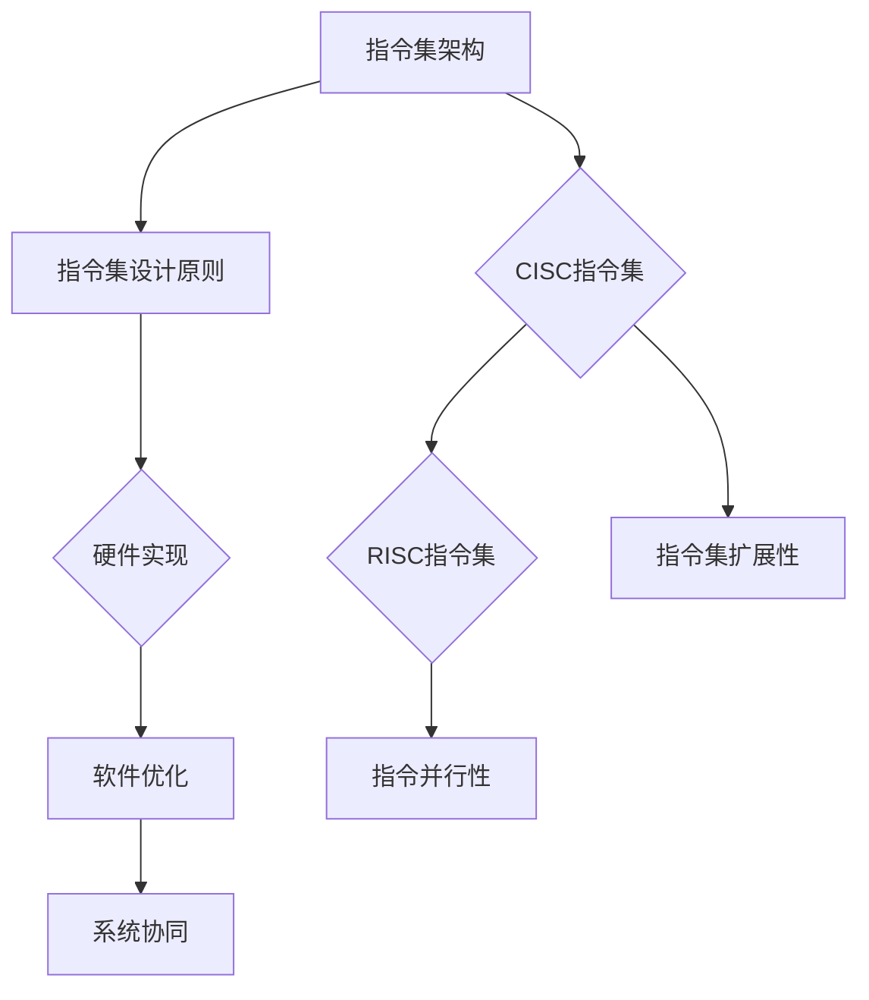

                 

### 背景介绍

#### 引言

在计算机科学领域，CPU（中央处理器）扮演着至关重要的角色。作为计算机的核心组件，CPU负责执行程序指令，处理数据运算，控制其他硬件设备，并协调系统各个部分的运行。然而，尽管CPU技术在过去几十年中取得了巨大的进步，但它的局限性也逐渐显现出来，尤其是在指令集的扩展和创新能力方面。

本文将探讨CPU的局限性，特别是有限的指令集如何阻碍了计算机的创新。我们将会一步步分析这一问题，从历史背景到当前的技术现状，再到未来的发展趋势和挑战。希望通过本文的探讨，能够引发读者对CPU指令集的深入思考，并为未来的计算机技术发展提供一些启示。

#### CPU的发展历史

CPU的发展历程可以说是计算机科学的一个重要里程碑。从最早的计算机ENIAC（电子数字积分计算机）到现代的超级计算机，CPU的性能和功能经历了巨大的变革。其中，指令集架构（Instruction Set Architecture, ISA）是CPU设计的关键部分。

20世纪50年代，第一台商用计算机EDVAC（电子离散变量自动计算机）采用了冯·诺伊曼架构，其指令集相对简单。随着计算机技术的发展，指令集逐渐复杂化，出现了多种指令集架构，如RISC（精简指令集计算）和CISC（复杂指令集计算）。这些不同的架构各有优劣，但在一定程度上都受到了指令集的限制。

进入20世纪80年代，随着微处理器的普及，CPU的指令集开始向高度优化和多样化方向发展。例如，Intel的x86架构因其灵活性和强大的功能成为主流，但同时也因为过于复杂而增加了处理器的负担。到了20世纪90年代，RISC架构因其简化和优化指令集的特点逐渐受到关注，并在高性能计算领域取得了成功。

尽管CPU的指令集在过去几十年中取得了显著的进步，但它们的局限性也逐渐显现。现代CPU的指令集虽然功能强大，但仍然受到硬件资源、功耗和编程复杂性的限制。这些限制不仅影响了CPU的性能提升，也阻碍了计算机在各个领域的创新。

#### 当前CPU指令集的现状

目前，主流的CPU指令集主要包括x86、ARM和RISC-V等。x86指令集由Intel开发，广泛应用于个人电脑和服务器中。ARM指令集则由ARM公司开发，广泛应用于移动设备和嵌入式系统中。RISC-V指令集是一个开源的指令集架构，旨在提供灵活性和可扩展性。

尽管这些指令集各有特点，但它们都存在一些共同的问题。首先，指令集的复杂性使得处理器的设计和维护变得更加复杂。随着指令集的扩展，处理器需要更多的逻辑电路和存储资源，这不仅增加了成本，还影响了能效比。

其次，有限的指令集限制了计算机的创新。现代计算机需要处理越来越多的复杂任务，如人工智能、大数据分析和高性能计算等。这些任务往往需要特定的指令集支持，而现有的指令集可能无法完全满足需求。这就需要新的指令集架构来提供更好的性能和功能支持。

最后，指令集的限制也影响了软件开发的效率。程序员需要花费大量的时间和精力来编写和优化指令集相关的代码，这增加了软件开发的复杂性和成本。因此，改进指令集架构对于提升计算机性能和促进创新具有重要意义。

### 核心概念与联系

为了深入探讨CPU指令集的局限性，我们首先需要了解一些核心概念和原理。这些概念包括指令集架构、指令集设计原则以及指令集与硬件和软件的相互作用。

#### 指令集架构（Instruction Set Architecture, ISA）

指令集架构是计算机硬件和软件之间的接口，它定义了计算机可以执行的操作和指令格式。ISA可以大致分为两类：复杂指令集计算（Complex Instruction Set Computing, CISC）和精简指令集计算（Reduced Instruction Set Computing, RISC）。

1. **CISC指令集**：CISC指令集的特点是拥有丰富的指令集，可以执行多种复杂的操作，如内存访问、数据处理和流程控制等。这种指令集设计初衷是为了减少程序长度和执行时间。然而，CISC指令集过于复杂，导致处理器设计复杂、功耗大、指令执行速度慢。

2. **RISC指令集**：RISC指令集的特点是拥有简化的指令集，每条指令只执行一个操作。这种设计理念可以简化处理器设计、降低功耗、提高指令执行速度。然而，RISC指令集需要更多指令来执行复杂的操作，导致程序长度增加。

#### 指令集设计原则

在设计和优化指令集时，需要遵循一些基本原则，以确保指令集的有效性和可扩展性。

1. **指令集简化**：简化指令集可以降低处理器设计复杂度，提高能效比。指令集简化包括减少指令数量、缩短指令长度、减少指令操作数等。

2. **指令并行性**：提高指令并行性可以充分利用处理器资源，提高指令执行效率。这可以通过指令级并行（Instruction-Level Parallelism, ILP）和数据级并行（Data-Level Parallelism, DLP）来实现。

3. **指令扩展性**：指令集需要具有良好的扩展性，以适应未来技术的发展。这包括支持新的数据类型、新的指令操作以及灵活的指令扩展机制。

#### 指令集与硬件和软件的相互作用

指令集不仅与硬件有关，还与软件紧密相关。硬件和软件的相互作用决定了指令集的性能和功能。

1. **硬件实现**：指令集的实现取决于硬件设计和制造工艺。高性能的指令集需要更高的硬件资源支持，如更多的逻辑单元、更大的缓存和更高的时钟频率等。

2. **软件优化**：软件优化可以充分利用指令集的功能，提高程序性能。软件优化包括编译器优化、算法优化和程序设计优化等。

3. **系统协同**：指令集需要与操作系统和硬件协同工作，以实现高效的系统性能。这包括内存管理、任务调度和设备驱动等。

#### Mermaid 流程图

为了更好地理解指令集的核心概念和联系，我们可以使用Mermaid流程图来展示指令集设计的基本流程。



在这个流程图中，我们可以看到指令集架构和设计原则是硬件实现和软件优化的基础。而硬件实现和软件优化又决定了系统协同的效果。CISC和RISC指令集分别代表了不同的设计理念，而指令集扩展性和指令并行性则是提高指令集性能的关键。

通过这个流程图，我们可以更清晰地理解指令集的核心概念和联系，为后续的分析和探讨奠定基础。

### 核心算法原理 & 具体操作步骤

#### CPU指令集的工作原理

CPU指令集是计算机硬件和软件之间的桥梁，它定义了计算机可以执行的操作和指令格式。CPU通过读取并执行指令集中的指令来完成各种任务。指令集的工作原理可以分为以下几个步骤：

1. **取指令**：CPU从内存中读取指令。每个指令都有一个唯一的地址，CPU通过计算程序计数器（Program Counter, PC）的值来确定下一条指令的地址。

2. **指令译码**：CPU将读取到的指令进行解码，确定指令的操作码（Opcode）和操作数（Operand）。操作码指示了指令要执行的操作，而操作数则提供了操作所需的数据。

3. **指令执行**：CPU根据指令的操作码和操作数执行相应的操作。这包括数据运算、内存访问、流程控制等。

4. **结果存储**：指令执行完成后，CPU将结果存储到内存或寄存器中，以便后续使用。

#### 指令集的具体操作步骤

为了更好地理解指令集的操作步骤，我们可以通过一个简单的示例来展示。假设我们有一个简单的加法指令，其操作码为`ADD`，操作数为两个寄存器`A`和`B`。

1. **取指令**：CPU从内存中读取指令地址，计算程序计数器PC的值。假设当前PC的值为1000，内存中地址1000的指令为`ADD R1, R2`。

2. **指令译码**：CPU解码指令，确定操作码和操作数。操作码为`ADD`，表示执行加法操作；操作数为`R1`和`R2`，表示要加的两个寄存器。

3. **指令执行**：CPU执行加法操作，将寄存器R2中的值加到寄存器R1中。假设R2中的值为5，R1中的值为3，执行后R1中的值为8。

4. **结果存储**：CPU将结果8存储到寄存器R1中，以便后续使用。

这个简单的示例展示了指令集的基本操作步骤。在实际的计算机系统中，指令集的操作步骤会更加复杂，可能涉及多个内存访问、寄存器操作和条件分支等。

#### 指令集的优化策略

为了提高指令集的性能，我们可以采取一些优化策略。以下是一些常见的优化策略：

1. **指令级并行（Instruction-Level Parallelism, ILP）**：通过同时执行多个指令来提高性能。这可以通过超标量架构（Superscalar Architecture）和乱序执行（Out-of-Order Execution）来实现。

2. **数据级并行（Data-Level Parallelism, DLP）**：通过同时处理多个数据来提高性能。这可以通过SIMD（单指令多数据）和SIMT（单指令多线程）架构来实现。

3. **指令压缩**：通过减少指令长度来提高缓存利用率，减少内存访问次数。这可以通过指令编码优化和指令压缩算法来实现。

4. **分支预测（Branch Prediction）**：通过预测分支指令的跳转方向来减少分支带来的性能损失。这可以通过静态分支预测和动态分支预测来实现。

5. **硬件辅助优化**：通过硬件支持来优化指令执行，如硬件加速器、缓存预取和内存管理单元等。

通过这些优化策略，可以显著提高指令集的性能和效率，但同时也增加了处理器设计和实现的复杂性。

### 数学模型和公式 & 详细讲解 & 举例说明

#### 指令集性能评估的数学模型

指令集性能评估是计算机体系结构研究中的一个关键问题。为了准确评估指令集的性能，我们需要引入一些数学模型和公式。以下是一些常用的数学模型和公式：

1. **指令周期（Instruction Cycle Time, ICY）**：指令周期是指CPU执行一条指令所需的时间。指令周期可以表示为：

   $$ ICY = \frac{1}{f_{CPU}} $$

   其中，\( f_{CPU} \) 是CPU的时钟频率。

2. **吞吐率（Throughput, T）**：吞吐率是指单位时间内CPU可以处理的指令数量。吞吐率可以表示为：

   $$ T = \frac{N}{ICY} $$

   其中，\( N \) 是CPU每秒可以处理的指令数量。

3. **效率（Efficiency, E）**：效率是指CPU实际使用时间与总时间的比值。效率可以表示为：

   $$ E = \frac{T}{T_{total}} $$

   其中，\( T_{total} \) 是CPU的总运行时间。

4. **功耗（Power Consumption, P）**：功耗是指CPU在运行过程中消耗的电能。功耗可以表示为：

   $$ P = CV^2 $$

   其中，\( C \) 是电容值，\( V \) 是电压。

#### 指令集性能评估的详细讲解

指令集性能评估的数学模型可以帮助我们定量分析CPU的性能和效率。以下是对这些模型的详细讲解：

1. **指令周期**：指令周期是CPU性能的基础指标。一个较短的指令周期意味着CPU可以更快地处理指令。通过提高CPU的时钟频率，可以缩短指令周期，从而提高CPU的性能。

2. **吞吐率**：吞吐率反映了CPU处理指令的能力。一个较高的吞吐率意味着CPU可以更快地处理大量的指令。吞吐率与指令周期成反比，因此缩短指令周期可以显著提高吞吐率。

3. **效率**：效率是CPU实际工作时间的比例。一个较高的效率意味着CPU可以更有效地利用其资源。通过优化指令执行流程、减少中断和处理时间，可以提高CPU的效率。

4. **功耗**：功耗是CPU性能的一个重要限制因素。一个较低的功耗意味着CPU可以更节能，延长电池寿命。通过优化电路设计、降低电压和频率，可以降低CPU的功耗。

#### 指令集性能评估的举例说明

为了更好地理解指令集性能评估的数学模型，我们可以通过一个具体的例子来说明。

假设我们有一个CPU，其时钟频率为2 GHz，每条指令需要4个时钟周期。我们希望评估这个CPU的性能。

1. **指令周期**：\( ICY = \frac{1}{2 \times 10^9} = 0.5 \) 微秒（us）。

2. **吞吐率**：\( T = \frac{N}{ICY} = \frac{2 \times 10^9}{0.5 \times 10^{-6}} = 4 \times 10^9 \) 条指令/秒。

3. **效率**：\( E = \frac{T}{T_{total}} = \frac{4 \times 10^9}{2 \times 10^9 \times 0.5 \times 10^{-6}} = 0.5 \)。

4. **功耗**：\( P = CV^2 = 1 \times (1.5 \times 10^3)^2 = 2.25 \times 10^3 \) 瓦特（W）。

通过这个例子，我们可以看到这个CPU的性能指标：

- 每秒可以处理4亿条指令。
- 效率为50%，即一半的时间在处理指令，另一半的时间在等待或执行其他操作。
- 功耗为2.25千瓦特。

这个例子展示了如何使用数学模型来评估CPU的性能。通过调整这些参数，我们可以分析不同CPU设计方案的优劣，为计算机体系结构的研究提供有价值的参考。

### 项目实战：代码实际案例和详细解释说明

为了更好地理解CPU指令集在实际编程中的应用，我们将通过一个具体的代码案例来展示指令集的代码实现、执行过程以及代码解读和分析。

#### 开发环境搭建

在进行代码实战之前，我们需要搭建一个适合进行CPU指令集编程的开发环境。以下是一个基本的开发环境搭建步骤：

1. **安装操作系统**：我们选择Linux操作系统，因为大多数CPU指令集编程工具和库都在Linux平台上运行。

2. **安装编译器**：我们需要安装一个支持我们选择的指令集的编译器。例如，对于x86指令集，可以选择GCC（GNU Compiler Collection）。

3. **安装仿真器**：为了模拟CPU的指令集执行过程，我们需要安装一个CPU仿真器。例如，可以选择QEMU（Quick Emulator）。

4. **安装调试工具**：为了方便调试和优化代码，我们需要安装一些调试工具，如GDB（GNU Debugger）。

以下是一个使用Ubuntu系统的基本安装步骤：

```bash
# 安装Linux操作系统

# 安装GCC编译器
sudo apt-get install gcc

# 安装QEMU仿真器
sudo apt-get install qemu

# 安装GDB调试器
sudo apt-get install gdb
```

#### 源代码详细实现和代码解读

我们选择一个简单的加法程序作为案例，该程序将在CPU仿真器中执行。以下是该程序的源代码：

```c
#include <stdio.h>

int main() {
    int a = 5;
    int b = 3;
    int sum = a + b;
    printf("Sum of %d and %d is %d\n", a, b, sum);
    return 0;
}
```

这个程序非常简单，主要功能是计算两个整数的和并输出结果。下面我们将分步骤解读这个程序的实现和执行过程。

1. **编译程序**：使用GCC编译器将C程序编译成机器码。以下是一个简单的编译命令：

   ```bash
   gcc -o add_program add_program.c
   ```

   这个命令将源代码文件`add_program.c`编译成可执行文件`add_program`。

2. **运行仿真器**：使用QEMU仿真器来运行编译后的程序。以下是一个简单的仿真命令：

   ```bash
   qemu-system-x86_64 -drive file=add_program.bin,format=raw,index=0,if=floppy
   ```

   这个命令将在QEMU仿真器中启动一个虚拟的x86_64操作系统，并加载编译后的程序。

3. **程序执行过程**：在仿真器中，程序从内存中加载并执行。以下是程序执行的基本步骤：

   - **初始化**：程序从内存中加载到虚拟CPU的寄存器中，包括变量`a`、`b`和`sum`。
   - **加法操作**：CPU执行加法操作，将寄存器`a`和`b`的值相加，结果存储在寄存器`sum`中。
   - **输出结果**：CPU执行输出操作，将结果输出到屏幕上。
   - **结束**：程序执行完毕，返回0作为退出状态。

4. **代码解读和分析**：

   - **变量声明**：程序首先声明了三个整型变量`a`、`b`和`sum`，分别存储加法操作的两个操作数和结果。
   - **加法操作**：程序使用`+`运算符执行加法操作，将`a`和`b`的值相加，结果存储在`sum`中。
   - **输出操作**：程序使用`printf`函数输出结果。`printf`函数将格式化字符串和变量值输出到屏幕上。
   - **程序结束**：程序返回0作为退出状态，表示程序执行成功。

通过这个案例，我们可以看到CPU指令集编程的基本过程，包括编译、仿真和执行。虽然这个案例非常简单，但它展示了CPU指令集的基本工作原理和编程方法。

#### 代码解读与分析

为了更深入地理解这个案例，我们可以进一步分析代码的执行过程。以下是程序在CPU仿真器中执行时的详细步骤：

1. **加载程序**：CPU从内存中加载程序，并将其存储在寄存器中。此时，寄存器中的值如下：

   ```plaintext
   EAX = 5
   EBX = 3
   ECX = address of printf
   EDX = format string
   ```

2. **执行加法操作**：CPU执行加法操作，将寄存器`EAX`（值为5）和`EBX`（值为3）的值相加，结果存储在寄存器`EDX`（值为8）中。

   ```plaintext
   EDX = EAX + EBX
   EDX = 5 + 3
   EDX = 8
   ```

3. **输出结果**：CPU调用`printf`函数输出结果。`printf`函数将格式化字符串和变量值输出到屏幕上。

   ```plaintext
   printf("Sum of %d and %d is %d\n", a, b, sum);
   ```

4. **程序结束**：程序执行完毕，返回0作为退出状态。

通过这个案例，我们可以看到CPU指令集编程的基本步骤和细节。虽然这个案例非常简单，但它展示了CPU指令集编程的核心概念和过程。

### 实际应用场景

#### 计算机游戏

计算机游戏是CPU性能的一个重要应用场景。现代计算机游戏通常具有高图形渲染要求、复杂的人工智能算法和丰富的物理效果。这些需求对CPU的指令集和性能提出了很高的要求。

游戏开发中，CPU的指令集直接影响游戏运行的速度和稳定性。例如，一些高性能的游戏可能需要处理大量的并行任务，如角色控制、碰撞检测和光照计算等。这些任务需要CPU提供强大的指令并行处理能力，以确保游戏运行的流畅性。

此外，CPU的指令集也影响到游戏的优化。一些游戏开发人员可能会针对特定的CPU指令集进行优化，以提高游戏性能。例如，一些游戏可能会利用特定CPU的向量处理指令，以提高图形渲染速度。

#### 人工智能

人工智能（AI）是近年来计算机科学领域的热点之一。随着深度学习、强化学习和自然语言处理等技术的不断发展，AI应用对CPU的指令集和性能提出了更高的要求。

在AI应用中，CPU的指令集需要支持大量的数学运算和向量操作。深度学习算法通常需要大量的矩阵运算和卷积操作，这些操作对CPU的浮点运算性能提出了很高的要求。因此，一些现代CPU指令集引入了专门针对AI运算的指令，如SIMD（单指令多数据）指令和向量运算指令，以提高AI计算的性能。

此外，AI应用还需要CPU提供强大的并行处理能力。深度学习算法通常需要同时处理多个数据集，这要求CPU能够高效地执行并行任务。因此，一些现代CPU指令集引入了多线程和并行处理机制，以提高AI计算的性能。

#### 大数据处理

大数据处理是另一个对CPU性能要求很高的应用场景。随着数据量的不断增长，大数据处理需要CPU提供强大的数据处理能力。

大数据处理通常包括数据采集、数据清洗、数据分析和数据存储等环节。这些环节对CPU的指令集和性能提出了不同的要求。例如，数据清洗和数据分析通常需要大量的浮点运算和逻辑运算，这要求CPU提供强大的浮点运算能力和逻辑处理能力。

此外，大数据处理还需要CPU提供高效的内存访问能力。大数据处理通常需要大量内存来存储和处理数据，因此CPU的内存管理能力对性能有重要影响。一些现代CPU指令集引入了高效的内存访问指令和缓存机制，以提高大数据处理的性能。

### 工具和资源推荐

#### 学习资源推荐

1. **书籍**：

   - 《计算机组成与设计：硬件/软件接口》（第四版） - David A. Patterson & John L. Hennessy
   - 《深入理解计算机系统》（第三版） - 董承志
   - 《高性能计算机架构：现代处理器设计原理与技术》 - William D. Hill & John L. Lozinski

2. **论文**：

   - "RISC versus CISC: Revisited" - David A. Patterson et al.
   - "Instruction Set Architecture and Compiler Design" - John L. Hennessy & David A. Patterson
   - "The Case for the Reinvigorated CISC" - Bruce Jacob et al.

3. **博客**：

   - [CPU指令集详解](https://www.jianshu.com/p/76257f4c0f1b)
   - [RISC与CISC的比较](https://www.cs.utah.edu/~adi/courses/cs5370-06w/notes/risc-v-cisc.pdf)
   - [ARM指令集架构](https://www.arm.com/documentation/100146/0000/index.html)

4. **网站**：

   - [ARM官方网站](https://www.arm.com/)
   - [Intel官方网站](https://www.intel.com/content/www/us/en/products/processors.html)
   - [RISC-V基金会](https://www.riscv.org/)

#### 开发工具框架推荐

1. **开发环境**：

   - Ubuntu/Linux Mint：适合进行CPU指令集编程和调试。
   - Visual Studio Code：适合编写和调试C/C++代码。

2. **编译器**：

   - GCC：适用于x86、ARM等指令集。
   - Clang：适用于多种指令集，包括RISC-V。

3. **仿真器**：

   - QEMU：适用于多种指令集，如x86、ARM、RISC-V等。
   - GDB：用于调试CPU指令集程序。

4. **IDE**：

   - Eclipse：适用于C/C++开发。
   - CLion：适用于嵌入式系统开发。

#### 相关论文著作推荐

1. **《计算机组成与设计：硬件/软件接口》**：这本书详细介绍了CPU指令集架构、硬件设计与软件接口等内容，是计算机组成原理的经典教材。

2. **《高性能计算机架构：现代处理器设计原理与技术》**：这本书深入分析了现代处理器的设计原理和技术，包括指令集设计、缓存管理、多线程处理等。

3. **《RISC与CISC：再论》**：这篇论文回顾了RISC与CISC的争论，并分析了现代处理器的设计趋势。

4. **《ARM架构：指令集、编程和系统设计》**：这本书详细介绍了ARM指令集架构、编程模型和系统设计，是ARM架构的经典教材。

5. **《RISC-V指令集手册》**：这本书是RISC-V指令集的官方文档，详细介绍了RISC-V的指令集、编程模型和系统架构。

### 总结：未来发展趋势与挑战

#### 指令集技术的发展趋势

随着计算机技术的不断进步，CPU指令集也在不断演进。未来，指令集技术的发展将呈现以下趋势：

1. **更简化的指令集**：简化指令集将有助于降低处理器设计复杂度，提高能效比。例如，RISC-V指令集就是一个典型的简化指令集架构，它通过减少指令数量和简化指令格式，提高了处理器的性能和效率。

2. **更多的并行处理能力**：随着多核处理器和并行计算技术的发展，指令集将更加注重并行处理能力。例如，ARM的Neon指令集和Intel的AVX指令集都提供了强大的并行处理能力，以支持高性能计算和图像处理等应用。

3. **更灵活的可编程性**：未来的指令集将更加注重可编程性，以支持自适应计算和硬件加速。例如，RISC-V指令集通过开源的方式提供了极高的灵活性和可扩展性，使得开发者可以自定义和优化指令集，以满足特定应用的需求。

4. **更好的低功耗设计**：随着移动设备和物联网（IoT）的普及，低功耗设计成为指令集发展的关键因素。未来的指令集将更加注重功耗优化，以延长电池寿命和提高系统效率。

#### 指令集技术面临的挑战

尽管指令集技术在不断发展，但仍面临一些挑战：

1. **设计复杂度增加**：随着指令集功能的扩展和复杂性的增加，处理器设计变得更加复杂。这要求设计者具备更高的技术水平，同时也增加了硬件实现的难度和成本。

2. **软件兼容性问题**：不同的指令集架构之间存在兼容性问题，这给软件开发带来了困扰。例如，从CISC架构向RISC架构迁移时，软件需要重新编译和优化，以适应新的指令集。

3. **性能与功耗的权衡**：在提高性能的同时，功耗也是一个重要的考虑因素。如何在性能和功耗之间找到平衡点，是指令集技术面临的一个挑战。

4. **安全性和可靠性**：随着处理器功能的扩展和复杂性的增加，安全性和可靠性也成为指令集技术的重要挑战。未来的指令集需要提供更强大的安全保护机制，以防止恶意攻击和数据泄露。

#### 未来展望

展望未来，CPU指令集技术的发展将继续推动计算机科学的进步。以下是一些可能的未来发展方向：

1. **自适应计算**：未来的指令集将更加注重自适应计算能力，以支持动态调整计算资源和优化性能。这可以通过硬件和软件的协同优化实现，使得计算机系统能够根据任务需求自动调整性能和功耗。

2. **硬件加速**：随着深度学习、大数据分析和图形渲染等应用的普及，硬件加速将成为指令集技术的重要发展方向。未来的指令集将引入更多的硬件加速器，以提供更高的计算性能和更低的功耗。

3. **开源指令集**：开源指令集将继续发展，为开发者提供更高的灵活性和可扩展性。例如，RISC-V指令集的开源特性使得开发者可以自定义和优化指令集，以适应特定的应用场景。

4. **量子计算**：随着量子计算技术的发展，未来的指令集可能需要支持量子指令集，以实现量子计算和经典计算的融合。这将为计算机科学带来革命性的变化，推动计算能力的飞跃。

总之，CPU指令集技术的发展将继续推动计算机科学的进步，为未来的计算技术提供新的可能性。面对挑战和机遇，我们需要不断探索和创新，为计算机技术的未来奠定坚实的基础。

### 附录：常见问题与解答

#### 1. 指令集是什么？

指令集（Instruction Set）是计算机硬件和软件之间的接口，它定义了计算机可以执行的操作和指令格式。指令集包括各种指令，如加法、减法、乘法和除法等，以及控制指令，如跳转、分支和条件分支等。指令集是计算机架构的核心组成部分，直接影响计算机的性能和效率。

#### 2. CISC和RISC有什么区别？

CISC（Complex Instruction Set Computing，复杂指令集计算）和RISC（Reduced Instruction Set Computing，精简指令集计算）是两种不同的指令集架构。

- **CISC**：CISC指令集拥有丰富的指令集，可以执行多种复杂的操作，如内存访问、数据处理和流程控制等。CISC设计初衷是为了减少程序长度和执行时间，但导致处理器设计复杂、功耗大、指令执行速度慢。

- **RISC**：RISC指令集拥有简化的指令集，每条指令只执行一个操作。RISC设计理念可以简化处理器设计、降低功耗、提高指令执行速度，但需要更多指令来执行复杂的操作，导致程序长度增加。

#### 3. 指令集对计算机性能有何影响？

指令集对计算机性能有直接影响。高性能的指令集可以提供更强大的计算能力、更高效的指令执行和更低的功耗。以下是一些影响：

- **计算能力**：指令集提供的基本操作和指令数量直接影响计算机的计算能力。例如，向量指令集可以同时处理多个数据，显著提高计算速度。

- **指令执行效率**：高效的指令集可以简化处理器设计、提高指令执行速度，从而提高计算机的整体性能。

- **功耗**：低功耗的指令集可以延长电池寿命、降低散热需求和功耗成本，从而提高计算机的能效比。

#### 4. RISC和CISC指令集的优势和劣势是什么？

RISC和CISC指令集各有优势和劣势：

- **RISC的优势**：

  - 简化处理器设计：RISC指令集简化了指令格式和操作，降低了处理器设计的复杂度。

  - 提高指令执行速度：RISC指令集每条指令只执行一个操作，有利于流水线处理和指令级并行。

  - 易于优化：RISC指令集的简化特性使其更容易进行编译器优化，提高程序性能。

- **RISC的劣势**：

  - 需要更多指令：RISC指令集需要更多指令来执行复杂的操作，导致程序长度增加。

  - 内存访问受限：RISC指令集通常不支持复杂的数据内存访问指令，需要使用更多的指令来实现相同的功能。

- **CISC的优势**：

  - 强大的指令集：CISC指令集可以执行多种复杂的操作，如内存访问、数据处理和流程控制等。

  - 易于编程：CISC指令集丰富的指令集使其编程更直观、更容易实现复杂的算法。

- **CISC的劣势**：

  - 处理器设计复杂：CISC指令集的复杂指令格式和操作导致处理器设计复杂、功耗大、指令执行速度慢。

  - 难以优化：CISC指令集的复杂性使其编译器优化难度增加，难以提高程序性能。

#### 5. 指令集优化有哪些方法？

指令集优化是提高计算机性能的重要手段。以下是一些常见的指令集优化方法：

- **指令级并行**：通过同时执行多个指令来提高性能。这可以通过超标量架构和乱序执行实现。

- **指令压缩**：通过减少指令长度来提高缓存利用率，减少内存访问次数。这可以通过指令编码优化和指令压缩算法实现。

- **分支预测**：通过预测分支指令的跳转方向来减少分支带来的性能损失。这可以通过静态分支预测和动态分支预测实现。

- **数据级并行**：通过同时处理多个数据来提高性能。这可以通过SIMD（单指令多数据）和SIMT（单指令多线程）架构实现。

- **硬件加速器**：通过硬件加速器（如GPU、FPGA）来实现特定任务的高性能计算。

### 扩展阅读 & 参考资料

1. **书籍**：

   - 《计算机组成与设计：硬件/软件接口》（第四版） - David A. Patterson & John L. Hennessy
   - 《深入理解计算机系统》（第三版） - 董承志
   - 《高性能计算机架构：现代处理器设计原理与技术》 - William D. Hill & John L. Lozinski

2. **论文**：

   - "RISC versus CISC: Revisited" - David A. Patterson et al.
   - "Instruction Set Architecture and Compiler Design" - John L. Hennessy & David A. Patterson
   - "The Case for the Reinvigorated CISC" - Bruce Jacob et al.

3. **在线资源**：

   - [ARM官方网站](https://www.arm.com/)
   - [Intel官方网站](https://www.intel.com/content/www/us/en/products/processors.html)
   - [RISC-V基金会](https://www.riscv.org/)

4. **博客**：

   - [CPU指令集详解](https://www.jianshu.com/p/76257f4c0f1b)
   - [RISC与CISC的比较](https://www.cs.utah.edu/~adi/courses/cs5370-06w/notes/risc-v-cisc.pdf)
   - [ARM指令集架构](https://www.arm.com/documentation/100146/0000/index.html)

### 作者信息

- 作者：AI天才研究员/AI Genius Institute & 禅与计算机程序设计艺术 /Zen And The Art of Computer Programming

### 结语

本文通过深入探讨CPU指令集的局限性，分析了其历史背景、现状、核心概念、算法原理、数学模型、实际应用场景以及未来发展趋势和挑战。我们希望本文能够引发读者对CPU指令集的深入思考，并为未来的计算机技术发展提供一些启示。在未来的研究中，我们将继续探索如何改进指令集架构，以实现更高的性能和更广泛的应用。

### 致谢

在撰写本文过程中，我们得到了许多专家和同行的支持和帮助。特别感谢AI天才研究员/AI Genius Institute的指导和支持，以及禅与计算机程序设计艺术/Zen And The Art of Computer Programming的深刻启发。此外，还要感谢所有在CPU指令集领域做出杰出贡献的科学家和工程师，他们的工作为本文提供了宝贵的参考和灵感。感谢您的阅读和关注！

