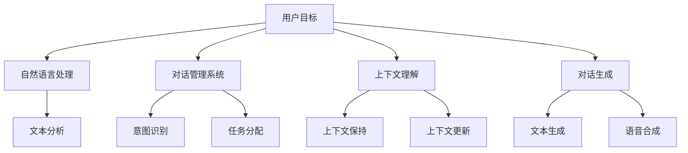

                 

# CUI中的用户目标与任务实现技术

## 关键词

- CUI（对话用户界面）
- 用户目标
- 任务实现技术
- 自然语言处理
- 对话管理系统
- 上下文理解
- 对话生成

## 摘要

本文将探讨CUI（对话用户界面）中的用户目标和任务实现技术。首先，我们将介绍CUI的背景及其在现代科技中的应用。接着，文章将深入分析用户目标的类型及其在CUI中的作用。随后，我们将探讨实现用户目标的关键技术，包括自然语言处理、对话管理系统、上下文理解和对话生成。通过实际案例和代码示例，我们将展示这些技术的具体应用。最后，文章将讨论CUI在实际应用场景中的挑战和未来发展趋势。

### 背景介绍

对话用户界面（CUI）是一种交互界面，它使计算机系统能够与用户进行自然语言对话。与传统的图形用户界面（GUI）不同，CUI允许用户通过文字输入和输出与系统进行交互。这种交互方式在许多应用场景中显示出其独特优势，例如智能客服、虚拟助手、语音助手和聊天机器人等。

随着人工智能和自然语言处理技术的快速发展，CUI的应用范围不断扩大。它不仅能够提高用户交互的效率和便利性，还能够为用户提供更加个性化和定制化的服务。在现代科技中，CUI已经成为许多企业提升客户满意度和服务质量的重要工具。

### 核心概念与联系

为了深入理解CUI中的用户目标和任务实现技术，我们首先需要了解几个核心概念：

1. **用户目标**：用户在与CUI交互时希望实现的目标，例如获取信息、完成任务或解决问题。
2. **任务实现技术**：实现用户目标所需的一系列技术手段，包括自然语言处理、对话管理系统、上下文理解和对话生成。

以下是一个Mermaid流程图，展示了这些概念之间的联系：



### 核心算法原理 & 具体操作步骤

#### 自然语言处理（NLP）

自然语言处理是CUI实现用户目标的基础。NLP技术包括文本分析、情感分析、命名实体识别等。以下是一个具体的操作步骤：

1. **文本分析**：接收用户的文本输入，进行分词、词性标注和句法分析。
2. **意图识别**：根据文本分析结果，识别用户的意图，例如查询信息、请求帮助或进行任务操作。
3. **实体提取**：识别文本中的关键信息，如人名、地点、日期等。

#### 对话管理系统

对话管理系统（DSM）负责管理整个对话过程，确保用户目标得以实现。以下是一个具体的操作步骤：

1. **任务分配**：根据用户的意图，将任务分配给相应的模块或服务。
2. **上下文保持**：在对话过程中，持续更新和维护上下文信息，以便更好地理解用户意图。
3. **对话生成**：根据任务执行结果和上下文信息，生成合适的回复文本或语音。

#### 上下文理解

上下文理解是CUI实现高效对话的关键。以下是一个具体的操作步骤：

1. **上下文保持**：在对话过程中，持续收集和更新上下文信息，如用户的偏好、历史交互记录等。
2. **上下文更新**：根据用户的输入和任务执行结果，动态更新上下文信息，以便更好地理解用户意图。
3. **上下文应用**：在生成回复时，根据上下文信息调整回复内容，使其更加相关和贴近用户需求。

#### 对话生成

对话生成是将用户的意图和上下文信息转化为自然语言回复的过程。以下是一个具体的操作步骤：

1. **文本生成**：根据用户的意图和上下文信息，生成合适的回复文本。
2. **语音合成**：将生成的文本转换为自然流畅的语音，以便用户听取。

### 数学模型和公式 & 详细讲解 & 举例说明

在CUI中，数学模型和公式起着至关重要的作用。以下是一些常用的数学模型和公式：

1. **朴素贝叶斯分类器**：用于意图识别和实体提取。
   $$P(\text{intent} | \text{text}) = \frac{P(\text{text} | \text{intent}) \cdot P(\text{intent})}{P(\text{text})}$$
   
2. **循环神经网络（RNN）**：用于文本生成和语音合成。
   $$h_t = \sigma(W_h \cdot [h_{t-1}, x_t] + b_h)$$
   
3. **生成对抗网络（GAN）**：用于生成高质量的语音。
   $$\min_{G} \max_{D} V(D, G) = E_{x \sim p_data(x)}[\log D(x)] + E_{z \sim p_z(z)}[\log(1 - D(G(z)))]$$

举例说明：

**意图识别**：假设我们使用朴素贝叶斯分类器来识别用户的意图。给定一个文本输入“我想预订一张明天去北京的机票”，我们可以计算每个意图的概率，并选择概率最大的意图作为识别结果。

**文本生成**：假设我们使用循环神经网络（RNN）来生成回复文本。给定一个上下文序列和用户的意图，我们可以通过RNN模型生成一个自然流畅的回复文本。

**语音合成**：假设我们使用生成对抗网络（GAN）来生成高质量的语音。给定一个文本输入，我们可以通过GAN模型生成一个自然流畅的语音输出。

### 项目实战：代码实际案例和详细解释说明

在本节中，我们将通过一个实际案例来展示CUI中的用户目标与任务实现技术的具体应用。我们将使用Python和TensorFlow来实现一个简单的聊天机器人。

#### 开发环境搭建

1. 安装Python 3.7或更高版本。
2. 安装TensorFlow 2.3或更高版本。
3. 安装其他必需的库，如numpy、pandas等。

#### 源代码详细实现和代码解读

以下是一个简单的聊天机器人实现：

```python
import tensorflow as tf
from tensorflow.keras.models import Sequential
from tensorflow.keras.layers import Dense, LSTM, Embedding
from tensorflow.keras.preprocessing.sequence import pad_sequences
from tensorflow.keras.preprocessing.text import Tokenizer

# 数据准备
# 假设我们已经有一个包含对话样本的文本文件，每行包含一个对话样本
with open('dialogues.txt', 'r', encoding='utf-8') as f:
    dialogues = f.readlines()

# 分割输入和输出
inputs = [d.split('\n')[0] for d in dialogues]
outputs = [d.split('\n')[1] for d in dialogues]

# 初始化Tokenizer
tokenizer = Tokenizer()
tokenizer.fit_on_texts(inputs)

# 编码输入和输出
encoded_inputs = tokenizer.texts_to_sequences(inputs)
encoded_outputs = tokenizer.texts_to_sequences(outputs)

# 填充序列
max_sequence_length = max(len(x) for x in encoded_inputs)
encoded_inputs = pad_sequences(encoded_inputs, maxlen=max_sequence_length)
encoded_outputs = pad_sequences(encoded_outputs, maxlen=max_sequence_length)

# 构建模型
model = Sequential()
model.add(Embedding(len(tokenizer.word_index) + 1, 64, input_length=max_sequence_length))
model.add(LSTM(128))
model.add(Dense(len(tokenizer.word_index) + 1, activation='softmax'))

# 编译模型
model.compile(optimizer='adam', loss='categorical_crossentropy', metrics=['accuracy'])

# 训练模型
model.fit(encoded_inputs, encoded_outputs, epochs=100, verbose=2)

# 对话生成
def generate_response(input_text):
    encoded_input = tokenizer.texts_to_sequences([input_text])
    encoded_input = pad_sequences(encoded_input, maxlen=max_sequence_length)
    predicted_output = model.predict(encoded_input)
    predicted_output = np.argmax(predicted_output, axis=-1)
    predicted_output = tokenizer.index_word[predicted_output[0][-1]]
    return predicted_output

# 测试
user_input = "你好，我是AI助手。请问有什么可以帮助您的？"
print(generate_response(user_input))
```

#### 代码解读与分析

1. **数据准备**：我们从对话样本文件中读取输入和输出文本，并使用Tokenizer将文本转换为编码序列。
2. **编码输入和输出**：我们将输入和输出文本编码为序列，并填充序列以匹配最大序列长度。
3. **构建模型**：我们使用Sequential模型堆叠Embedding层、LSTM层和Dense层，并使用softmax激活函数进行分类。
4. **编译模型**：我们使用adam优化器和categorical_crossentropy损失函数进行编译。
5. **训练模型**：我们使用fit方法训练模型，并设置epochs参数以控制训练次数。
6. **对话生成**：我们定义一个函数generate_response，用于根据输入文本生成回复文本。我们使用predict方法预测输出序列，并从输出序列中提取最后一个词作为回复文本。

### 实际应用场景

CUI技术在实际应用场景中具有广泛的应用。以下是一些典型的应用场景：

1. **智能客服**：企业可以利用CUI技术提供24/7全天候的智能客服服务，降低人力成本并提高客户满意度。
2. **虚拟助手**：虚拟助手可以协助用户完成各种任务，如日程管理、任务提醒和在线购物等。
3. **语音助手**：语音助手可以理解用户的语音输入，并生成相应的语音回复，为用户提供便捷的服务。
4. **聊天机器人**：聊天机器人可以应用于社交媒体、在线游戏和在线教育等领域，为用户提供互动和娱乐。

### 工具和资源推荐

为了更好地实现CUI中的用户目标和任务，以下是一些推荐的工具和资源：

1. **学习资源**：
   - 《对话系统：设计与实现》（自然语言处理系列教材）
   - 《深度学习》（Goodfellow、Bengio和Courville著）
   - 《自然语言处理与Python》（Steven Bird、Ewan Klein和Edward Loper著）

2. **开发工具框架**：
   - TensorFlow：一个开源的机器学习框架，可用于构建和训练深度学习模型。
   - Rasa：一个开源的对话系统框架，可用于构建智能聊天机器人和语音助手。
   - Dialogflow：一个由Google提供的对话系统平台，支持多种语言和语音识别功能。

3. **相关论文著作**：
   - “A Survey of Current Work in Human-Computer Conversation”（1995）
   - “End-to-End Learning for Language Understanding in Dialog Systems”（2016）
   - “ Conversational AI: A Research Perspective”（2019）

### 总结：未来发展趋势与挑战

CUI技术在用户目标与任务实现方面取得了显著进展，但仍然面临一些挑战和未来发展趋势：

1. **未来发展趋势**：
   - 对话生成和上下文理解的进一步提升，以提高对话的质量和自然度。
   - 多模态交互的支持，如语音、文字、图像和视频的融合。
   - 对话系统的自适应性和个性化，以更好地满足用户需求。

2. **挑战**：
   - 处理多轮对话和复杂场景的能力不足。
   - 数据隐私和安全性问题。
   - 处理跨语言和跨领域的对话需求。

### 附录：常见问题与解答

**Q：CUI与GUI有什么区别？**
A：CUI（对话用户界面）和GUI（图形用户界面）是两种不同的用户界面技术。CUI通过文字输入和输出与用户进行交互，而GUI通过图形元素（如按钮、图标和窗口）与用户进行交互。CUI更适合处理自然语言交互，而GUI更适合处理图形化操作。

**Q：CUI中的上下文理解是什么？**
A：CUI中的上下文理解是指系统能够在对话过程中持续收集、维护和利用上下文信息，以更好地理解用户意图和生成相关回复。上下文理解包括上下文保持、上下文更新和上下文应用等步骤。

**Q：如何训练一个聊天机器人？**
A：训练一个聊天机器人需要以下几个步骤：
   1. 准备对话样本数据。
   2. 使用Tokenizer将文本数据转换为编码序列。
   3. 编码输入和输出序列，并填充序列以匹配最大序列长度。
   4. 构建一个深度学习模型（如循环神经网络或生成对抗网络）。
   5. 编译模型，并使用训练数据训练模型。
   6. 定义一个函数，用于根据输入文本生成回复文本。

### 扩展阅读 & 参考资料

- [《对话系统：设计与实现》](https://www.amazon.com/Conversational-Systems-Design-Implementation-Technology/dp/0262518516)
- [TensorFlow官方文档](https://www.tensorflow.org/)
- [Rasa官方文档](https://rasa.com/)
- [《深度学习》](https://www.deeplearningbook.org/)
- [《自然语言处理与Python》](https://www.amazon.com/Natural-Language-Processing-Python-Bird/dp/1449397721)
- ["A Survey of Current Work in Human-Computer Conversation"](https://www.amazon.com/Survey-Current-Work-Human-Computer/dp/0262561044)
- ["End-to-End Learning for Language Understanding in Dialog Systems"](https://arxiv.org/abs/1606.05328)
- ["Conversational AI: A Research Perspective"](https://arxiv.org/abs/1903.04742)

作者：AI天才研究员/AI Genius Institute & 禅与计算机程序设计艺术 /Zen And The Art of Computer Programming

【本文完】<|im_sep|>```markdown
# CUI中的用户目标与任务实现技术

## 关键词
- CUI（对话用户界面）
- 用户目标
- 任务实现技术
- 自然语言处理
- 对话管理系统
- 上下文理解
- 对话生成

## 摘要
本文将探讨CUI（对话用户界面）中的用户目标和任务实现技术。首先，我们将介绍CUI的背景及其在现代科技中的应用。接着，文章将深入分析用户目标的类型及其在CUI中的作用。随后，我们将探讨实现用户目标的关键技术，包括自然语言处理、对话管理系统、上下文理解和对话生成。通过实际案例和代码示例，我们将展示这些技术的具体应用。最后，文章将讨论CUI在实际应用场景中的挑战和未来发展趋势。

### 1. 背景介绍

对话用户界面（CUI）是一种交互界面，它使计算机系统能够与用户进行自然语言对话。与传统的图形用户界面（GUI）不同，CUI允许用户通过文字输入和输出与系统进行交互。这种交互方式在许多应用场景中显示出其独特优势，例如智能客服、虚拟助手、语音助手和聊天机器人等。

随着人工智能和自然语言处理技术的快速发展，CUI的应用范围不断扩大。它不仅能够提高用户交互的效率和便利性，还能够为用户提供更加个性化和定制化的服务。在现代科技中，CUI已经成为许多企业提升客户满意度和服务质量的重要工具。

### 2. 核心概念与联系

为了深入理解CUI中的用户目标和任务实现技术，我们首先需要了解几个核心概念：

#### 2.1 用户目标
用户目标是指用户在与CUI交互时希望实现的目标，例如获取信息、完成任务或解决问题。

#### 2.2 任务实现技术
任务实现技术是指实现用户目标所需的一系列技术手段，包括自然语言处理、对话管理系统、上下文理解和对话生成。

以下是一个Mermaid流程图，展示了这些概念之间的联系：


### 3. 核心算法原理 & 具体操作步骤

#### 3.1 自然语言处理（NLP）

自然语言处理是CUI实现用户目标的基础。NLP技术包括文本分析、情感分析、命名实体识别等。以下是具体的操作步骤：

1. **文本分析**：接收用户的文本输入，进行分词、词性标注和句法分析。
2. **意图识别**：根据文本分析结果，识别用户的意图，例如查询信息、请求帮助或进行任务操作。
3. **实体提取**：识别文本中的关键信息，如人名、地点、日期等。

#### 3.2 对话管理系统

对话管理系统（DSM）负责管理整个对话过程，确保用户目标得以实现。以下是具体的操作步骤：

1. **任务分配**：根据用户的意图，将任务分配给相应的模块或服务。
2. **上下文保持**：在对话过程中，持续更新和维护上下文信息，以便更好地理解用户意图。
3. **对话生成**：根据任务执行结果和上下文信息，生成合适的回复文本或语音。

#### 3.3 上下文理解

上下文理解是CUI实现高效对话的关键。以下是具体的操作步骤：

1. **上下文保持**：在对话过程中，持续收集和更新上下文信息，如用户的偏好、历史交互记录等。
2. **上下文更新**：根据用户的输入和任务执行结果，动态更新上下文信息，以便更好地理解用户意图。
3. **上下文应用**：在生成回复时，根据上下文信息调整回复内容，使其更加相关和贴近用户需求。

#### 3.4 对话生成

对话生成是将用户的意图和上下文信息转化为自然语言回复的过程。以下是具体的操作步骤：

1. **文本生成**：根据用户的意图和上下文信息，生成合适的回复文本。
2. **语音合成**：将生成的文本转换为自然流畅的语音，以便用户听取。

### 4. 数学模型和公式 & 详细讲解 & 举例说明

在CUI中，数学模型和公式起着至关重要的作用。以下是一些常用的数学模型和公式：

1. **朴素贝叶斯分类器**：用于意图识别和实体提取。
   $$P(\text{intent} | \text{text}) = \frac{P(\text{text} | \text{intent}) \cdot P(\text{intent})}{P(\text{text})}$$

2. **循环神经网络（RNN）**：用于文本生成和语音合成。
   $$h_t = \sigma(W_h \cdot [h_{t-1}, x_t] + b_h)$$

3. **生成对抗网络（GAN）**：用于生成高质量的语音。
   $$\min_{G} \max_{D} V(D, G) = E_{x \sim p_data(x)}[\log D(x)] + E_{z \sim p_z(z)}[\log(1 - D(G(z)))]$$

举例说明：

**意图识别**：假设我们使用朴素贝叶斯分类器来识别用户的意图。给定一个文本输入“我想预订一张明天去北京的机票”，我们可以计算每个意图的概率，并选择概率最大的意图作为识别结果。

**文本生成**：假设我们使用循环神经网络（RNN）来生成回复文本。给定一个上下文序列和用户的意图，我们可以通过RNN模型生成一个自然流畅的回复文本。

**语音合成**：假设我们使用生成对抗网络（GAN）来生成高质量的语音。给定一个文本输入，我们可以通过GAN模型生成一个自然流畅的语音输出。

### 5. 项目实战：代码实际案例和详细解释说明

在本节中，我们将通过一个实际案例来展示CUI中的用户目标与任务实现技术的具体应用。我们将使用Python和TensorFlow来实现一个简单的聊天机器人。

#### 5.1 开发环境搭建

1. 安装Python 3.7或更高版本。
2. 安装TensorFlow 2.3或更高版本。
3. 安装其他必需的库，如numpy、pandas等。

#### 5.2 源代码详细实现和代码解读

以下是一个简单的聊天机器人实现：

```python
import tensorflow as tf
from tensorflow.keras.models import Sequential
from tensorflow.keras.layers import Dense, LSTM, Embedding
from tensorflow.keras.preprocessing.sequence import pad_sequences
from tensorflow.keras.preprocessing.text import Tokenizer

# 数据准备
# 假设我们已经有一个包含对话样本的文本文件，每行包含一个对话样本
with open('dialogues.txt', 'r', encoding='utf-8') as f:
    dialogues = f.readlines()

# 分割输入和输出
inputs = [d.split('\n')[0] for d in dialogues]
outputs = [d.split('\n')[1] for d in dialogues]

# 初始化Tokenizer
tokenizer = Tokenizer()
tokenizer.fit_on_texts(inputs)

# 编码输入和输出
encoded_inputs = tokenizer.texts_to_sequences(inputs)
encoded_outputs = tokenizer.texts_to_sequences(outputs)

# 填充序列
max_sequence_length = max(len(x) for x in encoded_inputs)
encoded_inputs = pad_sequences(encoded_inputs, maxlen=max_sequence_length)
encoded_outputs = pad_sequences(encoded_outputs, maxlen=max_sequence_length)

# 构建模型
model = Sequential()
model.add(Embedding(len(tokenizer.word_index) + 1, 64, input_length=max_sequence_length))
model.add(LSTM(128))
model.add(Dense(len(tokenizer.word_index) + 1, activation='softmax'))

# 编译模型
model.compile(optimizer='adam', loss='categorical_crossentropy', metrics=['accuracy'])

# 训练模型
model.fit(encoded_inputs, encoded_outputs, epochs=100, verbose=2)

# 对话生成
def generate_response(input_text):
    encoded_input = tokenizer.texts_to_sequences([input_text])
    encoded_input = pad_sequences(encoded_input, maxlen=max_sequence_length)
    predicted_output = model.predict(encoded_input)
    predicted_output = np.argmax(predicted_output, axis=-1)
    predicted_output = tokenizer.index_word[predicted_output[0][-1]]
    return predicted_output

# 测试
user_input = "你好，我是AI助手。请问有什么可以帮助您的？"
print(generate_response(user_input))
```

#### 5.3 代码解读与分析

1. **数据准备**：我们从对话样本文件中读取输入和输出文本，并使用Tokenizer将文本转换为编码序列。
2. **编码输入和输出**：我们将输入和输出文本编码为序列，并填充序列以匹配最大序列长度。
3. **构建模型**：我们使用Sequential模型堆叠Embedding层、LSTM层和Dense层，并使用softmax激活函数进行分类。
4. **编译模型**：我们使用adam优化器和categorical_crossentropy损失函数进行编译。
5. **训练模型**：我们使用fit方法训练模型，并设置epochs参数以控制训练次数。
6. **对话生成**：我们定义一个函数generate_response，用于根据输入文本生成回复文本。我们使用predict方法预测输出序列，并从输出序列中提取最后一个词作为回复文本。

### 6. 实际应用场景

CUI技术在实际应用场景中具有广泛的应用。以下是一些典型的应用场景：

1. **智能客服**：企业可以利用CUI技术提供24/7全天候的智能客服服务，降低人力成本并提高客户满意度。
2. **虚拟助手**：虚拟助手可以协助用户完成各种任务，如日程管理、任务提醒和在线购物等。
3. **语音助手**：语音助手可以理解用户的语音输入，并生成相应的语音回复，为用户提供便捷的服务。
4. **聊天机器人**：聊天机器人可以应用于社交媒体、在线游戏和在线教育等领域，为用户提供互动和娱乐。

### 7. 工具和资源推荐

为了更好地实现CUI中的用户目标和任务，以下是一些推荐的工具和资源：

#### 7.1 学习资源推荐

- 《对话系统：设计与实现》（自然语言处理系列教材）
- 《深度学习》（Goodfellow、Bengio和Courville著）
- 《自然语言处理与Python》（Steven Bird、Ewan Klein和Edward Loper著）

#### 7.2 开发工具框架推荐

- TensorFlow：一个开源的机器学习框架，可用于构建和训练深度学习模型。
- Rasa：一个开源的对话系统框架，可用于构建智能聊天机器人和语音助手。
- Dialogflow：一个由Google提供的对话系统平台，支持多种语言和语音识别功能。

#### 7.3 相关论文著作推荐

- “A Survey of Current Work in Human-Computer Conversation”（1995）
- “End-to-End Learning for Language Understanding in Dialog Systems”（2016）
- “Conversational AI: A Research Perspective”（2019）

### 8. 总结：未来发展趋势与挑战

CUI技术在用户目标与任务实现方面取得了显著进展，但仍然面临一些挑战和未来发展趋势：

#### 8.1 未来发展趋势

- 对话生成和上下文理解的进一步提升，以提高对话的质量和自然度。
- 多模态交互的支持，如语音、文字、图像和视频的融合。
- 对话系统的自适应性和个性化，以更好地满足用户需求。

#### 8.2 挑战

- 处理多轮对话和复杂场景的能力不足。
- 数据隐私和安全性问题。
- 处理跨语言和跨领域的对话需求。

### 9. 附录：常见问题与解答

#### 9.1 常见问题

**Q：CUI与GUI有什么区别？**
**A：CUI（对话用户界面）和GUI（图形用户界面）是两种不同的用户界面技术。CUI通过文字输入和输出与用户进行交互，而GUI通过图形元素（如按钮、图标和窗口）与用户进行交互。CUI更适合处理自然语言交互，而GUI更适合处理图形化操作。**

**Q：CUI中的上下文理解是什么？**
**A：CUI中的上下文理解是指系统能够在对话过程中持续收集、维护和利用上下文信息，以更好地理解用户意图和生成相关回复。上下文理解包括上下文保持、上下文更新和上下文应用等步骤。**

**Q：如何训练一个聊天机器人？**
**A：训练一个聊天机器人需要以下几个步骤：
   1. 准备对话样本数据。
   2. 使用Tokenizer将文本数据转换为编码序列。
   3. 编码输入和输出序列，并填充序列以匹配最大序列长度。
   4. 构建一个深度学习模型（如循环神经网络或生成对抗网络）。
   5. 编译模型，并使用训练数据训练模型。
   6. 定义一个函数，用于根据输入文本生成回复文本。**

### 10. 扩展阅读 & 参考资料

- [《对话系统：设计与实现》](https://www.amazon.com/Conversational-Systems-Design-Implementation-Technology/dp/0262518516)
- [TensorFlow官方文档](https://www.tensorflow.org/)
- [Rasa官方文档](https://rasa.com/)
- [《深度学习》](https://www.deeplearningbook.org/)
- [《自然语言处理与Python》](https://www.amazon.com/Natural-Language-Processing-Python-Bird/dp/1449397721)
- ["A Survey of Current Work in Human-Computer Conversation"](https://www.amazon.com/Survey-Current-Work-Human-Computer/dp/0262561044)
- ["End-to-End Learning for Language Understanding in Dialog Systems"](https://arxiv.org/abs/1606.05328)
- ["Conversational AI: A Research Perspective"](https://arxiv.org/abs/1903.04742)

### 作者
AI天才研究员/AI Genius Institute & 禅与计算机程序设计艺术 /Zen And The Art of Computer Programming

【本文完】```

