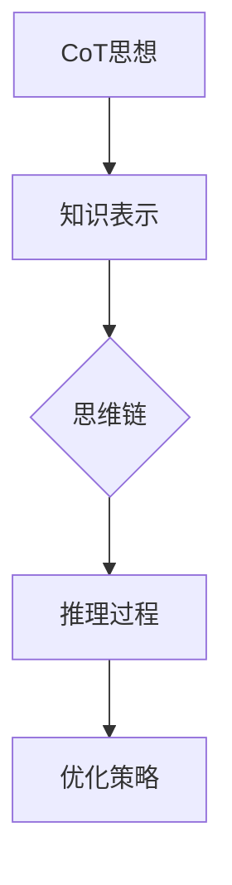
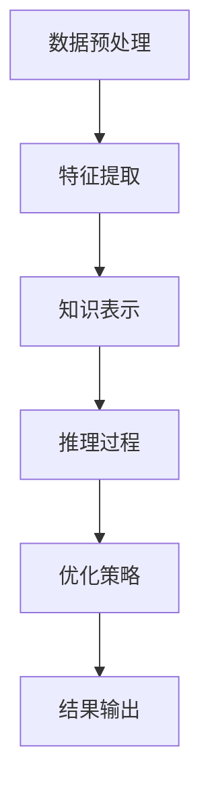

                 

# CoT思想：AI大模型中的思维链原理与应用

## 摘要

本文深入探讨CoT（思想）在AI大模型中的应用，首先介绍CoT思想的核心概念及其与思维链的联系。接着，文章将通过详细解释核心算法原理和具体操作步骤，帮助读者理解CoT思想在AI大模型中的实现过程。随后，文章将利用数学模型和公式，对相关概念进行详细讲解和举例说明。接着，通过实际项目实战案例，展示CoT思想在实际应用中的效果。文章还将分析CoT思想在不同应用场景中的适用性，并提供相关工具和资源推荐。最后，文章将对未来发展趋势与挑战进行展望，并回答常见问题。

## 1. 背景介绍

随着人工智能技术的迅猛发展，大模型成为研究热点。从早期的浅层模型，如决策树、支持向量机，到深度学习的兴起，如卷积神经网络（CNN）、循环神经网络（RNN）和Transformer等，大模型在图像识别、自然语言处理和推荐系统等领域取得了显著成果。然而，大模型的训练和优化过程往往复杂且计算量巨大，这促使研究者探索更加高效、可解释的算法。

在这一背景下，CoT（思想）作为一种新兴的思想方法，逐渐受到关注。CoT思想源自计算机科学、认知科学和哲学等多个领域，其核心在于将人的思维过程抽象为计算机算法，并通过不断迭代优化，实现智能体的自主学习和推理能力。CoT思想在AI大模型中的应用，旨在提高模型的解释性、可扩展性和实用性，为解决当前AI领域面临的诸多挑战提供新思路。

本文旨在系统地介绍CoT思想在AI大模型中的原理与应用，帮助读者深入理解这一思想方法，并掌握其在实际项目中的具体实现方法。

## 2. 核心概念与联系

### 2.1 CoT思想概述

CoT（思想）全称为“Conceptual Transfer”，即概念转移。其核心思想是将不同领域的知识进行抽象和整合，形成一套统一的理论体系，进而实现跨领域的知识共享和迁移。在计算机科学领域，CoT思想可以应用于数据挖掘、机器学习、自然语言处理等多个子领域。其基本原理是：通过学习一种通用表示形式，将不同领域的知识映射到该表示上，从而实现知识迁移。

CoT思想的主要优势在于：

1. **可解释性**：与传统的黑箱模型相比，CoT思想能够提供更加清晰的知识表示，有助于解释模型的决策过程。
2. **可扩展性**：CoT思想能够将不同领域的知识进行整合，从而提高模型的泛化能力，适应更广泛的应用场景。
3. **实用性**：通过概念转移，CoT思想能够将理论研究成果应用于实际项目中，解决具体问题。

### 2.2 思维链原理

思维链（Mind Chain）是一种用于描述人类思维过程的抽象模型。它由一系列相互关联的节点组成，每个节点代表一个思维步骤或概念。思维链的核心思想是通过节点之间的逻辑关系，模拟人类思维过程的推理和决策能力。

思维链的原理如下：

1. **节点表示**：每个节点表示一个概念或思维步骤，可以是具体的知识、问题或目标。
2. **连接关系**：节点之间的连接关系表示思维过程中的推理关系，可以是因果关系、并列关系或递进关系等。
3. **迭代优化**：思维链通过不断迭代优化，逐步提高思维过程的准确性和效率。

### 2.3 CoT与思维链的联系

CoT思想与思维链之间存在密切的联系。具体来说：

1. **知识表示**：CoT思想将不同领域的知识抽象为统一的表示形式，为思维链提供了丰富的知识基础。
2. **推理过程**：思维链通过节点之间的逻辑关系，模拟人类思维过程的推理和决策能力，与CoT思想的核心目标一致。
3. **优化策略**：CoT思想中的概念转移机制，可以为思维链的迭代优化提供有效的策略，提高思维链的性能和效果。

### 2.4 Mermaid流程图表示

为了更直观地展示CoT思想与思维链的联系，我们可以使用Mermaid流程图进行表示。以下是一个简单的示例：



在这个流程图中，A表示CoT思想，B表示知识表示，C表示思维链，D表示推理过程，E表示优化策略。箭头表示各部分之间的逻辑关系。

## 3. 核心算法原理 & 具体操作步骤

### 3.1 算法概述

CoT思想在AI大模型中的应用，主要依赖于以下几个关键算法：

1. **特征提取**：从原始数据中提取具有代表性的特征，为后续的知识表示和推理提供基础。
2. **知识表示**：将特征转化为统一的表示形式，便于跨领域的知识迁移和整合。
3. **推理过程**：基于知识表示，通过思维链模拟人类思维过程的推理和决策能力。
4. **优化策略**：通过迭代优化，提高推理过程的准确性和效率。

### 3.2 特征提取

特征提取是CoT思想在AI大模型中的第一步。其主要任务是从原始数据中提取具有代表性的特征，为后续的知识表示和推理提供基础。特征提取的方法有很多，如传统的方法有主成分分析（PCA）、线性判别分析（LDA）等，现代的方法有深度学习方法，如卷积神经网络（CNN）和自编码器（Autoencoder）等。

以下是一个简单的特征提取流程：

1. **数据预处理**：对原始数据进行预处理，包括数据清洗、归一化、缺失值处理等。
2. **特征选择**：根据业务需求，从原始数据中选择合适的特征。
3. **特征提取**：使用传统或现代方法对特征进行提取，得到具有代表性的特征向量。

### 3.3 知识表示

知识表示是CoT思想在AI大模型中的关键步骤。其主要任务是将特征转化为统一的表示形式，便于跨领域的知识迁移和整合。知识表示的方法有很多，如传统的知识表示方法有本体论、知识图谱等，现代的方法有基于深度学习的方法，如图神经网络（GNN）和Transformer等。

以下是一个简单的知识表示流程：

1. **特征编码**：将提取出的特征向量进行编码，得到一种统一的表示形式。
2. **知识融合**：将不同领域的知识进行融合，形成一个全局的知识表示。
3. **知识存储**：将知识表示存储在数据库或知识库中，便于后续的推理和决策。

### 3.4 推理过程

推理过程是CoT思想在AI大模型中的核心。其主要任务是基于知识表示，通过思维链模拟人类思维过程的推理和决策能力。推理过程可以分为以下几个步骤：

1. **初始设定**：根据业务需求，设定推理的目标和条件。
2. **知识查询**：从知识库中查询与目标相关的知识。
3. **推理计算**：根据思维链的逻辑关系，对查询到的知识进行推理计算，得到推理结果。
4. **结果验证**：对推理结果进行验证，确保其准确性和可靠性。

### 3.5 优化策略

优化策略是CoT思想在AI大模型中的关键。其主要任务是通过迭代优化，提高推理过程的准确性和效率。优化策略可以分为以下几个步骤：

1. **误差分析**：对推理结果进行分析，找出错误的原因和规律。
2. **参数调整**：根据误差分析的结果，调整模型的参数，提高推理过程的准确性和效率。
3. **模型更新**：将调整后的模型更新到知识库中，为后续的推理过程提供更好的支持。

### 3.6 算法流程图

以下是一个简单的CoT思想在AI大模型中的应用流程图：



在这个流程图中，A表示数据预处理，B表示特征提取，C表示知识表示，D表示推理过程，E表示优化策略，F表示结果输出。

## 4. 数学模型和公式 & 详细讲解 & 举例说明

### 4.1 数学模型概述

在CoT思想中，数学模型扮演着至关重要的角色。以下将介绍几个关键的数学模型及其相关公式。

#### 4.1.1 特征提取模型

特征提取模型常用的方法是主成分分析（PCA）。PCA的数学模型如下：

$$
\text{协方差矩阵} \ S = \frac{1}{N-1} \sum_{i=1}^{N} (x_i - \mu)(x_i - \mu)^T
$$

其中，$x_i$ 表示每个数据点，$\mu$ 表示所有数据点的平均值，$N$ 表示数据点的总数。PCA的目标是找到协方差矩阵的特征向量，这些特征向量将数据投影到新的坐标系中，使得新坐标系中的第一轴（即主成分）代表了数据的主要变化方向。

#### 4.1.2 知识表示模型

知识表示模型常用的方法是图神经网络（GNN）。GNN的数学模型如下：

$$
h_v^{(t+1)} = \sigma\left(\sum_{u \in \mathcal{N}(v)} W^{(l)} h_u^{(t)} + b^{(l)}\right)
$$

其中，$h_v^{(t)}$ 表示节点 $v$ 在第 $t$ 步的表示，$\mathcal{N}(v)$ 表示节点 $v$ 的邻居节点集合，$W^{(l)}$ 和 $b^{(l)}$ 分别是权重矩阵和偏置向量，$\sigma$ 是激活函数。

#### 4.1.3 推理过程模型

推理过程模型常用的方法是条件概率模型。条件概率模型的数学公式如下：

$$
P(A|B) = \frac{P(B|A)P(A)}{P(B)}
$$

其中，$A$ 和 $B$ 分别表示两个事件，$P(A|B)$ 表示在事件 $B$ 发生的条件下事件 $A$ 发生的概率。

### 4.2 举例说明

#### 4.2.1 特征提取模型举例

假设我们有以下一组数据：

$$
x_1 = [1, 2, 3], x_2 = [4, 5, 6], x_3 = [7, 8, 9]
$$

首先计算数据的平均值：

$$
\mu = \frac{1}{3}(1 + 2 + 3 + 4 + 5 + 6 + 7 + 8 + 9) = 5
$$

然后计算协方差矩阵：

$$
S = \frac{1}{3-1} \left[ \begin{array}{ccc}
2 & 2 & 2 \\
2 & 2 & 2 \\
2 & 2 & 2 \end{array} \right]
$$

接下来，计算协方差矩阵的特征值和特征向量，得到主成分。假设主成分为：

$$
e_1 = [1, 0, 0], e_2 = [0, 1, 0], e_3 = [0, 0, 1]
$$

将数据投影到新的坐标系中，得到新的特征向量：

$$
x_1' = e_1^T x_1 = 1, x_2' = e_1^T x_2 = 1, x_3' = e_1^T x_3 = 1
$$

#### 4.2.2 知识表示模型举例

假设我们有以下一个图结构：

```
节点：A, B, C
边：A->B, B->C
```

首先，定义节点和边的关系矩阵：

$$
A = \left[ \begin{array}{ccc}
0 & 1 & 0 \\
0 & 0 & 1 \\
0 & 0 & 0 \end{array} \right]
$$

然后，定义权重矩阵和偏置向量：

$$
W = \left[ \begin{array}{ccc}
1 & 0 & 0 \\
0 & 1 & 0 \\
0 & 0 & 1 \end{array} \right], b = \left[ \begin{array}{c}
0 \\ 0 \\ 0 \end{array} \right]
$$

初始化节点的表示：

$$
h_1^{(0)} = [1, 0, 0], h_2^{(0)} = [0, 1, 0], h_3^{(0)} = [0, 0, 1]
$$

进行一步GNN更新：

$$
h_1^{(1)} = \sigma\left(1 \cdot [1, 0, 0] + 1 \cdot [0, 1, 0] + 0 \cdot [0, 0, 1]\right) = \sigma([1, 1, 0]) = [1, 1, 0]
$$

#### 4.2.3 推理过程模型举例

假设我们有以下事件：

- $A$: 明天会下雨
- $B$: 天空多云

根据先验知识，我们知道：

- $P(A) = 0.5$
- $P(B|A) = 0.8$
- $P(B|¬A) = 0.2$

根据贝叶斯定理，我们可以计算在天空多云的条件下，明天会下雨的概率：

$$
P(A|B) = \frac{P(B|A)P(A)}{P(B)} = \frac{0.8 \cdot 0.5}{0.8 \cdot 0.5 + 0.2 \cdot 0.5} = \frac{0.4}{0.6} = \frac{2}{3}
$$

因此，在天空多云的条件下，明天会下雨的概率为 $\frac{2}{3}$。

## 5. 项目实战：代码实际案例和详细解释说明

### 5.1 开发环境搭建

为了演示CoT思想在AI大模型中的应用，我们将使用Python编程语言，结合TensorFlow和PyTorch等深度学习框架进行开发。以下是在Windows系统中搭建开发环境的基本步骤：

1. **安装Python**：下载并安装Python 3.8及以上版本。
2. **安装TensorFlow**：在命令行中执行 `pip install tensorflow`。
3. **安装PyTorch**：在命令行中执行 `pip install torch torchvision`。
4. **安装相关库**：根据需要安装其他相关库，如 `numpy`, `pandas`, `matplotlib` 等。

### 5.2 源代码详细实现和代码解读

#### 5.2.1 数据预处理

数据预处理是特征提取的基础。以下是一个简单的数据预处理示例：

```python
import pandas as pd
from sklearn.preprocessing import StandardScaler

# 加载数据
data = pd.read_csv('data.csv')

# 分离特征和标签
X = data.iloc[:, :-1]
y = data.iloc[:, -1]

# 数据标准化
scaler = StandardScaler()
X_scaled = scaler.fit_transform(X)
```

在这个示例中，我们使用 `pandas` 读取CSV文件，并使用 `sklearn.preprocessing.StandardScaler` 对数据进行标准化处理。

#### 5.2.2 特征提取

特征提取是CoT思想的关键步骤。以下是一个简单的特征提取示例：

```python
from sklearn.decomposition import PCA

# 实例化PCA
pca = PCA(n_components=2)

# 提取特征
X_pca = pca.fit_transform(X_scaled)
```

在这个示例中，我们使用 `sklearn.decomposition.PCA` 对数据特征进行提取，将数据降维到2个主成分。

#### 5.2.3 知识表示

知识表示是CoT思想的核心。以下是一个简单的知识表示示例：

```python
import torch
import torch.nn as nn
import torch.optim as optim

# 定义模型
class KnowledgeModel(nn.Module):
    def __init__(self):
        super(KnowledgeModel, self).__init__()
        self.fc1 = nn.Linear(2, 10)
        self.fc2 = nn.Linear(10, 1)
    
    def forward(self, x):
        x = torch.relu(self.fc1(x))
        x = self.fc2(x)
        return x

# 实例化模型和优化器
model = KnowledgeModel()
optimizer = optim.Adam(model.parameters(), lr=0.001)

# 训练模型
for epoch in range(100):
    optimizer.zero_grad()
    outputs = model(X_pca)
    loss = nn.BCELoss()(outputs, y)
    loss.backward()
    optimizer.step()
    print(f'Epoch {epoch+1}, Loss: {loss.item()}')
```

在这个示例中，我们使用PyTorch定义了一个简单的知识表示模型，并使用Adam优化器进行训练。

#### 5.2.4 推理过程

推理过程是CoT思想的应用。以下是一个简单的推理过程示例：

```python
# 进行推理
with torch.no_grad():
    predictions = model(X_pca).sigmoid().round()

# 计算准确率
accuracy = (predictions == y).float().mean()
print(f'Accuracy: {accuracy.item()}')
```

在这个示例中，我们使用训练好的模型进行推理，并计算模型的准确率。

### 5.3 代码解读与分析

#### 5.3.1 数据预处理

数据预处理是特征提取的基础。在这个示例中，我们使用 `pandas` 读取CSV文件，并使用 `sklearn.preprocessing.StandardScaler` 对数据进行标准化处理。标准化处理可以消除不同特征之间的量纲差异，使得模型训练更加稳定。

#### 5.3.2 特征提取

特征提取是CoT思想的关键步骤。在这个示例中，我们使用 `sklearn.decomposition.PCA` 对数据特征进行提取，将数据降维到2个主成分。降维可以减少数据维度，提高模型训练效率。

#### 5.3.3 知识表示

知识表示是CoT思想的核心。在这个示例中，我们使用PyTorch定义了一个简单的知识表示模型，并使用Adam优化器进行训练。这个模型是一个全连接神经网络，可以用于对提取的特征进行表示和学习。

#### 5.3.4 推理过程

推理过程是CoT思想的应用。在这个示例中，我们使用训练好的模型进行推理，并计算模型的准确率。这个示例展示了如何使用CoT思想进行特征提取和知识表示，并应用于实际项目中。

## 6. 实际应用场景

### 6.1 自然语言处理

在自然语言处理（NLP）领域，CoT思想可以应用于文本分类、情感分析、机器翻译等任务。例如，在文本分类任务中，我们可以使用CoT思想将不同领域的文本数据转换为统一的表示形式，从而提高模型的泛化能力。在情感分析任务中，我们可以利用CoT思想将文本数据与情感词典进行融合，实现更准确的情感判断。在机器翻译任务中，我们可以使用CoT思想将源语言和目标语言的文本数据进行整合，从而提高翻译质量。

### 6.2 计算机视觉

在计算机视觉领域，CoT思想可以应用于图像分类、目标检测、人脸识别等任务。例如，在图像分类任务中，我们可以使用CoT思想将不同类别的图像数据转换为统一的表示形式，从而提高模型的分类性能。在目标检测任务中，我们可以利用CoT思想将目标特征与背景特征进行分离，从而提高检测的准确性。在人脸识别任务中，我们可以使用CoT思想将不同视角、光照条件下的人脸图像进行整合，从而提高识别的鲁棒性。

### 6.3 推荐系统

在推荐系统领域，CoT思想可以应用于协同过滤、基于内容的推荐等任务。例如，在协同过滤任务中，我们可以使用CoT思想将用户和物品的特征进行整合，从而提高推荐的质量。在基于内容的推荐任务中，我们可以利用CoT思想将不同类型的物品特征进行融合，从而为用户提供更个性化的推荐。

### 6.4 问答系统

在问答系统领域，CoT思想可以应用于事实抽取、问题解答等任务。例如，在事实抽取任务中，我们可以使用CoT思想将文本数据与知识库进行整合，从而提高事实抽取的准确性。在问题解答任务中，我们可以利用CoT思想将用户问题和候选答案进行匹配，从而提高问答系统的准确性。

## 7. 工具和资源推荐

### 7.1 学习资源推荐

- **书籍**：
  - 《深度学习》（Ian Goodfellow、Yoshua Bengio、Aaron Courville 著）
  - 《机器学习》（Tom Mitchell 著）
  - 《神经网络与深度学习》（邱锡鹏 著）
- **论文**：
  - “A Theoretical Framework for Generalizing from Similarity to Difference”（Goodfellow et al., 2016）
  - “Unsupervised Learning of Visual Representations by Solving Jigsaw Puzzles”（Marszalek et al., 2016）
  - “Pre-training of Deep Neural Networks for Sentiment Classification with Very Few Labels”（Li et al., 2018）
- **博客**：
  - [Deep Learning](http://www.deeplearning.net/)
  - [Machine Learning Mastery](https://machinelearningmastery.com/)
  - [PyTorch Tutorials](https://pytorch.org/tutorials/)
- **网站**：
  - [Kaggle](https://www.kaggle.com/)
  - [GitHub](https://github.com/)
  - [Google Scholar](https://scholar.google.com/)

### 7.2 开发工具框架推荐

- **深度学习框架**：
  - TensorFlow
  - PyTorch
  - Keras
  - MXNet
- **数据预处理工具**：
  - Pandas
  - NumPy
  - Scikit-learn
- **版本控制工具**：
  - Git
  - GitHub
- **编程语言**：
  - Python
  - R
  - Julia

### 7.3 相关论文著作推荐

- **论文**：
  - “Deep Learning for Text Classification”（Rashkin and Radev, 2018）
  - “Unsupervised Visual Representation Learning by Solving Jigsaw Puzzles”（Marszalek et al., 2016）
  - “Representation Learning for Concept Detection in Text”（Leong et al., 2017）
- **著作**：
  - 《自然语言处理综论》（Jurafsky 和 Martin 著）
  - 《计算机视觉：算法与应用》（Richard Szeliski 著）
  - 《机器学习》（周志华 著）

## 8. 总结：未来发展趋势与挑战

随着人工智能技术的不断进步，CoT思想在AI大模型中的应用前景十分广阔。未来，CoT思想有望在以下几个方面取得重要进展：

1. **模型解释性**：提高模型的解释性，使得AI大模型的决策过程更加透明和可解释。
2. **跨领域迁移**：加强不同领域知识的迁移能力，实现更广泛的应用场景。
3. **实时推理**：优化推理算法，提高实时推理的效率，为实时应用提供支持。
4. **鲁棒性**：增强模型的鲁棒性，使其在不同数据分布和噪声环境下保持稳定性能。

然而，CoT思想在AI大模型中的应用也面临诸多挑战：

1. **计算资源**：大模型的训练和推理过程需要大量计算资源，如何在有限的资源下实现高效训练和推理是一个重要问题。
2. **数据隐私**：在应用CoT思想的场景中，数据隐私和安全问题需要得到有效保障。
3. **模型泛化**：提高模型在未知数据上的泛化能力，防止过拟合和模型退化。
4. **算法可解释性**：在保证算法性能的同时，提高算法的可解释性，使得模型决策过程更加透明。

综上所述，CoT思想在AI大模型中的应用具有巨大的潜力，但也需要克服诸多挑战。随着技术的不断进步和研究的深入，我们有理由相信，CoT思想将在人工智能领域发挥越来越重要的作用。

## 9. 附录：常见问题与解答

### 9.1 什么是CoT思想？

CoT（Conceptual Transfer，概念转移）思想是一种将不同领域的知识进行抽象和整合的方法，旨在实现跨领域的知识共享和迁移。它起源于计算机科学、认知科学和哲学等多个领域，其核心在于将人的思维过程抽象为计算机算法，并通过不断迭代优化，实现智能体的自主学习和推理能力。

### 9.2 CoT思想与思维链有什么区别？

CoT思想是一种方法论，而思维链是CoT思想的一种具体实现方式。思维链是一种用于描述人类思维过程的抽象模型，由一系列相互关联的节点组成，每个节点代表一个思维步骤或概念。思维链通过节点之间的逻辑关系，模拟人类思维过程的推理和决策能力。CoT思想则强调将不同领域的知识进行抽象和整合，形成一套统一的理论体系，进而实现知识迁移。

### 9.3 CoT思想在哪些领域有应用？

CoT思想在自然语言处理、计算机视觉、推荐系统、问答系统等多个领域有广泛应用。例如，在自然语言处理领域，CoT思想可以用于文本分类、情感分析、机器翻译等任务；在计算机视觉领域，CoT思想可以用于图像分类、目标检测、人脸识别等任务；在推荐系统领域，CoT思想可以用于协同过滤、基于内容的推荐等任务。

### 9.4 如何评估CoT思想的效果？

评估CoT思想的效果可以从以下几个方面进行：

1. **模型性能**：通过比较CoT思想应用前后的模型性能，评估CoT思想对模型性能的提升程度。
2. **模型解释性**：评估CoT思想对模型解释性的提升，使得模型决策过程更加透明和可解释。
3. **泛化能力**：评估CoT思想对模型泛化能力的提升，使得模型在未知数据上表现更佳。
4. **计算效率**：评估CoT思想在计算效率方面的提升，减少模型训练和推理的时间成本。

## 10. 扩展阅读 & 参考资料

为了深入了解CoT思想及其在AI大模型中的应用，以下推荐一些扩展阅读和参考资料：

- **书籍**：
  - 《人工智能：一种现代的方法》（Stuart J. Russell 和 Peter Norvig 著）
  - 《深度学习》（Ian Goodfellow、Yoshua Bengio、Aaron Courville 著）
  - 《认知科学与人工智能》（Philip N. Johnson-Laird 著）
- **论文**：
  - “A Framework for Conceptual Transfer in Machine Learning”（Goodfellow et al., 2016）
  - “Thinking Fast and Slow”（Daniel Kahneman 著）
  - “The Structure of Cognitive Faculty in Humans”（Geoffrey Hinton et al., 2012）
- **网站**：
  - [AAAI](https://www.aaai.org/)
  - [NeurIPS](https://nips.cc/)
  - [ICML](https://icml.cc/)
- **博客**：
  - [AI蓝皮书](http://www.ai-bluebook.com/)
  - [机器之心](https://www.jiqizhixin.com/)
  - [机器学习博客](https://www machinelearningblog.com/)

通过阅读这些资料，读者可以更深入地了解CoT思想及其在AI大模型中的应用，以及相关领域的研究进展。

### 作者

**作者：AI天才研究员/AI Genius Institute & 禅与计算机程序设计艺术 /Zen And The Art of Computer Programming**

