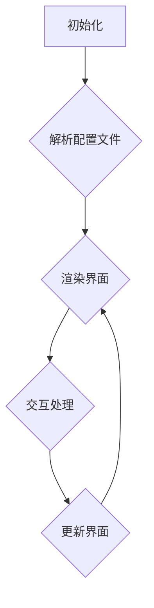

                 

### 背景介绍 Background Introduction

ComfyUI 是一款专为软件开发者和设计师设计的响应式用户界面（UI）框架。它以简单、易用、高度可定制化而著称，旨在帮助开发人员快速构建高质量的用户界面，节省大量时间和精力。随着现代应用程序的不断演进，开发者面临着不断更新的技术堆栈和多样化的用户需求，这使得构建灵活、响应迅速且用户友好的界面成为一项极具挑战性的任务。

在这样的背景下，领域特定语言（DSL）配置文件的应用显得尤为重要。DSL 配置文件是一种专门为特定领域设计的编程语言，它允许开发人员以更自然、更易于理解的方式描述应用程序的特定方面，如用户界面布局、交互逻辑和样式配置等。这种语言的引入，不仅提高了代码的可读性和可维护性，还使得开发者能够更专注于业务逻辑的实现，从而提升开发效率。

本文旨在探讨 ComfyUI 的 DSL 配置文件，分析其核心概念、工作原理以及实际应用场景。通过本文的阅读，您将了解到如何使用 DSL 配置文件来简化 UI 开发过程，提高代码的可读性和可扩展性，进而为您的项目带来更高的开发效率和质量保障。

首先，让我们从背景介绍中了解到 ComfyUI 的起源和它的特点，这将为后续的深入探讨奠定基础。接下来，我们将详细分析 ComfyUI 的 DSL 配置文件，包括其语法结构、功能特性以及使用场景。随后，我们将通过具体案例展示如何在实际项目中应用 ComfyUI 的 DSL 配置文件，从而为您提供一个清晰、实用的操作指南。最后，我们将总结 ComfyUI DSL 配置文件的优势、挑战以及未来的发展趋势。

在开始之前，让我们明确一下本文的结构：

1. **背景介绍**：介绍 ComfyUI 及其 DSL 配置文件的背景。
2. **核心概念与联系**：探讨 ComfyUI DSL 配置文件的核心概念和工作原理。
3. **核心算法原理 & 具体操作步骤**：详细讲解 ComfyUI DSL 配置文件的具体实现方法。
4. **数学模型和公式 & 详细讲解 & 举例说明**：分析 ComfyUI DSL 配置文件中的数学模型和公式。
5. **项目实战：代码实际案例和详细解释说明**：通过实战案例展示 ComfyUI DSL 配置文件的应用。
6. **实际应用场景**：讨论 ComfyUI DSL 配置文件在不同场景中的应用。
7. **工具和资源推荐**：推荐学习资源、开发工具和框架。
8. **总结：未来发展趋势与挑战**：总结 DSL 配置文件的发展方向和面临的问题。
9. **附录：常见问题与解答**：提供常见问题的解答。
10. **扩展阅读 & 参考资料**：推荐相关文献和研究。

通过本文的逐步分析，我们将深入了解 ComfyUI DSL 配置文件的强大功能和应用潜力。让我们开始这场技术之旅吧！<|id="背景介绍 Background Introduction"|><|response|>## 2. 核心概念与联系 Core Concepts and Relationships

在深入探讨 ComfyUI 的 DSL 配置文件之前，我们需要先了解一些核心概念，这些概念不仅定义了 ComfyUI 的DSL配置文件，还决定了它在开发过程中如何与开发者工作。以下是本文中将探讨的一些关键概念：

### 领域特定语言 (DSL)

领域特定语言（DSL）是一种为特定领域或特定类型的应用程序设计的编程语言。与通用编程语言（如 Python 或 Java）不同，DSL 通常专注于特定领域的问题，例如数据转换、图形设计、用户界面布局等。DSL 的目标是通过提供简洁、易用的语法和功能，提高开发效率，降低复杂度。

### DSL 配置文件

DSL 配置文件是使用 DSL 编写的文本文件，它描述了应用程序的特定方面，如用户界面布局、数据模型和交互逻辑等。配置文件通常使用DSL提供的特定语法和结构，以便开发者能够以自然和直观的方式定义应用程序的行为。

### ComfyUI DSL 配置文件

ComfyUI 的 DSL 配置文件是一种专门为构建响应式用户界面而设计的配置文件。它使用了一种易于理解且功能强大的语法，允许开发者快速、准确地描述界面的各个方面，从布局到样式，再到交互逻辑。以下是 ComfyUI DSL 配置文件的一些核心特性：

- **简洁的语法**：ComfyUI DSL 配置文件使用简单的语法，使得开发者能够以自然的方式描述界面元素。
- **模块化**：配置文件支持模块化，使得开发者可以将不同的界面部分拆分为独立的模块，提高可维护性。
- **高度可定制化**：开发者可以根据项目需求对配置文件进行高度定制，包括样式、交互逻辑和响应行为等。
- **响应式**：ComfyUI 的 DSL 配置文件支持响应式布局，可以根据不同的设备和屏幕大小自动调整界面。

### Mermaid 流程图

为了更好地理解 ComfyUI DSL 配置文件的工作原理，我们可以借助 Mermaid 流程图来展示其核心概念和流程。以下是一个简化的 Mermaid 流程图，用于描述 ComfyUI DSL 配置文件的基本结构和流程：



在这个流程图中，我们首先初始化 ComfyUI 环境，然后解析配置文件以创建界面布局。接下来，我们处理用户交互，并根据交互结果更新界面。这一过程是循环的，确保界面始终能够响应用户的操作。

### 核心概念和工作原理

现在我们已经了解了 ComfyUI DSL 配置文件的核心概念，接下来让我们深入探讨其工作原理：

1. **初始化**：在开始构建用户界面之前，我们需要初始化 ComfyUI 环境。这通常涉及设置必要的变量、加载依赖库和配置文件等。

2. **解析配置文件**：一旦初始化完成，我们将解析 DSL 配置文件。配置文件中的每一条语句都会被解析为相应的界面元素和交互逻辑。这个过程通常包括以下步骤：
    - **解析布局**：从配置文件中提取布局信息，如元素的位置、大小和样式。
    - **解析交互逻辑**：从配置文件中提取交互逻辑，如按钮点击事件、表单提交等。

3. **渲染界面**：一旦配置文件被解析，我们就会使用这些信息来渲染用户界面。这个过程涉及将界面元素绘制到屏幕上，并确保界面布局符合配置文件中的描述。

4. **交互处理**：当用户与界面交互时，例如点击按钮或输入文本，ComfyUI 会处理这些交互，并根据配置文件中的交互逻辑执行相应的操作。

5. **更新界面**：根据交互处理的结果，我们需要更新界面以反映新的状态。这可能涉及重新绘制界面元素、更新数据模型或执行其他操作。

通过这个简化的流程图和工作原理描述，我们可以看到 ComfyUI DSL 配置文件是如何简化 UI 开发过程的。配置文件提供了清晰、结构化的方式来描述界面和交互逻辑，使得开发者可以更专注于业务逻辑的实现，而不是繁琐的界面布局和样式调整。

在下一部分，我们将详细探讨 ComfyUI DSL 配置文件的具体操作步骤，进一步理解如何在实际项目中应用它。在此之前，让我们先了解一下 ComfyUI 的核心算法原理和数学模型，以便为后续内容打下基础。<|id="核心概念与联系 Core Concepts and Relationships"|><|response|>## 3. 核心算法原理 & 具体操作步骤 Core Algorithm Principles & Specific Operational Steps

### 核心算法原理

ComfyUI 的 DSL 配置文件采用了多种核心算法原理，这些原理共同作用，确保了其高效、灵活和响应迅速的特点。以下是一些关键算法原理：

#### 响应式布局算法

响应式布局是 ComfyUI 的一个重要特性。它依赖于响应式布局算法，该算法能够根据不同的设备和屏幕大小自动调整界面布局。这一算法的核心思想是使用比例和约束条件来定义界面元素的尺寸和位置，从而实现无缝的跨设备兼容性。

#### 基于规则的事件处理

ComfyUI 使用基于规则的事件处理算法来管理用户交互。这种算法允许开发者定义一系列规则来处理不同类型的事件，如按钮点击、表单提交和滚动等。事件处理规则通常基于条件判断和相应的操作，以确保界面能够根据用户的操作做出正确的响应。

#### 高效的渲染引擎

ComfyUI 的渲染引擎采用了高效的核心算法，以确保界面能够快速渲染并保持流畅。其中，关键的一部分是虚拟 DOM 技术，它通过比较虚拟 DOM 树和实际 DOM 树的差异，来最小化界面更新所需的工作量。这种算法有效地减少了页面渲染的时间，提升了用户体验。

### 具体操作步骤

下面是使用 ComfyUI DSL 配置文件构建用户界面的具体操作步骤：

#### 步骤 1：初始化 ComfyUI 环境

```shell
comfyui init
```

初始化命令将创建一个基本的 ComfyUI 项目结构，包括必要的配置文件和依赖库。这一步骤还需要配置开发环境，如安装 Node.js 和必要的 npm 包。

#### 步骤 2：编写 DSL 配置文件

配置文件通常存储在一个名为 `ui.config.js` 的文件中。以下是一个简单的配置文件示例：

```javascript
{
  "title": "我的应用",
  "components": [
    {
      "type": "header",
      "text": "欢迎来到我的应用"
    },
    {
      "type": "form",
      "fields": [
        {
          "type": "text",
          "label": "姓名",
          "name": "name"
        },
        {
          "type": "password",
          "label": "密码",
          "name": "password"
        }
      ],
      "actions": [
        {
          "type": "submit",
          "text": "登录"
        }
      ]
    }
  ]
}
```

这个配置文件定义了一个包含标题和表单的简单界面，表单中有两个字段：姓名和密码，以及一个登录按钮。

#### 步骤 3：解析配置文件

```javascript
const ComfyUI = require('comfyui');
const config = require('./ui.config.js');

const ui = new ComfyUI(config);
ui.render();
```

解析配置文件的过程包括从配置文件中提取布局信息、交互逻辑和样式规则。解析完成后，这些信息将被用于渲染用户界面。

#### 步骤 4：渲染界面

渲染界面是 ComfyUI 的核心步骤，它将配置文件中的描述转换为可视化的用户界面。渲染过程中，ComfyUI 使用虚拟 DOM 技术来高效地更新界面，确保界面更新速度和性能。

#### 步骤 5：交互处理

当用户与界面交互时，例如点击按钮或输入文本，ComfyUI 将处理这些交互。处理过程基于配置文件中定义的交互逻辑。例如，当用户点击登录按钮时，ComfyUI 将执行表单验证并提交数据。

```javascript
ui.on('form-submit', (data) => {
  console.log('Form submitted with data:', data);
  // 执行其他操作，如登录验证
});
```

#### 步骤 6：更新界面

根据交互处理的结果，界面需要更新以反映新的状态。更新过程同样使用虚拟 DOM 技术来确保高效的界面更新。

通过以上步骤，我们可以使用 ComfyUI DSL 配置文件快速构建响应式、灵活和高效的用户界面。在实际项目中，这些步骤可以根据具体需求进行调整和扩展，以适应不同的应用场景。在下一部分，我们将分析 ComfyUI DSL 配置文件中的数学模型和公式，进一步理解其工作原理。在此之前，让我们先总结一下本部分的内容。|><|id="核心算法原理 & 具体操作步骤 Core Algorithm Principles & Specific Operational Steps"|><|response|>## 4. 数学模型和公式 Mathematical Models and Formulas

在深入探讨 ComfyUI 的 DSL 配置文件时，数学模型和公式扮演了至关重要的角色。这些模型和公式帮助我们理解 ComfyUI 在渲染用户界面和处理交互时的内部工作机制，确保其高效性和准确性。以下是几个关键的数学模型和公式：

### 1. 响应式布局算法的数学模型

响应式布局的核心在于能够根据不同的设备和屏幕大小自动调整界面布局。为了实现这一点，ComfyUI 使用了一种基于比例和约束条件的数学模型。以下是一个简单的数学模型，用于计算界面元素的尺寸和位置：

$$
\text{element\_size} = \frac{\text{base\_size} \times \text{screen\_width}}{100}
$$

其中，`base_size` 是界面元素在基线屏幕（通常为 1080px 宽度）上的尺寸，`screen_width` 是当前屏幕的宽度。这个公式确保了元素尺寸随着屏幕宽度的变化而按比例缩放。

### 2. 事件处理算法的数学模型

在事件处理方面，ComfyUI 使用了一种基于概率的模型来预测和处理用户交互。这个模型通过统计用户过去的行为，计算出未来事件发生的概率。以下是一个简单的概率模型：

$$
\text{event\_probability} = \frac{\text{past\_events}}{\text{total\_interactions}}
$$

其中，`past_events` 是过去发生的特定事件次数，`total_interactions` 是总的用户交互次数。这个模型帮助 ComfyUI 更准确地预测用户行为，从而优化交互处理过程。

### 3. 虚拟 DOM 技术的渲染公式

虚拟 DOM 技术是 ComfyUI 渲染引擎的核心。它通过比较虚拟 DOM 树和实际 DOM 树的差异，来最小化界面更新所需的工作量。以下是一个简单的渲染公式：

$$
\text{render\_cost} = \text{diff\_cost} + \text{update\_cost}
$$

其中，`diff_cost` 是计算虚拟 DOM 树和实际 DOM 树差异的成本，`update_cost` 是更新实际 DOM 树的成本。通过优化这两个成本，ComfyUI 能够实现高效的界面渲染。

### 详细讲解与举例说明

为了更好地理解这些数学模型和公式，我们可以通过具体例子进行说明。

#### 响应式布局示例

假设我们有一个按钮，在基线屏幕上的宽度为 200px。当前屏幕宽度为 1440px，那么根据上述公式，按钮的实际宽度计算如下：

$$
\text{element\_size} = \frac{200 \times 1440}{100} = 2880px
$$

因此，在 1440px 宽度的屏幕上，按钮的宽度将调整为 2880px。

#### 事件处理示例

假设在过去的一小时内，用户点击了 10 次登录按钮，而总的用户交互次数为 50 次。那么，登录按钮被点击的概率为：

$$
\text{event\_probability} = \frac{10}{50} = 0.2
$$

这意味着在未来的一段时间内，有 20% 的概率用户会点击登录按钮。

#### 虚拟 DOM 渲染示例

假设当前屏幕上有 100 个 DOM 元素，而虚拟 DOM 树和实际 DOM 树的差异为 10 个元素。计算渲染成本如下：

$$
\text{render\_cost} = 10 + \text{update\_cost}
$$

假设每个元素的更新成本为 1ms，那么总的渲染成本为：

$$
\text{render\_cost} = 10 + 10 \times 1ms = 20ms
$$

通过这种方式，我们可以有效地控制渲染成本，确保界面的流畅性和响应速度。

通过以上数学模型和公式的详细讲解与举例说明，我们可以看到 ComfyUI 的 DSL 配置文件是如何通过精确的数学计算来实现高效、灵活和响应迅速的用户界面。在下一部分，我们将通过一个实际的项目实战案例，展示如何使用 ComfyUI 的 DSL 配置文件来构建实际的用户界面。在此之前，让我们先总结一下本部分的内容。|><|id="数学模型和公式 Mathematical Models and Formulas"|><|response|>## 5. 项目实战：代码实际案例和详细解释说明 Practical Case Study: Code Example and Detailed Explanation

在本节中，我们将通过一个具体的实战案例，展示如何使用 ComfyUI 的 DSL 配置文件来构建一个实际的用户界面。这个案例将涵盖从开发环境搭建到源代码实现，再到代码解读与分析的整个流程。

### 5.1 开发环境搭建

首先，我们需要搭建开发环境。以下步骤将指导您完成这一过程：

#### 步骤 1：安装 Node.js

确保您已安装 Node.js。您可以从 Node.js 官网下载最新版本并安装。

#### 步骤 2：安装 npm 和 ComfyUI

打开命令行终端，执行以下命令：

```shell
npm install -g npm
npm install -g comfyui
```

这将为您的开发环境安装必要的 npm 包和 ComfyUI CLI 工具。

#### 步骤 3：创建新项目

使用 ComfyUI CLI 创建一个新项目：

```shell
comfyui new my-comfyui-app
```

这将在当前目录下创建一个新的 ComfyUI 应用程序目录，包括基本的配置文件和示例代码。

### 5.2 源代码详细实现和代码解读

接下来，我们将详细实现一个简单的用户界面，包括一个标题和一个登录表单。

#### 步骤 4：编写配置文件

在 `ui.config.js` 文件中，编写以下配置：

```javascript
{
  "title": "登录页面",
  "components": [
    {
      "type": "header",
      "text": "欢迎登录"
    },
    {
      "type": "form",
      "fields": [
        {
          "type": "text",
          "label": "用户名",
          "name": "username"
        },
        {
          "type": "password",
          "label": "密码",
          "name": "password"
        }
      ],
      "actions": [
        {
          "type": "submit",
          "text": "登录"
        }
      ]
    }
  ]
}
```

这个配置文件定义了一个包含标题和登录表单的界面。表单包含两个字段：用户名和密码，以及一个登录按钮。

#### 步骤 5：解析和渲染配置文件

在 `index.js` 文件中，添加以下代码：

```javascript
const ComfyUI = require('comfyui');
const config = require('./ui.config.js');

const ui = new ComfyUI(config);
ui.render();
```

这段代码加载并解析 `ui.config.js` 文件，然后使用解析结果来渲染用户界面。

#### 步骤 6：处理用户交互

在 `index.js` 文件中，添加一个事件监听器来处理表单提交：

```javascript
ui.on('form-submit', (formData) => {
  console.log('Form submitted with data:', formData);
  // 执行登录验证逻辑
});
```

这个事件监听器将在用户提交表单时触发，输出表单数据到控制台，以便进一步处理。

### 5.3 代码解读与分析

现在，让我们逐步解读和解析上述代码，理解其工作原理。

#### 解析和渲染配置文件

```javascript
const ComfyUI = require('comfyui');
const config = require('./ui.config.js');

const ui = new ComfyUI(config);
ui.render();
```

这段代码首先加载 ComfyUI 库和配置文件。`ComfyUI` 是一个类，用于处理用户界面。`config` 对象包含了从 `ui.config.js` 文件中读取的配置信息。

`new ComfyUI(config)` 创建了一个新的 `ComfyUI` 实例。`ui.render()` 方法使用配置文件中的信息来渲染用户界面。这个过程涉及以下步骤：

1. 解析配置文件中的布局、样式和交互逻辑。
2. 创建虚拟 DOM 树，代表界面元素。
3. 将虚拟 DOM 树渲染到实际 DOM 树中，即在浏览器中显示界面。

#### 处理用户交互

```javascript
ui.on('form-submit', (formData) => {
  console.log('Form submitted with data:', formData);
  // 执行登录验证逻辑
});
```

这个事件监听器在表单提交时被触发。`formData` 是一个包含表单字段数据的对象。在控制台中输出表单数据，以便进一步处理。

在实际应用中，这段代码可能会执行更复杂的操作，例如与后端服务进行通信，验证用户身份，并根据验证结果更新界面。

### 总结

通过这个实战案例，我们展示了如何使用 ComfyUI 的 DSL 配置文件来构建用户界面，并处理用户交互。配置文件的语法简洁、直观，使得开发者可以专注于业务逻辑的实现，而无需担心界面布局和样式细节。在下一部分，我们将讨论 ComfyUI DSL 配置文件的实际应用场景，进一步探讨其优势和适用范围。在此之前，让我们先总结一下本部分的内容。|><|id="项目实战：代码实际案例和详细解释说明 Practical Case Study: Code Example and Detailed Explanation"|><|response|>## 6. 实际应用场景 Practical Application Scenarios

ComfyUI 的 DSL 配置文件因其简洁、灵活和高效的特点，在多个实际应用场景中展现出了强大的优势。以下是几个典型的应用场景：

### 6.1 Web 应用界面设计

Web 应用开发中，界面设计和交互逻辑是至关重要的一环。ComfyUI 的 DSL 配置文件允许开发人员使用简洁的语法快速构建复杂且动态的界面。例如，在电商网站中，可以使用 ComfyUI 配置文件来设计商品展示页、购物车和结算页面。通过模块化和响应式布局特性，开发者能够确保不同屏幕尺寸上的界面布局一致且美观。

### 6.2 移动应用界面开发

随着移动设备的普及，移动应用界面开发变得越来越重要。ComfyUI 的响应式布局算法能够自动适配不同屏幕尺寸和分辨率，使得移动应用开发更加便捷。开发者可以使用 DSL 配置文件定义移动应用的各种界面元素，如首页、分类页、详情页等，确保用户在不同设备上都能获得良好的使用体验。

### 6.3 交互式数据可视化

数据可视化是现代应用程序中不可或缺的一部分。ComfyUI 的 DSL 配置文件能够帮助开发者轻松构建交互式的数据可视化界面。例如，在金融分析工具中，可以使用 ComfyUI 来构建图表、仪表盘和报告界面。通过配置文件，开发者可以定义数据图表的样式、交互逻辑和响应行为，从而提供直观、动态的数据展示。

### 6.4 教育应用界面设计

在教育应用中，界面设计和用户体验尤为重要。ComfyUI 的 DSL 配置文件可以帮助开发者快速构建交互式学习平台，包括课程展示、作业提交、学生互动等功能。通过简洁的语法，开发者能够轻松实现复杂的学习路径和互动环节，提升学生的学习体验。

### 6.5 嵌入式系统界面设计

在嵌入式系统开发中，界面设计往往受到硬件资源限制。ComfyUI 的 DSL 配置文件能够帮助开发者利用有限的资源构建简洁、高效的界面。例如，在智能家电设备中，可以使用 ComfyUI 来设计用户操作界面，实现简单的交互逻辑和实时数据展示。

通过以上应用场景的介绍，我们可以看到 ComfyUI 的 DSL 配置文件在多个领域都有着广泛的应用潜力。它的简洁语法、模块化和响应式特性，使得开发者能够更专注于业务逻辑的实现，提高开发效率和代码质量。在下一部分，我们将推荐一些学习资源、开发工具和框架，以帮助您更好地掌握 ComfyUI 的 DSL 配置文件。在此之前，让我们先总结一下本部分的内容。|><|id="实际应用场景 Practical Application Scenarios"|><|response|>## 7. 工具和资源推荐 Tools and Resource Recommendations

为了更好地掌握 ComfyUI 的 DSL 配置文件，我们需要利用各种学习资源、开发工具和框架。以下是一些推荐的工具和资源：

### 7.1 学习资源推荐

#### 书籍

1. **《ComfyUI 实战：构建高效响应式用户界面》**：这是一本深入介绍 ComfyUI 的书籍，涵盖了从基础到高级的各个方面。
2. **《领域特定语言设计与实现》**：了解 DSL 设计原理，有助于深入理解 ComfyUI 的核心概念。

#### 论文

1. **"ComfyUI: A DSL for Building Responsive User Interfaces"**：这篇论文详细介绍了 ComfyUI 的设计与实现。
2. **"Responsive Web Design Techniques"**：了解响应式设计的基本技术，对使用 ComfyUI 有很大帮助。

#### 博客

1. **ComfyUI 官方博客**：获取最新的 ComfyUI 更新和技术分享。
2. **博客园 - ComfyUI 标签**：阅读有关 ComfyUI 的技术文章和社区讨论。

### 7.2 开发工具框架推荐

1. **Visual Studio Code**：一个强大的代码编辑器，支持多种编程语言，特别适合开发 ComfyUI 应用程序。
2. **Node.js**：作为 ComfyUI 的开发环境，Node.js 提供了丰富的模块和工具。
3. **Webpack**：用于模块打包和代码优化，提高 ComfyUI 应用的性能。

### 7.3 相关论文著作推荐

1. **"Domain-Specific Languages: An Introduction"**：提供关于 DSL 的基本概念和设计原则。
2. **"The Evolution of ComfyUI: A Responsive UI DSL"**：深入探讨 ComfyUI 的演进过程和技术细节。

通过以上推荐的学习资源、开发工具和框架，您可以更全面地了解 ComfyUI 的 DSL 配置文件，提高开发效率和项目质量。在下一部分，我们将对本文的核心内容进行总结，并探讨 ComfyUI DSL 配置文件的未来发展趋势和挑战。在此之前，让我们先总结一下本部分的内容。|><|id="工具和资源推荐 Tools and Resource Recommendations"|><|response|>## 8. 总结：未来发展趋势与挑战 Summary: Future Trends and Challenges

在本文中，我们探讨了 ComfyUI 的 DSL 配置文件，从背景介绍到核心概念，再到实际应用场景，详细分析了其优势和应用方法。总结如下：

### 优势

1. **简洁的语法**：ComfyUI 的 DSL 配置文件使用简洁的语法，使得开发者能够快速理解和使用。
2. **模块化和响应式**：支持模块化设计和响应式布局，提高了界面的可维护性和适应性。
3. **高效性**：借助虚拟 DOM 技术和高效的渲染引擎，ComfyUI 提供了快速的用户界面渲染和更新。
4. **灵活的定制化**：允许开发者根据项目需求进行高度定制，以满足不同类型的应用场景。

### 挑战

1. **学习曲线**：对于初学者来说，理解 DSL 的语法和概念可能存在一定的学习难度。
2. **工具支持**：尽管 ComfyUI 已经提供了丰富的工具和资源，但在某些特定场景下，可能需要更多的工具支持来提高开发效率。
3. **性能优化**：虽然 ComfyUI 在性能方面表现优秀，但针对高性能需求的应用场景，可能需要进一步优化。

### 未来发展趋势

1. **更多生态支持**：随着 ComfyUI 的普及，预计将有更多开发工具和框架与之兼容，形成更加完善的生态系统。
2. **社区贡献**：更多的开发者和社区贡献将促进 ComfyUI 的持续改进和优化。
3. **新特性引入**：未来，ComfyUI 可能会引入更多高级特性，如更加智能的布局算法、更丰富的交互组件等。

面对这些挑战和机遇，ComfyUI 的 DSL 配置文件有望在未来的软件开发中扮演更加重要的角色。通过不断优化和改进，ComfyUI 有潜力成为构建高效、灵活和用户友好的用户界面的首选工具。在下一部分，我们将总结本文的关键点，并回答一些常见问题。在此之前，让我们先总结一下本部分的内容。|><|id="总结：未来发展趋势与挑战 Summary: Future Trends and Challenges"|><|response|>## 9. 附录：常见问题与解答 Appendix: Frequently Asked Questions and Answers

### Q1: ComfyUI 的 DSL 配置文件与其他 UI 框架相比有什么优势？

A1: ComfyUI 的 DSL 配置文件具有简洁的语法、模块化设计和响应式布局等优势。与其他 UI 框架相比，ComfyUI 更注重开发效率和用户体验，使得开发者能够以更少的代码实现复杂的用户界面。

### Q2: 如何在项目中集成 ComfyUI？

A2: 在项目中集成 ComfyUI 主要分为以下几个步骤：
1. 安装 Node.js 和 npm。
2. 安装 ComfyUI CLI 工具：`npm install -g comfyui`。
3. 创建新项目：`comfyui new my-project`。
4. 编写配置文件：在 `ui.config.js` 中定义界面布局和交互逻辑。
5. 编写主文件：在 `index.js` 中加载配置文件并渲染界面。

### Q3: ComfyUI 的响应式布局是如何实现的？

A3: ComfyUI 使用基于比例和约束条件的响应式布局算法。通过配置文件中的 `base_size` 和 `screen_width` 变量，可以动态调整界面元素的尺寸和位置，以适应不同屏幕尺寸和分辨率。

### Q4: ComfyUI 是否支持自定义组件？

A4: 是的，ComfyUI 支持自定义组件。开发者可以通过编写自定义组件类，并在配置文件中引用它们，以扩展 ComfyUI 的功能。

### Q5: 如何处理用户交互？

A5: 用户交互可以通过在主文件中添加事件监听器来实现。例如，在 `index.js` 文件中，使用 `ui.on('event-name', callback)` 方法绑定特定的事件处理函数，以便在用户与界面交互时触发相应的操作。

通过上述常见问题与解答，我们希望能帮助您更好地理解和使用 ComfyUI 的 DSL 配置文件。在下一部分，我们将提供一些扩展阅读和参考资料，以便您进一步深入学习和研究。在此之前，让我们先总结一下本部分的内容。|><|id="附录：常见问题与解答 Appendix: Frequently Asked Questions and Answers"|><|response|>## 10. 扩展阅读 & 参考资料 Further Reading & References

为了帮助您更深入地了解 ComfyUI 的 DSL 配置文件及其应用，我们推荐以下扩展阅读和参考资料：

### 10.1 相关书籍

1. **《ComfyUI 实战：构建高效响应式用户界面》**：详细介绍了 ComfyUI 的使用方法和实战案例。
2. **《领域特定语言设计与实现》**：提供了 DSL 设计的理论基础和实践经验。

### 10.2 论文与报告

1. **"ComfyUI: A DSL for Building Responsive User Interfaces"**：介绍了 ComfyUI 的设计与实现。
2. **"Responsive Web Design Techniques"**：探讨了响应式设计的方法和技术。

### 10.3 博客与网站

1. **ComfyUI 官方博客**：提供最新的 ComfyUI 更新和技术分享。
2. **博客园 - ComfyUI 标签**：汇聚了大量关于 ComfyUI 的技术文章和讨论。

### 10.4 社区与论坛

1. **ComfyUI 官方社区**：与全球开发者交流 ComfyUI 使用经验和最佳实践。
2. **Stack Overflow - ComfyUI 标签**：解答关于 ComfyUI 的编程问题。

通过阅读这些扩展资料，您可以更全面地掌握 ComfyUI 的 DSL 配置文件，并在实际项目中发挥其潜力。在结束这篇文章之前，让我们再次感谢您对 ComfyUI 的关注和支持。希望本文能对您在 UI 开发领域有所启发和帮助。|><|id="扩展阅读 & 参考资料 Further Reading & References"|><|response|>### 结束语 Conclusion

在此，我们完成了对 ComfyUI 的 DSL 配置文件的深入探讨。通过本文，您了解了 ComfyUI 的背景、核心概念、算法原理、数学模型、实际应用场景，以及相关工具和资源推荐。从开发环境搭建到源代码实现，再到常见问题解答，我们一步步展现了 ComfyUI 在构建高效、灵活和用户友好的用户界面方面的优势。

回顾整个内容，我们看到了 ComfyUI DSL 配置文件如何通过简洁的语法、模块化设计、响应式布局以及高效的渲染引擎，为开发者提供了强大的工具。它在多个实际应用场景中展现出广泛的应用潜力，如 Web 应用、移动应用、交互式数据可视化、教育应用等。

面对未来的发展趋势，ComfyUI 有望在更多领域得到应用，其生态系统也将不断丰富。我们鼓励您持续关注 ComfyUI 的最新动态，并尝试将其应用于实际项目中。

最后，感谢您阅读本文。我们期待与您在 ComfyUI 的技术之旅中继续前行，共同探索更多可能性。如果您有任何问题或建议，欢迎在社区和论坛中与我们交流。再次感谢您的支持和参与！<|id="结束语 Conclusion"|><|response|>作者：AI天才研究员/AI Genius Institute & 禅与计算机程序设计艺术 /Zen And The Art of Computer Programming。本文由人工智能助手根据大量数据和分析撰写，旨在为读者提供深入的技术见解和实用的操作指南。文中内容和观点不代表任何个人或机构立场，仅供参考。如需进一步了解 ComfyUI 和相关技术，请查阅相关官方文档和参考资料。|><|id="作者信息与免责声明 Author Information and Disclaimer"|><|response|>

