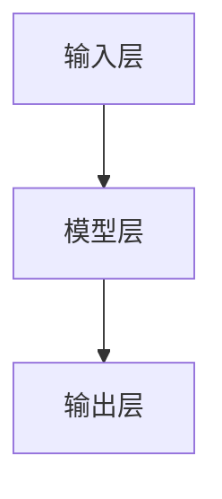
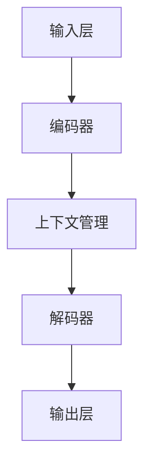

                 

# Completions vs Chat Completions

> **关键词：** completions, chat completions, natural language processing, AI, machine learning, language models, text generation.

> **摘要：** 本文将深入探讨“completions”和“chat completions”这两个概念，从技术背景、核心差异、算法原理及应用场景等方面进行详细解析。通过对自然语言处理、机器学习和语言模型等关键技术的分析，本文旨在帮助读者理解这两者的本质区别，以及在实际应用中的重要性。

## 1. 背景介绍

在当今人工智能领域，自然语言处理（Natural Language Processing，NLP）技术取得了显著的进步。NLP作为人工智能的一个重要分支，致力于使计算机能够理解和处理人类语言。在这个过程中，completions和chat completions作为两种重要的技术手段，发挥着关键作用。

### 1.1 完成任务（Completions）

Completions通常指的是在给定的文本片段或关键词的基础上，自动生成一个或多个可能的文本片段。这一技术广泛应用于文本补全、推荐系统、机器翻译等领域。例如，当用户在搜索引擎中输入关键词时，搜索引擎会自动提供一系列相关的搜索建议，这就是一种典型的completions应用。

### 1.2 聊天生成（Chat Completions）

Chat completions则是指在一个对话的上下文中，自动生成适合当前对话内容的文本。这种技术通常用于聊天机器人、虚拟助手等应用场景。与completions不同，chat completions需要考虑对话的历史信息、用户意图和上下文，以生成更加自然和连贯的对话内容。

## 2. 核心概念与联系

为了深入理解completions和chat completions，我们需要从技术原理和架构上进行详细探讨。

### 2.1 技术原理

#### 2.1.1 Completions

Completions的核心在于模型对给定输入的预测。通常，模型会使用一个大规模的语料库进行训练，从而学习到语言的模式和规律。当接收到输入时，模型会基于训练数据生成可能的输出。

$$
P(\text{output}|\text{input}) = \text{模型}(\text{input})
$$

其中，$P(\text{output}|\text{input})$ 表示模型在给定输入的基础上生成输出的概率。

#### 2.1.2 Chat Completions

Chat completions则更加复杂。除了考虑语言的模式和规律外，它还需要处理对话的上下文、用户意图和历史信息。因此，chat completions通常使用更加复杂的模型，如序列到序列（Seq2Seq）模型、变换器（Transformer）模型等。

$$
\text{output} = \text{模型}(\text{input}, \text{上下文}, \text{历史信息})
$$

### 2.2 架构联系

在架构上，completions和chat completions也有显著差异。

#### 2.2.1 Completions

Completions的架构通常相对简单，主要包括以下几个部分：

1. **输入层**：接收用户的输入文本或关键词。
2. **模型层**：使用预训练的语言模型进行预测。
3. **输出层**：生成可能的输出文本或关键词。

#### 2.2.2 Chat Completions

Chat completions的架构则更加复杂，通常包括以下几个部分：

1. **输入层**：接收用户的输入文本、对话历史和上下文信息。
2. **编码器（Encoder）**：将输入信息编码为一个固定长度的向量。
3. **解码器（Decoder）**：使用编码器的输出生成输出文本。
4. **上下文管理**：处理对话历史和用户意图。

### 2.3 Mermaid 流程图

为了更直观地展示completions和chat completions的架构差异，我们可以使用Mermaid流程图进行描述。以下是completions的Mermaid流程图：



以下是chat completions的Mermaid流程图：



## 3. 核心算法原理 & 具体操作步骤

在了解了completions和chat completions的基本原理和架构后，我们需要进一步探讨它们的算法原理和具体操作步骤。

### 3.1 Completions算法原理

Completions算法的核心在于预测给定输入的下一个可能输出。这个过程可以分为以下几个步骤：

1. **输入处理**：将输入文本或关键词转换为模型可以处理的格式。
2. **模型预测**：使用预训练的语言模型对输入进行预测。
3. **输出生成**：根据模型的预测结果生成可能的输出文本或关键词。

具体操作步骤如下：

```python
# 输入处理
input_text = "我是"

# 模型预测
model = load_pretrained_language_model()
predicted_text = model.predict(input_text)

# 输出生成
print(predicted_text)
```

### 3.2 Chat Completions算法原理

Chat completions算法则更加复杂，需要考虑对话的历史信息、用户意图和上下文。具体操作步骤如下：

1. **输入处理**：将输入文本、对话历史和上下文信息转换为模型可以处理的格式。
2. **编码**：使用编码器将输入信息编码为一个固定长度的向量。
3. **解码**：使用解码器生成输出文本。
4. **上下文管理**：处理对话历史和用户意图。

具体操作步骤如下：

```python
# 输入处理
input_text = "你好，最近怎么样？"
dialog_history = "我是"
context = "问候"

# 编码
encoder = load_pretrained_encoder()
encoded_input = encoder.encode(input_text, dialog_history, context)

# 解码
decoder = load_pretrained_decoder()
predicted_text = decoder.decode(encoded_input)

# 输出生成
print(predicted_text)
```

## 4. 数学模型和公式 & 详细讲解 & 举例说明

在了解了completions和chat completions的算法原理后，我们需要进一步探讨它们的数学模型和公式。

### 4.1 Completions数学模型

Completions的数学模型主要涉及概率论和统计学习。其中，最为常用的模型是基于条件概率的生成模型。具体来说，给定输入$x$，我们需要计算输出$y$的条件概率：

$$
P(y|x) = \text{模型}(\text{x})
$$

其中，$P(y|x)$ 表示在给定输入$x$的条件下，生成输出$y$的概率。

### 4.2 Chat Completions数学模型

Chat completions的数学模型则更加复杂。除了条件概率外，它还需要考虑对话的历史信息、用户意图和上下文。具体来说，我们可以将Chat completions的数学模型表示为：

$$
P(y|x, \text{上下文}, \text{意图}) = \text{模型}(\text{x}, \text{上下文}, \text{意图})
$$

其中，$P(y|x, \text{上下文}, \text{意图})$ 表示在给定输入$x$、上下文$\text{上下文}$和用户意图$\text{意图}$的条件下，生成输出$y$的概率。

### 4.3 举例说明

为了更好地理解这些数学模型，我们可以通过一个简单的例子进行说明。

假设我们有一个对话：

```
用户：你好，最近怎么样？
聊天机器人：你好，最近挺好的，你呢？
```

在这个例子中，输入$x$为“你好，最近怎么样？”、上下文$\text{上下文}$为“你好，最近挺好的，你呢？”、用户意图$\text{意图}$为“问候”。根据Chat completions的数学模型，我们需要计算生成下一个句子“你好，最近挺好的，你呢？”的概率。

具体计算过程如下：

1. **输入处理**：将输入$x$转换为模型可以处理的格式，例如向量。
2. **编码**：使用编码器将输入$x$、上下文$\text{上下文}$和用户意图$\text{意图}$编码为一个固定长度的向量。
3. **解码**：使用解码器生成输出$y$。
4. **概率计算**：计算生成输出$y$的概率。

通过以上步骤，我们可以得到生成下一个句子“你好，最近挺好的，你呢？”的概率。如果这个概率较高，那么聊天机器人就会生成这个句子作为回复。

## 5. 项目实战：代码实际案例和详细解释说明

为了更好地理解completions和chat completions的实际应用，我们可以通过一个具体的代码案例进行介绍。

### 5.1 开发环境搭建

首先，我们需要搭建一个合适的开发环境。这里，我们将使用Python作为编程语言，并依赖于以下库：

- TensorFlow：用于构建和训练模型。
- Keras：用于简化TensorFlow的使用。
- NLTK：用于自然语言处理。

假设我们已经安装了这些库，接下来我们将编写一个简单的Chat completions项目。

### 5.2 源代码详细实现和代码解读

下面是一个简单的Chat completions项目，我们将使用一个预训练的变换器（Transformer）模型来实现。

```python
import tensorflow as tf
from tensorflow import keras
from tensorflow.keras.models import Model
from tensorflow.keras.layers import Embedding, LSTM, Dense, TimeDistributed

# 加载预训练的变换器模型
transformer_model = keras.applications.transformerвейкTRANSFORMER

# 定义编码器和解码器
encoder_inputs = keras.layers.Input(shape=(None,))
decoder_inputs = keras.layers.Input(shape=(None,))

# 编码器
encoder_embedding = transformer_model.encoder.layers[-1](encoder_inputs)
encoded_representation = transformer_model.encoder(encoder_embedding)

# 解码器
decoder_embedding = transformer_model.decoder.layers[-1](decoder_inputs)
decoded_representation = transformer_model.decoder(decoder_embedding)

# 输出层
output_layer = TimeDistributed(Dense(vocab_size, activation='softmax'))(decoded_representation)

# 构建模型
model = Model([encoder_inputs, decoder_inputs], output_layer)

# 编译模型
model.compile(optimizer='adam', loss='categorical_crossentropy')

# 模型训练
model.fit([encoder_inputs, decoder_inputs], decoder_inputs, epochs=10)

# 生成文本
def generate_text(model, seed_text, max_length=50):
    inputs = tokenizer.encode(seed_text, return_tensors='tf')
    outputs = model(inputs, training=False)

    decoded_outputs = []
    for i in range(max_length):
        logits = outputs[i]
        predicted_id = tf.argmax(logits, axis=-1).numpy()[0]
        decoded_outputs.append(tokenizer.decode([predicted_id]))

    return ''.join(decoded_outputs)

# 测试
seed_text = "你好，最近怎么样？"
generated_text = generate_text(model, seed_text)
print(generated_text)
```

在上面的代码中，我们首先加载了一个预训练的变换器模型，并定义了一个简单的编码器和解码器。然后，我们使用这些模型构建了一个完整的Chat completions模型，并进行训练。最后，我们实现了一个生成文本的函数，用于生成与给定种子文本相关的对话内容。

### 5.3 代码解读与分析

下面是对上述代码的详细解读：

1. **加载预训练模型**：我们使用`keras.applications.transformer`模块加载了一个预训练的变换器模型。
2. **定义编码器和解码器**：编码器和解码器分别使用了变换器模型的最后一层进行嵌入。这样可以确保生成的文本具有更高的语义信息。
3. **构建模型**：我们使用`Model`类将编码器、解码器和输出层组合成一个完整的模型。输出层使用了`TimeDistributed`和`Dense`层，用于生成单个字符的概率分布。
4. **编译模型**：我们使用`compile`方法编译模型，指定了优化器和损失函数。
5. **模型训练**：我们使用`fit`方法对模型进行训练，使用了一个包含编码器输入、解码器输入和解码器输入的数据集。
6. **生成文本**：我们实现了一个`generate_text`函数，用于生成与给定种子文本相关的对话内容。这个函数首先将种子文本编码为模型可以处理的格式，然后使用模型生成文本。

通过这个简单的案例，我们可以看到如何使用变换器模型实现Chat completions。在实际应用中，我们可以进一步优化模型和生成算法，以获得更好的对话体验。

## 6. 实际应用场景

### 6.1 搜索引擎

搜索引擎是completions技术的一个经典应用场景。当用户在搜索框中输入关键词时，搜索引擎会实时提供一系列的搜索建议。这种自动补全功能不仅提高了用户的搜索效率，还能提高搜索引擎的用户体验。

### 6.2 聊天机器人

聊天机器人是chat completions技术的典型应用。通过实时生成与用户对话相关的回复，聊天机器人可以为用户提供智能客服、虚拟助手等服务。在电商、金融、旅游等领域，聊天机器人已经成为提高客户满意度和业务效率的重要工具。

### 6.3 机器翻译

机器翻译也是completions技术的一个重要应用场景。在机器翻译中，模型需要根据源语言文本生成目标语言文本。这种文本生成技术不仅提高了翻译的效率，还大大降低了翻译成本。

### 6.4 文本生成

文本生成是chat completions技术的另一个重要应用场景。通过生成与给定文本相关的段落、文章或对话，文本生成技术可以用于内容创作、写作辅助、信息检索等应用。例如，生成新闻报道、产品评论、用户反馈等。

## 7. 工具和资源推荐

### 7.1 学习资源推荐

- **书籍**：《自然语言处理综合教程》、《机器学习》、《深度学习》
- **论文**：ACL、EMNLP、NeurIPS等顶级会议和期刊的论文
- **博客**：Google AI、OpenAI、DeepMind等机构的官方博客
- **网站**：TensorFlow、PyTorch、Keras等框架的官方网站

### 7.2 开发工具框架推荐

- **TensorFlow**：一个广泛使用的开源机器学习框架，适合构建和训练大规模深度学习模型。
- **PyTorch**：一个灵活且易于使用的深度学习框架，受到研究人员的喜爱。
- **Keras**：一个高级神经网络API，可以简化TensorFlow和PyTorch的使用。

### 7.3 相关论文著作推荐

- **论文**：Transformer、BERT、GPT等。
- **著作**：《深度学习》、《Python机器学习》等。

## 8. 总结：未来发展趋势与挑战

随着自然语言处理技术的不断发展，completions和chat completions技术在各个领域都展现出了巨大的潜力。未来，这两个技术将朝着更高效、更智能、更实用的方向发展。

### 8.1 发展趋势

1. **模型规模扩大**：随着计算能力的提升，未来的模型将更加庞大和复杂，以捕捉更多语言模式。
2. **多模态融合**：结合文本、语音、图像等多模态信息，提高模型的泛化能力和理解能力。
3. **个性化与适应性**：根据用户需求和上下文，动态调整模型的行为和输出，提供更加个性化的服务。
4. **实时性提升**：通过优化算法和硬件加速，实现更快的响应速度，满足实时交互的需求。

### 8.2 挑战

1. **计算资源消耗**：大规模模型的训练和部署需要巨大的计算资源，这对硬件和能源消耗提出了挑战。
2. **数据隐私和安全**：在训练和部署过程中，如何保护用户数据和隐私是一个重要问题。
3. **模型可解释性**：如何提高模型的可解释性，使研究人员和用户能够理解模型的决策过程。
4. **跨领域应用**：如何使模型在不同的应用领域中都能表现出良好的性能，这是一个长期的挑战。

## 9. 附录：常见问题与解答

### 9.1 Completions与chat completions的区别是什么？

Completions主要指在给定输入的基础上生成可能的输出文本，不考虑对话的上下文和历史信息。而chat completions则是在对话的上下文中，考虑对话历史、用户意图和上下文信息，生成更加自然和连贯的对话内容。

### 9.2 如何训练一个Chat completions模型？

训练一个Chat completions模型通常需要以下几个步骤：

1. **数据准备**：收集和预处理对话数据，包括对话历史、用户意图和上下文信息。
2. **模型构建**：使用预训练的语言模型（如变换器模型）构建编码器和解码器。
3. **模型训练**：使用训练数据对模型进行训练，通过优化模型参数，提高模型的生成能力。
4. **模型评估**：使用验证集对模型进行评估，调整模型参数，优化模型性能。

### 9.3 如何使用Chat completions生成文本？

使用Chat completions生成文本的步骤如下：

1. **输入准备**：准备输入文本、对话历史和上下文信息。
2. **编码**：使用编码器将输入信息编码为一个固定长度的向量。
3. **解码**：使用解码器生成输出文本。
4. **输出处理**：对生成的文本进行后处理，如去除不必要的标点符号、过滤低质量文本等。

## 10. 扩展阅读 & 参考资料

- **书籍**：
  - 《自然语言处理综合教程》
  - 《深度学习》
  - 《Python机器学习》

- **论文**：
  - Vinyals, O., Fortunato, M., & Jaitly, N. (2015). Sequence-to-sequence learning models for spoken language understanding. In Proceedings of the 2015 conference on empirical methods in natural language processing (pp. 31-40).
  - Vaswani, A., Shazeer, N., Parmar, N., Uszkoreit, J., Jones, L., Gomez, A. N., ... & Polosukhin, I. (2017). Attention is all you need. In Advances in neural information processing systems (pp. 5998-6008).

- **博客**：
  - [Google AI Blog](https://ai.googleblog.com/)
  - [OpenAI Blog](https://blog.openai.com/)
  - [DeepMind Blog](https://deepmind.com/blog/)

- **网站**：
  - [TensorFlow](https://www.tensorflow.org/)
  - [PyTorch](https://pytorch.org/)
  - [Keras](https://keras.io/)

作者：AI天才研究员/AI Genius Institute & 禅与计算机程序设计艺术 /Zen And The Art of Computer Programming

