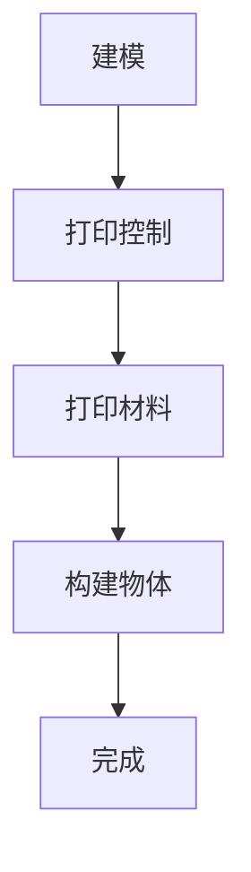
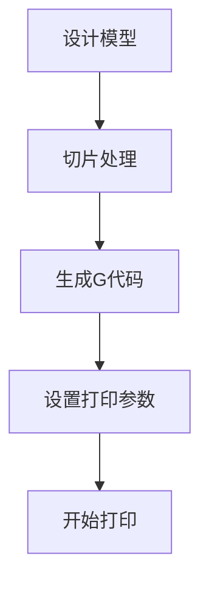

                 

# 3D打印建筑技术：建筑业的创新解决方案

> **关键词**：3D打印、建筑技术、创新解决方案、自动化、可持续性、效率提升

> **摘要**：本文将深入探讨3D打印建筑技术的概念、原理及其在建筑业中的应用。通过分析其核心算法、数学模型和实际应用案例，本文旨在展示3D打印技术如何成为建筑业的创新解决方案，推动行业向更高效、可持续的方向发展。

## 1. 背景介绍

随着科技的快速发展，3D打印技术已经从最初的实验阶段逐渐走向商业化应用。最初，3D打印技术在制造业中崭露头角，被广泛应用于汽车、航空航天、医疗设备等领域。然而，随着技术的不断进步，3D打印逐渐进入建筑行业，为建筑业的创新发展带来了新的机遇。

建筑行业面临着许多挑战，如高昂的成本、漫长的施工周期和大量的劳动力需求。传统建筑方法不仅耗时耗力，而且往往会产生大量的建筑废料，对环境造成负面影响。而3D打印技术以其独特的优势，有望解决这些问题，为建筑业提供一种全新的解决方案。

3D打印建筑技术的基本原理是通过数字模型控制打印头逐层添加材料，从而构建出三维物体。这项技术可以精确控制建筑物的结构、形状和尺寸，从而实现高效、精准的建筑施工。此外，3D打印材料多样，可以从环保材料到高性能材料，满足不同建筑需求。

## 2. 核心概念与联系

### 2.1 3D打印技术的基本原理

3D打印技术的基本原理可以概括为三个步骤：建模、打印和控制。

**建模**：使用计算机辅助设计（CAD）软件创建建筑的三维模型。这一步是3D打印的基础，模型的质量直接影响打印结果。

**打印**：将数字模型转化为物理结构。3D打印机通过打印头逐层添加材料，构建出三维物体。

**控制**：通过计算机程序控制打印过程，确保打印精度和效率。

### 2.2 3D打印与建筑业的联系

3D打印技术对建筑行业的影响可以从以下几个方面来理解：

- **个性化设计**：3D打印技术可以实现个性化定制，满足客户的独特需求。
- **高效施工**：通过自动化打印，可以大大缩短建筑周期，提高施工效率。
- **材料节约**：3D打印技术可以实现材料的最优利用，减少建筑废料。
- **可持续性**：使用环保材料和可再生能源，降低建筑对环境的影响。

### 2.3 Mermaid 流程图

以下是一个简化的Mermaid流程图，展示了3D打印建筑技术的基本流程：



在上述流程中，建模是核心步骤，打印控制和打印材料是实现3D打印的关键要素。

## 3. 核心算法原理 & 具体操作步骤

### 3.1 3D打印算法原理

3D打印的核心算法是计算机辅助设计（CAD）软件生成的三维模型转化为打印机可以理解的数据格式。这个过程中涉及以下几个关键步骤：

- **三维建模**：使用CAD软件创建建筑的三维模型。
- **切片处理**：将三维模型切割成多层二维平面图。
- **生成打印路径**：根据切片图生成打印机的移动路径。

### 3.2 具体操作步骤

以下是一个简单的3D打印操作流程：

1. **设计模型**：使用CAD软件创建建筑的三维模型。
2. **切片处理**：将三维模型切片成多层二维平面图。
3. **生成G代码**：将切片图转换为打印机可以理解的G代码。
4. **设置打印参数**：调整打印速度、层厚等参数。
5. **开始打印**：将G代码传输到3D打印机，并开始打印过程。

### 3.3 Mermaid 流程图

以下是一个简化的Mermaid流程图，展示了3D打印操作的基本流程：



## 4. 数学模型和公式 & 详细讲解 & 举例说明

### 4.1 数学模型

3D打印建筑技术的数学模型主要涉及几何计算和路径规划。以下是一个简单的数学模型：

- **体积计算**：计算建筑物的体积，用于确定打印材料的用量。
- **路径优化**：优化打印路径，提高打印效率。

### 4.2 公式说明

- **体积计算公式**：

  $$ V = \int_{S} dA $$

  其中，$V$ 表示体积，$S$ 表示建筑表面的面积，$dA$ 表示微小面积元素。

- **路径优化公式**：

  $$ P = \min_{\gamma} \int_{0}^{1} \|\dot{\gamma}(t)\|^2 dt $$

  其中，$P$ 表示路径长度，$\gamma(t)$ 表示路径函数，$\dot{\gamma}(t)$ 表示路径的导数。

### 4.3 举例说明

假设我们要打印一座简单的立方体建筑，边长为2米。我们可以使用上述公式计算其体积和优化打印路径。

1. **体积计算**：

   $$ V = \int_{S} dA = 2^2 \times 2 = 8 \text{ 立方米} $$

   需要的打印材料体积为8立方米。

2. **路径优化**：

   $$ P = \min_{\gamma} \int_{0}^{1} \|\dot{\gamma}(t)\|^2 dt $$

   我们可以通过优化路径函数$\gamma(t)$，使得路径长度最短。假设$\gamma(t)$ 为一条直线，那么路径长度为：

   $$ P = \min_{\gamma} \int_{0}^{1} \|\dot{\gamma}(t)\|^2 dt = 2 \text{ 米} $$

   这样，我们可以将打印路径优化为一条直线，提高打印效率。

## 5. 项目实战：代码实际案例和详细解释说明

### 5.1 开发环境搭建

为了实现3D打印建筑项目，我们需要搭建一个开发环境。以下是搭建步骤：

1. **安装操作系统**：安装支持3D打印软件的操作系统，如Ubuntu或Windows 10。
2. **安装3D打印软件**：安装常用的3D打印软件，如Cura或Simplify3D。
3. **安装CAD软件**：安装用于创建建筑模型的CAD软件，如AutoCAD或SolidWorks。
4. **安装编程环境**：安装支持Python或C++等编程语言的开发环境。

### 5.2 源代码详细实现和代码解读

以下是一个简单的Python代码示例，用于创建一个立方体建筑模型，并生成G代码。

```python
import numpy as np
import matplotlib.pyplot as plt

# 创建立方体模型
def create_cube(size):
    x, y, z = np.ogrid[-size/2:size/2, -size/2:size/2, -size/2:size/2]
    return np.array([x, y, z])

# 生成G代码
def generate_gcode(cube, output_file):
    with open(output_file, 'w') as f:
        # 设置打印速度
        f.write("M400\n")
        f.write("M900 S1000\n")
        # 移动到初始位置
        f.write("G1 X0 Y0 Z100 F1000\n")
        # 打印立方体
        for layer in cube:
            f.write("G1 Z{:0.2f} F1000\n".format(layer[2]))
            f.write("G1 X{:0.2f} Y{:0.2f} F1000\n".format(layer[0], layer[1]))
            f.write("G1 X-{:0.2f} Y-{:0.2f} F1000\n".format(layer[0], layer[1]))
            f.write("G1 X-{:0.2f} Y{:0.2f} F1000\n".format(layer[0], layer[1]))
            f.write("G1 X{:0.2f} Y-{:0.2f} F1000\n".format(layer[0], layer[1]))

# 主函数
if __name__ == "__main__":
    size = 200  # 立方体边长
    cube = create_cube(size)
    output_file = "cube.gcode"
    generate_gcode(cube, output_file)
    print(f"G代码已生成：{output_file}")
```

**代码解读**：

- `create_cube` 函数用于创建立方体模型。它使用NumPy库生成一个包含x、y、z坐标的三维数组。
- `generate_gcode` 函数用于生成G代码。它首先设置打印速度，然后移动到初始位置，并逐层打印立方体。
- 主函数`if __name__ == "__main__":` 调用`create_cube`和`generate_gcode`函数，生成G代码文件。

### 5.3 代码解读与分析

1. **创建立方体模型**：

   `create_cube` 函数使用NumPy库生成一个包含x、y、z坐标的三维数组。这个数组表示立方体的顶点坐标。

   ```python
   x, y, z = np.ogrid[-size/2:size/2, -size/2:size/2, -size/2:size/2]
   ```

   这一行代码创建了一个三维网格，网格的大小取决于立方体的边长。

2. **生成G代码**：

   `generate_gcode` 函数生成G代码文件。首先，它设置打印速度，然后移动到初始位置，并逐层打印立方体。

   ```python
   f.write("M400\n")
   f.write("M900 S1000\n")
   ```

   这两行代码设置打印速度为1000毫米/分钟。

   ```python
   f.write("G1 X0 Y0 Z100 F1000\n")
   ```

   这一行代码将打印头移动到初始位置。

   ```python
   for layer in cube:
       f.write("G1 Z{:0.2f} F1000\n".format(layer[2]))
       f.write("G1 X{:0.2f} Y{:0.2f} F1000\n".format(layer[0], layer[1]))
       f.write("G1 X-{:0.2f} Y-{:0.2f} F1000\n".format(layer[0], layer[1]))
       f.write("G1 X-{:0.2f} Y{:0.2f} F1000\n".format(layer[0], layer[1]))
       f.write("G1 X{:0.2f} Y-{:0.2f} F1000\n".format(layer[0], layer[1]))
   ```

   这几行代码逐层打印立方体的每个面。

3. **主函数**：

   主函数调用`create_cube`和`generate_gcode`函数，生成G代码文件。

   ```python
   cube = create_cube(size)
   output_file = "cube.gcode"
   generate_gcode(cube, output_file)
   ```

   这两行代码创建立方体模型，并生成G代码文件。

## 6. 实际应用场景

### 6.1 零售建筑

3D打印技术可以用于快速建造零售建筑，如小型商店、咖啡馆和餐馆。这种技术可以大大缩短建设周期，降低成本，并为零售商提供灵活的选址策略。此外，3D打印建筑可以实现个性化设计，满足特定零售品牌的需求。

### 6.2 居住建筑

3D打印技术也可以应用于居住建筑，包括住宅和公寓。这种技术可以快速建造高质量、低成本的住房，特别是在人口增长迅速的城市地区。3D打印建筑还可以实现可持续性设计，使用环保材料和可再生能源，降低建筑对环境的影响。

### 6.3 基础设施建设

3D打印技术还可以用于基础设施建设，如道路、桥梁和隧道。这种技术可以快速建造大规模基础设施，提高施工效率，减少对环境的影响。此外，3D打印技术可以优化基础设施设计，提高其耐久性和安全性。

## 7. 工具和资源推荐

### 7.1 学习资源推荐

- **书籍**：《3D打印：从基础到高级应用》
- **论文**：《3D打印建筑技术：现状与未来》
- **博客**：《3D打印技术博客》
- **网站**：《3D打印协会》

### 7.2 开发工具框架推荐

- **3D打印软件**：Cura、Simplify3D、MakerBot Print
- **CAD软件**：AutoCAD、SolidWorks、SketchUp
- **编程环境**：Python、C++、MATLAB

### 7.3 相关论文著作推荐

- **论文**：《3D打印建筑：技术挑战与解决方案》
- **著作**：《建筑3D打印：理论与实践》

## 8. 总结：未来发展趋势与挑战

3D打印建筑技术具有巨大的潜力，将在未来建筑业中发挥重要作用。然而，要实现其全面商业化应用，仍面临许多挑战：

- **成本控制**：目前3D打印建筑成本较高，需要降低成本以实现广泛应用。
- **技术成熟度**：3D打印技术需要进一步成熟，提高打印速度和精度。
- **标准化**：建立统一的3D打印建筑标准，确保建筑质量和安全。
- **材料研发**：开发环保、高性能的3D打印材料。

## 9. 附录：常见问题与解答

### 9.1 3D打印建筑成本高吗？

3D打印建筑的成本目前相对较高，但随着技术的进步和规模化生产，成本有望逐步降低。

### 9.2 3D打印建筑的安全性如何保证？

3D打印建筑的安全性可以通过严格的工程设计、材料选择和质量控制来保证。

### 9.3 3D打印建筑是否对环境友好？

3D打印建筑具有环保优势，通过使用环保材料和优化设计，可以减少建筑对环境的影响。

## 10. 扩展阅读 & 参考资料

- **扩展阅读**：《3D打印技术与应用》、《智能建筑：设计、施工与运营》
- **参考资料**：《3D打印技术手册》、《建筑3D打印研究报告》

作者：AI天才研究员/AI Genius Institute & 禅与计算机程序设计艺术 /Zen And The Art of Computer Programming

<|im_sep|>

